# 数据库连接

<cite>
**本文档中引用的文件**
- [src/main.c](file://src/main.c)
- [src/sqliteInt.h](file://src/sqliteInt.h)
- [src/os.h](file://src/os.h)
- [src/test1.c](file://src/test1.c)
- [ext/jni/src/org/sqlite/jni/capi/CApi.java](file://ext/jni/src/org/sqlite/jni/src/org/sqlite/jni/capi/CApi.java)
- [ext/wasm/api/sqlite3-wasm.c](file://ext/wasm/api/sqlite3-wasm.c)
</cite>

## 目录
1. [简介](#简介)
2. [核心API概览](#核心api概览)
3. [连接建立过程](#连接建立过程)
4. [连接关闭机制](#连接关闭机制)
5. [连接对象结构](#连接对象结构)
6. [错误处理与诊断](#错误处理与诊断)
7. [实际使用示例](#实际使用示例)
8. [最佳实践](#最佳实践)
9. [故障排除指南](#故障排除指南)

## 简介

SQLite数据库连接管理是整个数据库系统的核心基础。通过sqlite3_open、sqlite3_open_v2和sqlite3_close系列API，应用程序可以建立与数据库的连接并安全地释放资源。这些API提供了灵活的配置选项，支持不同的访问模式、VFS模块选择以及高级的错误处理机制。

## 核心API概览

### sqlite3_open函数

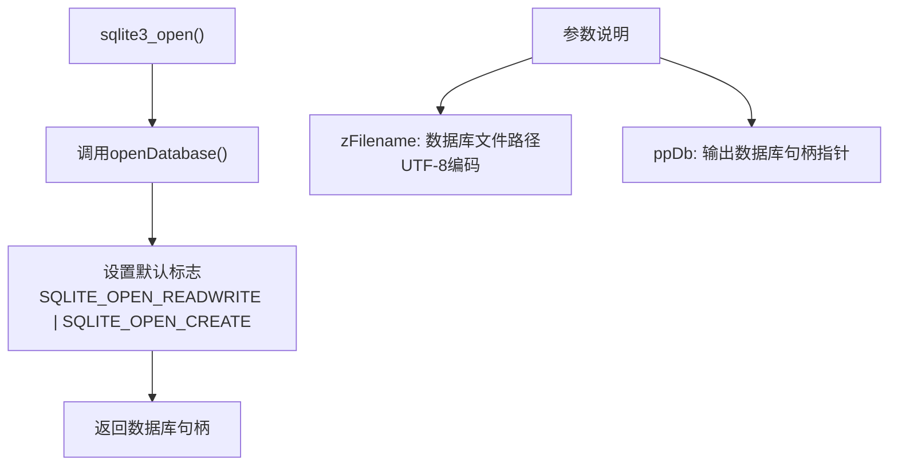

**图表来源**
- [src/main.c](file://src/main.c#L3661-L3667)

### sqlite3_open_v2函数

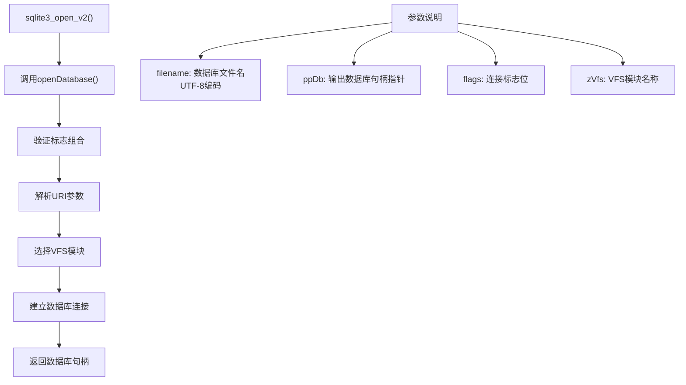

**图表来源**
- [src/main.c](file://src/main.c#L3668-L3675)

### sqlite3_close系列函数

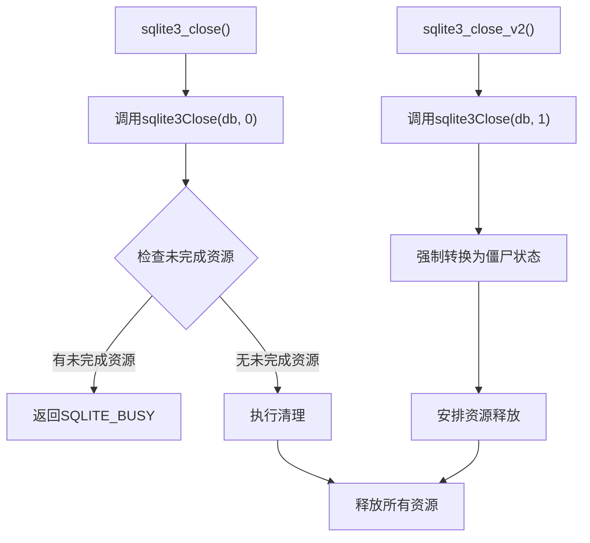

**图表来源**
- [src/main.c](file://src/main.c#L1342-L1343)

**节来源**
- [src/main.c](file://src/main.c#L1342-L1343)
- [src/main.c](file://src/main.c#L3661-L3675)

## 连接建立过程

### openDatabase函数实现

数据库连接的建立通过`openDatabase`函数完成，该函数是所有打开API的核心实现：

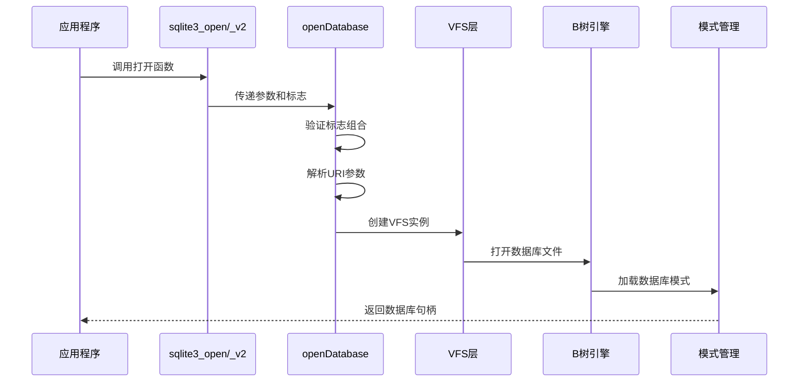

**图表来源**
- [src/main.c](file://src/main.c#L3295-L3700)

### 连接标志详解

SQLite支持多种连接标志，用于控制数据库的访问模式：

| 标志位 | 值 | 含义 | 使用场景 |
|--------|----|----- |----------|
| SQLITE_OPEN_READONLY | 0x01 | 只读访问 | 查询大量数据时提高性能 |
| SQLITE_OPEN_READWRITE | 0x02 | 读写访问 | 需要修改数据的应用 |
| SQLITE_OPEN_CREATE | 0x04 | 创建新数据库 | 首次使用数据库时 |
| SQLITE_OPEN_URI | 0x40 | URI格式文件名 | 支持查询参数的复杂路径 |
| SQLITE_OPEN_MEMORY | 0x08 | 内存数据库 | 临时数据存储 |
| SQLITE_OPEN_NOMUTEX | 0x1000 | 单线程模式 | 非线程安全环境 |
| SQLITE_OPEN_FULLMUTEX | 0x2000 | 完整互斥锁 | 多线程安全访问 |

**节来源**
- [src/main.c](file://src/main.c#L3520-L3540)

## 连接关闭机制

### 关闭流程设计

SQLite的连接关闭机制采用分阶段设计，确保资源的正确释放：

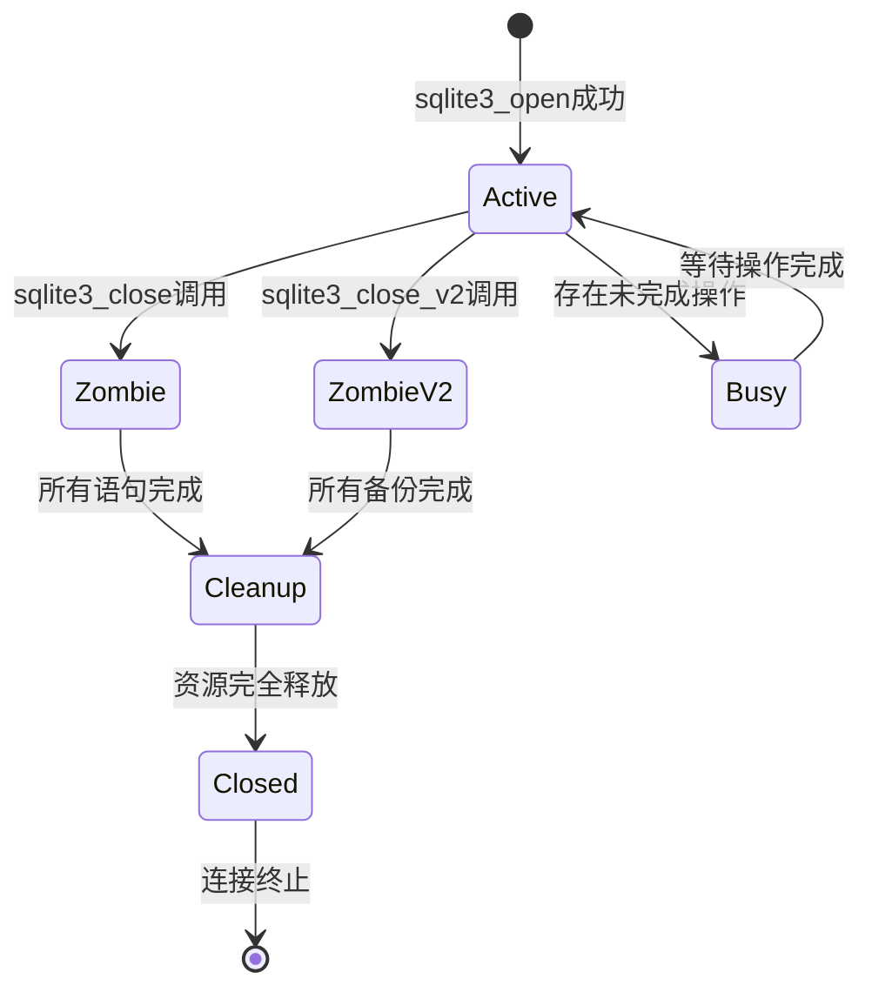

**图表来源**
- [src/main.c](file://src/main.c#L1245-L1301)

### 资源清理过程

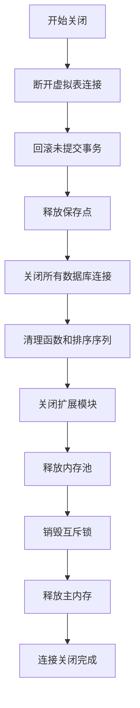

**图表来源**
- [src/main.c](file://src/main.c#L1380-L1440)

**节来源**
- [src/main.c](file://src/main.c#L1245-L1301)
- [src/main.c](file://src/main.c#L1380-L1440)

## 连接对象结构

### sqlite3结构体

每个数据库连接都由`sqlite3`结构体表示，包含连接的所有状态信息：

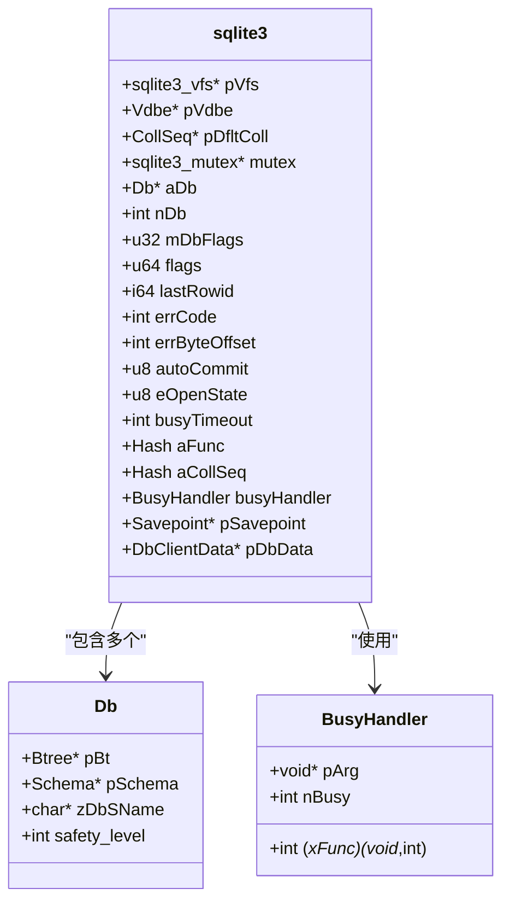

**图表来源**
- [src/sqliteInt.h](file://src/sqliteInt.h#L1658-L1680)

### 连接状态管理

| 状态值 | 名称 | 含义 | 可用操作 |
|--------|------|------|----------|
| SQLITE_STATE_OPEN | OPEN | 正常活跃连接 | 执行SQL语句 |
| SQLITE_STATE_SICK | SICK | 错误状态连接 | 仅可关闭 |
| SQLITE_STATE_ZOMBIE | ZOMBIE | 僵尸状态连接 | 等待资源释放 |
| SQLITE_STATE_ERROR | ERROR | 错误终止 | 已不可用 |
| SQLITE_STATE_CLOSED | CLOSED | 已关闭连接 | 不可用 |

**节来源**
- [src/sqliteInt.h](file://src/sqliteInt.h#L1658-L1700)

## 错误处理与诊断

### 常见错误码

当数据库连接出现问题时，SQLite会返回相应的错误码：

| 错误码 | 符号名 | 描述 | 常见原因 |
|--------|--------|------|----------|
| 1 | SQLITE_ERROR | 通用错误 | SQL语法错误、约束违反 |
| 2 | SQLITE_INTERNAL | 内部错误 | SQLite内部实现问题 |
| 14 | SQLITE_CANTOPEN | 无法打开数据库 | 文件不存在、权限不足 |
| 5 | SQLITE_BUSY | 数据库被锁定 | 其他进程占用、未正确关闭 |
| 6 | SQLITE_LOCKED | 表被锁定 | 并发访问冲突 |
| 7 | SQLITE_NOMEM | 内存不足 | 系统内存耗尽 |
| 8 | SQLITE_READONLY | 只读数据库 | 权限限制、只读挂载 |

### SQLITE_CANTOPEN错误分析

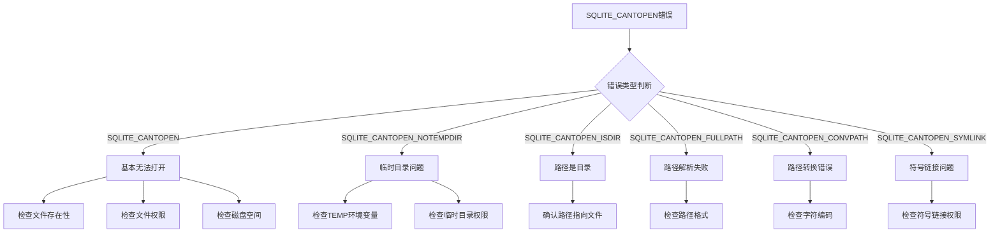

**图表来源**
- [src/main.c](file://src/main.c#L1582-L1587)

**节来源**
- [src/main.c](file://src/main.c#L1574-L1590)
- [src/main.c](file://src/main.c#L1634-L1664)

## 实际使用示例

### 基本连接管理

以下展示了标准的数据库连接生命周期：

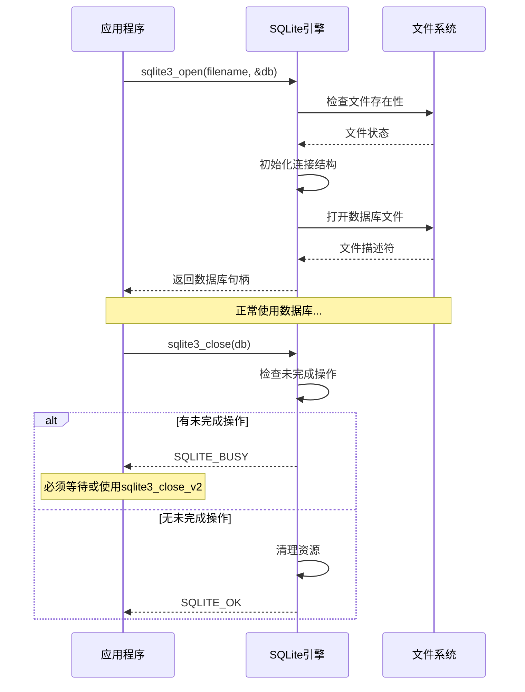

**图表来源**
- [src/test1.c](file://src/test1.c#L678-L724)

### 高级连接配置

对于需要特殊配置的场景，可以使用sqlite3_open_v2：

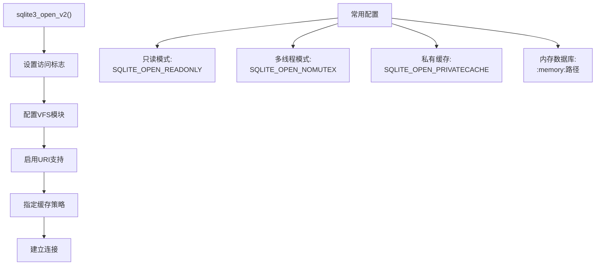

**节来源**
- [src/test1.c](file://src/test1.c#L678-L724)

## 最佳实践

### 连接管理原则

1. **及时关闭连接**：始终确保数据库连接在不再需要时被正确关闭
2. **区分关闭方式**：根据应用需求选择合适的关闭函数
3. **错误处理**：妥善处理连接失败的情况
4. **资源监控**：监控数据库连接的数量和状态

### 推荐的连接模式

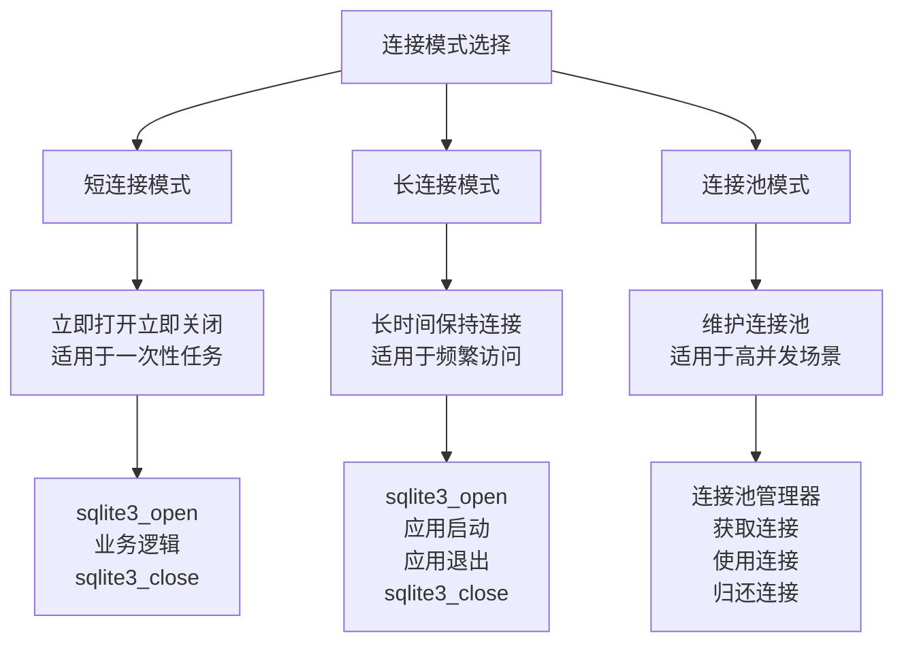

### 性能优化建议

| 场景 | 推荐配置 | 说明 |
|------|----------|------|
| 高并发读取 | SQLITE_OPEN_READONLY + 私有缓存 | 减少锁竞争 |
| 写入密集型 | SQLITE_OPEN_READWRITE + WAL模式 | 提高并发写入性能 |
| 临时数据 | 内存数据库 | 避免磁盘I/O开销 |
| 移动设备 | 小页面大小 + 紧凑模式 | 节省存储空间 |

## 故障排除指南

### 常见问题诊断

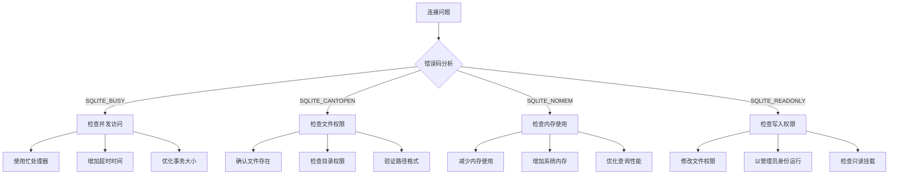

### 调试技巧

1. **启用追踪**：使用`sqlite3_trace()`或`sqlite3_profile()`监控连接活动
2. **错误日志**：通过`sqlite3_log()`记录详细的错误信息
3. **状态检查**：使用`sqlite3_db_status()`获取连接统计信息
4. **内存监控**：跟踪`sqlite3_memory_used()`和`sqlite3_memory_highwater()`

### 性能监控指标

| 指标 | 含义 | 正常范围 | 异常处理 |
|------|------|----------|----------|
| 连接数 | 当前活跃连接数量 | < 100 | 检查连接泄漏 |
| 内存使用 | 数据库使用的内存量 | < 100MB | 优化查询或增加内存 |
| 缓存命中率 | 页面缓存命中比例 | > 90% | 调整缓存大小 |
| 锁等待时间 | 平均锁等待延迟 | < 10ms | 优化并发策略 |

通过遵循这些最佳实践和故障排除指南，开发者可以有效地管理和优化SQLite数据库连接，确保应用程序的稳定性和性能。