# 结果集处理

<cite>
**本文档引用的文件**
- [vdbeapi.c](file://src/vdbeapi.c)
- [vdbe.c](file://src/vdbe.c)
- [vdbemem.c](file://src/vdbemem.c)
- [vdbeInt.h](file://src/vdbeInt.h)
- [vdbeaux.c](file://src/vdbeaux.c)
- [select.c](file://src/select.c)
- [test1.c](file://src/test1.c)
</cite>

## 目录
1. [简介](#简介)
2. [核心API函数概览](#核心api函数概览)
3. [结果集结构与内存管理](#结果集结构与内存管理)
4. [数据类型映射系统](#数据类型映射系统)
5. [虚拟机寄存器操作机制](#虚拟机寄存器操作机制)
6. [NULL值处理策略](#null值处理策略)
7. [字符串指针生命周期管理](#字符串指针生命周期管理)
8. [复杂查询结果提取示例](#复杂查询结果提取示例)
9. [性能优化考虑](#性能优化考虑)
10. [最佳实践指南](#最佳实践指南)

## 简介

SQLite的结果集处理API提供了从查询执行到数据提取的完整解决方案。这些API建立在虚拟数据库引擎（VDBE）之上，通过一系列精心设计的函数实现了高效、安全的结果集访问。本文档深入探讨了`sqlite3_column_count`、`sqlite3_column_name`、`sqlite3_column_type`、`sqlite3_column_text`、`sqlite3_column_int64`等核心函数的工作原理，以及它们与底层虚拟机寄存器系统的交互机制。

## 核心API函数概览

SQLite结果集处理API包含以下关键函数：

### 基础信息获取函数

| 函数名 | 功能描述 | 返回类型 |
|--------|----------|----------|
| `sqlite3_column_count` | 获取结果集列数 | `int` |
| `sqlite3_data_count` | 获取当前行可用值数量 | `int` |
| `sqlite3_column_name` | 获取指定列的名称 | `const char*` |

### 数据类型转换函数

| 函数名 | 功能描述 | 返回类型 |
|--------|----------|----------|
| `sqlite3_column_type` | 获取列的数据类型 | `int` |
| `sqlite3_column_int` | 转换为整数类型 | `int` |
| `sqlite3_column_int64` | 转换为64位整数类型 | `sqlite_int64` |
| `sqlite3_column_double` | 转换为浮点数类型 | `double` |
| `sqlite3_column_text` | 转换为文本类型 | `const unsigned char*` |
| `sqlite3_column_blob` | 转换为二进制类型 | `const void*` |
| `sqlite3_column_bytes` | 获取字节长度 | `int` |

### 底层实现架构

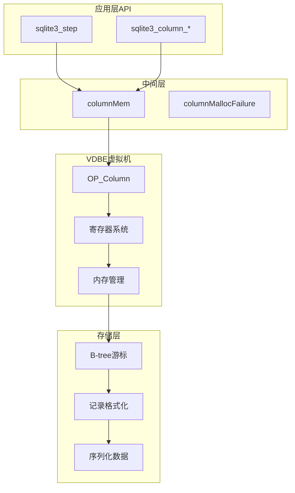
```mermaid
graph TB
subgraph "应用层API"
A[sqlite3_step]
B[sqlite3_column_*]
end
subgraph "中间层"
C[columnMem]
D[columnMallocFailure]
end
subgraph "VDBE虚拟机"
E[OP_Column]
F[寄存器系统]
G[内存管理]
end
subgraph "存储层"
H[B-tree游标]
I[记录格式化]
J[序列化数据]
end
A --> C
B --> C
C --> E
E --> F
F --> G
G --> H
H --> I
I --> J
```

**图表来源**
- [vdbeapi.c](file://src/vdbeapi.c#L1307-L1322)
- [vdbe.c](file://src/vdbe.c#L2947-L2974)

**章节来源**
- [vdbeapi.c](file://src/vdbeapi.c#L1247-L1422)

## 结果集结构与内存管理

### Mem结构体设计

SQLite使用`Mem`结构体作为内部表示，该结构体支持多种数据类型的缓存：

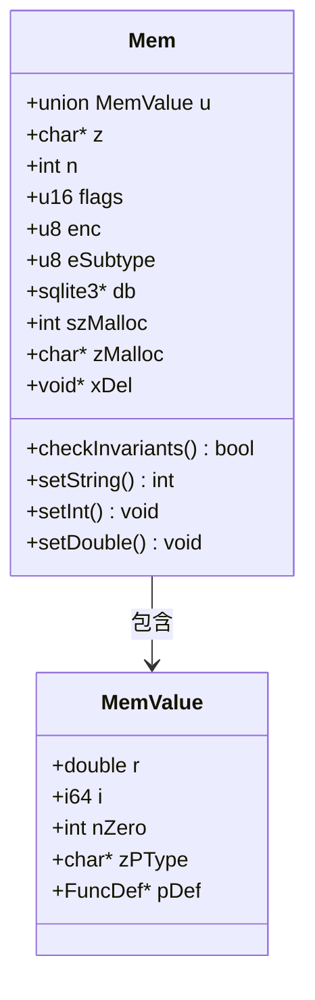
```mermaid
classDiagram
class Mem {
+union MemValue u
+char* z
+int n
+u16 flags
+u8 enc
+u8 eSubtype
+sqlite3* db
+int szMalloc
+char* zMalloc
+void* xDel
+checkInvariants() bool
+setString() int
+setInt() void
+setDouble() void
}
class MemValue {
+double r
+i64 i
+int nZero
+char* zPType
+FuncDef* pDef
}
Mem --> MemValue : 包含
```

**图表来源**
- [vdbeInt.h](file://src/vdbeInt.h#L226-L261)

### 内存标志位系统

SQLite使用位掩码系统来跟踪内存状态：

| 标志位 | 值 | 含义 |
|--------|-----|------|
| `MEM_Null` | 0x0001 | SQL NULL值 |
| `MEM_Str` | 0x0002 | 字符串值 |
| `MEM_Int` | 0x0004 | 整数值 |
| `MEM_Real` | 0x0008 | 浮点数值 |
| `MEM_Blob` | 0x0010 | 二进制大对象 |
| `MEM_IntReal` | 0x0020 | 整数形式的实数 |

### 列表存取机制

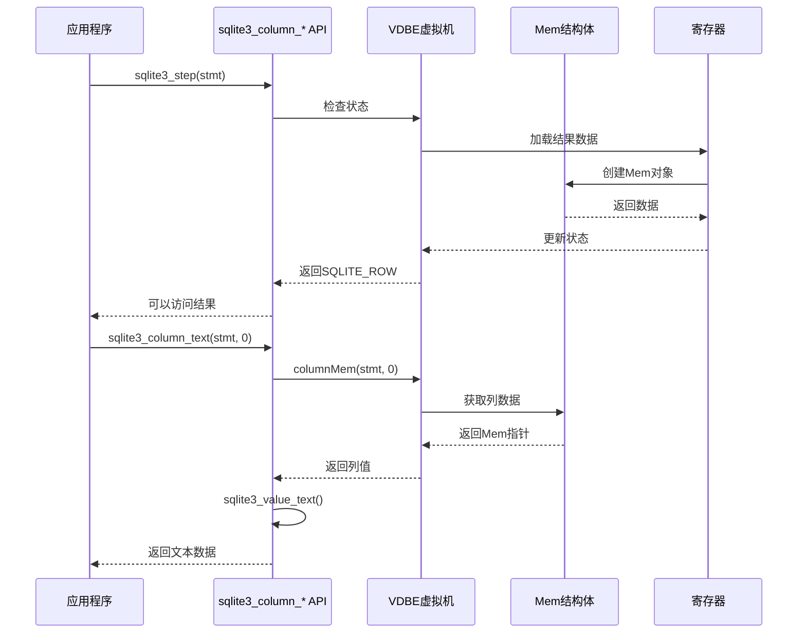
```mermaid
sequenceDiagram
participant App as 应用程序
participant API as sqlite3_column_* API
participant VM as VDBE虚拟机
participant Mem as Mem结构体
participant Reg as 寄存器
App->>API : sqlite3_step(stmt)
API->>VM : 检查状态
VM->>Reg : 加载结果数据
Reg->>Mem : 创建Mem对象
Mem-->>Reg : 返回数据
Reg-->>VM : 更新状态
VM-->>API : 返回SQLITE_ROW
API-->>App : 可以访问结果
App->>API : sqlite3_column_text(stmt, 0)
API->>VM : columnMem(stmt, 0)
VM->>Mem : 获取列数据
Mem-->>VM : 返回Mem指针
VM-->>API : 返回列值
API->>API : sqlite3_value_text()
API-->>App : 返回文本数据
```

**图表来源**
- [vdbeapi.c](file://src/vdbeapi.c#L1307-L1322)
- [vdbe.c](file://src/vdbe.c#L2947-L2974)

**章节来源**
- [vdbeapi.c](file://src/vdbeapi.c#L1307-L1322)
- [vdbeInt.h](file://src/vdbeInt.h#L263-L293)

## 数据类型映射系统

### 类型检测算法

SQLite使用复杂的类型检测算法来确定列的实际数据类型：

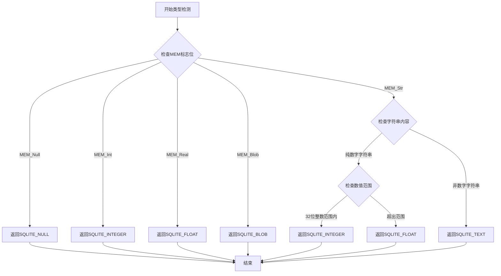
```mermaid
flowchart TD
A[开始类型检测] --> B{检查MEM标志位}
B --> |MEM_Null| C[返回SQLITE_NULL]
B --> |MEM_Int| D[返回SQLITE_INTEGER]
B --> |MEM_Real| E[返回SQLITE_FLOAT]
B --> |MEM_Str| F{检查字符串内容}
B --> |MEM_Blob| G[返回SQLITE_BLOB]
F --> |纯数字字符串| H{检查数值范围}
H --> |32位整数范围内| I[返回SQLITE_INTEGER]
H --> |超出范围| J[返回SQLITE_FLOAT]
F --> |非数字字符串| K[返回SQLITE_TEXT]
C --> L[结束]
D --> L
E --> L
G --> L
I --> L
J --> L
K --> L
```

**图表来源**
- [vdbeapi.c](file://src/vdbeapi.c#L252-L330)

### 类型映射表

SQLite维护了一个复杂的类型映射表来处理各种组合标志位：

| 标志位组合 | 映射类型 | 描述 |
|------------|----------|------|
| `0x01` | `SQLITE_NULL` | 纯NULL值 |
| `0x04` | `SQLITE_INTEGER` | 整数值 |
| `0x08` | `SQLITE_FLOAT` | 浮点数值 |
| `0x10` | `SQLITE_BLOB` | 二进制数据 |
| `0x02` | `SQLITE_TEXT` | 文本数据 |
| `0x06` | `SQLITE_INTEGER` | 整数+文本 |
| `0x0a` | `SQLITE_FLOAT` | 浮点+文本 |
| `0x14` | `SQLITE_INTEGER` | 整数+二进制 |
| `0x18` | `SQLITE_FLOAT` | 浮点+二进制 |

### 数值转换机制

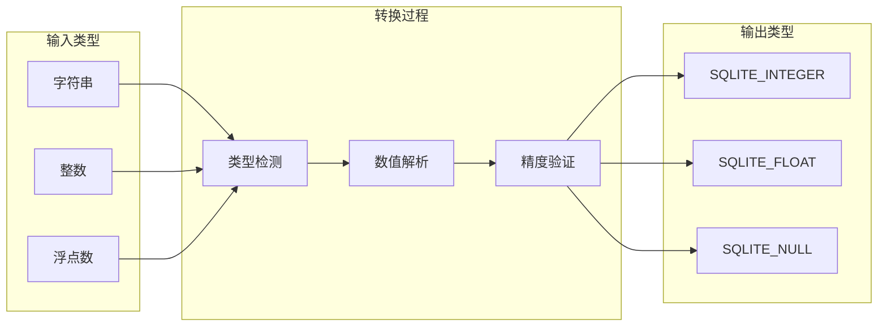
```mermaid
graph LR
subgraph "输入类型"
A[字符串]
B[整数]
C[浮点数]
end
subgraph "转换过程"
D[类型检测]
E[数值解析]
F[精度验证]
end
subgraph "输出类型"
G[SQLITE_INTEGER]
H[SQLITE_FLOAT]
I[SQLITE_NULL]
end
A --> D
B --> D
C --> D
D --> E
E --> F
F --> G
F --> H
F --> I
```

**图表来源**
- [vdbeapi.c](file://src/vdbeapi.c#L252-L330)

**章节来源**
- [vdbeapi.c](file://src/vdbeapi.c#L252-L330)

## 虚拟机寄存器操作机制

### OP_Column指令详解

`OP_Column`是VDBE中处理结果集访问的核心指令：

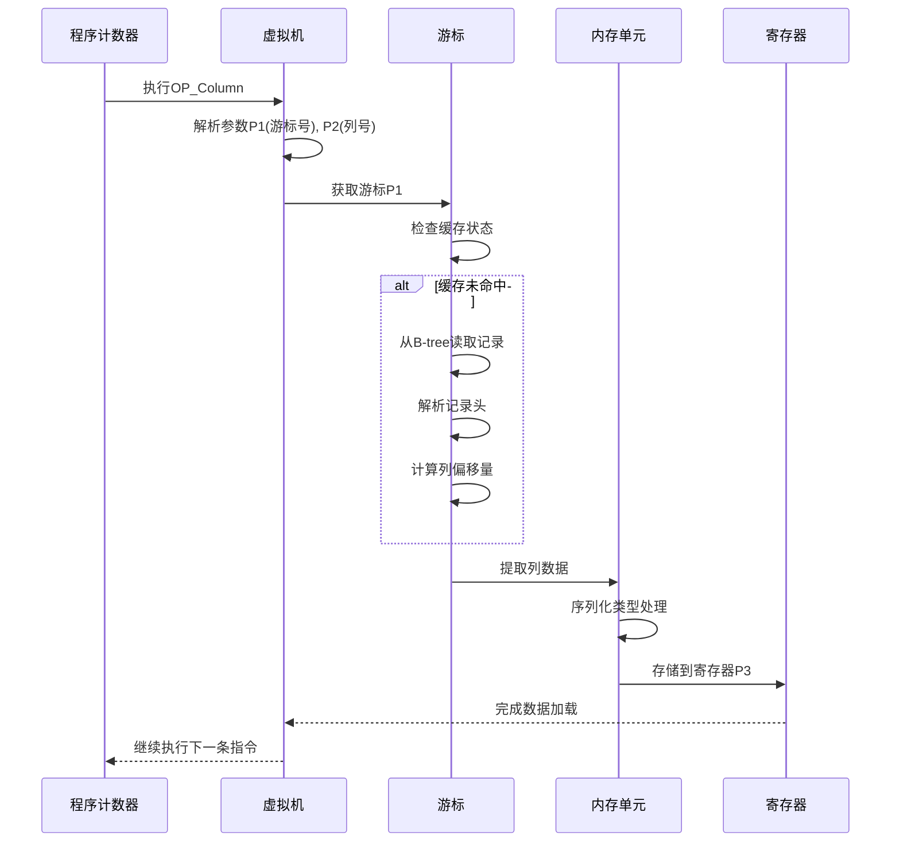
```mermaid
sequenceDiagram
participant PC as 程序计数器
participant VM as 虚拟机
participant Cursor as 游标
participant Mem as 内存单元
participant Reg as 寄存器
PC->>VM : 执行OP_Column
VM->>VM : 解析参数P1(游标号), P2(列号)
VM->>Cursor : 获取游标P1
Cursor->>Cursor : 检查缓存状态
alt 缓存未命中
Cursor->>Cursor : 从B-tree读取记录
Cursor->>Cursor : 解析记录头
Cursor->>Cursor : 计算列偏移量
end
Cursor->>Mem : 提取列数据
Mem->>Mem : 序列化类型处理
Mem->>Reg : 存储到寄存器P3
Reg-->>VM : 完成数据加载
VM-->>PC : 继续执行下一条指令
```

**图表来源**
- [vdbe.c](file://src/vdbe.c#L2947-L2974)

### 寄存器分配策略

VDBE使用分层寄存器分配策略：

1. **游标专用寄存器**：用于存储游标状态
2. **临时计算寄存器**：用于中间计算
3. **结果寄存器**：存储最终查询结果

### 数据传递优化

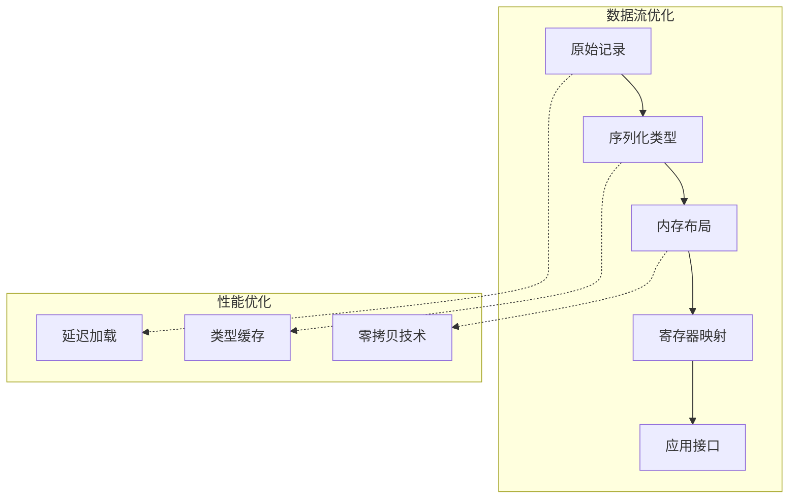
```mermaid
graph TB
subgraph "数据流优化"
A[原始记录] --> B[序列化类型]
B --> C[内存布局]
C --> D[寄存器映射]
D --> E[应用接口]
end
subgraph "性能优化"
F[延迟加载]
G[类型缓存]
H[零拷贝技术]
end
A -.-> F
B -.-> G
C -.-> H
```

**图表来源**
- [vdbe.c](file://src/vdbe.c#L2947-L2974)

**章节来源**
- [vdbe.c](file://src/vdbe.c#L2947-L2974)

## NULL值处理策略

### NULL值的内部表示

SQLite使用多种标志位组合来精确表示NULL值的不同变体：

| 标志位组合 | 含义 | 用途 |
|------------|------|------|
| `MEM_Null` | 纯NULL值 | 标准SQL NULL |
| `MEM_Null \| MEM_Zero` | NULL且无变更标记 | 虚拟表更新时的不变列 |
| `MEM_Null \| MEM_Term \| MEM_Subtype` | NULL指针 | 使用`sqlite3_bind_pointer()`设置的NULL指针 |

### NULL值处理流程

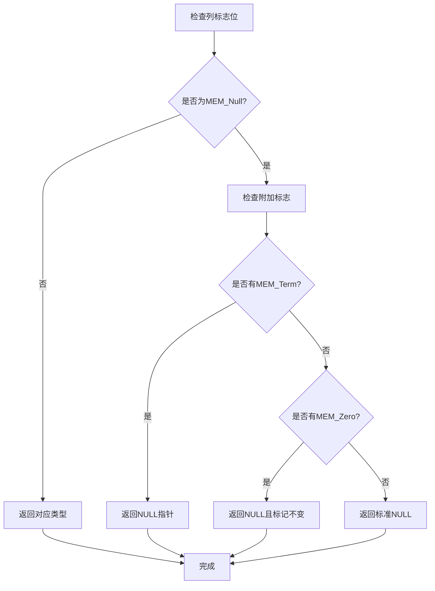
```mermaid
flowchart TD
A[检查列标志位] --> B{是否为MEM_Null?}
B --> |是| C[检查附加标志]
B --> |否| D[返回对应类型]
C --> E{是否有MEM_Term?}
E --> |是| F[返回NULL指针]
E --> |否| G{是否有MEM_Zero?}
G --> |是| H[返回NULL且标记不变]
G --> |否| I[返回标准NULL]
D --> J[完成]
F --> J
H --> J
I --> J
```

**图表来源**
- [vdbeapi.c](file://src/vdbeapi.c#L1180-L1220)

### NULL值安全性检查

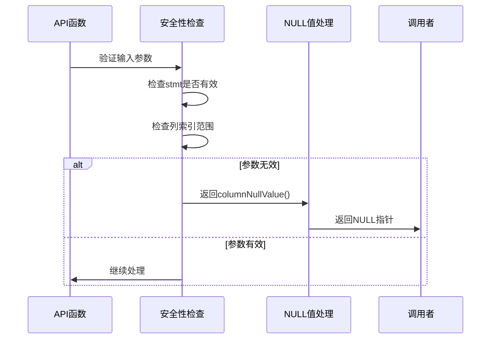
```mermaid
sequenceDiagram
participant API as API函数
participant Safety as 安全性检查
participant NullVal as NULL值处理
participant Caller as 调用者
API->>Safety : 验证输入参数
Safety->>Safety : 检查stmt是否有效
Safety->>Safety : 检查列索引范围
alt 参数无效
Safety->>NullVal : 返回columnNullValue()
NullVal->>Caller : 返回NULL指针
else 参数有效
Safety->>API : 继续处理
end
```

**图表来源**
- [vdbeapi.c](file://src/vdbeapi.c#L1180-L1220)

**章节来源**
- [vdbeapi.c](file://src/vdbeapi.c#L1180-L1220)

## 字符串指针生命周期管理

### 内存管理模式

SQLite采用多种内存管理模式来确保字符串指针的安全性：

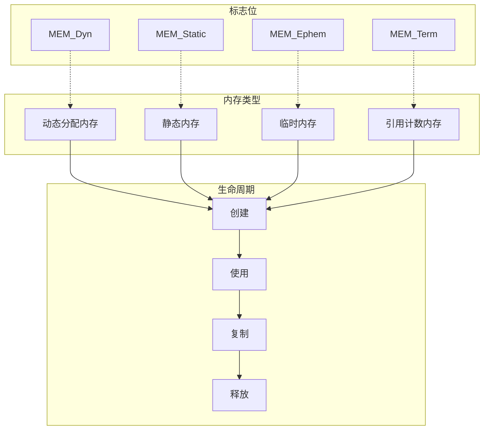
```mermaid
graph TB
subgraph "内存类型"
A[动态分配内存]
B[静态内存]
C[临时内存]
D[引用计数内存]
end
subgraph "生命周期"
E[创建]
F[使用]
G[复制]
H[释放]
end
subgraph "标志位"
I[MEM_Dyn]
J[MEM_Static]
K[MEM_Ephem]
L[MEM_Term]
end
A --> E
B --> E
C --> E
D --> E
E --> F
F --> G
G --> H
I -.-> A
J -.-> B
K -.-> C
L -.-> D
```

**图表来源**
- [vdbemem.c](file://src/vdbemem.c#L1138-L1169)

### 字符串生命周期阶段

1. **创建阶段**：字符串首次生成
2. **使用阶段**：字符串被应用程序访问
3. **复制阶段**：字符串被复制到新位置
4. **释放阶段**：字符串内存被回收

### 生命周期管理策略

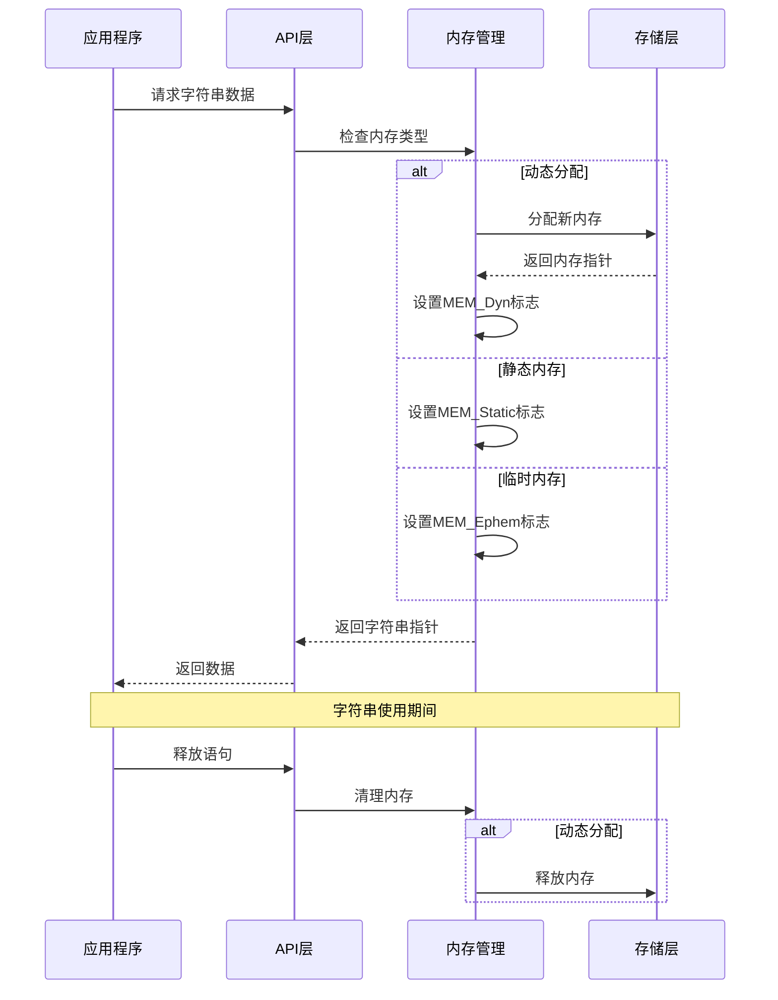
```mermaid
sequenceDiagram
participant App as 应用程序
participant API as API层
participant Mem as 内存管理
participant Storage as 存储层
App->>API : 请求字符串数据
API->>Mem : 检查内存类型
alt 动态分配
Mem->>Storage : 分配新内存
Storage-->>Mem : 返回内存指针
Mem->>Mem : 设置MEM_Dyn标志
else 静态内存
Mem->>Mem : 设置MEM_Static标志
else 临时内存
Mem->>Mem : 设置MEM_Ephem标志
end
Mem-->>API : 返回字符串指针
API-->>App : 返回数据
Note over App,Storage : 字符串使用期间
App->>API : 释放语句
API->>Mem : 清理内存
alt 动态分配
Mem->>Storage : 释放内存
end
```

**图表来源**
- [vdbemem.c](file://src/vdbemem.c#L1138-L1169)

**章节来源**
- [vdbemem.c](file://src/vdbemem.c#L1138-L1169)

## 复杂查询结果提取示例

### 混合类型数据提取

以下展示了如何从复杂查询中安全地提取混合类型数据：

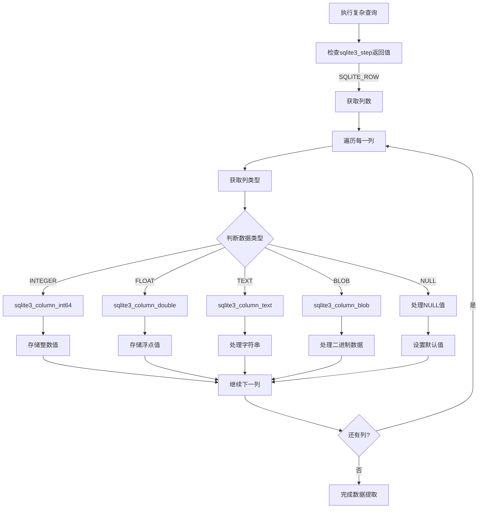
```mermaid
flowchart TD
A[执行复杂查询] --> B[检查sqlite3_step返回值]
B --> |SQLITE_ROW| C[获取列数]
C --> D[遍历每一列]
D --> E[获取列类型]
E --> F{判断数据类型}
F --> |INTEGER| G[sqlite3_column_int64]
F --> |FLOAT| H[sqlite3_column_double]
F --> |TEXT| I[sqlite3_column_text]
F --> |BLOB| J[sqlite3_column_blob]
F --> |NULL| K[处理NULL值]
G --> L[存储整数值]
H --> M[存储浮点值]
I --> N[处理字符串]
J --> O[处理二进制数据]
K --> P[设置默认值]
L --> Q[继续下一列]
M --> Q
N --> Q
O --> Q
P --> Q
Q --> R{还有列?}
R --> |是| D
R --> |否| S[完成数据提取]
```

### 实际应用场景

1. **报表生成**：从多表连接查询中提取统计数据
2. **数据迁移**：在不同数据库间传输混合类型数据
3. **数据分析**：处理包含多种数据类型的分析查询
4. **API响应**：构建包含多种类型字段的JSON响应

### 错误处理模式

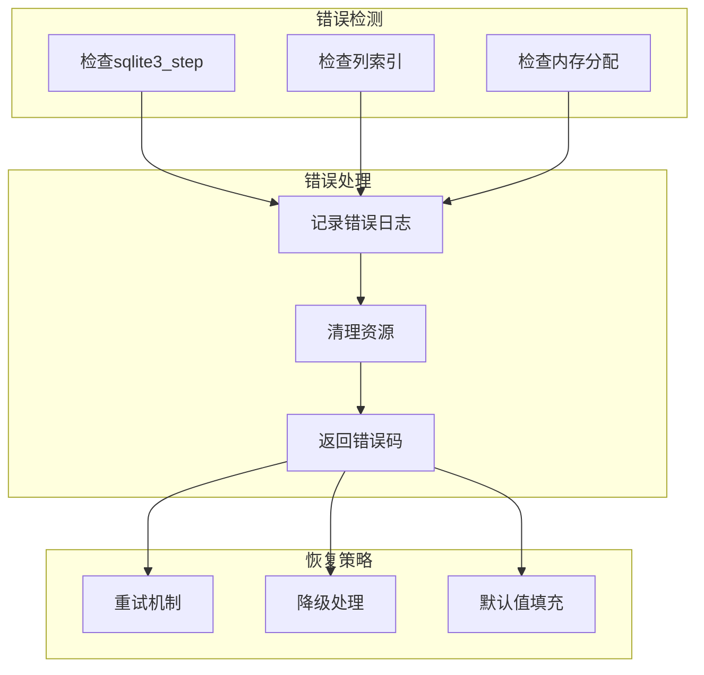
```mermaid
graph TB
subgraph "错误检测"
A[检查sqlite3_step]
B[检查列索引]
C[检查内存分配]
end
subgraph "错误处理"
D[记录错误日志]
E[清理资源]
F[返回错误码]
end
subgraph "恢复策略"
G[重试机制]
H[降级处理]
I[默认值填充]
end
A --> D
B --> D
C --> D
D --> E
E --> F
F --> G
F --> H
F --> I
```

**章节来源**
- [test1.c](file://src/test1.c#L9141-L9159)

## 性能优化考虑

### 缓存策略

SQLite实现了多层次的缓存机制来提高结果集访问性能：

1. **游标缓存**：缓存最近访问的记录
2. **类型缓存**：缓存列类型信息
3. **字符串缓存**：缓存频繁访问的字符串

### 内存预分配

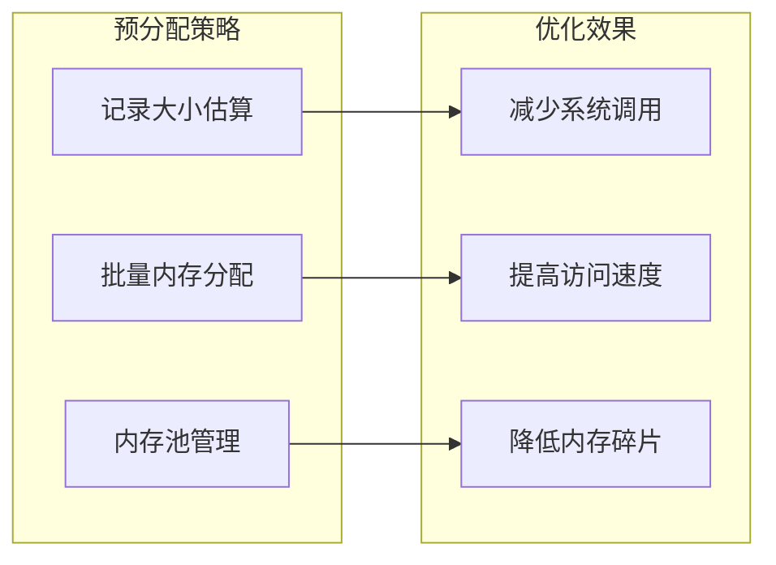
```mermaid
graph LR
subgraph "预分配策略"
A[记录大小估算]
B[批量内存分配]
C[内存池管理]
end
subgraph "优化效果"
D[减少系统调用]
E[提高访问速度]
F[降低内存碎片]
end
A --> D
B --> E
C --> F
```

### 延迟加载机制

对于大型BLOB和文本数据，SQLite采用延迟加载策略：

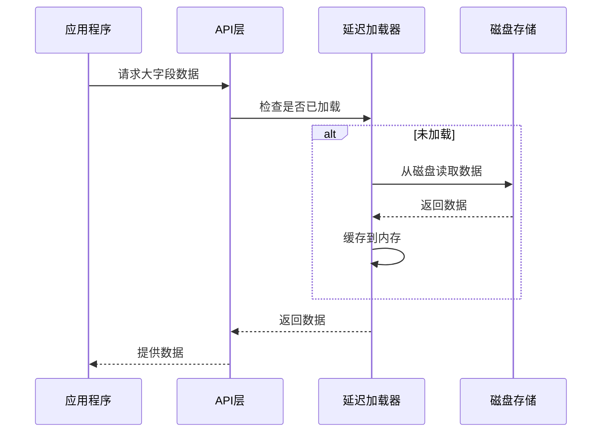
```mermaid
sequenceDiagram
participant App as 应用程序
participant API as API层
participant Lazy as 延迟加载器
participant Disk as 磁盘存储
App->>API : 请求大字段数据
API->>Lazy : 检查是否已加载
alt 未加载
Lazy->>Disk : 从磁盘读取数据
Disk-->>Lazy : 返回数据
Lazy->>Lazy : 缓存到内存
end
Lazy-->>API : 返回数据
API-->>App : 提供数据
```

**章节来源**
- [vdbe.c](file://src/vdbe.c#L2947-L2974)

## 最佳实践指南

### 安全编程模式

1. **始终检查返回值**：每次调用结果集API后都检查返回值
2. **正确处理NULL**：对可能为NULL的返回值进行检查
3. **避免重复访问**：缓存频繁访问的列值
4. **及时释放资源**：在不再需要时调用`sqlite3_finalize`

### 性能优化建议

1. **预编译查询**：对于重复执行的查询使用预编译
2. **批量处理**：尽可能批量处理多行数据
3. **选择合适的数据类型**：根据数据特点选择最优的数据类型
4. **监控内存使用**：关注大结果集的内存占用

### 错误处理策略

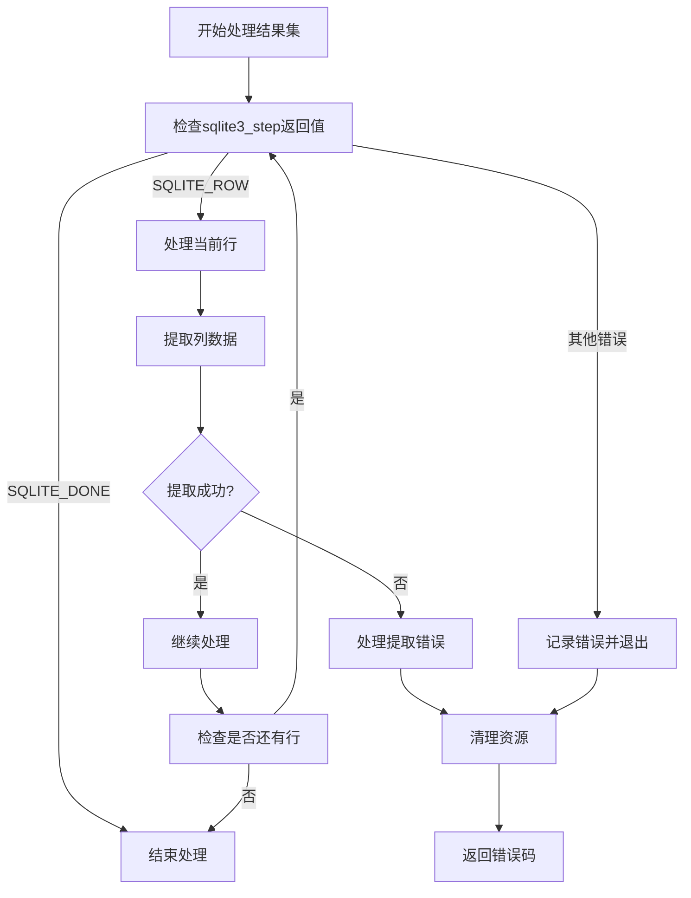
```mermaid
flowchart TD
A[开始处理结果集] --> B[检查sqlite3_step返回值]
B --> |SQLITE_ROW| C[处理当前行]
B --> |SQLITE_DONE| D[结束处理]
B --> |其他错误| E[记录错误并退出]
C --> F[提取列数据]
F --> G{提取成功?}
G --> |是| H[继续处理]
G --> |否| I[处理提取错误]
H --> J[检查是否还有行]
J --> |是| B
J --> |否| D
I --> K[清理资源]
E --> K
K --> L[返回错误码]
```

### 内存管理最佳实践

1. **避免深拷贝**：利用SQLite的引用计数机制
2. **及时释放**：在不需要时立即释放资源
3. **监控泄漏**：定期检查内存使用情况
4. **合理配置**：根据应用需求调整内存限制

通过遵循这些最佳实践，开发者可以充分利用SQLite结果集处理API的强大功能，同时确保应用程序的稳定性和性能。