# 预编译语句

<cite>
**本文档中引用的文件**
- [vdbeapi.c](file://src/vdbeapi.c)
- [prepare.c](file://src/prepare.c)
- [vdbe.c](file://src/vdbe.c)
- [vdbe.h](file://src/vdbe.h)
- [vdbeInt.h](file://src/vdbeInt.h)
- [sqliteInt.h](file://src/sqliteInt.h)
- [sqlite3ext.h](file://src/sqlite3ext.h)
</cite>

## 目录
1. [简介](#简介)
2. [项目结构概览](#项目结构概览)
3. [核心组件](#核心组件)
4. [架构概览](#架构概览)
5. [详细组件分析](#详细组件分析)
6. [依赖关系分析](#依赖关系分析)
7. [性能考虑](#性能考虑)
8. [故障排除指南](#故障排除指南)
9. [结论](#结论)

## 简介

SQLite的预编译语句系统是其核心功能之一，提供了高效、安全的SQL执行机制。通过将SQL语句编译为字节码并在虚拟数据库引擎（VDBE）中执行，预编译语句实现了SQL注入防护、批量操作优化和资源管理等关键特性。

本文档深入分析SQLite中预编译语句的相关API，包括`sqlite3_prepare_v2`、`sqlite3_step`、`sqlite3_finalize`、`sqlite3_reset`和`sqlite3_clear_bindings`等核心函数，以及它们在防止SQL注入和提升批量操作性能方面的作用。

## 项目结构概览

SQLite的预编译语句实现分布在多个关键文件中：

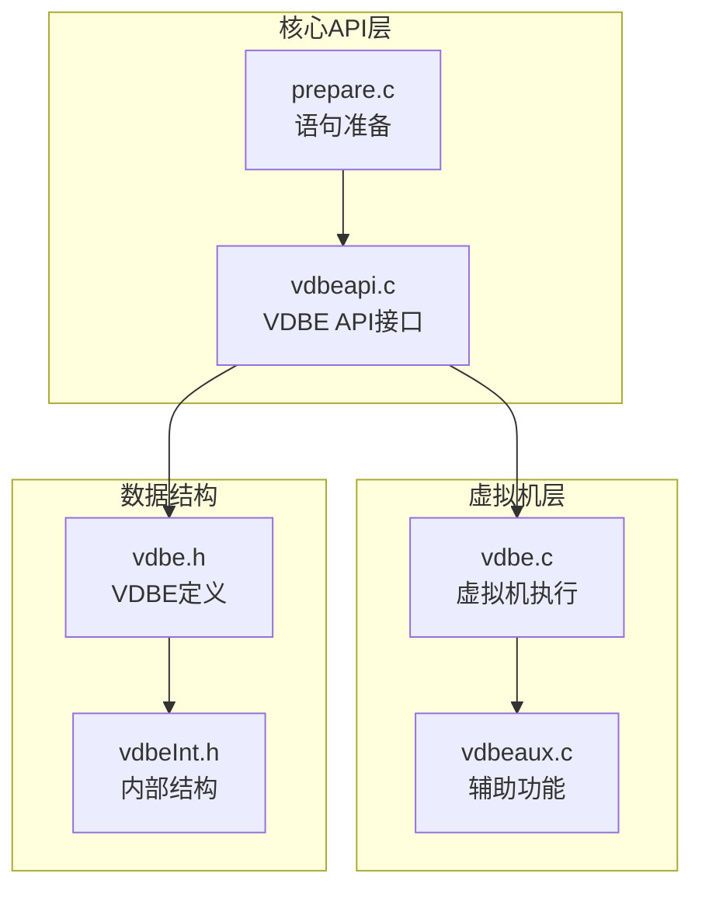

**图表来源**
- [vdbeapi.c](file://src/vdbeapi.c#L1-L50)
- [prepare.c](file://src/prepare.c#L1-L50)
- [vdbe.c](file://src/vdbe.c#L1-L50)

## 核心组件

### 预编译语句生命周期

预编译语句的完整生命周期包含以下阶段：

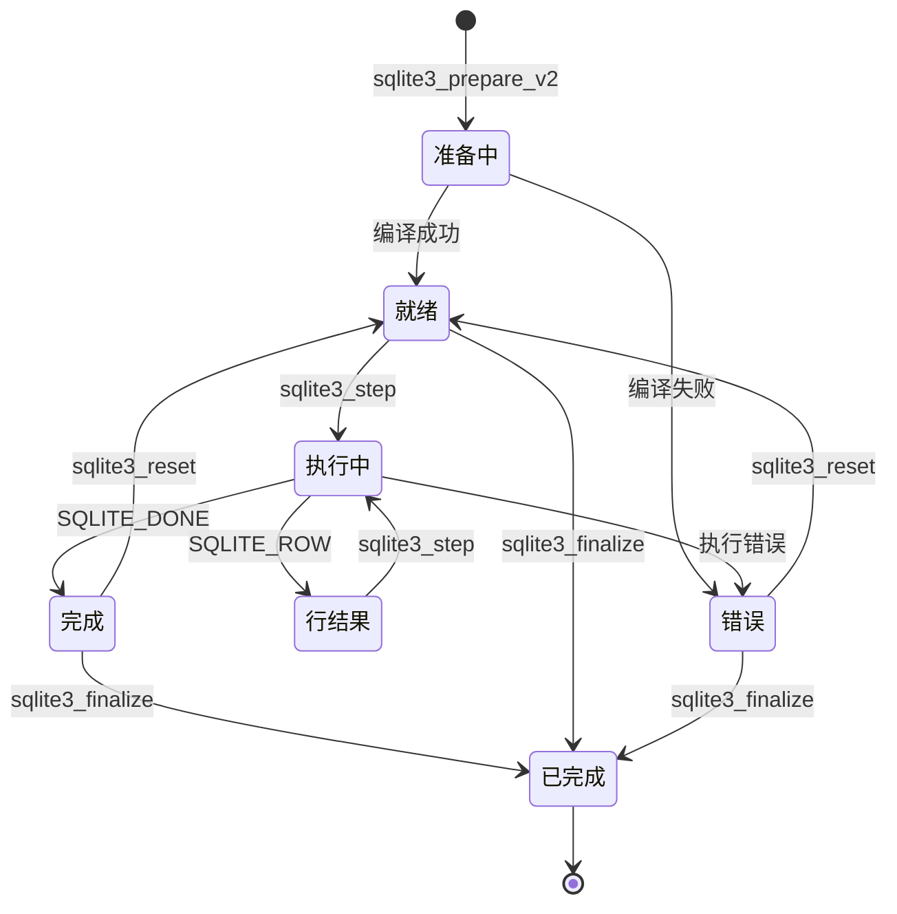

**图表来源**
- [vdbeapi.c](file://src/vdbeapi.c#L119-L174)
- [vdbeInt.h](file://src/vdbeInt.h#L680-L690)

### 绑定参数系统

SQLite支持多种类型的参数绑定：

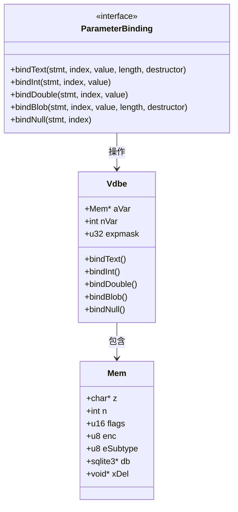

**图表来源**
- [vdbeapi.c](file://src/vdbeapi.c#L1609-L1656)
- [vdbeInt.h](file://src/vdbeInt.h#L350-L400)

**章节来源**
- [vdbeapi.c](file://src/vdbeapi.c#L1609-L1859)
- [vdbeInt.h](file://src/vdbeInt.h#L350-L450)

## 架构概览

### 预编译语句架构

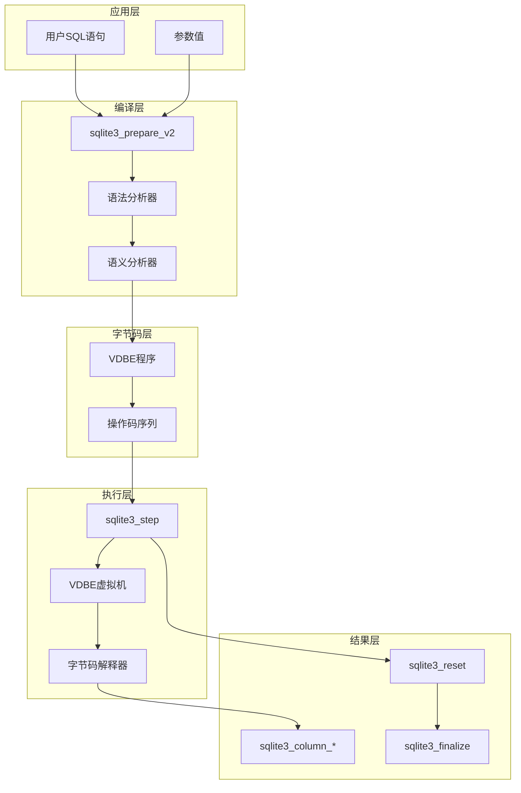

**图表来源**
- [prepare.c](file://src/prepare.c#L600-L700)
- [vdbe.c](file://src/vdbe.c#L839-L916)

## 详细组件分析

### sqlite3_prepare_v2 - 语句准备

语句准备是预编译过程的第一步，负责将SQL文本转换为可执行的字节码程序。

#### 核心功能
- **SQL解析**：将用户提供的SQL字符串分解为语法树
- **语义分析**：验证表结构、列存在性等
- **字节码生成**：将语法树转换为VDBE操作码序列
- **参数识别**：识别SQL中的参数占位符

#### 实现特点
- 支持UTF-8编码的SQL文本
- 参数化查询支持（?、:param格式）
- 编译时错误检测和报告
- 资源分配和初始化

**章节来源**
- [prepare.c](file://src/prepare.c#L600-L800)

### sqlite3_step - 语句执行

`sqlite3_step`是执行预编译语句的核心函数，控制虚拟机的运行状态。

#### 执行状态机

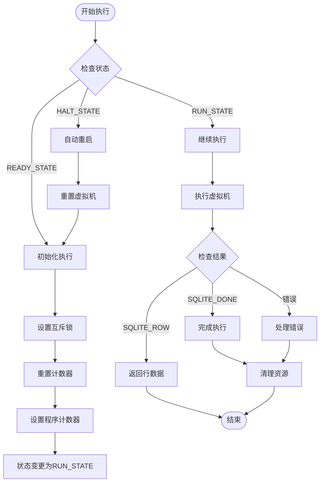

**图表来源**
- [vdbeapi.c](file://src/vdbeapi.c#L756-L872)
- [vdbe.c](file://src/vdbe.c#L839-L916)

#### 状态转换机制

VDBE具有四种主要状态，每种状态对应不同的执行阶段：

| 状态 | 值 | 描述 |
|------|-----|------|
| VDBE_INIT_STATE | 0 | 语句正在构建中 |
| VDBE_READY_STATE | 1 | 准备就绪，等待执行 |
| VDBE_RUN_STATE | 2 | 正在执行中 |
| VDBE_HALT_STATE | 3 | 执行完成或已停止 |

**章节来源**
- [vdbeapi.c](file://src/vdbeapi.c#L756-L872)
- [vdbeInt.h](file://src/vdbeInt.h#L680-L690)

### sqlite3_finalize - 资源清理

`sqlite3_finalize`负责释放预编译语句占用的所有资源。

#### 清理流程

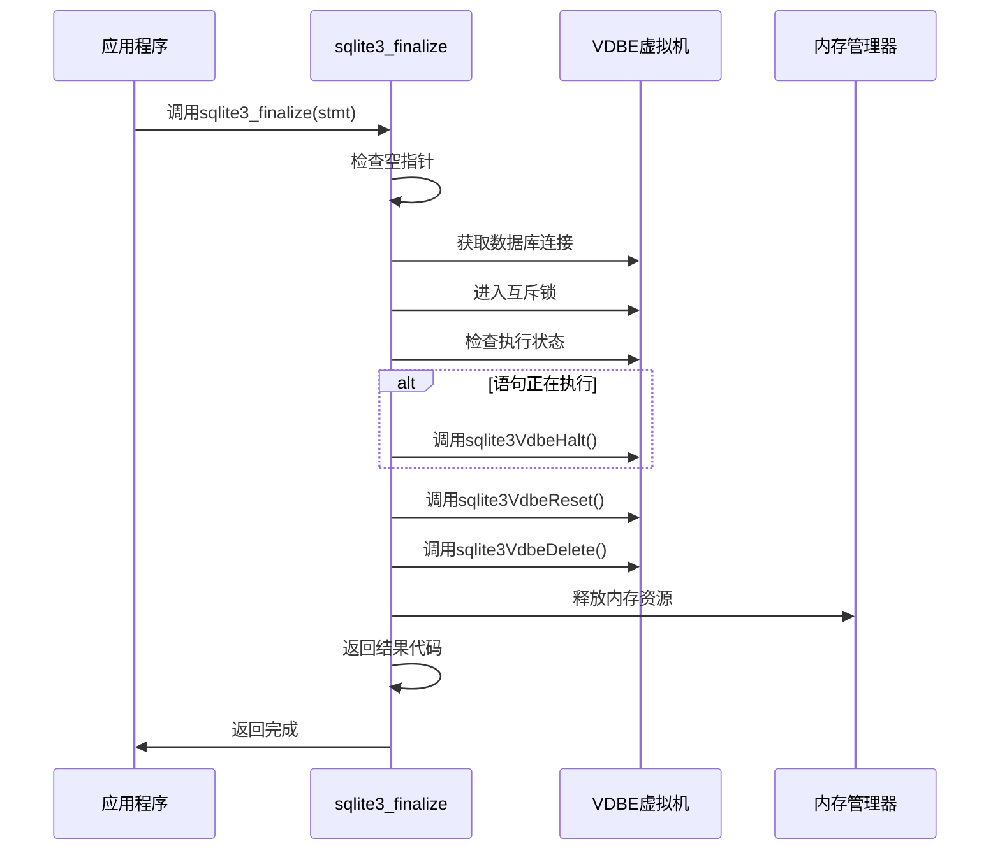

**图表来源**
- [vdbeapi.c](file://src/vdbeapi.c#L64-L118)

**章节来源**
- [vdbeapi.c](file://src/vdbeapi.c#L64-L118)

### 参数绑定系统

#### 绑定类型和处理

SQLite支持多种数据类型的参数绑定：

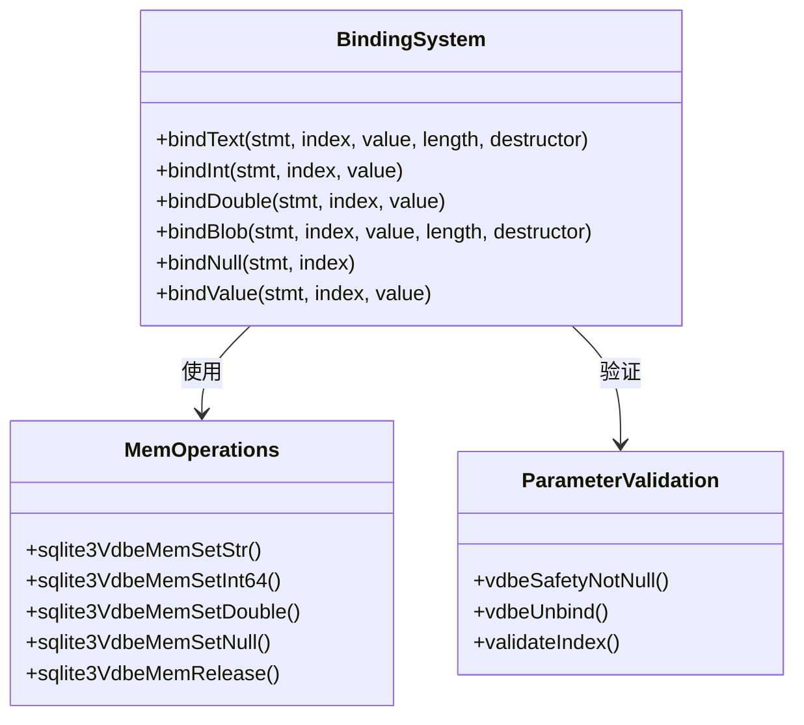

**图表来源**
- [vdbeapi.c](file://src/vdbeapi.c#L1715-L1859)

#### 绑定安全性

参数绑定系统提供了内置的安全性保障：

1. **SQL注入防护**：参数值不会被解释为SQL代码
2. **类型安全**：确保数据类型正确传递
3. **内存管理**：自动处理字符串和二进制数据的复制
4. **范围检查**：验证参数索引的有效性

**章节来源**
- [vdbeapi.c](file://src/vdbeapi.c#L1609-L1764)

### 结果提取系统

#### 列数据访问

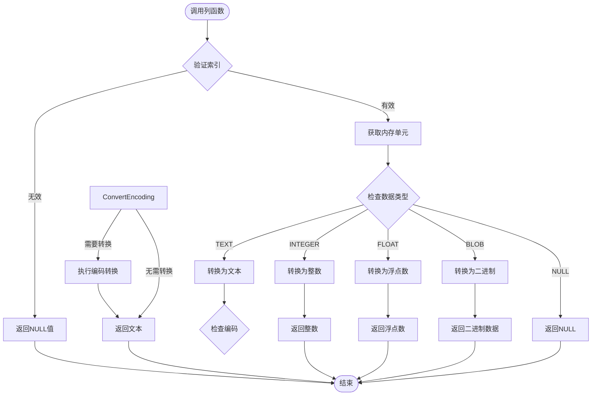

**图表来源**
- [vdbeapi.c](file://src/vdbeapi.c#L1400-L1500)

**章节来源**
- [vdbeapi.c](file://src/vdbeapi.c#L1400-L1608)

## 依赖关系分析

### 核心依赖图

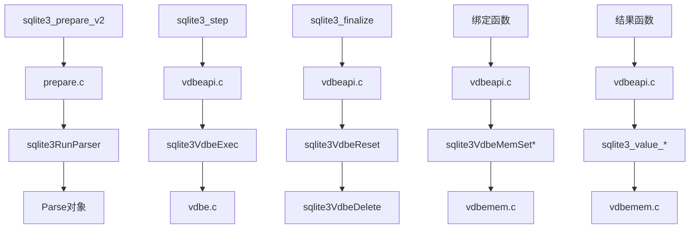

**图表来源**
- [vdbeapi.c](file://src/vdbeapi.c#L1-L50)
- [prepare.c](file://src/prepare.c#L1-L50)

### 外部依赖

预编译语句系统依赖于以下外部组件：

| 组件 | 用途 | 关键函数 |
|------|------|----------|
| B-tree存储引擎 | 数据访问和索引 | sqlite3Btree* |
| 内存管理器 | 动态内存分配 | sqlite3_malloc |
| 字符串处理 | 编码转换 | sqlite3VdbeMemStringify |
| 文件系统接口 | VFS层操作 | sqlite3Os* |

**章节来源**
- [vdbeInt.h](file://src/vdbeInt.h#L1-L100)

## 性能考虑

### 批量操作优化

预编译语句在批量操作中提供显著性能优势：

1. **编译缓存**：相同的SQL语句只需编译一次
2. **参数快速绑定**：避免重复解析和验证
3. **内存预分配**：减少运行时内存分配开销
4. **执行计划复用**：优化器生成的执行计划可重复使用

### 内存管理策略

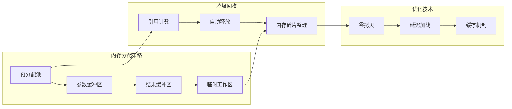

### 并发控制

预编译语句系统采用多层并发控制：

1. **互斥锁保护**：每个数据库连接有独立的互斥锁
2. **读写分离**：只读查询允许多个并发执行
3. **事务隔离**：确保并发事务的一致性
4. **死锁检测**：防止长时间等待导致的死锁

## 故障排除指南

### 常见错误处理

#### 错误代码分类

| 错误类别 | 错误代码 | 描述 | 解决方案 |
|----------|----------|------|----------|
| 编译错误 | SQLITE_ERROR | SQL语法错误 | 检查SQL语法 |
| 参数错误 | SQLITE_MISUSE | API使用不当 | 验证参数有效性 |
| 内存错误 | SQLITE_NOMEM | 内存不足 | 释放不需要的资源 |
| 锁定错误 | SQLITE_BUSY | 数据库锁定 | 使用超时或重试机制 |
| 约束错误 | SQLITE_CONSTRAINT | 违反约束条件 | 检查数据完整性 |

#### 调试技巧

1. **启用跟踪**：使用`SQLITE_TRACE`宏记录执行过程
2. **性能分析**：利用`VDBE_PROFILE`分析执行时间
3. **内存泄漏检测**：监控`sqlite3_malloc`调用
4. **状态检查**：验证VDBE状态转换的正确性

**章节来源**
- [vdbeapi.c](file://src/vdbeapi.c#L834-L872)
- [vdbeaux.c](file://src/vdbeaux.c#L3297-L3335)

### 最佳实践

#### 资源管理

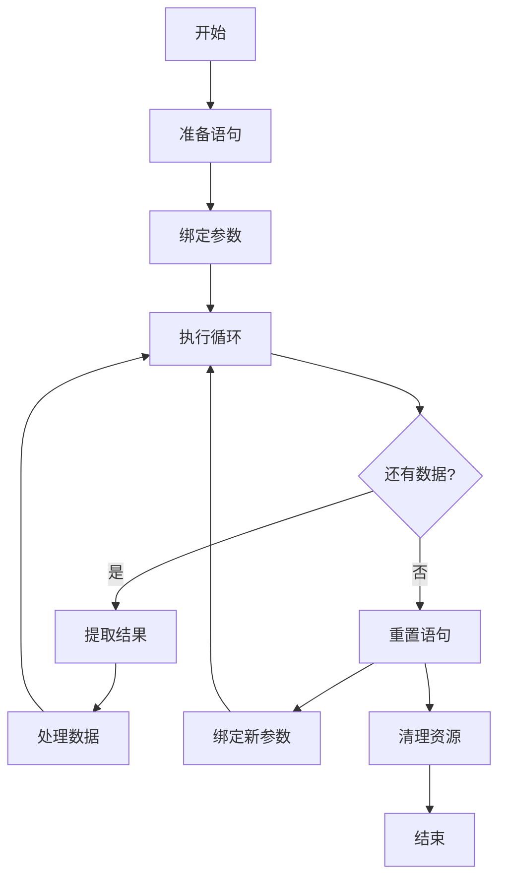

#### 错误处理模式

1. **检查返回值**：始终检查API调用的返回值
2. **资源清理**：使用RAII模式确保资源正确释放
3. **异常安全**：在C语言中模拟C++的异常处理
4. **日志记录**：记录关键操作和错误信息

## 结论

SQLite的预编译语句系统是一个精心设计的高性能解决方案，它通过以下关键特性实现了卓越的性能和安全性：

### 主要优势

1. **安全性**：内置的参数绑定机制有效防止SQL注入攻击
2. **性能**：预编译和缓存机制显著提升执行效率
3. **灵活性**：支持多种数据类型和复杂的查询场景
4. **可靠性**：完善的错误处理和资源管理机制

### 技术创新

- **虚拟机架构**：简洁高效的字节码执行模型
- **状态机设计**：清晰的状态转换和生命周期管理
- **内存优化**：智能的内存分配和回收策略
- **并发控制**：细粒度的锁机制保证线程安全

### 应用建议

对于开发者而言，在使用SQLite预编译语句时应注意：

1. **合理使用缓存**：充分利用编译结果的缓存机制
2. **及时释放资源**：确保在不再需要时正确调用`finalize`
3. **错误处理**：建立完善的错误检测和恢复机制
4. **性能监控**：定期评估和优化查询性能

通过深入理解这些核心概念和最佳实践，开发者可以充分发挥SQLite预编译语句系统的强大功能，构建高效、安全的应用程序。