# SQLite开发者指南

<cite>
**本文档中引用的文件**
- [README.md](file://README.md)
- [LICENSE.md](file://LICENSE.md)
- [compile-for-unix.md](file://doc/compile-for-unix.md)
- [compile-for-windows.md](file://doc/compile-for-windows.md)
- [tcl-extension-testing.md](file://doc/tcl-extension-testing.md)
- [testrunner.md](file://doc/testrunner.md)
- [tester.tcl](file://test/tester.tcl)
- [checkSpacing.c](file://tool/checkSpacing.c)
- [srcck1.c](file://tool/srcck1.c)
- [cc.tcl](file://autosetup/cc.tcl)
- [README.md](file://autosetup/README.md)
</cite>

## 目录
1. [简介](#简介)
2. [项目概述](#项目概述)
3. [公共领域贡献模式](#公共领域贡献模式)
4. [开发环境设置](#开发环境设置)
5. [代码风格与规范](#代码风格与规范)
6. [构建系统](#构建系统)
7. [测试框架](#测试框架)
8. [代码质量控制](#代码质量控制)
9. [提交流程](#提交流程)
10. [调试与故障排除](#调试与故障排除)
11. [最佳实践](#最佳实践)

## 简介

SQLite是一个高性能、自包含、零配置的关系型数据库引擎。本指南专为希望为SQLite项目贡献代码的开发者设计，涵盖了从环境设置到代码审查的完整流程。

SQLite采用独特的公共领域许可证，这意味着所有贡献的代码都必须放弃版权，确保整个项目保持在公共领域状态。

## 项目概述

### 核心架构

SQLite采用模块化设计，主要组件包括：

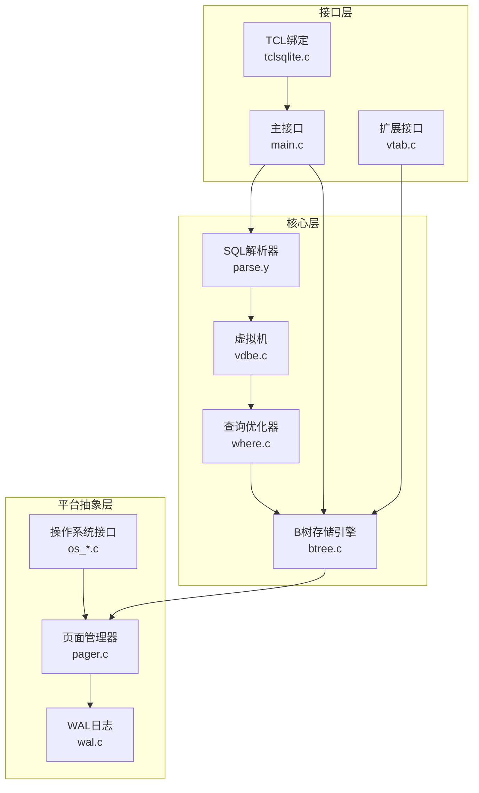

**图表来源**
- [main.c](file://src/main.c#L1-L50)
- [parse.y](file://src/parse.y#L1-L100)
- [vdbe.c](file://src/vdbe.c#L1-L100)

### 源码组织结构

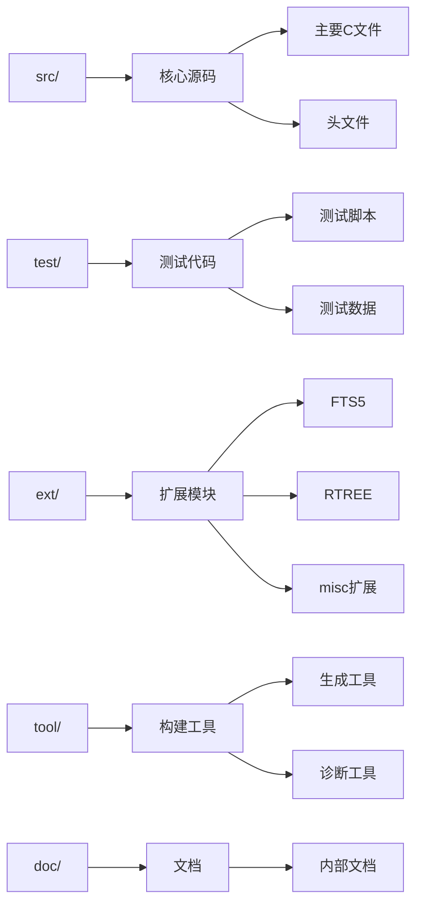

**节来源**
- [README.md](file://README.md#L150-L200)

## 公共领域贡献模式

### 版权政策

SQLite采用完全的公共领域许可证，这是SQLite独特且重要的特性：

- **公共领域状态**：所有核心源码文件均为公共领域
- **版权放弃**：每个贡献者都提交了书面声明放弃版权
- **可追溯性**：每字节代码都可以追溯到原始作者
- **无专利限制**：任何人都可以自由使用、修改和分发

### 贡献者协议

由于SQLite是公共领域，不接受传统的Pull Request：

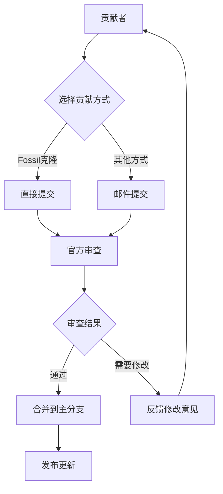

**节来源**
- [README.md](file://README.md#L38-L51)
- [LICENSE.md](file://LICENSE.md#L1-L40)

### 版权放弃流程

1. **代码准备**：确保代码符合项目标准
2. **版权声明**：确认放弃所有相关版权
3. **提交方式**：通过官方渠道提交
4. **审查过程**：由核心团队进行技术审查
5. **合并发布**：通过后合并到主分支

## 开发环境设置

### 必需工具

#### Unix/Linux系统

```bash
# 安装基本工具
apt install gcc make tcl-dev  # Ubuntu/Debian
yum install gcc make tcl-devel  # CentOS/RHEL

# 可选但推荐的工具
apt install valgrind clang  # 内存检查和静态分析
```

#### Windows系统

- **Visual Studio**：2015或更高版本
- **TCL开发库**：用于测试和构建
- **Fossil SCM**：用于源码管理

### 构建系统配置

SQLite使用Autosetup构建系统，支持多种编译器和平台：

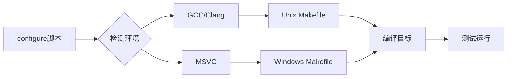

**图表来源**
- [cc.tcl](file://autosetup/cc.tcl#L1-L50)

### 编译选项

#### 基本编译

```bash
# 配置构建环境
./configure --enable-all

# 编译核心工具
make sqlite3                  # 命令行工具
make sqlite3.c                # 整合源码
make sqldiff                  # 差异比较工具

# 运行测试
make devtest                  # 开发测试
make releasetest              # 发布测试
```

#### 调试构建

```bash
# 启用调试信息
./configure --enable-all --enable-debug CFLAGS='-O0 -g'

# 或者使用预设配置
make OPTIONS='-DSQLITE_DEBUG -DSQLITE_ENABLE_EXPENSIVE_ASSERT' sqlite3
```

**节来源**
- [compile-for-unix.md](file://doc/compile-for-unix.md#L1-L70)
- [compile-for-windows.md](file://doc/compile-for-windows.md#L1-L100)

## 代码风格与规范

### C语言编码标准

SQLite对C代码有严格的格式要求：

#### 缩进和空格


**节来源**
- [checkSpacing.c](file://tool/checkSpacing.c#L1-L85)

#### 命名约定

- **函数**：使用下划线分隔的小写字母
- **宏**：使用全大写字母和下划线
- **变量**：使用描述性名称
- **常量**：使用全大写加下划线

#### 注释规范

```c
/*
** 函数功能说明
**
** 参数：
**   param1 - 参数1说明
**   param2 - 参数2说明
**
** 返回值：
**   成功返回SQLITE_OK
**   失败返回错误码
*/
```

### 代码质量检查

#### 静态分析工具

SQLite提供了专门的静态分析工具：

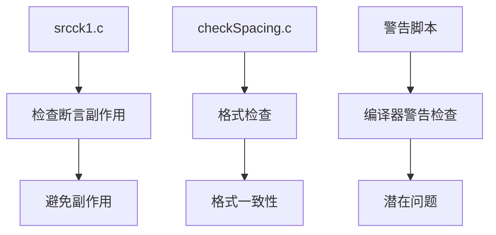

**图表来源**
- [srcck1.c](file://tool/srcck1.c#L1-L50)

#### 断言使用规范

- **ALWAYS()**：总是为真的条件
- **NEVER()**：理论上不可能发生的条件
- **testcase()**：测试覆盖率标记
- **assert()**：运行时验证

**节来源**
- [srcck1.c](file://tool/srcck1.c#L20-L80)

## 构建系统

### Autosetup架构

SQLite使用Autosetup作为构建系统，提供跨平台支持：

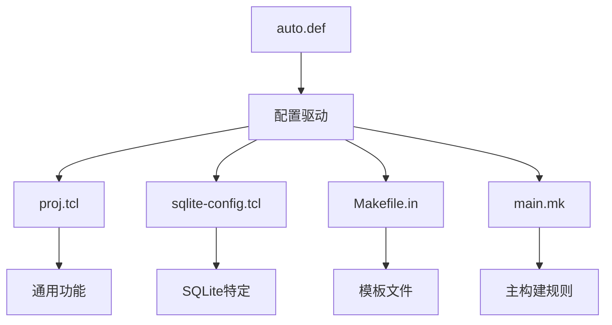

**图表来源**
- [README.md](file://autosetup/README.md#L50-L100)

### 特性标志系统

Autosetup使用灵活的特性标志系统：

```bash
# 启用特定功能
./configure --enable-fts5 --enable-rtree

# 禁用不需要的功能
./configure --disable-fts3 --disable-rtree

# 自定义编译选项
./configure OPTIONS="-DSQLITE_OMIT_DEPRECATED -DSQLITE_ENABLE_MATH_FUNCTIONS"
```

### 平台适配

构建系统自动检测和适配不同平台：

- **Unix/Linux**：GCC/Clang编译器
- **Windows**：MSVC编译器
- **交叉编译**：支持嵌入式系统

**节来源**
- [cc.tcl](file://autosetup/cc.tcl#L1-L100)

## 测试框架

### Testrunner架构

SQLite使用testrunner.tcl作为主要测试框架：

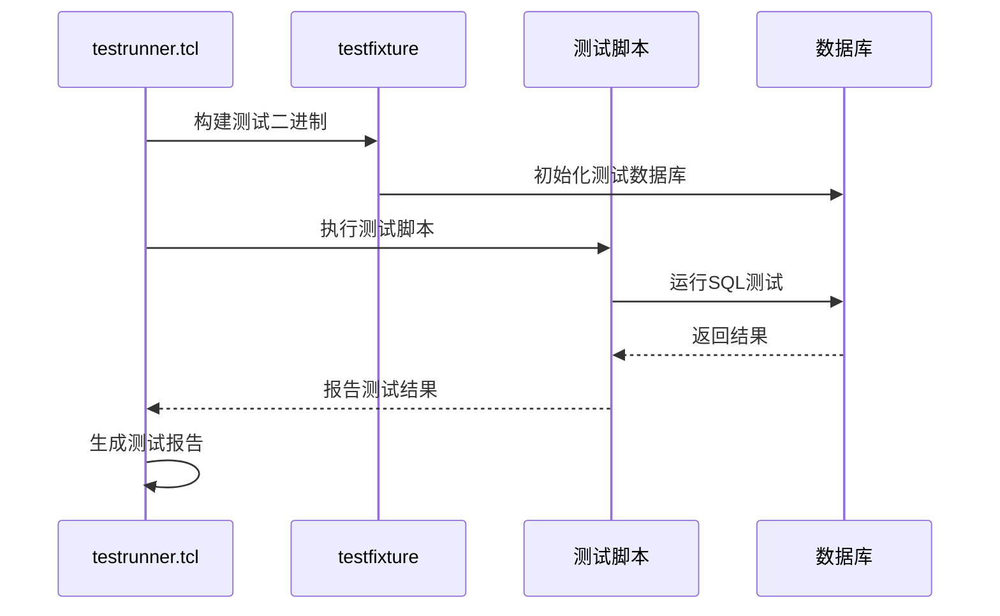

**图表来源**
- [testrunner.md](file://doc/testrunner.md#L50-L100)

### 测试类型

#### 单元测试

```bash
# 运行快速测试
make devtest

# 运行完整测试套件
make releasetest

# 运行特定测试
./testfixture test/select.test
```

#### 功能测试

- **二进制测试**：使用testfixture执行
- **源码测试**：重新编译并测试
- **模糊测试**：使用fuzzcheck进行随机测试

#### 性能测试

```bash
# 性能基准测试
make speedtest

# 内存使用测试
make memtest
```

### 测试覆盖率

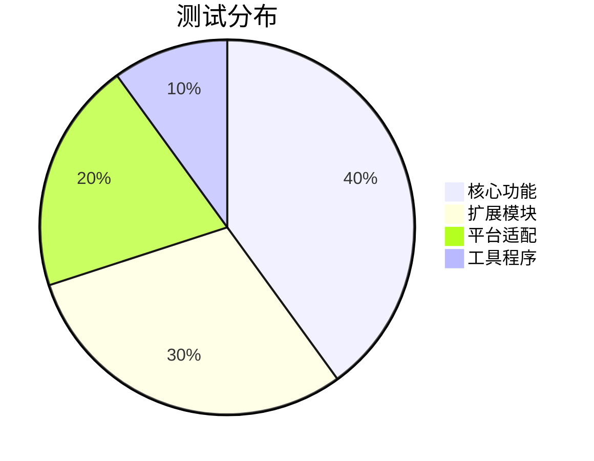

**节来源**
- [testrunner.md](file://doc/testrunner.md#L1-L100)

## 代码质量控制

### 静态分析

#### 断言副作用检查

srcck1工具专门检查断言中的副作用：

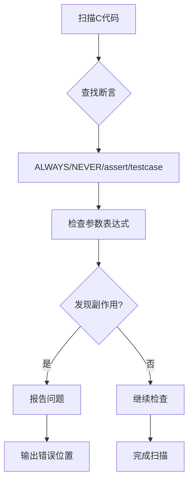

**图表来源**
- [srcck1.c](file://tool/srcck1.c#L50-L120)

#### 格式检查

checkSpacing工具确保代码格式一致性：

- 检查制表符使用
- 检查行尾空格
- 检查文件末尾空白行

### 动态分析

#### 内存泄漏检测

```bash
# 使用Valgrind检测内存问题
valgrind --leak-check=full ./testfixture test/main.test

# 内存调试模式
./configure --enable-debug CFLAGS='-DSQLITE_DEBUG -DSQLITE_MEMDEBUG'
```

#### 并发测试

```bash
# 多线程测试
make threadtest

# 死锁检测
make superlocktest
```

**节来源**
- [srcck1.c](file://tool/srcck1.c#L1-L159)
- [checkSpacing.c](file://tool/checkSpacing.c#L1-L85)

## 提交流程

### 开发工作流

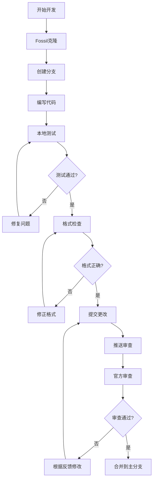

### 提交规范

#### 提交消息格式

```
模块名: 简短描述

详细描述变更内容和原因。

- 列出主要变更
- 说明影响范围
- 提供测试方法
```

#### 代码审查要点

- **功能正确性**：代码是否实现预期功能
- **性能影响**：是否引入性能回归
- **兼容性**：是否破坏现有API
- **测试覆盖**：是否添加相应测试
- **文档更新**：是否更新相关文档

### 版本控制

SQLite使用Fossil作为版本控制系统：

```bash
# 克隆源码
fossil open https://sqlite.org/src

# 更新到最新版本
fossil update trunk

# 创建新版本
fossil commit -m "提交消息"
```

## 调试与故障排除

### 调试技巧

#### 编译时调试

```bash
# 启用详细调试信息
./configure --enable-debug CFLAGS='-g -O0'

# 启用额外调试选项
./configure OPTIONS="-DSQLITE_DEBUG -DSQLITE_ENABLE_EXPENSIVE_ASSERT"
```

#### 运行时调试

```bash
# 启用SQL跟踪
./sqlite3 test.db ".trace on"

# 启用内存分配跟踪
./sqlite3 -cmd ".memdebug on" test.db
```

### 常见问题解决

#### 编译问题

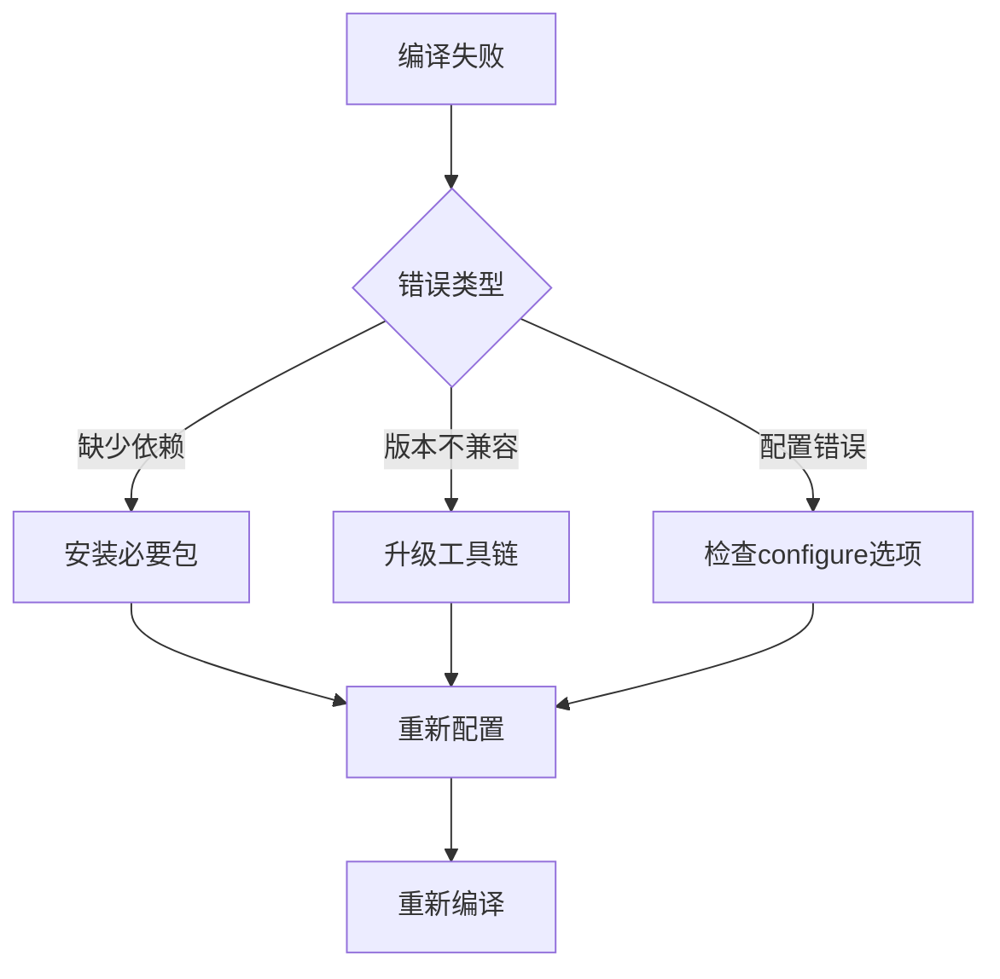

#### 测试失败

- **检查测试环境**：确保所有依赖工具可用
- **查看测试日志**：分析失败的具体原因
- **对比历史结果**：确认是否为回归问题
- **简化测试场景**：定位具体问题点

### 性能分析

#### 性能基准测试

```bash
# 运行性能测试
make speedtest

# 分析查询计划
EXPLAIN QUERY PLAN SELECT * FROM table WHERE condition;
```

#### 内存使用分析

```bash
# 使用Valgrind分析内存
valgrind --tool=memcheck --leak-check=full ./sqlite3

# 内存统计
./sqlite3 -cmd ".memory_stats on" test.db
```

## 最佳实践

### 代码贡献原则

#### 质量优先

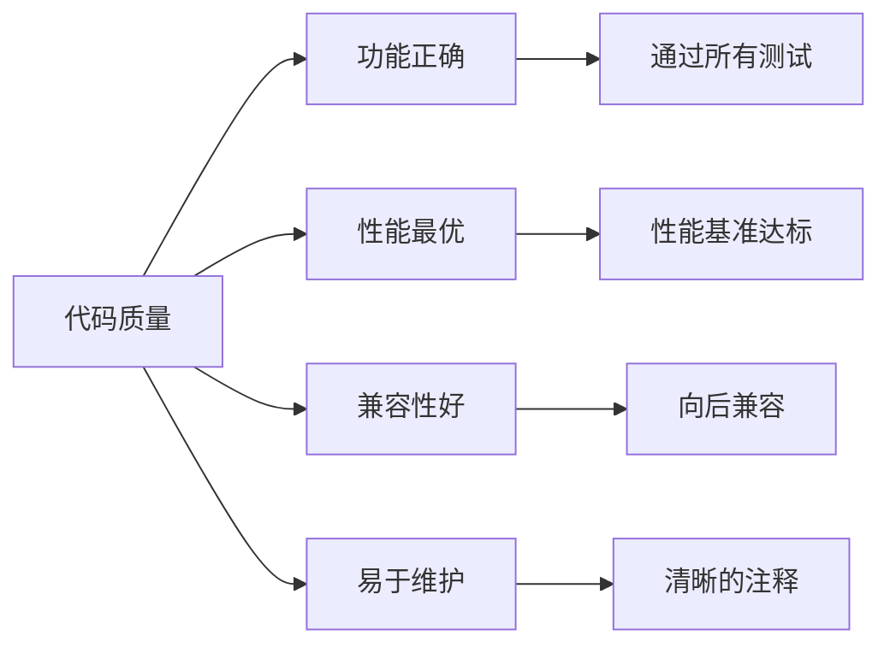

#### 渐进式改进

- **小步快跑**：每次提交少量改动
- **充分测试**：确保不破坏现有功能
- **文档同步**：及时更新相关文档
- **社区沟通**：提前与维护者讨论

### 维护标准

#### 代码审查清单

- [ ] 代码符合项目风格指南
- [ ] 添加了适当的单元测试
- [ ] 更新了相关文档
- [ ] 不破坏现有API
- [ ] 性能影响可接受
- [ ] 内存使用安全

#### 发布准备

- [ ] 所有测试通过
- [ ] 文档更新完整
- [ ] 版本号正确递增
- [ ] 发布说明准备就绪

### 社区参与

#### 沟通渠道

- **SQLite论坛**：主要讨论平台
- **邮件列表**：技术讨论和公告
- **官方IRC**：实时交流
- **GitHub Issues**：bug报告和功能请求

#### 贡献认可

- **致谢名单**：记录重要贡献者
- **版本历史**：详细记录变更
- **社区活动**：定期举办技术分享

### 未来发展

#### 技术方向

- **性能优化**：持续提升查询性能
- **功能增强**：支持更多SQL标准特性
- **平台适配**：扩展到更多目标平台
- **工具完善**：改进开发和调试工具

#### 社区建设

- **文档完善**：提供更多学习资源
- **新手友好**：降低贡献门槛
- **协作机制**：建立更有效的协作流程
- **生态系统**：支持更多第三方扩展

通过遵循本指南，开发者可以有效地为SQLite项目做出高质量的贡献，同时确保项目的长期稳定性和可维护性。SQLite的成功离不开全球开发者的共同努力，我们欢迎每一位有兴趣的开发者加入这个充满挑战和成就感的开源项目。