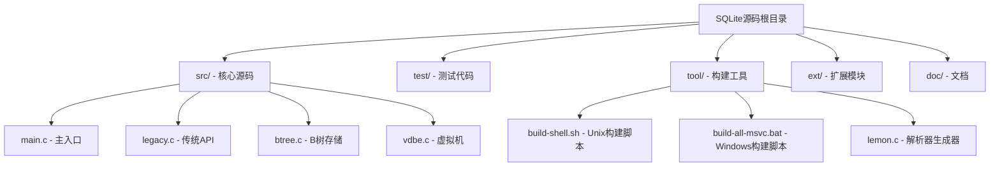
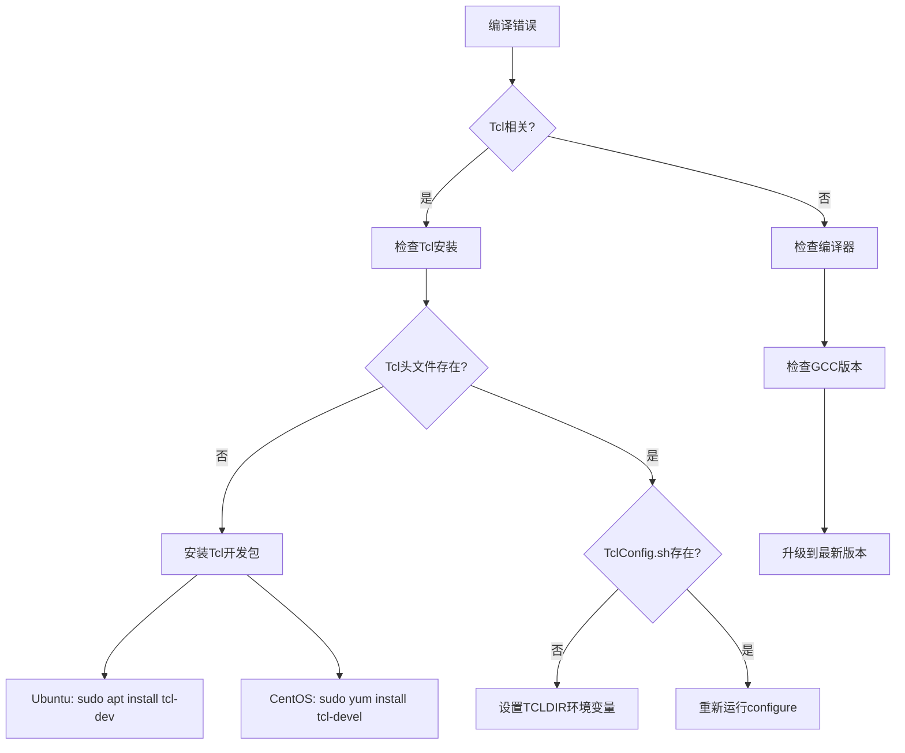

# 快速入门

<cite>
**本文档中引用的文件**
- [README.md](file://README.md)
- [doc/compile-for-unix.md](file://doc/compile-for-unix.md)
- [doc/compile-for-windows.md](file://doc/compile-for-windows.md)
- [src/main.c](file://src/main.c)
- [src/legacy.c](file://src/legacy.c)
- [src/test1.c](file://src/test1.c)
- [tool/build-shell.sh](file://tool/build-shell.sh)
- [tool/build-all-msvc.bat](file://tool/build-all-msvc.bat)
- [test/fuzzcheck.c](file://test/fuzzcheck.c)
- [ext/wasm/demo-123.js](file://ext/wasm/demo-123.js)
</cite>

## 目录
1. [简介](#简介)
2. [系统要求](#系统要求)
3. [下载和准备源码](#下载和准备源码)
4. [Unix系统编译指南](#unix系统编译指南)
5. [Windows系统编译指南](#windows系统编译指南)
6. [链接SQLite库到项目](#链接sqlite库到项目)
7. [Hello World数据库示例](#hello-world数据库示例)
8. [关键API详解](#关键api详解)
9. [常见编译错误排查](#常见编译错误排查)
10. [下一步学习](#下一步学习)

## 简介

SQLite是一个轻量级的嵌入式关系型数据库引擎，它不需要独立的服务器进程，所有的数据都存储在一个单独的磁盘文件中。本指南将帮助您从零开始，在不同操作系统上成功编译和使用SQLite。

### SQLite的核心特性
- **零配置**：无需安装或配置服务器
- **跨平台**：支持几乎所有主流操作系统
- **ACID兼容**：保证事务的原子性、一致性、隔离性和持久性
- **小型高效**：核心库仅约几百KB
- **广泛支持**：被数千种应用程序使用

## 系统要求

### Unix/Linux系统要求
- **C编译器**：GCC 4.0+ 或 Clang 3.0+
- **构建工具**：make, autoconf, automake, libtool
- **可选**：TCL开发库（用于完整测试）
- **内存**：至少64MB可用内存
- **磁盘空间**：源码约20MB，编译后约100MB

### Windows系统要求
- **编译器**：Microsoft Visual Studio 2015+（社区版即可）
- **构建工具**：nmake
- **可选**：TCL开发库（用于完整测试）
- **内存**：至少128MB可用内存
- **磁盘空间**：源码约20MB，编译后约150MB

## 下载和准备源码

### 获取SQLite源码

```bash
# 使用Fossil版本控制系统
mkdir -p ~/sqlite
cd ~/sqlite
fossil open https://sqlite.org/src

# 或者直接下载源码包
wget https://sqlite.org/src/sqlite.tar.gz
tar xzf sqlite.tar.gz
```

### 源码目录结构概览



**图表来源**
- [README.md](file://README.md#L1-L50)

## Unix系统编译指南

### 基础编译步骤

#### 1. 安装必要的工具

```bash
# Ubuntu/Debian系统
sudo apt install gcc make tcl-dev

# CentOS/RHEL系统
sudo yum install gcc make tcl-devel

# macOS系统
xcode-select --install
brew install tcl
```

#### 2. 创建构建目录

```bash
# 创建源码目录
tar xzf sqlite.tar.gz
mkdir bld
cd bld
```

#### 3. 配置和编译

```bash
# 运行配置脚本
../sqlite/configure --enable-all

# 编译SQLite命令行工具
make sqlite3

# 编译amalgamation源文件
make sqlite3.c

# 编译其他工具
make sqldiff
make sqlite3_analyzer
```

#### 4. 高级编译选项

```bash
# 调试版本编译
../sqlite/configure --enable-all --enable-debug CFLAGS='-O0 -g'

# 最小化编译（移除不常用功能）
make OPTIONS=-DSQLITE_OMIT_DEPRECATED sqlite3

# 启用特定扩展
make OPTIONS="-DSQLITE_ENABLE_FTS5 -DSQLITE_ENABLE_RTREE" sqlite3
```

### 编译参数详解

| 参数 | 说明 | 示例 |
|------|------|------|
| `--enable-all` | 启用所有功能 | 默认启用大部分功能 |
| `--enable-debug` | 启用调试信息 | 包含符号表和调试宏 |
| `CFLAGS` | C编译器标志 | `-O0 -g` 启用调试模式 |
| `OPTIONS` | 自定义编译选项 | `-DSQLITE_OMIT_DEPRECATED` |

**章节来源**
- [doc/compile-for-unix.md](file://doc/compile-for-unix.md#L1-L71)

## Windows系统编译指南

### Visual Studio环境设置

#### 1. 安装Visual Studio

- 下载并安装Visual Studio Community 2015或更高版本
- 选择"C++开发"工作负载
- 确保包含"MSVC v140编译器工具集"和"NMake工具"

#### 2. 打开正确的命令提示符

- 在开始菜单中找到"Visual Studio 20XX"文件夹
- 选择"x64 Native Tools Command Prompt for VS 20XX"
- 如果需要32位版本，使用"x86 Native Tools Command Prompt"

#### 3. 编译SQLite

```batch
# 进入SQLite源码目录
cd path\to\sqlite

# 编译SQLite命令行工具
nmake /f Makefile.msc sqlite3.exe

# 编译amalgamation文件
nmake /f Makefile.msc sqlite3.c

# 编译其他工具
nmake /f Makefile.msc sqldiff.exe
```

### Windows编译选项

```batch
# 调试版本编译
nmake /f Makefile.msc DEBUG=3 sqlite3.exe

# 启用特定功能
nmake /f Makefile.msc OPTIONS=-DSQLITE_ENABLE_FTS5 sqlite3.exe

# 静态链接TCL库
nmake /f Makefile.msc STATICALLY_LINK_TCL=1 sqlite3_analyzer.exe
```

### 32位与64位编译差异

| 方面 | 64位编译 | 32位编译 |
|------|----------|----------|
| 命令提示符 | x64 Native Tools Command Prompt | x86 Native Tools Command Prompt |
| 输出目录 | 默认在当前目录 | 可以指定不同目录避免冲突 |
| PATH设置 | `c:\tcl\bin;%PATH%` | `c:\tcl32\bin;%PATH%` |

**章节来源**
- [doc/compile-for-windows.md](file://doc/compile-for-windows.md#L1-L192)

## 链接SQLite库到项目

### 动态链接方式

#### Unix系统动态链接

```bash
# 编译时链接
gcc -o myapp myapp.c -lsqlite3

# 指定库路径（如果不在标准路径）
gcc -o myapp myapp.c -L/usr/local/lib -lsqlite3

# 运行时链接
export LD_LIBRARY_PATH=/usr/local/lib:$LD_LIBRARY_PATH
./myapp
```

#### Windows系统动态链接

```batch
# 编译时链接
cl /Fe:myapp.exe myapp.c sqlite3.lib

# 运行时链接（复制DLL）
copy sqlite3.dll C:\Windows\System32\
```

### 静态链接方式

#### Unix系统静态链接

```bash
# 使用amalgamation文件
gcc -o myapp myapp.c sqlite3.c -lpthread -lm

# 或者使用预编译的静态库
gcc -o myapp myapp.c -L/path/to/sqlite -lsqlite3 -lpthread -lm
```

#### Windows系统静态链接

```batch
# 使用预编译的静态库
cl /Fe:myapp.exe myapp.c /link sqlite3.lib
```

### 项目集成最佳实践


## Hello World数据库示例

### 基础数据库操作程序

以下是一个完整的"Hello World"级别的SQLite数据库操作示例：

```c
#include <stdio.h>
#include <stdlib.h>
#include <sqlite3.h>

// 回调函数示例
static int callback(void *NotUsed, int argc, char **argv, char **azColName) {
    int i;
    for(i = 0; i < argc; i++) {
        printf("%s = %s\n", azColName[i], argv[i] ? argv[i] : "NULL");
    }
    printf("\n");
    return 0;
}

int main(void) {
    sqlite3 *db;
    char *zErrMsg = 0;
    int rc;
    
    // 1. 打开数据库（如果不存在则创建）
    rc = sqlite3_open("test.db", &db);
    
    if(rc) {
        fprintf(stderr, "无法打开数据库: %s\n", sqlite3_errmsg(db));
        return(1);
    } else {
        fprintf(stdout, "成功打开数据库\n");
    }
    
    // 2. 创建表
    const char *sql_create = 
        "CREATE TABLE IF NOT EXISTS COMPANY("
        "ID INT PRIMARY KEY     NOT NULL,"
        "NAME           TEXT    NOT NULL,"
        "AGE            INT     NOT NULL,"
        "ADDRESS        CHAR(50),"
        "SALARY         REAL );";
    
    rc = sqlite3_exec(db, sql_create, 0, 0, &zErrMsg);
    
    if(rc != SQLITE_OK) {
        fprintf(stderr, "SQL 错误: %s\n", zErrMsg);
        sqlite3_free(zErrMsg);
    } else {
        fprintf(stdout, "表创建成功\n");
    }
    
    // 3. 插入数据
    const char *sql_insert = 
        "INSERT INTO COMPANY (ID, NAME, AGE, ADDRESS, SALARY) "
        "VALUES (1, '张三', 32, '北京', 20000.00 ); "
        "INSERT INTO COMPANY (ID, NAME, AGE, ADDRESS, SALARY) "
        "VALUES (2, '李四', 25, '上海', 15000.00 );";
    
    rc = sqlite3_exec(db, sql_insert, 0, 0, &zErrMsg);
    
    if(rc != SQLITE_OK) {
        fprintf(stderr, "SQL 错误: %s\n", zErrMsg);
        sqlite3_free(zErrMsg);
    } else {
        fprintf(stdout, "数据插入成功\n");
    }
    
    // 4. 查询数据
    const char *sql_select = "SELECT * FROM COMPANY;";
    
    rc = sqlite3_exec(db, sql_select, callback, 0, &zErrMsg);
    
    if(rc != SQLITE_OK) {
        fprintf(stderr, "SQL 错误: %s\n", zErrMsg);
        sqlite3_free(zErrMsg);
    } else {
        fprintf(stdout, "查询成功\n");
    }
    
    // 5. 关闭数据库连接
    sqlite3_close(db);
    
    return 0;
}
```

### 编译和运行示例

#### Unix系统编译

```bash
# 使用gcc编译
gcc -o hello_sqlite hello_sqlite.c -lsqlite3

# 或使用构建脚本中的编译选项
gcc -o hello_sqlite -g -Os -I. \
   -DSQLITE_THREADSAFE=0 \
   -DSQLITE_ENABLE_VFSTRACE \
   -DSQLITE_ENABLE_STAT3 \
   -DSQLITE_ENABLE_FTS4 \
   -DSQLITE_ENABLE_RTREE \
   hello_sqlite.c -lsqlite3
```

#### Windows系统编译

```batch
# 使用MSVC编译
cl /Fe:hello_sqlite.exe hello_sqlite.c sqlite3.lib

# 或使用预编译的静态库
cl /Fe:hello_sqlite.exe hello_sqlite.c /link sqlite3.lib
```

### 示例输出

```
成功打开数据库
表创建成功
数据插入成功
查询成功
ID = 1
NAME = 张三
AGE = 32
ADDRESS = 北京
SALARY = 20000.0

ID = 2
NAME = 李四
AGE = 25
ADDRESS = 上海
SALARY = 15000.0
```

**章节来源**
- [test/fuzzcheck.c](file://test/fuzzcheck.c#L2286-L2322)
- [tool/build-shell.sh](file://tool/build-shell.sh#L1-L22)

## 关键API详解

### 初始化API

#### sqlite3_open()

这是打开或创建SQLite数据库的主要函数：

```c
int sqlite3_open(
  const char *filename,   // 数据库文件名（或":memory:"表示内存数据库）
  sqlite3 **ppDb          // 返回的数据库连接句柄
);
```

**重要参数：**
- `filename`: 数据库文件路径，":memory:"表示内存数据库
- `ppDb`: 输出参数，返回数据库连接句柄

**返回值：**
- `SQLITE_OK` (0): 成功
- 其他值: 失败，可通过`sqlite3_errmsg()`获取错误信息

#### sqlite3_close()

关闭数据库连接：

```c
int sqlite3_close(sqlite3 *db);
```

**注意事项：**
- 必须在程序结束前调用此函数释放资源
- 如果有未提交的事务，会自动回滚
- 函数失败时返回非零值

### 执行API

#### sqlite3_exec()

执行SQL语句的高级接口：

```c
int sqlite3_exec(
  sqlite3 *db,                     // 数据库连接
  const char *sql,                 // SQL语句
  int (*callback)(void*,int,char**,char**),  // 回调函数
  void *userdata,                  // 回调函数的用户数据
  char **errmsg                    // 错误信息
);
```

**回调函数原型：**
```c
int callback(void *NotUsed, int argc, char **argv, char **azColName);
```

**回调函数参数：**
- `NotUsed`: 用户提供的指针（来自userdata参数）
- `argc`: 结果列数
- `argv`: 列值数组
- `azColName`: 列名数组

### 错误处理机制

```c
// 获取错误信息
const char *sqlite3_errmsg(sqlite3 *db);

// 获取错误代码
int sqlite3_extended_errcode(sqlite3 *db);

// 获取SQL语句中的错误位置
int sqlite3_error_offset(sqlite3 *db);
```

### 数据类型映射

| SQLite类型 | C语言类型 | 说明 |
|------------|-----------|------|
| INTEGER | `int`, `long`, `sqlite3_int64` | 64位整数 |
| REAL | `double` | 64位浮点数 |
| TEXT | `char*` | 字符串，UTF-8编码 |
| BLOB | `unsigned char*` | 二进制数据 |
| NULL | `NULL` | 空值 |

**章节来源**
- [src/legacy.c](file://src/legacy.c#L17-L141)
- [src/test1.c](file://src/test1.c#L824-L847)

## 常见编译错误排查

### 缺少Tcl依赖

#### 错误现象
```
configure: error: Tcl development files not found
make: *** No rule to make target 'tclextension-install'
```

#### 排查步骤



#### 解决方案

**Unix系统：**
```bash
# 检查Tcl是否已安装
which tclsh
tclsh --version

# 安装Tcl开发包
sudo apt install tcl-dev  # Ubuntu/Debian
sudo yum install tcl-devel  # CentOS/RHEL

# 设置环境变量
export TCLDIR=/usr/local
export PATH=$TCLDIR/bin:$PATH
```

**Windows系统：**
```batch
# 检查Tcl安装
where tclsh.exe

# 设置TCLDIR环境变量
set TCLDIR=C:\Tcl
set PATH=%TCLDIR%\bin;%PATH%
```

### 编译器标志问题

#### 常见编译器错误

**GCC错误：**
```
error: 'sqlite3_int64' undeclared
error: 'SQLITE_THREADSAFE' undeclared
```

**解决方案：**
```bash
# 添加必要的编译标志
gcc -o myapp myapp.c -lsqlite3 \
    -DSQLITE_THREADSAFE=1 \
    -DSQLITE_ENABLE_COLUMN_METADATA=1 \
    -DSQLITE_ENABLE_RTREE=1
```

#### 内存相关错误

**错误现象：**
```
fatal error: cannot allocate memory for object file
```

**解决方法：**
```bash
# 减少编译优化级别
gcc -O0 -o myapp myapp.c -lsqlite3

# 或使用较小的编译选项
make OPTIONS=-DSQLITE_OMIT_DEPRECATED sqlite3
```

### 链接错误

#### 符号未定义错误

**错误信息：**
```
undefined reference to 'sqlite3_open'
collect2: error: ld returned 1 exit status
```

**排查步骤：**
1. 确认SQLite库已正确编译
2. 检查库文件路径
3. 验证链接顺序

**解决方案：**
```bash
# 正确的链接顺序
gcc -o myapp myapp.c -L/path/to/sqlite -lsqlite3

# 或使用绝对路径
gcc -o myapp myapp.c /path/to/sqlite/sqlite3.o -lpthread -lm
```

### 平台相关问题

#### 32位 vs 64位冲突

**错误现象：**
```
relocation truncated to fit: R_X86_64_PC32 against symbol
```

**解决方案：**
```bash
# 统一编译架构
# 32位系统
gcc -m32 -o myapp myapp.c -lsqlite3

# 64位系统
gcc -m64 -o myapp myapp.c -lsqlite3
```

#### 字符编码问题

**错误现象：**
```
UnicodeDecodeError: 'utf-8' codec can't decode byte
```

**解决方案：**
```c
// 明确指定UTF-8编码
sqlite3_open_v2("database.db", &db, SQLITE_OPEN_READWRITE | SQLITE_OPEN_CREATE, NULL);
```

**章节来源**
- [doc/compile-for-unix.md](file://doc/compile-for-unix.md#L10-L30)
- [doc/compile-for-windows.md](file://doc/compile-for-windows.md#L15-L40)

## 下一步学习

### 深入学习资源

#### 核心概念
- **事务处理**: 学习BEGIN、COMMIT、ROLLBACK的使用
- **索引优化**: 理解索引的工作原理和性能影响
- **并发控制**: 掌握多线程访问的最佳实践
- **备份恢复**: 学习数据库备份和恢复策略

#### 高级主题
- **自定义函数**: 在SQLite中注册C函数
- **虚拟表**: 创建自定义数据源
- **扩展开发**: 开发SQLite插件和扩展
- **性能调优**: 分析和优化查询性能

#### 实践项目建议

1. **个人笔记应用**: 实现带标签和搜索功能的笔记应用
2. **任务管理系统**: 创建带有优先级和截止日期的任务管理器
3. **日志分析工具**: 分析和可视化系统日志数据
4. **配置管理器**: 存储和管理应用程序配置

### 社区资源

- **官方文档**: https://sqlite.org/docs.html
- **SQLite论坛**: https://sqlite.org/forum
- **GitHub仓库**: https://github.com/sqlite/sqlite
- **API参考**: https://sqlite.org/c3ref/intro.html

### 最佳实践

1. **错误处理**: 始终检查API返回值
2. **资源管理**: 及时关闭数据库连接
3. **SQL注入防护**: 使用参数化查询
4. **性能监控**: 监控查询执行时间和资源使用
5. **版本兼容**: 注意SQLite版本间的兼容性问题

通过本快速入门指南，您应该能够：
- 在不同平台上成功编译SQLite
- 链接SQLite库到您的项目
- 执行基本的数据库操作
- 理解关键的API函数
- 排查常见的编译和运行时错误

现在，您可以开始探索SQLite的强大功能，构建自己的数据库驱动应用程序了！