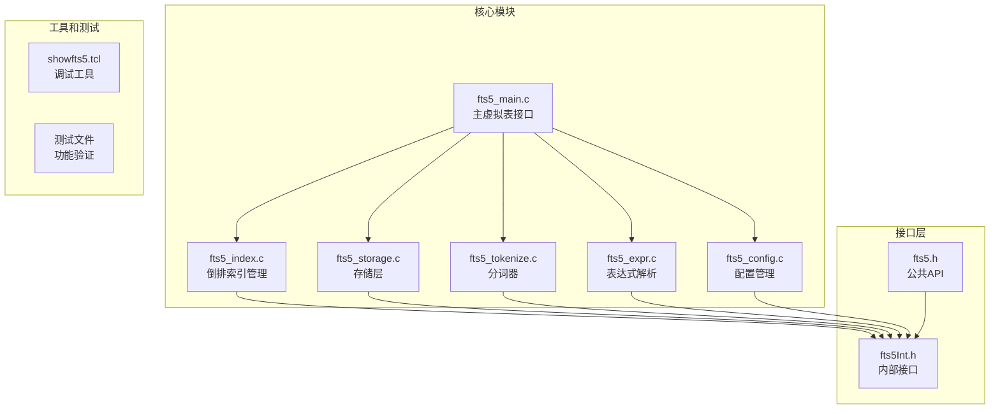
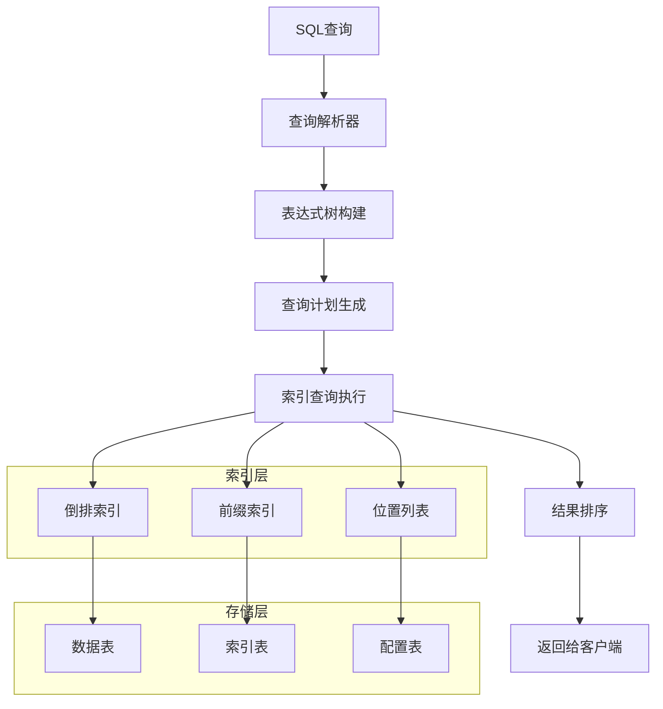
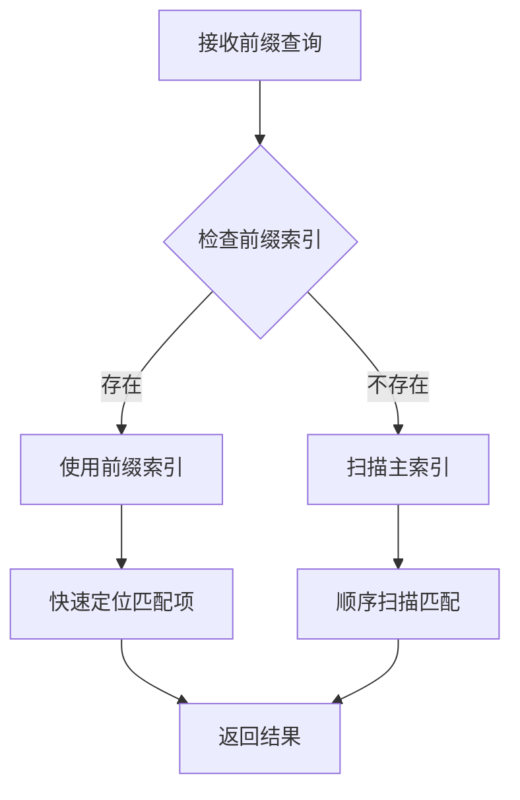
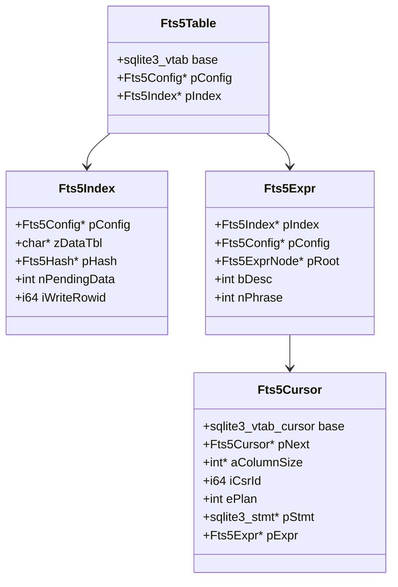
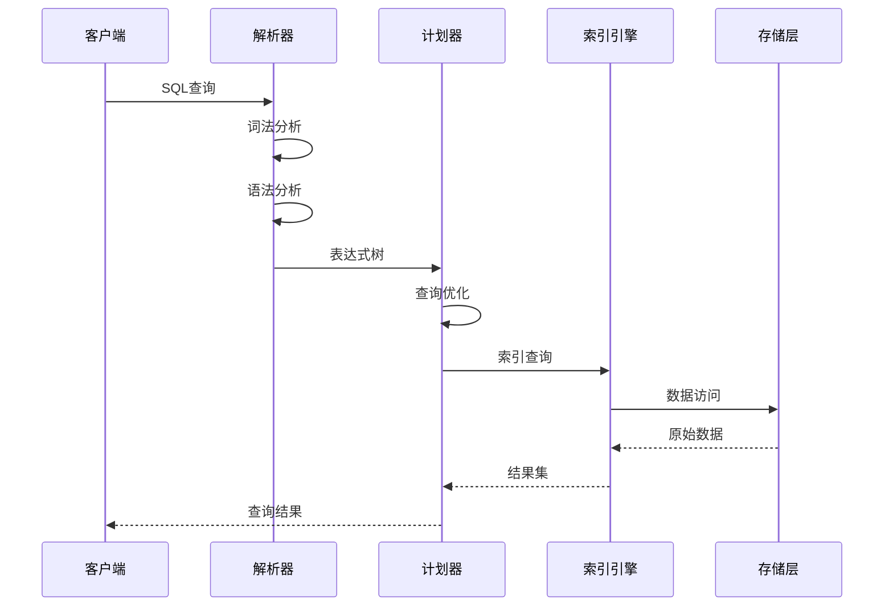
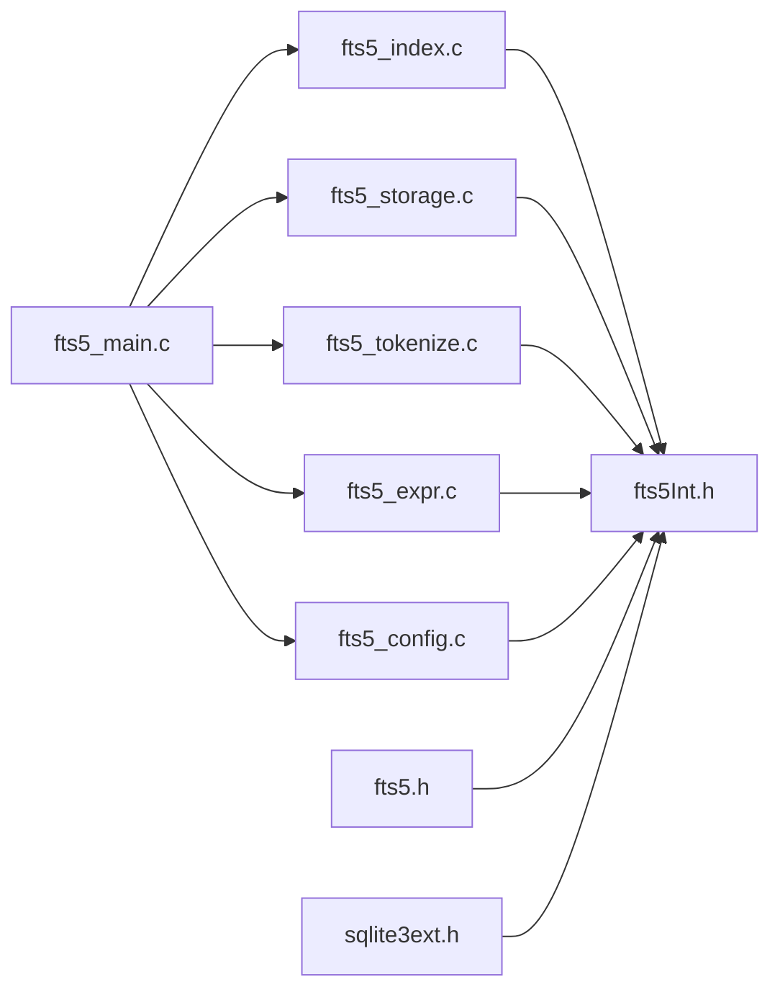

# FTS5全文搜索扩展技术文档

<cite>
**本文档中引用的文件**
- [fts5_main.c](file://ext/fts5/fts5_main.c)
- [fts5.h](file://ext/fts5/fts5.h)
- [fts5Int.h](file://ext/fts5/fts5Int.h)
- [fts5_index.c](file://ext/fts5/fts5_index.c)
- [fts5_storage.c](file://ext/fts5/fts5_storage.c)
- [fts5_tokenize.c](file://ext/fts5/fts5_tokenize.c)
- [fts5_expr.c](file://ext/fts5/fts5_expr.c)
- [fts5_config.c](file://ext/fts5/fts5_config.c)
- [showfts5.tcl](file://ext/fts5/tool/showfts5.tcl)
</cite>

## 目录
1. [简介](#简介)
2. [项目结构](#项目结构)
3. [核心组件](#核心组件)
4. [架构概览](#架构概览)
5. [详细组件分析](#详细组件分析)
6. [依赖关系分析](#依赖关系分析)
7. [性能考虑](#性能考虑)
8. [故障排除指南](#故障排除指南)
9. [结论](#结论)

## 简介

FTS5（全文搜索第5版）是SQLite数据库系统中的一个强大虚拟表模块，提供了先进的全文搜索功能。作为FTS3和FTS4的继任者，FTS5引入了多项改进，包括更高效的倒排索引结构、增强的查询语法支持、更好的性能优化以及与现代文本处理需求的更好兼容性。

FTS5的核心优势在于其作为虚拟表模块的设计，这使得它能够无缝集成到SQLite生态系统中，同时提供丰富的搜索功能，包括精确匹配、模糊搜索、短语查询、前缀搜索等高级特性。

## 项目结构

FTS5扩展采用模块化设计，主要包含以下核心文件：



**图表来源**
- [fts5_main.c](file://ext/fts5/fts5_main.c#L1-L50)
- [fts5_index.c](file://ext/fts5/fts5_index.c#L1-L50)
- [fts5_storage.c](file://ext/fts5/fts5_storage.c#L1-L50)

**章节来源**
- [fts5_main.c](file://ext/fts5/fts5_main.c#L1-L100)
- [fts5.h](file://ext/fts5/fts5.h#L1-L50)

## 核心组件

### 虚拟表接口层

FTS5通过SQLite的虚拟表接口提供服务，主要实现了以下核心方法：

- **xCreate/xConnect**: 创建或连接到FTS5表
- **xBestIndex**: 查询计划优化
- **xFilter**: 执行查询过滤
- **xNext**: 迭代结果集
- **xColumn**: 获取列值
- **xRowid**: 获取行标识符

### 倒排索引引擎

FTS5的核心是其高效的倒排索引结构，支持：

- 多级段合并算法
- 前缀索引优化
- 位置列表存储
- 段级压缩

### 分词器系统

FTS5提供了灵活的分词器框架：

- 内置ASCII和Unicode61分词器
- 可扩展的自定义分词器接口
- 支持多种语言和编码

**章节来源**
- [fts5_main.c](file://ext/fts5/fts5_main.c#L100-L300)
- [fts5_index.c](file://ext/fts5/fts5_index.c#L50-L200)

## 架构概览

FTS5采用分层架构设计，从上到下包括接口层、查询处理层、索引管理层和存储层：



**图表来源**
- [fts5_main.c](file://ext/fts5/fts5_main.c#L1400-L1500)
- [fts5_expr.c](file://ext/fts5/fts5_expr.c#L1-L100)

## 详细组件分析

### MATCH操作符语法

FTS5的MATCH操作符支持复杂的查询语法：

#### 基本语法结构
```sql
-- 基本匹配
SELECT * FROM fts_table WHERE fts_table MATCH 'search term';

-- 多项查询
SELECT * FROM fts_table WHERE fts_table MATCH 'term1 AND term2';

-- 或查询
SELECT * FROM fts_table WHERE fts_table MATCH 'term1 OR term2';

-- 排除查询
SELECT * FROM fts_table WHERE fts_table MATCH 'term1 NOT term2';
```

#### 高级查询功能

##### 短语查询
```sql
-- 精确短语匹配
SELECT * FROM fts_table WHERE fts_table MATCH '"exact phrase"';

-- 带通配符的短语
SELECT * FROM fts_table WHERE fts_table MATCH '"phrase*"';
```

##### NEAR查询
```sql
-- 相邻词查询
SELECT * FROM fts_table WHERE fts_table MATCH 'word1 NEAR word2';

-- 指定距离的相邻查询
SELECT * FROM fts_table WHERE fts_table MATCH 'word1 NEAR/5 word2';
```

##### 列选择查询
```sql
-- 指定列进行搜索
SELECT * FROM fts_table WHERE fts_table MATCH 'column_name:search_term';
```

**章节来源**
- [fts5_expr.c](file://ext/fts5/fts5_expr.c#L200-L400)
- [fts5_main.c](file://ext/fts5/fts5_main.c#L1400-L1600)

### 分词器配置与自定义

FTS5提供了强大的分词器系统，支持多种内置分词器和自定义分词器：

#### 内置分词器

##### ASCII分词器
```sql
-- 使用ASCII分词器
CREATE VIRTUAL TABLE documents USING fts5(content, tokenize='ascii');

-- 自定义ASCII分词器参数
CREATE VIRTUAL TABLE documents USING fts5(
    content, 
    tokenize='ascii separators ".," tokenchars "abc"'
);
```

##### Unicode61分词器
```sql
-- 使用Unicode61分词器（默认）
CREATE VIRTUAL TABLE documents USING fts5(content, tokenize='unicode61');

-- 启用去重音功能
CREATE VIRTUAL TABLE documents USING fts5(
    content, 
    tokenize='unicode61 remove_diacritics 1'
);
```

##### Porter分词器
```sql
-- 使用Porter词干提取
CREATE VIRTUAL TABLE documents USING fts5(
    content, 
    tokenize='porter unicode61'
);
```

#### 自定义分词器

开发者可以通过实现`fts5_tokenizer`接口来创建自定义分词器：

```c
// 分词器接口结构
typedef struct fts5_tokenizer fts5_tokenizer;
struct fts5_tokenizer {
    int (*xCreate)(void*, const char **azArg, int nArg, Fts5Tokenizer **ppOut);
    void (*xDelete)(Fts5Tokenizer*);
    int (*xTokenize)(Fts5Tokenizer*, 
        void *pCtx,
        int flags,
        const char *pText, int nText, 
        int (*xToken)(void*, int, const char*, int, int, int)
    );
};
```

**章节来源**
- [fts5_tokenize.c](file://ext/fts5/fts5_tokenize.c#L1-L300)
- [fts5.h](file://ext/fts5/fts5.h#L400-L600)

### 前缀搜索实现

FTS5支持高效的前缀搜索功能，通过专门的前缀索引优化查询性能：

#### 前缀索引配置
```sql
-- 创建带有前缀索引的FTS5表
CREATE VIRTUAL TABLE documents USING fts5(
    content,
    prefix='2,3,4,5'  -- 创建长度为2到5的前缀索引
);

-- 前缀查询示例
SELECT * FROM documents WHERE documents MATCH 'search*';
```

#### 前缀搜索算法



**图表来源**
- [fts5_index.c](file://ext/fts5/fts5_index.c#L7400-L7450)

**章节来源**
- [fts5_index.c](file://ext/fts5/fts5_index.c#L7400-L7450)
- [fts5_config.c](file://ext/fts5/fts5_config.c#L200-L300)

### 辅助函数系统

FTS5提供了丰富的辅助函数来增强查询能力：

#### 内置辅助函数

##### rank函数
```sql
-- 使用BM25评分
SELECT *, rank FROM fts_table WHERE fts_table MATCH 'search term';

-- 自定义评分函数
SELECT *, bm25(column1, column2) AS score 
FROM fts_table 
WHERE fts_table MATCH 'search term';
```

##### snippet函数
```sql
-- 获取匹配内容的片段
SELECT snippet(fts_table) FROM fts_table WHERE fts_table MATCH 'search term';
```

##### offsets函数
```sql
-- 获取匹配位置信息
SELECT offsets(fts_table) FROM fts_table WHERE fts_table MATCH 'search term';
```

#### 自定义辅助函数

开发者可以注册自定义辅助函数：

```c
// 辅助函数接口
typedef void (*fts5_extension_function)(
    const Fts5ExtensionApi *pApi,
    Fts5Context *pFts,
    sqlite3_context *pCtx,
    int nVal,
    sqlite3_value **apVal
);
```

**章节来源**
- [fts5.h](file://ext/fts5/fts5.h#L50-L200)
- [fts5_main.c](file://ext/fts5/fts5_main.c#L1100-L1200)

### 创建和使用FTS5虚拟表的完整SQL示例

#### 基础表创建
```sql
-- 创建基本的FTS5表
CREATE VIRTUAL TABLE documents USING fts5(
    title,
    content,
    tokenize='unicode61 remove_diacritics 1'
);

-- 插入数据
INSERT INTO documents(title, content) VALUES
('Document 1', 'This is the first document'),
('Document 2', 'This is the second document with more content');

-- 基本查询
SELECT * FROM documents WHERE documents MATCH 'document';
```

#### 高级配置表创建
```sql
-- 创建带高级配置的FTS5表
CREATE VIRTUAL TABLE articles USING fts5(
    title,
    body,
    author,
    published_date,
    tokenize='unicode61 remove_diacritics 1',
    prefix='2,3,4',
    content='external_content_table',
    content_rowid='article_id'
);

-- 设置外部内容表
CREATE TABLE external_content_table (
    article_id INTEGER PRIMARY KEY,
    title TEXT,
    body TEXT,
    author TEXT,
    published_date TEXT
);

-- 插入外部内容
INSERT INTO external_content_table VALUES
(1, 'Article 1', 'Full text of article 1', 'Author A', '2024-01-01'),
(2, 'Article 2', 'Full text of article 2', 'Author B', '2024-01-02');
```

#### 多列搜索和排序
```sql
-- 多列搜索
SELECT * FROM articles WHERE articles MATCH 'text OR author:Author*';

-- 带排序的查询
SELECT *, rank FROM articles 
WHERE articles MATCH 'full text'
ORDER BY rank;

-- 按日期排序
SELECT * FROM articles 
WHERE articles MATCH 'article'
ORDER BY published_date DESC;
```

**章节来源**
- [fts5_config.c](file://ext/fts5/fts5_config.c#L1-L200)
- [fts5_storage.c](file://ext/fts5/fts5_storage.c#L300-L500)

### 核心逻辑分析

#### 主要数据结构

FTS5的核心数据结构包括：



**图表来源**
- [fts5Int.h](file://ext/fts5/fts5Int.h#L600-L700)
- [fts5_main.c](file://ext/fts5/fts5_main.c#L100-L200)

#### 查询处理流程



**图表来源**
- [fts5_expr.c](file://ext/fts5/fts5_expr.c#L250-L350)
- [fts5_main.c](file://ext/fts5/fts5_main.c#L1400-L1600)

**章节来源**
- [fts5_main.c](file://ext/fts5/fts5_main.c#L1400-L1800)
- [fts5_index.c](file://ext/fts5/fts5_index.c#L1-L200)

## 依赖关系分析

FTS5的依赖关系体现了其模块化设计：



**图表来源**
- [fts5_main.c](file://ext/fts5/fts5_main.c#L1-L50)
- [fts5Int.h](file://ext/fts5/fts5Int.h#L1-L50)

**章节来源**
- [fts5_main.c](file://ext/fts5/fts5_main.c#L1-L100)
- [fts5Int.h](file://ext/fts5/fts5Int.h#L1-L100)

## 性能优化策略

### 索引压缩技术

FTS5实现了多种索引压缩技术以提高存储效率：

#### 段合并算法
- **自动合并**: 当段数量超过阈值时自动触发合并
- **危机合并**: 当段数量达到危险水平时强制合并
- **用户合并**: 允许用户手动触发合并操作

#### 位置列表压缩
- **变长整数编码**: 使用变长整数减少存储空间
- **差分编码**: 对位置增量进行编码
- **字节对齐**: 优化内存访问模式

### 查询优化提示

#### 查询计划优化
```sql
-- 强制使用特定索引
SELECT * FROM fts_table WHERE fts_table MATCH 'term' ORDER BY rank;

-- 禁用某些优化
-- 通过设置PRAGMA优化选项
PRAGMA optimize = off;
```

#### 性能监控
```sql
-- 查看索引统计信息
SELECT fts5_info(fts_table, 'reads');  -- 读取次数
SELECT fts5_info(fts_table, 'id');     -- 游标ID
```

### 内存管理优化

FTS5采用了智能的内存管理策略：

- **增量写入**: 将数据先写入内存哈希表，定期刷新到磁盘
- **缓冲区管理**: 动态调整缓冲区大小以适应工作负载
- **垃圾回收**: 定期清理不再需要的临时数据

**章节来源**
- [fts5_index.c](file://ext/fts5/fts5_index.c#L5000-L5200)
- [fts5_storage.c](file://ext/fts5/fts5_storage.c#L800-L1000)

## 故障排除指南

### 常见问题及解决方案

#### 索引重建问题

**问题**: FTS5索引损坏或不一致

**诊断方法**:
```sql
-- 检查索引完整性
SELECT fts5_info(fts_table, 'integrity');

-- 查看索引统计信息
SELECT fts5_info(fts_table, 'segments');
```

**解决方案**:
```sql
-- 重建索引
INSERT INTO fts_table(fts_table) VALUES('rebuild');

-- 优化索引
INSERT INTO fts_table(fts_table) VALUES('optimize');
```

#### 数据同步延迟

**问题**: 新插入的数据无法立即被搜索到

**原因**: FTS5采用增量写入策略，数据需要刷新到磁盘

**解决方案**:
```sql
-- 手动刷新数据
INSERT INTO fts_table(fts_table) VALUES('flush');

-- 调整刷新频率
PRAGMA fts5_sync = immediate;  -- 立即同步
PRAGMA fts5_sync = deferred;   -- 延迟同步（默认）
```

#### 查询性能问题

**问题**: 复杂查询执行缓慢

**诊断步骤**:
1. 检查查询计划: `EXPLAIN QUERY PLAN`
2. 分析索引使用情况
3. 监控内存使用

**优化建议**:
```sql
-- 添加前缀索引
CREATE VIRTUAL TABLE documents USING fts5(
    content,
    prefix='2,3,4,5'
);

-- 优化查询条件
SELECT * FROM documents 
WHERE documents MATCH 'prefix:* AND other_condition'
ORDER BY rank;
```

### 兼容性差异

#### 与FTS3的差异

| 特性 | FTS3 | FTS5 |
|------|------|------|
| 分词器 | 固定实现 | 可插拔架构 |
| 查询语法 | 有限功能 | 完整布尔语法 |
| 性能 | 较慢 | 显著提升 |
| 存储格式 | 传统B树 | 优化的段结构 |
| 并发支持 | 有限 | 更好 |

#### 迁移指南

从FTS3迁移到FTS5的步骤：
1. 导出FTS3数据
2. 创建FTS5表结构
3. 导入数据到FTS5
4. 验证查询结果一致性

**章节来源**
- [fts5_storage.c](file://ext/fts5/fts5_storage.c#L1100-L1300)
- [showfts5.tcl](file://ext/fts5/tool/showfts5.tcl#L1-L98)

## 结论

FTS5作为SQLite的先进全文搜索扩展，通过其创新的架构设计和优化策略，为现代应用提供了强大而高效的文本搜索能力。其主要优势包括：

### 技术优势
- **模块化设计**: 清晰的分层架构便于维护和扩展
- **高性能**: 优化的索引结构和查询算法
- **灵活性**: 可插拔的分词器和丰富的查询语法
- **兼容性**: 与SQLite生态系统的无缝集成

### 应用场景
FTS5特别适合以下应用场景：
- 大规模文档检索系统
- 实时搜索功能
- 复杂的文本分析和过滤
- 多语言文本处理

### 发展前景
随着数据量的增长和搜索需求的复杂化，FTS5的持续优化和新特性的添加将继续推动其在全文搜索领域的领先地位。开发者应该充分利用其提供的丰富功能，结合具体的应用需求，构建高效可靠的搜索解决方案。

通过深入理解FTS5的内部机制和最佳实践，开发者可以充分发挥这一强大工具的潜力，为用户提供优秀的搜索体验。