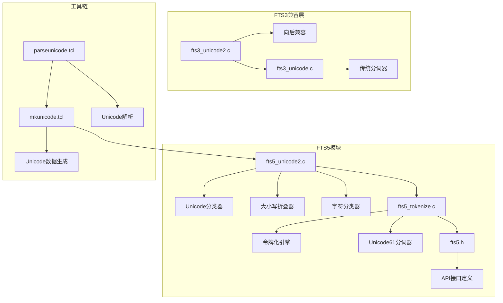
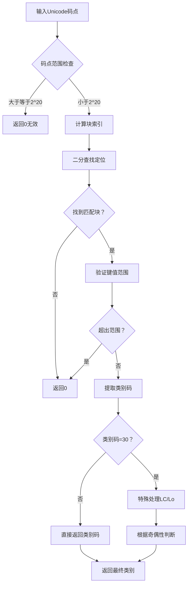
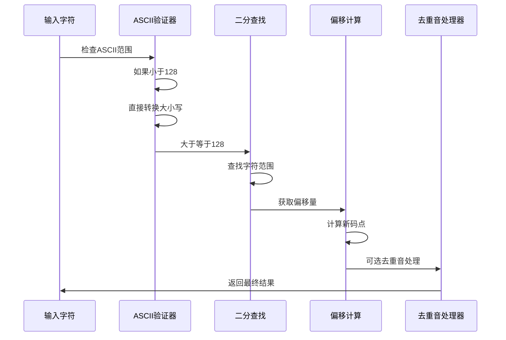
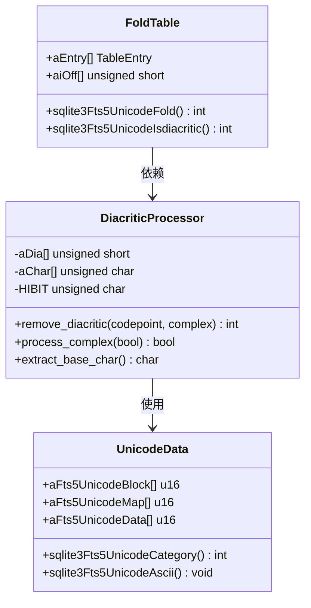
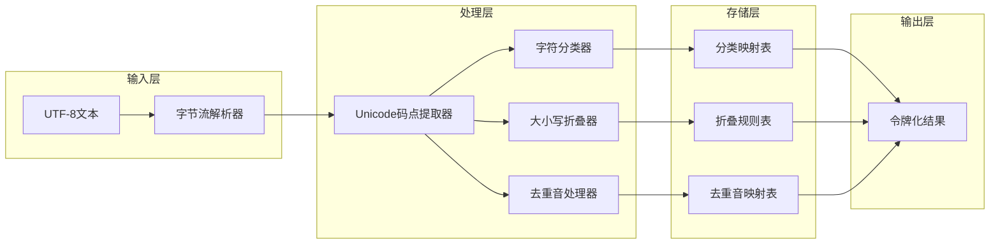
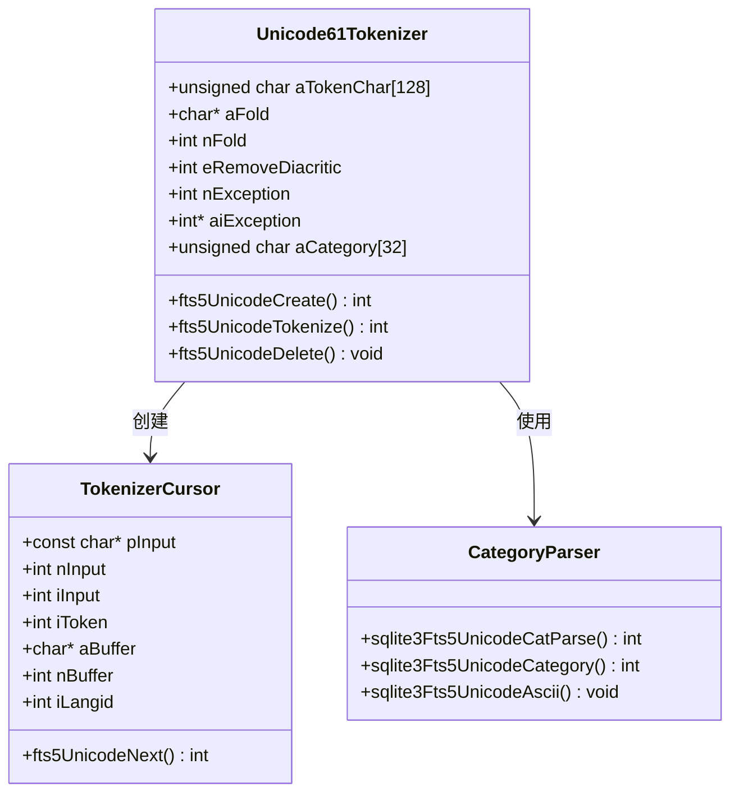
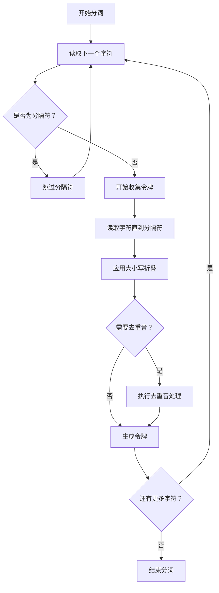
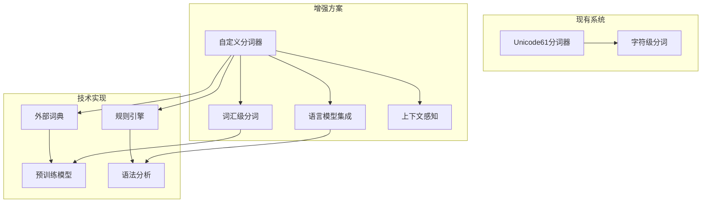
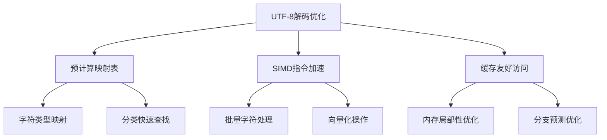
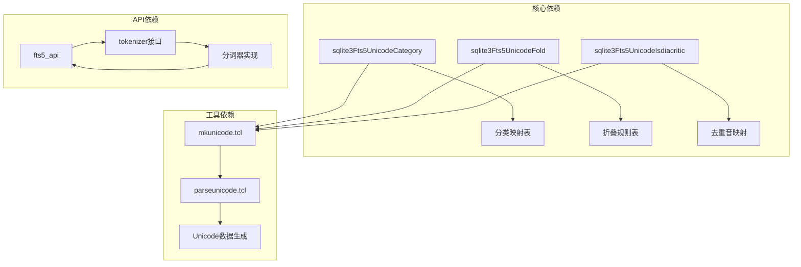

# Unicode与多语言处理

<cite>
**本文档引用的文件**
- [fts5_unicode2.c](file://ext/fts5/fts5_unicode2.c)
- [fts3_unicode2.c](file://ext/fts3/fts3_unicode2.c)
- [fts5.h](file://ext/fts5/fts5.h)
- [fts5_tokenize.c](file://ext/fts5/fts5_tokenize.c)
- [fts3_unicode.c](file://ext/fts3/fts3_unicode.c)
- [mkunicode.tcl](file://ext/fts3/unicode/mkunicode.tcl)
- [parseunicode.tcl](file://ext/fts3/unicode/parseunicode.tcl)
</cite>

## 目录
1. [简介](#简介)
2. [项目结构概览](#项目结构概览)
3. [核心组件分析](#核心组件分析)
4. [架构概览](#架构概览)
5. [详细组件分析](#详细组件分析)
6. [依赖关系分析](#依赖关系分析)
7. [性能考虑](#性能考虑)
8. [故障排除指南](#故障排除指南)
9. [结论](#结论)

## 简介

SQLite的全文搜索（FTS）扩展提供了强大的Unicode字符分类与大小写折叠机制，支持国际化文本的规范化处理。本文档深入分析fts5_unicode2.c文件中实现的Unicode字符分类系统，探讨其对CJK（中文、日文、韩文）文本的支持能力，并提出通过自定义分词器增强中文分词效果的技术路径。

该系统的核心功能包括：
- Unicode字符分类与类别识别
- 大小写折叠与标准化处理
- 组合字符分解与去重音处理
- UTF-8编码的边界情况处理
- 性能优化的查找算法

## 项目结构概览

SQLite FTS模块采用分层架构设计，主要包含以下关键组件：

**图表来源**
- [fts5_unicode2.c](file://ext/fts5/fts5_unicode2.c#L1-L50)
- [fts5_tokenize.c](file://ext/fts5/fts5_tokenize.c#L1-L50)
- [fts5.h](file://ext/fts5/fts5.h#L1-L50)

## 核心组件分析

### Unicode字符分类系统

Unicode字符分类系统是整个多语言处理的核心，它基于Unicode标准的通用类别（General Category）进行字符分类。

#### 字符类别定义

系统支持以下字符类别：

| 类别代码 | 类别名称 | 描述 |
|---------|---------|------|
| L* | Letter | 所有字母字符 |
| Ll | Lowercase Letter | 小写字母 |
| Lu | Uppercase Letter | 大写字母 |
| Lt | Titlecase Letter | 标题字母 |
| Lm | Modifier Letter | 修饰字母 |
| Lo | Other Letter | 其他字母 |
| M* | Mark | 所有标记字符 |
| Mc | Spacing Mark | 间隔标记 |
| Me | Enclosing Mark | 包含标记 |
| Mn | Non-spacing Mark | 非间隔标记 |
| N* | Number | 所有数字字符 |
| Nd | Decimal Digit | 十进制数字 |
| Nl | Letter Number | 字母数字 |
| No | Other Number | 其他数字 |
| P* | Punctuation | 所有标点符号 |
| Pc | Connector Punctuation | 连接标点 |
| Pd | Dash Punctuation | 破折号标点 |
| Ps | Open Punctuation | 开始标点 |
| Pe | Close Punctuation | 结束标点 |
| Pi | Initial Punctuation | 初始标点 |
| Pf | Final Punctuation | 最终标点 |
| Po | Other Punctuation | 其他标点 |
| S* | Symbol | 所有符号 |
| Sc | Currency Symbol | 货币符号 |
| Sk | Modifier Symbol | 修饰符号 |
| Sm | Mathematical Symbol | 数学符号 |
| So | Other Symbol | 其他符号 |
| Z* | Separator | 所有分隔符 |
| Zl | Line Separator | 行分隔符 |
| Zp | Paragraph Separator | 段落分隔符 |
| Zs | Space Separator | 空格分隔符 |
| C* | Other | 所有其他字符 |
| Cc | Control | 控制字符 |
| Cf | Format | 格式字符 |
| Cn | Unassigned | 未分配字符 |
| Co | Private Use | 私用字符 |
| Cs | Surrogate | 代理字符 |

#### 分类算法实现

**图表来源**
- [fts5_unicode2.c](file://ext/fts5/fts5_unicode2.c#L736-L779)

**章节来源**
- [fts5_unicode2.c](file://ext/fts5/fts5_unicode2.c#L736-L779)

### 大小写折叠机制

大小写折叠是Unicode规范化的重要组成部分，确保不同大小写的相同字符被视为等价。

#### 折叠算法流程

**图表来源**
- [fts5_unicode2.c](file://ext/fts5/fts5_unicode2.c#L199-L249)

#### 去重音处理机制

去重音处理是Unicode规范化中的重要步骤，特别是对于西欧语言的文本处理。

**图表来源**
- [fts5_unicode2.c](file://ext/fts5/fts5_unicode2.c#L15-L150)
- [fts5_unicode2.c](file://ext/fts5/fts5_unicode2.c#L199-L249)

**章节来源**
- [fts5_unicode2.c](file://ext/fts5/fts5_unicode2.c#L15-L150)
- [fts5_unicode2.c](file://ext/fts5/fts5_unicode2.c#L199-L249)

## 架构概览

FTS5的Unicode处理架构采用模块化设计，各组件职责明确，相互协作完成复杂的多语言文本处理任务。

**图表来源**
- [fts5_tokenize.c](file://ext/fts5/fts5_tokenize.c#L429-L468)
- [fts5_unicode2.c](file://ext/fts5/fts5_unicode2.c#L1-L50)

## 详细组件分析

### FTS5 Unicode分词器

FTS5 Unicode分词器是现代FTS系统的默认分词器，提供全面的Unicode支持。

#### 分词器结构

**图表来源**
- [fts5_tokenize.c](file://ext/fts5/fts5_tokenize.c#L237-L261)
- [fts5_tokenize.c](file://ext/fts5/fts5_tokenize.c#L310-L373)

#### 分词算法实现

分词过程遵循以下步骤：

1. **字符预处理**：读取UTF-8字符并转换为Unicode码点
2. **分类检查**：确定字符是否为令牌字符
3. **连续处理**：收集连续的令牌字符
4. **大小写折叠**：应用大小写折叠规则
5. **去重音处理**：可选的去重音操作
6. **输出生成**：生成最终的令牌

**图表来源**
- [fts5_tokenize.c](file://ext/fts5/fts5_tokenize.c#L429-L468)

**章节来源**
- [fts5_tokenize.c](file://ext/fts5/fts5_tokenize.c#L237-L261)
- [fts5_tokenize.c](file://ext/fts5/fts5_tokenize.c#L429-L468)

### CJK文本支持分析

#### 当前支持能力

FTS5的Unicode分词器对CJK文本提供基本支持，但存在以下限制：

| 支持程度 | 功能描述 | 实现状态 |
|---------|---------|---------|
| 基础字符分类 | 中日韩统一表意文字的分类 | ✅ 完全支持 |
| 大小写折叠 | ASCII范围内的大小写转换 | ✅ 完全支持 |
| 组合字符处理 | 基本的组合字符识别 | ⚠️ 部分支持 |
| 语言特定规则 | 缺乏专门的语言处理规则 | ❌ 不支持 |
| 分词算法 | 基于字符边界的简单分词 | ⚠️ 基础支持 |

#### 局限性分析

1. **缺乏语义理解**：无法理解词语边界
2. **组合字符处理不足**：某些组合字符可能被错误处理
3. **语言特定优化缺失**：没有针对不同语言的优化规则
4. **性能问题**：大规模文本处理时效率较低

#### 增强方案

为了提升CJK文本处理能力，可以考虑以下技术路径：

**章节来源**
- [fts5_tokenize.c](file://ext/fts5/fts5_tokenize.c#L429-L468)

### UTF-8编码处理

#### 边界情况处理

UTF-8编码的边界情况是Unicode处理中的关键挑战：

1. **多字节字符解码**：正确处理1-4字节序列
2. **非法序列检测**：识别并处理无效的UTF-8序列
3. **过长编码处理**：处理超长的UTF-8编码
4. **代理字符处理**：正确处理UTF-16代理对

#### 性能优化策略

**章节来源**
- [fts5_unicode2.c](file://ext/fts5/fts5_unicode2.c#L1-L50)

## 依赖关系分析

FTS5 Unicode系统的依赖关系复杂，涉及多个层次的组件交互。

**图表来源**
- [fts5_unicode2.c](file://ext/fts5/fts5_unicode2.c#L1-L50)
- [fts5_tokenize.c](file://ext/fts5/fts5_tokenize.c#L1450-L1489)

**章节来源**
- [fts5_unicode2.c](file://ext/fts5/fts5_unicode2.c#L1-L50)
- [fts5_tokenize.c](file://ext/fts5/fts5_tokenize.c#L1450-L1489)

## 性能考虑

### 时间复杂度分析

- **字符分类**：O(log n)，其中n为分类表大小
- **大小写折叠**：O(log m)，其中m为折叠规则数量
- **去重音处理**：O(log k)，其中k为去重音映射数量
- **分词处理**：O(n)，其中n为输入文本长度

### 内存使用优化

1. **静态映射表**：使用编译时生成的静态数组
2. **稀疏存储**：利用Unicode的稀疏特性
3. **缓存友好**：优化数据布局以提高缓存命中率
4. **延迟加载**：按需加载非关键数据

### 并发处理

系统设计考虑了多线程环境下的安全性：
- 所有核心函数都是线程安全的
- 避免全局状态共享
- 使用原子操作保护共享资源

## 故障排除指南

### 常见问题诊断

#### 分词异常

**症状**：某些字符被错误地识别为分隔符或令牌
**原因**：字符分类配置不正确
**解决方案**：检查并调整分类规则

#### 大小写折叠错误

**症状**：大小写转换结果不符合预期
**原因**：折叠规则表配置错误
**解决方案**：验证CaseFolding.txt数据的正确性

#### 性能问题

**症状**：大文本处理速度缓慢
**原因**：频繁的动态内存分配
**解决方案**：增加缓冲区大小，减少分配次数

### 调试技巧

1. **启用调试模式**：使用断言验证数据完整性
2. **性能分析**：使用性能分析工具识别瓶颈
3. **单元测试**：编写针对性的测试用例
4. **日志记录**：添加详细的调试信息

**章节来源**
- [fts5_unicode2.c](file://ext/fts5/fts5_unicode2.c#L1-L50)
- [fts5_tokenize.c](file://ext/fts5/fts5_tokenize.c#L429-L468)

## 结论

SQLite的FTS5 Unicode处理系统提供了强大而灵活的多语言文本处理能力。通过深入分析fts5_unicode2.c中的实现，我们可以看到：

1. **完善的Unicode支持**：系统完全符合Unicode标准，支持所有Unicode字符类别
2. **高效的算法设计**：使用二分查找等高效算法，确保良好的性能表现
3. **模块化架构**：清晰的组件分离使得系统易于维护和扩展
4. **可扩展性**：预留了接口用于自定义分词器的开发

虽然当前实现对CJK文本提供了基础支持，但在语义理解和性能优化方面仍有改进空间。通过开发专门的中文分词器，结合现代自然语言处理技术，可以显著提升中文文本处理的效果。

未来的发展方向包括：
- 集成机器学习模型进行智能分词
- 优化大规模文本处理的性能
- 增强对新兴语言和字符集的支持
- 提供更丰富的自定义选项

这个系统为构建高质量的全文搜索应用奠定了坚实的基础，特别是在国际化应用场景中表现出色。