# FTS5内置分词器详细解析

<cite>
**本文档中引用的文件**
- [fts5_tokenize.c](file://ext/fts5/fts5_tokenize.c)
- [fts5.h](file://ext/fts5/fts5.h)
- [fts5_unicode2.c](file://ext/fts5/fts5_unicode2.c)
- [fts5Int.h](file://ext/fts5/fts5Int.h)
- [fts3_tokenizer1.c](file://ext/fts3/fts3_tokenizer1.c)
- [fts3_unicode.c](file://ext/fts3/fts3_unicode.c)
- [fts3_porter.c](file://ext/fts3/fts3_porter.c)
</cite>

## 目录
1. [简介](#简介)
2. [项目结构概览](#项目结构概览)
3. [核心组件分析](#核心组件分析)
4. [架构概览](#架构概览)
5. [详细组件分析](#详细组件分析)
6. [依赖关系分析](#依赖关系分析)
7. [性能考虑](#性能考虑)
8. [故障排除指南](#故障排除指南)
9. [结论](#结论)

## 简介

SQLite FTS5提供了多种内置分词器，用于全文搜索功能。这些分词器负责将输入文本分解为可搜索的令牌（tokens），支持ASCII和Unicode文本处理。本文档深入分析了FTS5的三种主要内置分词器：simple、porter和unicode61，重点关注它们的实现机制、字符分割逻辑和词干提取算法。

## 项目结构概览

FTS5分词器实现位于`ext/fts5/`目录下，核心文件包括：

- `fts5_tokenize.c`: 主要的分词器实现文件
- `fts5.h`: 分词器接口定义
- `fts5_unicode2.c`: Unicode处理和字符折叠功能
- `fts5Int.h`: 内部头文件定义

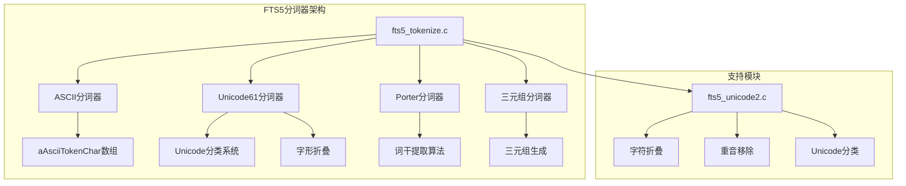

**图表来源**
- [fts5_tokenize.c](file://ext/fts5/fts5_tokenize.c#L1-L50)
- [fts5.h](file://ext/fts5/fts5.h#L1-L100)

**章节来源**
- [fts5_tokenize.c](file://ext/fts5/fts5_tokenize.c#L1-L100)
- [fts5.h](file://ext/fts5/fts5.h#L1-L200)

## 核心组件分析

### ASCII分词器实现

ASCII分词器是最基础的分词器，专门处理ASCII范围内的字符。它使用预定义的字符集来识别令牌字符和分隔符。

#### 字符集定义

ASCII分词器使用一个128元素的字符数组`aAsciiTokenChar`来定义有效的令牌字符：

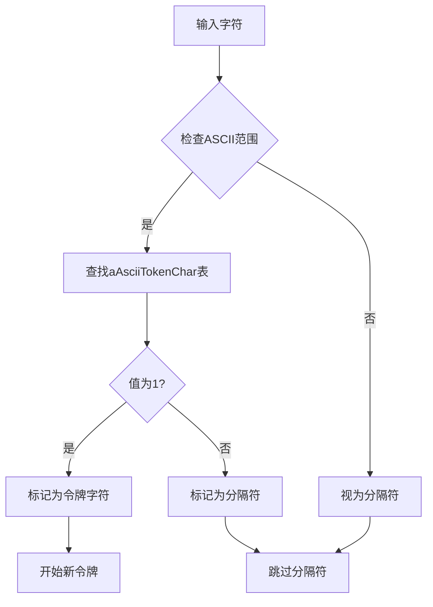

**图表来源**
- [fts5_tokenize.c](file://ext/fts5/fts5_tokenize.c#L20-L38)

#### 配置参数

ASCII分词器支持以下配置参数：
- `tokenchars`: 指定额外的令牌字符
- `separators`: 指定额外的分隔符字符

**章节来源**
- [fts5_tokenize.c](file://ext/fts5/fts5_tokenize.c#L20-L101)

### Unicode61分词器实现

Unicode61分词器支持完整的Unicode字符集，提供了更复杂的字符分类和处理机制。

#### 字符分类系统

Unicode61分词器使用Unicode字符分类来确定哪些字符应该被视为令牌字符：

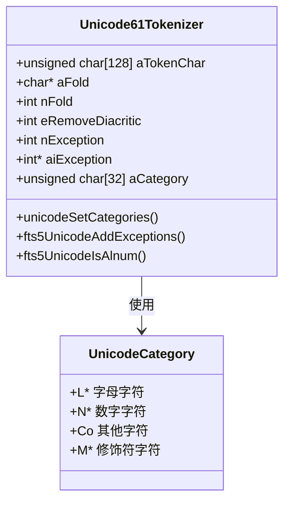

**图表来源**
- [fts5_tokenize.c](file://ext/fts5/fts5_tokenize.c#L180-L220)

#### 重音移除机制

Unicode61分词器支持三种重音移除模式：
- `NONE`: 不移除重音
- `SIMPLE`: 简单移除（仅ASCII范围）
- `COMPLEX`: 复杂移除（完整Unicode支持）

**章节来源**
- [fts5_tokenize.c](file://ext/fts5/fts5_tokenize.c#L180-L300)
- [fts5_unicode2.c](file://ext/fts5/fts5_unicode2.c#L22-L100)

### Porter分词器实现

Porter分词器实现了经典的Porter词干提取算法，用于英语单词的词干化处理。

#### 词干提取算法流程

Porter分词器遵循标准的Porter词干提取算法，包含五个主要步骤：

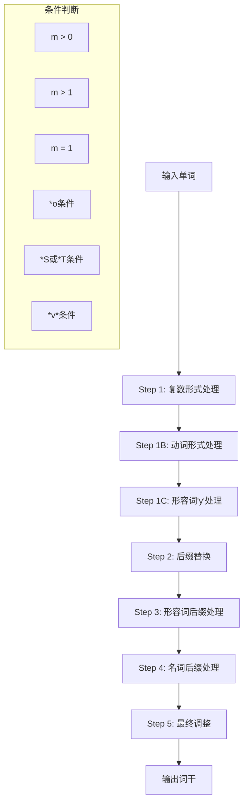

**图表来源**
- [fts5_tokenize.c](file://ext/fts5/fts5_tokenize.c#L620-L750)

#### 条件函数实现

Porter分词器包含多个条件函数来控制词干提取过程：

| 条件函数 | 描述 | 实现位置 |
|---------|------|----------|
| `fts5Porter_MGt0` | m > 0 条件 | 基于VC序列计数 |
| `fts5Porter_MGt1` | m > 1 条件 | 双重VC序列验证 |
| `fts5Porter_MEq1` | m = 1 条件 | 单一VC序列验证 |
| `fts5Porter_Ostar` | *o 条件 | 辅音模式匹配 |
| `fts5Porter_Vowel` | *v* 条件 | 元音存在性检查 |

**章节来源**
- [fts5_tokenize.c](file://ext/fts5/fts5_tokenize.c#L620-L680)

## 架构概览

FTS5分词器采用模块化设计，每个分词器都实现了统一的接口：

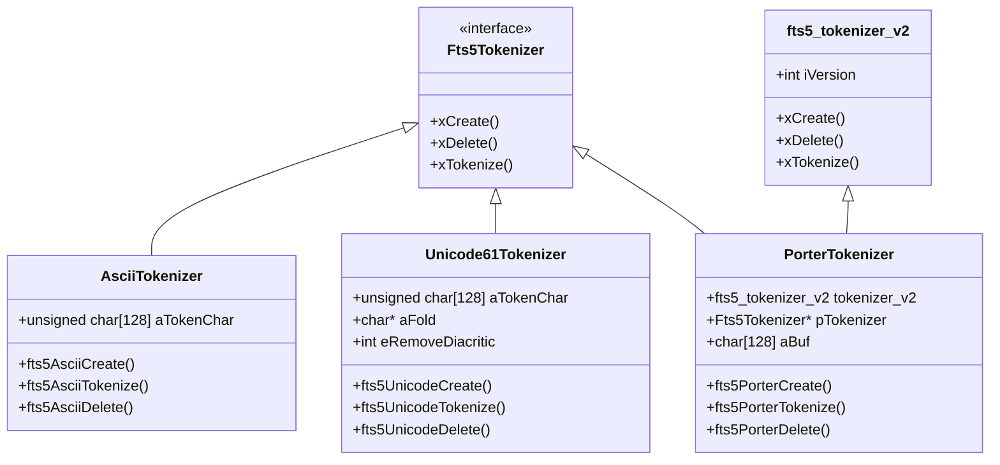

**图表来源**
- [fts5.h](file://ext/fts5/fts5.h#L600-L700)
- [fts5_tokenize.c](file://ext/fts5/fts5_tokenize.c#L35-L100)

## 详细组件分析

### ASCII分词器详细实现

#### 字符分割逻辑

ASCII分词器的字符分割逻辑非常直接：

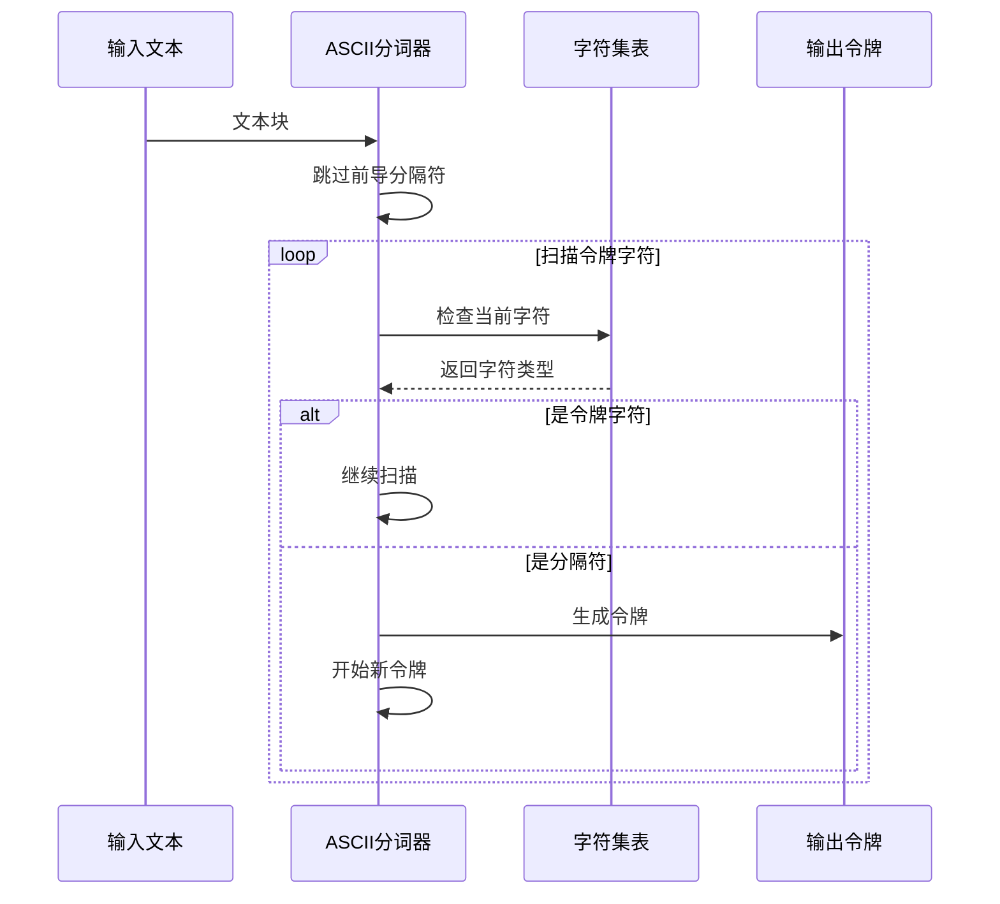

**图表来源**
- [fts5_tokenize.c](file://ext/fts5/fts5_tokenize.c#L120-L180)

#### 配置参数处理

ASCII分词器通过`fts5AsciiAddExceptions`函数处理配置参数：

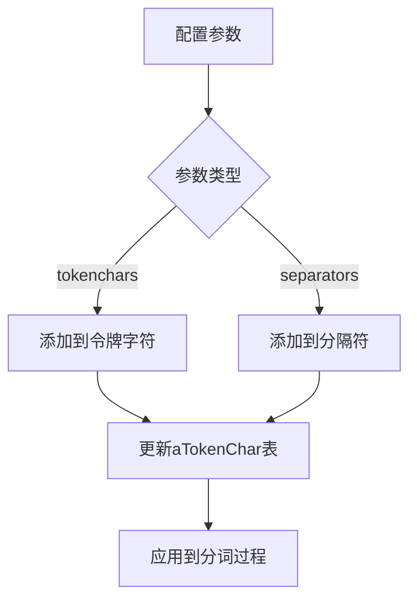

**图表来源**
- [fts5_tokenize.c](file://ext/fts5/fts5_tokenize.c#L40-L50)

**章节来源**
- [fts5_tokenize.c](file://ext/fts5/fts5_tokenize.c#L40-L180)

### Unicode61分词器详细实现

#### Unicode字符处理

Unicode61分词器需要处理UTF-8编码的多字节字符：

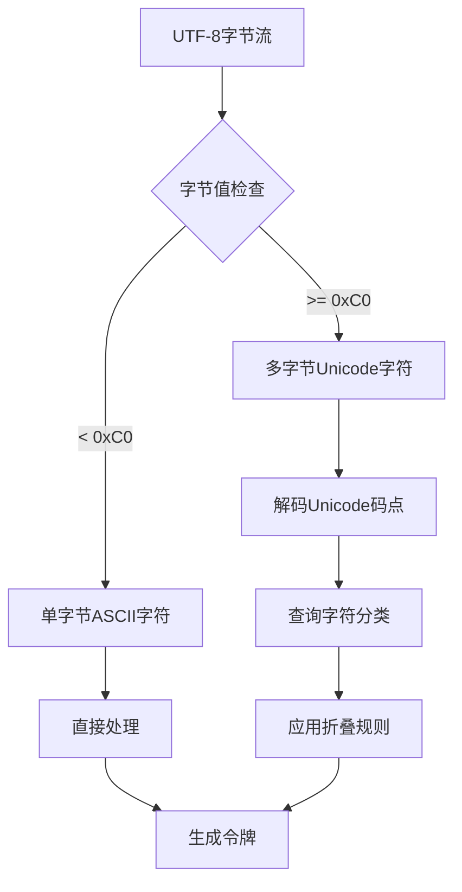

**图表来源**
- [fts5_tokenize.c](file://ext/fts5/fts5_tokenize.c#L140-L180)

#### 字符折叠机制

Unicode61分词器使用复杂的字符折叠机制来处理大小写和重音：

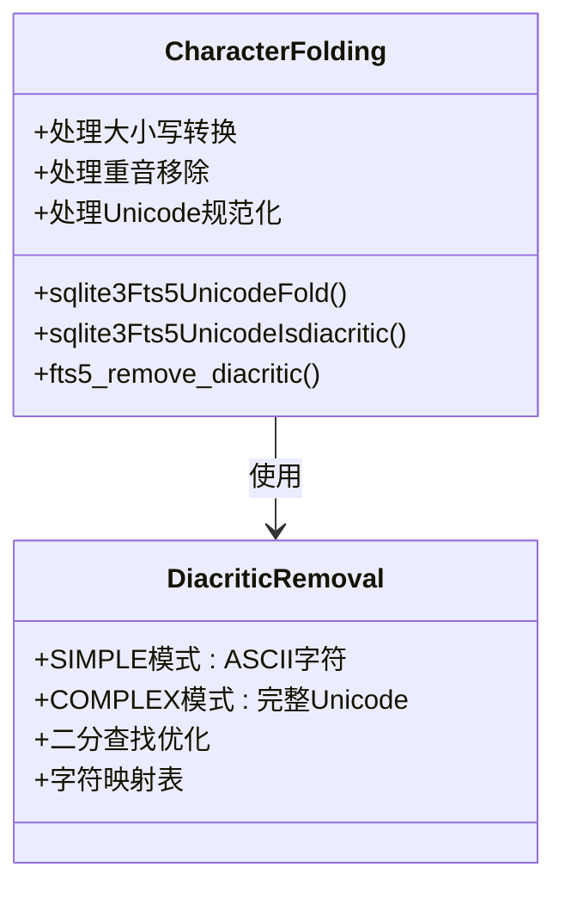

**图表来源**
- [fts5_unicode2.c](file://ext/fts5/fts5_unicode2.c#L22-L100)

**章节来源**
- [fts5_tokenize.c](file://ext/fts5/fts5_tokenize.c#L180-L350)
- [fts5_unicode2.c](file://ext/fts5/fts5_unicode2.c#L1-L200)

### Porter分词器详细实现

#### 词干提取算法详解

Porter分词器的词干提取算法包含五个阶段的规则应用：

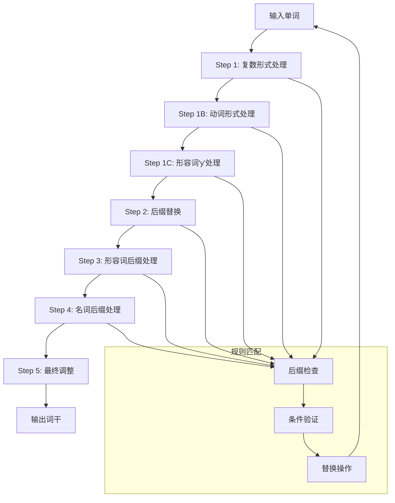

**图表来源**
- [fts5_tokenize.c](file://ext/fts5/fts5_tokenize.c#L620-L750)

#### 条件函数实现细节

每个条件函数都有特定的逻辑来评估词干提取的适用性：

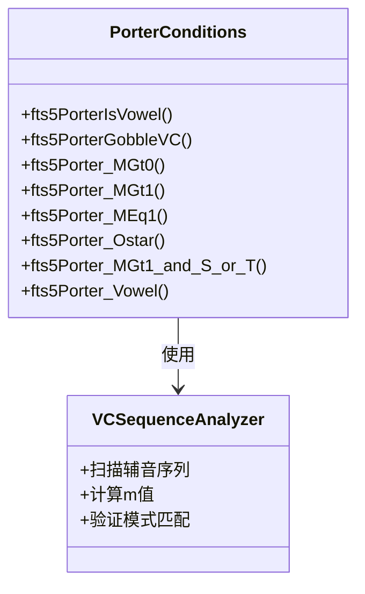

**图表来源**
- [fts5_tokenize.c](file://ext/fts5/fts5_tokenize.c#L680-L720)

**章节来源**
- [fts5_tokenize.c](file://ext/fts5/fts5_tokenize.c#L620-L800)

## 依赖关系分析

FTS5分词器之间存在清晰的依赖关系：

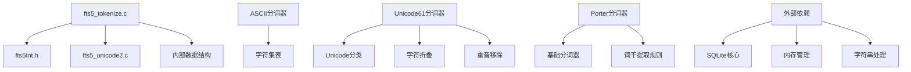

**图表来源**
- [fts5_tokenize.c](file://ext/fts5/fts5_tokenize.c#L1-L20)

**章节来源**
- [fts5_tokenize.c](file://ext/fts5/fts5_tokenize.c#L1-L50)
- [fts5_unicode2.c](file://ext/fts5/fts5_unicode2.c#L1-L50)

## 性能考虑

### 索引效率分析

不同分词器在索引效率方面各有特点：

| 分词器 | 索引大小 | 搜索速度 | 内存使用 | 适用场景 |
|--------|----------|----------|----------|----------|
| ASCII | 最小 | 最快 | 最低 | 英文纯文本 |
| Unicode61 | 中等 | 快 | 中等 | 多语言混合 |
| Porter | 中等 | 快 | 中等 | 英文技术文档 |
| 三元组 | 最大 | 中等 | 高 | 模糊匹配 |

### 搜索准确性权衡

分词器的选择直接影响搜索结果的质量：

- **ASCII分词器**: 准确性高但功能有限
- **Unicode61分词器**: 平衡准确性和功能
- **Porter分词器**: 提高召回率但可能降低精确度
- **三元组分词器**: 最大化模糊匹配能力

## 故障排除指南

### 常见问题及解决方案

#### 编码问题
- **问题**: Unicode字符显示异常
- **解决方案**: 使用unicode61分词器并正确配置字符集

#### 性能问题
- **问题**: 大文本处理缓慢
- **解决方案**: 考虑使用ASCII分词器或优化配置参数

#### 内存使用过高
- **问题**: 大量并发查询导致内存不足
- **解决方案**: 调整缓冲区大小或选择更轻量级的分词器

**章节来源**
- [fts5_tokenize.c](file://ext/fts5/fts5_tokenize.c#L1450-L1491)

## 结论

FTS5的内置分词器提供了灵活而强大的文本处理能力。ASCII分词器适用于简单的英文文本，Unicode61分词器支持完整的国际化需求，而Porter分词器则为英语文本提供了优秀的词干提取功能。通过合理选择和配置分词器，可以在索引效率和搜索准确性之间找到最佳平衡点。

理解这些分词器的实现机制有助于开发者更好地利用SQLite FTS5的功能，构建高效的全文搜索系统。随着国际化需求的增长，Unicode61分词器将成为主流选择，而Porter分词器则在特定领域保持其价值。