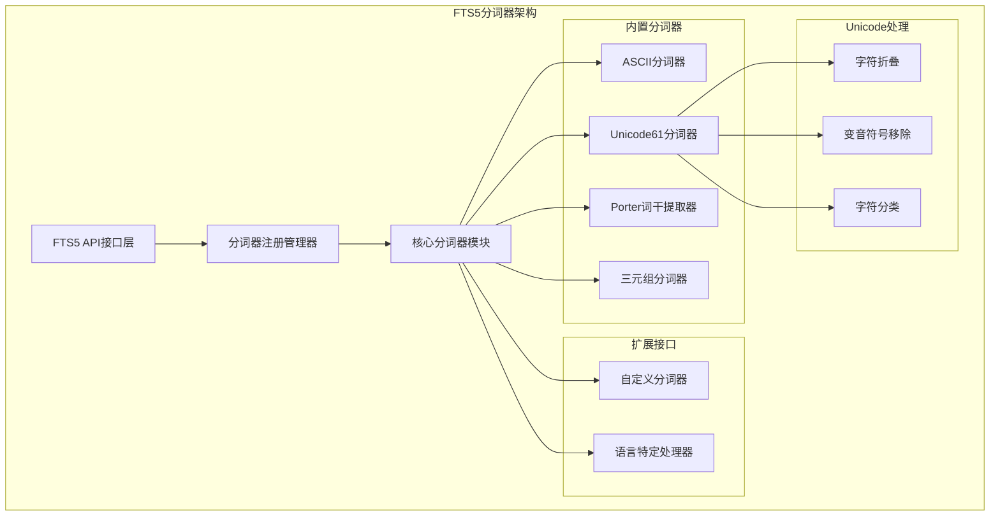
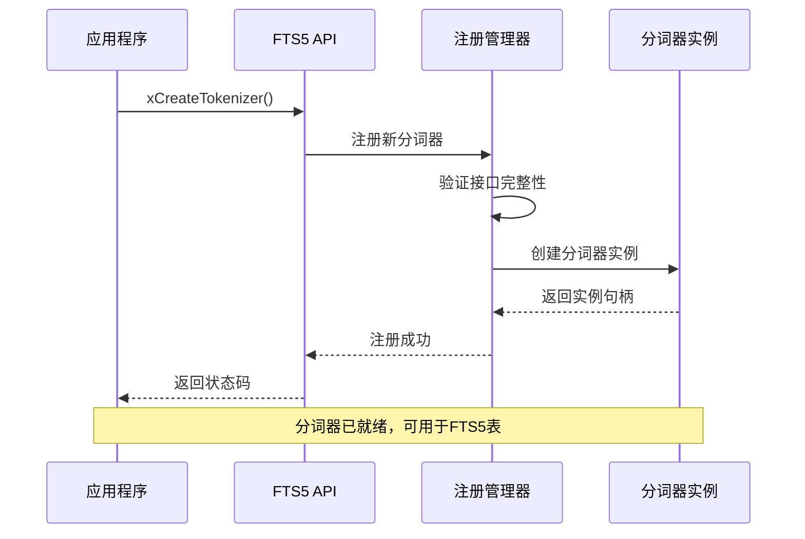
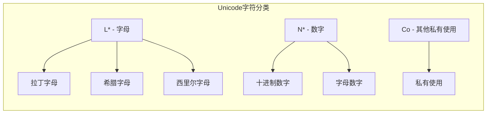
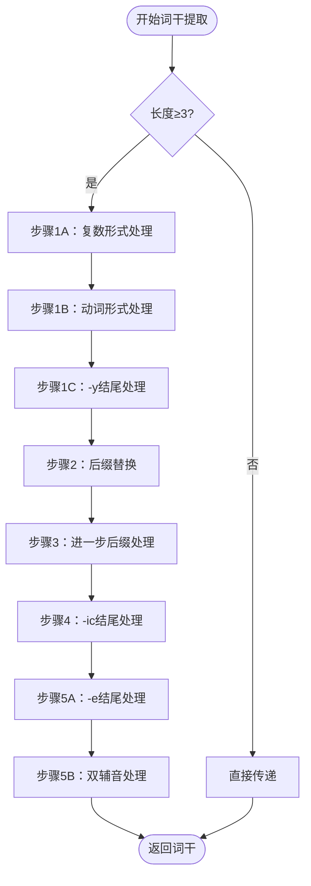
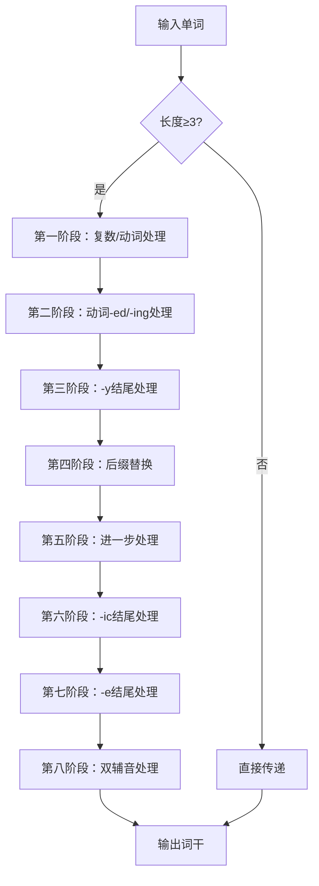

# FTS5分词器系统架构与实现

<cite>
**本文档引用的文件**
- [fts5_tokenize.c](file://ext/fts5/fts5_tokenize.c)
- [fts5.h](file://ext/fts5/fts5.h)
- [fts5Int.h](file://ext/fts5/fts5Int.h)
- [fts5_unicode2.c](file://ext/fts5/fts5_unicode2.c)
- [fts5_main.c](file://ext/fts5/fts5_main.c)
- [fts5_tcl.c](file://ext/fts5/fts5_tcl.c)
</cite>

## 目录
1. [引言](#引言)
2. [分词器系统架构概览](#分词器系统架构概览)
3. [可插拔设计模式](#可插拔设计模式)
4. [内置分词器详解](#内置分词器详解)
5. [Unicode处理机制](#unicode处理机制)
6. [词干提取算法](#词干提取算法)
7. [自定义分词器开发](#自定义分词器开发)
8. [分词器配置与优化](#分词器配置与优化)
9. [多语言适配策略](#多语言适配策略)
10. [性能考量与最佳实践](#性能考量与最佳实践)
11. [总结](#总结)

## 引言

FTS5（Full-Text Search 5）是SQLite的高级全文搜索引擎，其核心特性之一是高度可配置的分词器（Tokenizer）系统。该系统采用可插拔架构设计，支持多种内置分词器，并允许开发者注册自定义分词器以满足特定的语言处理需求。

分词器系统负责将输入文本分解为独立的词汇单元（tokens），这是全文搜索的基础。FTS5的分词器不仅需要处理基本的文本分割，还要支持Unicode字符集、词干提取、大小写转换等高级功能。

## 分词器系统架构概览

FTS5分词器系统采用模块化架构，主要包含以下核心组件：



**图表来源**
- [fts5.h](file://ext/fts5/fts5.h#L407-L434)
- [fts5_main.c](file://ext/fts5/fts5_main.c#L111-L139)

**章节来源**
- [fts5.h](file://ext/fts5/fts5.h#L407-L434)
- [fts5_main.c](file://ext/fts5/fts5_main.c#L111-L139)

## 可插拔设计模式

FTS5的分词器系统采用了经典的可插拔架构模式，通过标准化的接口定义实现了高度的灵活性和可扩展性。

### 接口定义结构

分词器系统定义了两套主要的接口版本：

#### 传统接口（fts5_tokenizer）
```c
typedef struct fts5_tokenizer fts5_tokenizer;
struct fts5_tokenizer {
  int (*xCreate)(void*, const char **azArg, int nArg, Fts5Tokenizer **ppOut);
  void (*xDelete)(Fts5Tokenizer*);
  int (*xTokenize)(Fts5Tokenizer*, 
      void *pCtx,
      int flags,            /* FTS5_TOKENIZE_* flags */
      const char *pText, int nText, 
      int (*xToken)(
        void *pCtx,         /* 复制xTokenize()的第二个参数 */
        int tflags,         /* FTS5_TOKEN_* 标志位掩码 */
        const char *pToken, /* 指向包含token的缓冲区 */
        int nToken,         /* token的字节大小 */
        int iStart,         /* 输入文本中token起始字节偏移 */
        int iEnd            /* 输入文本中token结束字节偏移 */
      )
  );
};
```

#### 增强接口（fts5_tokenizer_v2）
```c
typedef struct fts5_tokenizer_v2 fts5_tokenizer_v2;
struct fts5_tokenizer_v2 {
  int iVersion;             /* 当前始终为2 */
  int (*xCreate)(void*, const char **azArg, int nArg, Fts5Tokenizer **ppOut);
  void (*xDelete)(Fts5Tokenizer*);
  int (*xTokenize)(Fts5Tokenizer*, 
      void *pCtx,
      int flags,            /* FTS5_TOKENIZE_* flags */
      const char *pText, int nText, 
      const char *pLocale, int nLocale,
      int (*xToken)(
        void *pCtx,
        int tflags,
        const char *pToken,
        int nToken,
        int iStart,
        int iEnd
      )
  );
};
```

### 注册机制

分词器通过FTS5 API进行注册，支持两种注册方式：



**图表来源**
- [fts5.h](file://ext/fts5/fts5.h#L700-L730)
- [fts5_main.c](file://ext/fts5/fts5_main.c#L111-L139)

**章节来源**
- [fts5.h](file://ext/fts5/fts5.h#L407-L434)
- [fts5.h](file://ext/fts5/fts5.h#L700-L730)

## 内置分词器详解

FTS5提供了四种内置分词器，每种都有其特定的应用场景和优势。

### ASCII分词器

ASCII分词器是最基础的分词器，专门处理ASCII字符集。

#### 工作原理
- **字符集范围**：仅处理ASCII范围内的字符（0-127）
- **令牌字符**：数字（0-9）、字母（A-Z, a-z）
- **分隔符**：所有其他ASCII字符
- **大小写处理**：自动转换为小写

#### 配置选项
- `tokenchars`：指定额外的令牌字符
- `separators`：指定额外的分隔符

### Unicode61分词器

Unicode61分词器是FTS5最强大的内置分词器，支持完整的Unicode字符集。

#### 核心特性
- **Unicode兼容性**：支持所有Unicode字符
- **字符分类**：基于Unicode标准的字符分类
- **变音符号处理**：可配置的变音符号移除
- **大小写折叠**：智能的大小写转换

#### 字符分类系统


**图表来源**
- [fts5_unicode2.c](file://ext/fts5/fts5_unicode2.c#L736-L779)

#### 配置参数
- `categories`：指定要识别的字符类别
- `remove_diacritics`：控制变音符号处理级别
  - `0`：不移除变音符号
  - `1`：简单移除
  - `2`：复杂移除

### Porter词干提取器

Porter词干提取器基于著名的Porter Stemming Algorithm，用于英语单词的词干提取。

#### 词干提取算法流程


**图表来源**
- [fts5_tokenize.c](file://ext/fts5/fts5_tokenize.c#L800-L1490)

#### 词干提取规则
- **复数形式**：将"-sses"、"-ies"等转换为单数形式
- **动词时态**：处理"-ed"、"-ing"等动词形式
- **形容词比较级**：转换"-er"、"-est"为原级
- **名词复数**：移除"-s"、"-es"等复数标记

### 三元组分词器

三元组分词器将文本分解为连续的三个字符组合，适用于模糊匹配和拼写检查。

#### 工作机制
- **三元组生成**：将文本分解为连续的三个字符序列
- **大小写敏感控制**：可配置是否区分大小写
- **变音符号处理**：可选择移除或保留变音符号

#### 应用场景
- **模糊查询**：支持拼写错误的容错匹配
- **相似度计算**：用于文本相似度比较
- **快速索引**：提供快速的前缀匹配能力

**章节来源**
- [fts5_tokenize.c](file://ext/fts5/fts5_tokenize.c#L0-L800)
- [fts5_tokenize.c](file://ext/fts5/fts5_tokenize.c#L1276-L1490)

## Unicode处理机制

FTS5的Unicode处理是其强大功能的核心，涉及字符编码、大小写转换、变音符号处理等多个方面。

### 字符编码处理

#### UTF-8解析机制
```c
#define READ_UTF8(zIn, zTerm, c)                           \
  c = *(zIn++);                                            \
  if( c>=0xc0 ){                                           \
    c = sqlite3Utf8Trans1[c-0xc0];                         \
    while( zIn<zTerm && (*zIn & 0xc0)==0x80 ){             \
      c = (c<<6) + (0x3f & *(zIn++));                      \
    }                                                      \
    if( c<0x80                                             \
        || (c&0xFFFFF800)==0xD800                          \
        || (c&0xFFFFFFFE)==0xFFFE ){  c = 0xFFFD; }        \
  }
```

#### 字符写入机制
```c
#define WRITE_UTF8(zOut, c) {                          \
  if( c<0x00080 ){                                     \
    *zOut++ = (unsigned char)(c&0xFF);                 \
  }                                                    \
  else if( c<0x00800 ){                                \
    *zOut++ = 0xC0 + (unsigned char)((c>>6)&0x1F);     \
    *zOut++ = 0x80 + (unsigned char)(c & 0x3F);        \
  }                                                    \
  else if( c<0x10000 ){                                \
    *zOut++ = 0xE0 + (unsigned char)((c>>12)&0x0F);    \
    *zOut++ = 0x80 + (unsigned char)((c>>6) & 0x3F);   \
    *zOut++ = 0x80 + (unsigned char)(c & 0x3F);        \
  }else{                                               \
    *zOut++ = 0xF0 + (unsigned char)((c>>18) & 0x07);  \
    *zOut++ = 0x80 + (unsigned char)((c>>12) & 0x3F);  \
    *zOut++ = 0x80 + (unsigned char)((c>>6) & 0x3F);   \
    *zOut++ = 0x80 + (unsigned char)(c & 0x3F);        \
  }                                                    \
}
```

### 大小写折叠机制

#### 折叠算法实现
```c
int sqlite3Fts5UnicodeFold(int c, int eRemoveDiacritic){
  static const struct TableEntry {
    unsigned short iCode;
    unsigned char flags;
    unsigned char nRange;
  } aEntry[] = {
    {65, 14, 26},          {181, 64, 1},          {192, 14, 23},
    {216, 14, 7},          {256, 1, 48},          {306, 1, 6},
    // ... 更多条目
  };
  
  // 查找合适的折叠规则
  // 计算折叠后的字符值
  return (c + aiOff[flags>>1]) & 0xFFFF;
}
```

### 变音符号处理

#### 变音符号检测
```c
int sqlite3Fts5UnicodeIsdiacritic(int c){
  unsigned int mask0 = 0x08029FDF;
  unsigned int mask1 = 0x000361F8;
  if( c<768 || c>817 ) return 0;
  return (c < 768+32) ?
      (mask0 & ((unsigned int)1 << (c-768))) :
      (mask1 & ((unsigned int)1 << (c-768-32)));
}
```

#### 变音符号移除算法
```c
static int fts5_remove_diacritic(int c, int bComplex){
  unsigned short aDia[] = {
    // 变音符号映射表
    0,  1797,  1848,  1859,  1891,  1928,  1940,  1995,
    // ... 更多映射
  };
  
  // 二分查找确定映射关系
  // 返回基础字符
  return (c > (aDia[iRes]>>3) + (aDia[iRes]&0x07)) ? c : ((int)aChar[iRes] & 0x7F);
}
```

**章节来源**
- [fts5_unicode2.c](file://ext/fts5/fts5_unicode2.c#L22-L48)
- [fts5_unicode2.c](file://ext/fts5/fts5_unicode2.c#L107-L138)

## 词干提取算法

FTS5的Porter词干提取算法是一个经典的英语词干化工具，遵循原始的Porter算法规范。

### 算法阶段划分

#### 第一阶段：复数和动词形式处理
```c
static void fts5PorterStep1A(char *aBuf, int *pnBuf){
  int nBuf = *pnBuf;
  if( aBuf[nBuf-1]=='s' ){
    if( aBuf[nBuf-2]=='e' ){
      if( (nBuf>4 && aBuf[nBuf-4]=='s' && aBuf[nBuf-3]=='s') 
       || (nBuf>3 && aBuf[nBuf-3]=='i' )
      ){
        *pnBuf = nBuf-2;
      }else{
        *pnBuf = nBuf-1;
      }
    }
    else if( aBuf[nBuf-2]!='s' ){
      *pnBuf = nBuf-1;
    }
  }
}
```

#### 第二阶段：后缀替换规则
算法包含多个后缀替换规则，每个规则都有特定的条件要求：
- **条件函数**：检查词干长度、元音存在性等
- **后缀匹配**：精确匹配特定的后缀序列
- **替换操作**：将匹配的后缀替换为新的后缀

#### 条件函数类型
```c
// (m > 0)
static int fts5Porter_MGt0(char *zStem, int nStem){
  return !!fts5PorterGobbleVC(zStem, nStem, 0);
}

// (m > 1)
static int fts5Porter_MGt1(char *zStem, int nStem){
  int n = fts5PorterGobbleVC(zStem, nStem, 0);
  if( n && fts5PorterGobbleVC(&zStem[n], nStem-n, 1) ){
    return 1;
  }
  return 0;
}

// (*o) - 结尾是辅音且倒数第三个是元音
static int fts5Porter_Ostar(char *zStem, int nStem){
  // 实现细节
}
```

### 词干提取流程



**图表来源**
- [fts5_tokenize.c](file://ext/fts5/fts5_tokenize.c#L800-L1490)

**章节来源**
- [fts5_tokenize.c](file://ext/fts5/fts5_tokenize.c#L800-L1490)

## 自定义分词器开发

FTS5提供了灵活的接口来开发自定义分词器，支持多种编程语言和应用场景。

### 开发步骤

#### 1. 实现基本接口
```c
typedef struct MyTokenizer MyTokenizer;
struct MyTokenizer {
  // 分词器状态信息
  int param1;
  char *param2;
  // 其他必要字段
};

// 创建函数
static int myTokenizerCreate(
  void *pUserData,
  const char **azArg, int nArg,
  Fts5Tokenizer **ppOut
){
  MyTokenizer *p = sqlite3_malloc(sizeof(MyTokenizer));
  if( p==0 ) return SQLITE_NOMEM;
  
  // 初始化分词器参数
  p->param1 = 0;
  p->param2 = 0;
  
  // 解析配置参数
  for(int i=0; i<nArg; i+=2){
    if( strcmp(azArg[i], "option1")==0 ){
      p->param1 = atoi(azArg[i+1]);
    }
    // ... 其他参数处理
  }
  
  *ppOut = (Fts5Tokenizer*)p;
  return SQLITE_OK;
}

// 删除函数
static void myTokenizerDelete(Fts5Tokenizer *p){
  sqlite3_free(p);
}

// 分词函数
static int myTokenizerTokenize(
  Fts5Tokenizer *pTokenizer,
  void *pCtx,
  int flags,
  const char *pText, int nText,
  int (*xToken)(void*, int, const char*, int, int, int)
){
  MyTokenizer *p = (MyTokenizer*)pTokenizer;
  
  // 实现自定义分词逻辑
  // 调用xToken回调函数返回每个token
  
  return SQLITE_OK;
}
```

#### 2. 注册分词器
```c
int registerMyTokenizer(sqlite3 *db){
  fts5_api *pApi;
  sqlite3_create_module_v2(db, "my_tokenizer", 
    sqlite3_fts5_extension_init_v2, (void*)"my_data", 0);
    
  // 获取FTS5 API
  sqlite3_fts5_api(db, &pApi);
  
  // 注册分词器
  fts5_tokenizer tokenizer = {
    myTokenizerCreate,
    myTokenizerDelete,
    myTokenizerTokenize
  };
  
  return pApi->xCreateTokenizer(pApi, "my_tokenizer", 
    (void*)"user_data", &tokenizer, 0);
}
```

### 高级功能实现

#### 同义词支持
```c
static int myTokenizerTokenize(
  Fts5Tokenizer *pTokenizer,
  void *pCtx,
  int flags,
  const char *pText, int nText,
  int (*xToken)(void*, int, const char*, int, int, int)
){
  // 主token
  xToken(pCtx, 0, "primary_token", len, start, end);
  
  // 同义词token
  xToken(pCtx, FTS5_TOKEN_COLOCATED, "synonym1", len1, start, end);
  xToken(pCtx, FTS5_TOKEN_COLOCATED, "synonym2", len2, start, end);
  
  return SQLITE_OK;
}
```

#### 语言特定处理
```c
static int myTokenizerTokenize(
  Fts5Tokenizer *pTokenizer,
  void *pCtx,
  int flags,
  const char *pText, int nText,
  const char *pLocale, int nLocale,
  int (*xToken)(void*, int, const char*, int, int, int)
){
  MyTokenizer *p = (MyTokenizer*)pTokenizer;
  
  // 根据语言环境调整分词逻辑
  if( nLocale > 0 && strncmp(pLocale, "zh_", 3)==0 ){
    // 中文分词逻辑
    return tokenizeChinese(p, pCtx, flags, pText, nText, xToken);
  } else if( nLocale > 0 && strncmp(pLocale, "ja_", 3)==0 ){
    // 日文分词逻辑
    return tokenizeJapanese(p, pCtx, flags, pText, nText, xToken);
  }
  
  // 默认英文分词逻辑
  return tokenizeEnglish(p, pCtx, flags, pText, nText, xToken);
}
```

**章节来源**
- [fts5.h](file://ext/fts5/fts5.h#L407-L434)
- [fts5_tcl.c](file://ext/fts5/fts5_tcl.c#L1133-L1170)

## 分词器配置与优化

### 配置参数详解

#### Unicode61分词器配置
```sql
-- 基本配置
CREATE VIRTUAL TABLE documents USING fts5(
  content, 
  tokenize='unicode61'
);

-- 高级配置
CREATE VIRTUAL TABLE documents USING fts5(
  content, 
  tokenize='unicode61 remove_diacritics=1 categories="L* N* Co"'
);

-- 自定义字符配置
CREATE VIRTUAL TABLE documents USING fts5(
  content, 
  tokenize='unicode61 tokenchars="-_" separators=".,;:()"'
);
```

#### Porter词干提取器配置
```sql
-- 基本配置
CREATE VIRTUAL TABLE documents USING fts5(
  content, 
  tokenize='porter unicode61'
);

-- 带参数的配置
CREATE VIRTUAL TABLE documents USING fts5(
  content, 
  tokenize='porter unicode61 remove_diacritics=2'
);
```

#### 三元组分词器配置
```sql
-- 基本配置
CREATE VIRTUAL TABLE documents USING fts5(
  content, 
  tokenize='trigram'
);

-- 大小写敏感配置
CREATE VIRTUAL TABLE documents USING fts5(
  content, 
  tokenize='trigram case_sensitive=1'
);

-- 变音符号处理配置
CREATE VIRTUAL TABLE documents USING fts5(
  content, 
  tokenize='trigram remove_diacritics=2'
);
```

### 性能优化策略

#### 内存管理优化
```c
// 动态缓冲区管理
static int fts5UnicodeTokenize(
  Fts5Tokenizer *pTokenizer,
  void *pCtx,
  int iUnused,
  const char *pText, int nText,
  int (*xToken)(void*, int, const char*, int, int, int)
){
  Unicode61Tokenizer *p = (Unicode61Tokenizer*)pTokenizer;
  
  // 动态扩展缓冲区
  if( zOut > pEnd ){
    char *aNew = sqlite3_malloc64((sqlite3_int64)nFold * 2);
    if( aNew==0 ) return SQLITE_NOMEM;
    
    zOut = &aNew[zOut - p->aFold];
    memcpy(aNew, p->aFold, nFold);
    sqlite3_free(p->aFold);
    p->aFold = aNew;
    p->nFold = nFold * 2;
    pEnd = &aNew[nFold*2 - 6];
  }
  
  return SQLITE_OK;
}
```

#### 缓存策略
```c
// 异常字符缓存
static int fts5UnicodeAddExceptions(
  Unicode61Tokenizer *p,
  const char *z,
  int bTokenChars
){
  // 使用二分查找优化异常字符查找
  int iMid = (iLo + iHi) / 2;
  if( iCode == aNew[iMid] ){
    return 1;
  } else if( iCode > aNew[iMid] ){
    iLo = iMid + 1;
  } else {
    iHi = iMid - 1;
  }
}
```

**章节来源**
- [fts5_tokenize.c](file://ext/fts5/fts5_tokenize.c#L237-L261)
- [fts5_tokenize.c](file://ext/fts5/fts5_tokenize.c#L350-L400)

## 多语言适配策略

### 语言特定处理

#### 中文分词策略
```c
static int tokenizeChinese(
  MyTokenizer *p,
  void *pCtx,
  int flags,
  const char *pText, int nText,
  int (*xToken)(void*, int, const char*, int, int, int)
){
  // 使用基于词典的分词算法
  // 或集成第三方中文分词库
  return processChineseText(p, pCtx, flags, pText, nText, xToken);
}
```

#### 日文假名处理
```c
static int tokenizeJapanese(
  MyTokenizer *p,
  void *pCtx,
  int flags,
  const char *pText, int nText,
  int (*xToken)(void*, int, const char*, int, int, int)
){
  // 处理平假名、片假名和汉字
  // 实现假名缩读处理
  return processJapaneseText(p, pCtx, flags, pText, nText, xToken);
}
```

#### 阿拉伯语处理
```c
static int tokenizeArabic(
  MyTokenizer *p,
  void *pCtx,
  int flags,
  const char *pText, int nText,
  int (*xToken)(void*, int, const char*, int, int, int)
){
  // 处理阿拉伯语的连写特征
  // 实现重音符号处理
  return processArabicText(p, pCtx, flags, pText, nText, xToken);
}
```

### 地域化配置

#### 本地化支持
```c
// 本地化分词器包装器
static int localizedTokenizerTokenize(
  Fts5Tokenizer *pTokenizer,
  void *pCtx,
  int flags,
  const char *pText, int nText,
  const char *pLocale, int nLocale,
  int (*xToken)(void*, int, const char*, int, int, int)
){
  if( nLocale > 0 ){
    if( strncmp(pLocale, "zh_", 3)==0 ){
      return tokenizeChineseWithRules(p, pCtx, flags, pText, nText, xToken);
    } else if( strncmp(pLocale, "ja_", 3)==0 ){
      return tokenizeJapaneseWithRules(p, pCtx, flags, pText, nText, xToken);
    }
  }
  
  // 默认处理
  return defaultTokenizerTokenize(p, pCtx, flags, pText, nText, xToken);
}
```

**章节来源**
- [fts5.h](file://ext/fts5/fts5.h#L407-L434)
- [fts5_main.c](file://ext/fts5/fts5_main.c#L111-L139)

## 性能考量与最佳实践

### 性能优化原则

#### 时间复杂度分析
- **ASCII分词器**：O(n)，线性扫描
- **Unicode61分词器**：O(n)，但包含Unicode查找开销
- **Porter词干提取器**：O(m×k)，其中m是单词长度，k是规则数量
- **三元组分词器**：O(n)，固定窗口滑动

#### 空间复杂度考虑
```c
// 内存使用优化
typedef struct OptimizedTokenizer {
  char *aBuffer;        // 动态缓冲区
  int nBuffer;          // 缓冲区大小
  int nUsed;            // 已使用空间
  int nMaxToken;        // 最大token长度限制
} OptimizedTokenizer;

// 预分配策略
static int optimizeMemoryAllocation(OptimizedTokenizer *p, int nRequired){
  if( p->nBuffer < nRequired ){
    int nNew = p->nBuffer * 2;
    while( nNew < nRequired ) nNew *= 2;
    
    char *aNew = sqlite3_realloc64(p->aBuffer, nNew);
    if( aNew == 0 ) return SQLITE_NOMEM;
    
    p->aBuffer = aNew;
    p->nBuffer = nNew;
  }
  return SQLITE_OK;
}
```

### 最佳实践指南

#### 1. 选择合适的分词器
```sql
-- 英文内容：使用Porter词干提取器
CREATE VIRTUAL TABLE articles USING fts5(
  title, body,
  tokenize='porter unicode61'
);

-- 多语言内容：使用Unicode61分词器
CREATE VIRTUAL TABLE multilingual USING fts5(
  content,
  tokenize='unicode61'
);

-- 模糊匹配：使用三元组分词器
CREATE VIRTUAL TABLE fuzzy_search USING fts5(
  content,
  tokenize='trigram case_sensitive=0'
);
```

#### 2. 配置优化
```sql
-- 对于大型文档：启用列大小统计
CREATE VIRTUAL TABLE large_docs USING fts5(
  content,
  tokenize='unicode61',
  columnsize=1
);

-- 对于频繁查询：启用令牌数据
CREATE VIRTUAL TABLE frequent_queries USING fts5(
  content,
  tokenize='unicode61',
  tokendata=1
);
```

#### 3. 性能监控
```c
// 性能计数器
typedef struct PerformanceStats {
  sqlite3_int64 nTokens;        // 处理的token总数
  sqlite3_int64 nBytes;         // 处理的字节总数
  sqlite3_int64 nMilliseconds;  // 耗费毫秒数
  int nErrors;                  // 错误次数
} PerformanceStats;

// 统计信息收集
static int monitoredTokenize(
  Fts5Tokenizer *pTokenizer,
  void *pCtx,
  int flags,
  const char *pText, int nText,
  int (*xToken)(void*, int, const char*, int, int, int)
){
  PerformanceStats *pStats = getStats();
  sqlite3_int64 startTime = sqlite3_get_autocommit(db);
  
  int rc = originalTokenize(pTokenizer, pCtx, flags, pText, nText, xToken);
  
  sqlite3_int64 endTime = sqlite3_get_autocommit(db);
  pStats->nTokens += countTokens;
  pStats->nBytes += nText;
  pStats->nMilliseconds += (endTime - startTime);
  
  return rc;
}
```

### 故障排除指南

#### 常见问题诊断
1. **内存不足**：检查缓冲区大小配置
2. **性能瓶颈**：分析分词器选择和配置
3. **编码问题**：验证UTF-8编码处理
4. **语言支持**：确认本地化配置正确

#### 调试技巧
```c
// 调试输出
#ifdef DEBUG_TOKENIZER
#define DBG_PRINT(fmt, ...) \
  fprintf(stderr, "[DEBUG] %s:%d: " fmt "\n", __FILE__, __LINE__, ##__VA_ARGS__)
#else
#define DBG_PRINT(fmt, ...)
#endif

// 分词过程跟踪
static int debugTokenize(
  Fts5Tokenizer *pTokenizer,
  void *pCtx,
  int flags,
  const char *pText, int nText,
  int (*xToken)(void*, int, const char*, int, int, int)
){
  DBG_PRINT("Tokenizing text: '%.*s'", nText, pText);
  
  int rc = originalTokenize(pTokenizer, pCtx, flags, pText, nText, xToken);
  
  DBG_PRINT("Tokenization complete, return code: %d", rc);
  return rc;
}
```

**章节来源**
- [fts5_tokenize.c](file://ext/fts5/fts5_tokenize.c#L1450-L1489)
- [fts5_main.c](file://ext/fts5/fts5_main.c#L111-L139)

## 总结

FTS5的分词器系统展现了现代全文搜索引擎的核心设计理念：可扩展性、高性能和国际化支持。通过其模块化的架构设计，开发者可以轻松地集成现有的分词器或开发自定义解决方案。

### 关键特性回顾

1. **可插拔架构**：标准化的接口设计支持多种分词器共存
2. **Unicode兼容性**：完整的Unicode字符集支持和智能处理
3. **算法丰富性**：从简单的ASCII分词到复杂的Porter词干提取
4. **性能优化**：动态内存管理和高效的字符处理算法
5. **多语言支持**：灵活的本地化配置和语言特定处理

### 发展趋势

随着全球化和大数据时代的到来，FTS5分词器系统将继续演进：

- **AI集成**：机器学习驱动的智能分词
- **实时处理**：流式分词和增量处理
- **跨语言统一**：单一接口处理多种语言
- **云原生支持**：分布式和并行处理能力

FTS5分词器系统为构建高质量的全文搜索应用提供了坚实的基础，其设计理念和实现技术值得深入学习和借鉴。