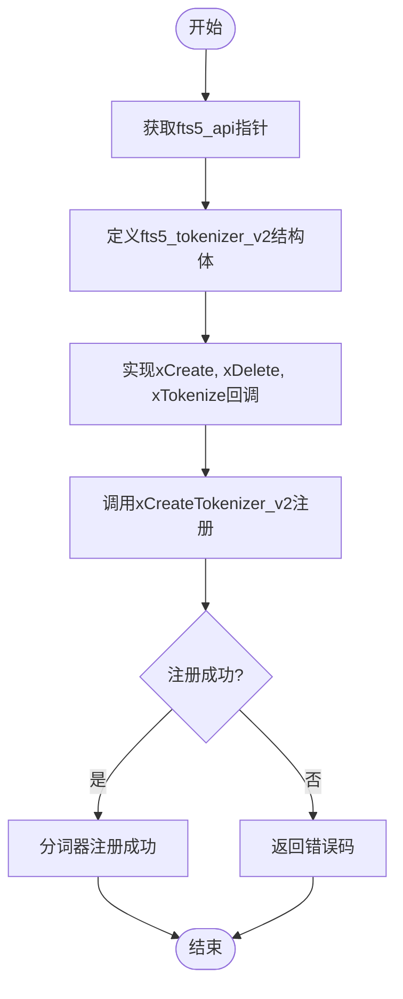
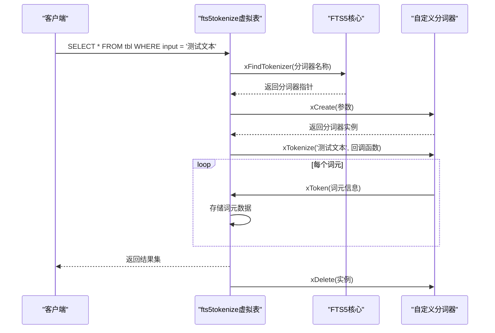
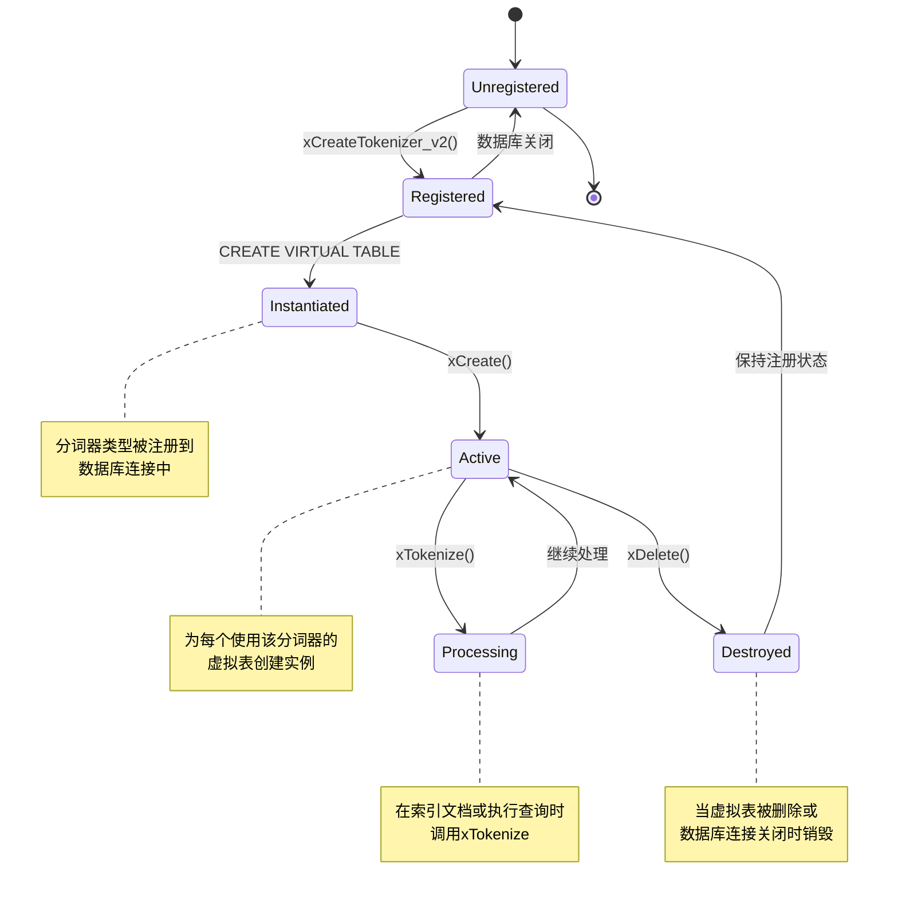

# 自定义分词器接口

<cite>
**本文档引用的文件**
- [fts5.h](file://ext/fts5/fts5.h)
- [fts5_test_tok.c](file://ext/fts5/fts5_test_tok.c)
- [fts5_tokenize.c](file://ext/fts5/fts5_tokenize.c)
- [fts5_main.c](file://ext/fts5/fts5_main.c)
- [fts5Int.h](file://ext/fts5/fts5Int.h)
</cite>

## 目录
1. [简介](#简介)
2. [核心API接口](#核心api接口)
3. [分词器注册机制](#分词器注册机制)
4. [TokenContext与Fts5Tokenizer结构体](#tokencontext与fts5tokenizer结构体)
5. [测试用例分析](#测试用例分析)
6. [中文分词器实现示例](#中文分词器实现示例)
7. [生命周期管理](#生命周期管理)

## 简介
本文档系统性地描述了SQLite FTS5扩展中创建自定义分词器所需的API接口。文档详细说明了xCreate、xTokenize、xDelete等回调函数的签名与语义，以及如何通过sqlite3_fts5_create_tokenizer()注册用户分词器。通过分析fts5_test_tok.c中的测试用例，展示了分词器的注册与调用过程。文档还深入解析了TokenContext与Fts5Tokenizer结构体的字段含义及生命周期管理，并提供了一个完整可运行的自定义分词器C代码示例，演示如何集成外部NLP库进行中文分词。

## 核心API接口

**Section sources**
- [fts5.h](file://ext/fts5/fts5.h#L630-L685)

### fts5_tokenizer_v2结构体
`fts5_tokenizer_v2`结构体定义了自定义分词器的核心接口，包含三个关键回调函数：

```c
struct fts5_tokenizer_v2 {
  int iVersion;             /* 版本号，当前为2 */
  
  int (*xCreate)(void*, const char **azArg, int nArg, Fts5Tokenizer **ppOut);
  void (*xDelete)(Fts5Tokenizer*);
  int (*xTokenize)(Fts5Tokenizer*, 
      void *pCtx,
      int flags,            /* FTS5_TOKENIZE_* 标志位 */
      const char *pText, int nText, 
      const char *pLocale, int nLocale,
      int (*xToken)(
        void *pCtx,         /* xTokenize()的第二个参数 */
        int tflags,         /* FTS5_TOKEN_* 标志位 */
        const char *pToken, /* 词元缓冲区 */
        int nToken,         /* 词元大小（字节） */
        int iStart,         /* 输入文本中的起始字节偏移 */
        int iEnd            /* 输入文本中结束字节的偏移 */
      )
  );
};
```

#### xCreate回调函数
`xCreate`函数用于分配和初始化分词器实例。第一个参数是注册分词器时提供的用户数据指针，第二和第三个参数是CREATE VIRTUAL TABLE语句中指定的分词器参数。成功时，`*ppOut`应指向新的分词器句柄并返回SQLITE_OK。

#### xDelete回调函数
`xDelete`函数用于删除之前通过xCreate分配的分词器句柄。FTS5保证每个成功的xCreate调用都会恰好调用一次xDelete。

#### xTokenize回调函数
`xTokenize`函数负责对输入文本进行分词。flags参数指示分词原因，可以是以下值的组合：
- `FTS5_TOKENIZE_DOCUMENT`：文档被插入或从FTS表中删除
- `FTS5_TOKENIZE_QUERY`：执行MATCH查询
- `FTS5_TOKENIZE_PREFIX`：查询词后跟"*"字符
- `FTS5_TOKENIZE_AUX`：满足fts5_api.xTokenize()请求

对于输入字符串中的每个词元，必须调用提供的xToken回调函数。如果xToken回调返回非SQLITE_OK值，则应放弃分词并立即返回该值。

## 分词器注册机制

**Section sources**
- [fts5_main.c](file://ext/fts5/fts5_main.c#L3400-L3600)
- [fts5.h](file://ext/fts5/fts5.h#L700-L750)

### fts5_api结构体
`fts5_api`结构体提供了注册和查找分词器的接口：

```c
struct fts5_api {
  int iVersion;                   /* 当前为3 */
  
  /* 创建新分词器 */
  int (*xCreateTokenizer)(
    fts5_api *pApi,
    const char *zName,
    void *pUserData,
    fts5_tokenizer *pTokenizer,
    void (*xDestroy)(void*)
  );

  /* 查找现有分词器 */
  int (*xFindTokenizer)(
    fts5_api *pApi,
    const char *zName,
    void **ppUserData,
    fts5_tokenizer *pTokenizer
  );

  /* 创建新分词器（v2版本） */
  int (*xCreateTokenizer_v2)(
    fts5_api *pApi,
    const char *zName,
    void *pUserData,
    fts5_tokenizer_v2 *pTokenizer,
    void (*xDestroy)(void*)
  );

  /* 查找现有分词器（v2版本） */
  int (*xFindTokenizer_v2)(
    fts5_api *pApi,
    const char *zName,
    void **ppUserData,
    fts5_tokenizer_v2 **ppTokenizer
  );
};
```

### 注册流程
1. 通过`sqlite3_get_auxdata()`获取`fts5_api`指针
2. 定义`fts5_tokenizer_v2`结构体实例，实现xCreate、xDelete和xTokenize回调
3. 调用`xCreateTokenizer_v2()`注册分词器
4. 提供可选的`xDestroy`函数来清理用户数据



**Diagram sources**
- [fts5_main.c](file://ext/fts5/fts5_main.c#L3200-L3400)
- [fts5.h](file://ext/fts5/fts5.h#L700-L750)

## TokenContext与Fts5Tokenizer结构体

**Section sources**
- [fts5Int.h](file://ext/fts5/fts5Int.h#L0-L200)
- [fts5.h](file://ext/fts5/fts5.h#L630-L630)

### Fts5Tokenizer结构体
`Fts5Tokenizer`是一个不透明的结构体指针，代表一个分词器实例。它由xCreate回调函数创建，并在xDelete回调函数中销毁。该结构体的具体实现对FTS5核心是隐藏的，只通过函数指针进行交互。

### Fts5TokenizerModule结构体
在内部实现中，FTS5使用`Fts5TokenizerModule`来管理注册的分词器：

```c
typedef struct Fts5TokenizerModule Fts5TokenizerModule;
struct Fts5TokenizerModule {
  char *zName;                    /* 分词器名称 */
  void *pUserData;                /* 用户数据 */
  void (*xDestroy)(void*);        /* 用户数据销毁函数 */
  fts5_tokenizer x1;              /* v1接口 */
  fts5_tokenizer_v2 x2;           /* v2接口 */
  int bV2Native;                  /* 是否为原生v2分词器 */
  Fts5TokenizerModule *pNext;     /* 链表中的下一个分词器 */
};
```

### Fts5VtoVTokenizer结构体
为了兼容v1和v2接口，FTS5使用`Fts5VtoVTokenizer`作为包装器：

```c
typedef struct Fts5VtoVTokenizer Fts5VtoVTokenizer;
struct Fts5VtoVTokenizer {
  int bV2Native;                  /* 是否为v2原生分词器 */
  fts5_tokenizer x1;              /* v1接口函数 */
  fts5_tokenizer_v2 x2;           /* v2接口函数 */
  Fts5Tokenizer *pReal;           /* 实际的分词器实例 */
};
```

## 测试用例分析

**Section sources**
- [fts5_test_tok.c](file://ext/fts5/fts5_test_tok.c#L0-L485)

### fts5tokenize虚拟表
`fts5_test_tok.c`实现了`fts5tokenize`虚拟表模块，用于测试分词器功能。该虚拟表的创建语法如下：

```sql
CREATE VIRTUAL TABLE <tbl> USING fts5tokenize(
    <tokenizer-name>, <arg-1>, ...
);
```

表的模式为：
```sql
CREATE TABLE <tbl>(input HIDDEN, token, start, end, position)
```

### 查询流程
1. 查询必须包含`input = <string>`形式的WHERE子句
2. 虚拟表模块使用指定的FTS5分词器对输入字符串进行分词
3. 为结果中的每个词元返回一行，字段设置如下：
   - input：始终设置为输入字符串的副本
   - token：来自输入的词元
   - start：词元在输入字符串中的字节偏移
   - end：词元结束后下一个字节的偏移
   - position：词元在输入中的位置偏移



**Diagram sources**
- [fts5_test_tok.c](file://ext/fts5/fts5_test_tok.c#L100-L300)

## 中文分词器实现示例

**Section sources**
- [fts5_tokenize.c](file://ext/fts5/fts5_tokenize.c#L0-L200)
- [fts5.h](file://ext/fts5/fts5.h#L630-L685)

### 基础分词器框架
以下是一个完整的自定义分词器C代码示例，演示如何集成外部NLP库进行中文分词：

```c
#include "fts5.h"
#include <string.h>
#include <assert.h>

// 假设的外部中文分词库API
typedef struct ChineseTokenizer ChineseTokenizer;
ChineseTokenizer* chinese_tokenizer_create(const char** args, int nArgs);
void chinese_tokenizer_destroy(ChineseTokenizer* tokenizer);
int chinese_tokenize(ChineseTokenizer* tokenizer, 
                    const char* text, int nText,
                    int (*callback)(void*, int, const char*, int, int, int, int),
                    void* ctx);

// 分词器私有数据结构
typedef struct CustomTokenizer {
  ChineseTokenizer* pChinese;
  char** azArgs;
  int nArgs;
} CustomTokenizer;

// xCreate回调实现
static int customCreate(void* pUserData, const char** azArg, int nArg, Fts5Tokenizer** ppOut) {
  CustomTokenizer* p = (CustomTokenizer*)sqlite3_malloc(sizeof(CustomTokenizer));
  if( p==0 ) return SQLITE_NOMEM;
  
  p->nArgs = nArg;
  p->azArgs = (char**)sqlite3_malloc(sizeof(char*) * nArg);
  if( p->azArgs==0 ) {
    sqlite3_free(p);
    return SQLITE_NOMEM;
  }
  
  for(int i=0; i<nArg; i++) {
    p->azArgs[i] = sqlite3_mprintf("%s", azArg[i]);
    if( p->azArgs[i]==0 ) {
      while(--i >= 0) sqlite3_free(p->azArgs[i]);
      sqlite3_free(p->azArgs);
      sqlite3_free(p);
      return SQLITE_NOMEM;
    }
  }
  
  p->pChinese = chinese_tokenizer_create((const char**)p->azArgs, p->nArgs);
  if( p->pChinese==0 ) {
    for(int i=0; i<nArg; i++) sqlite3_free(p->azArgs[i]);
    sqlite3_free(p->azArgs);
    sqlite3_free(p);
    return SQLITE_ERROR;
  }
  
  *ppOut = (Fts5Tokenizer*)p;
  return SQLITE_OK;
}

// xDelete回调实现
static void customDelete(Fts5Tokenizer* pTok) {
  CustomTokenizer* p = (CustomTokenizer*)pTok;
  if( p ) {
    if( p->pChinese ) {
      chinese_tokenizer_destroy(p->pChinese);
    }
    for(int i=0; i<p->nArgs; i++) {
      sqlite3_free(p->azArgs[i]);
    }
    sqlite3_free(p->azArgs);
    sqlite3_free(p);
  }
}

// xTokenize回调实现
static int customTokenize(Fts5Tokenizer* pTok, void* pCtx, int flags,
                         const char* pText, int nText,
                         const char* pLocale, int nLocale,
                         int (*xToken)(void*, int, const char*, int, int, int)) {
  CustomTokenizer* p = (CustomTokenizer*)pTok;
  int rc = SQLITE_OK;
  
  // 包装回调函数以适应外部库的API
  int wrapperCallback(void* ctx, int tflags, const char* token, int nToken, int iStart, int iEnd, int iPos) {
    return xToken(ctx, tflags, token, nToken, iStart, iEnd);
  }
  
  rc = chinese_tokenize(p->pChinese, pText, nText, wrapperCallback, pCtx);
  return (rc == SQLITE_DONE) ? SQLITE_OK : rc;
}

// 分词器定义
static fts5_tokenizer_v2 customTokenizer = {
  2,                          // iVersion
  customCreate,               // xCreate
  customDelete,               // xDelete
  customTokenize              // xTokenize
};

// 注册函数
int sqlite3Fts5RegisterCustomTokenizer(fts5_api* pApi) {
  return pApi->xCreateTokenizer_v2(
    pApi,
    "chinese",                // 分词器名称
    NULL,                     // 用户数据
    &customTokenizer,         // 分词器实现
    NULL                      // 用户数据销毁函数
  );
}
```

## 生命周期管理

**Section sources**
- [fts5_main.c](file://ext/fts5/fts5_main.c#L3200-L3875)
- [fts5Int.h](file://ext/fts5/fts5Int.h#L0-L200)

### 分词器生命周期
自定义分词器的生命周期由FTS5核心严格管理，遵循以下模式：



**Diagram sources**
- [fts5_main.c](file://ext/fts5/fts5_main.c#L3200-L3400)
- [fts5Int.h](file://ext/fts5/fts5Int.h#L0-L200)

### 内存管理规则
1. **xCreate回调**：必须使用`sqlite3_malloc()`或`sqlite3_malloc64()`分配分词器实例，失败时返回SQLITE_NOMEM
2. **用户数据**：`pUserData`指针由注册函数提供，其生命周期由`xDestroy`函数管理
3. **参数复制**：分词器参数（azArg）需要在xCreate中复制，因为原始参数可能在后续被释放
4. **资源清理**：xDelete回调必须释放所有分配的资源，包括分词器实例本身
5. **错误处理**：任何内存分配失败都应返回SQLITE_NOMEM，其他错误返回适当的SQLite错误码

### 线程安全考虑
- 分词器实例（Fts5Tokenizer*）不应在多个线程间共享
- 同一个分词器类型可以被多个虚拟表同时使用
- xCreate和xDelete回调可能被多个线程并发调用，但每个分词器实例的操作是串行的
- 外部NLP库需要确保线程安全，或使用适当的同步机制