# FTS5性能优化专家级指南

<cite>
**本文档中引用的文件**
- [fts5speed.tcl](file://ext/fts5/tool/fts5speed.tcl)
- [fts5_config.c](file://ext/fts5/fts5_config.c)
- [fts5_main.c](file://ext/fts5/fts5_main.c)
- [fts5_index.c](file://ext/fts5/fts5_index.c)
- [fts5_storage.c](file://ext/fts5/fts5_storage.c)
- [fts5_hash.c](file://ext/fts5/fts5_hash.c)
- [fts5_buffer.c](file://ext/fts5/fts5_buffer.c)
- [fts5.h](file://ext/fts5/fts5.h)
- [fts5_common.tcl](file://ext/fts5/test/fts5_common.tcl)
</cite>

## 目录
1. [简介](#简介)
2. [核心性能指标](#核心性能指标)
3. [FTS5架构概览](#fts5架构概览)
4. [关键性能参数配置](#关键性能参数配置)
5. [基准测试工具详解](#基准测试工具详解)
6. [索引构建优化](#索引构建优化)
7. [查询性能调优](#查询性能调优)
8. [内存管理策略](#内存管理策略)
9. [工作负载优化建议](#工作负载优化建议)
10. [性能监控与诊断](#性能监控与诊断)
11. [常见性能陷阱与解决方案](#常见性能陷阱与解决方案)
12. [最佳实践总结](#最佳实践总结)

## 简介

FTS5（全文搜索第5版）是SQLite的高性能全文搜索引擎，提供了强大的文本检索功能。本指南深入分析FTS5的性能特征，提供系统性的优化策略，帮助开发者在不同应用场景下实现最佳性能表现。

FTS5的性能优化涉及多个层面：索引构建速度、查询延迟、内存使用效率以及存储空间优化。通过合理配置参数、选择合适的分词器和实施有效的缓存策略，可以显著提升FTS5的性能表现。

## 核心性能指标

### 关键性能维度

FTS5的性能可以从以下核心指标进行评估：

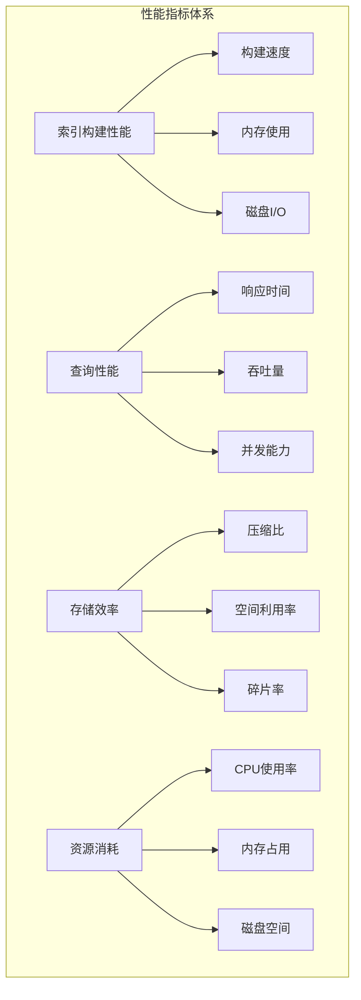

### 性能测量方法

| 指标类型 | 测量单位 | 获取方式 | 重要性 |
|---------|---------|---------|--------|
| 索引构建速度 | 行/秒 | 基准测试工具 | 高 |
| 查询响应时间 | 毫秒 | 实时监控 | 高 |
| 内存使用量 | MB | 系统监控 | 中 |
| 磁盘I/O频率 | 次/秒 | I/O统计 | 中 |
| 存储空间 | 字节 | 文件大小 | 低 |

## FTS5架构概览

### 系统架构图

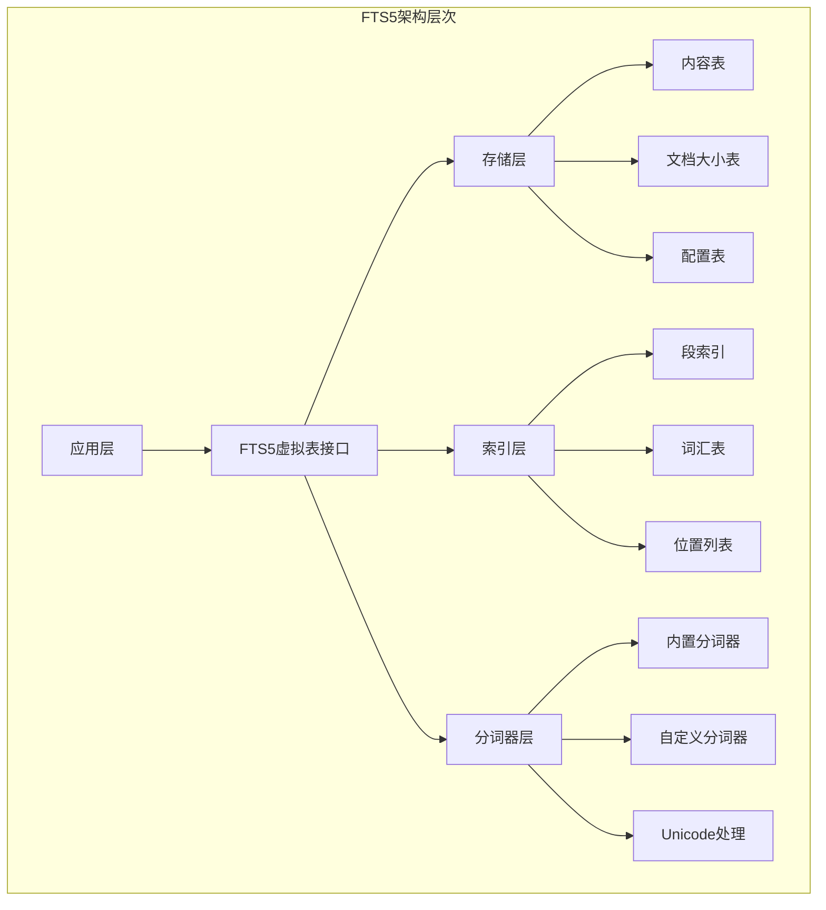

### 核心组件说明

FTS5采用分层架构设计，各组件职责明确：

- **存储层**：负责数据的持久化存储和基本查询
- **索引层**：维护倒排索引结构，支持快速查找
- **分词器层**：处理文本分词和语言特定的处理逻辑
- **虚拟表接口**：提供标准的SQLite虚拟表API

## 关键性能参数配置

### 默认配置参数

FTS5提供了丰富的配置参数来优化性能：

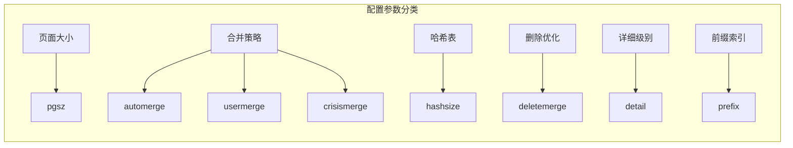

### 参数详细说明

| 参数名称 | 默认值 | 取值范围 | 性能影响 | 推荐配置 |
|---------|-------|---------|---------|---------|
| pgsz | 4050 | 32-65536 | 索引密度和查询性能 | 根据文档大小调整 |
| automerge | 4 | 1-64 | 自动合并频率 | 高写入场景增加 |
| usermerge | 4 | 2-16 | 手动合并阈值 | 平衡性能和空间 |
| crisismerge | 16 | 1-最大段数 | 危机合并触发点 | 根据段数量调整 |
| hashsize | 1048576 | 正整数 | 内存使用和缓存效率 | 大数据集增加 |
| deletemerge | 10 | 0-100 | 删除优化比例 | 高删除率场景 |

**章节来源**
- [fts5_config.c](file://ext/fts5/fts5_config.c#L20-L30)
- [fts5_config.c](file://ext/fts5/fts5_config.c#L951-L1000)

## 基准测试工具详解

### fts5speed.tcl工具分析

FTS5提供了专门的基准测试工具`fts5speed.tcl`，用于评估不同查询模式的性能表现。

#### 工具功能特性

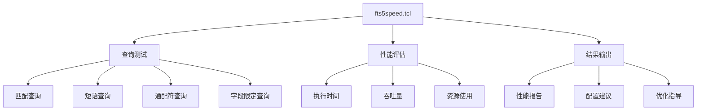

#### 查询测试用例

工具包含多种查询模式的测试用例：

| 测试编号 | 查询类型 | 示例查询 | 测试次数 |
|---------|---------|---------|---------|
| 1 | 基础匹配 | `'enron'` | 1 |
| 2 | 短语匹配 | `'hours'` | 25 |
| 3 | 前缀匹配 | `'acid'` | 300 |
| 4 | 多词或查询 | `'loaned OR mobility...'` | 100 |
| 5 | 交集查询 | `'enron AND myapps'` | 100 |
| 6 | 通配符查询 | `'en* AND my*'` | 1 |

#### 使用方法

```bash
# 基本语法
./fts5speed.tcl DATABASE QUERY [REPEAT_COUNT]

# 示例
./fts5speed.tcl test.db 1 100
```

**章节来源**
- [fts5speed.tcl](file://ext/fts5/tool/fts5speed.tcl#L1-L65)

### 性能测试流程

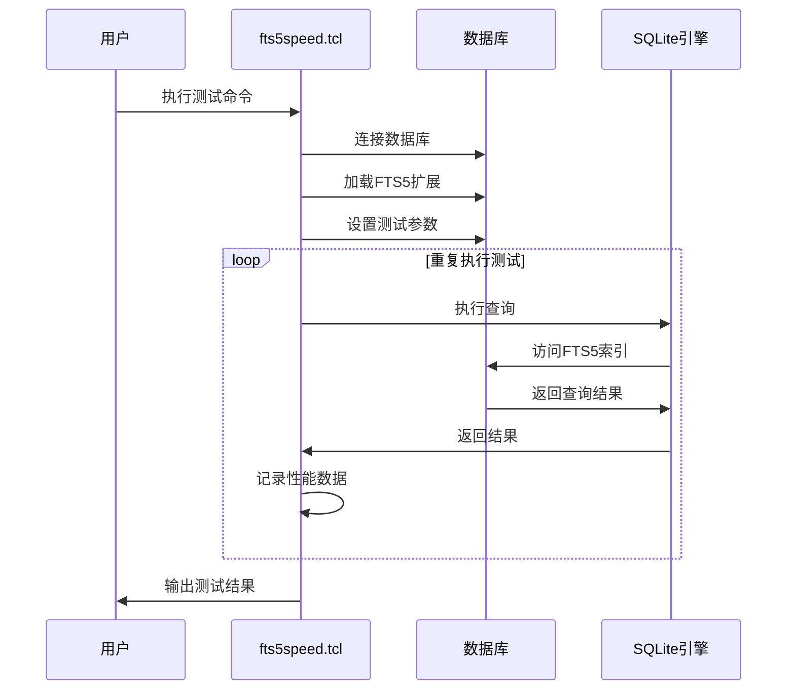

## 索引构建优化

### 合并策略优化

FTS5的索引构建性能主要受合并策略的影响。合理的合并参数配置可以显著提升构建速度。

#### 自动合并机制

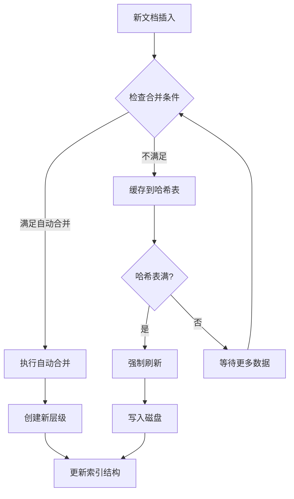

#### 合并参数调优

| 场景类型 | automerge | usermerge | crisismerge | 说明 |
|---------|-----------|-----------|-------------|------|
| 高写入负载 | 8-16 | 6-8 | 20-30 | 频繁合并减少延迟 |
| 中等写入 | 4-8 | 4-6 | 16-20 | 平衡性能和空间 |
| 低写入负载 | 2-4 | 2-4 | 12-16 | 减少合并开销 |

### 哈希表优化

哈希表是FTS5索引构建过程中的关键缓存机制：

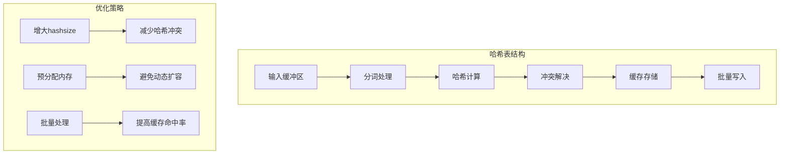

**章节来源**
- [fts5_index.c](file://ext/fts5/fts5_index.c#L4754-L4792)
- [fts5_hash.c](file://ext/fts5/fts5_hash.c#L78-L142)

### 页面大小优化

页面大小直接影响索引的存储密度和查询性能：

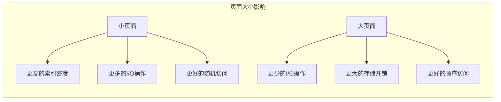

推荐的页面大小配置：
- 小型文档（<1KB）：pgsz=1024-2048
- 中型文档（1KB-10KB）：pgsz=4050-8192
- 大型文档（>10KB）：pgsz=16384-65536

## 查询性能调优

### 查询优化策略

FTS5查询性能优化涉及多个方面：

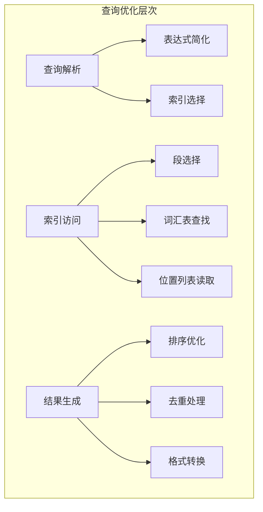

### 分词器性能优化

不同的分词器对性能有显著影响：

| 分词器类型 | CPU开销 | 内存使用 | 适用场景 | 性能特点 |
|-----------|---------|---------|---------|---------|
| simple | 低 | 低 | 简单英文文本 | 快速处理 |
| porter | 中 | 中 | 英文词干提取 | 平衡性能 |
| unicode61 | 高 | 高 | 多语言文本 | 功能丰富 |
| 自定义 | 可变 | 可变 | 特定需求 | 灵活定制 |

### 查询模式优化

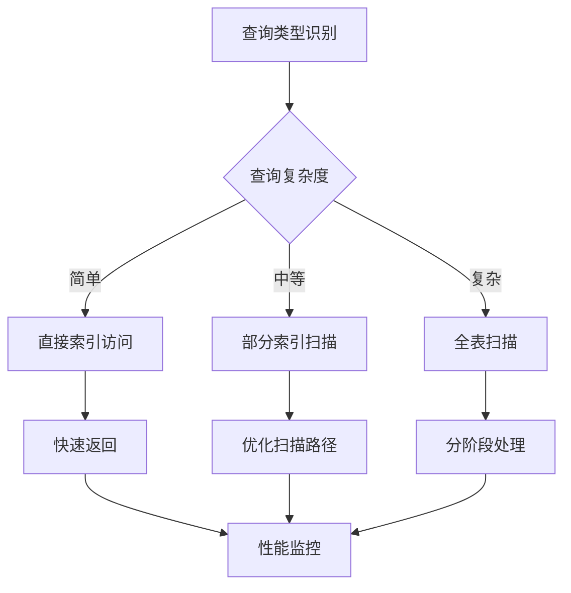

**章节来源**
- [fts5_main.c](file://ext/fts5/fts5_main.c#L3496-L3545)

## 内存管理策略

### 缓冲区管理

FTS5使用多层缓冲区管理系统来优化内存使用：

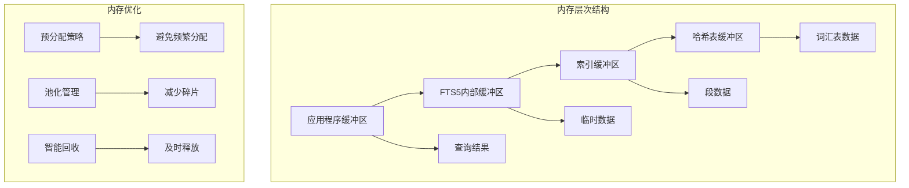

### 内存使用监控

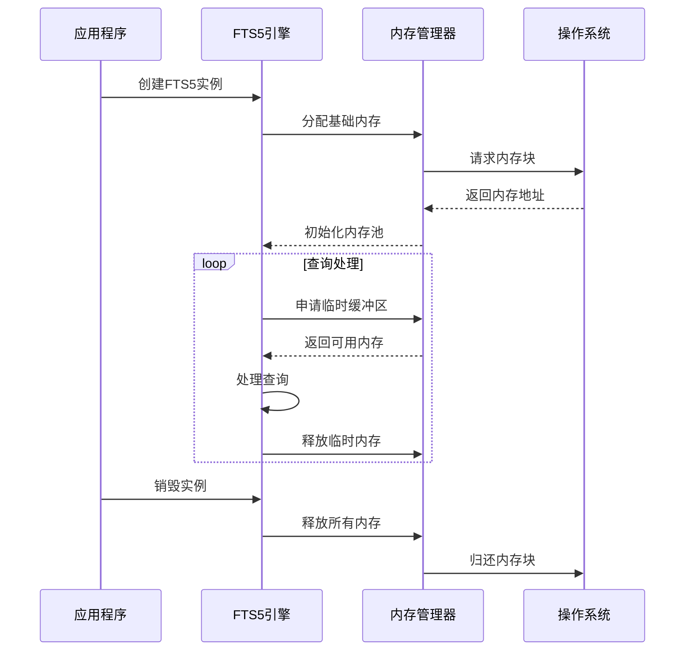

**章节来源**
- [fts5_buffer.c](file://ext/fts5/fts5_buffer.c#L0-L55)

### 垃圾回收优化

FTS5实现了智能的垃圾回收机制：

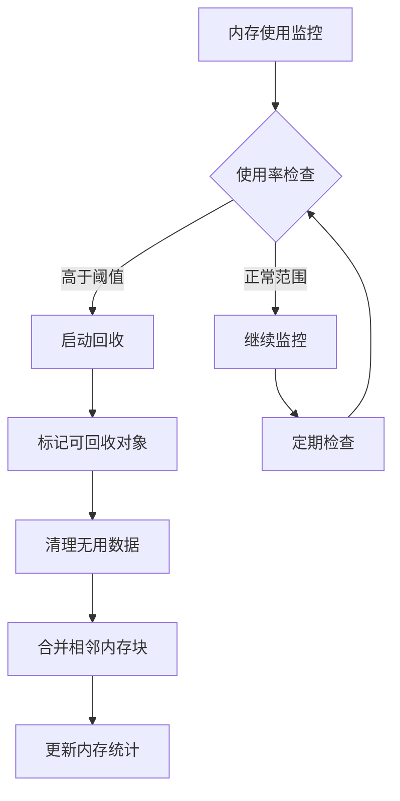

## 工作负载优化建议

### 高写入场景优化

对于以写入为主的场景，重点优化索引构建性能：

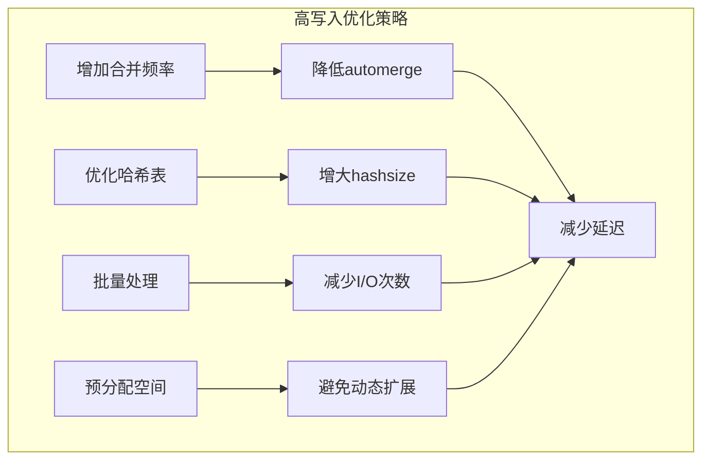

#### 配置建议

```sql
-- 高写入场景配置
CREATE VIRTUAL TABLE documents USING fts5(
    content, 
    tokenize='unicode61',
    automerge=8,
    hashsize=2097152
);
```

### 高查询场景优化

对于以查询为主的场景，重点优化查询响应时间和缓存效率：

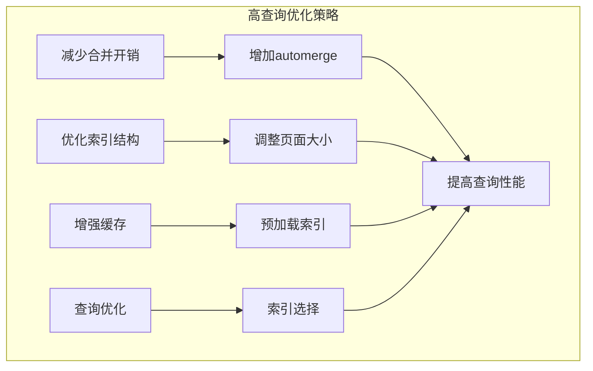

#### 配置建议

```sql
-- 高查询场景配置
CREATE VIRTUAL TABLE documents USING fts5(
    content, 
    tokenize='unicode61',
    automerge=16,
    pgsz=8192,
    hashsize=524288
);
```

### 混合负载优化

对于写入和查询均衡的场景，需要平衡两者的需求：

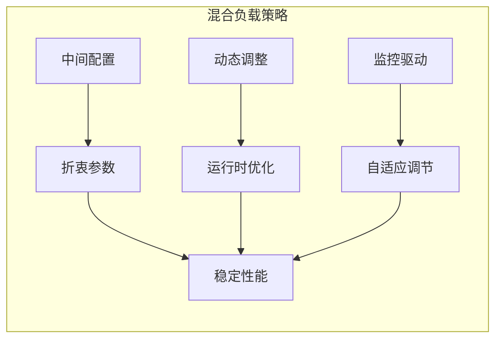

## 性能监控与诊断

### 关键性能指标监控

建立完善的性能监控体系：

| 监控指标 | 监控方法 | 告警阈值 | 处理措施 |
|---------|---------|---------|---------|
| 索引构建时间 | 时间戳记录 | >1分钟 | 调整合并参数 |
| 查询响应时间 | 查询计时 | >100ms | 优化查询或索引 |
| 内存使用量 | 系统监控 | >80% | 增加内存或优化 |
| 磁盘I/O频率 | I/O统计 | >1000次/秒 | 优化存储策略 |

### 性能诊断工具

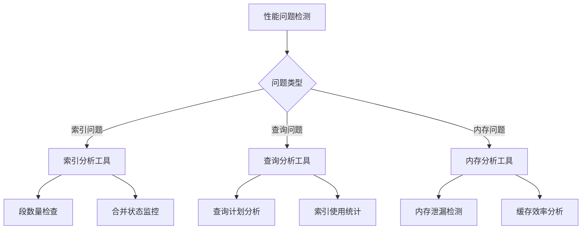

### 日志分析

FTS5提供详细的日志信息用于性能分析：

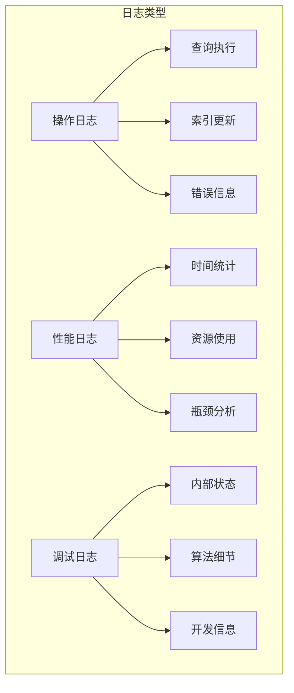

**章节来源**
- [fts5_common.tcl](file://ext/fts5/test/fts5_common.tcl#L0-L708)

## 常见性能陷阱与解决方案

### 性能陷阱识别

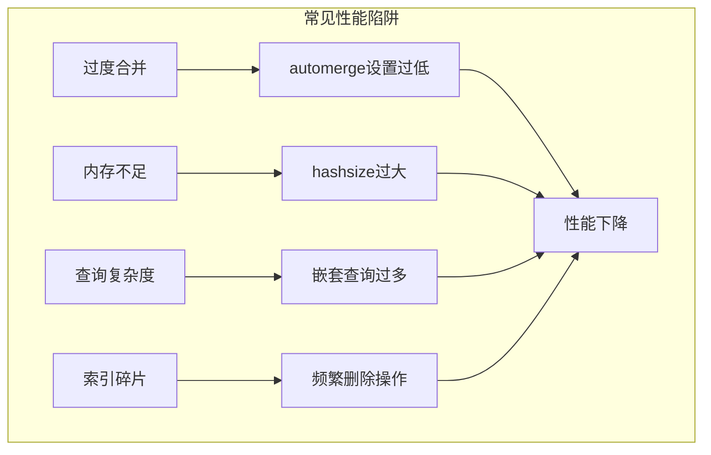

### 解决方案矩阵

| 问题类型 | 症状 | 根本原因 | 解决方案 | 预防措施 |
|---------|-----|---------|---------|---------|
| 构建缓慢 | 索引创建时间长 | 合并过于频繁 | 增加automerge值 | 根据数据量调整 |
| 查询慢 | 响应时间长 | 索引碎片化 | 重建索引 | 定期维护 |
| 内存溢出 | OOM错误 | 哈希表过大 | 减小hashsize | 监控内存使用 |
| 空间浪费 | 存储空间高 | 页面太小 | 增加pgsz | 评估文档大小 |

### 最佳实践清单

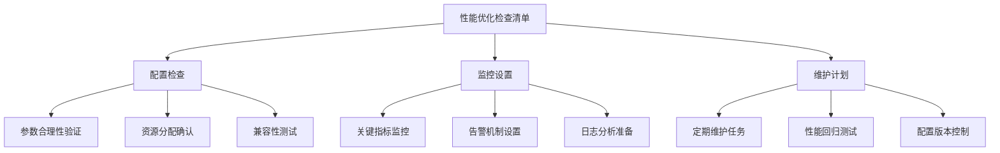

## 最佳实践总结

### 性能优化原则

1. **了解工作负载特征**：根据实际使用场景选择合适的配置
2. **渐进式优化**：逐步调整参数，观察效果变化
3. **监控驱动决策**：基于实际性能数据做出优化决策
4. **平衡权衡考虑**：在不同性能指标之间找到最佳平衡点

### 配置模板

```sql
-- 生产环境推荐配置
CREATE VIRTUAL TABLE production_table USING fts5(
    content,
    tokenize='unicode61',
    automerge=8,
    usermerge=6,
    crisismerge=20,
    pgsz=4050,
    hashsize=1048576
);
```

### 维护建议

```mermaid
graph LR
subgraph "定期维护任务"
A[性能监控] --> A1[每日检查]
B[索引健康] --> B1[每周分析]
C[配置优化] --> C1[每月评估]
D[容量规划] --> D1[每季度审查]
end
```

通过系统性的性能优化策略和持续的监控改进，FTS5可以在各种应用场景下实现最佳的性能表现。关键在于理解系统的工作原理，掌握性能指标的含义，并根据实际需求进行有针对性的优化。