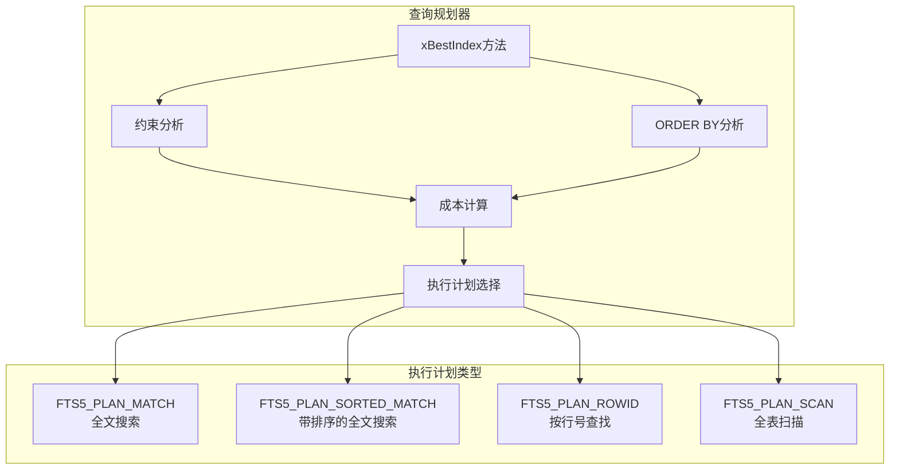
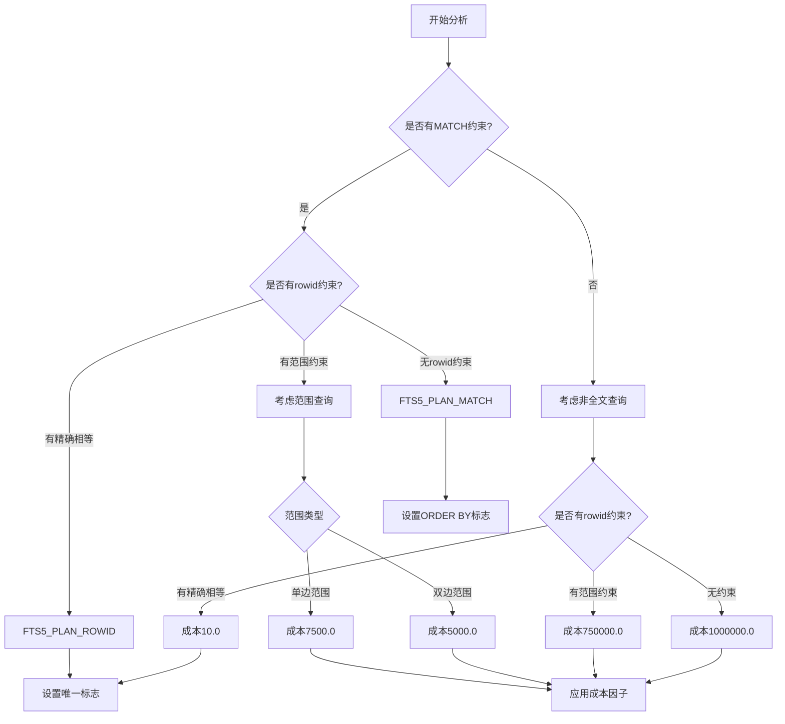
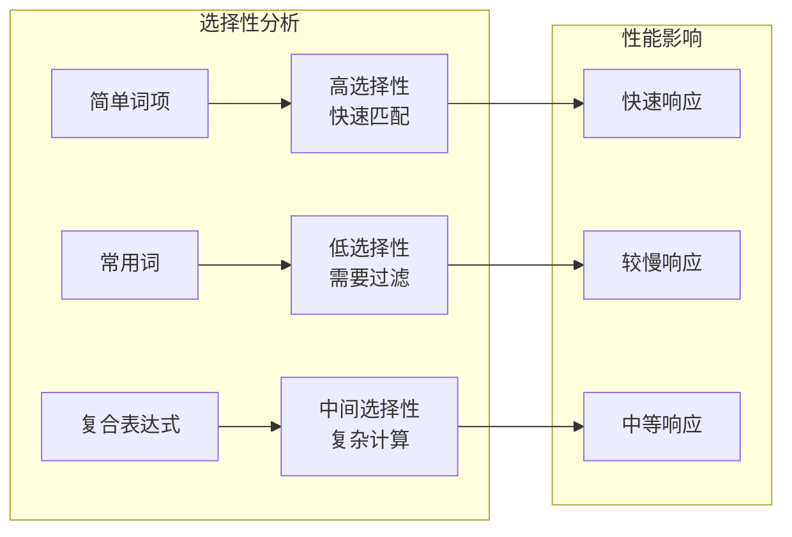
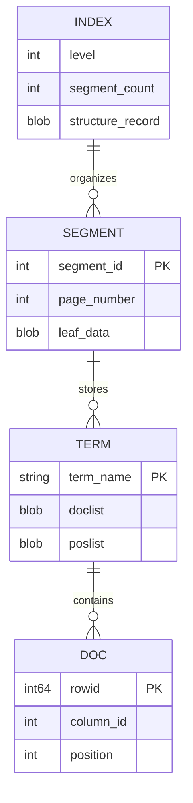
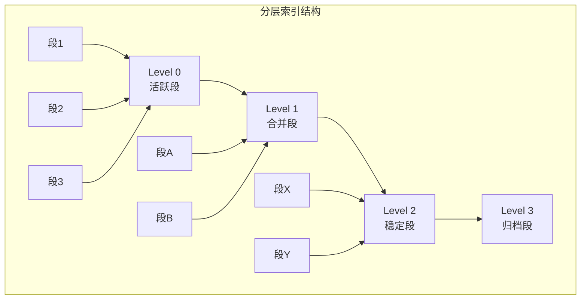
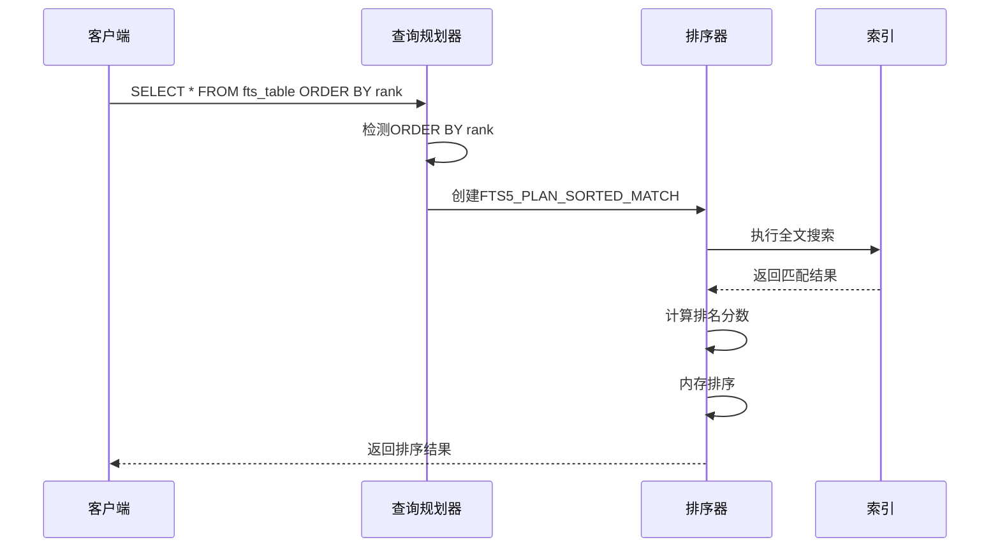
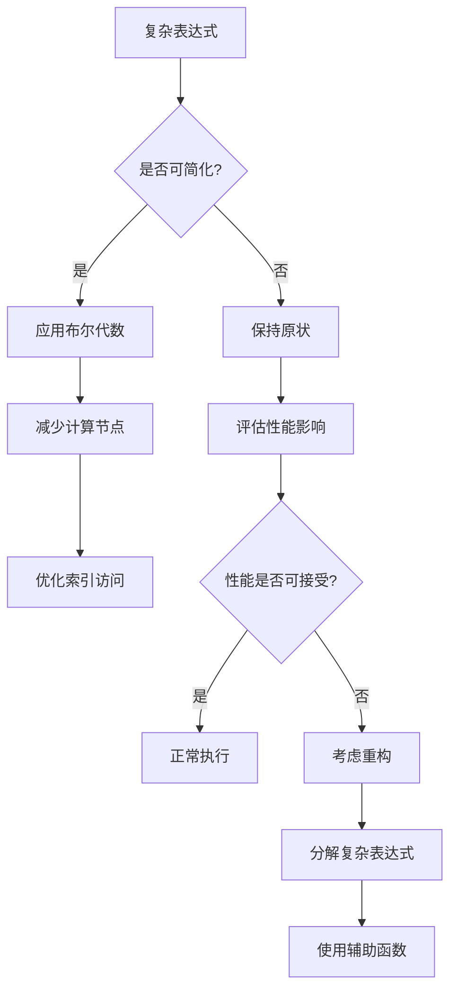
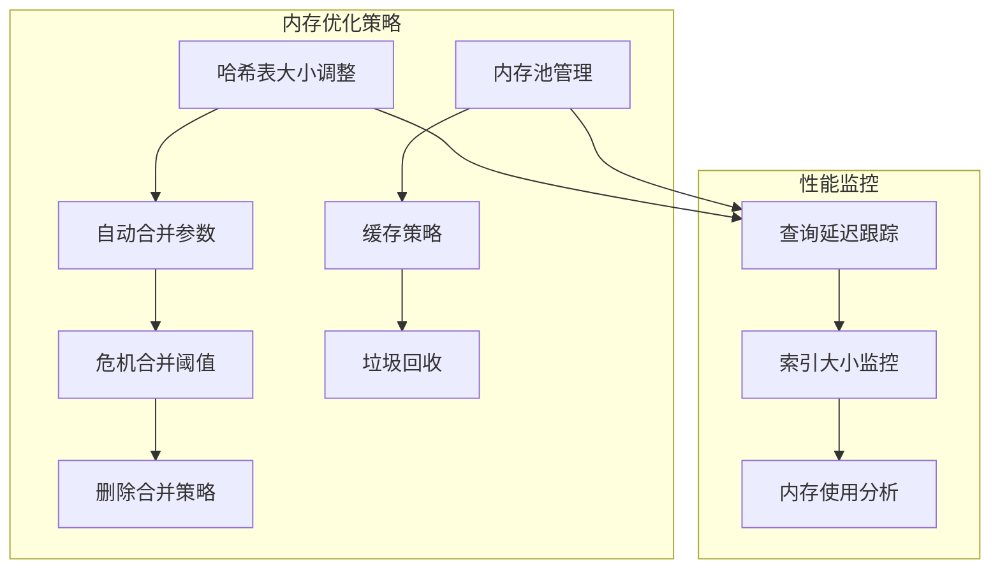
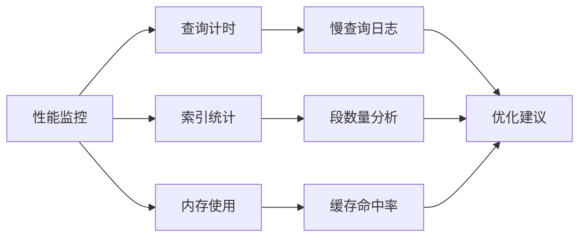

# FTS5查询性能优化

<cite>
**本文档引用的文件**
- [fts5_main.c](file://ext/fts5/fts5_main.c)
- [fts5_index.c](file://ext/fts5/fts5_index.c)
- [fts5_storage.c](file://ext/fts5/fts5_storage.c)
- [fts5_expr.c](file://ext/fts5/fts5_expr.c)
- [fts5.h](file://ext/fts5/fts5.h)
- [fts5Int.h](file://ext/fts5/fts5Int.h)
- [where.c](file://src/where.c)
- [select.c](file://src/select.c)
</cite>

## 目录
1. [简介](#简介)
2. [FTS5查询规划器架构](#fts5查询规划器架构)
3. [xBestIndex方法详解](#xbestindex方法详解)
4. [索引选择性和查询成本估算](#索引选择性和查询成本估算)
5. [全文索引内部结构](#全文索引内部结构)
6. [ORDER BY优化策略](#order-by优化策略)
7. [复杂表达式处理开销](#复杂表达式处理开销)
8. [性能优化最佳实践](#性能优化最佳实践)
9. [配置参数调优](#配置参数调优)
10. [故障排除指南](#故障排除指南)

## 简介

FTS5（全文搜索第5版）是SQLite中高性能的全文搜索引擎，其查询性能受到多个关键因素的影响。本文档深入分析了影响FTS5查询性能的核心要素，包括查询规划器的成本估算模型、索引结构设计、排序策略优化以及各种配置参数对性能的影响。

FTS5采用分层索引结构，通过倒排列表（Inverted Index）实现高效的文本匹配，同时支持复杂的布尔查询、短语查询和前缀查询。理解这些机制对于优化查询性能至关重要。

## FTS5查询规划器架构

FTS5查询规划器基于SQLite的虚拟表接口，通过`xBestIndex`方法为查询选择最优的执行计划。该方法分析WHERE子句约束和ORDER BY子句，计算不同查询策略的成本，并选择成本最低的方案。



**图表来源**
- [fts5_main.c](file://ext/fts5/fts5_main.c#L541-L607)

**节来源**
- [fts5_main.c](file://ext/fts5/fts5_main.c#L541-L607)

## xBestIndex方法详解

`xBestIndex`方法是FTS5查询规划的核心，它分析查询条件并计算不同执行策略的成本。该方法识别以下类型的约束：

### 约束类型识别

1. **MATCH约束**：全文搜索表达式
2. **rank列MATCH约束**：自定义评分函数
3. **其他列的LIKE/GLOB约束**：模式匹配
4. **rowid相等性约束**：精确行号查找
5. **rowid范围约束**：行号范围查询

### 执行计划选择逻辑



**图表来源**
- [fts5_main.c](file://ext/fts5/fts5_main.c#L541-L607)

**节来源**
- [fts5_main.c](file://ext/fts5/fts5_main.c#L541-L607)

## 索引选择性和查询成本估算

### 成本估算模型

FTS5使用基于经验的成本估算模型，为不同类型的查询分配预定义的成本值：

| 查询类型 | 无其他约束 | 单个rowid范围 | 双向rowid范围 | rowid精确匹配 |
|---------|-----------|--------------|-------------|-------------|
| MATCH查询 | 1000.0 | 750.0 | 500.0 | 100.0 |
| 非MATCH查询 | 1000000.0 | 750000.0 | 250000.0 | 10.0 |

### 索引选择性影响

索引选择性直接影响查询性能：

1. **高选择性**：特定词汇或短语，返回少量结果
2. **低选择性**：常见词汇，返回大量结果
3. **复合查询**：AND操作降低选择性，OR操作可能提高选择性



**节来源**
- [fts5_main.c](file://ext/fts5/fts5_main.c#L573-L607)

## 全文索引内部结构

FTS5采用分层B树结构存储索引数据，这种设计优化了查询性能和存储效率。

### 倒排列表结构

FTS5的倒排列表包含以下关键组件：

1. **术语（Term）**：被索引的词汇
2. **文档列表（Doclist）**：包含匹配文档的标识符
3. **位置列表（Poslist）**：记录词汇在文档中的位置信息



**图表来源**
- [fts5_index.c](file://ext/fts5/fts5_index.c#L19-L56)

### 分层索引结构

FTS5使用多级分层结构来管理大型索引：

1. **Level 0**：最近添加的段，频繁更新
2. **Level 1-N**：合并后的稳定段，只读访问
3. **自动合并**：定期将小段合并为大段以优化性能



**图表来源**
- [fts5_index.c](file://ext/fts5/fts5_index.c#L406-L429)

**节来源**
- [fts5_index.c](file://ext/fts5/fts5_index.c#L19-L56)
- [fts5_index.c](file://ext/fts5/fts5_index.c#L406-L429)

## ORDER BY优化策略

FTS5提供了两种主要的ORDER BY优化策略：基于排名的排序和基于行号的排序。

### 排序策略对比

| 排序类型 | 实现方式 | 性能特点 | 使用场景 |
|---------|---------|---------|---------|
| ORDER BY rank | 内存排序 | 快速但内存消耗大 | 需要自定义评分 |
| ORDER BY rowid | 数据库排序 | 内存友好但较慢 | 按插入顺序排列 |

### 排序优化实现



**图表来源**
- [fts5_main.c](file://ext/fts5/fts5_main.c#L1078-L1121)

**节来源**
- [fts5_main.c](file://ext/fts5/fts5_main.c#L1078-L1121)
- [fts5_main.c](file://ext/fts5/fts5_main.c#L1564-L1596)

## 复杂表达式处理开销

复杂的查询表达式会显著增加查询处理时间，主要体现在以下几个方面：

### 表达式复杂度分析

1. **布尔运算**：AND、OR操作的组合
2. **短语查询**：相邻词汇的精确匹配
3. **近似查询**：NEAR操作的距离控制
4. **前缀查询**：通配符匹配

### 表达式优化策略



**节来源**
- [fts5_expr.c](file://ext/fts5/fts5_expr.c#L1-L200)

## 性能优化最佳实践

### 查询优化技巧

1. **使用具体词汇**：避免过于通用的搜索词
2. **合理使用括号**：明确表达式的优先级
3. **限制结果数量**：使用LIMIT子句
4. **避免过度嵌套**：简化复杂的布尔表达式

### 索引优化策略

1. **选择合适的分词器**：根据内容类型选择
2. **配置前缀索引**：对常用前缀启用索引
3. **调整合并参数**：平衡写入和查询性能
4. **定期维护索引**：执行OPTIMIZE命令

### 内存管理优化



## 配置参数调优

FTS5提供了丰富的配置选项来优化不同工作负载的性能。

### 关键配置参数

| 参数名称 | 默认值 | 调优建议 | 性能影响 |
|---------|-------|---------|---------|
| automerge | 16 | 根据写入频率调整 | 影响写入性能 |
| crisismerge | 4000 | 平衡存储空间和查询性能 | 影响索引碎片 |
| hashsize | 16KB | 根据并发查询数调整 | 影响内存使用 |
| pgsz | 1024字节 | 根据文档大小调整 | 影响I/O性能 |

### 配置示例

```sql
-- 高写入负载配置
INSERT INTO fts_table(fts_table, rank) VALUES('automerge', 8);
INSERT INTO fts_table(fts_table, rank) VALUES('hashsize', 64KB);

-- 高查询负载配置  
INSERT INTO fts_table(fts_table, rank) VALUES('automerge', 32);
INSERT INTO fts_table(fts_table, rank) VALUES('crisismerge', 8000);
```

**节来源**
- [fts5_config.c](file://ext/fts5/fts5_config.c#L888-L1000)
- [fts5Int.h](file://ext/fts5/fts5Int.h#L245-L276)

## 故障排除指南

### 常见性能问题

1. **查询响应缓慢**
   - 检查索引选择性
   - 分析表达式复杂度
   - 监控内存使用情况

2. **索引增长过快**
   - 调整自动合并参数
   - 检查危机合并阈值
   - 分析写入模式

3. **内存使用过高**
   - 减少哈希表大小
   - 优化查询复杂度
   - 考虑使用外部内容表

### 性能诊断工具

FTS5提供了内置的诊断功能：

```sql
-- 查看索引统计信息
SELECT * FROM fts_table(fts_table);

-- 检查索引状态
INSERT INTO fts_table(fts_table, rank) VALUES('stats', '');

-- 获取详细性能信息
INSERT INTO fts_table(fts_table, rank) VALUES('detail', '');
```

### 监控和调试



## 结论

FTS5查询性能优化是一个多维度的问题，涉及查询规划、索引结构、内存管理和配置参数等多个方面。通过深入理解`xBestIndex`方法的成本估算模型、倒排列表的内部结构、以及各种优化策略，开发者可以显著提升FTS5的查询性能。

关键优化要点包括：
- 合理设计查询表达式，避免过度复杂的布尔运算
- 根据工作负载特征调整配置参数
- 监控索引状态和查询性能指标
- 定期进行索引维护和优化

通过系统性的性能调优和持续的监控，FTS5可以为各种规模的应用提供高效可靠的全文搜索服务。