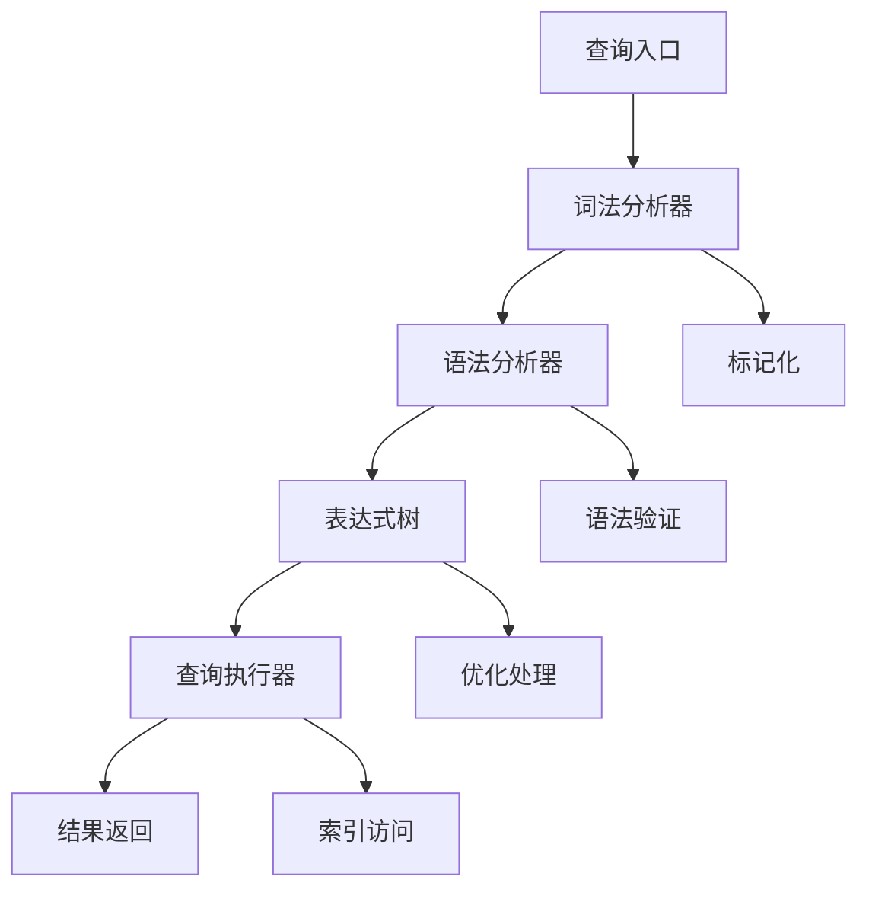
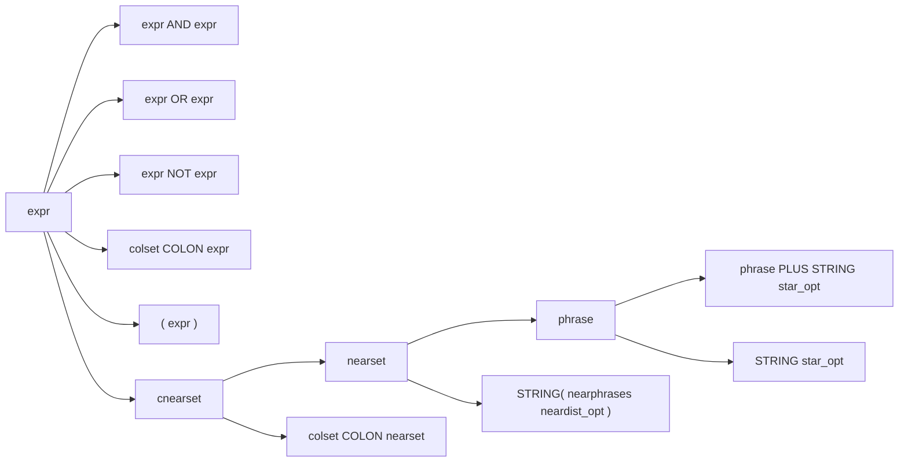
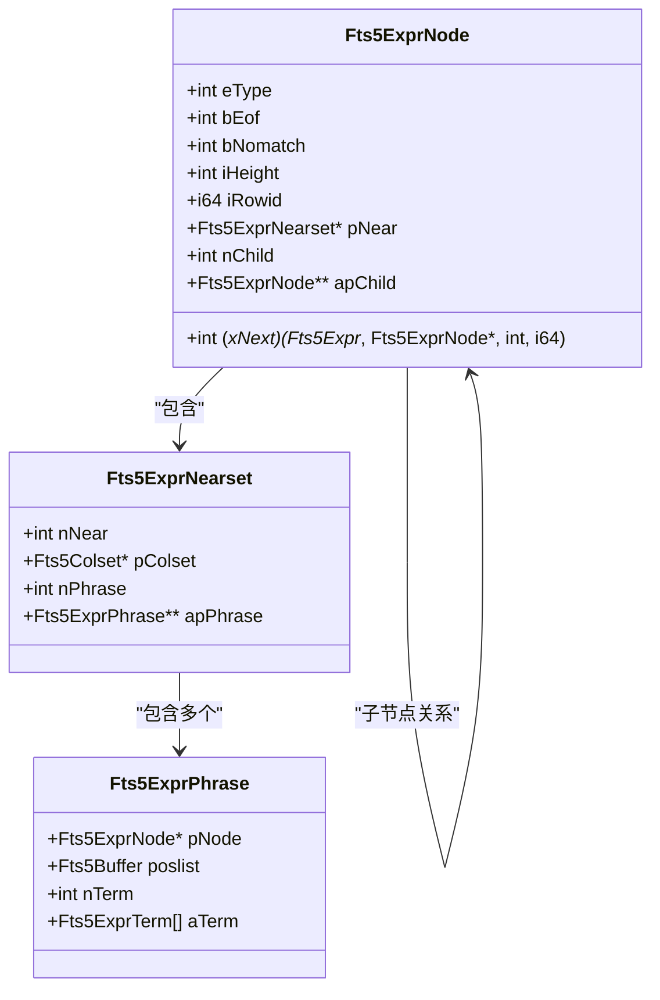
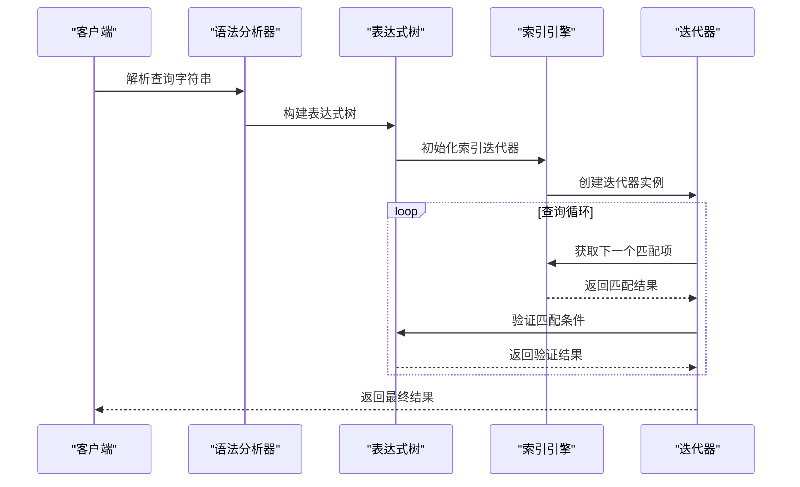
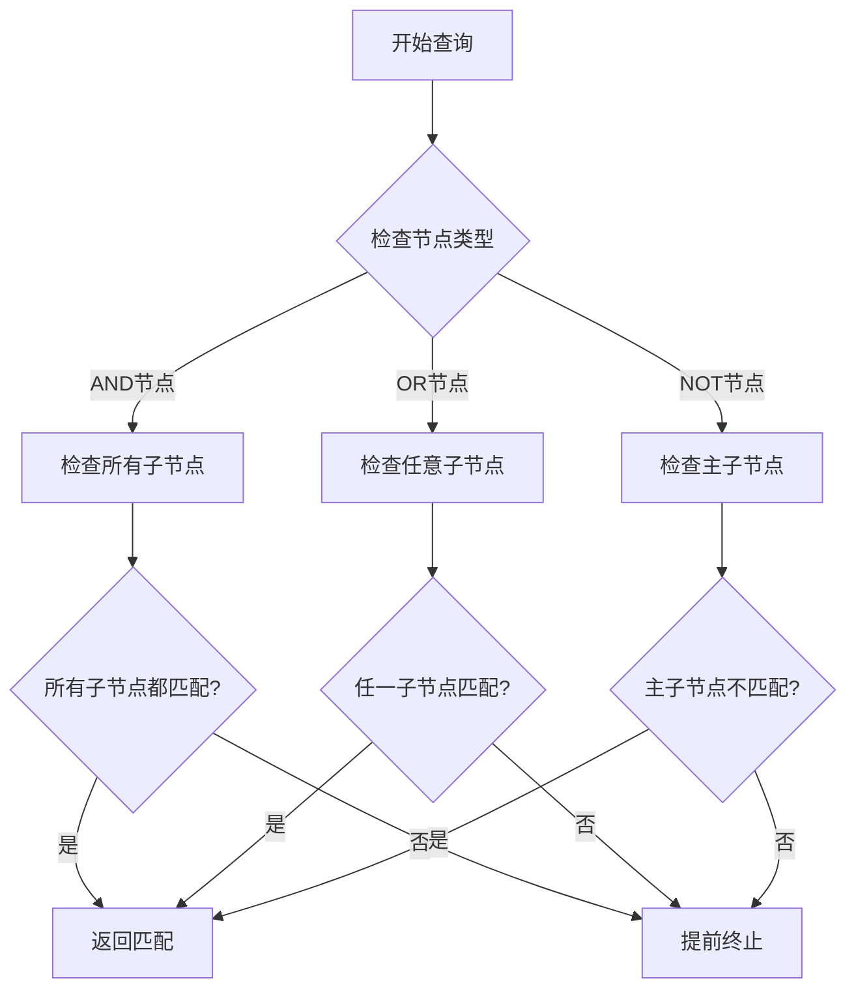
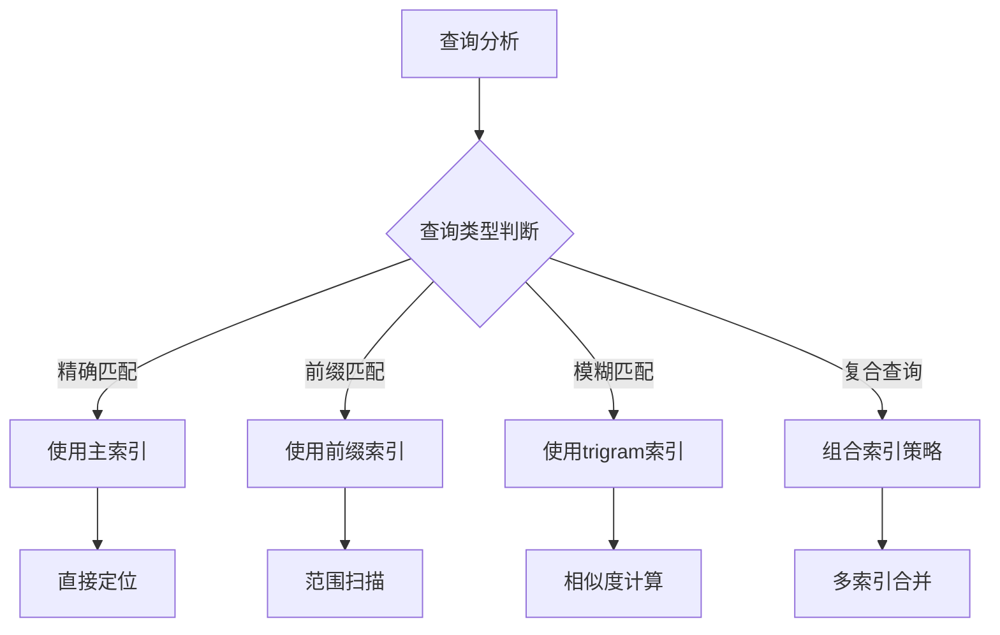
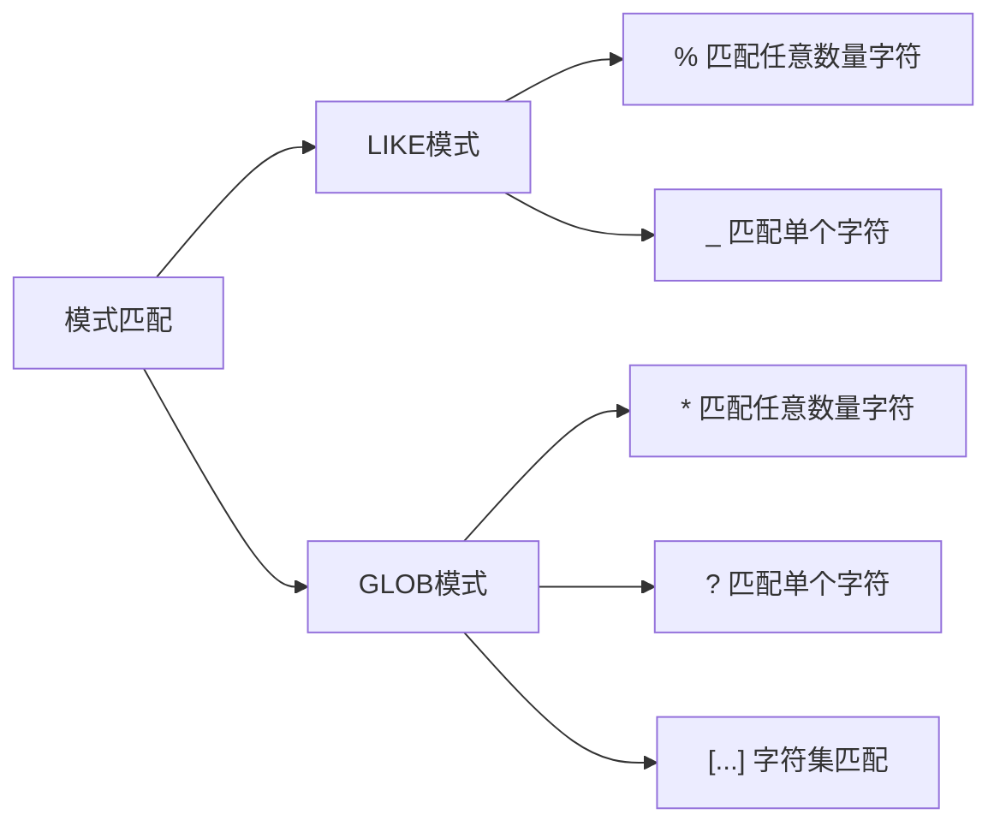
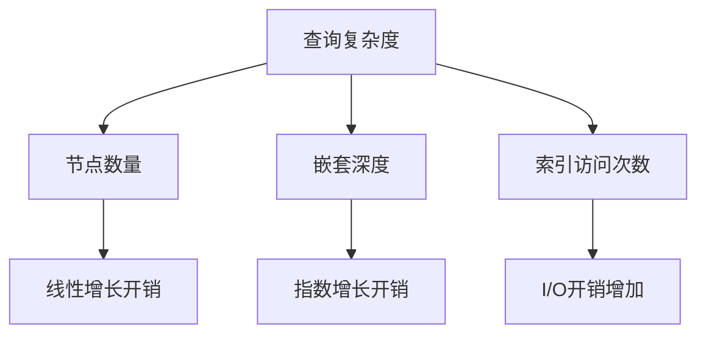

# 查询语法与处理

<cite>
**本文档引用的文件**
- [fts5parse.y](file://ext/fts5/fts5parse.y)
- [fts5_expr.c](file://ext/fts5/fts5_expr.c)
- [fts5.h](file://ext/fts5/fts5.h)
- [fts5Int.h](file://ext/fts5/fts5Int.h)
- [fts5_main.c](file://ext/fts5/fts5_main.c)
- [fts5_buffer.c](file://ext/fts5/fts5_buffer.c)
- [fts5_index.c](file://ext/fts5/fts5_index.c)
</cite>

## 目录
1. [简介](#简介)
2. [查询语法基础](#查询语法基础)
3. [词法分析与语法解析](#词法分析与语法解析)
4. [表达式树构建](#表达式树构建)
5. [查询执行机制](#查询执行机制)
6. [查询优化策略](#查询优化策略)
7. [查询模式详解](#查询模式详解)
8. [性能分析与调优](#性能分析与调优)
9. [故障排除指南](#故障排除指南)
10. [总结](#总结)

## 简介

FTS5（全文搜索第5版）是SQLite的高级全文搜索扩展，提供了强大的查询语法支持。本文档系统性地分析了FTS5的查询语法，从基础的MATCH操作符到复杂的布尔组合、短语查询、前缀搜索和通配符匹配，结合语法文件和核心实现代码，深入探讨查询表达式的词法和语法分析过程，以及表达式树的构建与执行机制。

## 查询语法基础

### 基本查询结构

FTS5查询语法基于MATCH操作符，支持多种查询模式：



**图表来源**
- [fts5parse.y](file://ext/fts5/fts5parse.y#L60-L80)
- [fts5_expr.c](file://ext/fts5/fts5_expr.c#L200-L250)

### 支持的操作符

FTS5查询语法支持以下核心操作符：

| 操作符 | 优先级 | 描述 | 示例 |
|--------|--------|------|------|
| AND | 最高 | 逻辑与运算 | `apple AND orange` |
| OR | 中等 | 逻辑或运算 | `apple OR orange` |
| NOT | 中等 | 逻辑非运算 | `apple NOT orange` |
| NEAR | 最低 | 短语近似匹配 | `"apple" NEAR "orange"` |
| + | 最高 | 连接操作符 | `"apple" + "orange"` |
| * | 最高 | 前缀匹配 | `app*` |

**节来源**
- [fts5parse.y](file://ext/fts5/fts5parse.y#L60-L80)

## 词法分析与语法解析

### 词法分析过程

FTS5使用Lemon语法分析器生成的词法分析器来处理查询文本：

```mermaid
flowchart TD
A["输入字符串"] --> B["跳过空白字符"]
B --> C{"字符类型判断"}
C --> |"("| D["LP标记"]
C --> |")"| E["RP标记"]
C --> |"\""| F["字符串处理"]
C --> |"+"| G["PLUS标记"]
C --> |"*"| H["STAR标记"]
C --> |"-"| I["MINUS标记"]
C --> |"^"| J["CARET标记"]
C --> |其他| K["字符串/关键字"]
F --> L["双引号字符串"]
K --> M["识别关键字"]
K --> N["普通字符串"]
```

**图表来源**
- [fts5_expr.c](file://ext/fts5/fts5_expr.c#L280-L350)

### 语法分析规则

语法分析器定义了完整的查询语法结构：



**图表来源**
- [fts5parse.y](file://ext/fts5/fts5parse.y#L80-L150)

**节来源**
- [fts5parse.y](file://ext/fts5/fts5parse.y#L60-L198)

## 表达式树构建

### 表达式节点类型

FTS5使用层次化的表达式节点来表示查询结构：



**图表来源**
- [fts5_expr.c](file://ext/fts5/fts5_expr.c#L54-L120)

### 表达式树构建算法

表达式树的构建遵循以下原则：

1. **优先级处理**：根据操作符优先级构建树结构
2. **隐式AND转换**：相邻短语自动转换为AND连接
3. **括号优先**：括号内的表达式具有最高优先级
4. **列过滤**：支持按列限制查询范围

**节来源**
- [fts5_expr.c](file://ext/fts5/fts5_expr.c#L2200-L2400)

## 查询执行机制

### 查询执行流程



**图表来源**
- [fts5_expr.c](file://ext/fts5/fts5_expr.c#L1500-L1600)

### 节点执行方法

每种表达式节点都有对应的执行方法：

| 节点类型 | 执行方法 | 功能描述 |
|----------|----------|----------|
| FTS5_STRING | fts5ExprNodeNext_STRING | 处理短语和NEAR查询 |
| FTS5_TERM | fts5ExprNodeNext_TERM | 处理单个词项查询 |
| FTS5_AND | fts5ExprNodeNext_AND | 处理AND逻辑运算 |
| FTS5_OR | fts5ExprNodeNext_OR | 处理OR逻辑运算 |
| FTS5_NOT | fts5ExprNodeNext_NOT | 处理NOT逻辑运算 |

**节来源**
- [fts5_expr.c](file://ext/fts5/fts5_expr.c#L1200-L1400)

## 查询优化策略

### 短路求值机制

FTS5实现了高效的短路求值策略：



**图表来源**
- [fts5_expr.c](file://ext/fts5/fts5_expr.c#L1300-L1400)

### 索引选择优化

FTS5根据查询特征选择最优的索引访问路径：



**图表来源**
- [fts5_index.c](file://ext/fts5/fts5_index.c#L7400-L7450)

### 最小化I/O策略

FTS5采用多种策略减少磁盘I/O：

1. **迭代器缓存**：重用索引迭代器对象
2. **位置列表优化**：压缩存储位置信息
3. **批量读取**：预读相关数据页
4. **内存映射**：利用操作系统页面缓存

**节来源**
- [fts5_expr.c](file://ext/fts5/fts5_expr.c#L1000-L1100)

## 查询模式详解

### 基础查询模式

#### 单词查询
最简单的查询形式，匹配指定的单词：
```
apple
```

#### 短语查询
使用双引号包围的短语，要求词语连续出现：
```
"apple pie"
```

#### 布尔查询
使用逻辑运算符组合多个查询条件：
```
(apple OR orange) AND (banana NOT grape)
```

### 高级查询模式

#### NEAR查询
指定词语之间的最大距离：
```
"apple" NEAR/5 "orange"
```

#### 前缀查询
使用星号作为前缀匹配：
```
app*
```

#### 列过滤查询
限制查询范围到特定列：
```
title:"apple pie"
```

#### 位置查询
使用^符号强制词语出现在开头：
```
^apple
```

**节来源**
- [fts5parse.y](file://ext/fts5/fts5parse.y#L150-L198)

### 通配符和模式匹配

FTS5支持LIKE和GLOB模式匹配：



**图表来源**
- [fts5_expr.c](file://ext/fts5/fts5_expr.c#L400-L500)

**节来源**
- [fts5_main.c](file://ext/fts5/fts5_main.c#L1500-L1600)

## 性能分析与调优

### 查询性能影响因素

#### 索引选择性
查询性能主要受索引选择性影响：

| 选择性级别 | 性能影响 | 优化建议 |
|------------|----------|----------|
| 高选择性 | 快速匹配 | 使用具体词汇 |
| 中等选择性 | 平衡性能 | 合理使用布尔运算 |
| 低选择性 | 慢速匹配 | 添加更多过滤条件 |

#### 复杂表达式开销
复杂查询表达式会增加CPU开销：



**图表来源**
- [fts5_expr.c](file://ext/fts5/fts5_expr.c#L80-L120)

### 性能优化技巧

#### 查询设计优化
1. **避免过度嵌套**：减少表达式树深度
2. **合理使用括号**：明确优先级，避免歧义
3. **选择合适操作符**：根据需求选择最佳操作符
4. **利用索引特性**：优先使用前缀匹配而非模糊匹配

#### 系统配置优化
1. **调整缓冲区大小**：增加内存池大小
2. **优化段合并策略**：平衡写入性能和查询性能
3. **启用前缀索引**：对于常用前缀提高查询速度

**节来源**
- [fts5_main.c](file://ext/fts5/fts5_main.c#L540-L610)

## 故障排除指南

### 常见查询错误

#### 语法错误
最常见的问题是查询语法不正确：
- 缺少匹配的引号
- 操作符使用错误
- 括号不匹配

#### 性能问题
查询性能不佳的常见原因：
- 过于宽泛的查询条件
- 缺乏适当的索引
- 复杂的布尔表达式

#### 结果不准确
查询结果不符合预期：
- 字符编码问题
- 词干提取不一致
- 多语言文本处理

### 调试工具和方法

FTS5提供了多种调试和诊断工具：

1. **EXPLAIN QUERY PLAN**：分析查询执行计划
2. **FTS5内置函数**：使用辅助函数检查查询状态
3. **性能监控**：跟踪查询执行时间
4. **索引统计**：分析索引使用情况

**节来源**
- [fts5.h](file://ext/fts5/fts5.h#L100-L200)

## 总结

FTS5的查询语法和处理机制体现了现代全文搜索引擎的设计精髓。通过词法分析、语法解析、表达式树构建和优化执行等多个层面的精心设计，FTS5能够在保持语法灵活性的同时，提供高效的查询性能。

关键要点包括：

1. **灵活的语法支持**：从简单单词查询到复杂的布尔组合，满足各种查询需求
2. **高效的执行机制**：通过表达式树和短路求值实现快速查询
3. **智能优化策略**：根据查询特征选择最优的索引访问路径
4. **丰富的查询模式**：支持短语、前缀、模式等多种查询方式

理解和掌握这些机制，有助于开发者设计出高性能的全文搜索应用，充分发挥FTS5的强大功能。