# FTS5查询语法详解

<cite>
**本文档中引用的文件**
- [fts5parse.y](file://ext/fts5/fts5parse.y)
- [fts5_expr.c](file://ext/fts5/fts5_expr.c)
- [fts5.h](file://ext/fts5/fts5.h)
- [fts5parse.h](file://ext/fts5/fts5parse.h)
- [fts5_common.tcl](file://ext/fts5/test/fts5_common.tcl)
- [fts5speed.tcl](file://ext/fts5/tool/fts5speed.tcl)
</cite>

## 目录
1. [简介](#简介)
2. [项目结构概览](#项目结构概览)
3. [核心组件分析](#核心组件分析)
4. [语法解析器架构](#语法解析器架构)
5. [查询表达式类型](#查询表达式类型)
6. [布尔操作符详解](#布尔操作符详解)
7. [短语查询与NEAR约束](#短语查询与near约束)
8. [列过滤器机制](#列过滤器机制)
9. [前缀搜索与通配符](#前缀搜索与通配符)
10. [语法树构建过程](#语法树构建过程)
11. [查询优化与执行](#查询优化与执行)
12. [实际应用示例](#实际应用示例)
13. [性能考虑](#性能考虑)
14. [故障排除指南](#故障排除指南)
15. [总结](#总结)

## 简介

FTS5（全文搜索第5版）是SQLite的高级全文搜索扩展，提供了强大的查询语法支持。本文档系统性地分析了FTS5的查询语法，从基础的MATCH操作符到复杂的布尔组合、短语查询、前缀搜索和通配符匹配。通过深入解析`fts5parse.y`语法文件和相关源代码，我们将详细说明语法树的构建规则、操作符优先级处理以及各种查询模式的实现原理。

FTS5查询语法的核心特点包括：
- 支持布尔逻辑运算（AND、OR、NOT）
- 短语查询和精确匹配
- NEAR约束用于位置相关查询
- 列过滤器限制搜索范围
- 前缀搜索和通配符匹配
- 语法错误检测和报告

## 项目结构概览

FTS5模块在SQLite项目中的组织结构体现了清晰的分层设计：

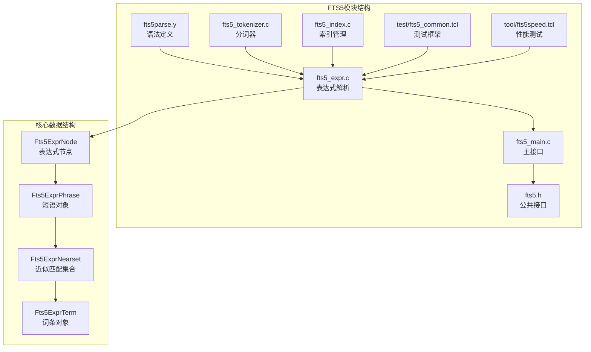

**图表来源**
- [fts5parse.y](file://ext/fts5/fts5parse.y#L1-L198)
- [fts5_expr.c](file://ext/fts5/fts5_expr.c#L1-L100)

**章节来源**
- [fts5parse.y](file://ext/fts5/fts5parse.y#L1-L198)
- [fts5_expr.c](file://ext/fts5/fts5_expr.c#L1-L100)

## 核心组件分析

### 语法解析器核心结构

FTS5的语法解析器基于Lemon语法分析器生成器构建，其核心数据结构定义了查询表达式的各种类型：

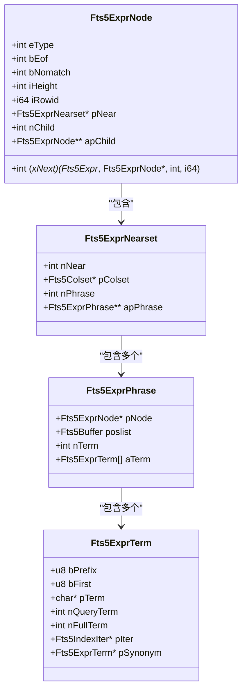

**图表来源**
- [fts5_expr.c](file://ext/fts5/fts5_expr.c#L54-L145)

### 表达式节点类型

FTS5定义了五种主要的表达式节点类型，每种类型对应不同的查询语义：

| 节点类型 | 数值常量 | 描述 | 子节点数量 |
|---------|---------|------|-----------|
| FTS5_AND | 1 | 逻辑与操作 | 2或更多 |
| FTS5_OR | 2 | 逻辑或操作 | 2或更多 |
| FTS5_NOT | 3 | 逻辑非操作 | 固定2个 |
| FTS5_STRING | 4 | 短语查询 | 无子节点 |
| FTS5_TERM | 5 | 单词词条 | 无子节点 |

**章节来源**
- [fts5_expr.c](file://ext/fts5/fts5_expr.c#L54-L89)

## 语法解析器架构

### Lemon语法定义分析

FTS5的语法解析器使用Lemon语法分析器生成器，其语法规则定义在`fts5parse.y`文件中：

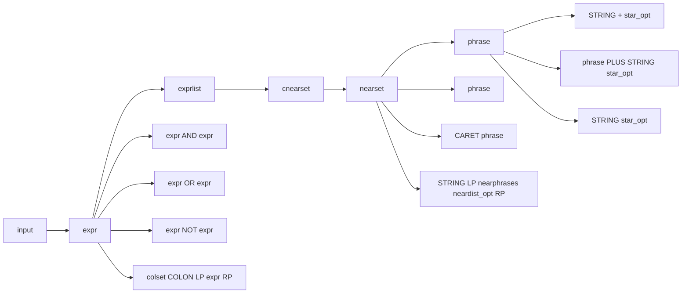

**图表来源**
- [fts5parse.y](file://ext/fts5/fts5parse.y#L60-L196)

### 词法分析器实现

词法分析器负责将输入字符串分解为标记（tokens），支持的操作符和特殊字符：

| 字符 | 标记类型 | 描述 |
|------|---------|------|
| ( | FTS5_LP | 左圆括号 |
| ) | FTS5_RP | 右圆括号 |
| { | FTS5_LCP | 左大括号 |
| } | FTS5_RCP | 右大括号 |
| : | FTS5_COLON | 冒号（列过滤器） |
| , | FTS5_COMMA | 逗号 |
| + | FTS5_PLUS | 加号（短语连接） |
| * | FTS5_STAR | 星号（通配符） |
| - | FTS5_MINUS | 减号 |
| ^ | FTS5_CARET | 插入符号 |
| " | FTS5_STRING | 双引号字符串 |
| \0 | FTS5_EOF | 文件结束 |

**章节来源**
- [fts5_expr.c](file://ext/fts5/fts5_expr.c#L196-L245)

## 查询表达式类型

### 基础表达式结构

FTS5支持多种类型的查询表达式，每种都有特定的用途和语义：

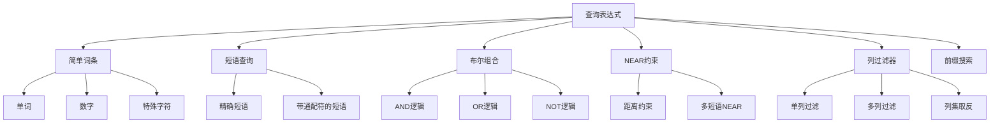

### 表达式优先级规则

FTS5的布尔操作符遵循特定的优先级顺序：

```mermaid
graph TD
A[操作符优先级] --> B[最高优先级]
B --> C[1. 括号 ()]
B --> D[2. NEAR约束]
B --> E[3. NOT运算符]
B --> F[4. AND运算符]
B --> G[5. OR运算符]
H[隐式AND] --> I[短语连接 +]
I --> J[连续词条]
```

**图表来源**
- [fts5parse.y](file://ext/fts5/fts5parse.y#L50-L55)

**章节来源**
- [fts5parse.y](file://ext/fts5/fts5parse.y#L60-L196)

## 布尔操作符详解

### AND操作符

AND操作符用于连接两个查询条件，要求两个条件都必须满足：

```sql
-- 基本AND查询
SELECT * FROM documents WHERE documents MATCH 'apple AND orange';

-- 隐式AND（连续词条）
SELECT * FROM documents WHERE documents MATCH 'apple orange';
```

### OR操作符

OR操作符用于提供多个备选条件，只要满足其中一个即可：

```sql
-- 基本OR查询
SELECT * FROM documents WHERE documents MATCH 'apple OR orange';

-- 多项OR查询
SELECT * FROM documents WHERE documents MATCH 'cat OR dog OR bird';
```

### NOT操作符

NOT操作符用于排除符合条件的文档：

```sql
-- 基本NOT查询
SELECT * FROM documents WHERE documents MATCH 'apple NOT orange';

-- 复合NOT查询
SELECT * FROM documents WHERE documents MATCH 'fruit NOT (apple OR orange)';
```

### 布尔操作符优先级处理

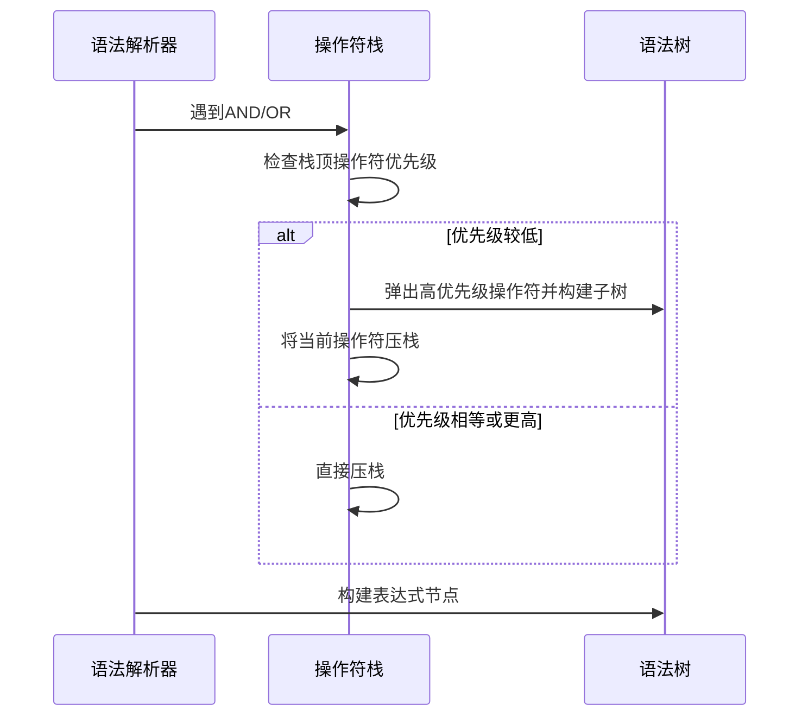

**图表来源**
- [fts5parse.y](file://ext/fts5/fts5parse.y#L80-L100)

**章节来源**
- [fts5parse.y](file://ext/fts5/fts5parse.y#L80-L100)

## 短语查询与NEAR约束

### 短语查询语法

短语查询要求多个词条按特定顺序出现在文档中：

```sql
-- 基本短语查询
SELECT * FROM documents WHERE documents MATCH '"apple pie"';

-- 带通配符的短语查询
SELECT * FROM documents WHERE documents MATCH '"apple*"';

-- 短语连接（隐式AND）
SELECT * FROM documents WHERE documents MATCH 'apple + pie';
```

### NEAR约束机制

NEAR约束允许指定词条之间的最大距离：

```sql
-- 基本NEAR查询
SELECT * FROM documents WHERE documents MATCH 'NEAR(apple pie 5)';

-- 带列过滤的NEAR查询
SELECT * FROM documents WHERE documents MATCH 'title:NEAR(apple pie 10)';

-- 多短语NEAR查询
SELECT * FROM documents WHERE documents MATCH 'NEAR(apple pie orange 3)';
```

### NEAR约束的内部表示

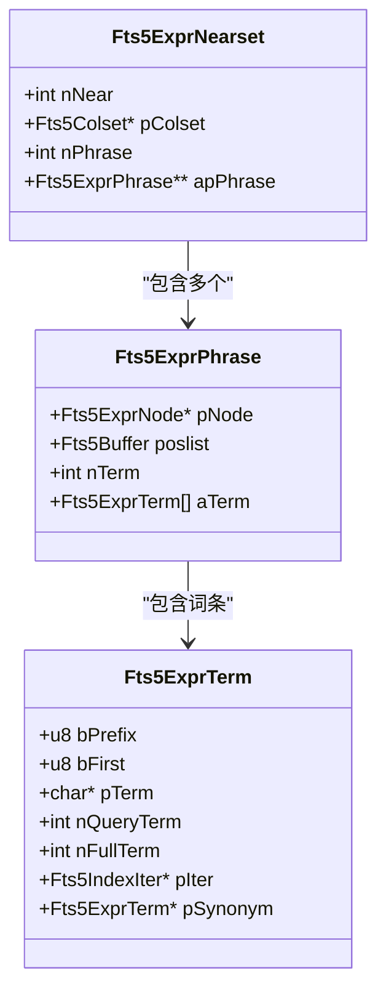

**图表来源**
- [fts5_expr.c](file://ext/fts5/fts5_expr.c#L117-L145)

**章节来源**
- [fts5parse.y](file://ext/fts5/fts5parse.y#L150-L196)
- [fts5_expr.c](file://ext/fts5/fts5_expr.c#L1975-L2034)

## 列过滤器机制

### 列过滤器语法

列过滤器允许限制查询只在特定列中进行：

```sql
-- 单列过滤
SELECT * FROM documents WHERE documents MATCH 'title:apple';

-- 多列过滤
SELECT * FROM documents WHERE documents MATCH 'title:apple OR body:apple';

-- 列集过滤
SELECT * FROM documents WHERE documents MATCH '{title body}:apple';

-- 列集取反
SELECT * FROM documents WHERE documents MATCH '-{title}:apple';
```

### 列过滤器的内部实现

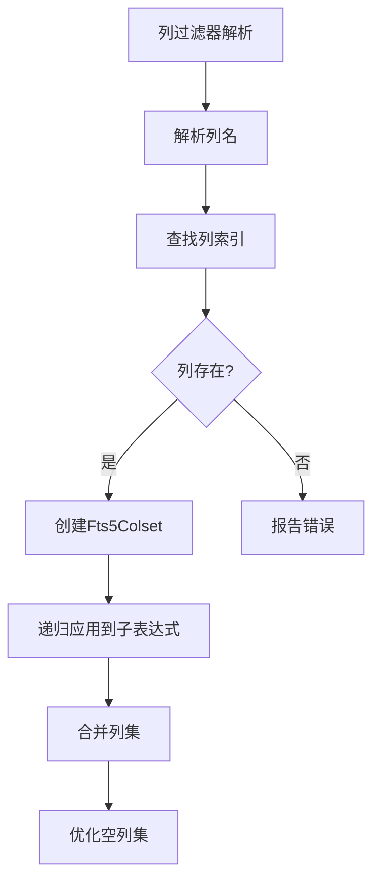

**图表来源**
- [fts5_expr.c](file://ext/fts5/fts5_expr.c#L2036-L2131)

### 列过滤器的数据结构

| 结构体 | 用途 | 关键字段 |
|--------|------|---------|
| Fts5Colset | 列集合 | nCol, aiCol[] |
| Fts5ExprNearset | 近似匹配集合 | pColset, nPhrase |
| Fts5ExprNode | 表达式节点 | pNear, eType |

**章节来源**
- [fts5_expr.c](file://ext/fts5/fts5_expr.c#L2036-L2277)

## 前缀搜索与通配符

### 前缀搜索语法

前缀搜索允许匹配以特定字符串开头的词条：

```sql
-- 基本前缀搜索
SELECT * FROM documents WHERE documents MATCH 'app*';

-- 多列前缀搜索
SELECT * FROM documents WHERE documents MATCH 'title:app*';

-- 复杂前缀搜索
SELECT * FROM documents WHERE documents MATCH 'author:J* AND title:python*';
```

### 通配符匹配机制

通配符匹配支持更灵活的模式匹配：

```sql
-- 基本通配符
SELECT * FROM documents WHERE documents MATCH 'a*t';

-- 多列通配符
SELECT * FROM documents WHERE documents MATCH 'content:a*t';

-- 复合通配符
SELECT * FROM documents WHERE documents MATCH '(apple OR orange)*';
```

### 通配符的词法分析

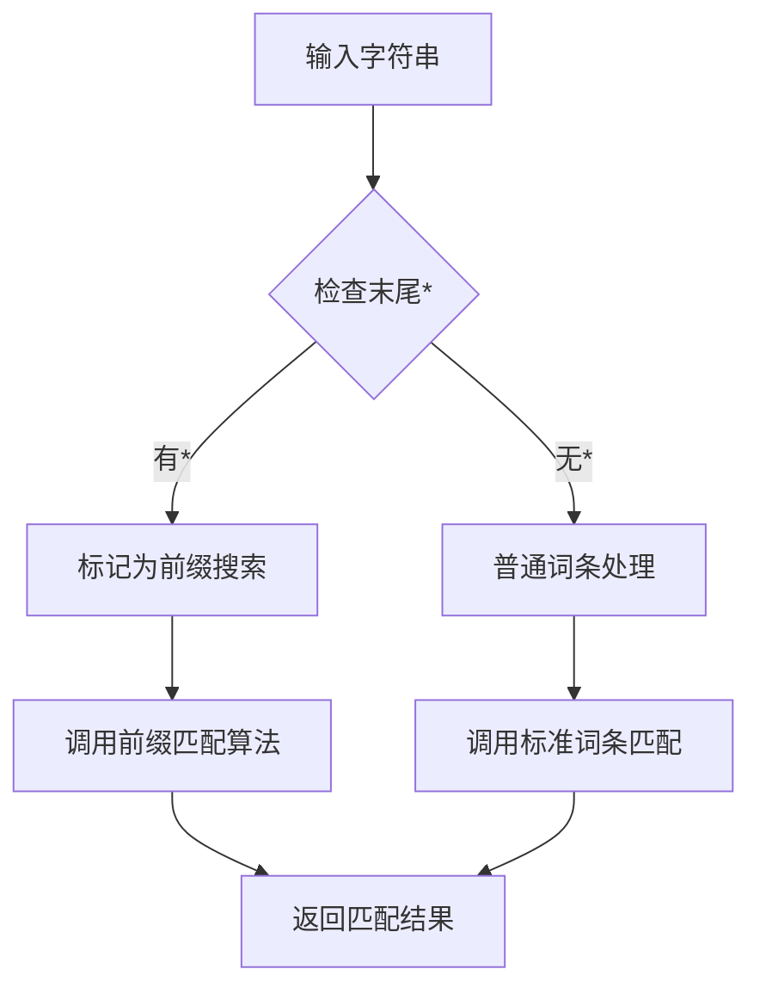

**图表来源**
- [fts5_expr.c](file://ext/fts5/fts5_expr.c#L2272-L2318)

**章节来源**
- [fts5_expr.c](file://ext/fts5/fts5_expr.c#L196-L245)

## 语法树构建过程

### 语法树节点类型

FTS5的语法树由不同类型的节点组成，每个节点代表查询的不同部分：

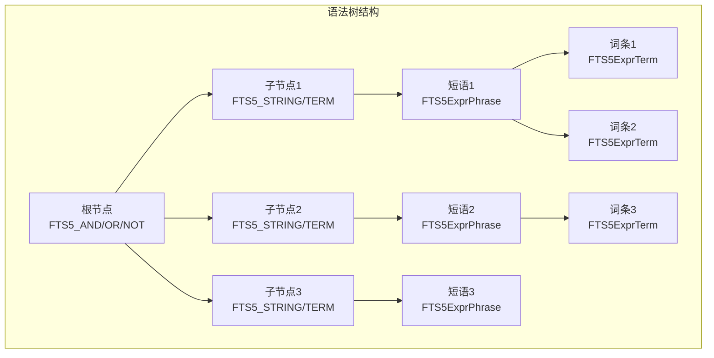

**图表来源**
- [fts5_expr.c](file://ext/fts5/fts5_expr.c#L54-L89)

### 语法树优化过程

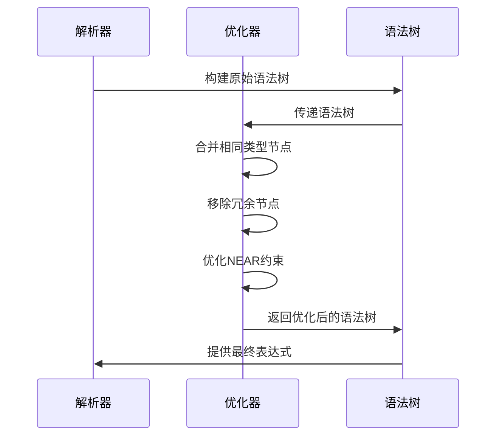

### 表达式节点的高度计算

语法树节点的高度用于优化查询执行计划：

| 节点类型 | 高度计算规则 | 示例 |
|---------|-------------|------|
| FTS5_STRING/TERM | 固定高度0 | 叶节点 |
| FTS5_AND/OR | 子节点最大高度+1 | 非叶节点 |
| FTS5_NOT | 子节点高度+1 | 非叶节点 |

**章节来源**
- [fts5_expr.c](file://ext/fts5/fts5_expr.c#L54-L89)
- [fts5_expr.c](file://ext/fts5/fts5_expr.c#L2272-L2318)

## 查询优化与执行

### 查询执行策略

FTS5根据语法树的结构选择最优的查询执行策略：

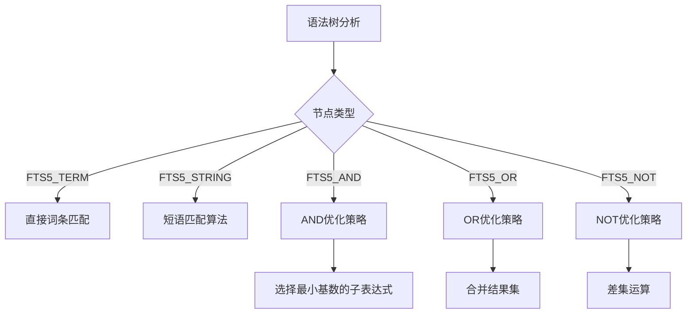

### 性能优化技术

FTS5采用多种技术来提高查询性能：

| 优化技术 | 应用场景 | 效果 |
|---------|---------|------|
| 词条基数优化 | AND查询 | 选择最小基数的词条作为驱动 |
| 短语预排序 | 多词条短语 | 按词条频率排序减少扫描 |
| NEAR约束优化 | NEAR查询 | 限制搜索窗口大小 |
| 列过滤优化 | 带列过滤的查询 | 减少索引扫描范围 |

**章节来源**
- [fts5_expr.c](file://ext/fts5/fts5_expr.c#L718-L751)

## 实际应用示例

### 基础查询模式

以下是一些常见的FTS5查询模式及其对应的SQL语句：

| 查询类型 | SQL示例 | 描述 |
|---------|---------|------|
| 简单词条 | `'apple'` | 匹配包含"apple"的文档 |
| 短语查询 | `'\"apple pie\"'` | 匹配包含"apple pie"的文档 |
| 布尔组合 | `'apple AND pie'` | 匹配同时包含"apple"和"pie"的文档 |
| 排除查询 | `'apple NOT pie'` | 匹配包含"apple"但不包含"pie"的文档 |
| 列过滤 | `'title:apple'` | 在标题列中搜索"apple" |
| 前缀搜索 | `'app*'` | 匹配以"app"开头的词条 |
| NEAR查询 | `'NEAR(apple pie 5)'` | 匹配"apple"和"pie"相距不超过5个词的文档 |

### 复杂查询示例

```sql
-- 综合查询：在标题中搜索"机器学习"或"人工智能"，
-- 并且不在内容中出现"过时"，同时限制在最近一年内
SELECT * FROM articles WHERE articles MATCH '
    (title:"机器学习" OR title:"人工智能") 
    AND content NOT "过时" 
    AND date >= "2023-01-01"
';

-- NEAR查询：搜索"自然语言"和"处理"相距不超过10个词的文档
SELECT * FROM papers WHERE papers MATCH '
    NEAR(自然语言 处理 10)
';

-- 列过滤组合：在作者和标题中搜索"数据库"相关的文档
SELECT * FROM books WHERE books MATCH '
    {author title}:"数据库*" 
    AND subject:"计算机科学"
';
```

**章节来源**
- [fts5speed.tcl](file://ext/fts5/tool/fts5speed.tcl#L2-L42)

## 性能考虑

### 查询复杂度分析

FTS5查询的性能取决于多个因素：

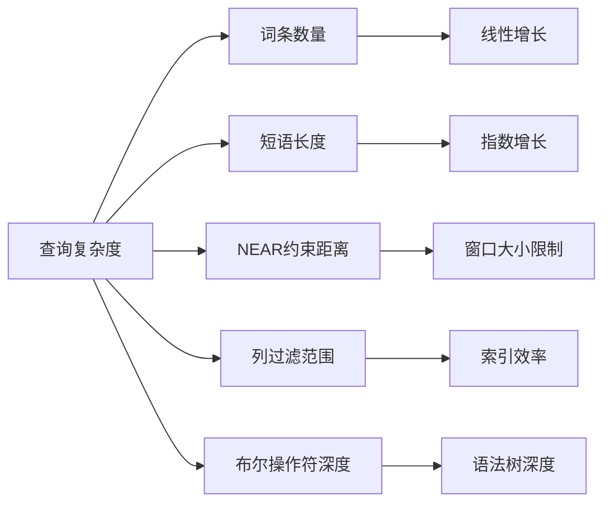

### 性能优化建议

1. **合理使用布尔操作符**：避免过深的嵌套结构
2. **控制NEAR约束距离**：设置合理的距离参数
3. **有效使用列过滤**：限制搜索范围
4. **前缀搜索优化**：避免过于宽泛的前缀模式
5. **短语查询优化**：保持短语长度适中

### 内存使用优化

FTS5在处理大型查询时采用多种内存优化技术：

| 优化技术 | 应用场景 | 内存节省 |
|---------|---------|---------|
| 流式处理 | 大型结果集 | 减少内存占用 |
| 位置列表压缩 | 短语匹配 | 压缩位置信息 |
| 缓存机制 | 重复查询 | 提高缓存命中率 |
| 延迟加载 | 大型索引 | 按需加载数据 |

## 故障排除指南

### 常见语法错误

FTS5提供了详细的语法错误报告，帮助用户快速定位问题：

| 错误类型 | 常见原因 | 解决方案 |
|---------|---------|---------|
| 未终止字符串 | 缺少右引号 | 检查字符串是否正确闭合 |
| 无效操作符 | 使用未知操作符 | 确认操作符拼写正确 |
| 列不存在 | 列名拼写错误 | 检查表结构定义 |
| NEAR参数错误 | 距离参数格式错误 | 确保距离为整数 |
| 语法错误 | 表达式结构错误 | 检查括号匹配和操作符顺序 |

### 调试技巧

```sql
-- 使用EXPLAIN QUERY PLAN查看查询计划
EXPLAIN QUERY PLAN SELECT * FROM documents WHERE documents MATCH 'apple';

-- 检查语法树结构
SELECT fts5_expr('apple AND pie');

-- 分析查询性能
.timer on
SELECT * FROM documents WHERE documents MATCH 'complex_query';
```

### 性能诊断

当查询性能不佳时，可以采用以下诊断方法：

1. **分析查询复杂度**：检查语法树深度和节点数量
2. **验证索引使用**：确认相关列已建立FTS5索引
3. **监控内存使用**：观察查询过程中的内存消耗
4. **测试查询模式**：对比不同查询模式的性能差异

**章节来源**
- [fts5_expr.c](file://ext/fts5/fts5_expr.c#L196-L245)

## 总结

FTS5的查询语法是一个精心设计的全文搜索系统，它通过以下核心特性提供了强大而灵活的查询能力：

### 主要优势

1. **丰富的查询语法**：支持布尔逻辑、短语查询、NEAR约束等多种查询模式
2. **高效的语法解析**：基于Lemon的语法分析器确保语法正确性
3. **灵活的列过滤**：允许精确控制搜索范围
4. **强大的前缀搜索**：支持通配符和前缀匹配
5. **智能的查询优化**：自动优化查询执行计划

### 设计亮点

- **模块化架构**：清晰的分层设计便于维护和扩展
- **类型安全**：强类型系统防止运行时错误
- **错误处理**：完善的错误检测和报告机制
- **性能优化**：多层次的查询优化策略

### 应用建议

FTS5查询语法的设计充分考虑了实际应用需求，在提供强大功能的同时保持了良好的易用性。开发者可以根据具体的应用场景选择合适的查询模式，通过合理的查询设计和优化技术，充分发挥FTS5的性能优势。

通过本文档的详细分析，读者应该能够深入理解FTS5查询语法的工作原理，掌握各种查询模式的使用方法，并能够在实际项目中有效地应用这些知识来构建高性能的全文搜索解决方案。