# 表达式执行机制

<cite>
**本文档引用的文件**
- [fts5_expr.c](file://ext/fts5/fts5_expr.c)
- [fts5Int.h](file://ext/fts5/fts5Int.h)
- [fts5parse.y](file://ext/fts5/fts5parse.y)
</cite>

## 目录
1. [简介](#简介)
2. [项目结构](#项目结构)
3. [核心组件](#核心组件)
4. [架构概览](#架构概览)
5. [详细组件分析](#详细组件分析)
6. [依赖关系分析](#依赖关系分析)
7. [性能考虑](#性能考虑)
8. [故障排除指南](#故障排除指南)
9. [结论](#结论)

## 简介

FTS5表达式执行机制是SQLite全文搜索功能的核心组件，负责解析、构建和执行复杂的查询表达式。该系统通过表达式树（Expression Tree）结构来表示查询逻辑，支持AND、OR、NOT等布尔操作符，以及NEAR近邻查询等高级功能。

本文档深入分析了fts5_expr.c文件中的表达式树构建与执行机制，详细说明了Fts5ExprNode结构体如何表示不同类型的节点，虚拟机如何遍历表达式树进行求值，以及查询优化策略的实现原理。

## 项目结构

FTS5表达式系统的核心文件组织如下：

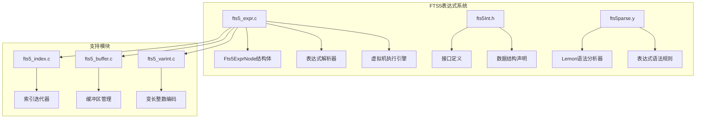

**图表来源**
- [fts5_expr.c](file://ext/fts5/fts5_expr.c#L1-L50)
- [fts5Int.h](file://ext/fts5/fts5Int.h#L1-L100)

**章节来源**
- [fts5_expr.c](file://ext/fts5/fts5_expr.c#L1-L100)
- [fts5Int.h](file://ext/fts5/fts5Int.h#L1-L200)

## 核心组件

### Fts5ExprNode结构体

Fts5ExprNode是表达式树的基本节点结构，定义了所有类型节点的通用属性：

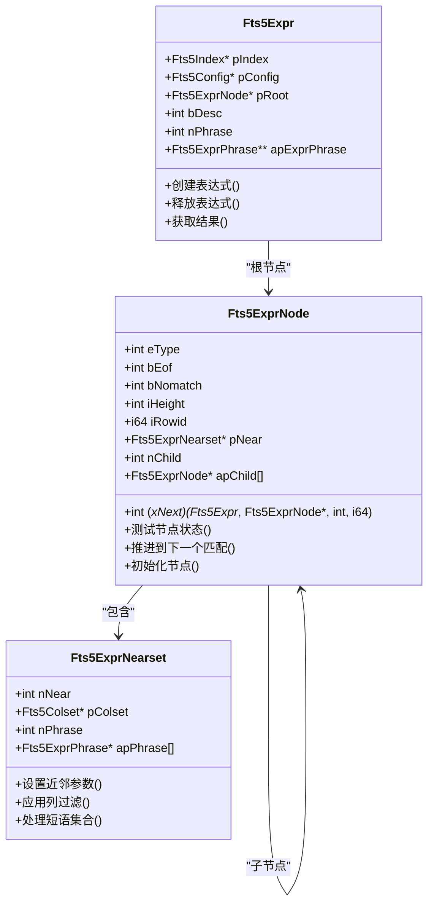

**图表来源**
- [fts5_expr.c](file://ext/fts5/fts5_expr.c#L73-L89)
- [fts5Int.h](file://ext/fts5/fts5Int.h#L780-L780)

### 节点类型定义

表达式树支持以下节点类型：

| 节点类型 | 常量值 | 描述 | 子节点数量 |
|---------|--------|------|-----------|
| FTS5_STRING | 字符串节点 | 包含一个或多个短语的字符串匹配 | 可变 |
| FTS5_TERM | 单词节点 | 单个词汇项的精确匹配 | 无 |
| FTS5_AND | 逻辑与节点 | 所有子节点都必须匹配 | 2+ |
| FTS5_OR | 逻辑或节点 | 至少一个子节点匹配即可 | 2+ |
| FTS5_NOT | 逻辑非节点 | 第一个子节点不匹配，第二个子节点匹配 | 固定2 |

**章节来源**
- [fts5_expr.c](file://ext/fts5/fts5_expr.c#L73-L89)
- [fts5Int.h](file://ext/fts5/fts5Int.h#L792-L799)

## 架构概览

FTS5表达式执行系统采用分层架构设计：

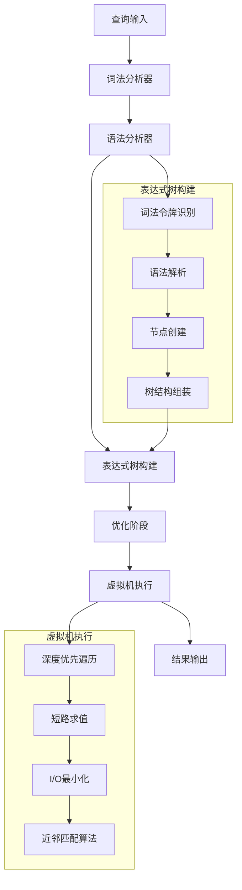

**图表来源**
- [fts5_expr.c](file://ext/fts5/fts5_expr.c#L270-L340)
- [fts5parse.y](file://ext/fts5/fts5parse.y#L1-L50)

## 详细组件分析

### 表达式解析与构建

#### 词法分析过程

表达式解析从词法分析开始，将查询字符串分解为令牌：

```mermaid
flowchart TD
A[查询字符串] --> B[跳过空白字符]
B --> C{识别令牌类型}
C --> |'('|D[左括号]
C --> |')'|E[右括号]
C --> |'"'|F[字符串令牌]
C --> |'+'|G[加号]
C --> |'*'|H[星号]
C --> |'-'|I[减号]
C --> |其他|J[普通字符串]
F --> K[处理引号字符串]
J --> L[识别关键字]
L --> M{是否为关键字?}
M --> |是|N[返回关键字令牌]
M --> |否|O[返回字符串令牌]
K --> P[提取字符串内容]
P --> Q[处理转义字符]
Q --> O
```

**图表来源**
- [fts5_expr.c](file://ext/fts5/fts5_expr.c#L200-L270)

#### 表达式树构建算法

表达式树的构建遵循语法规则，使用递归下降解析：

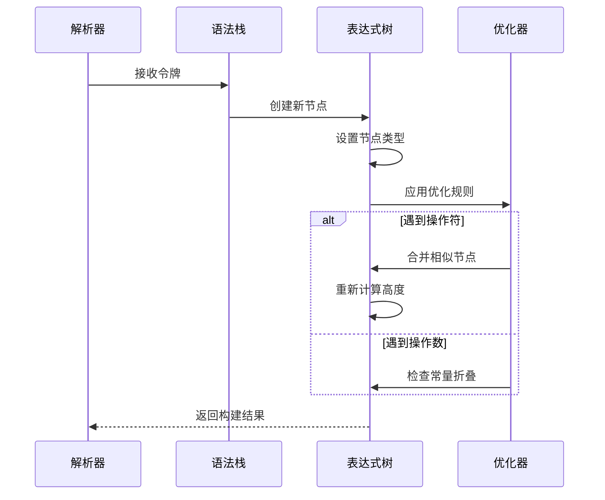

**图表来源**
- [fts5_expr.c](file://ext/fts5/fts5_expr.c#L2365-L2457)

**章节来源**
- [fts5_expr.c](file://ext/fts5/fts5_expr.c#L200-L340)

### 虚拟机执行引擎

#### 表达式树遍历机制

虚拟机使用深度优先遍历来遍历表达式树：

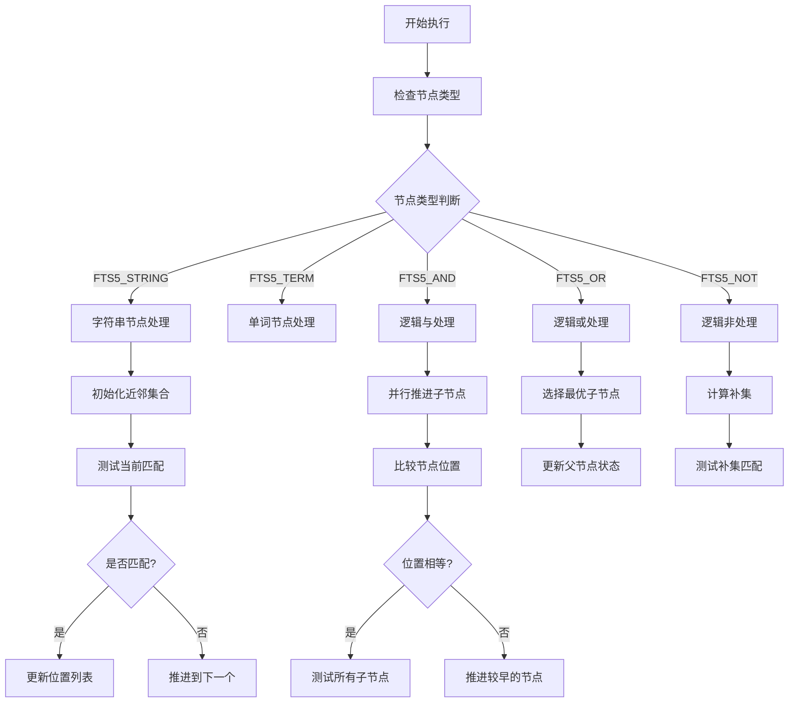

**图表来源**
- [fts5_expr.c](file://ext/fts5/fts5_expr.c#L1200-L1400)

#### 短路求值优化

短路求值是FTS5表达式执行的重要优化策略：

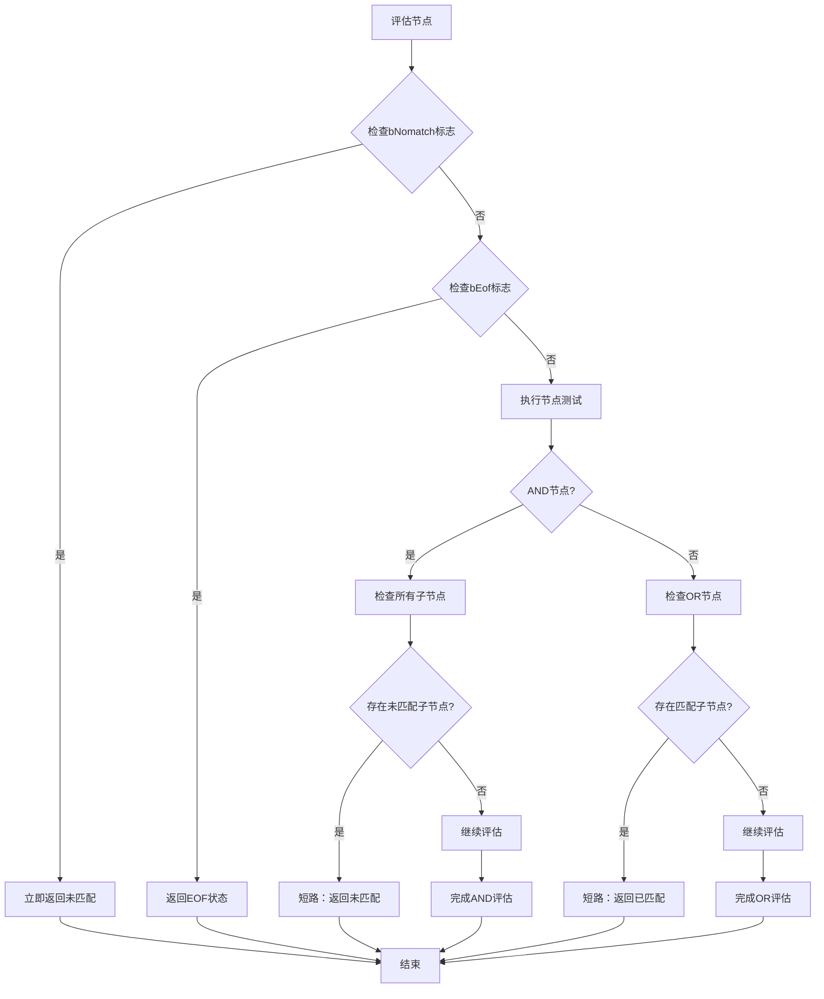

**图表来源**
- [fts5_expr.c](file://ext/fts5/fts5_expr.c#L1400-L1600)

**章节来源**
- [fts5_expr.c](file://ext/fts5/fts5_expr.c#L1200-L1600)

### 近邻查询匹配算法

#### NEAR操作符实现

NEAR操作符用于匹配相距一定距离的词语：

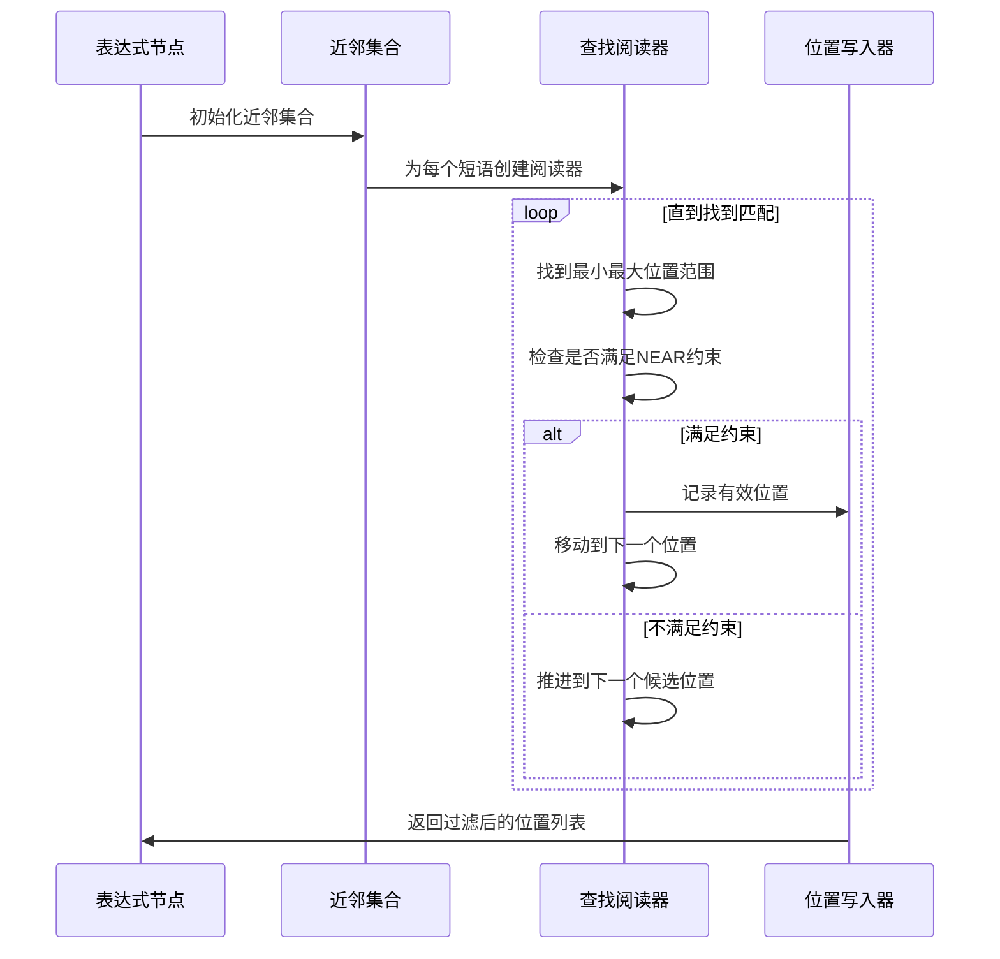

**图表来源**
- [fts5_expr.c](file://ext/fts5/fts5_expr.c#L700-L900)

#### 位置列表合并算法

近邻匹配涉及复杂的位置列表合并：

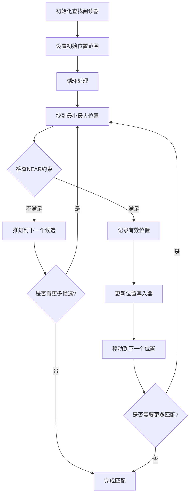

**图表来源**
- [fts5_expr.c](file://ext/fts5/fts5_expr.c#L700-L850)

**章节来源**
- [fts5_expr.c](file://ext/fts5/fts5_expr.c#L700-L900)

### 查询优化策略

#### I/O最小化技术

FTS5实现了多种I/O最小化策略：

| 优化技术 | 实现方式 | 性能收益 |
|---------|----------|----------|
| 前缀索引利用 | 自动检测前缀查询模式 | 减少磁盘访问次数 |
| 位置列表缓存 | 缓存频繁访问的位置信息 | 避免重复解码 |
| 批量读取 | 一次性读取多个文档 | 减少系统调用开销 |
| 迭代器重用 | 复用索引迭代器对象 | 减少内存分配 |

#### 表达式简化

编译时表达式简化包括：

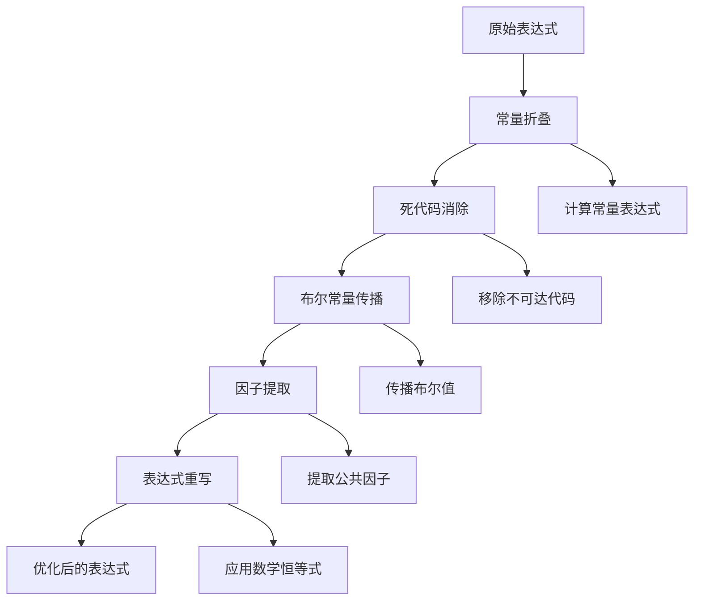

**图表来源**
- [fts5_expr.c](file://ext/fts5/fts5_expr.c#L2457-L2600)

**章节来源**
- [fts5_expr.c](file://ext/fts5/fts5_expr.c#L2457-L2600)

## 依赖关系分析

FTS5表达式系统的依赖关系图：

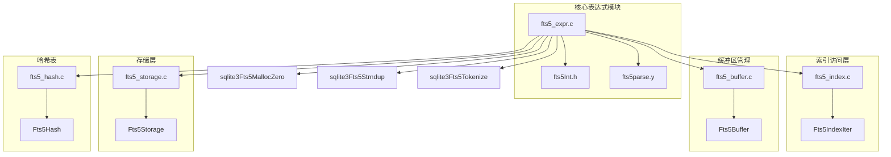

**图表来源**
- [fts5_expr.c](file://ext/fts5/fts5_expr.c#L1-L50)
- [fts5Int.h](file://ext/fts5/fts5Int.h#L1-L100)

**章节来源**
- [fts5_expr.c](file://ext/fts5/fts5_expr.c#L1-L100)
- [fts5Int.h](file://ext/fts5/fts5Int.h#L1-L200)

## 性能考虑

### 内存管理优化

FTS5表达式系统采用多种内存管理优化策略：

- **对象池化**：重用表达式节点对象
- **延迟分配**：按需分配子节点数组
- **紧凑布局**：使用可变长度数组减少内存碎片

### 并发控制

表达式执行支持并发访问：

- **只读共享**：多个查询可以同时访问相同的表达式树
- **线程安全**：使用原子操作保护共享状态
- **锁粒度优化**：最小化锁持有时间

### 缓存策略

多级缓存提高查询性能：

1. **L1缓存**：热点位置列表缓存
2. **L2缓存**：表达式节点缓存
3. **磁盘缓存**：索引页面缓存

## 故障排除指南

### 常见问题诊断

#### 表达式解析错误

| 错误类型 | 可能原因 | 解决方案 |
|---------|----------|----------|
| 语法错误 | 不正确的操作符使用 | 检查查询语法 |
| 令牌识别失败 | 特殊字符处理不当 | 使用引号包围特殊字符 |
| 内存不足 | 表达式过于复杂 | 简化查询或增加内存限制 |

#### 执行性能问题

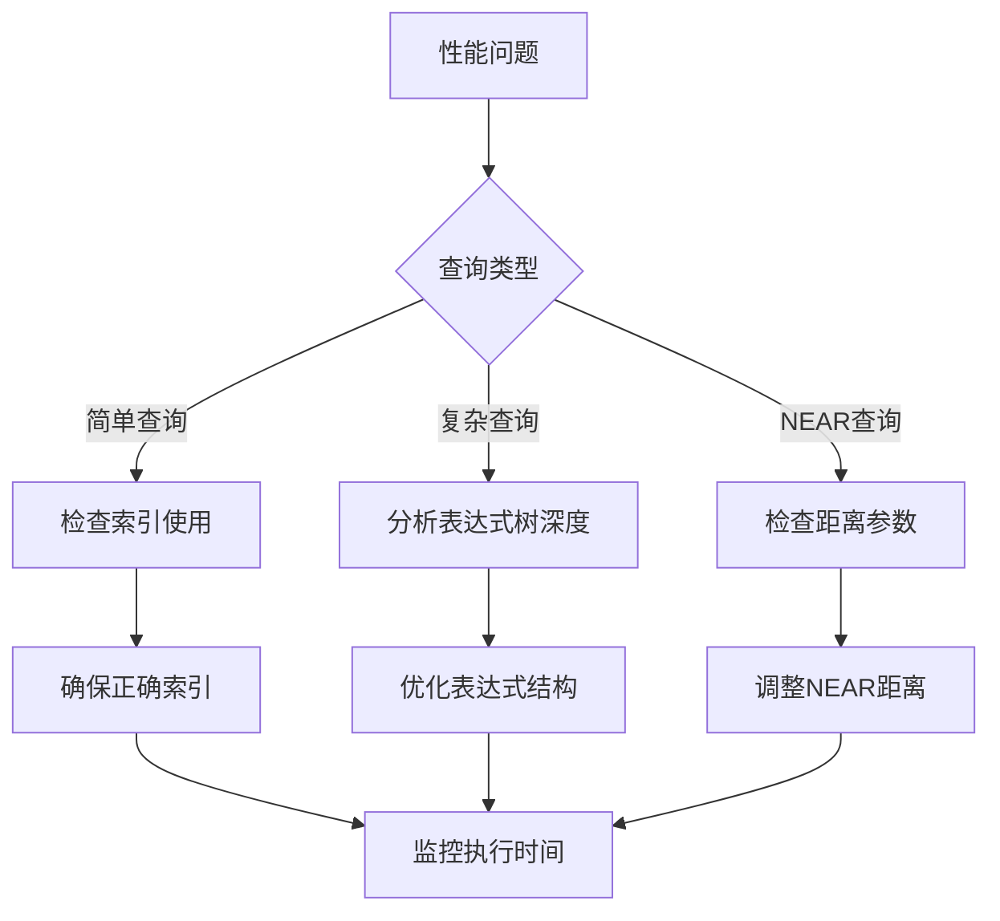

**图表来源**
- [fts5_expr.c](file://ext/fts5/fts5_expr.c#L270-L340)

**章节来源**
- [fts5_expr.c](file://ext/fts5/fts5_expr.c#L270-L400)

## 结论

FTS5表达式执行机制是一个高度优化的全文搜索查询处理系统。通过表达式树结构、短路求值、I/O最小化等技术，它能够高效地处理复杂的查询需求。

关键特性总结：

1. **灵活的表达式树**：支持任意复杂的布尔逻辑和近邻查询
2. **智能优化**：短路求值、表达式简化、I/O最小化
3. **高性能执行**：基于迭代器的增量处理，避免全表扫描
4. **内存效率**：对象池化、延迟分配等内存优化技术

该系统为SQLite提供了强大的全文搜索能力，是现代数据库系统中全文检索功能的优秀实现范例。