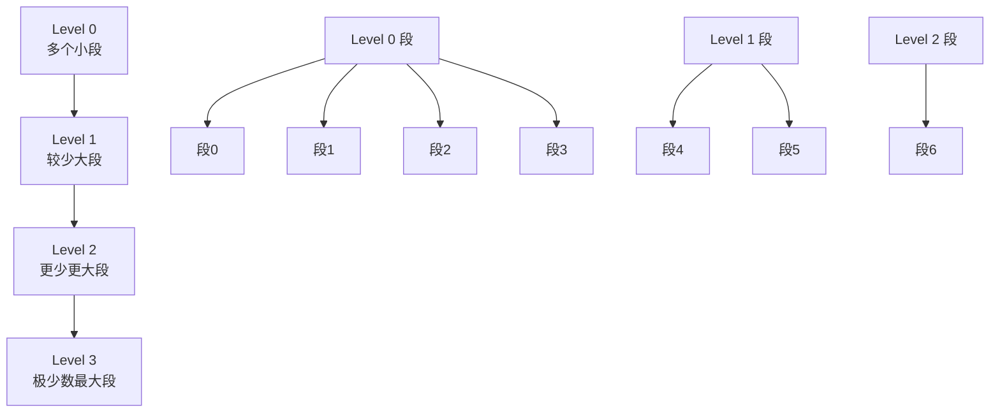
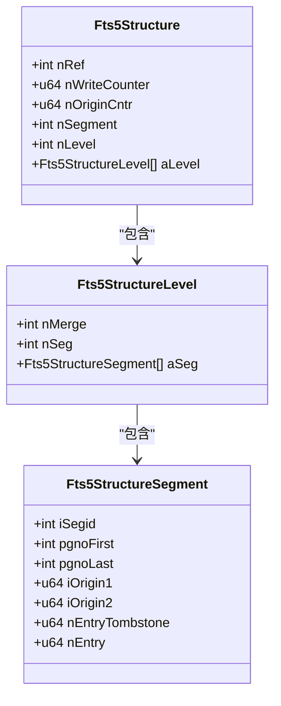
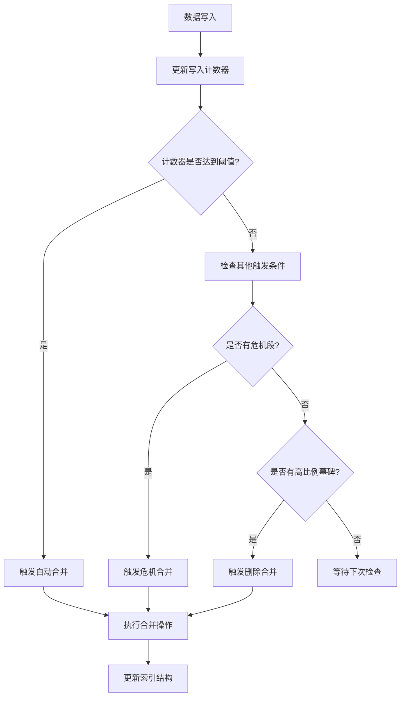
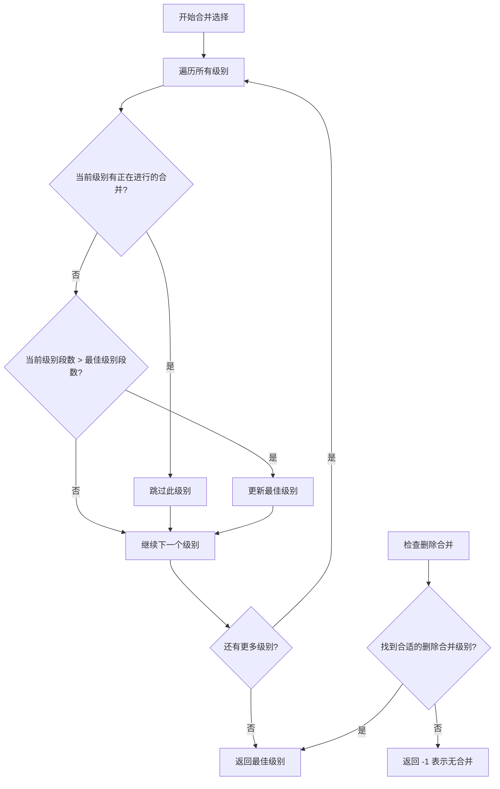
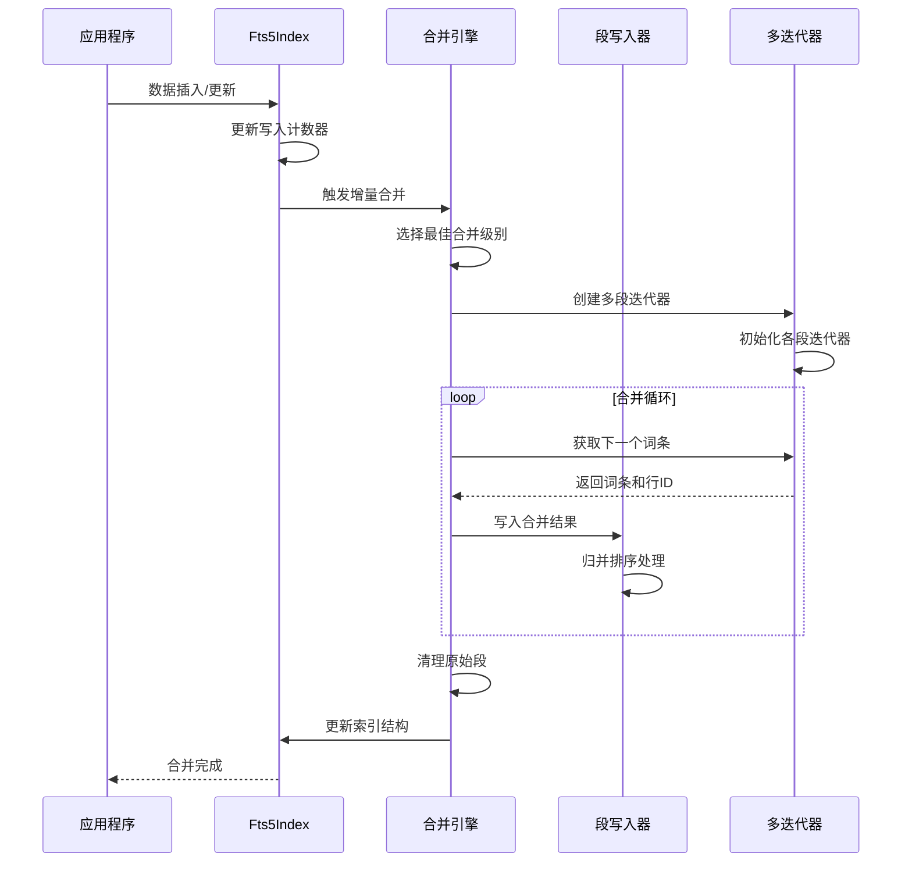
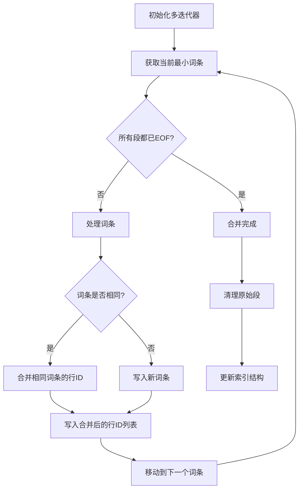
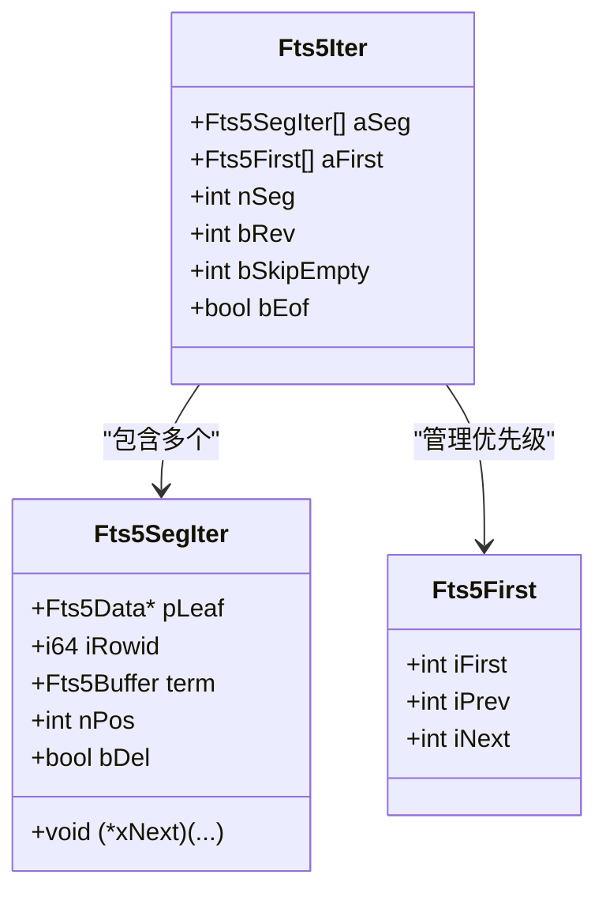
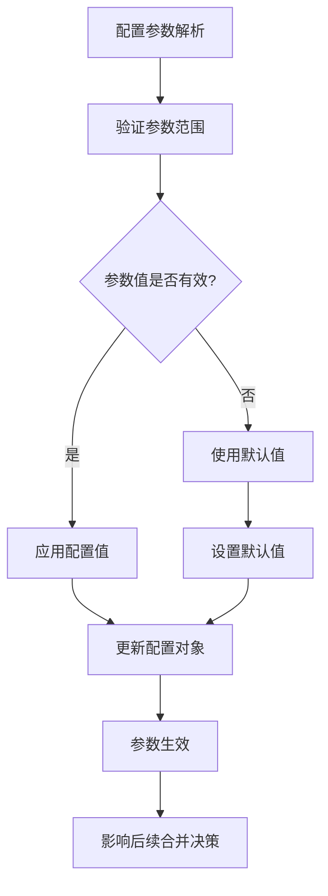
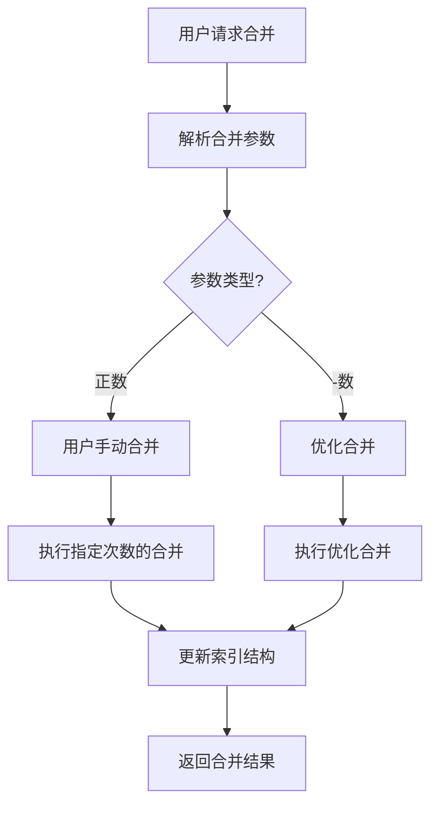

# 后台合并策略

<cite>
**本文档中引用的文件**
- [fts5_index.c](file://ext/fts5/fts5_index.c)
- [fts5_config.c](file://ext/fts5/fts5_config.c)
- [fts5_storage.c](file://ext/fts5/fts5_storage.c)
- [fts5_main.c](file://ext/fts5/fts5_main.c)
- [fts5Int.h](file://ext/fts5/fts5Int.h)
</cite>

## 目录
1. [概述](#概述)
2. [系统架构](#系统架构)
3. [段合并触发机制](#段合并触发机制)
4. [层级化合并算法](#层级化合并算法)
5. [增量合并过程](#增量合并过程)
6. [核心函数分析](#核心函数分析)
7. [配置参数详解](#配置参数详解)
8. [性能影响与优化](#性能影响与优化)
9. [手动控制合并](#手动控制合并)
10. [故障排除指南](#故障排除指南)

## 概述

FTS5（全文搜索引擎版本5）采用分层索引结构来实现高效的全文检索。该系统的核心特性之一是自动化的段合并机制，它通过定期合并较小的段来优化查询性能并减少存储空间占用。

### 核心概念

- **段（Segment）**：FTS5的基本索引单元，包含特定范围内的词条和位置信息
- **层级（Level）**：按段大小组织的层次结构，从Level 0开始
- **合并（Merge）**：将多个小段合并为较大段的过程
- **增量合并（Incremental Merge）**：在后台持续进行的小规模合并操作

## 系统架构

FTS5索引采用多级分层结构，每级包含若干段，形成类似B树的层次化索引结构。



**图表来源**
- [fts5_index.c](file://ext/fts5/fts5_index.c#L406-L429)

### 索引结构组件

FTS5索引结构由以下关键组件构成：



**图表来源**
- [fts5_index.c](file://ext/fts5/fts5_index.c#L404-L429)

**节来源**
- [fts5_index.c](file://ext/fts5/fts5_index.c#L404-L429)

## 段合并触发机制

FTS5采用多种触发机制来决定何时进行段合并，确保索引性能和存储效率的平衡。

### 自动合并触发条件

系统根据以下条件自动触发合并操作：

1. **写入计数器阈值**：当Level 0写入的叶子页面达到配置阈值时
2. **危机合并**：当某级段数量超过危机阈值时
3. **删除合并**：当段中墓碑记录比例超过配置阈值时



**图表来源**
- [fts5_index.c](file://ext/fts5/fts5_index.c#L5000-L5033)
- [fts5_index.c](file://ext/fts5/fts5_index.c#L5031-L5090)

### 合并触发函数

系统提供了多个触发合并的入口点：

| 触发方式 | 函数 | 描述 |
|---------|------|------|
| 自动触发 | `fts5IndexAutomerge()` | 基于写入计数器的自动触发 |
| 危机触发 | `fts5IndexCrisismerge()` | 当段数量超过阈值时触发 |
| 删除触发 | `fts5IndexFindDeleteMerge()` | 基于墓碑比例的触发 |

**节来源**
- [fts5_index.c](file://ext/fts5/fts5_index.c#L5000-L5090)

## 层级化合并算法

FTS5使用分层合并算法，通过逐级合并来优化索引结构。每一级的合并策略都针对该级别的特点进行了优化。

### 合并级别选择

系统优先选择输入段最多的级别进行合并：



**图表来源**
- [fts5_index.c](file://ext/fts5/fts5_index.c#L4944-L4970)

### 合并工作量计算

系统根据配置参数计算每次合并的工作量：

| 参数 | 默认值 | 描述 |
|------|--------|------|
| `nAutomerge` | 4 | 自动合并的最小段数 |
| `nUsermerge` | 4 | 用户手动合并的最小段数 |
| `nCrisisMerge` | 16 | 危机合并的段数阈值 |
| `nDeleteMerge` | 10% | 删除合并的墓碑比例阈值 |

**节来源**
- [fts5_config.c](file://ext/fts5/fts5_config.c#L951-L1000)

## 增量合并过程

增量合并是FTS5的核心特性，它在后台持续进行小规模合并，避免大规模合并对查询性能的影响。

### 合并执行流程



**图表来源**
- [fts5_index.c](file://ext/fts5/fts5_index.c#L4754-L4970)

### 归并排序实现

合并过程中的归并排序确保输出段的有序性：



**图表来源**
- [fts5_index.c](file://ext/fts5/fts5_index.c#L4754-L4970)

**节来源**
- [fts5_index.c](file://ext/fts5/fts5_index.c#L4754-L4970)

## 核心函数分析

### fts5IndexMerge()

这是FTS5段合并的核心函数，负责协调整个合并过程：

**主要功能**：
- 选择最佳合并级别
- 执行实际的合并操作
- 更新索引结构
- 处理合并完成后的提升操作

**工作流程**：
1. 遍历所有级别，寻找最佳合并候选
2. 调用`fts5IndexMergeLevel()`执行具体合并
3. 如果合并完成，调用`fts5StructurePromote()`提升段
4. 返回是否实际进行了合并操作

**节来源**
- [fts5_index.c](file://ext/fts5/fts5_index.c#L4958-L5004)

### fts5IndexMergeLevel()

这个函数执行具体的段合并操作：

**关键步骤**：
1. **初始化**：设置输入输出段参数
2. **创建迭代器**：为每个输入段创建迭代器
3. **归并排序**：使用多迭代器进行归并排序
4. **写入输出**：将合并结果写入新的段
5. **清理**：删除原始段，更新索引结构

**节来源**
- [fts5_index.c](file://ext/fts5/fts5_index.c#L4754-L4970)

### 多迭代器机制

FTS5使用多迭代器来高效地合并多个有序段：



**图表来源**
- [fts5_index.c](file://ext/fts5/fts5_index.c#L3920-L3947)

**节来源**
- [fts5_index.c](file://ext/fts5/fts5_index.c#L3920-L3947)

## 配置参数详解

FTS5提供了丰富的配置参数来控制合并行为：

### 主要配置参数

| 参数名 | 类型 | 默认值 | 描述 |
|--------|------|--------|------|
| `automerge` | 整数 | 4 | 自动合并的最小段数阈值 |
| `usermerge` | 整数 | 4 | 用户手动合并的最小段数 |
| `crisismerge` | 整数 | 16 | 危机合并的段数阈值 |
| `deletemerge` | 整数 | 10% | 删除合并的墓碑比例阈值 |

### 配置参数的作用机制



**图表来源**
- [fts5_config.c](file://ext/fts5/fts5_config.c#L951-L1000)

**节来源**
- [fts5_config.c](file://ext/fts5/fts5_config.c#L951-L1000)

## 性能影响与优化

### 查询性能影响

段合并对查询性能的影响主要体现在以下几个方面：

1. **索引深度减少**：合并后索引层数减少，查询路径变短
2. **段数量减少**：减少了需要扫描的段数量
3. **合并开销**：合并过程中可能暂时影响写入性能

### I/O负载特征

FTS5的合并操作具有以下I/O特征：

- **顺序读取**：从多个输入段顺序读取数据
- **随机写入**：向新段写入合并后的数据
- **临时存储**：合并过程中需要额外的临时存储空间

### 性能优化建议

1. **合理设置合并阈值**：根据应用特点调整`automerge`和`crisismerge`参数
2. **监控合并频率**：观察合并操作对系统性能的影响
3. **平衡写入与查询**：在写入吞吐和查询性能之间找到平衡点

## 手动控制合并

FTS5提供了多种方式来手动控制合并操作：

### PRAGMA命令

```sql
-- 手动触发合并
PRAGMA fts5_merge = 100;

-- 查看合并状态
PRAGMA fts5_status;

-- 优化索引
PRAGMA fts5_optimize;
```

### 编程接口

```c
// C语言接口
int sqlite3Fts5StorageMerge(Fts5Storage *p, int nMerge);
int sqlite3Fts5IndexMerge(Fts5Index *p, int nMerge);
```

### 合并控制流程



**图表来源**
- [fts5_storage.c](file://ext/fts5/fts5_storage.c#L913-L950)
- [fts5_main.c](file://ext/fts5/fts5_main.c#L1751-L1788)

**节来源**
- [fts5_storage.c](file://ext/fts5/fts5_storage.c#L913-L950)
- [fts5_main.c](file://ext/fts5/fts5_main.c#L1751-L1788)

## 故障排除指南

### 常见问题及解决方案

1. **合并操作失败**
   - 检查磁盘空间是否充足
   - 验证数据库权限设置
   - 查看错误日志获取详细信息

2. **合并性能差**
   - 调整合并阈值参数
   - 检查系统资源使用情况
   - 考虑暂停高并发写入操作

3. **索引损坏**
   - 使用`PRAGMA integrity_check`检查完整性
   - 必要时重建索引
   - 检查硬件可靠性

### 调试工具

FTS5提供了多种调试和监控工具：

- `PRAGMA fts5_status`：查看合并状态统计
- `PRAGMA fts5_structure`：显示索引结构详情
- `PRAGMA fts5_integrity_check`：检查索引完整性

### 性能监控指标

| 指标 | 描述 | 正常范围 |
|------|------|----------|
| 合并次数 | 单位时间内的合并操作次数 | 根据写入频率确定 |
| 合并耗时 | 每次合并操作的平均耗时 | < 1秒 |
| 段数量 | 索引中的总段数 | 尽可能少 |
| 索引深度 | 索引的最大层级深度 | < 10 |

通过合理配置和监控这些指标，可以确保FTS5索引的高效运行和最佳性能表现。