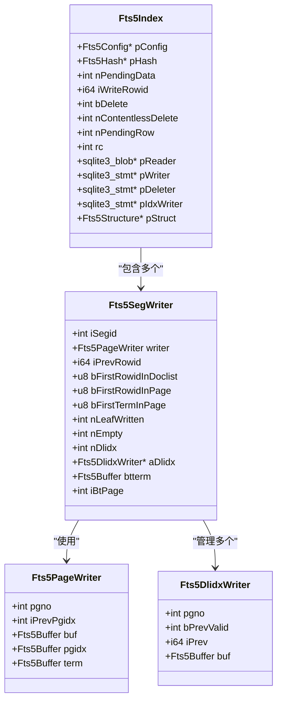
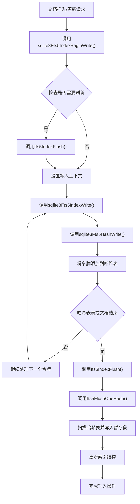
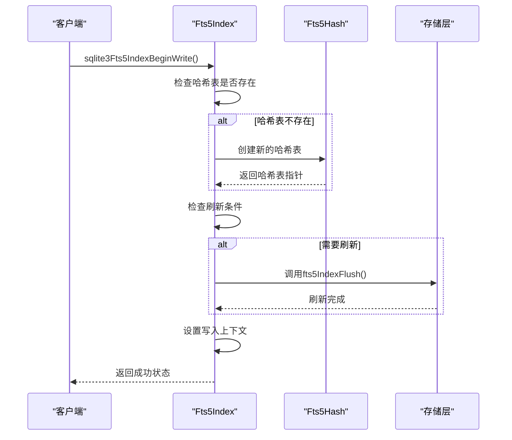
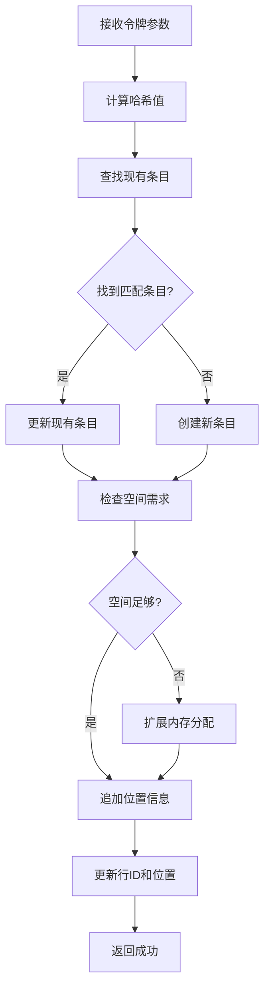
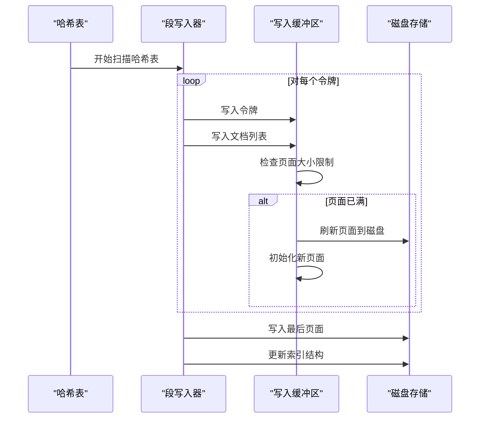
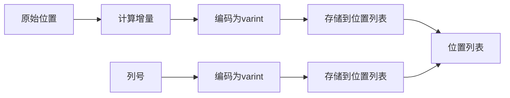
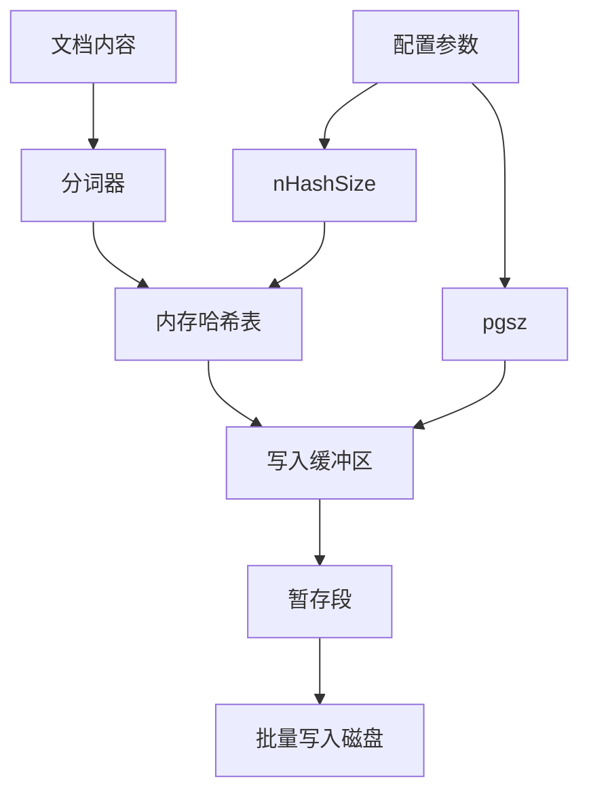
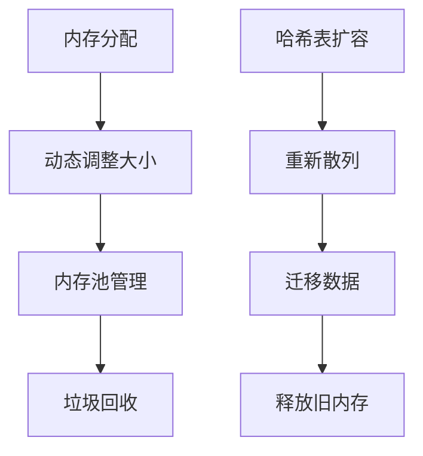
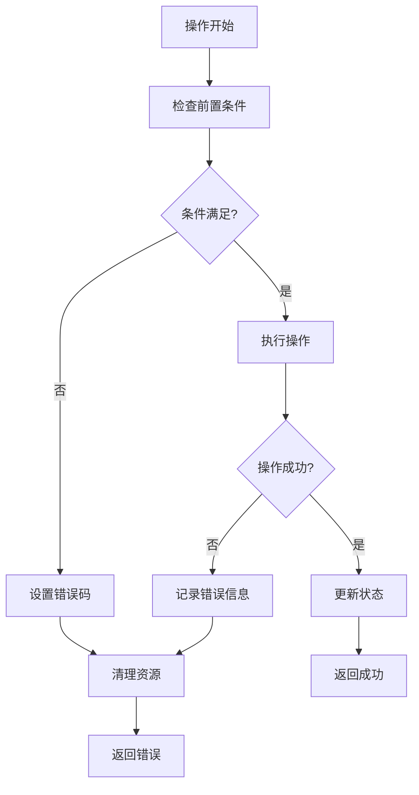

# FTS5索引写入机制详解

<cite>
**本文档引用的文件**
- [fts5_index.c](file://ext/fts5/fts5_index.c)
- [fts5Int.h](file://ext/fts5/fts5Int.h)
- [fts5_hash.c](file://ext/fts5/fts5_hash.c)
- [fts5_buffer.c](file://ext/fts5/fts5_buffer.c)
- [fts5_varint.c](file://ext/fts5/fts5_varint.c)
</cite>

## 目录
1. [概述](#概述)
2. [核心数据结构](#核心数据结构)
3. [索引写入流程架构](#索引写入流程架构)
4. [核心函数分析](#核心函数分析)
5. [暂存段机制](#暂存段机制)
6. [位置列表编码](#位置列表编码)
7. [事务上下文与缓冲机制](#事务上下文与缓冲机制)
8. [性能优化策略](#性能优化策略)
9. [错误处理与并发控制](#错误处理与并发控制)
10. [总结](#总结)

## 概述

FTS5（全文搜索引擎版本5）是SQLite的高级全文搜索扩展，其索引写入机制负责将文档内容分词后存储到数据库中。该机制采用多层缓冲和暂存段技术，实现了高效的增量索引构建和维护。

FTS5的索引写入流程主要包括以下阶段：
- 文本分词和令牌化
- 内存哈希表缓存
- 暂存段构建
- 批量写入磁盘
- 结构记录更新

## 核心数据结构

### Fts5Index结构体

**图表来源**
- [fts5_index.c](file://ext/fts5/fts5_index.c#L431-L456)

### 哈希表结构

FTS5使用内存哈希表来缓存待写入的令牌和文档列表，这种设计提供了以下优势：

- **快速查找**：O(1)时间复杂度的令牌查找
- **去重功能**：自动合并相同令牌的文档列表
- **增量更新**：支持文档的增量修改

**节来源**
- [fts5_hash.c](file://ext/fts5/fts5_hash.c#L244-L389)

## 索引写入流程架构

### 整体流程图

**图表来源**
- [fts5_index.c](file://ext/fts5/fts5_index.c#L6770-L6792)
- [fts5_index.c](file://ext/fts5/fts5_index.c#L6962-L6992)

### 关键节点说明

1. **事务开始阶段**：通过`sqlite3Fts5IndexBeginWrite()`建立写入上下文
2. **令牌写入阶段**：通过`sqlite3Fts5IndexWrite()`将令牌添加到内存哈希表
3. **批量刷新阶段**：当满足条件时触发`fts5IndexFlush()`进行批量写入
4. **暂存段构建**：通过`fts5FlushOneHash()`构建临时段文件

**节来源**
- [fts5_index.c](file://ext/fts5/fts5_index.c#L6770-L6792)
- [fts5_index.c](file://ext/fts5/fts5_index.c#L6962-L6992)

## 核心函数分析

### sqlite3Fts5IndexBeginWrite()

此函数负责初始化写入操作的上下文环境。

**图表来源**
- [fts5_index.c](file://ext/fts5/fts5_index.c#L6770-L6792)

### sqlite3Fts5IndexWrite()

这是核心的令牌写入函数，负责将单个令牌添加到索引中。

主要功能包括：
- 将令牌添加到主索引
- 处理前缀索引（如果配置了前缀索引）
- 更新哈希表中的文档列表

**节来源**
- [fts5_index.c](file://ext/fts5/fts5_index.c#L6962-L6992)

### sqlite3Fts5HashWrite()

此函数实现具体的哈希表写入逻辑，是FTS5索引写入的核心组件。

**图表来源**
- [fts5_hash.c](file://ext/fts5/fts5_hash.c#L244-L389)

**节来源**
- [fts5_hash.c](file://ext/fts5/fts5_hash.c#L244-L389)

## 暂存段机制

### 暂存段概念

暂存段（Pending Segment）是FTS5用于临时存储待写入索引的数据结构。它具有以下特点：

- **临时性**：仅存在于内存和临时文件中
- **增量性**：支持增量写入和更新
- **高效性**：采用压缩格式存储令牌和文档列表

### 暂存段写入流程

**图表来源**
- [fts5_index.c](file://ext/fts5/fts5_index.c#L5584-L5789)

### 页面格式

FTS5的暂存段页面采用紧凑的二进制格式：

| 字段 | 大小 | 描述 |
|------|------|------|
| 页面头部 | 4字节 | 包含两个16位字段 |
| 令牌数据 | 变长 | 压缩存储的令牌 |
| 文档列表 | 变长 | 行ID和位置信息 |
| 页面索引 | 变长 | 页面内偏移量索引 |

**节来源**
- [fts5_index.c](file://ext/fts5/fts5_index.c#L5584-L5789)

## 位置列表编码

### 编码原理

FTS5采用变长整数（varint）编码来压缩位置列表，这种编码方式具有以下优势：

- **空间效率**：小数值占用较少字节
- **顺序访问**：支持高效的顺序遍历
- **增量更新**：便于增量修改

### 位置信息格式

**图表来源**
- [fts5_buffer.c](file://ext/fts5/fts5_buffer.c#L207-L250)

### 编码算法

位置列表的编码遵循以下规则：

1. **列切换标记**：当列号发生变化时，写入0x01标记
2. **列号编码**：使用varint编码新的列号
3. **位置增量**：使用varint编码位置增量（实际位置减去前一个位置再加2）

**节来源**
- [fts5_buffer.c](file://ext/fts5/fts5_buffer.c#L207-L250)

## 事务上下文与缓冲机制

### 写入缓冲策略

FTS5采用多层次的缓冲机制来优化写入性能：

**图表来源**
- [fts5_index.c](file://ext/fts5/fts5_index.c#L6770-L6792)

### 刷新触发条件

FTS5在以下情况下会触发刷新操作：

1. **文档ID变化**：当前文档ID小于上次写入的文档ID
2. **内存使用超限**：哈希表占用内存超过配置阈值
3. **删除操作**：执行内容为空的删除操作
4. **显式同步**：调用`sqlite3Fts5IndexSync()`

### 事务一致性保证

FTS5通过以下机制确保事务一致性：

- **原子性**：整个刷新过程要么全部成功，要么全部失败
- **持久性**：所有写入操作都确保写入磁盘
- **隔离性**：不同文档的写入操作相互隔离

**节来源**
- [fts5_index.c](file://ext/fts5/fts5_index.c#L6770-L6792)
- [fts5_index.c](file://ext/fts5/fts5_index.c#L5794-L5812)

## 性能优化策略

### 批量写入优化

FTS5采用多种策略来提高写入性能：

1. **批量令牌处理**：一次性处理多个令牌，减少系统调用
2. **页面级缓冲**：在页面级别进行缓冲，避免频繁写入
3. **压缩存储**：使用varint编码和前缀压缩减少存储空间

### 内存管理优化

**图表来源**
- [fts5_hash.c](file://ext/fts5/fts5_hash.c#L244-L389)

### 并发控制

虽然FTS5本身不直接提供并发控制，但通过SQLite的事务机制实现了基本的并发安全：

- **读写锁**：利用SQLite的WAL模式实现读写分离
- **事务隔离**：每个写入操作都在独立事务中执行
- **冲突检测**：通过SQLite的锁定机制检测和处理冲突

**节来源**
- [fts5_index.c](file://ext/fts5/fts5_index.c#L5584-L5789)

## 错误处理与并发控制

### 错误处理机制

FTS5实现了完善的错误处理机制：

**图表来源**
- [fts5_index.c](file://ext/fts5/fts5_index.c#L5794-L5812)

### 数据一致性保障

FTS5通过以下措施确保数据一致性：

1. **校验和验证**：对关键数据结构进行校验和检查
2. **回滚机制**：支持部分写入失败时的回滚操作
3. **完整性检查**：定期执行索引完整性验证

### 并发控制策略

虽然FTS5不直接处理并发写入，但通过以下方式间接实现并发安全：

- **事务边界**：每个文档的写入都在独立事务中完成
- **序列化访问**：通过SQLite的锁定机制确保序列化访问
- **错误恢复**：处理并发冲突导致的错误情况

**节来源**
- [fts5_index.c](file://ext/fts5/fts5_index.c#L4171-L4180)
- [fts5_index.c](file://ext/fts5/fts5_index.c#L6810-L6815)

## 总结

FTS5的索引写入机制是一个高度优化的系统，通过以下关键技术实现了高效的全文索引构建：

### 核心优势

1. **高性能写入**：采用多层缓冲和批量写入策略
2. **内存效率**：使用压缩格式和智能内存管理
3. **数据一致性**：通过事务机制和完整性检查确保数据正确性
4. **可扩展性**：支持大规模数据集的增量索引维护

### 技术创新点

- **暂存段机制**：实现了高效的增量索引构建
- **位置列表编码**：采用varint编码实现空间优化
- **前缀压缩**：减少令牌存储空间
- **文档列表索引**：加速大文档列表的访问

### 应用场景

FTS5索引写入机制特别适用于以下场景：
- 大规模文档集合的全文检索
- 频繁更新的索引系统
- 需要高写入性能的应用
- 内存受限的环境

通过深入理解这些机制，开发者可以更好地优化FTS5的使用，充分发挥其性能优势。