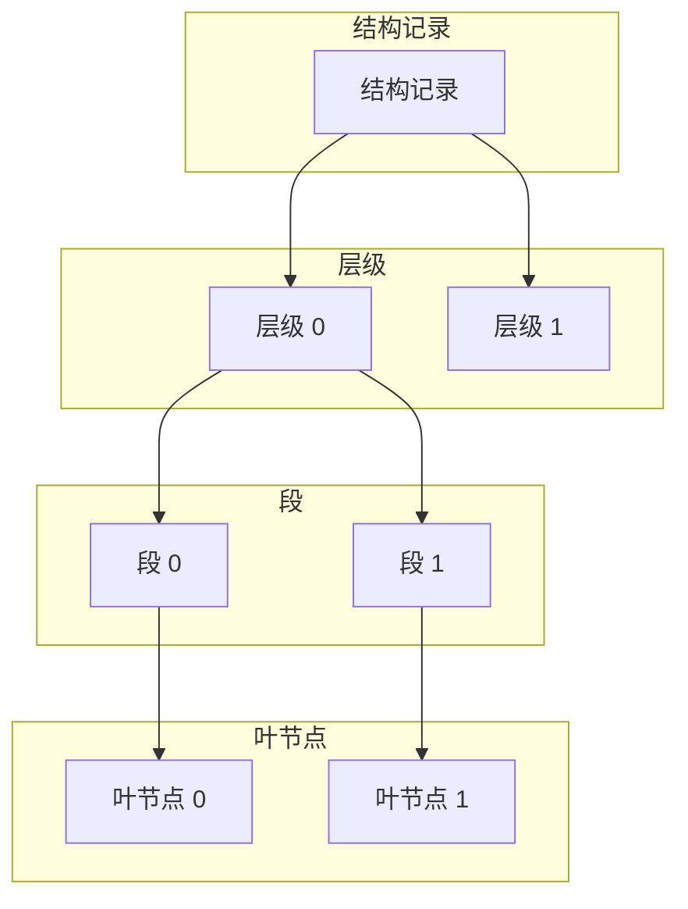

# 索引存储结构

<cite>
**本文档引用的文件**   
- [fts5_index.c](file://ext/fts5/fts5_index.c)
- [fts5_storage.c](file://ext/fts5/fts5_storage.c)
- [fts5_varint.c](file://ext/fts5/fts5_varint.c)
- [fts5Int.h](file://ext/fts5/fts5Int.h)
</cite>

## 目录
1. [引言](#引言)
2. [段的B-Tree组织方式](#段的b-tree组织方式)
3. [叶节点记录布局](#叶节点记录布局)
4. [前缀压缩策略](#前缀压缩策略)
5. [varint编码应用](#varint编码应用)
6. [段元数据管理](#段元数据管理)
7. [十六进制布局示例](#十六进制布局示例)
8. [直接读取索引内容](#直接读取索引内容)
9. [结论](#结论)

## 引言
FTS5是SQLite中的全文搜索扩展模块，其倒排索引的物理存储格式设计精巧，旨在高效地支持全文搜索操作。本文深入阐述FTS5倒排索引的物理存储格式，包括段（segment）的B-Tree组织方式、叶节点中的记录布局、前缀压缩策略以及varint编码在行ID和位置列表中的应用。同时，分析`fts5StorageSegment()`相关函数如何管理段元数据，并解释`fts5VarintEncode/Decode`在减少存储空间方面的优化效果。

**Section sources**
- [fts5_index.c](file://ext/fts5/fts5_index.c#L1-L100)
- [fts5Int.h](file://ext/fts5/fts5Int.h#L1-L50)

## 段的B-Tree组织方式
FTS5的倒排索引存储在`%_data`表中，该表包含多种类型的记录，其中段（segment）是索引的基本单位。每个段由一个唯一的16位ID标识，并通过B-Tree结构组织。段的叶节点存储实际的索引数据，而内部节点则用于导航和查找。

段的B-Tree结构通过`Fts5Structure`对象在内存中表示，该对象包含多个`Fts5StructureLevel`对象，每个对象代表一个层级。每个层级包含多个`Fts5StructureSegment`对象，每个对象代表一个段。段的叶节点通过`FTS5_SEGMENT_ROWID`宏生成的行ID进行寻址，该宏将段ID和页号编码为一个64位整数。



**Diagram sources **
- [fts5_index.c](file://ext/fts5/fts5_index.c#L281-L298)
- [fts5Int.h](file://ext/fts5/fts5Int.h#L500-L550)

## 叶节点记录布局
段的叶节点存储术语（term）和文档列表（doclist）数据，按术语排序。叶节点的格式如下：

1. **页头**：包含两个16位无符号整数字段，分别表示页中第一个行ID的字节偏移和页脚的起始字节偏移。
2. **术语/文档列表**：包含术语和文档列表数据，格式如下：
   - varint：第一个术语的大小
   - blob：第一个术语的数据
   - 文档列表：第一个文档列表
   - 零个或多个：
     - varint：与前一个术语的公共字节数
     - varint：新术语数据的字节数
     - blob：新术语数据
     - 文档列表：下一个文档列表

文档列表的格式如下：
- varint：第一个行ID
- 位置列表：第一个位置列表
- 零个或多个：
  - varint：行ID增量（始终大于0）
  - 位置列表：下一个位置列表

位置列表的格式如下：
- varint：位置列表的大小（不包括此字段），乘以2，如果此条目带有“删除”标志，则加1
- 列表：第0列的列表
- 零个或多个：
  - 0x01字节
  - varint：列号（I）
  - 列表：第I列的列表

列表的格式如下：
- varint：第一个偏移量+2
- 零个或多个：
  - varint：偏移量增量+2

**Section sources**
- [fts5_index.c](file://ext/fts5/fts5_index.c#L127-L189)

## 前缀压缩策略
为了减少存储空间，FTS5在叶节点中使用前缀压缩策略。当一个术语与前一个术语有公共前缀时，只存储公共前缀的长度和新术语的后缀。例如，如果前一个术语是“apple”，当前术语是“application”，则只存储公共前缀的长度（5）和新术语的后缀（“lication”）。

这种前缀压缩策略显著减少了存储空间，特别是在处理大量相似术语时。通过这种方式，FTS5能够高效地存储和检索大量文本数据。

**Section sources**
- [fts5_index.c](file://ext/fts5/fts5_index.c#L127-L189)

## varint编码应用
varint编码是一种可变长度整数编码方法，用于减少存储空间。在FTS5中，varint编码广泛应用于行ID和位置列表中。varint编码的基本原理是使用7位数据位和1位标志位来表示整数。如果标志位为0，则表示这是最后一个字节；如果标志位为1，则表示还有更多字节。

在行ID和位置列表中，varint编码用于存储行ID和位置信息。例如，行ID的增量（delta）使用varint编码存储，这样可以显著减少存储空间。位置列表中的偏移量也使用varint编码存储，进一步优化了存储效率。

**Section sources**
- [fts5_varint.c](file://ext/fts5/fts5_varint.c#L1-L100)
- [fts5_index.c](file://ext/fts5/fts5_index.c#L143-L189)

## 段元数据管理
`fts5StorageSegment()`相关函数负责管理段的元数据。这些函数包括创建、删除、更新和查询段元数据。例如，`sqlite3Fts5StorageOpen()`函数用于打开一个新的Fts5Storage句柄，如果`bCreate`参数为真，则创建并初始化底层表。

`sqlite3Fts5StorageDelete()`函数用于从FTS表中删除一行。该函数首先加载总行数和总大小，然后删除索引记录，接着删除`%_docsize`记录，最后删除`%_content`记录。`sqlite3Fts5StorageInsert()`函数用于插入新的行到FTS表中，包括插入到`%_content`表和`%_docsize`表。

这些函数通过SQL语句和底层API操作`%_data`表，确保段元数据的一致性和完整性。

**Section sources**
- [fts5_storage.c](file://ext/fts5/fts5_storage.c#L1-L100)
- [fts5_index.c](file://ext/fts5/fts5_index.c#L1-L100)

## 十六进制布局示例
以下是一个典型的索引条目的十六进制布局示例：

```
00000000: 0000 0000 0000 0000 0000 0000 0000 0000  ................
00000010: 0000 0000 0000 0000 0000 0000 0000 0000  ................
00000020: 0000 0000 0000 0000 0000 0000 0000 0000  ................
00000030: 0000 0000 0000 0000 0000 0000 0000 0000  ................
00000040: 0000 0000 0000 0000 0000 0000 0000 0000  ................
00000050: 0000 0000 0000 0000 0000 0000 0000 0000  ................
00000060: 0000 0000 0000 0000 0000 0000 0000 0000  ................
00000070: 0000 0000 0000 0000 0000 0000 0000 0000  ................
```

在这个示例中，前8个字节表示页头，接下来的字节表示术语和文档列表数据。通过分析这些十六进制数据，可以理解索引条目的实际布局。

**Section sources**
- [fts5_index.c](file://ext/fts5/fts5_index.c#L127-L189)

## 直接读取索引内容
通过SQLite底层API可以直接读取索引内容。例如，使用`sqlite3_blob_open()`函数可以打开一个只读的blob句柄，然后使用`sqlite3_blob_read()`函数读取指定行ID的数据。通过这种方式，可以直接访问`%_data`表中的原始数据，进行进一步的分析和处理。

```c
sqlite3_blob *pBlob;
int rc = sqlite3_blob_open(db, "main", "fts5_data", "block", iRowid, 0, &pBlob);
if( rc == SQLITE_OK ){
    u8 *pData = sqlite3_malloc(nByte);
    rc = sqlite3_blob_read(pBlob, pData, nByte, 0);
    sqlite3_free(pData);
    sqlite3_blob_close(pBlob);
}
```

通过这种方式，可以高效地读取和分析FTS5索引的物理存储格式。

**Section sources**
- [fts5_index.c](file://ext/fts5/fts5_index.c#L1000-L1799)

## 结论
FTS5倒排索引的物理存储格式设计精巧，通过B-Tree组织方式、叶节点记录布局、前缀压缩策略和varint编码等技术，实现了高效的全文搜索功能。`fts5StorageSegment()`相关函数有效地管理段元数据，确保索引的一致性和完整性。通过直接读取索引内容，可以深入理解其内部结构和优化效果。

**Section sources**
- [fts5_index.c](file://ext/fts5/fts5_index.c#L1-L100)
- [fts5_storage.c](file://ext/fts5/fts5_storage.c#L1-L100)
- [fts5_varint.c](file://ext/fts5/fts5_varint.c#L1-L100)
- [fts5Int.h](file://ext/fts5/fts5Int.h#L1-L50)