# FTS5倒排索引机制深度解析

<cite>
**本文档引用的文件**
- [fts5_index.c](file://ext/fts5/fts5_index.c)
- [fts5Int.h](file://ext/fts5/fts5Int.h)
- [fts5_varint.c](file://ext/fts5/fts5_varint.c)
- [fts5_storage.c](file://ext/fts5/fts5_storage.c)
- [fts5_main.c](file://ext/fts5/fts5_main.c)
- [fts5_vocab.c](file://ext/fts5/fts5_vocab.c)
</cite>

## 目录
1. [概述](#概述)
2. [索引架构设计](#索引架构设计)
3. [段（Segment）组织结构](#段segment组织结构)
4. [层级合并策略](#层级合并策略)
5. [行ID编码与位置列表](#行id编码与位置列表)
6. [索引维护流程](#索引维护流程)
7. [后台合并操作](#后台合并操作)
8. [索引压缩与优化](#索引压缩与优化)
9. [诊断工具与性能监控](#诊断工具与性能监控)
10. [性能优化建议](#性能优化建议)

## 概述

FTS5（全文搜索第5版）是SQLite的高级全文搜索引擎，采用倒排索引技术实现高效的文本检索。其核心设计理念是通过分层的段组织结构、智能的合并策略和紧凑的数据编码方式，在保证查询性能的同时最小化存储空间占用。

### 核心特性

- **分层B树结构**：采用多级段组织，支持大规模数据集的高效管理
- **增量合并**：自动执行后台合并操作，保持索引性能
- **变长整数编码**：使用varint编码减少存储开销
- **文档列表索引**：为大型文档列表提供快速定位机制
- **内容无关删除**：支持高效的删除操作而不影响查询性能

## 索引架构设计

FTS5索引采用分层的B树结构，将索引数据组织成多个层次，每个层次包含若干段（segment）。

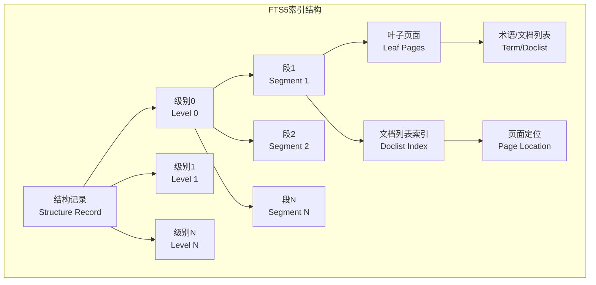

**图表来源**
- [fts5_index.c](file://ext/fts5/fts5_index.c#L45-L100)

### 数据表结构

FTS5使用三个主要的shadow表来存储索引数据：

| 表名 | 用途 | 存储内容 |
|------|------|----------|
| `%_data` | 主要索引数据 | 结构记录、段叶子、文档列表索引、墓碑哈希页 |
| `%_idx` | 索引辅助表 | 段ID、术语、页面号的映射关系 |
| `%_config` | 配置信息 | 版本号、配置参数等 |

**节来源**
- [fts5_index.c](file://ext/fts5/fts5_index.c#L100-L200)

## 段（Segment）组织结构

### 段标识符系统

每个段都有唯一的16位段标识符（segid），用于在索引中唯一标识各个段。

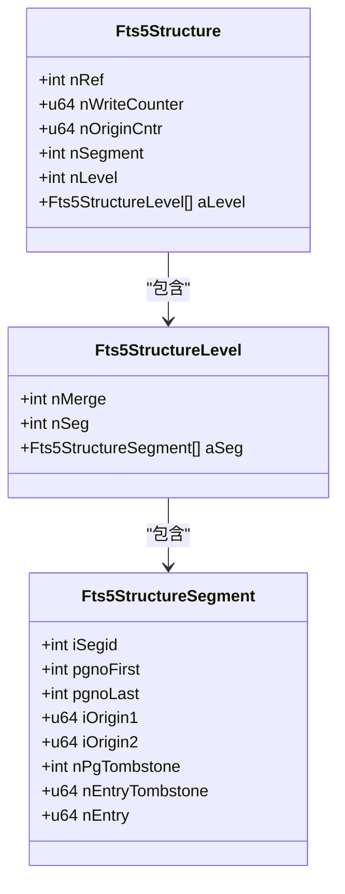

**图表来源**
- [fts5_index.c](file://ext/fts5/fts5_index.c#L350-L400)

### 叶子页面格式

段的叶子页面采用固定大小的页面结构，通常为1000字节：

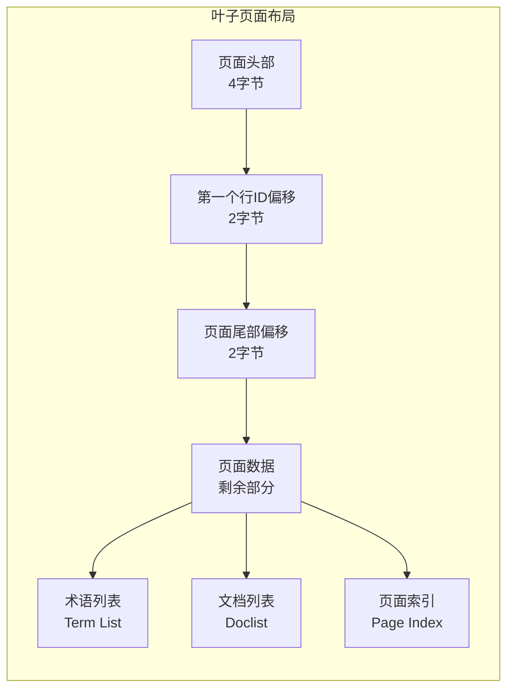

**节来源**
- [fts5_index.c](file://ext/fts5/fts5_index.c#L150-L250)

## 层级合并策略

FTS5采用分层的合并策略，将新插入的数据首先写入低级别的段，然后通过增量合并逐步向上移动。

### 合并触发条件

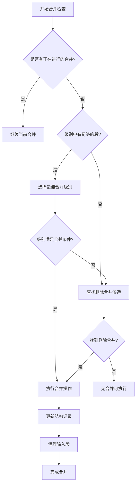

**图表来源**
- [fts5_index.c](file://ext/fts5/fts5_index.c#L4944-L5000)

### 合并工作单元

FTS5定义了两个重要的工作单位常量：

| 常量 | 值 | 用途 |
|------|-----|------|
| `FTS5_WORK_UNIT` | 64 | 单个工作单元的叶子页面数量 |
| `FTS5_OPT_WORK_UNIT` | 1000 | 优化操作的工作单元大小 |

**节来源**
- [fts5_index.c](file://ext/fts5/fts5_index.c#L45-L47)

## 行ID编码与位置列表

### Varint编码机制

FTS5使用变长整数（varint）编码来压缩存储空间，特别是对于频繁出现的小数值。

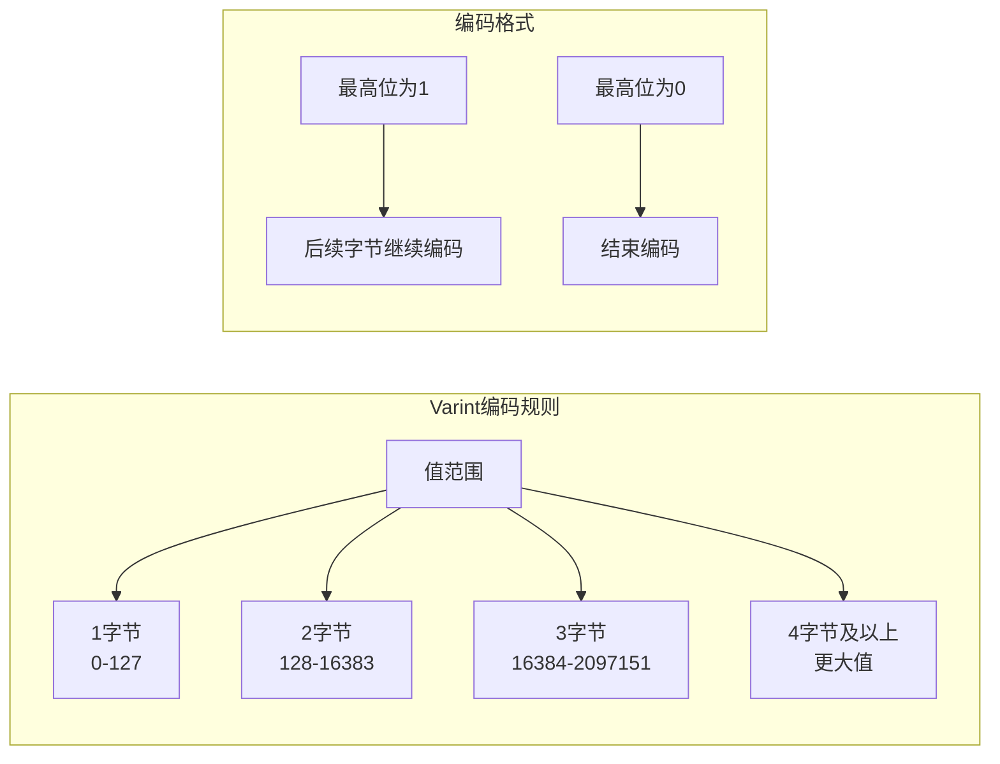

**图表来源**
- [fts5_varint.c](file://ext/fts5/fts5_varint.c#L20-L100)

### 文档列表格式

文档列表（doclist）存储特定术语在所有文档中的出现位置：

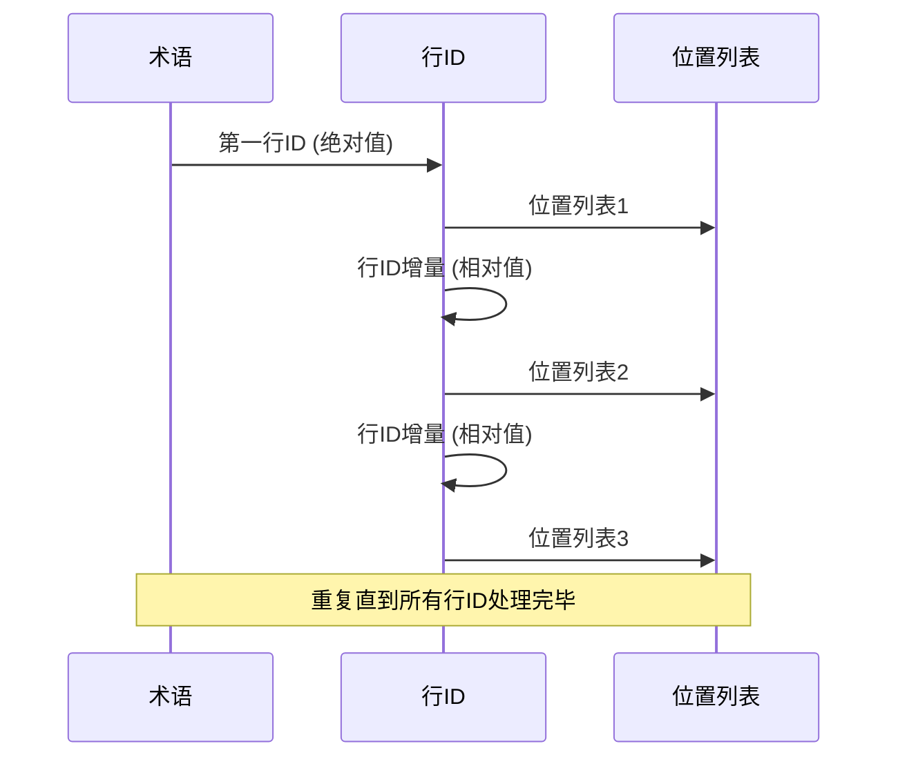

**图表来源**
- [fts5_index.c](file://ext/fts5/fts5_index.c#L200-L300)

### 位置列表存储

位置列表记录术语在文档中的具体位置信息：

| 字段 | 类型 | 描述 |
|------|------|------|
| 大小字段 | varint | 位置列表大小（字节数×2） |
| 列号 | varint | 所在列的编号 |
| 偏移量 | varint | 在该列中的偏移位置 |

**节来源**
- [fts5_index.c](file://ext/fts5/fts5_index.c#L120-L180)

## 索引维护流程

### 文档插入流程

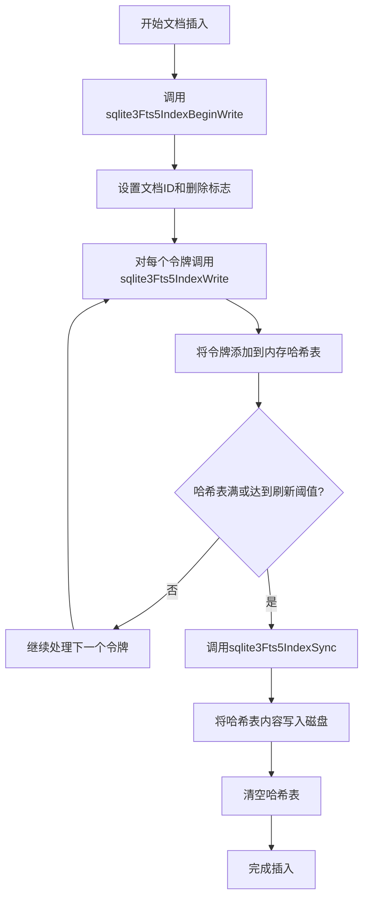

**图表来源**
- [fts5_index.c](file://ext/fts5/fts5_index.c#L6900-L7000)

### 文档更新机制

FTS5支持两种更新模式：

1. **内容相关删除**：删除旧文档内容，插入新内容
2. **内容无关删除**：仅标记删除，不实际删除内容


**图表来源**
- [fts5_storage.c](file://ext/fts5/fts5_storage.c#L600-L700)

**节来源**
- [fts5_index.c](file://ext/fts5/fts5_index.c#L6900-L7100)

## 后台合并操作

### 自动合并机制

FTS5实现了智能的自动合并机制，根据写入计数器动态触发合并操作：

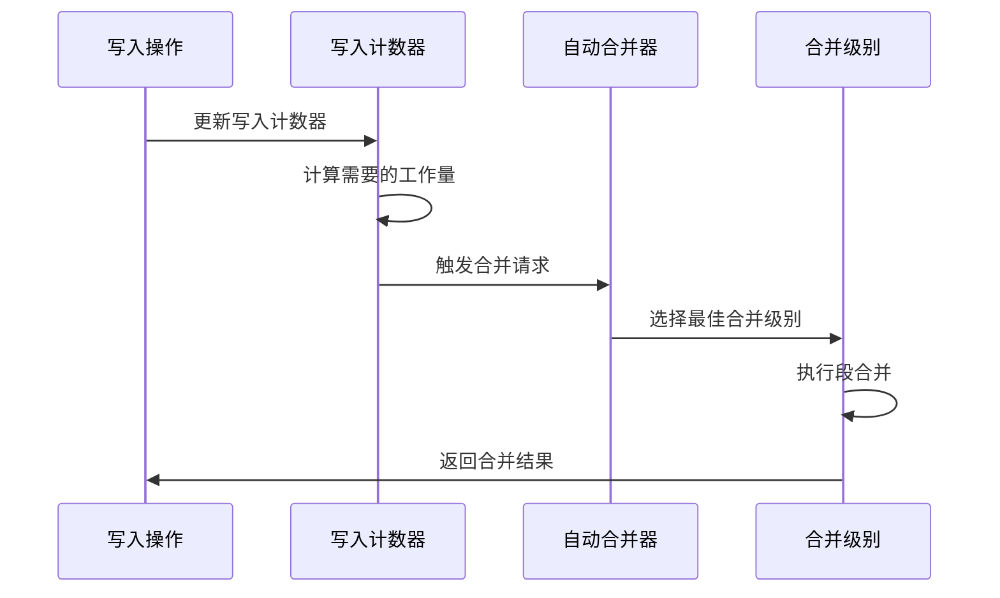

**图表来源**
- [fts5_index.c](file://ext/fts5/fts5_index.c#L5000-L5050)

### 合并参数配置

| 参数 | 默认值 | 描述 |
|------|--------|------|
| `nAutomerge` | 动态计算 | 自动合并的最小段数 |
| `nCrisisMerge` | 2000 | 危机合并的段数阈值 |
| `nDeleteMerge` | 0 | 删除合并的百分比阈值 |

**节来源**
- [fts5_index.c](file://ext/fts5/fts5_index.c#L4950-L5050)

## 索引压缩与优化

### 文档列表索引

为了加速大型文档列表的查找，FTS5引入了文档列表索引（doclist index）：

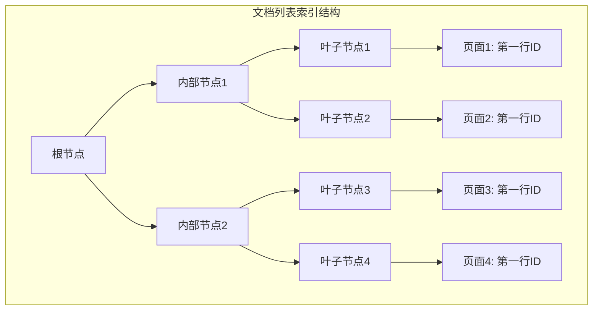

**图表来源**
- [fts5_index.c](file://ext/fts5/fts5_index.c#L300-L400)

### 压缩阈值

FTS5定义了最小文档列表索引大小阈值：

| 常量 | 值 | 用途 |
|------|-----|------|
| `FTS5_MIN_DLIDX_SIZE` | 4 | 添加文档列表索引的最小空页面数 |

**节来源**
- [fts5_index.c](file://ext/fts5/fts5_index.c#L48-L49)

### 优化操作

FTS5提供了多种优化操作来提升索引性能：

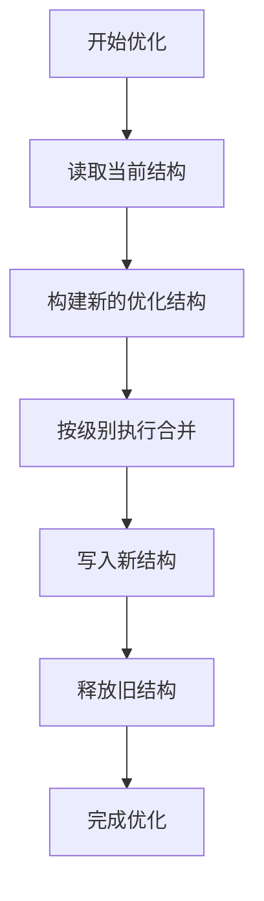

**图表来源**
- [fts5_index.c](file://ext/fts5/fts5_index.c#L5894-L5952)

**节来源**
- [fts5_index.c](file://ext/fts5/fts5_index.c#L5894-L5952)

## 诊断工具与性能监控

### 完整性检查

FTS5提供了强大的完整性检查功能，可以验证索引的一致性和正确性：

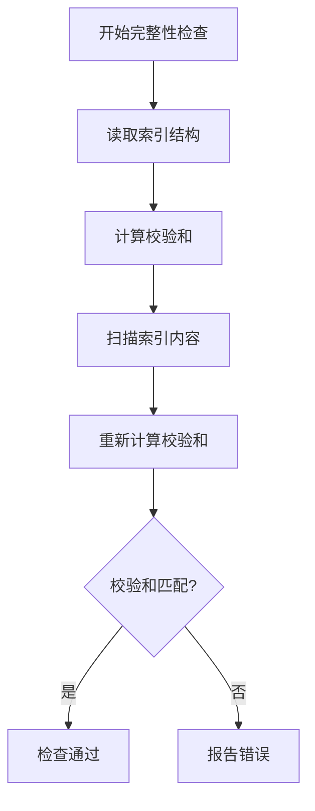

**图表来源**
- [fts5_index.c](file://ext/fts5/fts5_index.c#L8606-L8650)

### PRAGMA命令支持

FTS5支持多个PRAGMA命令用于索引诊断：

| PRAGMA命令 | 功能描述 |
|------------|----------|
| `PRAGMA fts5_index_check` | 检查索引完整性 |
| `PRAGMA fts5_index_size` | 获取索引大小信息 |
| `PRAGMA fts5_index_stats` | 显示索引统计信息 |

**节来源**
- [fts5_index.c](file://ext/fts5/fts5_index.c#L8606-L8650)

### 性能监控指标

FTS5跟踪以下关键性能指标：

| 指标名称 | 描述 | 监控方法 |
|----------|------|----------|
| 写入计数器 | 已写入的叶子页面总数 | `nWriteCounter` |
| 段数量 | 当前索引中的段总数 | `nSegment` |
| 合并次数 | 已执行的合并操作次数 | 结构记录中的计数器 |

**节来源**
- [fts5_index.c](file://ext/fts5/fts5_index.c#L350-L400)

## 性能优化建议

### 写入放大问题

FTS5的写入放大主要来源于以下几个方面：

1. **频繁的合并操作**：大量小段的合并会产生额外的写入开销
2. **文档列表索引**：大型文档列表需要额外的索引页面
3. **墓碑条目**：内容无关删除会增加墓碑条目的存储需求

### 优化策略

#### 1. 调整合并参数

```sql
-- 调整自动合并参数
INSERT INTO t1(t1, rank) VALUES('automerge', 16);

-- 设置危机合并阈值
INSERT INTO t1(t1, rank) VALUES('crisismerge', 1000);
```

#### 2. 使用内容无关删除

对于频繁更新的场景，启用内容无关删除可以显著减少写入放大：

```sql
CREATE VIRTUAL TABLE documents USING fts5(
    content, 
    contentless_delete=1
);
```

#### 3. 优化页面大小

根据数据特征调整页面大小：

```sql
-- 设置页面大小为4KB
INSERT INTO t1(t1, rank) VALUES('pgsz', 4096);
```

#### 4. 定期优化索引

定期执行索引优化操作：

```sql
-- 执行优化
INSERT INTO documents(documents) VALUES('optimize');

-- 手动合并
INSERT INTO documents(documents) VALUES('merge', 10);
```

### 监控建议

1. **定期检查索引大小**：监控索引增长趋势
2. **关注合并频率**：过多的合并可能影响性能
3. **观察写入计数器**：了解索引的活跃程度
4. **检查完整性**：定期运行完整性检查

通过合理配置这些参数和监控指标，可以在查询性能和写入效率之间找到最佳平衡点。