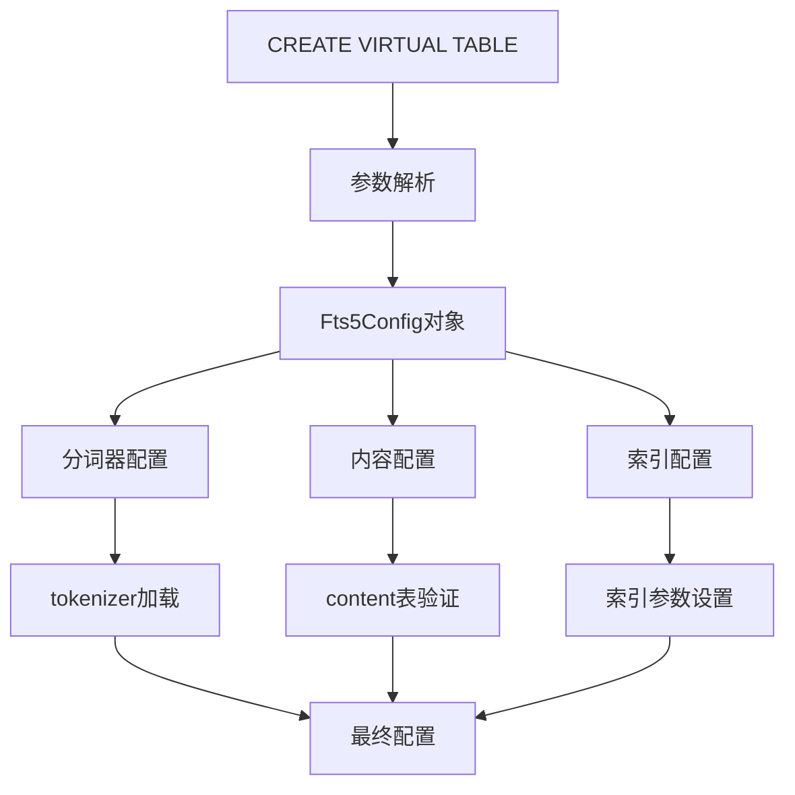
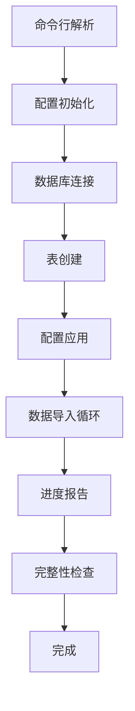

# FTS5虚拟表配置与管理

<cite>
**本文档引用的文件**
- [fts5_config.c](file://ext/fts5/fts5_config.c)
- [fts5_main.c](file://ext/fts5/fts5_main.c)
- [fts5_vocab.c](file://ext/fts5/fts5_vocab.c)
- [fts5_aux.c](file://ext/fts5/fts5_aux.c)
- [loadfts5.tcl](file://ext/fts5/tool/loadfts5.tcl)
- [fts5.h](file://ext/fts5/fts5.h)
</cite>

## 目录
1. [简介](#简介)
2. [创建表时的配置参数](#创建表时的配置参数)
3. [运行时PRAGMA配置命令](#运行时pragma配置命令)
4. [配置解析逻辑](#配置解析逻辑)
5. [辅助函数增强功能](#辅助函数增强功能)
6. [fts5_vocab虚拟表](#fts5_vocab虚拟表)
7. [Tcl自动化管理工具](#tcl自动化管理工具)
8. [性能优化配置](#性能优化配置)
9. [故障排除指南](#故障排除指南)

## 简介

FTS5（全文搜索第5版）是SQLite的高级全文搜索扩展，提供了丰富的配置选项和管理功能。本文档详细介绍了FTS5虚拟表的各种配置选项、管理命令以及相关的辅助功能。

FTS5支持多种配置模式，包括前缀索引、自动合并阈值、哈希大小等关键参数，这些都可以在创建表时指定或通过运行时命令进行调整。

## 创建表时的配置参数

### 基本语法结构

FTS5表的创建语法允许在列定义后添加各种配置选项：

```sql
CREATE VIRTUAL TABLE table_name USING fts5(
    column1, column2, ..., 
    prefix='2,4,8',
    tokenize='porter ascii',
    automerge=4,
    detail=full
);
```

### 核心配置选项

#### 前缀索引配置（prefix）

前缀索引允许对短词建立索引以提高搜索效率：

| 参数 | 描述 | 默认值 | 取值范围 |
|------|------|--------|----------|
| prefix | 指定前缀长度列表 | 无 | 1-999的整数序列 |

```sql
-- 创建包含前缀索引的表
CREATE VIRTUAL TABLE documents USING fts5(
    title, content,
    prefix='2,3,4,5'
);
```

#### 分词器配置（tokenize）

指定使用的分词器和相关参数：

| 分词器类型 | 描述 | 使用场景 |
|------------|------|----------|
| ascii | ASCII字符分词 | 英文文本 |
| porter | Porter词干算法 | 需要词干化处理的文本 |
| unicode61 | Unicode 6.1标准 | 多语言文本 |
| simple | 简单分词器 | 基础文本处理 |

#### 内容配置选项

| 选项 | 描述 | 可选值 |
|------|------|--------|
| content | 外部内容表名 | 表名字符串 |
| contentless_delete | 允许删除操作 | 0/1 |
| contentless_unindexed | 无索引内容表 | 0/1 |
| content_rowid | 自定义rowid列 | 列名 |

#### 细节级别配置（detail）

控制位置信息的存储级别：

| 级别 | 存储内容 | 性能影响 |
|------|----------|----------|
| none | 不存储位置信息 | 最快查询，无法高亮 |
| columns | 仅存储列信息 | 中等性能，可按列查询 |
| full | 存储完整位置信息 | 较慢查询，支持完整高亮 |

#### 其他重要选项

| 选项 | 功能描述 | 默认值 |
|------|----------|--------|
| columnsize | 是否存储列大小 | 1 |
| tokendata | 是否存储原始令牌数据 | 0 |
| locale | 是否启用本地化支持 | 0 |
| rank | 自定义排序函数 | 内置BM25 |

**章节来源**
- [fts5_config.c](file://ext/fts5/fts5_config.c#L547-L583)
- [fts5_config.c](file://ext/fts5/fts5_config.c#L600-L700)

## 运行时PRAGMA配置命令

### 主要PRAGMA命令

FTS5提供了丰富的PRAGMA命令用于运行时配置管理：

#### 索引管理命令

```sql
-- 手动合并段
INSERT INTO fts_table(fts_table) VALUES('merge');

-- 设置自动合并阈值
INSERT INTO fts_table(fts_table, rank) VALUES('automerge', 8);

-- 设置危机合并阈值
INSERT INTO fts_table(fts_table, rank) VALUES('crisismerge', 32);
```

#### 存储管理命令

```sql
-- 重建索引
INSERT INTO fts_table(fts_table) VALUES('rebuild');

-- 删除所有内容
INSERT INTO fts_table(fts_table) VALUES('delete-all');

-- 完整性检查
INSERT INTO fts_table(fts_table, rank) VALUES('integrity-check', 1);
```

#### 缓存和刷新命令

```sql
-- 刷新缓存到磁盘
INSERT INTO fts_table(fts_table) VALUES('flush');

-- 优化索引
INSERT INTO fts_table(fts_table) VALUES('optimize');
```

### 配置参数设置

| PRAGMA命令 | 参数类型 | 描述 |
|------------|----------|------|
| pgsz | 整数 | 页面大小（32-65536字节） |
| hashsize | 整数 | 哈希表大小 |
| automerge | 整数 | 自动合并阈值（2-64） |
| usermerge | 整数 | 用户手动合并阈值（2-16） |
| crisismerge | 整数 | 危机合并阈值（1-最大段数） |
| deletemerge | 整数 | 删除合并阈值（0-100%） |
| secure-delete | 整数 | 安全删除模式（0/1） |

**章节来源**
- [fts5_main.c](file://ext/fts5/fts5_main.c#L1726-L1788)
- [fts5_config.c](file://ext/fts5/fts5_config.c#L951-L1000)

## 配置解析逻辑

### 配置解析架构

FTS5的配置解析采用模块化设计，主要组件包括：



**图表来源**
- [fts5_config.c](file://ext/fts5/fts5_config.c#L547-L583)

### 关键解析函数

#### 主配置解析函数

主要负责解析CREATE VIRTUAL TABLE语句中的所有配置参数：

```c
int sqlite3Fts5ConfigParse(
    Fts5Global *pGlobal,
    sqlite3 *db,
    int nArg,
    const char **azArg,
    Fts5Config **ppOut,
    char **pzErr
);
```

#### 特殊配置解析

处理特定的配置指令：

```c
static int fts5ConfigParseSpecial(
    Fts5Config *pConfig,
    const char *zCmd,
    const char *zArg,
    char **pzErr
);
```

#### 字面量解析

支持复杂的配置参数格式：

```c
static const char *fts5ConfigSkipLiteral(const char *pIn);
```

**章节来源**
- [fts5_config.c](file://ext/fts5/fts5_config.c#L547-L700)

## 辅助函数增强功能

### 内置辅助函数

FTS5提供了多个内置辅助函数来增强搜索功能：

#### bm25函数

默认的评分函数，基于BM25算法：

```sql
-- 使用BM25评分
SELECT *, bm25(fts_table) AS score FROM fts_table WHERE fts_table MATCH 'search term';
```

#### highlight函数

高亮显示匹配的文本片段：

```sql
-- 高亮显示匹配结果
SELECT highlight(fts_table, 0, '<b>', '</b>') FROM fts_table 
WHERE fts_table MATCH 'search term';
```

#### snippet函数

生成匹配文本的摘要片段：

```sql
-- 生成搜索结果摘要
SELECT snippet(fts_table, 0, '<b>', '</b>', '...', 10) FROM fts_table 
WHERE fts_table MATCH 'search term';
```

### 自定义辅助函数

开发者可以注册自定义辅助函数：

```c
typedef void (*fts5_extension_function)(
    const Fts5ExtensionApi *pApi,
    Fts5Context *pFts,
    sqlite3_context *pCtx,
    int nVal,
    sqlite3_value **apVal
);
```

**章节来源**
- [fts5_aux.c](file://ext/fts5/fts5_aux.c#L1-L200)
- [fts5.h](file://ext/fts5/fts5.h#L1-L100)

## fts5_vocab虚拟表

### 虚拟表概述

fts5_vocab是一个特殊的虚拟表，提供对FTS5索引词汇的直接访问：

```sql
-- 创建词汇表虚拟表
CREATE VIRTUAL TABLE vocab_col USING fts5vocab(documents, 'col');
CREATE VIRTUAL TABLE vocab_row USING fts5vocab(documents, 'row');
CREATE VIRTUAL TABLE vocab_inst USING fts5vocab(documents, 'instance');
```

### 支持的词汇表类型

#### col类型

按术语和列统计词汇信息：

| 列名 | 类型 | 描述 |
|------|------|------|
| term | TEXT | 词汇词条 |
| col | INTEGER | 所属列号 |
| doc | INTEGER | 包含该词条的文档数 |
| cnt | INTEGER | 该词条在该列的总出现次数 |

#### row类型

按术语统计全局词汇信息：

| 列名 | 类型 | 描述 |
|------|------|------|
| term | TEXT | 词汇词条 |
| doc | INTEGER | 包含该词条的文档总数 |
| cnt | INTEGER | 该词条的总出现次数 |

#### instance类型

记录每个词条实例的详细位置信息：

| 列名 | 类型 | 描述 |
|------|------|------|
| term | TEXT | 词汇词条 |
| doc | INTEGER | 文档ID |
| col | INTEGER | 列号 |
| offset | INTEGER | 词条偏移量 |

### 查询优化

vocab虚拟表支持高效的词汇查询：

```sql
-- 查找特定前缀的词汇
SELECT * FROM vocab_col WHERE term >= 'pre' AND term < 'prf';

-- 查找特定词汇的详细信息
SELECT * FROM vocab_inst WHERE term = 'important';
```

**章节来源**
- [fts5_vocab.c](file://ext/fts5/fts5_vocab.c#L1-L200)

## Tcl自动化管理工具

### loadfts5.tcl工具

SQLite提供了强大的Tcl脚本工具来自动化FTS5表的管理和维护：

#### 主要功能特性

| 功能 | 命令行参数 | 描述 |
|------|------------|------|
| 数据库选择 | `-fts4`, `-fts5` | 选择FTS版本 |
| 分词器配置 | `-porter` | 使用Porter分词器 |
| 文件删除 | `-delete` | 删除现有数据库 |
| 限制数量 | `-limit N` | 限制导入文档数量 |
| 合并参数 | `-automerge N` | 设置自动合并阈值 |
| 前缀配置 | `-prefix PREFIX` | 设置前缀索引 |
| 提交间隔 | `-trans N` | 设置事务提交间隔 |
| 哈希大小 | `-hashsize N` | 设置哈希表大小 |
| 细节模式 | `-detail MODE` | 设置细节级别 |

#### 使用示例

```bash
# 导入目录内容到FTS5表
./loadfts5.tcl mydatabase.db ./documents/

# 使用Porter分词器导入
./loadfts5.tcl -porter mydatabase.db ./documents/

# 设置合并参数和前缀索引
./loadfts5.tcl -automerge 8 -prefix "2,3,4" mydatabase.db ./documents/
```

#### 高级配置选项

```bash
# 完整配置示例
./loadfts5.tcl \
  -fts5 \
  -porter \
  -automerge 4 \
  -crisismerge 16 \
  -hashsize 1048576 \
  -detail full \
  -trans 1000 \
  -limit 10000 \
  mydatabase.db ./corpus/
```

### 自动化脚本结构

loadfts5.tcl采用了模块化的脚本结构：



**图表来源**
- [loadfts5.tcl](file://ext/fts5/tool/loadfts5.tcl#L1-L173)

**章节来源**
- [loadfts5.tcl](file://ext/fts5/tool/loadfts5.tcl#L1-L173)

## 性能优化配置

### 索引优化参数

#### 合并策略配置

| 参数 | 推荐值 | 性能影响 |
|------|--------|----------|
| automerge | 4-8 | 影响写入性能和查询质量 |
| usermerge | 4-8 | 手动合并的粒度控制 |
| crisismerge | 16-32 | 大段合并的触发阈值 |

#### 内存和存储优化

| 参数 | 默认值 | 优化建议 |
|------|--------|----------|
| pgsz | 4050字节 | 根据硬件调整（32-65536） |
| hashsize | 1048576 | 根据词汇量调整 |
| deletemerge | 10% | 平衡删除效率和空间回收 |

### 查询性能优化

#### 分词器选择

```sql
-- 对英文文本使用ASCII分词器
CREATE VIRTUAL TABLE en_docs USING fts5(
    content,
    tokenize='ascii'
);

-- 对多语言文本使用Unicode分词器
CREATE VIRTUAL TABLE multilang_docs USING fts5(
    content,
    tokenize='unicode61'
);
```

#### 细节级别优化

```sql
-- 高查询性能：使用columns级别
CREATE VIRTUAL TABLE fast_search USING fts5(
    content,
    detail=columns
);

-- 平衡性能和功能：使用full级别
CREATE VIRTUAL TABLE balanced_search USING fts5(
    content,
    detail=full
);
```

### 存储空间优化

#### 前缀索引策略

```sql
-- 小型词汇表：使用较短前缀
CREATE VIRTUAL TABLE small_vocab USING fts5(
    content,
    prefix='2,3'
);

-- 大型词汇表：使用较长前缀
CREATE VIRTUAL TABLE large_vocab USING fts5(
    content,
    prefix='2,3,4,5,6'
);
```

#### 内容配置优化

```sql
-- 如果不需要高亮功能，禁用columnsize
CREATE VIRTUAL TABLE no_highlight USING fts5(
    content,
    columnsize=0
);
```

## 故障排除指南

### 常见配置问题

#### 内存不足错误

**症状**：创建表时出现内存分配失败
**解决方案**：
```sql
-- 减少哈希表大小
INSERT INTO fts_table(fts_table, rank) VALUES('hashsize', 524288);

-- 使用较小的页面大小
INSERT INTO fts_table(fts_table, rank) VALUES('pgsz', 2048);
```

#### 性能问题诊断

**症状**：查询响应时间过长
**诊断步骤**：
```sql
-- 检查索引状态
INSERT INTO fts_table(fts_table) VALUES('integrity-check');

-- 分析词汇分布
SELECT term, doc, cnt FROM vocab_row ORDER BY cnt DESC LIMIT 10;
```

#### 合并策略调优

```sql
-- 监控段数量
SELECT * FROM fts_table_data WHERE name = 'stat';

-- 调整合并参数
INSERT INTO fts_table(fts_table, rank) VALUES('automerge', 2);
INSERT INTO fts_table(fts_table, rank) VALUES('crisismerge', 8);
```

### 配置验证

#### 配置一致性检查

```sql
-- 验证当前配置
SELECT * FROM fts_table_config;

-- 检查配置版本兼容性
INSERT INTO fts_table(fts_table) VALUES('integrity-check');
```

#### 性能基准测试

```sql
-- 测试不同配置的性能
.timer on
SELECT COUNT(*) FROM fts_table WHERE fts_table MATCH 'search term';
```

### 错误恢复

#### 配置重置

```sql
-- 重置为默认配置
INSERT INTO fts_table(fts_table) VALUES('rebuild');

-- 清理损坏的配置
DELETE FROM fts_table_config;
```

#### 数据恢复

```sql
-- 检查数据完整性
INSERT INTO fts_table(fts_table) VALUES('integrity-check', 1);

-- 重新构建索引
INSERT INTO fts_table(fts_table) VALUES('rebuild');
```

**章节来源**
- [fts5_main.c](file://ext/fts5/fts5_main.c#L1751-L1788)
- [fts5_config.c](file://ext/fts5/fts5_config.c#L1002-L1055)

## 结论

FTS5虚拟表提供了强大而灵活的配置系统，通过合理的参数配置和管理，可以显著提升全文搜索的性能和功能。本文档涵盖了从基础配置到高级优化的各个方面，为开发者提供了全面的FTS5配置和管理指南。

关键要点：
- 合理配置前缀索引可以显著提升小词的搜索性能
- 根据应用场景选择合适的细节级别
- 定期监控和调整合并参数以保持最佳性能
- 使用Tcl工具可以简化大规模数据的导入和管理
- fts5_vocab虚拟表提供了强大的词汇分析功能

通过遵循本文档的指导原则和最佳实践，开发者可以充分发挥FTS5的强大功能，构建高性能的全文搜索应用。