# Java JNI绑定

<cite>
**本文档引用的文件**
- [sqlite3-jni.c](file://ext/jni/src/c/sqlite3-jni.c)
- [sqlite3-jni.h](file://ext/jni/src/c/sqlite3-jni.h)
- [CApi.java](file://ext/jni/src/org/sqlite/jni/capi/CApi.java)
- [sqlite3.java](file://ext/jni/src/org/sqlite/jni/capi/sqlite3.java)
- [sqlite3_stmt.java](file://ext/jni/src/org/sqlite/jni/capi/sqlite3_stmt.java)
- [NativePointerHolder.java](file://ext/jni/src/org/sqlite/jni/capi/NativePointerHolder.java)
- [GNUmakefile](file://ext/jni/GNUmakefile)
- [README.md](file://ext/jni/README.md)
- [Tester1.java](file://ext/jni/src/org/sqlite/jni/capi/Tester1.java)
</cite>

## 目录
1. [简介](#简介)
2. [项目结构](#项目结构)
3. [核心组件](#核心组件)
4. [架构概览](#架构概览)
5. [详细组件分析](#详细组件分析)
6. [JNI桥接实现](#jni桥接实现)
7. [Java对象映射机制](#java对象映射机制)
8. [异常处理和内存管理](#异常处理和内存管理)
9. [构建过程](#构建过程)
10. [平台兼容性和Android支持](#平台兼容性和android支持)
11. [性能特征和线程安全](#性能特征和线程安全)
12. [使用示例](#使用示例)
13. [故障排除指南](#故障排除指南)
14. [结论](#结论)

## 简介

SQLite的Java JNI绑定提供了一个完整的JNI（Java Native Interface）实现，允许Java应用程序直接访问SQLite C API的功能。这个绑定系统旨在提供与C API的1对1映射，同时保持Java语言的惯用性和安全性。

该绑定系统具有以下特点：
- 与SQLite C API的1对1映射
- 支持Java 8及以上版本
- 跨平台兼容性
- 完整的异常处理机制
- 智能内存管理
- 多线程安全支持

## 项目结构

SQLite JNI绑定的项目结构清晰地组织了C层和Java层的代码：

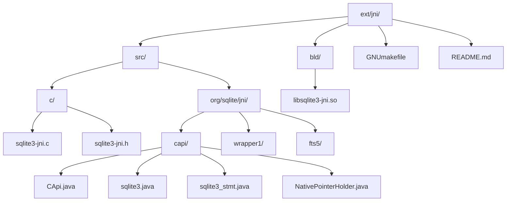

**图表来源**
- [GNUmakefile](file://ext/jni/GNUmakefile#L1-L50)
- [sqlite3-jni.c](file://ext/jni/src/c/sqlite3-jni.c#L1-L50)

**章节来源**
- [README.md](file://ext/jni/README.md#L1-L50)
- [GNUmakefile](file://ext/jni/GNUmakefile#L1-L100)

## 核心组件

### C层实现 (sqlite3-jni.c)

C层是JNI绑定的核心，负责：
- JNI函数的实现
- Java对象与C指针的映射
- 异常处理和错误传播
- 内存管理和资源清理

### Java层API (CApi.java)

Java层提供了完整的SQLite C API包装器：
- 静态方法调用
- 类型安全的参数传递
- 自动资源管理
- 错误码处理

### 对象映射系统

通过NativePointerHolder类实现Java对象与C指针的映射：
- 类型安全的指针持有
- 自动的生命周期管理
- 防止内存泄漏

**章节来源**
- [sqlite3-jni.c](file://ext/jni/src/c/sqlite3-jni.c#L1-L100)
- [CApi.java](file://ext/jni/src/org/sqlite/jni/capi/CApi.java#L1-L100)
- [NativePointerHolder.java](file://ext/jni/src/org/sqlite/jni/capi/NativePointerHolder.java#L1-L47)

## 架构概览

SQLite JNI绑定采用分层架构设计，确保了良好的抽象和可维护性：

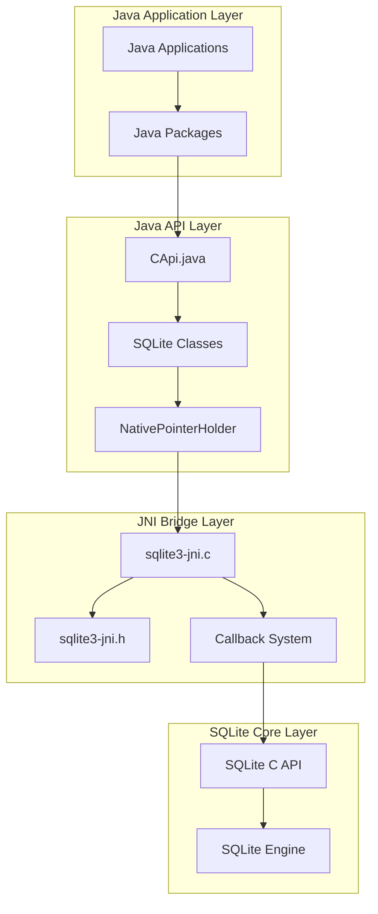

**图表来源**
- [sqlite3-jni.c](file://ext/jni/src/c/sqlite3-jni.c#L1-L100)
- [CApi.java](file://ext/jni/src/org/sqlite/jni/capi/CApi.java#L1-L100)

## 详细组件分析

### JNI函数声明宏系统

SQLite JNI绑定使用了一套复杂的宏系统来简化JNI函数的声明和实现：

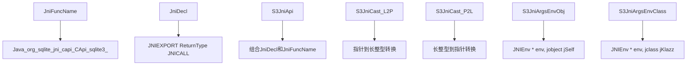

**图表来源**
- [sqlite3-jni.c](file://ext/jni/src/c/sqlite3-jni.c#L120-L180)

### 全局状态管理系统

系统维护一个全局状态结构体来管理各种缓存和资源：

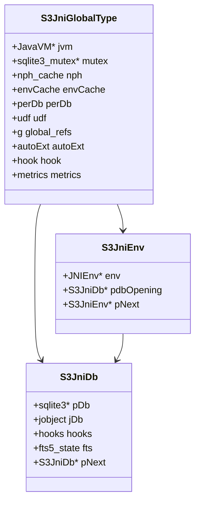

**图表来源**
- [sqlite3-jni.c](file://ext/jni/src/c/sqlite3-jni.c#L600-L700)

**章节来源**
- [sqlite3-jni.c](file://ext/jni/src/c/sqlite3-jni.c#L600-L800)

## JNI桥接实现

### 函数签名生成

JNI绑定使用自动生成的头文件来确保Java和C之间的正确映射：

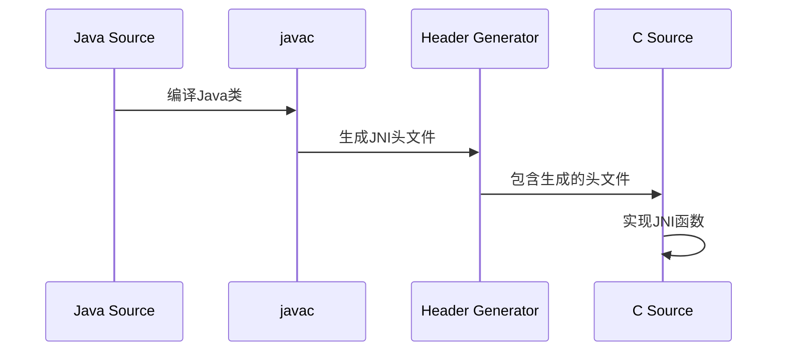

**图表来源**
- [GNUmakefile](file://ext/jni/GNUmakefile#L200-L250)

### 回调代理系统

系统实现了复杂的回调代理机制，允许Java回调函数被传递给C API：

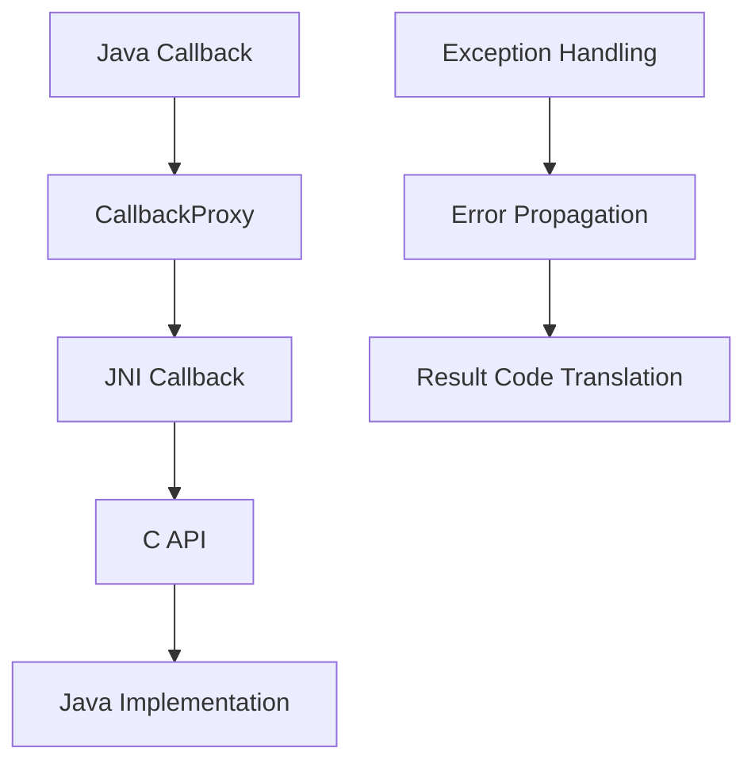

**图表来源**
- [sqlite3-jni.c](file://ext/jni/src/c/sqlite3-jni.c#L1000-L1200)

**章节来源**
- [sqlite3-jni.c](file://ext/jni/src/c/sqlite3-jni.c#L1000-L1400)

## Java对象映射机制

### NativePointerHolder系统

NativePointerHolder是整个映射系统的核心，它提供了类型安全的指针持有机制：

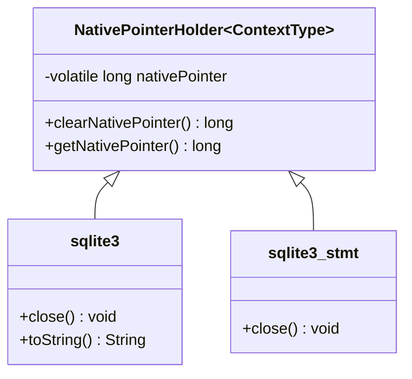

**图表来源**
- [NativePointerHolder.java](file://ext/jni/src/org/sqlite/jni/capi/NativePointerHolder.java#L1-L47)
- [sqlite3.java](file://ext/jni/src/org/sqlite/jni/capi/sqlite3.java#L1-L44)
- [sqlite3_stmt.java](file://ext/jni/src/org/sqlite/jni/capi/sqlite3_stmt.java#L1-L31)

### 指针映射流程

指针映射遵循严格的生命周期管理规则：

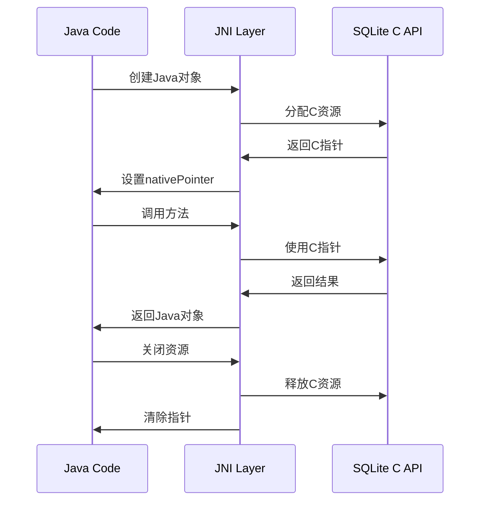

**图表来源**
- [sqlite3-jni.c](file://ext/jni/src/c/sqlite3-jni.c#L1500-L1600)

**章节来源**
- [NativePointerHolder.java](file://ext/jni/src/org/sqlite/jni/capi/NativePointerHolder.java#L1-L47)
- [sqlite3-jni.c](file://ext/jni/src/c/sqlite3-jni.c#L1500-L1600)

## 异常处理和内存管理

### 异常处理机制

JNI绑定实现了多层次的异常处理系统：

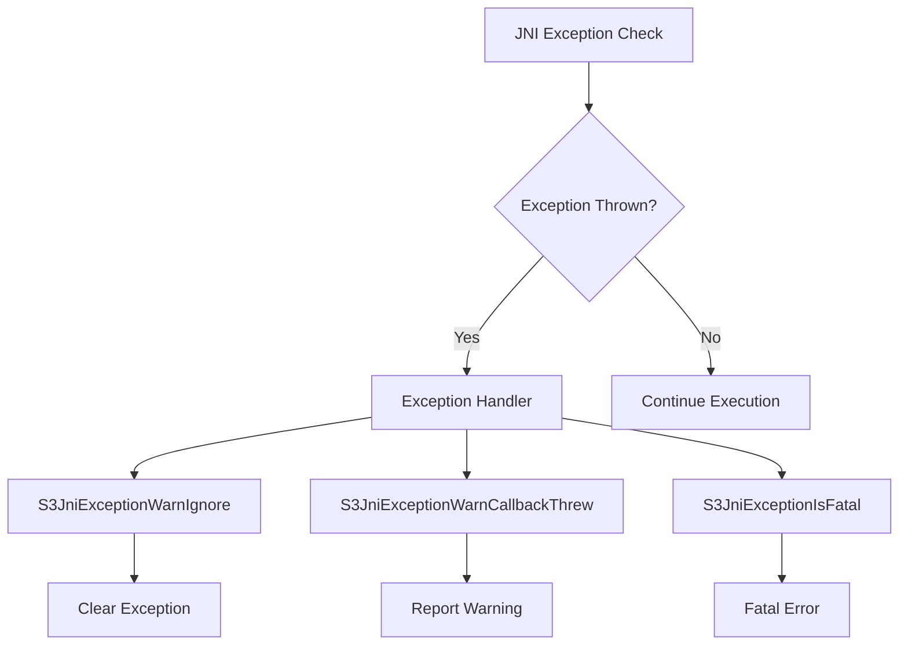

**图表来源**
- [sqlite3-jni.c](file://ext/jni/src/c/sqlite3-jni.c#L200-L250)

### 内存管理策略

系统采用了多种内存管理策略来确保资源的正确释放：

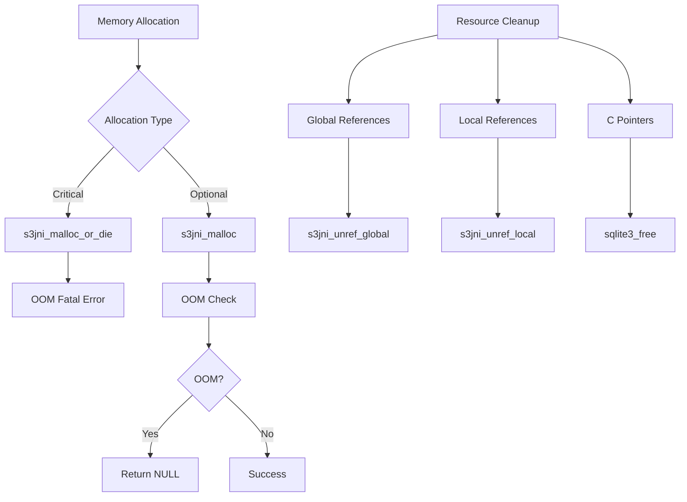

**图表来源**
- [sqlite3-jni.c](file://ext/jni/src/c/sqlite3-jni.c#L250-L350)

### 内存泄漏防护

系统实现了多种机制来防止内存泄漏：

1. **自动资源管理**：实现了AutoCloseable接口
2. **引用计数**：跟踪全局引用的生命周期
3. **延迟清理**：在适当的时候清理资源
4. **异常安全**：确保异常情况下也能正确清理

**章节来源**
- [sqlite3-jni.c](file://ext/jni/src/c/sqlite3-jni.c#L200-L400)

## 构建过程

### 构建系统概述

SQLite JNI绑定使用GNU Make作为主要的构建工具：

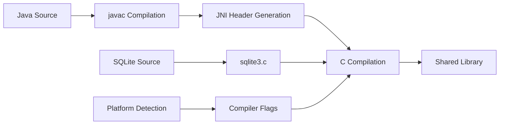

**图表来源**
- [GNUmakefile](file://ext/jni/GNUmakefile#L150-L250)

### 编译选项配置

构建系统支持多种编译选项来适应不同的使用场景：

| 选项 | 默认值 | 描述 |
|------|--------|------|
| `opt.threadsafe` | 1 | 启用线程安全模式 |
| `opt.fatal-oom` | 1 | 内存不足时致命错误 |
| `opt.debug` | 1 | 调试模式 |
| `opt.metrics` | 1 | 性能指标收集 |
| `opt.extras` | 1 | 启用额外功能 |

### 平台特定配置

构建系统能够检测和适配不同的平台：

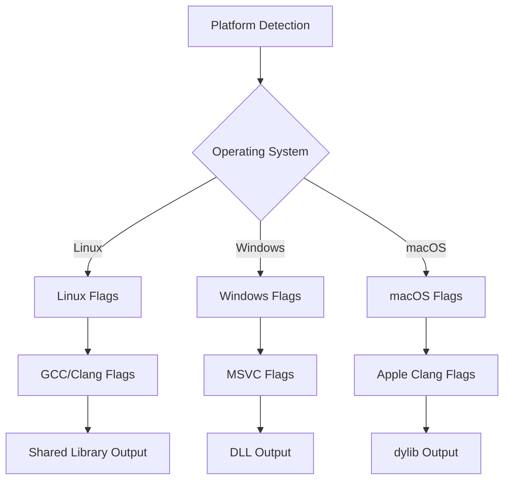

**图表来源**
- [GNUmakefile](file://ext/jni/GNUmakefile#L300-L400)

**章节来源**
- [GNUmakefile](file://ext/jni/GNUmakefile#L1-L506)

## 平台兼容性和Android支持

### 跨平台兼容性

SQLite JNI绑定设计为跨平台兼容，支持以下平台：

- **Linux**：通过GCC和Clang编译
- **Windows**：通过MSVC编译
- **macOS**：通过Apple Clang编译
- **嵌入式系统**：通过交叉编译工具链

### Android环境特殊考虑

在Android环境中使用SQLite JNI绑定需要特别注意：

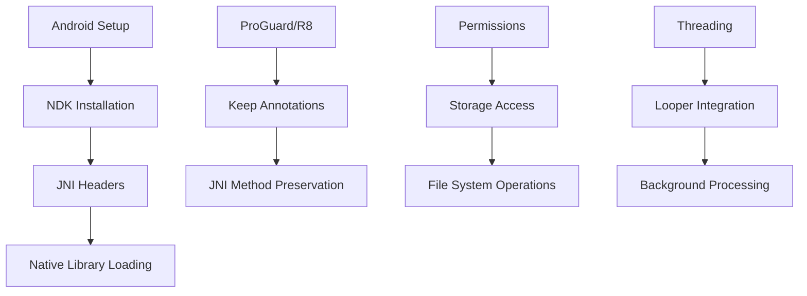

### 平台特定优化

不同平台可能需要特定的优化：

1. **内存管理**：不同平台的内存分配器行为
2. **并发控制**：平台特定的同步原语
3. **文件系统**：路径分隔符和权限模型
4. **字符编码**：UTF-8 vs UTF-16差异处理

**章节来源**
- [README.md](file://ext/jni/README.md#L50-L150)

## 性能特征和线程安全

### 性能特征分析

SQLite JNI绑定在性能方面表现出色：

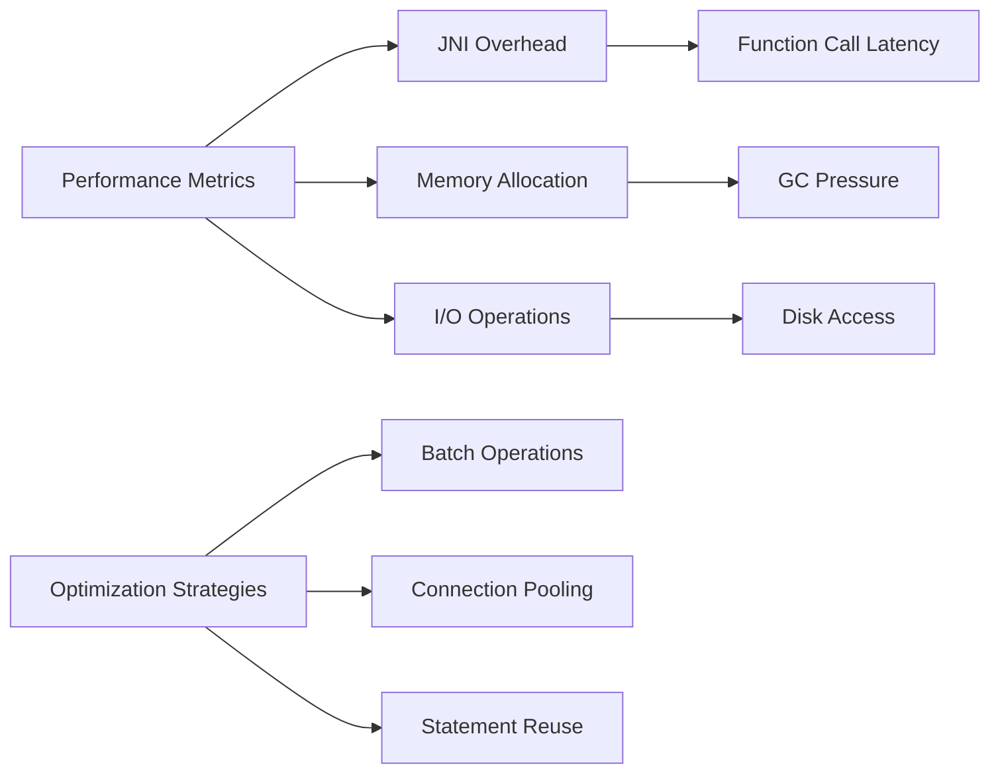

### 线程安全模型

系统支持多种线程安全级别：

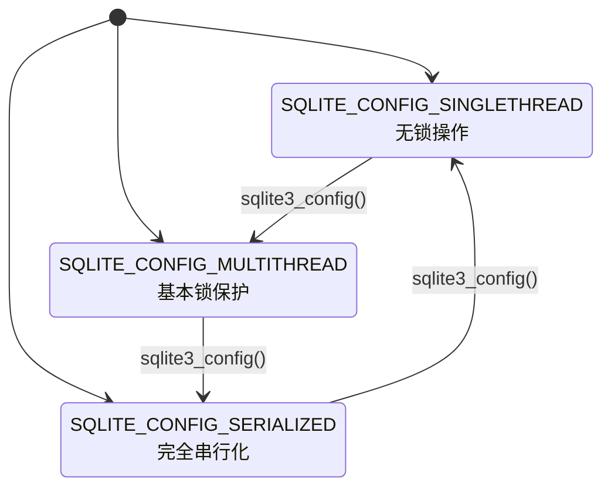

**图表来源**
- [sqlite3-jni.c](file://ext/jni/src/c/sqlite3-jni.c#L630-L680)

### 并发控制机制

系统实现了多层并发控制：

1. **全局互斥锁**：保护全局状态
2. **环境缓存锁**：保护线程本地数据
3. **数据库锁**：保护数据库连接
4. **回调锁**：保护回调函数执行

### 性能监控

系统提供了内置的性能监控功能：

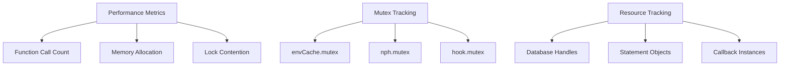

**图表来源**
- [sqlite3-jni.c](file://ext/jni/src/c/sqlite3-jni.c#L700-L800)

**章节来源**
- [sqlite3-jni.c](file://ext/jni/src/c/sqlite3-jni.c#L630-L800)

## 使用示例

### 基本数据库操作

以下展示了如何使用SQLite JNI绑定进行基本的数据库操作：

```java
// 数据库连接示例
final sqlite3 db = sqlite3_open(":memory:");
try {
    // 执行SQL语句
    final int rc = sqlite3_errcode(db);
    if (0 != rc) {
        System.out.println("Error opening db: " + sqlite3_errmsg(db));
        // 处理错误
    }
    // 使用数据库...
} finally {
    // 必须关闭数据库
    sqlite3_close_v2(db);
}
```

### SQL执行和结果处理

```java
// 准备和执行SQL语句
final sqlite3_stmt stmt = sqlite3_prepare_v2(db, "SELECT * FROM users WHERE id = ?", 
    outStmt, oTail);
try {
    // 绑定参数
    sqlite3_bind_int(stmt, 1, userId);
    
    // 执行查询
    while (SQLITE_ROW == sqlite3_step(stmt)) {
        // 处理结果行
        final String name = sqlite3_column_text(stmt, 0);
        final int age = sqlite3_column_int(stmt, 1);
        // 处理数据...
    }
} finally {
    // 清理资源
    sqlite3_finalize(stmt);
}
```

### 异常处理示例

```java
try {
    // 可能抛出异常的操作
    final int result = sqlite3_exec(db, sql, null, null, errMsg);
    if (result != SQLITE_OK) {
        throw new RuntimeException("SQL execution failed: " + 
            sqlite3_errmsg(db));
    }
} catch (RuntimeException e) {
    // 处理异常
    System.err.println("Operation failed: " + e.getMessage());
    // 清理资源...
} finally {
    // 确保资源被清理
}
```

**章节来源**
- [Tester1.java](file://ext/jni/src/org/sqlite/jni/capi/Tester1.java#L100-L200)

## 故障排除指南

### 常见问题和解决方案

#### 1. 库加载失败

**症状**：`java.lang.UnsatisfiedLinkError`

**原因**：无法找到或加载本地库

**解决方案**：
- 确保设置了正确的`java.library.path`
- 检查目标平台的库文件是否存在
- 验证库文件的权限设置

#### 2. 内存泄漏

**症状**：应用程序内存使用持续增长

**原因**：未正确关闭数据库或语句对象

**解决方案**：
```java
// 正确的做法
try (sqlite3 db = sqlite3_open(filename)) {
    // 使用数据库
} // 自动关闭

// 或者手动关闭
sqlite3 db = sqlite3_open(filename);
try {
    // 使用数据库
} finally {
    sqlite3_close(db);
}
```

#### 3. 线程安全问题

**症状**：多线程环境下出现数据竞争或死锁

**原因**：不正确的线程使用模式

**解决方案**：
- 在每个线程中独立使用数据库连接
- 避免跨线程传递数据库对象
- 使用适当的同步机制

#### 4. 字符编码问题

**症状**：字符串显示乱码或截断

**原因**：UTF-8和UTF-16编码转换问题

**解决方案**：
- 使用标准的UTF-8编码处理
- 避免手动添加NUL终止符
- 利用Java的字符集转换功能

### 调试技巧

#### 启用JNI检查

```bash
java -Xcheck:jni -Djava.library.path=build ...
```

#### 启用调试输出

```java
// 设置调试标志
System.setProperty("sqlite.jni.debug", "true");
```

#### 性能分析

```java
// 启用性能监控
System.setProperty("sqlite.jni.metrics", "true");
```

**章节来源**
- [Tester1.java](file://ext/jni/src/org/sqlite/jni/capi/Tester1.java#L1950-L2000)

## 结论

SQLite的Java JNI绑定提供了一个强大而灵活的接口，使Java开发者能够充分利用SQLite数据库的强大功能。该绑定系统的设计充分考虑了跨平台兼容性、性能优化和开发便利性。

### 主要优势

1. **完整的API覆盖**：几乎涵盖了所有SQLite C API的功能
2. **类型安全**：强类型的Java接口减少了运行时错误
3. **资源管理**：自动化的资源清理机制
4. **性能优化**：高效的JNI调用和内存管理
5. **跨平台支持**：统一的接口在多个平台上工作

### 最佳实践建议

1. **资源管理**：始终使用try-with-resources模式
2. **异常处理**：妥善处理所有可能的异常情况
3. **线程安全**：遵循正确的多线程使用模式
4. **性能优化**：合理使用批处理和连接池
5. **调试支持**：启用适当的调试和监控功能

### 未来发展方向

随着SQLite和Java技术的发展，JNI绑定将继续演进以支持新的特性和优化。开发者应该关注官方更新，并及时升级到最新版本以获得最佳的性能和功能支持。