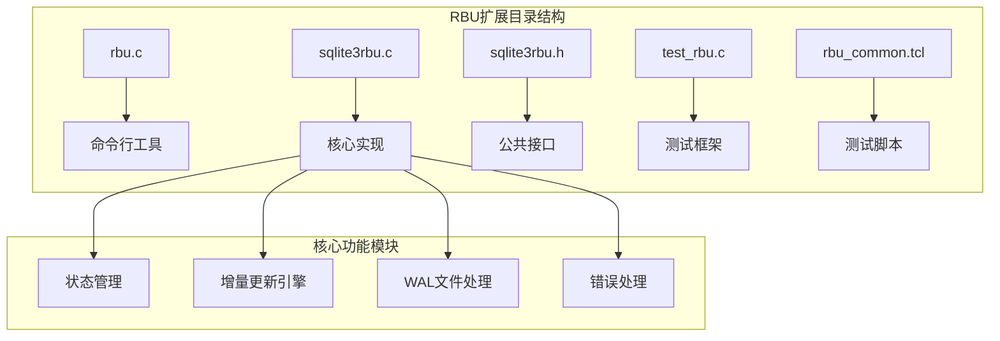
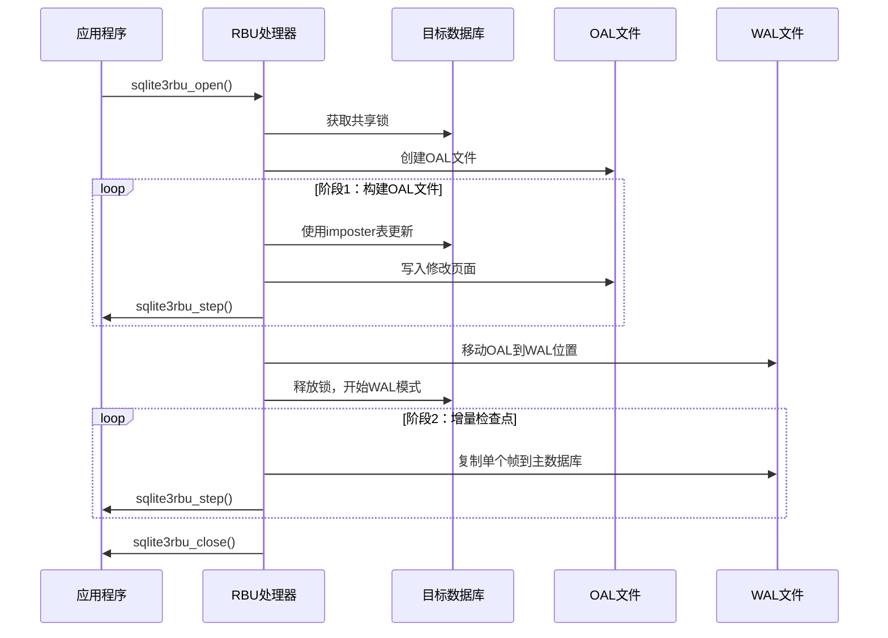
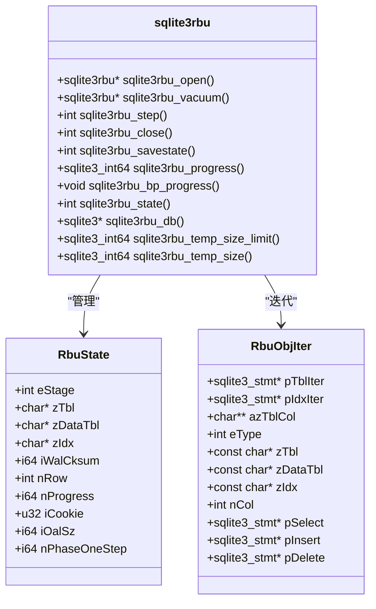
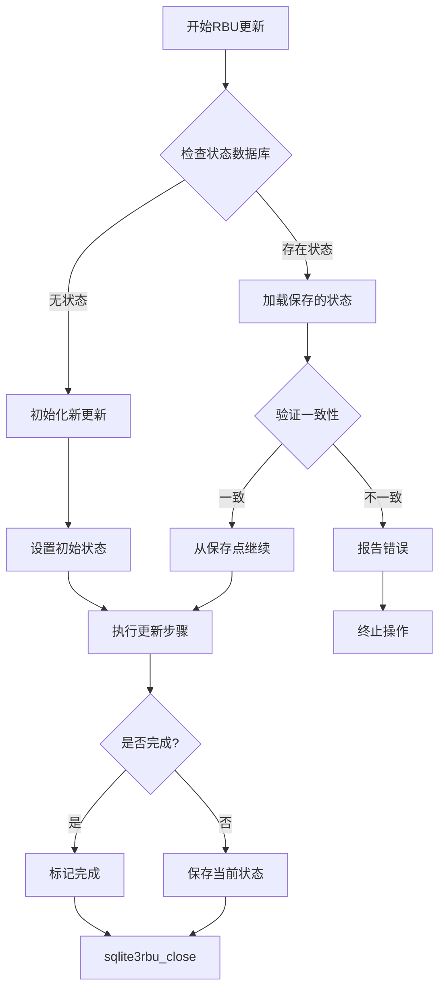
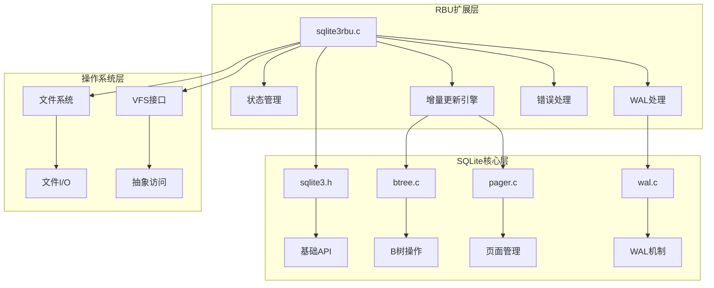

# RBU增量备份扩展技术文档

<cite>
**本文档引用的文件**
- [rbu.c](file://ext/rbu/rbu.c)
- [sqlite3rbu.c](file://ext/rbu/sqlite3rbu.c)
- [sqlite3rbu.h](file://ext/rbu/sqlite3rbu.h)
- [test_rbu.c](file://ext/rbu/test_rbu.c)
- [rbu_common.tcl](file://ext/rbu/rbu_common.tcl)
</cite>

## 目录
1. [概述](#概述)
2. [项目结构](#项目结构)
3. [核心组件](#核心组件)
4. [架构概览](#架构概览)
5. [详细组件分析](#详细组件分析)
6. [依赖关系分析](#依赖关系分析)
7. [性能考虑](#性能考虑)
8. [故障排除指南](#故障排除指南)
9. [结论](#结论)

## 概述

RBU（Resumable Bulk Update）是SQLite的一个扩展模块，专门设计用于支持可恢复的大规模数据库更新和增量备份操作。该扩展允许将大型数据库更新分解为多个小步骤，每个步骤都可以独立执行和保存状态，从而实现断点续传功能。

### 主要特性

- **可恢复性**：支持长时间运行的数据库更新操作的断点续传
- **增量备份**：通过增量方式应用数据库变更，减少内存和磁盘使用
- **低资源占用**：优化的内存管理和临时文件使用
- **并发安全**：在更新过程中保持数据库的读取可用性
- **虚拟表支持**：支持对虚拟表进行增量更新

## 项目结构

RBU扩展位于SQLite源码树的`ext/rbu/`目录下，包含以下核心文件：

**图表来源**
- [rbu.c](file://ext/rbu/rbu.c#L1-L50)
- [sqlite3rbu.c](file://ext/rbu/sqlite3rbu.c#L1-L100)

**章节来源**
- [rbu.c](file://ext/rbu/rbu.c#L1-L196)
- [sqlite3rbu.c](file://ext/rbu/sqlite3rbu.c#L1-L50)

## 核心组件

### RBU数据库文件格式

RBU扩展要求更新数据以SQLite数据库的形式组织，这种数据库称为RBU数据库。每个目标数据库表对应一个`data_`前缀的数据表：

| 组件 | 描述 | 示例 |
|------|------|------|
| 目标表 | 要更新的目标数据库表 | `CREATE TABLE t1(a INTEGER PRIMARY KEY, b TEXT)` |
| 数据表 | 对应的RBU数据表 | `CREATE TABLE data_t1(a INTEGER, b TEXT, rbu_control)` |
| rbu_control列 | 指定操作类型的控制字段 | 整数值或文本掩码 |

### 状态管理机制

RBU使用`rbu_state`表来跟踪更新进度：

| 状态键 | 值范围 | 描述 |
|--------|--------|------|
| RBU_STATE_STAGE | 1-5 | 当前阶段：OAL、MOVE、CHECKPOINT、DONE、ERROR |
| RBU_STATE_TBL | 字符串 | 当前正在处理的表名 |
| RBU_STATE_IDX | 字符串 | 当前正在处理的索引名 |
| RBU_STATE_ROW | 整数 | 当前行号 |
| RBU_STATE_PROGRESS | 大整数 | 总处理行数 |
| RBU_STATE_CKPT | 大整数 | WAL校验和 |
| RBU_STATE_COOKIE | 整数 | 变更计数器cookie值 |

**章节来源**
- [sqlite3rbu.h](file://ext/rbu/sqlite3rbu.h#L149-L275)
- [sqlite3rbu.c](file://ext/rbu/sqlite3rbu.c#L119-L176)

## 架构概览

RBU扩展采用三阶段更新流程：

**图表来源**
- [sqlite3rbu.c](file://ext/rbu/sqlite3rbu.c#L30-L57)
- [sqlite3rbu.c](file://ext/rbu/sqlite3rbu.c#L3600-L3700)

## 详细组件分析

### sqlite3rbu对象API

RBU提供了完整的C API来管理增量更新操作：

**图表来源**
- [sqlite3rbu.h](file://ext/rbu/sqlite3rbu.h#L280-L400)
- [sqlite3rbu.c](file://ext/rbu/sqlite3rbu.c#L240-L320)

### 断点续传功能实现

断点续传是RBU的核心特性，通过以下机制实现：

**图表来源**
- [sqlite3rbu.c](file://ext/rbu/sqlite3rbu.c#L4060-L4087)
- [sqlite3rbu.c](file://ext/rbu/sqlite3rbu.c#L3555-L3593)

### 错误处理和冲突解决

RBU实现了多层次的错误处理机制：

| 错误类型 | 处理策略 | 恢复方法 |
|----------|----------|----------|
| 内存不足 | 返回SQLITE_NOMEM | 重试或降级操作 |
| 磁盘空间不足 | 返回SQLITE_FULL | 清理临时文件 |
| 数据库锁定 | 返回SQLITE_BUSY | 等待或重新尝试 |
| 状态不一致 | 返回SQLITE_ERROR | 删除状态文件重新开始 |
| 文件系统错误 | 返回相应IO错误码 | 检查文件权限和路径 |

**章节来源**
- [sqlite3rbu.c](file://ext/rbu/sqlite3rbu.c#L1053-L1102)
- [sqlite3rbu.c](file://ext/rbu/sqlite3rbu.c#L4200-L4254)

## 依赖关系分析

RBU扩展与SQLite核心模块的依赖关系：

**图表来源**
- [sqlite3rbu.c](file://ext/rbu/sqlite3rbu.c#L1-L50)
- [sqlite3rbu.h](file://ext/rbu/sqlite3rbu.h#L1-L50)

**章节来源**
- [sqlite3rbu.c](file://ext/rbu/sqlite3rbu.c#L420-L437)
- [sqlite3rbu.c](file://ext/rbu/sqlite3rbu.c#L2783-L2829)

## 性能考虑

### 内存使用优化

RBU采用了多种内存优化策略：

- **分页处理**：每次只处理少量行，避免大事务
- **缓存限制**：可配置的临时文件大小限制
- **延迟清理**：推迟非关键资源的释放
- **增量分配**：按需分配内存，避免预分配浪费

### 磁盘I/O优化

- **顺序写入**：优化的页面写入顺序
- **批量操作**：合并多个小操作
- **预分配**：合理预分配临时文件空间
- **同步策略**：智能的文件系统同步时机

### 最佳实践建议

1. **合理设置步数限制**：根据系统资源调整每批次处理的行数
2. **监控临时文件大小**：及时清理不需要的临时文件
3. **使用适当的VFS**：选择适合的虚拟文件系统
4. **定期保存状态**：避免长时间无状态保存

## 故障排除指南

### 常见问题及解决方案

| 问题症状 | 可能原因 | 解决方案 |
|----------|----------|----------|
| 更新卡住不动 | 状态不一致或文件锁定 | 检查状态数据库，删除损坏文件 |
| 内存使用过高 | 缓存设置过大 | 调整临时文件大小限制 |
| 更新速度慢 | 磁盘I/O瓶颈 | 优化存储设备或增加缓存 |
| 数据库锁定 | 并发访问冲突 | 使用适当的锁定策略 |

### 调试技巧

1. **启用详细日志**：使用统计API监控进度
2. **检查文件完整性**：验证OAL和WAL文件
3. **监控资源使用**：跟踪内存和磁盘使用情况
4. **验证状态一致性**：检查状态数据库的完整性

**章节来源**
- [rbu.c](file://ext/rbu/rbu.c#L100-L150)
- [test_rbu.c](file://ext/rbu/test_rbu.c#L1-L100)

## 结论

RBU扩展为SQLite提供了一个强大而灵活的增量更新解决方案。通过其独特的三阶段更新流程、完善的断点续传机制和优化的资源管理，RBU能够处理大规模数据库更新任务，同时保持系统的稳定性和可用性。

### 主要优势

- **可靠性**：完善的错误处理和状态管理
- **效率**：优化的内存和磁盘使用
- **灵活性**：支持各种部署场景
- **兼容性**：与现有SQLite功能完全兼容

### 适用场景

- 大型数据库迁移和升级
- 远程设备的数据库同步
- 长时间运行的批处理操作
- 资源受限环境下的数据库维护

RBU扩展的设计充分体现了SQLite"简单、可靠、高效"的设计理念，在保证功能完整性的同时，尽可能地简化了使用复杂度，为开发者提供了一个优秀的数据库增量更新工具。