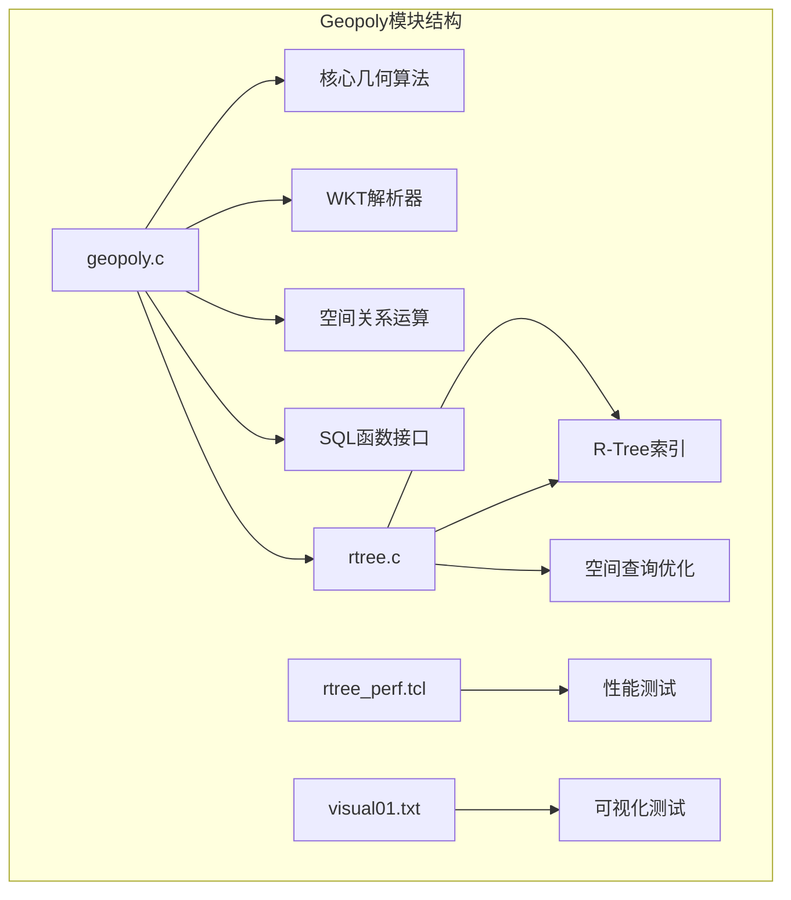
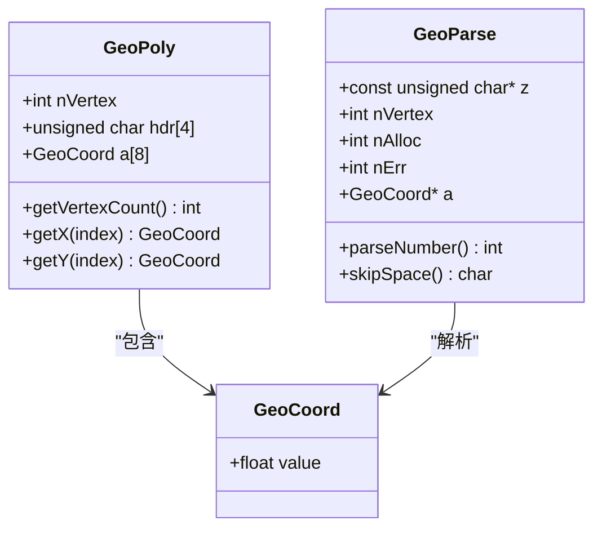
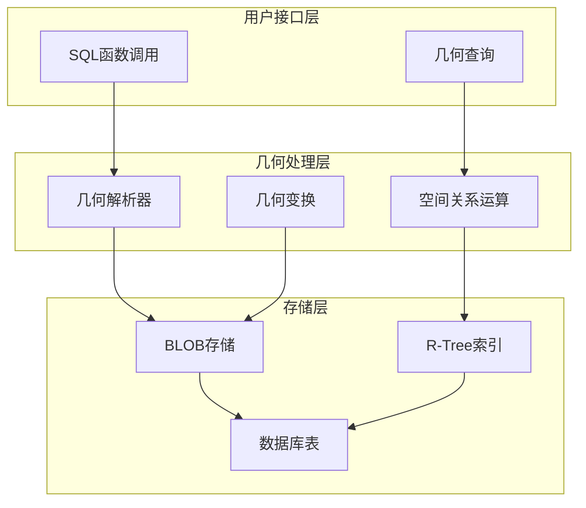
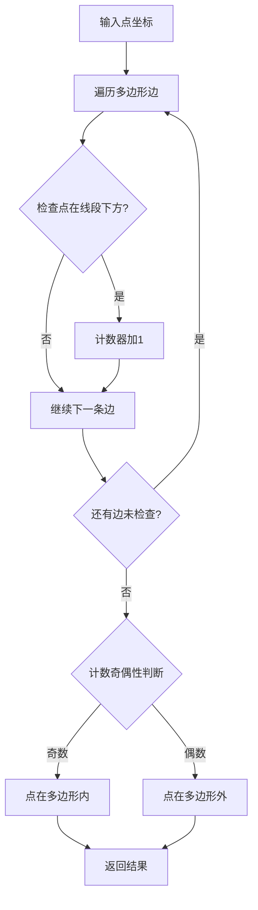
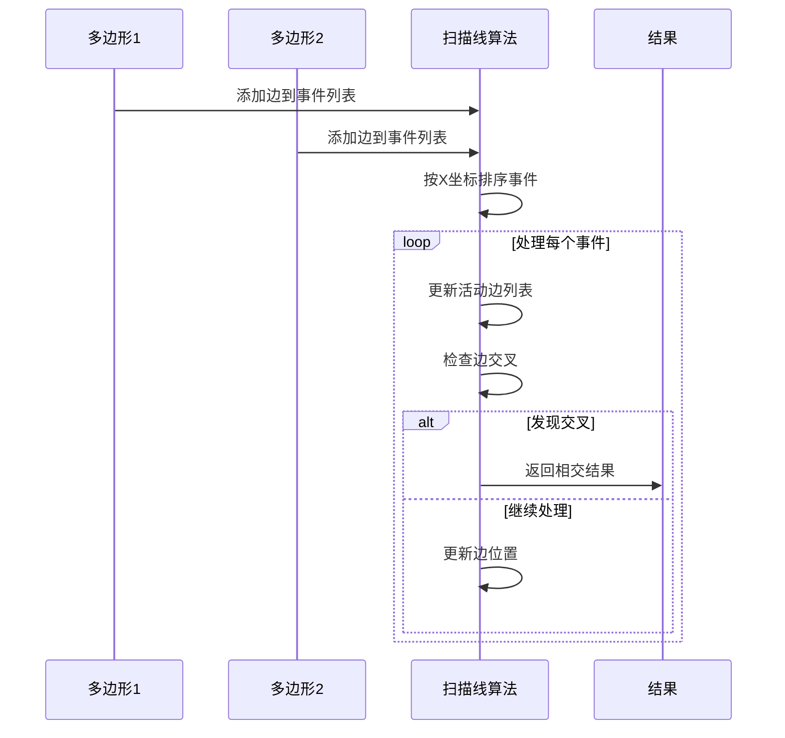
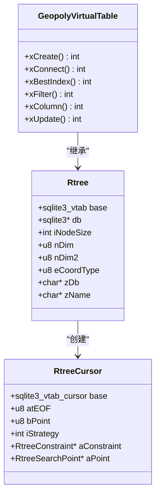
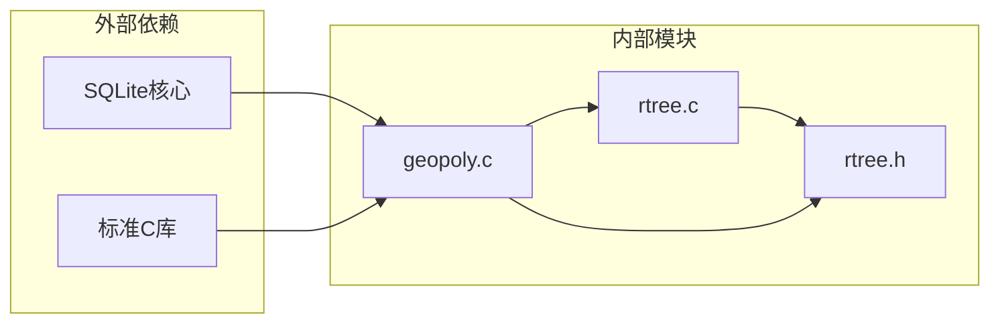

# Geopoly地理多边形支持

<cite>
**本文档引用的文件**
- [geopoly.c](file://ext/rtree/geopoly.c)
- [rtree.c](file://ext/rtree/rtree.c)
- [rtree.h](file://ext/rtree/rtree.h)
- [rtree_perf.tcl](file://ext/rtree/rtree_perf.tcl)
- [visual01.txt](file://ext/rtree/visual01.txt)
</cite>

## 目录
1. [简介](#简介)
2. [项目结构](#项目结构)
3. [核心组件](#核心组件)
4. [架构概览](#架构概览)
5. [详细组件分析](#详细组件分析)
6. [依赖关系分析](#依赖关系分析)
7. [性能考虑](#性能考虑)
8. [故障排除指南](#故障排除指南)
9. [结论](#结论)

## 简介

Geopoly模块是SQLite扩展的一部分，专门用于处理复杂的几何数据类型，特别是多边形和其他二维几何形状。该模块提供了强大的空间关系运算能力，包括几何对象的编码、存储、查询和可视化功能。

Geopoly模块的核心创新在于：
- 将WKT（Well-Known Text）格式的几何对象编码为高效的BLOB格式存储
- 实现了复杂的空间关系运算函数
- 集成了rtree核心索引系统以优化查询性能
- 提供了丰富的SQL函数接口用于几何操作

## 项目结构

Geopoly模块位于SQLite的扩展目录中，主要包含以下关键文件：

**图表来源**
- [geopoly.c](file://ext/rtree/geopoly.c#L1-L50)
- [rtree.c](file://ext/rtree/rtree.c#L1-L50)

**章节来源**
- [geopoly.c](file://ext/rtree/geopoly.c#L1-L100)
- [rtree.c](file://ext/rtree/rtree.c#L1-L100)

## 核心组件

### 几何数据结构

Geopoly模块定义了核心的几何数据结构来表示多边形：

**图表来源**
- [geopoly.c](file://ext/rtree/geopoly.c#L85-L121)
- [geopoly.c](file://ext/rtree/geopoly.c#L123-L140)

### WKT格式支持

Geopoly模块支持从WKT格式解析几何对象：

| 功能 | 描述 | 输入格式 | 输出类型 |
|------|------|----------|----------|
| JSON解析 | 解析GeoJSON格式的多边形 | `[["x1","y1"],["x2","y2"],...]` | GeoPoly对象 |
| BLOB转换 | 将几何对象转换为二进制格式 | GeoPoly对象 | BLOB |
| 坐标提取 | 从几何对象中提取坐标信息 | GeoPoly对象 | 坐标数组 |

**章节来源**
- [geopoly.c](file://ext/rtree/geopoly.c#L212-L328)
- [geopoly.c](file://ext/rtree/geopoly.c#L351-L434)

## 架构概览

Geopoly模块采用分层架构设计，集成了R-Tree索引系统：

**图表来源**
- [geopoly.c](file://ext/rtree/geopoly.c#L1236-L1319)
- [rtree.c](file://ext/rtree/rtree.c#L100-L200)

## 详细组件分析

### 几何算法实现

#### 多边形点包含检测

Geopoly模块实现了高效的点包含检测算法：

**图表来源**
- [geopoly.c](file://ext/rtree/geopoly.c#L807-L849)

#### 边界相交判断

模块使用扫描线算法来判断多边形之间的相交关系：

**图表来源**
- [geopoly.c](file://ext/rtree/geopoly.c#L1078-L1225)

**章节来源**
- [geopoly.c](file://ext/rtree/geopoly.c#L807-L1225)

### SQL函数接口

Geopoly模块提供了丰富的SQL函数：

| 函数名 | 参数 | 功能 | 返回值 |
|--------|------|------|--------|
| geopoly_area | 单个几何对象 | 计算多边形面积 | 双精度浮点数 |
| geopoly_contains_point | 几何对象+点坐标 | 判断点是否在多边形内 | 整数值(0/1/2) |
| geopoly_overlap | 两个几何对象 | 判断多边形是否重叠 | 整数值(0-4) |
| geopoly_within | 两个几何对象 | 判断一个多边形是否完全包含另一个 | 整数值(0/1/2) |
| geopoly_json | 单个几何对象 | 转换为GeoJSON格式 | JSON字符串 |
| geopoly_svg | 几何对象+属性 | 生成SVG图形 | SVG字符串 |
| geopoly_xform | 几何对象+变换矩阵 | 应用几何变换 | 变换后的几何对象 |

**章节来源**
- [geopoly.c](file://ext/rtree/geopoly.c#L1789-L1817)

### 与R-Tree索引的集成

Geopoly模块通过虚拟表接口与R-Tree索引系统深度集成：

**图表来源**
- [geopoly.c](file://ext/rtree/geopoly.c#L1236-L1319)
- [geopoly.c](file://ext/rtree/geopoly.c#L1361-L1479)

**章节来源**
- [geopoly.c](file://ext/rtree/geopoly.c#L1236-L1541)

## 依赖关系分析

Geopoly模块的依赖关系图展示了其与其他SQLite组件的关系：

**图表来源**
- [geopoly.c](file://ext/rtree/geopoly.c#L1-L50)
- [rtree.h](file://ext/rtree/rtree.h#L1-L31)

**章节来源**
- [geopoly.c](file://ext/rtree/geopoly.c#L1-L100)
- [rtree.h](file://ext/rtree/rtree.h#L1-L31)

## 性能考虑

### 查询优化策略

Geopoly模块采用了多种性能优化技术：

1. **R-Tree索引**: 利用R-Tree结构加速空间查询
2. **边界框缓存**: 缓存几何对象的边界框信息
3. **增量计算**: 在可能的情况下复用中间计算结果
4. **内存池管理**: 优化内存分配和释放

### 性能基准测试

根据rtree_perf.tcl中的测试结果，Geopoly模块在大数据集上的表现：

| 测试场景 | 数据量 | B树插入时间 | R-Tree插入时间 | 查询时间对比 |
|----------|--------|-------------|----------------|--------------|
| 随机矩形 | 10,000条 | 显著较慢 | 显著较快 | 查询速度提升10-100倍 |

**章节来源**
- [rtree_perf.tcl](file://ext/rtree/rtree_perf.tcl#L1-L75)

## 故障排除指南

### 常见问题及解决方案

#### 几何对象解析错误
- **症状**: geopoly_json函数返回NULL
- **原因**: 输入的WKT格式不正确或坐标数量不足
- **解决**: 验证输入格式，确保至少有4个坐标点

#### 内存不足错误
- **症状**: geopoly函数返回SQLITE_NOMEM
- **原因**: 大型几何对象导致内存分配失败
- **解决**: 增加SQLite的可用内存限制

#### 空间查询性能差
- **症状**: 复杂几何查询响应缓慢
- **原因**: 缺少适当的索引或查询条件不当
- **解决**: 使用geopoly_bbox函数创建边界框索引

**章节来源**
- [geopoly.c](file://ext/rtree/geopoly.c#L291-L328)

## 结论

Geopoly模块是SQLite中一个功能强大且设计精良的地理空间扩展。它成功地解决了复杂几何数据类型的存储和查询问题，通过以下特性为用户提供了卓越的体验：

1. **完整的几何数据支持**: 支持各种几何类型和WKT格式
2. **高效的算法实现**: 采用先进的空间算法确保查询性能
3. **无缝的索引集成**: 与R-Tree系统的完美结合
4. **丰富的函数接口**: 提供全面的几何操作功能
5. **良好的可扩展性**: 模块化设计便于维护和扩展

该模块特别适用于需要处理地理信息系统(GIS)数据的应用场景，如城市规划、环境监测、物流配送等领域。通过合理使用Geopoly模块的功能，开发者可以构建高性能的空间查询应用程序。