# R-Tree核心索引功能详细文档

<cite>
**本文档中引用的文件**
- [rtree.c](file://ext/rtree/rtree.c)
- [rtree.h](file://ext/rtree/rtree.h)
- [sqlite3rtree.h](file://ext/rtree/sqlite3rtree.h)
- [README](file://ext/rtree/README)
- [rtree_util.tcl](file://ext/rtree/rtree_util.tcl)
</cite>

## 目录
1. [简介](#简介)
2. [项目结构](#项目结构)
3. [核心组件](#核心组件)
4. [架构概览](#架构概览)
5. [详细组件分析](#详细组件分析)
6. [依赖关系分析](#依赖关系分析)
7. [性能考虑](#性能考虑)
8. [故障排除指南](#故障排除指南)
9. [结论](#结论)

## 简介

R-Tree是SQLite中实现的空间索引数据结构，专门用于高效存储和查询多维空间数据。该实现基于Guttman的原始R-Tree算法和Beckmann等人的R*-Tree启发式策略，提供了强大的二维空间索引功能。

R-Tree虚拟表模块允许用户在SQLite数据库中创建、操作和查询空间索引，支持范围查询、最近邻搜索等多种空间查询模式。该实现具有以下特点：
- 支持1到5维空间数据
- 实现R*-Tree启发式分裂策略
- 提供完整的边界框维护机制
- 支持几何回调函数进行复杂空间查询
- 具备完整的数据完整性检查功能

## 项目结构

R-Tree扩展模块位于`ext/rtree/`目录下，包含以下核心文件：

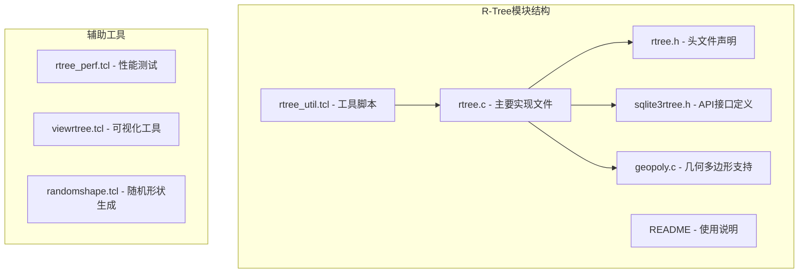

**图表来源**
- [rtree.c](file://ext/rtree/rtree.c#L1-L50)
- [rtree.h](file://ext/rtree/rtree.h#L1-L31)
- [sqlite3rtree.h](file://ext/rtree/sqlite3rtree.h#L1-L118)

**章节来源**
- [README](file://ext/rtree/README#L1-L121)

## 核心组件

### R-Tree数据结构定义

R-Tree的核心数据结构包括以下主要组件：

#### Rtree结构体
Rtree结构体是整个R-Tree虚拟表的核心，包含了所有必要的状态信息：

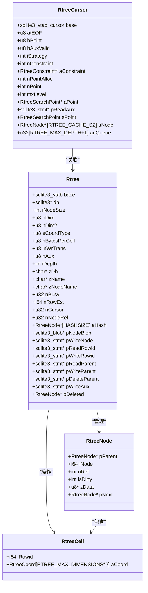

**图表来源**
- [rtree.c](file://ext/rtree/rtree.c#L120-L200)
- [rtree.c](file://ext/rtree/rtree.c#L3616-L3739)

#### 坐标类型系统
R-Tree支持两种坐标类型：
- **RTREE_COORD_REAL32**: 32位浮点数坐标
- **RTREE_COORD_INT32**: 64位整数坐标

这种设计允许在精度和性能之间进行权衡，特别是在处理大量空间数据时。

**章节来源**
- [rtree.c](file://ext/rtree/rtree.c#L120-L200)
- [rtree.c](file://ext/rtree/rtree.c#L3616-L3739)

## 架构概览

R-Tree虚拟表的整体架构采用分层设计，从上到下包括：

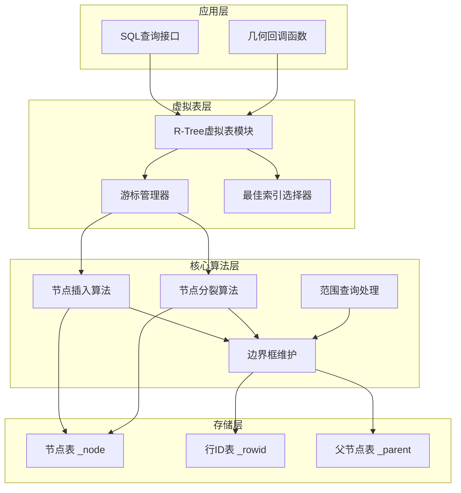

**图表来源**
- [rtree.c](file://ext/rtree/rtree.c#L3616-L3739)
- [rtree.c](file://ext/rtree/rtree.c#L2035-L2124)

## 详细组件分析

### 节点插入与分裂算法

#### rtreeInsertCell函数
节点插入是R-Tree的核心操作，负责将新的空间对象插入到适当的叶子节点中：

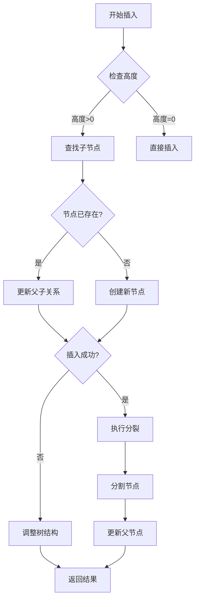

**图表来源**
- [rtree.c](file://ext/rtree/rtree.c#L2863-L2891)

#### SplitNode算法（R*-Tree启发式）
R*-Tree实现了改进的分裂策略，优先考虑重叠最小化的分裂方案：

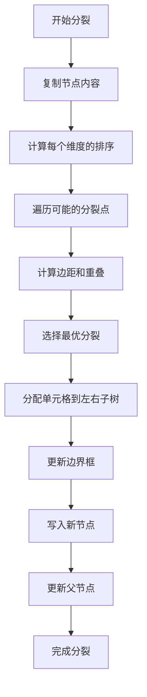

**图表来源**
- [rtree.c](file://ext/rtree/rtree.c#L2443-L2497)
- [rtree.c](file://ext/rtree/rtree.c#L2582-L2629)

**章节来源**
- [rtree.c](file://ext/rtree/rtree.c#L2863-L2891)
- [rtree.c](file://ext/rtree/rtree.c#L2443-L2497)

### 边界框维护机制

#### 边界框联合操作
边界框联合是R-Tree维护空间层次结构的关键操作：

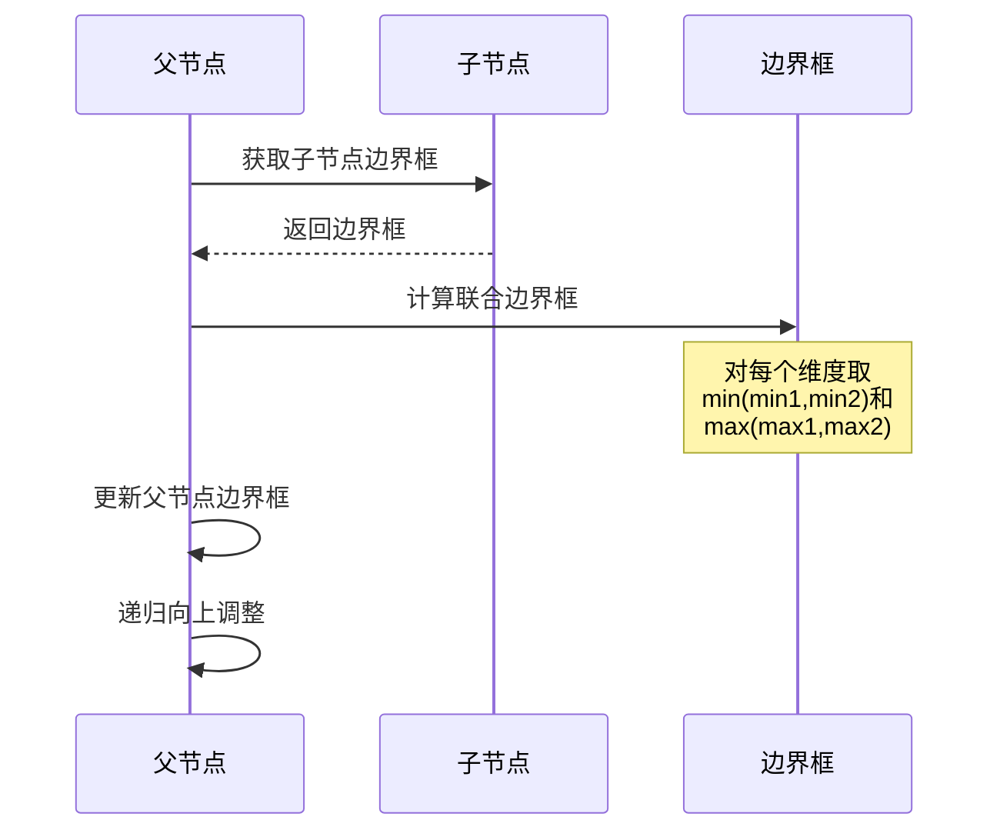

**图表来源**
- [rtree.c](file://ext/rtree/rtree.c#L2155-L2187)
- [rtree.c](file://ext/rtree/rtree.c#L2303-L2350)

#### 边界框包含检测
用于判断一个边界框是否完全包含另一个边界框：

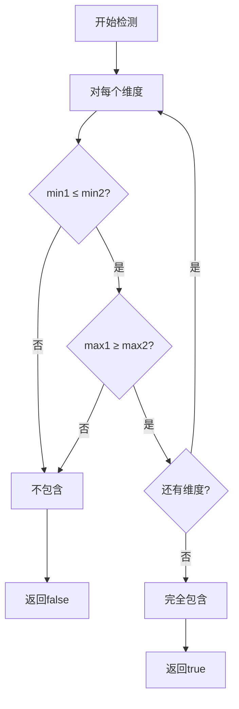

**图表来源**
- [rtree.c](file://ext/rtree/rtree.c#L2189-L2236)

**章节来源**
- [rtree.c](file://ext/rtree/rtree.c#L2155-L2187)
- [rtree.c](file://ext/rtree/rtree.c#L2189-L2236)

### 查询处理流程

#### 最佳索引选择
rtreeBestIndex函数根据查询条件选择最优的访问策略：

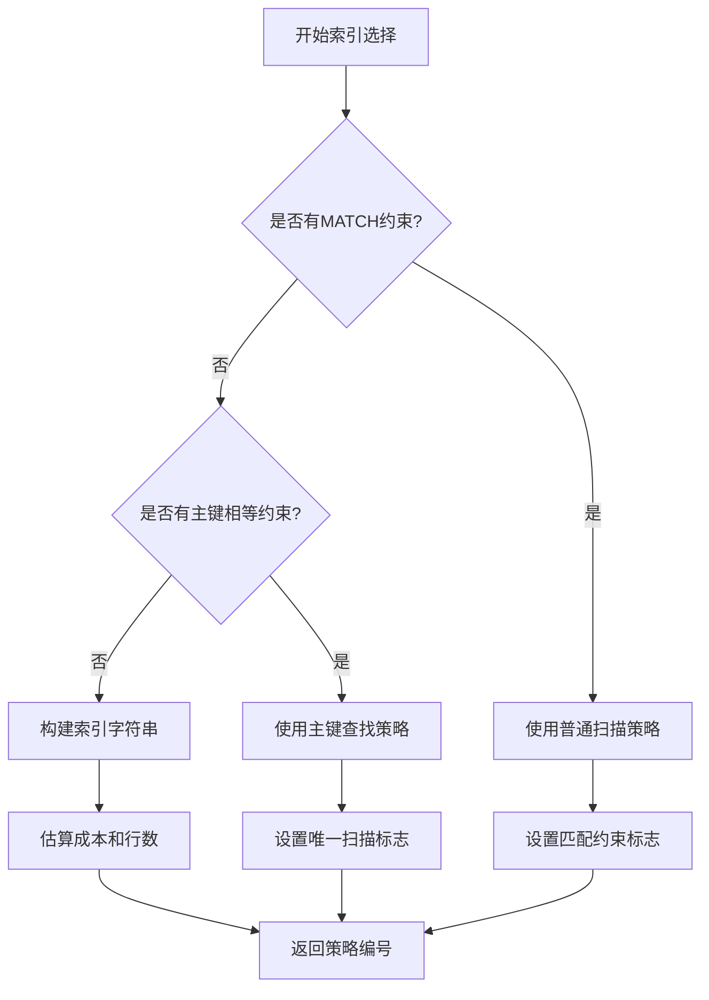

**图表来源**
- [rtree.c](file://ext/rtree/rtree.c#L2035-L2124)

#### 范围查询处理
范围查询通过优先队列实现高效的多维范围搜索：

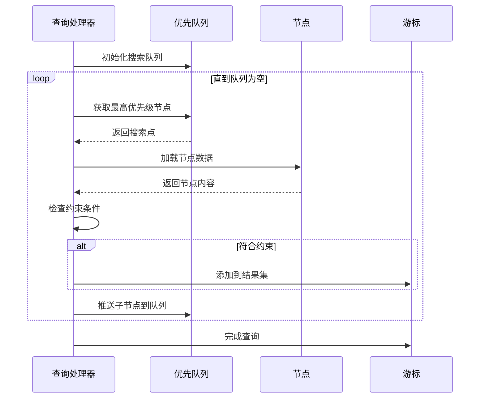

**图表来源**
- [rtree.c](file://ext/rtree/rtree.c#L1588-L1648)
- [rtree.c](file://ext/rtree/rtree.c#L1885-L1924)

**章节来源**
- [rtree.c](file://ext/rtree/rtree.c#L2035-L2124)
- [rtree.c](file://ext/rtree/rtree.c#L1588-L1648)

### C API接口定义

#### 核心API函数
R-Tree模块提供了完整的C API接口：

| 函数名 | 功能描述 | 参数说明 |
|--------|----------|----------|
| `sqlite3RtreeInit()` | 初始化R-Tree模块 | `sqlite3 *db`: 数据库连接 |
| `sqlite3_rtree_geometry_callback()` | 注册几何回调函数 | `db`: 数据库连接 `zGeom`: 函数名称 `xGeom`: 回调函数指针 `pContext`: 上下文数据 |
| `sqlite3_rtree_query_callback()` | 注册查询回调函数 | 类似几何回调函数 |
| `rtreecheck()` | 执行数据完整性检查 | `db`: 数据库连接 `zDb`: 数据库名称 `zTab`: 表名称 |

#### 几何回调函数接口
几何回调函数允许用户定义复杂的空间查询逻辑：

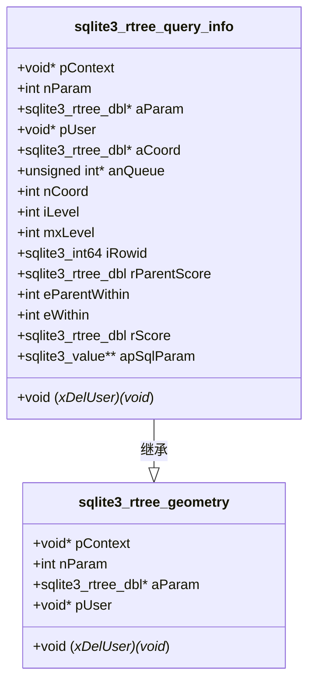

**图表来源**
- [sqlite3rtree.h](file://ext/rtree/sqlite3rtree.h#L40-L117)

**章节来源**
- [sqlite3rtree.h](file://ext/rtree/sqlite3rtree.h#L40-L117)
- [rtree.c](file://ext/rtree/rtree.c#L4314-L4344)

### SQLite核心交互方式

#### 虚拟表模块接口
R-Tree实现了完整的SQLite虚拟表接口：

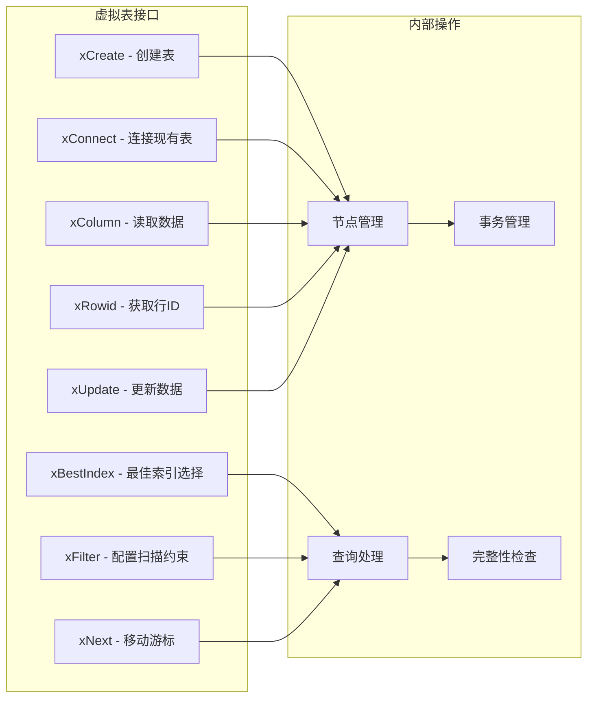

**图表来源**
- [rtree.c](file://ext/rtree/rtree.c#L3616-L3739)

**章节来源**
- [rtree.c](file://ext/rtree/rtree.c#L3616-L3739)

## 依赖关系分析

### 内部依赖关系

R-Tree模块的内部依赖关系展现了清晰的分层架构：

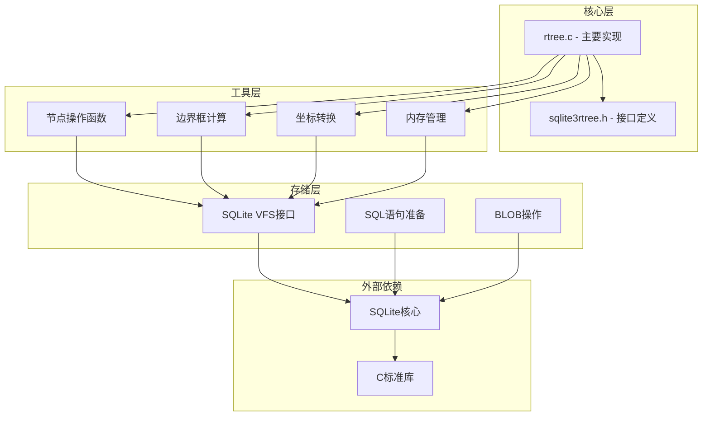

**图表来源**
- [rtree.c](file://ext/rtree/rtree.c#L1-L100)
- [rtree.h](file://ext/rtree/rtree.h#L1-L31)

### 外部依赖

R-Tree模块的主要外部依赖包括：
- **SQLite核心库**: 提供虚拟表框架和存储引擎
- **C标准库**: 包含内存管理、字符串处理等功能
- **编译器特性**: 支持字节序优化和内联汇编

**章节来源**
- [rtree.c](file://ext/rtree/rtree.c#L1-L100)

## 性能考虑

### 索引性能优化策略

#### 合适的维度选择
R-Tree的最佳性能取决于维度的选择：

| 维度数量 | 适用场景 | 性能特征 | 注意事项 |
|----------|----------|----------|----------|
| 1维 | 时间序列数据 | O(log N)查询 | 简单范围查询 |
| 2维 | 地理坐标 | O(log N)查询 | 空间索引优势明显 |
| 3维 | 三维建模 | O(log N)查询 | 内存占用较大 |
| 4-5维 | 高维数据分析 | 查询效率下降 | 考虑降维或替代算法 |

#### 数据分布考量
- **均匀分布**: 最佳性能，分裂均衡
- **聚集分布**: 可能导致不平衡树结构
- **边界数据**: 需要特别注意边界条件处理

#### 缓存优化
R-Tree实现了多级缓存机制：
- **节点缓存**: 默认5个节点的LRU缓存
- **搜索点缓存**: 优先队列优化
- **哈希表**: 快速节点查找

### 内存使用优化

#### 节点大小配置
节点大小直接影响性能和内存使用：
- **小节点**: 更好的局部性，但开销较大
- **大节点**: 减少I/O次数，但内存占用高

#### 内存池管理
- 使用SQLite的内存分配器
- 实现引用计数避免重复加载
- 支持延迟写入优化

## 故障排除指南

### 常见问题诊断

#### 数据完整性检查
R-Tree提供了完整的完整性检查功能：

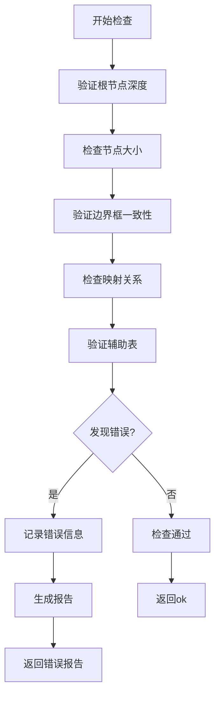

**图表来源**
- [rtree.c](file://ext/rtree/rtree.c#L4000-L4100)

#### 性能问题排查
常见的性能问题及解决方案：

| 问题类型 | 症状 | 可能原因 | 解决方案 |
|----------|------|----------|----------|
| 查询缓慢 | 大量数据扫描 | 分裂策略不当 | 调整节点大小 |
| 插入缓慢 | 频繁分裂 | 数据聚集 | 重新组织数据 |
| 内存占用高 | 节点缓存过大 | 缓存策略不当 | 调整缓存大小 |
| 磁盘I/O频繁 | 节点未命中 | 缓存失效 | 优化缓存策略 |

**章节来源**
- [rtree.c](file://ext/rtree/rtree.c#L4000-L4100)

### 错误处理机制

#### 错误码定义
R-Tree模块使用标准的SQLite错误码：
- **SQLITE_CORRUPT_VTAB**: 虚拟表损坏
- **SQLITE_CONSTRAINT**: 约束违反
- **SQLITE_NOMEM**: 内存不足
- **SQLITE_LOCKED_VTAB**: 表被锁定

#### 调试功能
- **rtreenode()**: 查看节点内容
- **rtreedepth()**: 获取树深度
- **rtreecheck()**: 完整性检查
- **调试宏**: 条件编译的调试输出

## 结论

SQLite的R-Tree核心索引功能提供了一个完整、高效的二维空间索引解决方案。通过深入分析其实现机制，我们可以看到：

### 技术优势
1. **算法先进**: 实现了R*-Tree启发式分裂策略，提供更好的查询性能
2. **架构清晰**: 采用分层设计，职责分离明确
3. **接口完善**: 提供完整的C API和SQL接口
4. **性能优化**: 多级缓存和智能分裂策略
5. **可靠性高**: 完整的错误处理和完整性检查

### 应用价值
- **地理信息系统**: 空间数据查询和分析
- **计算机图形学**: 碰撞检测和可视化
- **数据库应用**: 多维索引和复杂查询
- **科学计算**: 高维数据分析和可视化

### 发展方向
随着数据规模的增长和查询需求的复杂化，R-Tree可以进一步优化：
- **高维扩展**: 支持更多维度的空间数据
- **并行处理**: 利用多核CPU加速查询
- **内存优化**: 更高效的内存管理和压缩
- **混合索引**: 与其他索引类型的结合使用

R-Tree作为SQLite的重要扩展模块，为现代应用提供了强大的空间数据处理能力，是数据库技术发展史上的重要里程碑。