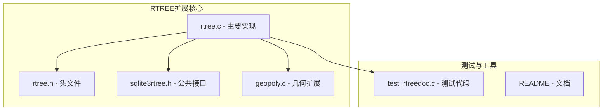
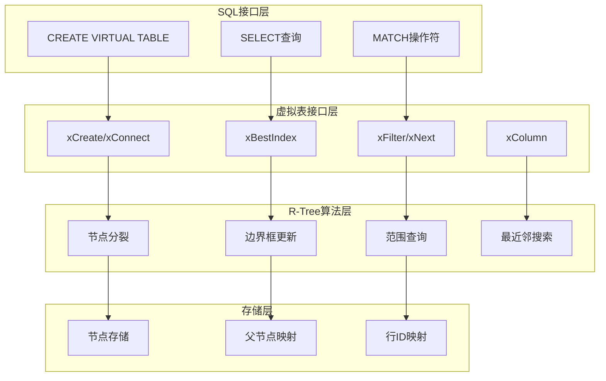
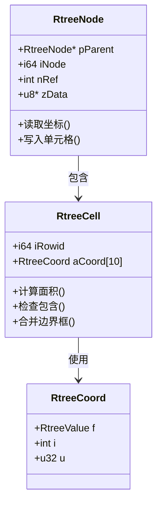
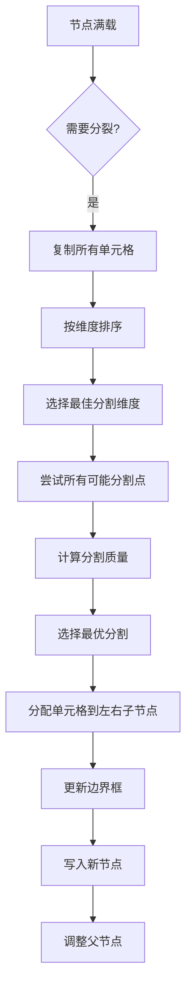
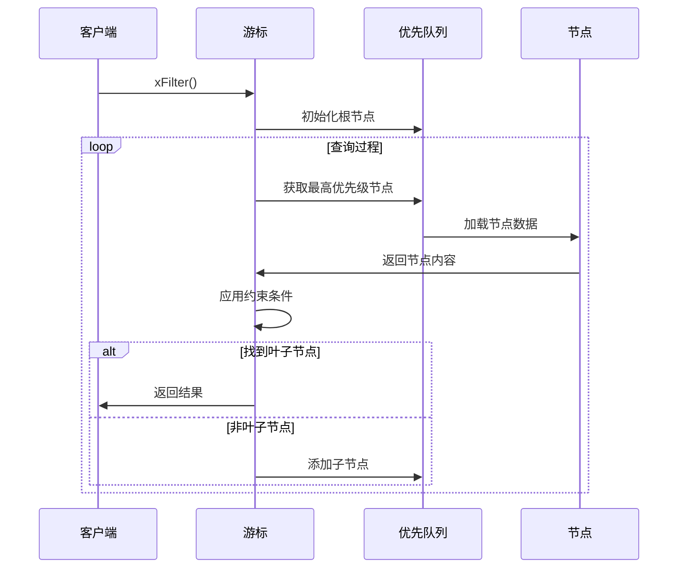
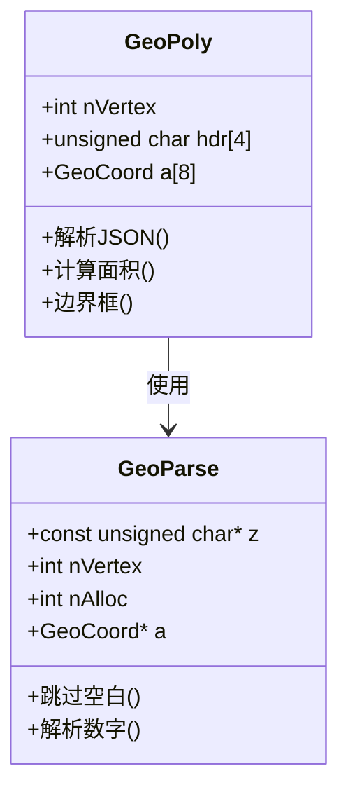
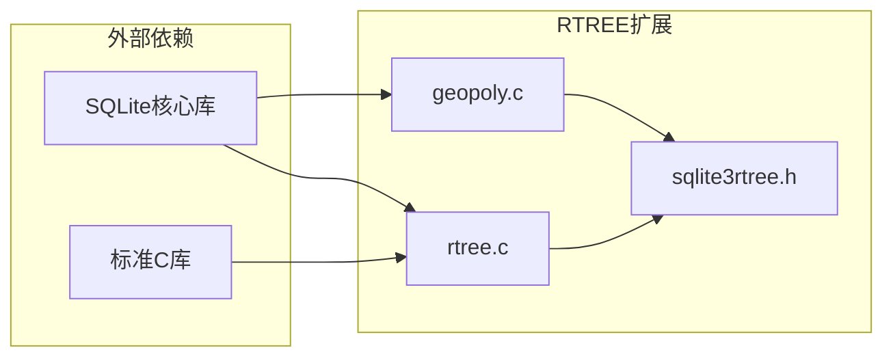

# RTREE空间索引扩展

<cite>
**本文档中引用的文件**
- [rtree.c](file://ext/rtree/rtree.c)
- [rtree.h](file://ext/rtree/rtree.h)
- [geopoly.c](file://ext/rtree/geopoly.c)
- [sqlite3rtree.h](file://ext/rtree/sqlite3rtree.h)
- [README](file://ext/rtree/README)
- [test_rtreedoc.c](file://ext/rtree/test_rtreedoc.c)
</cite>

## 目录
1. [简介](#简介)
2. [项目结构](#项目结构)
3. [核心组件](#核心组件)
4. [架构概览](#架构概览)
5. [详细组件分析](#详细组件分析)
6. [依赖关系分析](#依赖关系分析)
7. [性能考量](#性能考量)
8. [故障排除指南](#故障排除指南)
9. [结论](#结论)

## 简介

RTREE扩展是SQLite的一个虚拟表模块，实现了R-Tree和R*-Tree空间数据索引算法。该扩展专门用于处理多维空间数据，提供高效的范围查询、最近邻搜索和空间关系查询功能。RTREE扩展支持从1到5维的空间数据，并提供了丰富的几何操作接口。

RTREE扩展的核心优势在于：
- 高效的多维空间索引
- 支持复杂的几何查询
- 内置R*-树优化算法
- 完整的SQL接口支持
- 可扩展的几何回调机制

## 项目结构

RTREE扩展的文件组织结构清晰，主要包含以下核心文件：



**图表来源**
- [rtree.c](file://ext/rtree/rtree.c#L1-L50)
- [rtree.h](file://ext/rtree/rtree.h#L1-L31)
- [sqlite3rtree.h](file://ext/rtree/sqlite3rtree.h#L1-L118)

**章节来源**
- [README](file://ext/rtree/README#L1-L121)

## 核心组件

### R-Tree数据结构

RTREE扩展实现了标准的R-Tree和优化的R*-Tree算法。每个R-Tree由三个SQLite表组成：

1. **`<table>_node`**: 存储树节点数据，每个节点包含边界框信息
2. **`<table>_parent`**: 维护父子节点关系
3. **`<table>_rowid`**: 映射行ID到节点ID

### 虚拟表接口

RTREE扩展实现了完整的SQLite虚拟表接口，包括：
- `xCreate` 和 `xConnect`: 表创建和连接
- `xBestIndex`: 查询计划优化
- `xFilter`: 数据过滤和扫描
- `xNext`: 游标移动
- `xColumn`: 列值访问

### 几何回调系统

扩展提供了强大的几何回调机制，支持：
- 传统几何回调 (`sqlite3_rtree_geometry_callback`)
- 新式查询回调 (`sqlite3_rtree_query_callback`)
- 自定义几何函数

**章节来源**
- [rtree.c](file://ext/rtree/rtree.c#L25-L100)
- [sqlite3rtree.h](file://ext/rtree/sqlite3rtree.h#L30-L118)

## 架构概览

RTREE扩展采用分层架构设计，从底层的数据存储到上层的SQL接口：



**图表来源**
- [rtree.c](file://ext/rtree/rtree.c#L1000-L1200)
- [rtree.c](file://ext/rtree/rtree.c#L1800-L2000)

## 详细组件分析

### 边界框管理

边界框（Bounding Box）是R-Tree的核心概念，用于快速空间查询：



**图表来源**
- [rtree.c](file://ext/rtree/rtree.c#L500-L600)
- [rtree.c](file://ext/rtree/rtree.c#L700-L800)

边界框操作包括：
- **面积计算**: `cellArea()` 计算N维体积
- **包含检查**: `cellContains()` 检查一个边界框是否完全包含另一个
- **边界框合并**: `cellUnion()` 计算两个边界框的最小包含边界框
- **重叠检测**: `cellOverlap()` 计算两个边界框的重叠区域

### 节点分裂策略

RTREE扩展实现了R*-Tree的优化分裂算法：



**图表来源**
- [rtree.c](file://ext/rtree/rtree.c#L2443-L2586)
- [rtree.c](file://ext/rtree/rtree.c#L2582-L2665)

分裂算法的关键指标：
- **边长总和**: 最小化新边界框的边长总和
- **重叠度**: 最小化左右子节点的重叠区域
- **面积增长**: 最小化新边界框的面积增长

### 空间查询算法

RTREE扩展支持多种空间查询模式：

#### 范围查询
```sql
SELECT * FROM rtree_table 
WHERE column1 BETWEEN x1 AND x2 
  AND column2 BETWEEN y1 AND y2;
```

#### 几何匹配查询
```sql
SELECT * FROM rtree_table 
WHERE column MATCH geometry_function(params);
```

#### 最近邻搜索
```sql
SELECT * FROM rtree_table 
WHERE column MATCH nearest_neighbor_query;
```

查询执行流程：



**图表来源**
- [rtree.c](file://ext/rtree/rtree.c#L1600-L1700)
- [rtree.c](file://ext/rtree/rtree.c#L1700-L1800)

### geopoly模块

geopoly模块扩展了RTREE的功能，提供多边形几何操作：



**图表来源**
- [geopoly.c](file://ext/rtree/geopoly.c#L100-L200)
- [geopoly.c](file://ext/rtree/geopoly.c#L300-L400)

geopoly提供的几何函数：
- `geopoly_area()`: 计算多边形面积
- `geopoly_bbox()`: 计算边界框
- `geopoly_json()`: 转换为GeoJSON格式
- `geopoly_svg()`: 生成SVG表示
- `geopoly_xform()`: 几何变换

**章节来源**
- [rtree.c](file://ext/rtree/rtree.c#L1600-L2400)
- [geopoly.c](file://ext/rtree/geopoly.c#L1-L800)

## 依赖关系分析

RTREE扩展的依赖关系相对简单，主要依赖于SQLite核心库：



**图表来源**
- [rtree.c](file://ext/rtree/rtree.c#L1-L50)
- [rtree.h](file://ext/rtree/rtree.h#L1-L31)

主要依赖项：
- **SQLite核心**: 提供虚拟表接口和数据库访问
- **标准C库**: 字符串处理、内存管理和数学运算
- **编译器特性**: 支持字节序转换和内联汇编

**章节来源**
- [rtree.c](file://ext/rtree/rtree.c#L1-L100)
- [rtree.h](file://ext/rtree/rtree.h#L1-L31)

## 性能考量

### 索引构建开销

RTREE索引的构建涉及以下性能因素：

1. **节点分裂频率**: 分裂越频繁，索引深度越大
2. **边界框重叠**: 重叠越严重，查询效率越低
3. **数据分布**: 均匀分布的数据比聚集数据更高效

### 查询优化技巧

1. **约束条件优化**: 将最严格的约束放在前面
2. **索引选择**: 利用`xBestIndex`进行查询计划优化
3. **缓存策略**: 使用节点缓存减少磁盘I/O

### 内存使用优化

- **节点缓存**: 默认缓存5个节点，可根据需要调整
- **哈希表**: 使用固定大小的哈希表管理活跃节点
- **延迟写入**: 只有脏节点才写回磁盘

### 并发控制

RTREE扩展实现了基本的并发控制：
- 写操作时锁定整个表
- 读操作可以并发进行
- 使用引用计数管理节点生命周期

## 故障排除指南

### 常见问题

1. **索引损坏**
   - 症状：`SQLITE_CORRUPT_VTAB`错误
   - 解决：检查底层表的完整性

2. **查询性能差**
   - 症状：查询时间过长
   - 解决：检查约束条件顺序，确保使用索引

3. **内存不足**
   - 症状：`SQLITE_NOMEM`错误
   - 解决：增加可用内存或减少并发查询

### 调试工具

RTREE扩展提供了调试支持：
- `RTREE_QUEUE_TRACE`: 跟踪搜索队列状态
- `RTREE_IS_CORRUPT`: 设置损坏标志
- 详细的错误消息

**章节来源**
- [rtree.c](file://ext/rtree/rtree.c#L200-L300)
- [rtree.c](file://ext/rtree/rtree.c#L1600-L1700)

## 结论

RTREE扩展是SQLite中功能强大且高效的二维空间数据索引解决方案。它成功地将复杂的R-Tree算法封装在简洁的SQL接口后面，为开发者提供了处理地理信息系统（GIS）数据的能力。

主要优势：
- **高性能**: 基于R*-Tree优化算法，查询效率高
- **易用性**: 完整的SQL接口，无需学习复杂API
- **可扩展性**: 支持自定义几何回调函数
- **可靠性**: 完善的错误处理和一致性保证

未来发展方向：
- 支持更高维度的空间数据
- 进一步优化查询性能
- 增强几何操作功能
- 改进并发处理能力

RTREE扩展的成功实现证明了SQLite虚拟表系统的强大能力，为其他扩展开发提供了优秀的参考范例。