# Session扩展与变更集深度技术文档

<cite>
**本文档引用的文件**
- [sqlite3session.c](file://ext/session/sqlite3session.c)
- [sqlite3session.h](file://ext/session/sqlite3session.h)
- [changeset.c](file://ext/session/changeset.c)
- [test_session.c](file://ext/session/test_session.c)
- [sqlite3rbu.c](file://ext/rbu/sqlite3rbu.c)
- [sqlite3rbu.h](file://ext/rbu/sqlite3rbu.h)
</cite>

## 目录
1. [概述](#概述)
2. [项目结构](#项目结构)
3. [核心组件](#核心组件)
4. [架构概览](#架构概览)
5. [详细组件分析](#详细组件分析)
6. [依赖关系分析](#依赖关系分析)
7. [性能考虑](#性能考虑)
8. [故障排除指南](#故障排除指南)
9. [结论](#结论)

## 概述

SQLite Session扩展是一个强大的数据库变更跟踪和同步框架，专门设计用于捕获数据库会话中的更改并将这些更改序列化为二进制格式的变更集（changeset）。该扩展提供了完整的变更捕获、序列化、传输和应用功能，支持复杂的冲突检测和解决机制。

Session扩展的核心价值在于：
- **精确的变更捕获**：通过预更新钩子（pre-update hook）精确记录所有数据库操作
- **高效的序列化**：采用紧凑的二进制格式存储变更信息
- **灵活的冲突处理**：提供多种冲突解决策略
- **可扩展的数据同步**：支持分布式系统中的数据同步场景

## 项目结构

Session扩展位于SQLite源码树的`ext/session/`目录下，包含以下核心文件：

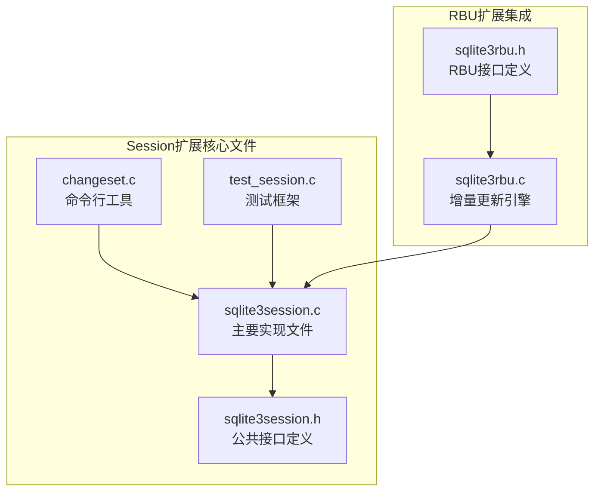

**图表来源**
- [sqlite3session.c](file://ext/session/sqlite3session.c#L1-L50)
- [sqlite3session.h](file://ext/session/sqlite3session.h#L1-L50)
- [sqlite3rbu.c](file://ext/rbu/sqlite3rbu.c#L1-L50)

**章节来源**
- [sqlite3session.c](file://ext/session/sqlite3session.c#L1-L100)
- [sqlite3session.h](file://ext/session/sqlite3session.h#L1-L100)

## 核心组件

### Session对象结构

Session扩展的核心是`sqlite3_session`结构体，它管理整个变更捕获过程：

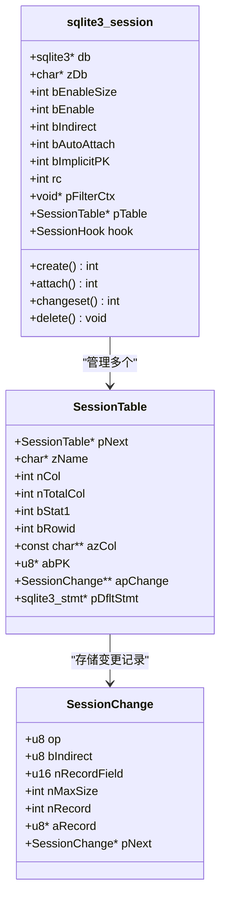

**图表来源**
- [sqlite3session.c](file://ext/session/sqlite3session.c#L30-L100)
- [sqlite3session.c](file://ext/session/sqlite3session.c#L180-L250)

### 变更集数据结构

变更集采用紧凑的二进制格式，每个变更包含表头和变更记录：

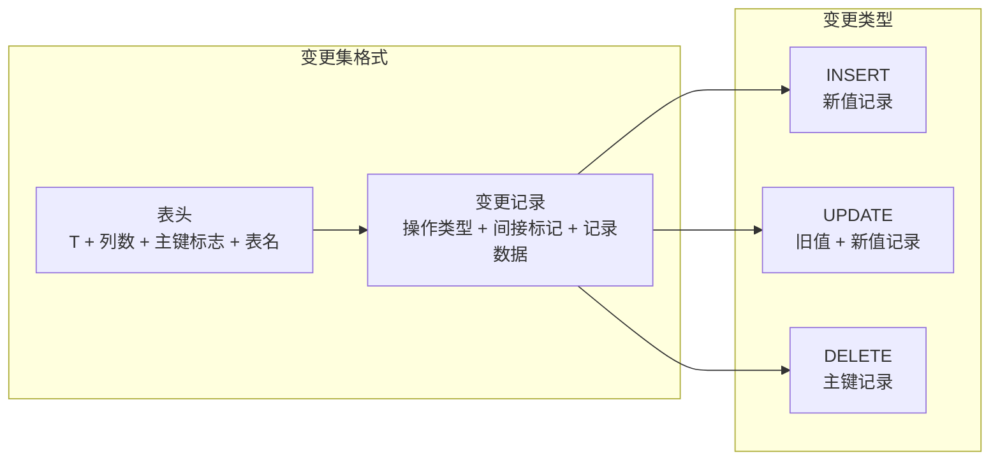

**图表来源**
- [sqlite3session.c](file://ext/session/sqlite3session.c#L250-L350)

**章节来源**
- [sqlite3session.c](file://ext/session/sqlite3session.c#L30-L200)
- [sqlite3session.h](file://ext/session/sqlite3session.h#L20-L150)

## 架构概览

Session扩展的整体架构遵循分层设计，从底层的变更捕获到高层的应用接口：

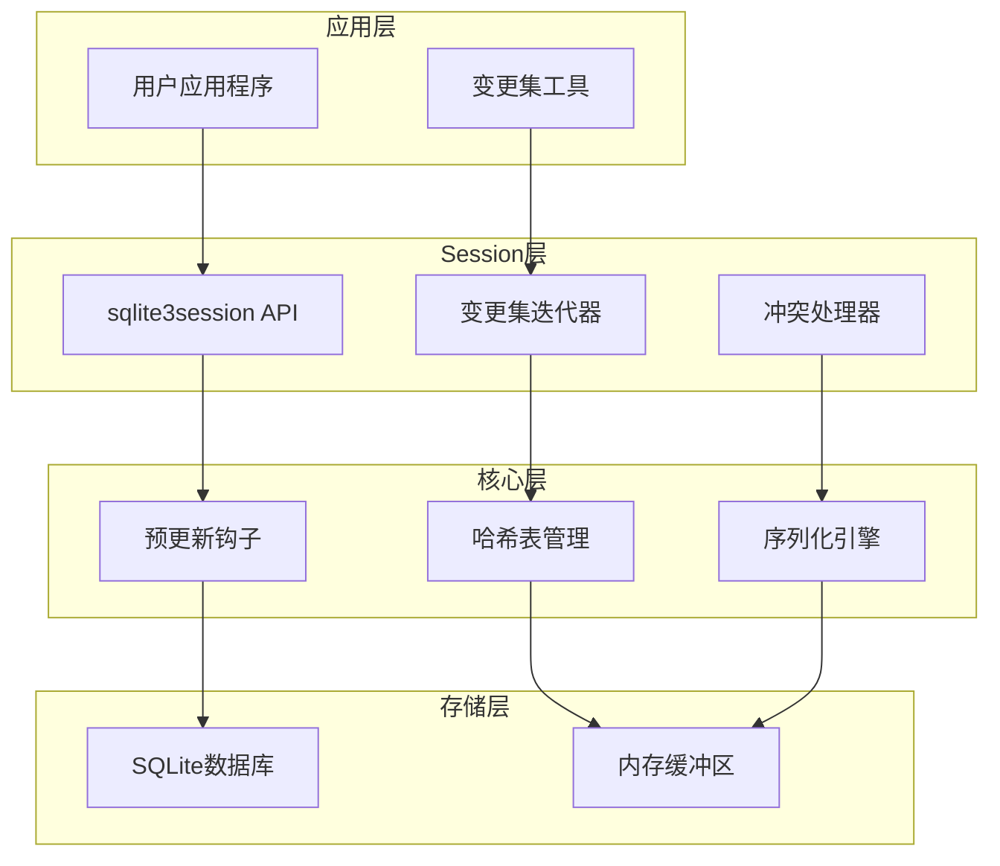

**图表来源**
- [sqlite3session.c](file://ext/session/sqlite3session.c#L1-L100)
- [sqlite3session.h](file://ext/session/sqlite3session.h#L1-L100)

## 详细组件分析

### 变更捕获机制

Session扩展通过SQLite的预更新钩子机制实现精确的变更捕获：

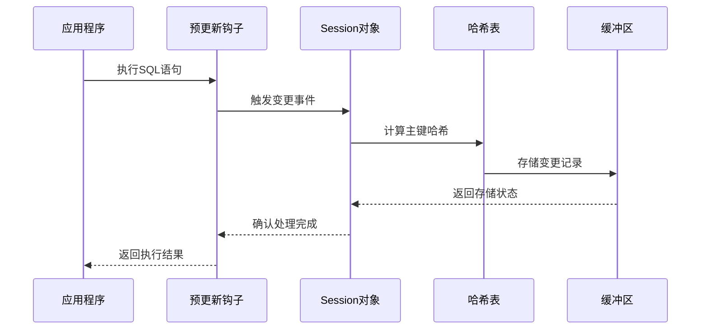

**图表来源**
- [sqlite3session.c](file://ext/session/sqlite3session.c#L520-L650)

#### 哈希表碰撞处理

Session扩展使用高效的哈希算法处理主键碰撞：

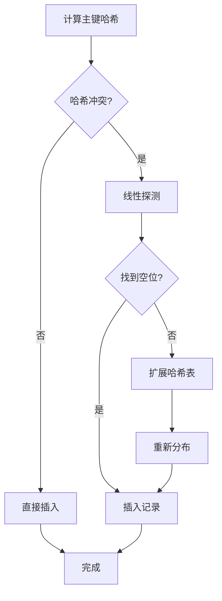

**图表来源**
- [sqlite3session.c](file://ext/session/sqlite3session.c#L484-L548)

**章节来源**
- [sqlite3session.c](file://ext/session/sqlite3session.c#L520-L700)

### 变更集序列化

变更集采用优化的二进制格式，支持流式处理：

#### 记录格式规范

| 类型 | 值 | 描述 |
|------|-----|------|
| 0x00 | UNDEFINED | 未定义值 |
| 0x01 | INTEGER | 整数值（8字节大端序） |
| 0x02 | REAL | 实数值（8字节IEEE 754） |
| 0x03 | TEXT | 文本值（变长整数长度 + UTF-8数据） |
| 0x04 | BLOB | 二进制值（变长整数长度 + 数据） |
| 0x05 | NULL | 空值 |

#### 流式处理机制

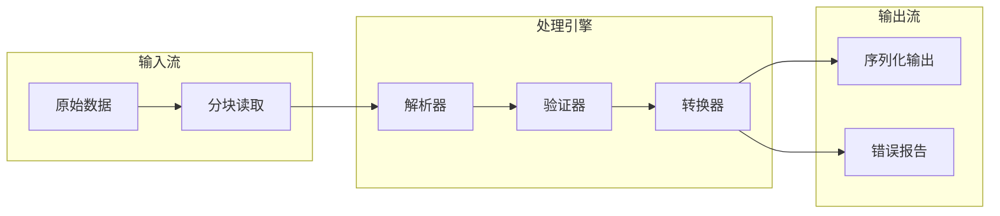

**图表来源**
- [sqlite3session.c](file://ext/session/sqlite3session.c#L100-L200)

**章节来源**
- [sqlite3session.c](file://ext/session/sqlite3session.c#L250-L400)

### 冲突检测与解决

Session扩展提供了完善的冲突检测和解决机制：

#### 冲突类型分类

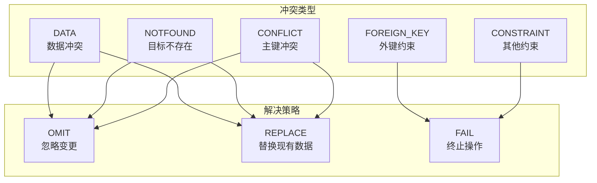

**图表来源**
- [sqlite3session.c](file://ext/session/sqlite3session.c#L5180-L5250)

#### 冲突处理流程

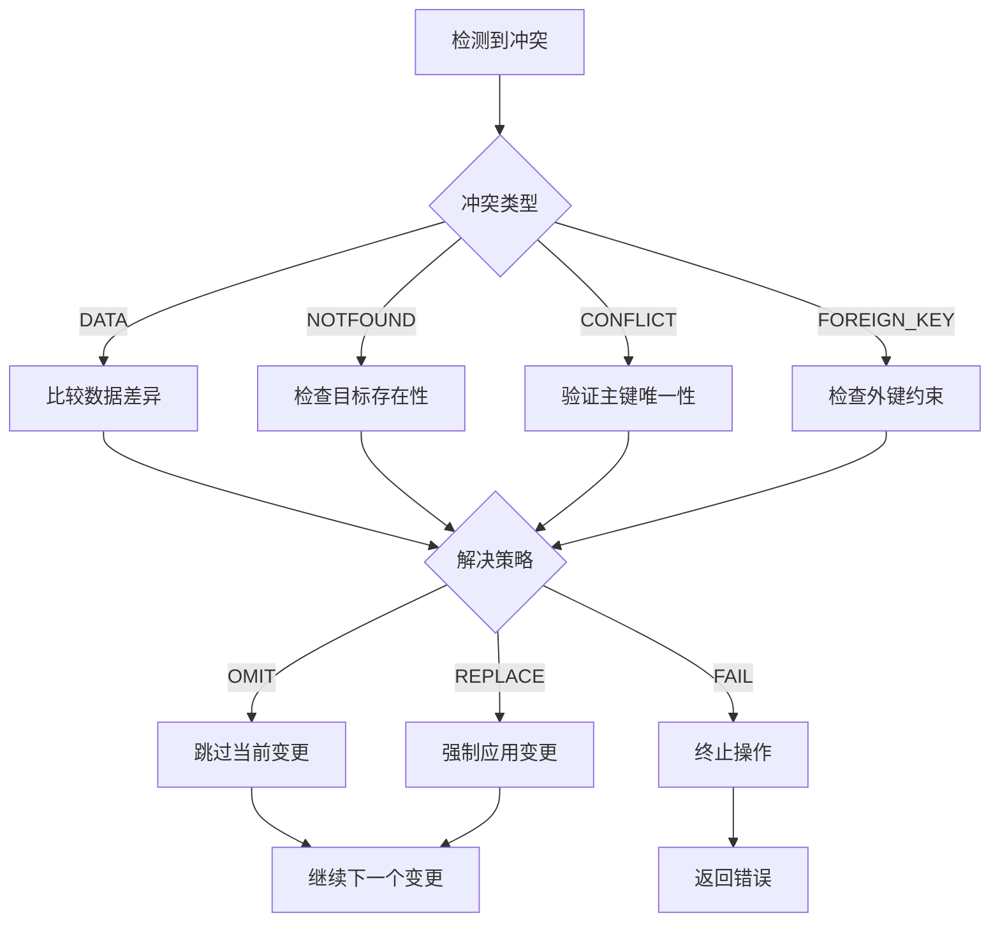

**图表来源**
- [sqlite3session.c](file://ext/session/sqlite3session.c#L5452-L5521)

**章节来源**
- [sqlite3session.c](file://ext/session/sqlite3session.c#L5180-L5600)

### 变更集合并与重置

Session扩展支持变更集的合并、反转和重置功能：

#### 合并算法

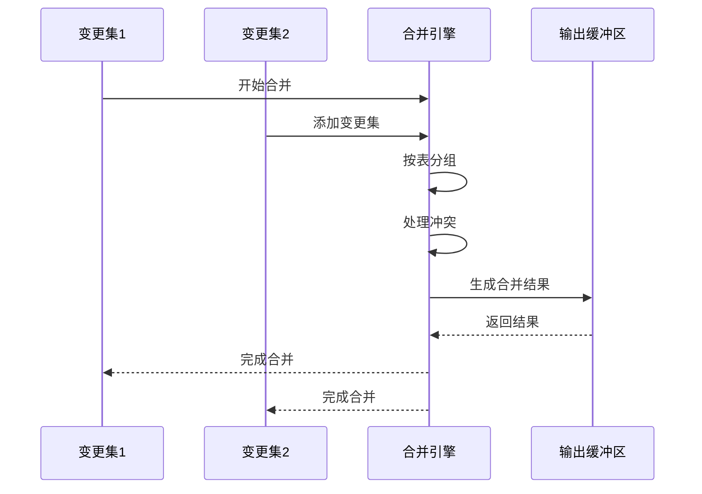

**图表来源**
- [sqlite3session.c](file://ext/session/sqlite3session.c#L4000-L4500)

#### 反转机制

变更集反转功能允许撤销已应用的变更：

```mermaid
graph LR
subgraph "INSERT反转"
A[INSERT] --> B[DELETE]
end
subgraph "DELETE反转"
C[DELETE] --> D[INSERT]
end
subgraph "UPDATE反转"
E[UPDATE(old,new)] --> F[UPDATE(new,old)]
end
```

**图表来源**
- [sqlite3session.c](file://ext/session/sqlite3session.c#L4200-L4400)

**章节来源**
- [sqlite3session.c](file://ext/session/sqlite3session.c#L4000-L4600)

### 与RBU的集成

Session扩展与RBU（Resumable Bulk Update）扩展紧密集成，支持增量更新场景：

#### 集成架构

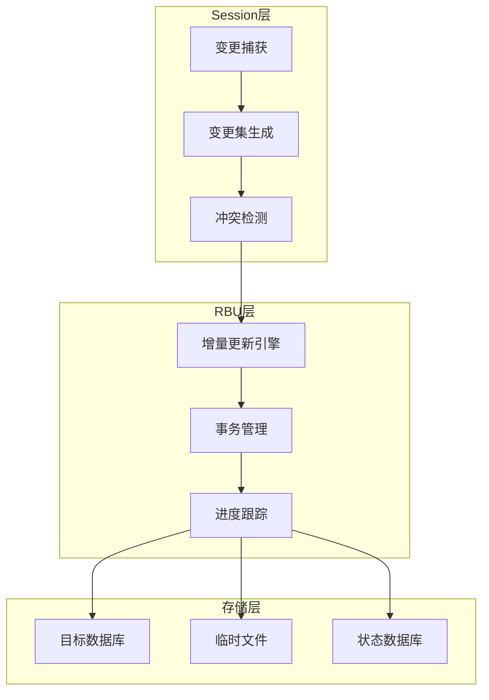

**图表来源**
- [sqlite3rbu.c](file://ext/rbu/sqlite3rbu.c#L1-L100)

#### 使用模式

在分布式系统中，Session扩展通常与RBU配合使用：

1. **变更捕获阶段**：Session扩展记录本地数据库的所有变更
2. **变更集生成**：将捕获的变更序列化为变更集
3. **传输阶段**：通过网络将变更集传输到远程节点
4. **应用阶段**：RBU引擎应用变更集到目标数据库
5. **冲突解决**：处理应用过程中出现的冲突

**章节来源**
- [sqlite3rbu.c](file://ext/rbu/sqlite3rbu.c#L1-L200)
- [sqlite3rbu.h](file://ext/rbu/sqlite3rbu.h#L1-L200)

## 依赖关系分析

Session扩展的依赖关系相对简单但功能完整：

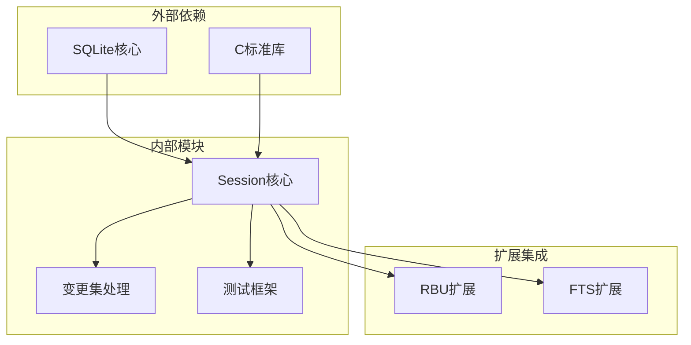

**图表来源**
- [sqlite3session.c](file://ext/session/sqlite3session.c#L1-L30)

### 关键依赖项

| 组件 | 依赖类型 | 描述 |
|------|----------|------|
| SQLite核心 | 必需 | 提供数据库访问和预更新钩子 |
| C标准库 | 必需 | 内存管理和字符串处理 |
| 预更新钩子 | 核心依赖 | 变更捕获的基础机制 |
| 哈希表 | 性能依赖 | 主键索引和冲突检测 |

**章节来源**
- [sqlite3session.c](file://ext/session/sqlite3session.c#L1-L50)

## 性能考虑

Session扩展在设计时充分考虑了性能优化：

### 内存管理

- **动态内存分配**：使用SQLite的内存管理函数
- **缓冲区复用**：避免频繁的内存分配和释放
- **流式处理**：支持大数据集的流式处理

### 哈希性能

- **高效哈希算法**：使用简单的位运算组合
- **负载均衡**：自动调整哈希表大小
- **缓存友好**：优化数据结构布局

### 序列化优化

- **紧凑格式**：最小化存储空间
- **变长编码**：根据数据类型选择编码方式
- **批量处理**：减少系统调用开销

## 故障排除指南

### 常见问题

#### 内存不足

**症状**：`SQLITE_NOMEM`错误
**解决方案**：增加可用内存或启用流式处理

#### 主键冲突

**症状**：`SQLITE_CONSTRAINT`错误
**解决方案**：检查主键定义和数据完整性

#### 变更集损坏

**症状**：`SQLITE_CORRUPT`错误
**解决方案**：验证变更集格式和完整性

### 调试技巧

1. **启用详细日志**：使用调试版本的SQLite
2. **检查内存使用**：监控内存分配和释放
3. **验证数据一致性**：定期检查数据库状态

**章节来源**
- [sqlite3session.c](file://ext/session/sqlite3session.c#L5000-L5200)

## 结论

SQLite Session扩展是一个功能强大且设计精良的数据库变更跟踪和同步框架。它通过以下特性为开发者提供了完整的解决方案：

### 主要优势

1. **精确性**：通过预更新钩子实现精确的变更捕获
2. **效率**：采用优化的二进制格式和流式处理
3. **灵活性**：支持多种冲突解决策略
4. **可扩展性**：与RBU等扩展良好集成

### 应用场景

- **数据同步**：在分布式系统中同步数据库变更
- **备份恢复**：生成数据库变更的增量备份
- **审计追踪**：记录数据库的所有变更历史
- **版本控制**：实现数据库的版本管理和回滚

### 发展方向

随着分布式系统的普及，Session扩展将继续在以下方面发展：

- **更好的并发支持**：优化多线程环境下的性能
- **增强的安全性**：添加数据签名和加密功能
- **更丰富的冲突解决**：支持更复杂的业务规则
- **云原生集成**：更好地支持容器化和微服务架构

Session扩展为SQLite生态系统增添了强大的数据同步能力，是构建现代分布式数据库应用的重要工具。