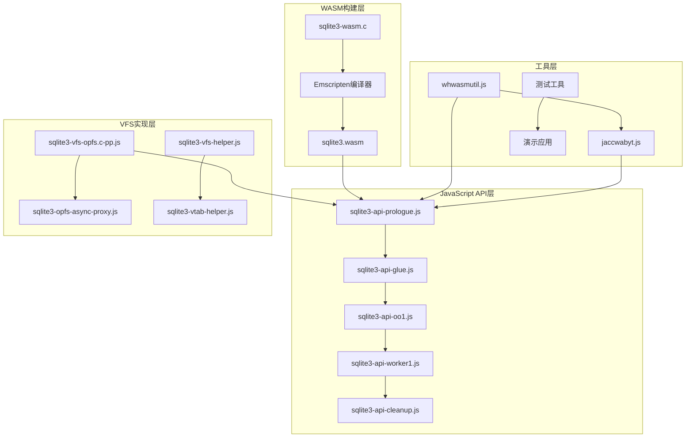
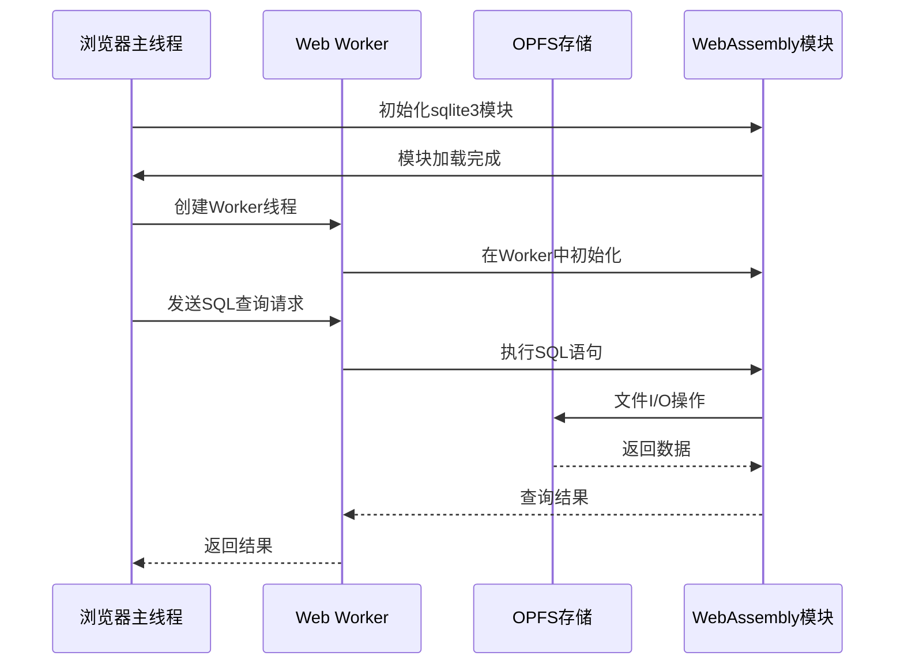
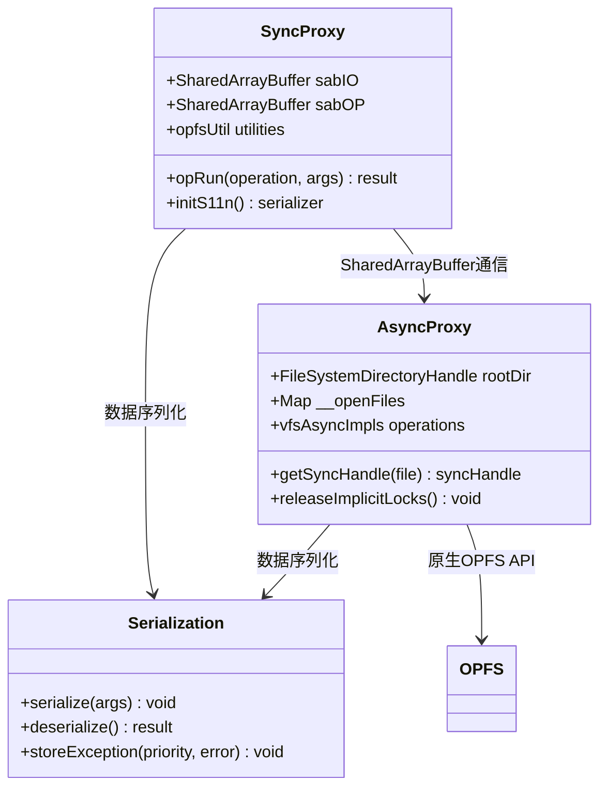
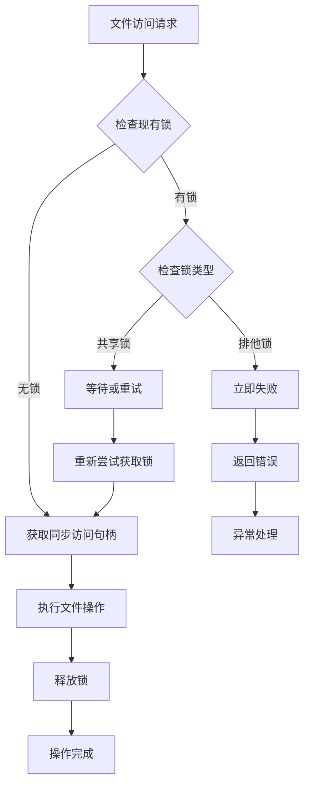
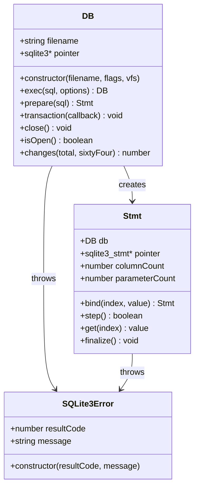
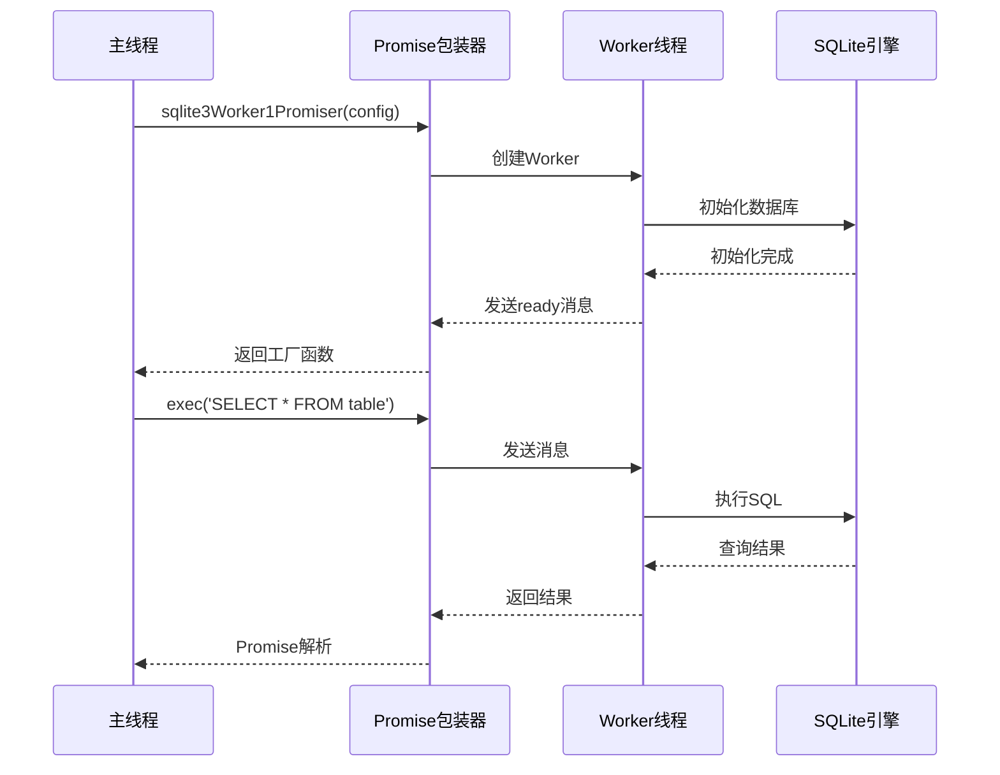
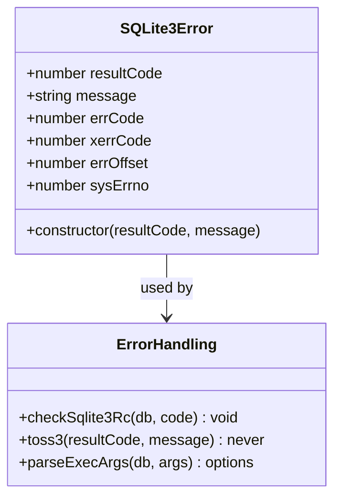
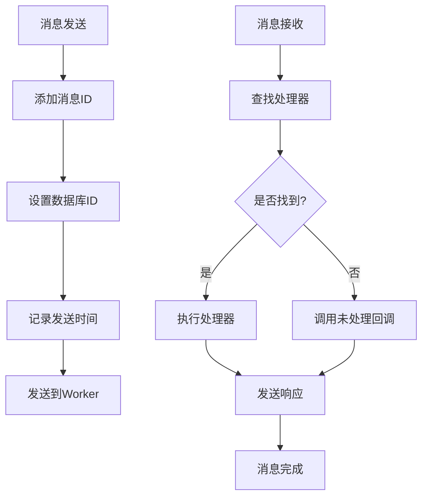
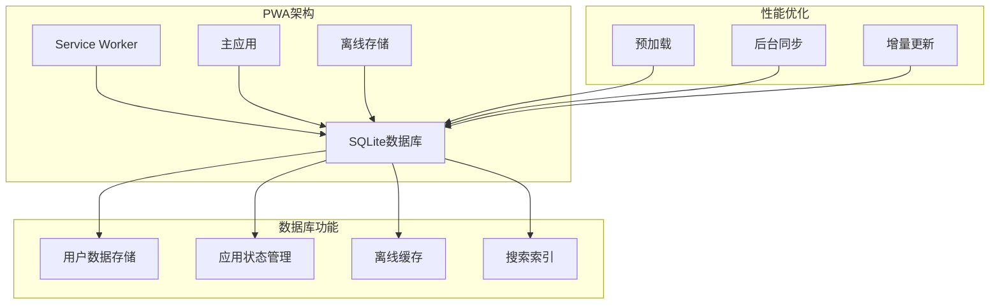

# WebAssembly绑定

<cite>
**本文档引用的文件**
- [ext/wasm/README.md](file://ext/wasm/README.md)
- [ext/wasm/api/README.md](file://ext/wasm/api/README.md)
- [ext/wasm/api/sqlite3-vfs-opfs.c-pp.js](file://ext/wasm/api/sqlite3-vfs-opfs.c-pp.js)
- [ext/wasm/api/sqlite3-opfs-async-proxy.js](file://ext/wasm/api/sqlite3-opfs-async-proxy.js)
- [ext/wasm/api/sqlite3-api-oo1.c-pp.js](file://ext/wasm/api/sqlite3-api-oo1.c-pp.js)
- [ext/wasm/api/sqlite3-api-prologue.js](file://ext/wasm/api/sqlite3-api-prologue.js)
- [ext/wasm/api/sqlite3-worker1-promiser.c-pp.js](file://ext/wasm/api/sqlite3-worker1-promiser.c-pp.js)
- [ext/wasm/demo-123.js](file://ext/wasm/demo-123.js)
- [ext/wasm/index.html](file://ext/wasm/index.html)
</cite>

## 目录
1. [简介](#简介)
2. [项目结构](#项目结构)
3. [核心组件](#核心组件)
4. [架构概览](#架构概览)
5. [详细组件分析](#详细组件分析)
6. [OPFS VFS实现](#opfs-vfs实现)
7. [JavaScript API设计](#javascript-api设计)
8. [异步通信机制](#异步通信机制)
9. [性能考虑](#性能考虑)
10. [调试技巧](#调试技巧)
11. [PWA应用场景](#pwa应用场景)
12. [故障排除指南](#故障排除指南)
13. [结论](#结论)

## 简介

SQLite的WebAssembly绑定是一个复杂的系统，它将C语言编写的SQLite数据库引擎编译为WebAssembly模块，并通过精心设计的JavaScript API提供给浏览器环境使用。该系统的核心创新在于实现了Origin-Private FileSystem (OPFS)虚拟文件系统，使得SQLite能够在浏览器中提供真正的持久化存储能力。

本文档详细介绍了SQLite WebAssembly绑定的技术实现，包括WASM模块的编译过程、JavaScript API的设计模式、OPFS VFS的同步异步代理机制，以及在现代Web应用中的实际应用场景。

## 项目结构

SQLite WebAssembly绑定采用模块化架构，主要分为以下几个层次：



**图表来源**
- [ext/wasm/api/README.md](file://ext/wasm/api/README.md#L1-L50)
- [ext/wasm/README.md](file://ext/wasm/README.md#L1-L100)

**章节来源**
- [ext/wasm/README.md](file://ext/wasm/README.md#L1-L151)
- [ext/wasm/api/README.md](file://ext/wasm/api/README.md#L1-L214)

## 核心组件

### WebAssembly模块编译

SQLite WebAssembly绑定通过Emscripten工具链将C代码编译为高效的WebAssembly模块。编译过程需要特殊的配置来支持浏览器环境中的文件系统操作和内存管理。

### JavaScript API框架

JavaScript API采用分层设计，从底层的C风格API到高级的对象导向接口，提供了灵活的使用方式：

- **C风格API**: 直接映射SQLite的C API
- **对象导向API (OO#1)**: 高级封装，提供更自然的JavaScript接口
- **Worker API**: 支持多线程操作，避免阻塞主线程

### 虚拟文件系统(VFS)抽象

VFS层提供了统一的文件操作接口，支持不同的存储后端：
- 内存存储
- 本地存储(VFS)
- Origin-Private FileSystem (OPFS)
- WASM文件系统(WASMFS)

**章节来源**
- [ext/wasm/api/sqlite3-api-prologue.js](file://ext/wasm/api/sqlite3-api-prologue.js#L1200-L1300)

## 架构概览

SQLite WebAssembly绑定的整体架构体现了现代Web技术的最佳实践：



**图表来源**
- [ext/wasm/api/sqlite3-worker1-promiser.c-pp.js](file://ext/wasm/api/sqlite3-worker1-promiser.c-pp.js#L80-L114)
- [ext/wasm/api/sqlite3-opfs-async-proxy.js](file://ext/wasm/api/sqlite3-opfs-async-proxy.js#L1-L50)

## 详细组件分析

### OPFS VFS实现

OPFS (Origin-Private FileSystem) VFS是SQLite WebAssembly绑定的核心创新，它解决了浏览器环境中持久化存储的关键问题。

#### 同步代理架构

OPFS VFS采用双Worker架构，将同步的SQLite API调用转换为异步的OPFS操作：



**图表来源**
- [ext/wasm/api/sqlite3-vfs-opfs.c-pp.js](file://ext/wasm/api/sqlite3-vfs-opfs.c-pp.js#L200-L300)
- [ext/wasm/api/sqlite3-opfs-async-proxy.js](file://ext/wasm/api/sqlite3-opfs-async-proxy.js#L100-L200)

#### 文件锁定机制

OPFS VFS实现了智能的文件锁定策略，平衡了并发性和性能：



**图表来源**
- [ext/wasm/api/sqlite3-vfs-opfs.c-pp.js](file://ext/wasm/api/sqlite3-vfs-opfs.c-pp.js#L600-L700)

**章节来源**
- [ext/wasm/api/sqlite3-vfs-opfs.c-pp.js](file://ext/wasm/api/sqlite3-vfs-opfs.c-pp.js#L1-L800)
- [ext/wasm/api/sqlite3-opfs-async-proxy.js](file://ext/wasm/api/sqlite3-opfs-async-proxy.js#L1-L400)

### JavaScript API设计

#### 对象导向API (OO#1)

OO#1 API提供了最接近传统SQLite使用的接口，支持声明式编程模式：



**图表来源**
- [ext/wasm/api/sqlite3-api-oo1.c-pp.js](file://ext/wasm/api/sqlite3-api-oo1.c-pp.js#L200-L400)

#### Worker API架构

为了防止数据库操作阻塞主线程，系统提供了基于Web Worker的API：



**图表来源**
- [ext/wasm/api/sqlite3-worker1-promiser.c-pp.js](file://ext/wasm/api/sqlite3-worker1-promiser.c-pp.js#L132-L162)

**章节来源**
- [ext/wasm/api/sqlite3-api-oo1.c-pp.js](file://ext/wasm/api/sqlite3-api-oo1.c-pp.js#L1-L800)
- [ext/wasm/api/sqlite3-worker1-promiser.c-pp.js](file://ext/wasm/api/sqlite3-worker1-promiser.c-pp.js#L1-L350)

## OPFS VFS实现

### 技术挑战与解决方案

OPFS VFS的实现面临三个主要技术挑战：

1. **同步vs异步**: SQLite API是同步的，而OPFS API是异步的
2. **线程安全**: 需要在单线程环境中模拟多线程行为
3. **性能优化**: 最小化跨线程通信开销

#### 共享内存通信

系统使用SharedArrayBuffer实现高效的跨线程通信：

```mermaid
graph LR
subgraph "同步线程"
A[SQLite API调用] --> B[SharedArrayBuffer]
B --> C[Atomics.wait/notify]
end
subgraph "异步Worker"
D[OPFS操作] --> E[SharedArrayBuffer]
E --> F[Atomics.wait/notify]
end
B < --> E
C < --> F
```

**图表来源**
- [ext/wasm/api/sqlite3-vfs-opfs.c-pp.js](file://ext/wasm/api/sqlite3-vfs-opfs.c-pp.js#L250-L300)

#### 序列化协议

自定义的二进制序列化协议确保数据在不同线程间的正确传输：

| 字段 | 类型 | 描述 |
|------|------|------|
| 操作码 | 32位整数 | 标识要执行的操作 |
| 返回值 | 32位整数 | 操作结果代码 |
| 参数数量 | 8位整数 | 后续参数的数量 |
| 参数类型 | 8位整数数组 | 每个参数的类型标识符 |
| 参数数据 | 变长字节流 | 实际的参数值 |

**章节来源**
- [ext/wasm/api/sqlite3-vfs-opfs.c-pp.js](file://ext/wasm/api/sqlite3-vfs-opfs.c-pp.js#L400-L600)
- [ext/wasm/api/sqlite3-opfs-async-proxy.js](file://ext/wasm/api/sqlite3-opfs-async-proxy.js#L400-L600)

## JavaScript API设计

### 错误处理机制

SQLite WebAssembly绑定提供了完善的错误处理体系：



**图表来源**
- [ext/wasm/api/sqlite3-api-prologue.js](file://ext/wasm/api/sqlite3-api-prologue.js#L225-L248)

### 内存管理

系统实现了精细的内存管理策略：

1. **自动垃圾回收**: 使用WeakMap跟踪对象生命周期
2. **手动资源清理**: 提供明确的close/finalize方法
3. **栈分配**: 对于临时操作使用栈分配减少堆压力

**章节来源**
- [ext/wasm/api/sqlite3-api-oo1.c-pp.js](file://ext/wasm/api/sqlite3-api-oo1.c-pp.js#L20-L100)

## 异步通信机制

### 消息传递协议

Worker API使用标准化的消息格式进行通信：



**图表来源**
- [ext/wasm/api/sqlite3-worker1-promiser.c-pp.js](file://ext/wasm/api/sqlite3-worker1-promiser.c-pp.js#L160-L200)

### Promise包装器

Promise包装器简化了异步操作的处理：

```javascript
// 基本用法示例
const promiser = sqlite3Worker1Promiser(config);
promiser('open', {filename: '/mydb.sqlite3'})
  .then(response => {
    return promiser('exec', {
      sql: 'SELECT * FROM users',
      rowMode: 'object'
    });
  })
  .then(response => {
    console.log('查询结果:', response.result);
  })
  .catch(error => {
    console.error('操作失败:', error);
  });
```

**章节来源**
- [ext/wasm/api/sqlite3-worker1-promiser.c-pp.js](file://ext/wasm/api/sqlite3-worker1-promiser.c-pp.js#L80-L150)

## 性能考虑

### 内存使用优化

1. **页面缓存**: 利用SQLite的页面缓存机制
2. **批量操作**: 支持批量插入和更新
3. **连接池**: 复用数据库连接减少开销

### I/O性能优化

1. **预读缓冲**: 智能预读相关页面
2. **写入合并**: 合并多个小写入操作
3. **延迟提交**: 批量提交减少磁盘I/O

### 并发控制

OPFS VFS实现了多层次的并发控制：

- **文件级锁定**: 防止同时修改同一文件
- **页面级锁定**: 细粒度的页面级并发控制
- **乐观并发**: 默认允许并发访问，冲突时重试

## 调试技巧

### 开发者工具集成

系统提供了丰富的调试功能：

```javascript
// 启用SQL跟踪
const db = new sqlite3.oo1.DB(':memory:', 'ct');

// 执行SQL时会输出到控制台
db.exec('SELECT * FROM table'); // 输出: SQL TRACE #1: SELECT * FROM table
```

### 性能监控

内置的性能监控工具帮助识别瓶颈：

```javascript
// 获取OPFS性能指标
const metrics = sqlite3.opfs.metrics;
metrics.dump(); // 输出详细的性能统计
metrics.reset(); // 重置计数器
```

### 错误诊断

详细的错误信息帮助快速定位问题：

```javascript
try {
  db.exec('INVALID SQL');
} catch (e) {
  console.log('错误代码:', e.errCode);
  console.log('扩展错误代码:', e.xerrCode);
  console.log('错误偏移量:', e.errOffset);
}
```

**章节来源**
- [ext/wasm/api/sqlite3-api-prologue.js](file://ext/wasm/api/sqlite3-api-prologue.js#L1250-L1300)

## PWA应用场景

### 渐进式Web应用集成

SQLite WebAssembly绑定特别适合PWA应用：



### 离线优先策略

1. **本地数据存储**: 所有用户数据保存在本地
2. **离线查询**: 即使没有网络也能进行复杂查询
3. **数据同步**: 网络恢复时自动同步更改

### 应用场景示例

- **笔记应用**: 完全离线的笔记编辑和搜索
- **任务管理**: 离线任务创建和同步
- **知识库**: 结构化知识的本地存储和检索
- **数据分析**: 移动设备上的数据分析应用

## 故障排除指南

### 常见问题诊断

#### OPFS不可用

```javascript
// 检查OPFS支持
if (!navigator.storage?.getDirectory) {
  console.error('OPFS不支持此浏览器');
}

// 检查SharedArrayBuffer支持
if (!globalThis.SharedArrayBuffer) {
  console.error('缺少SharedArrayBuffer支持');
}
```

#### Worker加载失败

```javascript
// 检查COOP/COEP头部
fetch(window.location.href)
  .then(response => {
    const coop = response.headers.get('Cross-Origin-Opener-Policy');
    const coep = response.headers.get('Cross-Origin-Embedder-Policy');
    if (!coop || !coep) {
      console.error('缺少COOP/COEP头部');
    }
  });
```

#### 内存不足

```javascript
// 监控内存使用
const heapSize = sqlite3.wasm.heap8().byteLength;
const pointerSize = sqlite3.wasm.ptr.size;

console.log('WASM堆大小:', heapSize, '字节');
console.log('指针大小:', pointerSize, '字节');
```

### 性能优化建议

1. **合理使用索引**: 为频繁查询的字段创建索引
2. **批量操作**: 将多个操作合并为单个事务
3. **连接复用**: 避免频繁打开和关闭数据库连接
4. **内存管理**: 及时释放不需要的Statement对象

**章节来源**
- [ext/wasm/api/sqlite3-vfs-opfs.c-pp.js](file://ext/wasm/api/sqlite3-vfs-opfs.c-pp.js#L70-L120)

## 结论

SQLite WebAssembly绑定代表了现代Web技术的重要突破，它成功地将一个成熟的数据库引擎引入了浏览器环境。通过创新的OPFS VFS实现和精心设计的JavaScript API，开发者现在可以在Web应用中使用功能完整的本地数据库。

该系统的几个关键优势：

1. **真正的持久化**: OPFS提供了可靠的本地存储解决方案
2. **高性能**: 通过WebAssembly和优化的算法实现接近原生的性能
3. **易用性**: 高级API降低了学习成本和开发复杂度
4. **兼容性**: 支持多种部署模式和使用场景

随着Web技术的不断发展，特别是OPFS标准的普及和浏览器性能的提升，SQLite WebAssembly绑定将在未来的Web应用开发中发挥越来越重要的作用。它不仅为现有的Web应用提供了强大的数据存储能力，也为全新的基于Web的应用模式开辟了可能性。