# SQLite扩展模块综合文档

<cite>
**本文档中引用的文件**
- [ext/README.md](file://ext/README.md)
- [ext/fts5/fts5.h](file://ext/fts5/fts5.h)
- [ext/rtree/rtree.h](file://ext/rtree/rtree.h)
- [ext/rbu/sqlite3rbu.h](file://ext/rbu/sqlite3rbu.h)
- [ext/jni/src/c/sqlite3-jni.h](file://ext/jni/src/c/sqlite3-jni.h)
- [ext/wasm/README.md](file://ext/wasm/README.md)
- [ext/misc/README.md](file://ext/misc/README.md)
- [ext/fts5/fts5_main.c](file://ext/fts5/fts5_main.c)
- [ext/rtree/rtree.c](file://ext/rtree/rtree.c)
- [ext/rbu/rbu.c](file://ext/rbu/rbu.c)
</cite>

## 目录
1. [简介](#简介)
2. [扩展模块架构概览](#扩展模块架构概览)
3. [全文搜索扩展（FTS5）](#全文搜索扩展fts5)
4. [空间索引扩展（RTREE）](#空间索引扩展rtree)
5. [增量备份扩展（RBU）](#增量备份扩展rbu)
6. [语言绑定扩展](#语言绑定扩展)
7. [通用扩展模块](#通用扩展模块)
8. [扩展模块编译配置](#扩展模块编译配置)
9. [性能优化考虑](#性能优化考虑)
10. [故障排除指南](#故障排除指南)
11. [总结](#总结)

## 简介

SQLite扩展模块系统为数据库提供了强大的功能增强，涵盖了从全文搜索到空间索引、从增量备份到多语言绑定等多个方面。这些扩展模块以可加载的形式存在，允许开发者根据需要选择性地启用特定功能，从而在保持核心数据库轻量级的同时提供丰富的功能集。

扩展模块系统的核心特点包括：
- **模块化设计**：每个扩展独立开发、测试和维护
- **按需加载**：支持编译时静态链接或运行时动态加载
- **标准化接口**：所有扩展遵循统一的虚拟表和函数接口规范
- **跨平台兼容**：支持多种编程语言和操作系统环境

## 扩展模块架构概览

SQLite扩展模块采用分层架构设计，通过标准化的接口与核心数据库引擎交互。

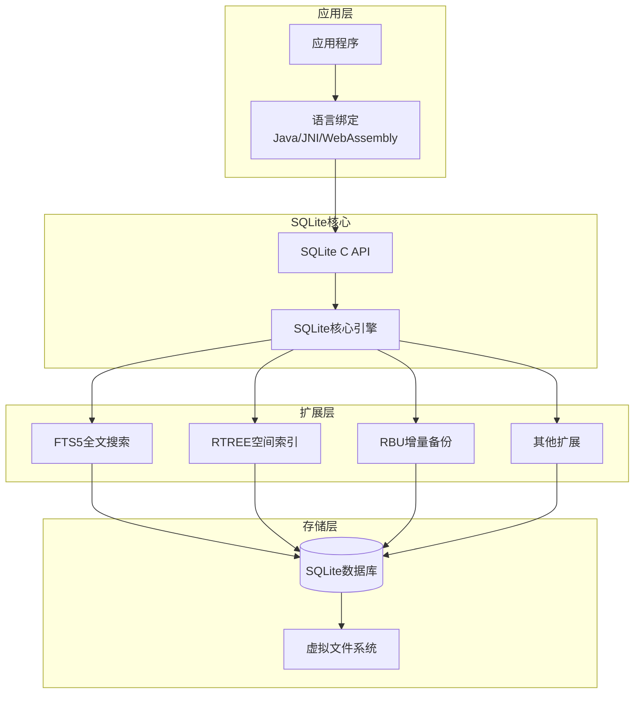

**图表来源**
- [ext/README.md](file://ext/README.md#L1-L9)
- [ext/fts5/fts5.h](file://ext/fts5/fts5.h#L1-L50)

### 扩展分类

扩展模块按功能可分为以下几类：

1. **全文搜索扩展**：提供高级文本搜索功能
2. **空间索引扩展**：支持多维空间数据查询
3. **备份恢复扩展**：提供增量备份和恢复功能
4. **语言绑定扩展**：为不同编程语言提供接口
5. **实用工具扩展**：提供各种辅助功能

**章节来源**
- [ext/README.md](file://ext/README.md#L1-L9)

## 全文搜索扩展（FTS5）

FTS5（Full-Text Search 5）是SQLite的高级全文搜索扩展，提供了比早期版本更强大、更灵活的搜索功能。

### 核心特性

FTS5基于倒排索引机制，支持复杂的查询语法和多种语言处理功能：

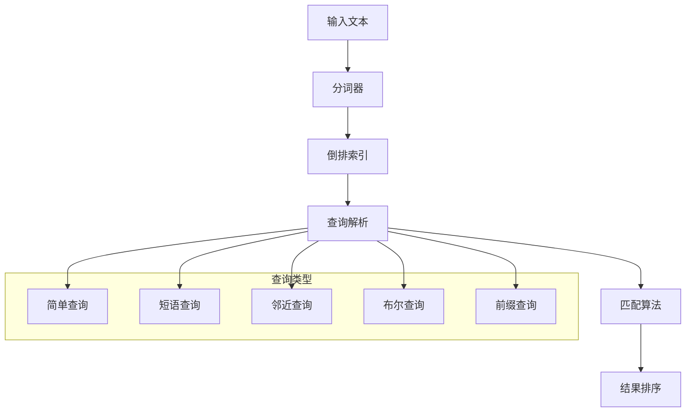

**图表来源**
- [ext/fts5/fts5_main.c](file://ext/fts5/fts5_main.c#L1-L100)
- [ext/fts5/fts5.h](file://ext/fts5/fts5.h#L50-L150)

### MATCH查询语法

FTS5支持丰富的MATCH查询语法：

| 查询类型 | 语法示例 | 功能描述 |
|---------|---------|----------|
| 简单匹配 | `'hello world'` | 匹配包含"hello"和"world"的文档 |
| 短语匹配 | `"hello world"` | 匹配包含"hello world"短语的文档 |
| 邻近查询 | `'hello NEAR world'` | 匹配"hello"和"world"相距一定距离的文档 |
| 布尔查询 | `'hello AND world'` | 匹配同时包含"hello"和"world"的文档 |
| 前缀查询 | `'hel* wor*'` | 匹配以"hel"开头和以"wor"开头的词汇 |
| 列限定查询 | `'title:hello'` | 仅在"title"列中搜索"hello" |

### 分词器系统

FTS5提供了灵活的分词器框架，支持自定义分词逻辑：

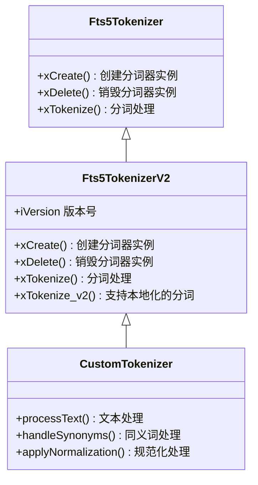

**图表来源**
- [ext/fts5/fts5.h](file://ext/fts5/fts5.h#L600-L750)

### 性能优化

FTS5实现了多种性能优化策略：

1. **前缀索引**：为常用前缀建立专用索引
2. **位置列表压缩**：减少索引存储空间
3. **查询优化**：智能选择最优查询路径
4. **缓存机制**：缓存频繁访问的数据结构

**章节来源**
- [ext/fts5/fts5.h](file://ext/fts5/fts5.h#L1-L755)
- [ext/fts5/fts5_main.c](file://ext/fts5/fts5_main.c#L1-L200)

## 空间索引扩展（RTREE）

RTREE扩展实现了R-tree和R*-tree算法的空间索引结构，专门用于多维空间数据的高效查询。

### 数据结构

RTREE采用层次化的树形结构存储空间数据：

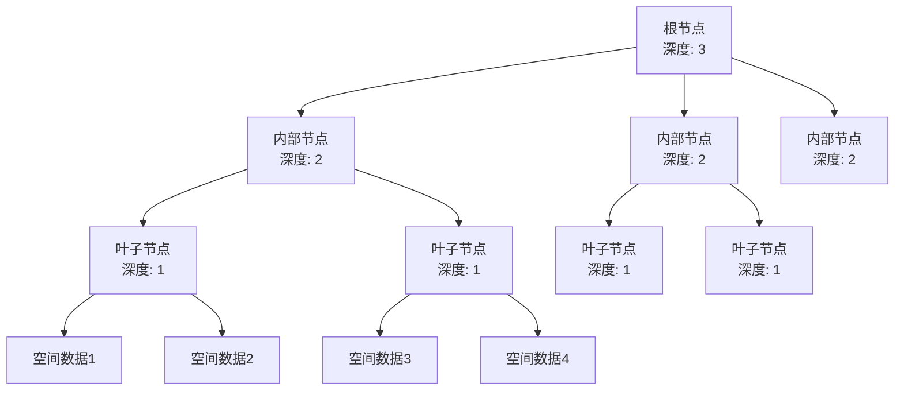

**图表来源**
- [ext/rtree/rtree.c](file://ext/rtree/rtree.c#L1-L100)

### 空间查询算法

RTREE支持多种空间查询操作：

| 查询类型 | 描述 | 时间复杂度 |
|---------|------|-----------|
| 范围查询 | 查找与指定矩形相交的所有对象 | O(log n + k) |
| 最近邻查询 | 查找距离指定点最近的对象 | O(log n + k) |
| 包含查询 | 查找完全包含指定矩形的对象 | O(log n + k) |
| 相交查询 | 查找与指定区域相交的对象 | O(log n + k) |

### 索引维护

RTREE实现了动态平衡算法来维护索引结构：

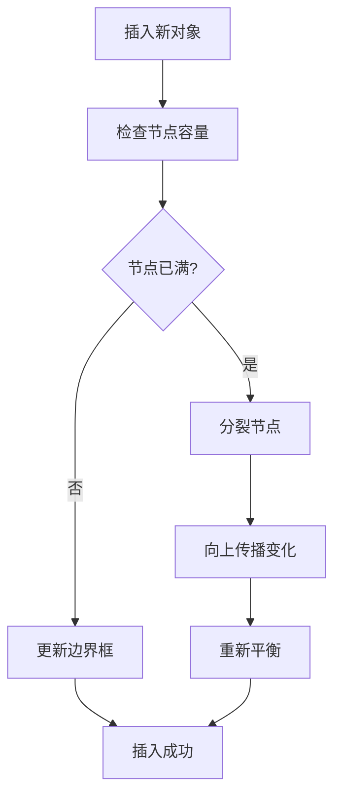

**图表来源**
- [ext/rtree/rtree.c](file://ext/rtree/rtree.c#L2500-L2600)

### 多维支持

RTREE支持最多5维的空间数据：

- **坐标类型**：支持32位整数和32位浮点数
- **边界框表示**：使用最小包围矩形（MBR）
- **查询优化**：基于优先队列的启发式搜索

**章节来源**
- [ext/rtree/rtree.h](file://ext/rtree/rtree.h#L1-L31)
- [ext/rtree/rtree.c](file://ext/rtree/rtree.c#L1-L200)

## 增量备份扩展（RBU）

RBU（Resumable Bulk Update）扩展提供了高效的大型数据库更新和备份功能，支持断点续传和增量操作。

### 工作原理

RBU通过三个阶段完成数据库更新：

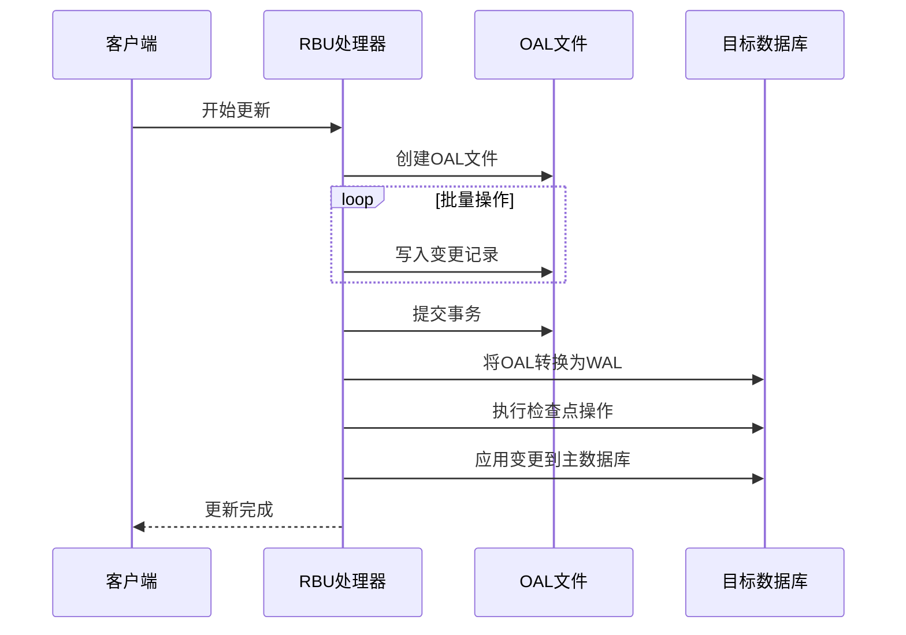

**图表来源**
- [ext/rbu/sqlite3rbu.c](file://ext/rbu/sqlite3rbu.c#L1-L100)

### 数据格式

RBU更新以特殊格式存储在单独的数据库中：

| 表名格式 | 用途 | rbu_control值 |
|---------|------|-------------|
| `data_<table_name>` | 存储表的更新数据 | 0=插入, 1=删除, 2=替换 |
| `rbu_count` | 记录源表行数（可选） | 统计信息 |
| `rbu_state` | 存储更新状态 | 断点续传信息 |

### 恢复机制

RBU提供了完善的错误恢复和断点续传功能：

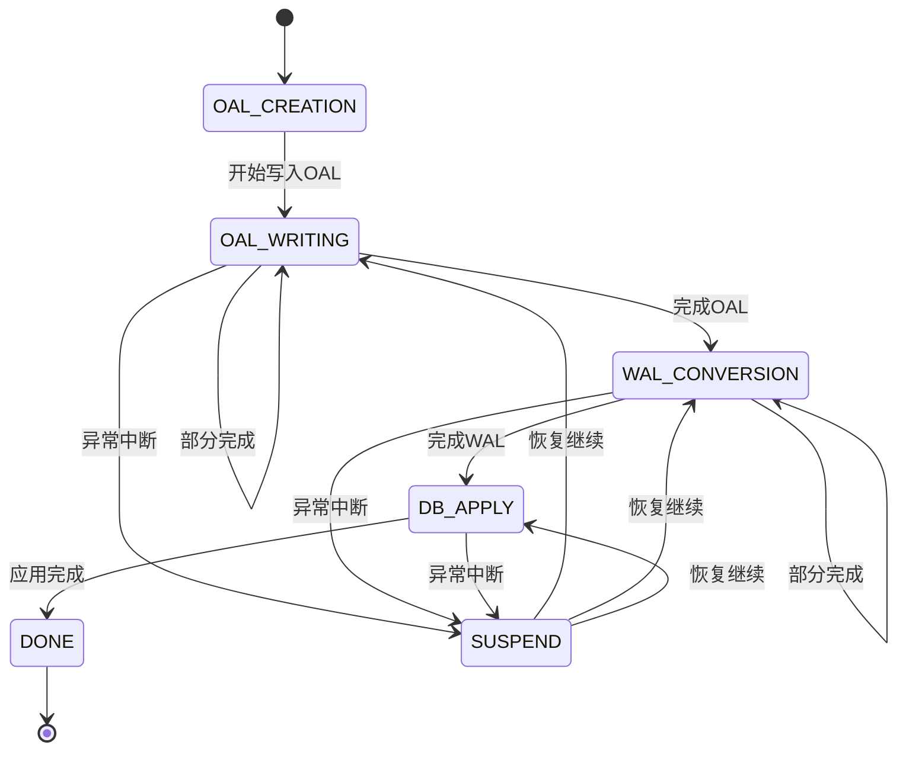

**图表来源**
- [ext/rbu/sqlite3rbu.c](file://ext/rbu/sqlite3rbu.c#L4100-L4200)

### 性能特性

RBU具有以下性能优势：

1. **批量处理**：将多个小操作合并为大批次
2. **内存效率**：控制临时文件大小限制
3. **并发友好**：读取客户端不受影响
4. **原子性保证**：确保更新的一致性

**章节来源**
- [ext/rbu/sqlite3rbu.h](file://ext/rbu/sqlite3rbu.h#L1-L634)
- [ext/rbu/rbu.c](file://ext/rbu/rbu.c#L1-L200)

## 语言绑定扩展

SQLite提供了多种语言绑定，使开发者能够在不同的编程环境中使用SQLite功能。

### Java JNI绑定

Java Native Interface (JNI) 绑定提供了原生的Java接口：

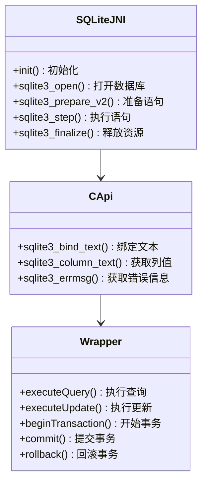

**图表来源**
- [ext/jni/src/c/sqlite3-jni.h](file://ext/jni/src/c/sqlite3-jni.h#L1-L100)

### WebAssembly绑定

WebAssembly (WASM) 绑定使得SQLite可以在浏览器环境中运行：

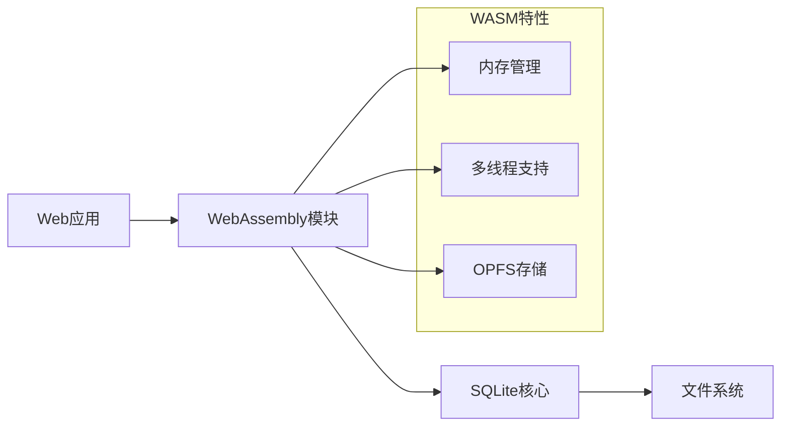

**图表来源**
- [ext/wasm/README.md](file://ext/wasm/README.md#L1-L50)

### 绑定特性对比

| 绑定类型 | 平台支持 | 性能 | 易用性 | 内存管理 |
|---------|---------|------|--------|---------|
| Java JNI | JVM平台 | 高 | 中等 | 自动GC |
| WebAssembly | 浏览器/Node.js | 中等 | 高 | 手动管理 |
| Python C API | Python环境 | 中等 | 高 | 自动GC |
| C/C++直接调用 | 任意C/C++程序 | 最高 | 低 | 手动管理 |

**章节来源**
- [ext/jni/src/c/sqlite3-jni.h](file://ext/jni/src/c/sqlite3-jni.h#L1-L800)
- [ext/wasm/README.md](file://ext/wasm/README.md#L1-L151)

## 通用扩展模块

除了主要的扩展外，SQLite还提供了许多实用的单文件扩展模块。

### 主要扩展模块

| 扩展名称 | 功能描述 | 使用场景 |
|---------|---------|----------|
| `csv.c` | CSV文件虚拟表 | 数据导入导出 |
| `series.c` | 数字序列生成器 | 测试和演示 |
| `json1.c` | JSON处理函数 | JSON数据操作 |
| `rot13.c` | ROT13加密函数 | 字符串处理示例 |
| `sha3.c` | SHA3哈希函数 | 数据完整性验证 |
| `zipfile.c` | ZIP归档虚拟表 | 文件系统操作 |
| `unionvtab.c` | 联合虚拟表 | 大表分割存储 |

### 扩展开发模式

所有通用扩展都遵循相同的开发模式：

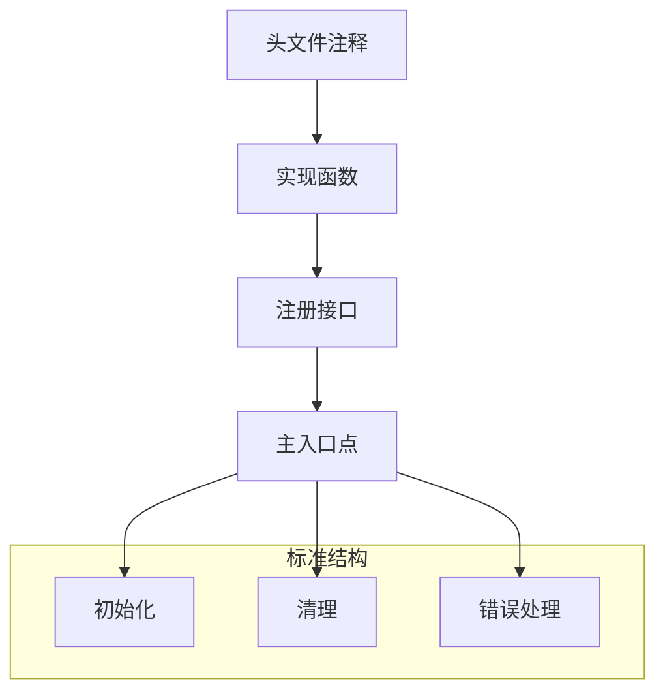

**图表来源**
- [ext/misc/README.md](file://ext/misc/README.md#L1-L51)

**章节来源**
- [ext/misc/README.md](file://ext/misc/README.md#L1-L51)

## 扩展模块编译配置

SQLite扩展模块可以通过多种方式进行编译和配置。

### 编译选项

| 配置选项 | 默认值 | 功能描述 |
|---------|-------|----------|
| `SQLITE_ENABLE_FTS5` | OFF | 启用FTS5全文搜索 |
| `SQLITE_ENABLE_RTREE` | OFF | 启用RTREE空间索引 |
| `SQLITE_ENABLE_RBU` | OFF | 启用RBU增量备份 |
| `SQLITE_ENABLE_JSON1` | ON | 启用JSON1扩展 |
| `SQLITE_ENABLE_LOAD_EXTENSION` | OFF | 启用动态加载扩展 |

### 运行时加载

扩展模块支持运行时动态加载：

```sql
-- 启用扩展加载
.enable_load_extension 1

-- 加载扩展
.load ./fts5
.load ./rtree

-- 使用扩展功能
CREATE VIRTUAL TABLE documents USING fts5(content);
CREATE VIRTUAL TABLE spatial USING rtree(x, y);
```

### 构建系统集成

SQLite扩展可以集成到各种构建系统中：

```cmake
# CMake示例配置
add_library(sqlite_extensions STATIC
    ext/fts5/fts5_main.c
    ext/rtree/rtree.c
    ext/rbu/rbu.c
)

target_compile_definitions(sqlite_extensions PRIVATE
    SQLITE_ENABLE_FTS5
    SQLITE_ENABLE_RTREE
    SQLITE_ENABLE_RBU
)
```

## 性能优化考虑

使用SQLite扩展模块时需要考虑以下性能因素：

### 查询优化

1. **索引策略**：合理使用扩展提供的索引功能
2. **查询计划**：监控和优化查询执行计划
3. **缓存配置**：调整页面缓存大小
4. **连接池**：在多线程环境中使用连接池

### 内存管理

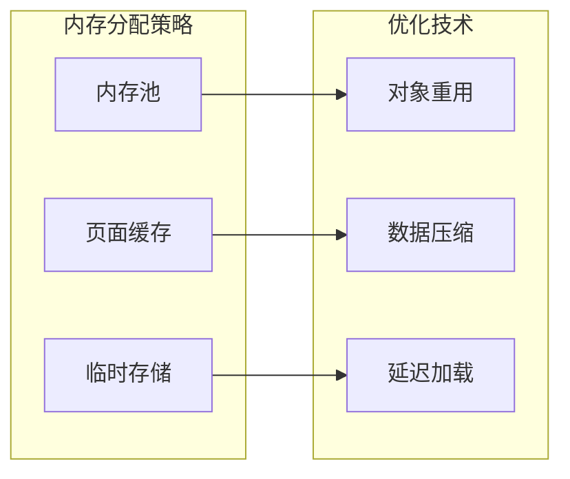

### 并发控制

不同扩展对并发的支持程度不同：

| 扩展类型 | 读锁 | 写锁 | 并发度 |
|---------|------|------|--------|
| FTS5 | 共享 | 排他 | 中等 |
| RTREE | 共享 | 排他 | 中等 |
| RBU | 共享 | 排他 | 低 |
| 通用扩展 | 可配置 | 可配置 | 高 |

## 故障排除指南

### 常见问题及解决方案

#### FTS5相关问题

**问题**：FTS5查询返回空结果
- **原因**：分词器配置错误或索引未正确建立
- **解决**：检查分词器设置和索引完整性

**问题**：FTS5性能下降
- **原因**：查询过于复杂或索引碎片化
- **解决**：简化查询条件或重建索引

#### RTREE相关问题

**问题**：空间查询结果不准确
- **原因**：边界框计算错误或维度不匹配
- **解决**：验证数据格式和查询参数

**问题**：RTREE索引增长过快
- **原因**：频繁的插入删除操作
- **解决**：定期重建索引或使用批量操作

#### RBU相关问题

**问题**：RBU更新失败
- **原因**：目标数据库处于WAL模式或权限不足
- **解决**：切换到回滚模式或检查文件权限

**问题**：RBU断点续传失效
- **原因**：状态数据库损坏或并发修改
- **解决**：清理状态数据库或等待并发操作完成

### 调试技巧

1. **启用调试输出**：使用`SQLITE_DEBUG`编译选项
2. **监控性能指标**：跟踪查询时间和内存使用
3. **日志记录**：记录扩展模块的执行过程
4. **单元测试**：编写针对扩展功能的测试用例

## 总结

SQLite扩展模块系统为数据库应用提供了丰富而强大的功能增强。通过合理选择和配置扩展模块，开发者可以构建高性能、功能完备的应用系统。

### 关键要点

1. **模块化设计**：每个扩展专注于特定功能领域
2. **标准化接口**：统一的虚拟表和函数接口规范
3. **性能优化**：内置多种性能优化策略
4. **跨平台支持**：支持多种编程语言和操作系统
5. **易于集成**：提供多种集成方式和配置选项

### 最佳实践

1. **按需选择**：只启用必要的扩展模块
2. **性能测试**：在生产环境中进行充分测试
3. **监控维护**：定期监控扩展模块的性能和稳定性
4. **文档维护**：保持扩展使用的文档更新

通过深入理解和正确使用SQLite扩展模块，开发者可以充分发挥SQLite数据库的潜力，构建出满足各种复杂需求的应用系统。