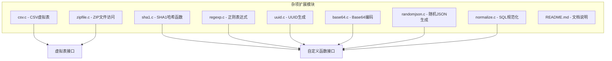
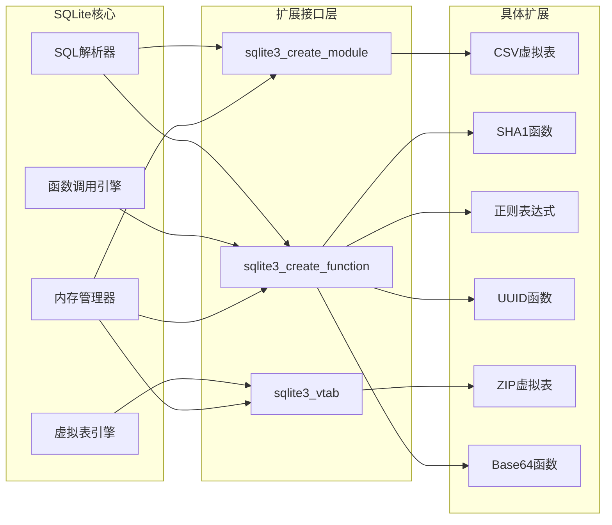
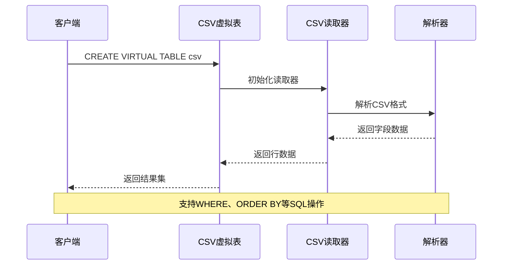
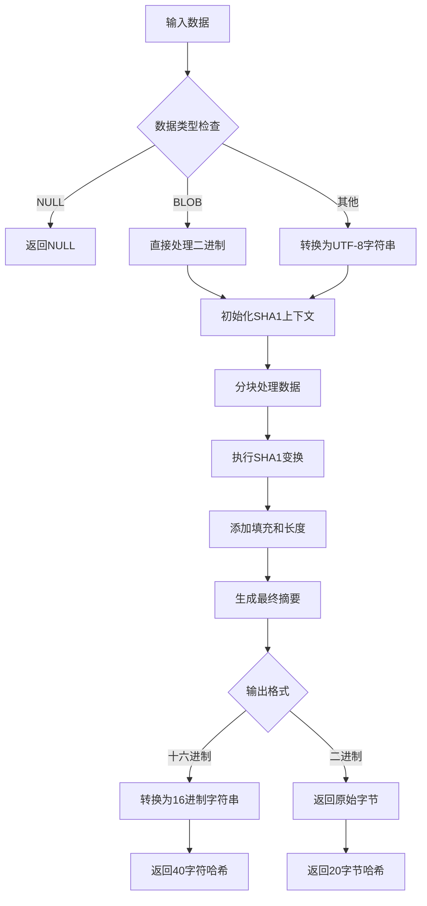
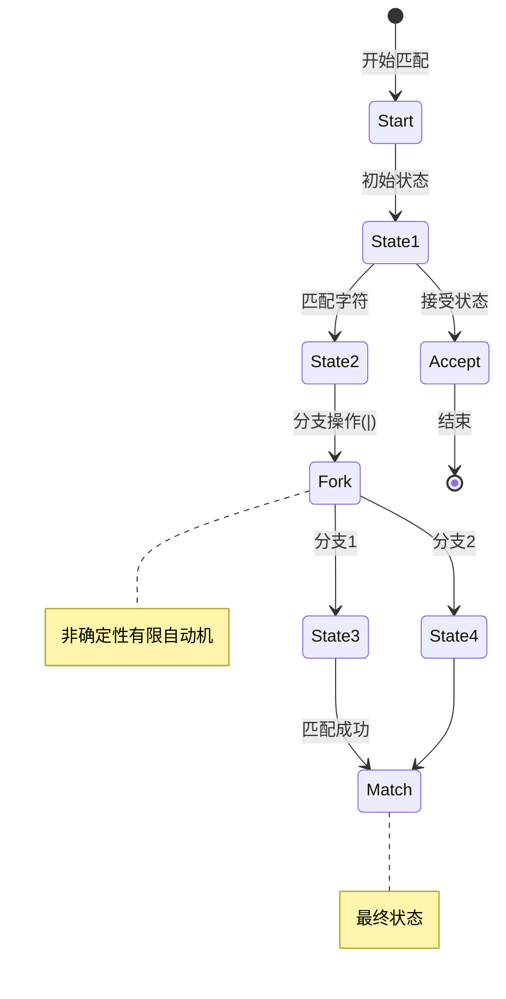
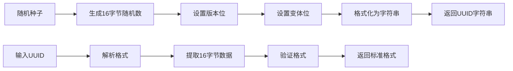
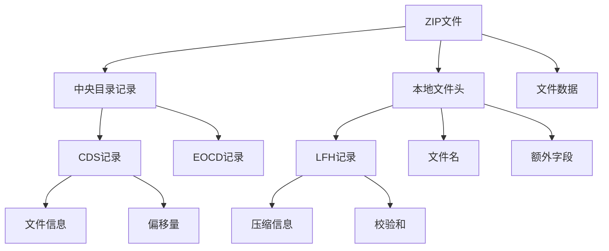
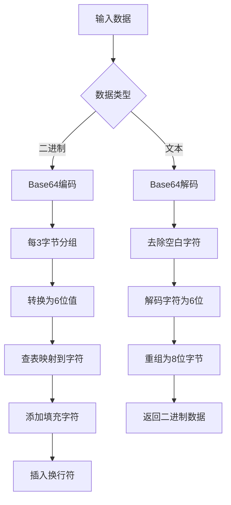
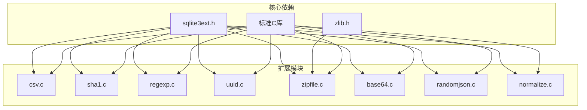

# 杂项扩展模块

<cite>
**本文档中引用的文件**
- [csv.c](file://ext/misc/csv.c)
- [sha1.c](file://ext/misc/sha1.c)
- [regexp.c](file://ext/misc/regexp.c)
- [uuid.c](file://ext/misc/uuid.c)
- [zipfile.c](file://ext/misc/zipfile.c)
- [base64.c](file://ext/misc/base64.c)
- [randomjson.c](file://ext/misc/randomjson.c)
- [normalize.c](file://ext/misc/normalize.c)
- [README.md](file://ext/misc/README.md)
</cite>

## 目录
1. [简介](#简介)
2. [项目结构](#项目结构)
3. [核心组件](#核心组件)
4. [架构概览](#架构概览)
5. [详细组件分析](#详细组件分析)
6. [依赖关系分析](#依赖关系分析)
7. [性能考虑](#性能考虑)
8. [故障排除指南](#故障排除指南)
9. [结论](#结论)

## 简介

SQLite杂项扩展模块是一个包含多种实用功能的扩展集合，涵盖了CSV虚拟表、JSON处理、SHA1哈希计算、正则表达式匹配、UUID生成和ZIP文件访问等核心功能。这些扩展通过自定义函数或虚拟表机制与SQLite核心引擎深度集成，为开发者提供了丰富的数据处理能力。

该模块的设计理念是提供轻量级、高性能的扩展功能，每个扩展都专注于特定的用途，同时保持代码的简洁性和可维护性。所有扩展都遵循SQLite的扩展接口规范，支持动态加载和静态编译两种方式。

## 项目结构

杂项扩展模块位于SQLite源码树的`ext/misc/`目录下，包含以下主要文件：



**图表来源**
- [csv.c](file://ext/misc/csv.c#L1-L50)
- [sha1.c](file://ext/misc/sha1.c#L1-L50)
- [regexp.c](file://ext/misc/regexp.c#L1-L50)
- [uuid.c](file://ext/misc/uuid.c#L1-L50)
- [zipfile.c](file://ext/misc/zipfile.c#L1-L50)
- [base64.c](file://ext/misc/base64.c#L1-L50)

**章节来源**
- [README.md](file://ext/misc/README.md#L1-L51)

## 核心组件

杂项扩展模块包含以下核心组件：

### 虚拟表组件
- **CSV虚拟表**: 将CSV文件映射为可查询的虚拟表
- **ZIP文件虚拟表**: 提供ZIP档案的读写访问接口

### 自定义函数组件
- **SHA1哈希函数**: 实现SHA1算法的字符串和二进制数据哈希
- **正则表达式函数**: 支持POSIX扩展正则表达式的模式匹配
- **UUID生成函数**: RFC-4122标准的UUID生成和转换
- **Base64编码函数**: 二进制数据与Base64文本之间的转换

### 工具组件
- **随机JSON生成器**: 用于测试的伪随机JSON数据生成
- **SQL规范化工具**: SQL查询语句的标准化处理

**章节来源**
- [csv.c](file://ext/misc/csv.c#L1-L100)
- [sha1.c](file://ext/misc/sha1.c#L1-L100)
- [regexp.c](file://ext/misc/regexp.c#L1-L100)
- [uuid.c](file://ext/misc/uuid.c#L1-L100)

## 架构概览

杂项扩展模块采用统一的架构设计，所有扩展都遵循SQLite的扩展接口规范：



**图表来源**
- [csv.c](file://ext/misc/csv.c#L800-L975)
- [sha1.c](file://ext/misc/sha1.c#L350-L410)
- [regexp.c](file://ext/misc/regexp.c#L800-L906)

## 详细组件分析

### CSV虚拟表扩展

CSV虚拟表扩展实现了将CSV文件直接映射为可查询的虚拟表的功能。

#### 核心特性
- **自动列检测**: 支持从CSV文件头部自动推断列名和数量
- **灵活的数据源**: 支持文件路径和内联数据两种输入方式
- **完整的Schema控制**: 允许用户自定义表结构
- **UTF-8支持**: 完整的Unicode字符集支持

#### 实现原理



**图表来源**
- [csv.c](file://ext/misc/csv.c#L400-L600)

#### 使用示例
```sql
-- 基本CSV读取
.load ./csv
CREATE VIRTUAL TABLE temp.csv USING csv(filename='data.csv');
SELECT * FROM csv WHERE column1 = 'value';

-- 自定义Schema
CREATE VIRTUAL TABLE temp.data USING csv(
    filename='../http.log',
    schema='CREATE TABLE x(date, ipaddr, url, referrer, userAgent)'
);

-- 内联数据
CREATE VIRTUAL TABLE temp.inline USING csv(data='col1,col2,col3
row1val1,row1val2,row1val3');
```

**章节来源**
- [csv.c](file://ext/misc/csv.c#L1-L975)

### SHA1哈希扩展

SHA1扩展提供了两个核心函数：`sha1()`和`sha1_query()`，分别用于计算字符串和查询结果的SHA1哈希值。

#### 函数接口
- `sha1(X)`: 计算输入X的SHA1哈希，返回40字符的十六进制字符串
- `sha1b(X)`: 类似sha1()，但返回16字节的二进制形式
- `sha1_query(SQL)`: 执行SQL语句并返回结果的SHA1哈希

#### 算法实现



**图表来源**
- [sha1.c](file://ext/misc/sha1.c#L100-L300)

#### 应用场景
- 数据完整性验证
- 文件指纹生成
- 查询结果缓存键
- 数字签名基础

**章节来源**
- [sha1.c](file://ext/misc/sha1.c#L1-L410)

### 正则表达式扩展

正则表达式扩展实现了POSIX扩展正则表达式的高效匹配功能。

#### 语法支持
- 基本模式: `X*`, `X+`, `X?`, `X{n,m}`
- 分组: `(X)`, `X|Y`
- 锚点: `^`, `$`
- 字符类: `[abc]`, `[^abc]`, `[a-z]`
- 特殊字符: `\b`, `\w`, `\d`, `\s`

#### NFA算法实现



**图表来源**
- [regexp.c](file://ext/misc/regexp.c#L200-L400)

#### 性能优化
- **预编译缓存**: 编译后的正则表达式会被缓存
- **初始前缀优化**: 快速查找字符串开头的匹配
- **复杂度限制**: 防止DoS攻击的正则表达式复杂度控制

**章节来源**
- [regexp.c](file://ext/misc/regexp.c#L1-L906)

### UUID生成扩展

UUID扩展提供了RFC-4122标准的UUID生成功能。

#### 函数接口
- `uuid()`: 生成版本4的随机UUID字符串
- `uuid_str(X)`: 将UUID转换为标准格式的字符串
- `uuid_blob(X)`: 将UUID转换为16字节的二进制数据

#### UUID格式
```
xxxxxxxx-xxxx-Mxxx-Nxxx-xxxxxxxxxxxx
```
- `x`: 16进制数字
- `M`: 版本号（4表示随机UUID）
- `N`: 变体标识（8-9-A-B表示标准变体）

#### 实现细节



**图表来源**
- [uuid.c](file://ext/misc/uuid.c#L150-L234)

**章节来源**
- [uuid.c](file://ext/misc/uuid.c#L1-L234)

### ZIP文件访问扩展

ZIP文件扩展实现了ZIP档案的虚拟表访问功能。

#### 虚拟表结构
```sql
CREATE TABLE zipfile(
    name PRIMARY KEY,      -- 文件名
    mode,                  -- POSIX权限模式
    mtime,                 -- 修改时间戳
    sz,                    -- 原始大小
    rawdata,               -- 原始数据
    data,                  -- 解压缩后数据
    method                 -- 压缩方法
);
```

#### 支持的操作
- **只读访问**: 查询ZIP文件内容
- **数据提取**: 获取文件的解压缩数据
- **元数据查询**: 查看文件属性和统计信息

#### ZIP格式解析



**图表来源**
- [zipfile.c](file://ext/misc/zipfile.c#L100-L300)

**章节来源**
- [zipfile.c](file://ext/misc/zipfile.c#L1-L2288)

### Base64编码扩展

Base64扩展提供了二进制数据与Base64文本之间的双向转换功能。

#### 编码规则
- 每3字节输入产生4字节输出
- 使用标准字符集: A-Z, a-z, 0-9, +, /
- 行长度限制: 每72字符换行
- 填充字符: 使用=进行补位

#### 转换流程



**图表来源**
- [base64.c](file://ext/misc/base64.c#L100-L200)

**章节来源**
- [base64.c](file://ext/misc/base64.c#L1-L298)

## 依赖关系分析

杂项扩展模块的依赖关系相对简单，大多数扩展都是独立的：



**图表来源**
- [csv.c](file://ext/misc/csv.c#L30-L50)
- [sha1.c](file://ext/misc/sha1.c#L20-L40)
- [zipfile.c](file://ext/misc/zipfile.c#L20-L40)

**章节来源**
- [csv.c](file://ext/misc/csv.c#L1-L50)
- [sha1.c](file://ext/misc/sha1.c#L1-L50)
- [regexp.c](file://ext/misc/regexp.c#L1-L50)
- [uuid.c](file://ext/misc/uuid.c#L1-L50)
- [zipfile.c](file://ext/misc/zipfile.c#L1-L50)
- [base64.c](file:///ext/misc/base64.c#L1-L50)

## 性能考虑

### 内存管理
- **动态分配**: 大多数扩展使用SQLite的内存管理器
- **缓冲区优化**: CSV和ZIP扩展使用固定大小的输入缓冲区
- **流式处理**: 正则表达式和Base64使用流式算法减少内存占用

### 算法效率
- **NFA匹配**: 正则表达式使用非确定性有限自动机，避免指数级复杂度
- **分块处理**: SHA1和Base64使用分块算法处理大数据
- **预编译缓存**: 正则表达式编译结果被缓存以提高重复查询性能

### 并发安全
- **线程安全**: 所有扩展都设计为线程安全
- **无状态函数**: 大部分函数不保存状态，支持并发调用
- **资源清理**: 虚拟表提供适当的资源清理机制

## 故障排除指南

### 常见问题

#### CSV虚拟表问题
- **文件权限**: 确保CSV文件具有适当的读取权限
- **编码问题**: 确认CSV文件使用UTF-8编码
- **格式错误**: 检查CSV文件是否符合RFC 4180标准

#### 正则表达式问题
- **复杂度过高**: 避免过于复杂的正则表达式模式
- **内存不足**: 处理大型文本时注意内存使用
- **转义字符**: 正确使用反斜杠进行特殊字符转义

#### SHA1哈希问题
- **输入类型**: 确认输入数据类型正确
- **大文件处理**: 对于超大文件考虑分块处理
- **性能问题**: 在循环中多次调用时考虑缓存结果

#### UUID生成问题
- **随机性**: 确保系统随机数生成器正常工作
- **格式验证**: 输入UUID格式必须符合RFC-4122标准
- **字节序**: 注意网络字节序的转换

### 调试技巧
- **启用调试**: 编译时使用`-DSQLITE_DEBUG`选项
- **错误检查**: 检查SQLite的错误码和错误消息
- **日志记录**: 使用SQLite的日志功能跟踪执行过程

**章节来源**
- [csv.c](file://ext/misc/csv.c#L100-L200)
- [regexp.c](file://ext/misc/regexp.c#L800-L906)
- [sha1.c](file://ext/misc/sha1.c#L300-L410)

## 结论

SQLite杂项扩展模块提供了一套完整而实用的扩展功能集合，涵盖了数据导入导出、数据验证、文本处理等多个方面的需求。每个扩展都经过精心设计，具有以下特点：

### 主要优势
- **功能丰富**: 涵盖了常见的数据处理需求
- **性能优异**: 采用高效的算法和优化策略
- **易于使用**: 提供直观的API和清晰的错误信息
- **标准兼容**: 遵循相关标准和最佳实践

### 应用价值
- **数据集成**: 简化不同数据格式的处理
- **数据验证**: 提供强大的数据完整性检查能力
- **开发效率**: 减少重复开发的工作量
- **系统集成**: 作为SQLite数据库的有力补充

### 发展方向
随着数据处理需求的不断演进，这些扩展可以进一步增强：
- **更多格式支持**: 添加对更多数据格式的支持
- **性能优化**: 进一步提升处理大型数据集的性能
- **功能扩展**: 增加更高级的数据处理功能
- **安全性增强**: 加强安全特性和防护措施

杂项扩展模块展示了SQLite扩展系统的强大能力和灵活性，为构建功能丰富的数据库应用程序提供了坚实的基础。