# SQLite SQL解析器详细技术文档

<cite>
**本文档中引用的文件**
- [parse.y](file://src/parse.y)
- [tokenize.c](file://src/tokenize.c)
- [main.c](file://src/main.c)
- [select.c](file://src/select.c)
- [insert.c](file://src/insert.c)
- [update.c](file://src/update.c)
- [delete.c](file://src/delete.c)
- [prepare.c](file://src/prepare.c)
- [sqliteInt.h](file://src/sqliteInt.h)
- [expr.c](file://src/expr.c)
- [treeview.c](file://src/treeview.c)
- [lemon.c](file://tool/lemon.c)
- [lempar.c](file://tool/lempar.c)
</cite>

## 目录
1. [简介](#简介)
2. [项目架构概览](#项目架构概览)
3. [词法分析器（Tokenize）](#词法分析器tokenize)
4. [语法分析器（Parser）](#语法分析器parser)
5. [语法树结构](#语法树结构)
6. [主要SQL语句解析](#主要sql语句解析)
7. [错误处理与恢复机制](#错误处理与恢复机制)
8. [自定义语法扩展指南](#自定义语法扩展指南)
9. [性能优化考虑](#性能优化考虑)
10. [故障排除指南](#故障排除指南)
11. [总结](#总结)

## 简介

SQLite SQL解析器是一个复杂的编译器前端系统，负责将SQL文本转换为内部表示的数据结构。该解析器采用递归下降解析算法，通过Lemon语法分析器生成器实现，能够处理完整的SQL语言规范。

解析器的核心功能包括：
- 将SQL文本分解为标记（Token）
- 根据语法规则构建抽象语法树（AST）
- 验证语法正确性
- 生成内部数据结构供后续优化和执行使用

## 项目架构概览

SQLite解析器采用分层架构设计，主要包含以下组件：

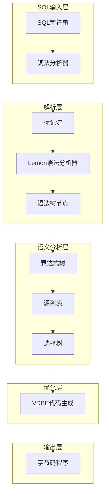

**图表来源**
- [parse.y](file://src/parse.y#L1-L50)
- [tokenize.c](file://src/tokenize.c#L1-L50)

**章节来源**
- [parse.y](file://src/parse.y#L1-L100)
- [main.c](file://src/main.c#L1-L100)

## 词法分析器（Tokenize）

### 标记化流程

词法分析器负责将SQL输入字符串分解为有意义的标记序列。其核心算法基于状态机，通过字符分类快速识别不同类型的标记。

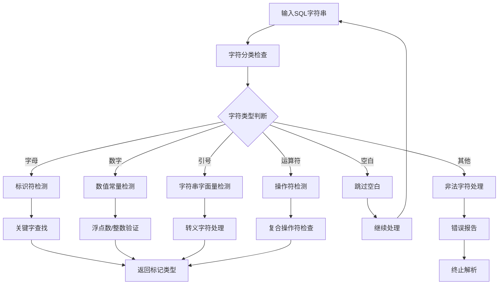

**图表来源**
- [tokenize.c](file://src/tokenize.c#L20-L100)

### 字符分类系统

SQLite使用预计算的字符分类表来加速标记识别：

| 分类代码 | 描述 | 示例字符 |
|---------|------|----------|
| CC_KYWD0/CC_KYWD | 关键字首字母及后续字符 | x, a-z, _ |
| CC_DIGIT | 数字字符 | 0-9 |
| CC_QUOTE | 引号字符 | ', ", ` |
| CC_SPACE | 空白字符 | 空格, 制表符, 换行 |
| CC_MINUS | 减号或注释开始 | -, -- |
| CC_SLASH | 除号或注释开始 | /, /* */
| CC_EQ/CC_LT/CC_GT | 比较操作符 | =, <, > |

### 标记类型定义

SQLite定义了丰富的标记类型来表示不同的SQL元素：

| 标记类型 | 值范围 | 描述 |
|---------|--------|------|
| TK_ID | 1-256 | 标识符（表名、列名等） |
| TK_STRING | 257 | 字符串字面量 |
| TK_FLOAT | 258 | 浮点数字面量 |
| TK_INTEGER | 259 | 整数字面量 |
| TK_VARIABLE | 260 | 参数变量 |
| TK_BLOB | 261 | 二进制字面量 |
| TK_ILLEGAL | 262 | 非法字符 |

**章节来源**
- [tokenize.c](file://src/tokenize.c#L1-L200)

## 语法分析器（Parser）

### Lemon语法分析器

SQLite使用Lemon语法分析器生成器，这是一种LALR(1)解析器生成工具。Lemon将YACC风格的语法规则转换为高效的C代码。

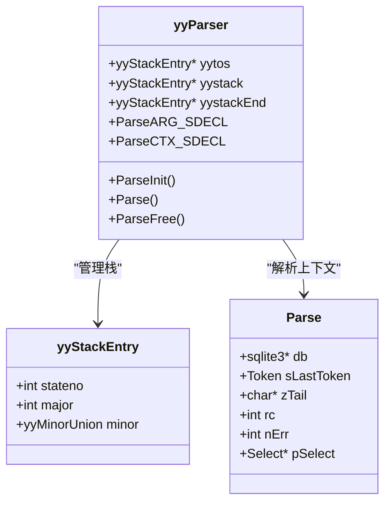

**图表来源**
- [lempar.c](file://tool/lempar.c#L223-L246)
- [sqliteInt.h](file://src/sqliteInt.h#L3957-L3986)

### 语法规则结构

解析器的语法规则定义在parse.y文件中，采用类似BNF的语法：

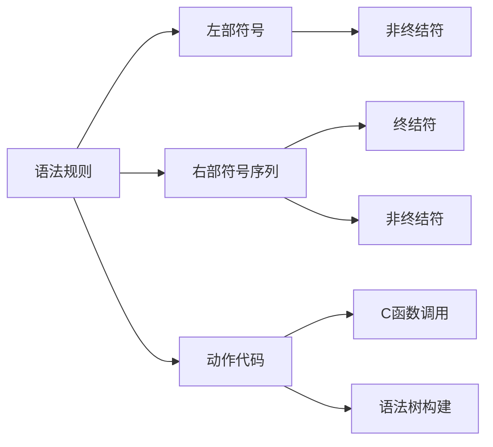

**图表来源**
- [parse.y](file://src/parse.y#L350-L400)

### 解析器初始化

解析器的初始化过程包括内存分配、栈设置和上下文配置：

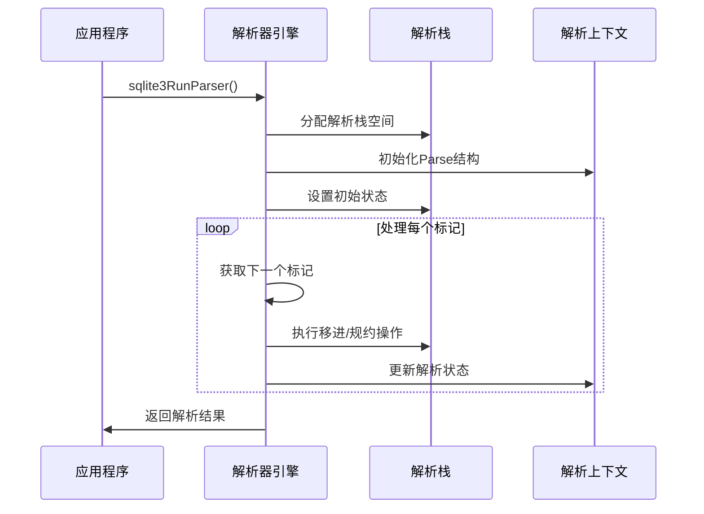

**图表来源**
- [tokenize.c](file://src/tokenize.c#L612-L650)

**章节来源**
- [parse.y](file://src/parse.y#L800-L1000)
- [lempar.c](file://tool/lempar.c#L341-L381)

## 语法树结构

### 表达式树（Expression Tree）

SQLite使用层次化的表达式树结构来表示SQL表达式。每个表达式节点都是一个Expr结构体的实例。

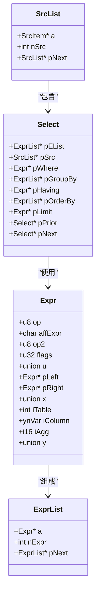

**图表来源**
- [sqliteInt.h](file://src/sqliteInt.h#L2967-L3100)

### 节点类型和操作码

表达式树中的每个节点都有特定的操作码（op字段）来表示其类型：

| 操作码 | 类型 | 描述 |
|--------|------|------|
| TK_INTEGER | 字面量 | 整数常量 |
| TK_FLOAT | 字面量 | 浮点数常量 |
| TK_STRING | 字面量 | 字符串常量 |
| TK_BLOB | 字面量 | 二进制数据 |
| TK_VARIABLE | 字面量 | 参数变量 |
| TK_COLUMN | 引用 | 列引用 |
| TK_AGG_FUNCTION | 函数 | 聚合函数 |
| TK_FUNCTION | 函数 | 普通函数 |
| TK_SELECT | 子查询 | SELECT表达式 |
| TK_IN | 运算符 | IN运算符 |
| TK_AND/TK_OR | 运算符 | 逻辑运算符 |
| TK_EQ/TK_LT/TK_GT | 运算符 | 比较运算符 |

### 语法树构建过程

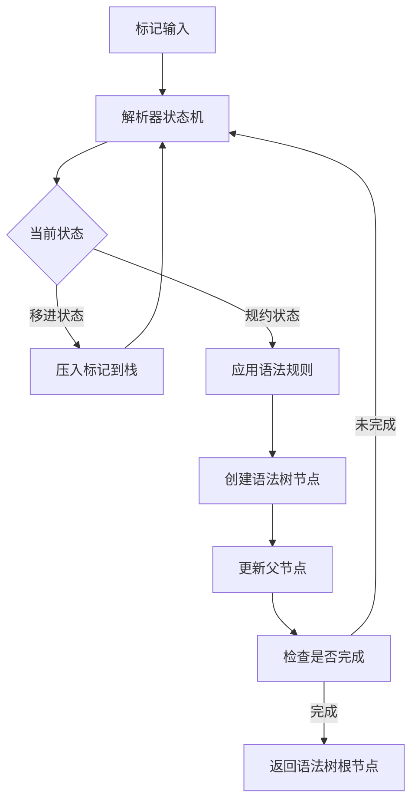

**图表来源**
- [expr.c](file://src/expr.c#L909-L987)

**章节来源**
- [sqliteInt.h](file://src/sqliteInt.h#L2967-L3100)
- [expr.c](file://src/expr.c#L989-L1027)

## 主要SQL语句解析

### SELECT语句解析

SELECT语句是最复杂的SQL语句之一，涉及多个子句的解析和组合。

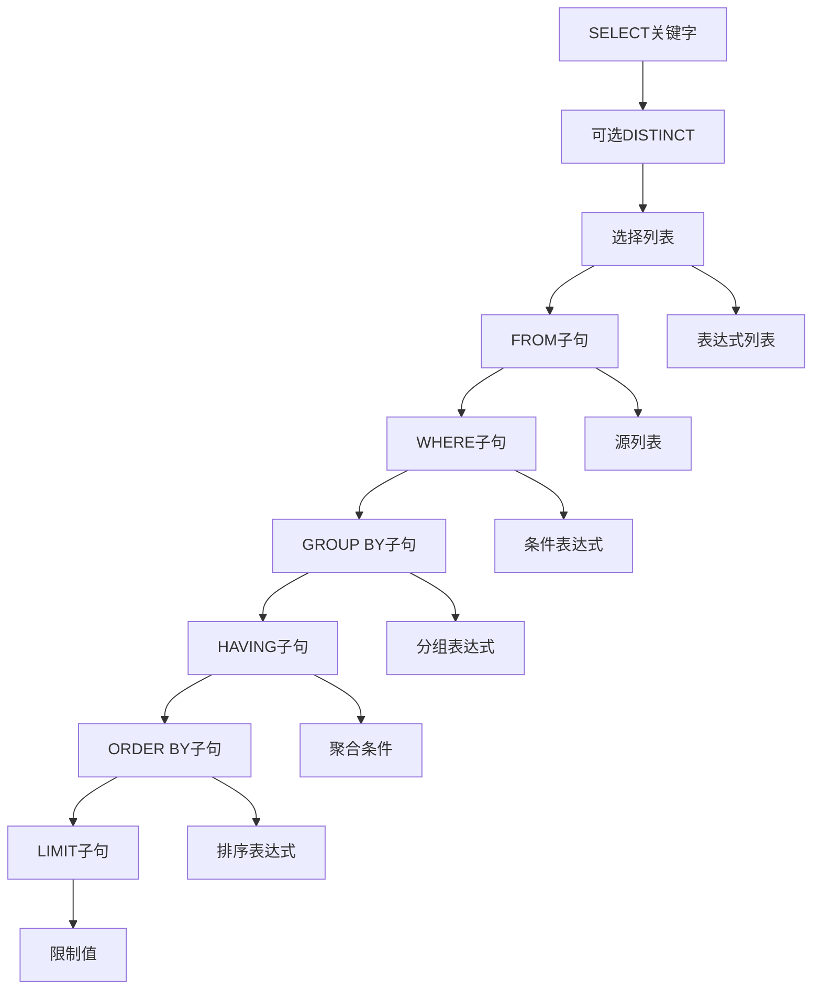

**图表来源**
- [parse.y](file://src/parse.y#L600-L700)

### INSERT语句解析

INSERT语句解析包括目标表、列列表和值表达式的处理：

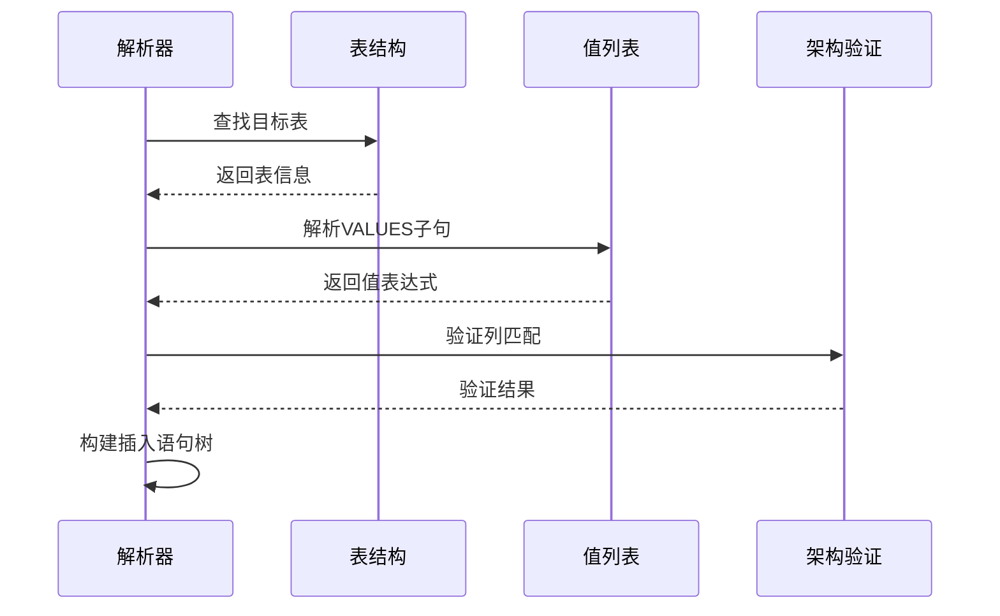

**图表来源**
- [insert.c](file://src/insert.c#L1-L100)

### UPDATE语句解析

UPDATE语句需要解析目标表、SET子句和WHERE子句：

| 组件 | 解析步骤 | 输出结构 |
|------|----------|----------|
| 表名 | 查找表定义 | SrcList |
| SET子句 | 解析赋值表达式 | ExprList |
| WHERE子句 | 解析条件表达式 | Expr |
| ORDER BY/LIMIT | 可选子句处理 | ExprList/Expr |

### DELETE语句解析

DELETE语句相对简单，主要涉及目标表和WHERE条件：


**图表来源**
- [delete.c](file://src/delete.c#L1-L100)

**章节来源**
- [select.c](file://src/select.c#L1-L200)
- [insert.c](file://src/insert.c#L1-L200)
- [update.c](file://src/update.c#L1-L200)
- [delete.c](file://src/delete.c#L1-L200)

## 错误处理与恢复机制

### 语法错误检测

SQLite解析器实现了完善的错误检测和报告机制：

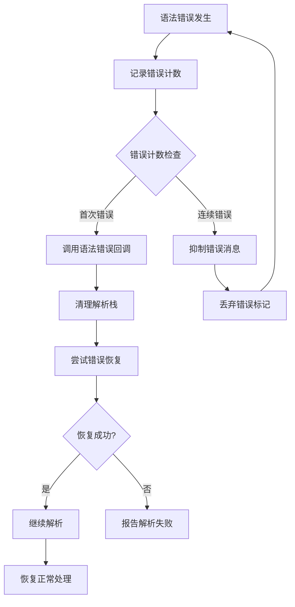

**图表来源**
- [lempar.c](file://tool/lempar.c#L779-L820)

### 错误恢复策略

SQLite采用多种错误恢复策略来提高解析鲁棒性：

| 策略 | 实现方式 | 适用场景 |
|------|----------|----------|
| 标记丢弃 | 忽略错误标记，继续处理后续标记 | 单个标记错误 |
| 状态回退 | 回退到安全状态，重新开始解析 | 严重语法错误 |
| 上下文恢复 | 保存和恢复解析上下文 | 复杂语句错误 |
| 部分解析 | 在错误处停止，返回已解析部分 | 不完整SQL语句 |

### 错误消息格式化

错误消息包含丰富的上下文信息：

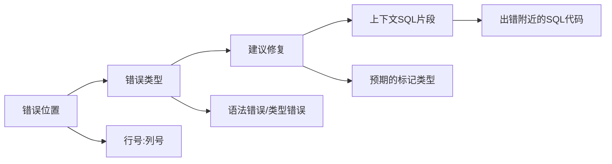

**章节来源**
- [lempar.c](file://tool/lempar.c#L964-L1085)

## 自定义语法扩展指南

### 添加新的SQL关键字

要添加新的SQL关键字，需要修改以下文件：

1. **tokenize.c**: 更新字符分类表
2. **parse.y**: 添加语法规则
3. **keywordhash.h**: 更新关键字哈希表

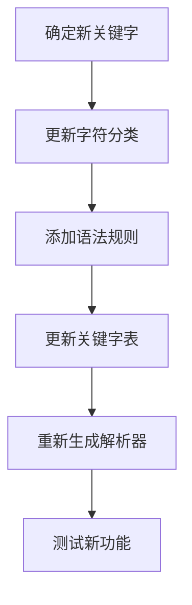

### 扩展现有语法规则

扩展现有语法规则需要遵循以下步骤：

1. **分析现有规则**: 理解当前语法规则的结构
2. **定义新规则**: 在parse.y中添加新的产生式
3. **实现动作代码**: 编写相应的C代码来处理新规则
4. **测试验证**: 确保新规则正确工作且不破坏现有功能

### 性能优化技巧

| 技巧 | 描述 | 效果 |
|------|------|------|
| 规则优先级调整 | 将常用规则放在前面 | 提高解析效率 |
| 左递归消除 | 避免左递归导致的栈溢出 | 改善解析稳定性 |
| 标记缓存 | 缓存频繁使用的标记 | 减少重复计算 |
| 语法简化 | 合并相似的语法规则 | 减小解析器大小 |

**章节来源**
- [parse.y](file://src/parse.y#L200-L300)

## 性能优化考虑

### 解析器性能特征

SQLite解析器在设计时充分考虑了性能因素：

```mermaid
graph TB
subgraph "内存使用优化"
A[紧凑的节点结构] --> B[减少内存占用]
C[共享常量池] --> D[避免重复存储]
E[延迟计算] --> F[按需分配内存]
end
subgraph "时间复杂度优化"
G[线性扫描] --> H[O(n)时间复杂度]
I[状态机设计] --> J[确定性解析]
K[缓存机制] --> L[避免重复计算]
end
subgraph "并发性能"
M[无锁设计] --> N[多线程安全]
O[局部状态] --> P[减少竞争]
Q[原子操作] --> R[高效同步]
end
```

### 内存管理策略

解析器采用多种内存管理策略来优化性能：

| 策略 | 实现方式 | 优势 |
|------|----------|------|
| 对象池 | 预分配常用对象 | 减少动态分配开销 |
| 共享引用 | 多处使用相同常量 | 节省内存空间 |
| 延迟释放 | 批量释放对象 | 减少碎片化 |
| 内存对齐 | 优化内存访问 | 提高缓存命中率 |

### 解析速度优化


## 故障排除指南

### 常见解析错误

| 错误类型 | 症状 | 解决方案 |
|----------|------|----------|
| 语法错误 | unexpected token | 检查SQL语法，确保使用正确的关键字和标点 |
| 标识符错误 | unrecognized token | 验证表名、列名是否存在，注意大小写敏感性 |
| 类型错误 | incompatible types | 检查表达式中各部分的数据类型是否兼容 |
| 语法不完整 | incomplete input | 确保SQL语句以分号结尾或正确处理多语句 |

### 调试技巧

1. **启用解析跟踪**: 使用SQLITE_ParserTrace标志查看解析过程
2. **检查标记流**: 验证词法分析器是否正确识别所有标记
3. **验证语法树**: 使用调试器检查生成的语法树结构
4. **测试边界情况**: 验证复杂嵌套结构和边缘情况的处理

### 性能问题诊断

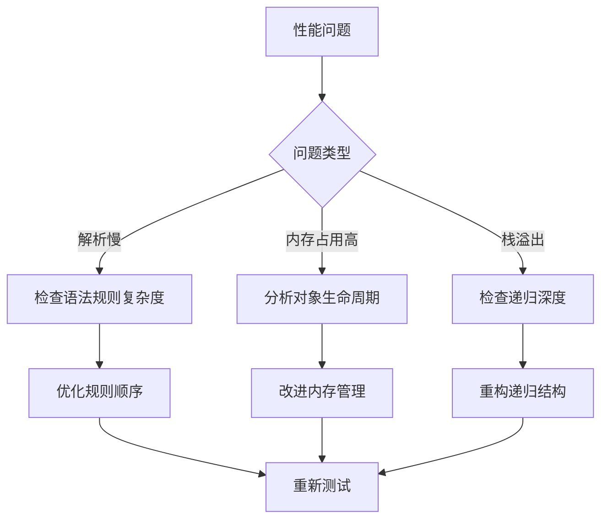

**章节来源**
- [lempar.c](file://tool/lempar.c#L779-L820)

## 总结

SQLite SQL解析器是一个精心设计的编译器前端系统，具有以下特点：

### 核心优势

1. **高性能**: 采用LALR(1)解析算法，支持线性时间复杂度
2. **完整性**: 支持完整的SQL语言规范，包括标准和扩展特性
3. **可靠性**: 完善的错误检测和恢复机制
4. **可扩展性**: 易于添加新的语法特性和优化

### 设计原则

- **简洁性**: 最小化解析器复杂度，便于维护和理解
- **效率性**: 优化内存使用和解析速度
- **健壮性**: 强大的错误处理和恢复能力
- **兼容性**: 保持与标准SQL的良好兼容性

### 应用价值

SQLite解析器不仅为数据库引擎提供了强大的SQL处理能力，也为其他需要SQL解析的应用程序提供了优秀的参考实现。其模块化设计、清晰的接口和完善的错误处理机制使其成为学习编译器设计和实现的优秀案例。

通过深入理解SQLite解析器的工作原理，开发者可以更好地利用SQLite的功能，同时也能从中获得构建类似系统的宝贵经验。