# DELETE语句AST构建

<cite>
**本文档引用的文件**
- [src/delete.c](file://src/delete.c)
- [src/parse.y](file://src/parse.y)
- [src/expr.c](file://src/expr.c)
- [src/sqliteInt.h](file://src/sqliteInt.h)
- [src/treeview.c](file://src/treeview.c)
- [src/whereexpr.c](file://src/whereexpr.c)
- [src/where.c](file://src/where.c)
- [src/insert.c](file://src/insert.c)
- [src/update.c](file://src/update.c)
</cite>

## 目录
1. [简介](#简介)
2. [DELETE语法规则与AST构建流程](#delete语法规则与ast构建流程)
3. [Delete结构体核心组成](#delete结构体核心组成)
4. [表达式解析器在WHERE条件树中的作用](#表达式解析器在where条件树中的作用)
5. [ORDER BY和LIMIT子句处理机制](#orderby和limit子句处理机制)
6. [简单DELETE与复杂WHERE条件的AST构造对比](#简单delete与复杂where条件的ast构造对比)
7. [DELETE语句与其他DML语句的AST结构对比](#delete语句与其他dml语句的ast结构对比)
8. [性能考虑与优化策略](#性能考虑与优化策略)
9. [故障排除指南](#故障排除指南)
10. [总结](#总结)

## 简介

DELETE语句是SQLite数据库管理系统中的重要数据操作语言(DML)语句之一，用于从指定表中删除符合条件的记录。在SQLite的编译器架构中，DELETE语句的解析和AST(抽象语法树)构建是一个复杂而精密的过程，涉及词法分析、语法分析、语义分析等多个阶段。

本文档深入探讨了SQLite中DELETE语句AST构建的完整流程，重点分析了parse.y中的语法规则如何调用delete.c中的sqlite3DeleteFrom()函数来创建AST节点，以及Delete结构体的核心组成部分和处理机制。

## DELETE语法规则与AST构建流程

### 语法解析器规则定义

SQLite使用Lemon语法分析器生成器来处理SQL语句的解析。在parse.y文件中，DELETE语句的语法规则定义如下：

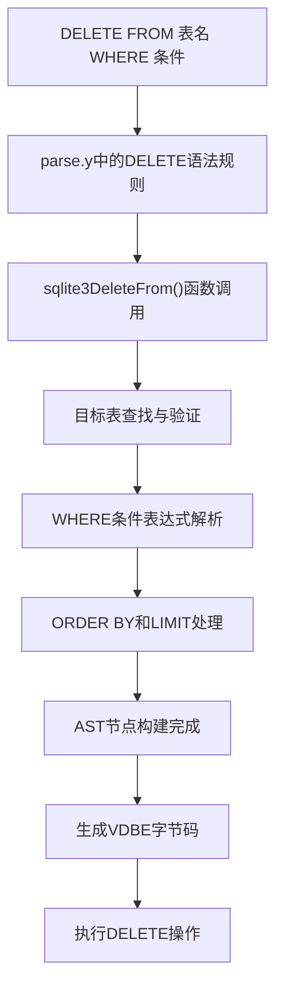

**图表来源**
- [src/parse.y](file://src/parse.y#L940-L974)

### 语法规则实现细节

DELETE语句的语法规则根据是否启用更新/删除限制功能有不同的实现：

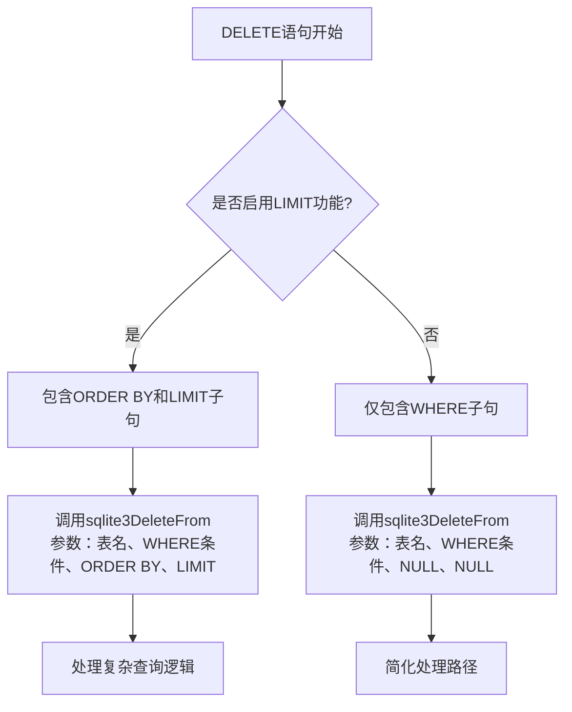

**图表来源**
- [src/parse.y](file://src/parse.y#L940-L974)

**段落来源**
- [src/parse.y](file://src/parse.y#L940-L974)

## Delete结构体核心组成

### 核心字段分析

DELETE语句的AST构建过程中，sqlite3DeleteFrom()函数接收五个主要参数，这些参数构成了Delete操作的核心信息：

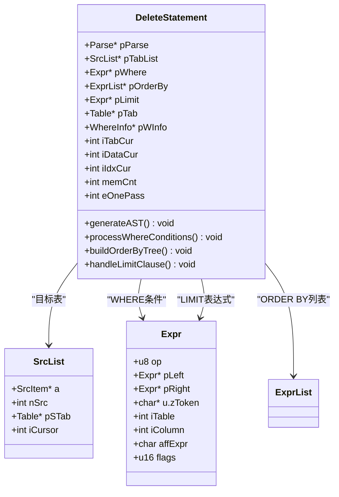

**图表来源**
- [src/delete.c](file://src/delete.c#L287-L692)
- [src/sqliteInt.h](file://src/sqliteInt.h#L5095-L5095)

### 目标表字段(pTab)

目标表字段是DELETE语句AST中最关键的部分，它标识了要删除记录的具体表：

| 字段属性 | 类型 | 描述 | 处理方式 |
|---------|------|------|----------|
| pTab | Table* | 指向目标表的指针 | 通过sqlite3SrcListLookup()查找和验证 |
| nTabRef | int | 表引用计数 | 自动递增以跟踪表的使用情况 |
| tnum | int | 表的B树根页面号 | 用于直接访问表的数据存储 |
| pSchema | Schema* | 表所属的模式 | 用于权限检查和表定位 |

### WHERE条件表达式树(pWhere)

WHERE条件是DELETE语句中最重要的过滤条件，它决定了哪些记录应该被删除：

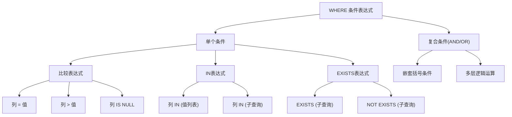

**图表来源**
- [src/whereexpr.c](file://src/whereexpr.c#L1552-L1585)

**段落来源**
- [src/delete.c](file://src/delete.c#L287-L692)

## 表达式解析器在WHERE条件树中的作用

### 表达式树构建机制

表达式解析器负责将SQL中的WHERE条件转换为内部的表达式树结构。这个过程涉及多个层次的处理：

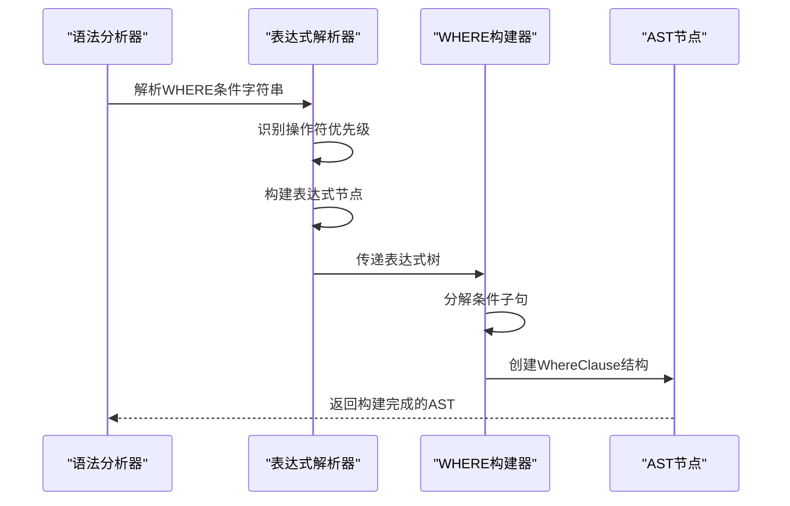

**图表来源**
- [src/whereexpr.c](file://src/whereexpr.c#L40-L71)

### 条件分解与优化

WHERE条件表达式会被分解为多个独立的子表达式，每个子表达式对应WHERE子句中的一个条件：

| 分解类型 | 处理方式 | 优化策略 | 性能影响 |
|---------|----------|----------|----------|
| AND连接条件 | 递归分解为独立项 | 提取可索引条件 | 显著提升查询性能 |
| OR连接条件 | 创建OR信息结构 | 考虑索引合并 | 可能增加复杂度 |
| 嵌套表达式 | 保持原有结构 | 避免重复计算 | 维持表达式完整性 |
| 子查询条件 | 延迟求值 | 缓存结果 | 减少重复计算开销 |

**段落来源**
- [src/whereexpr.c](file://src/whereexpr.c#L1435-L1467)

## ORDER BY和LIMIT子句处理机制

### ORDER BY子句处理

ORDER BY子句在DELETE语句中的处理需要特殊的考虑，因为DELETE操作通常不需要排序：

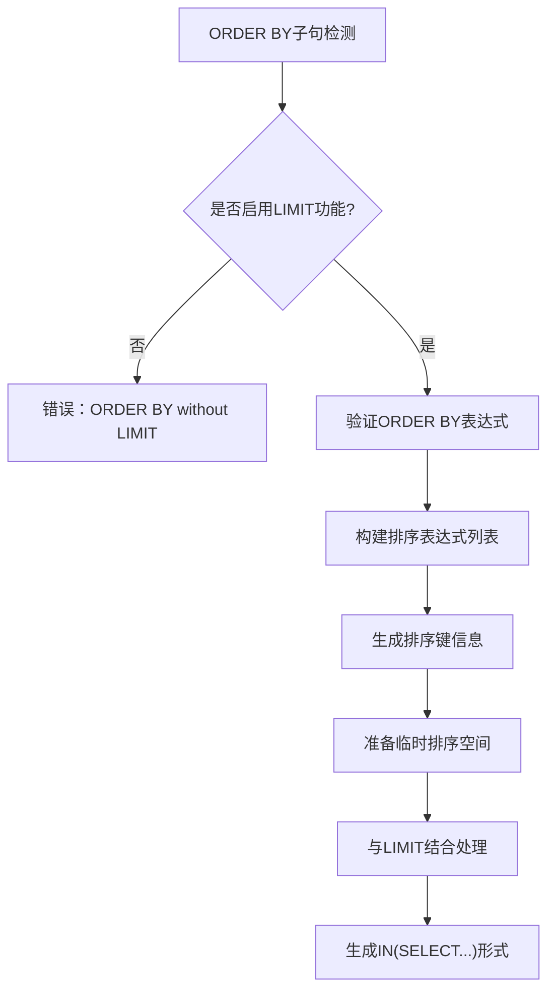

**图表来源**
- [src/delete.c](file://src/delete.c#L181-L276)

### LIMIT子句处理策略

LIMIT子句的处理涉及到复杂的查询重写，将DELETE语句转换为更高效的执行计划：

**图表来源**
- [src/delete.c](file://src/delete.c#L181-L276)

**段落来源**
- [src/delete.c](file://src/delete.c#L181-L276)

## 简单DELETE与复杂WHERE条件的AST构造对比

### 简单DELETE语句

简单的DELETE语句只包含目标表和可选的WHERE条件：

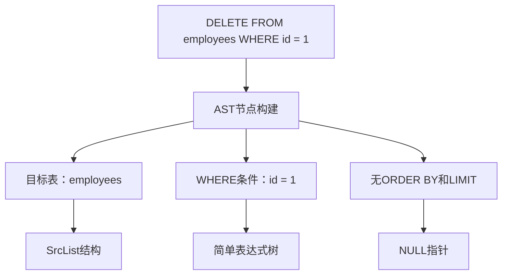

### 复杂WHERE条件DELETE语句

复杂的DELETE语句可能包含多个条件、子查询和函数调用：

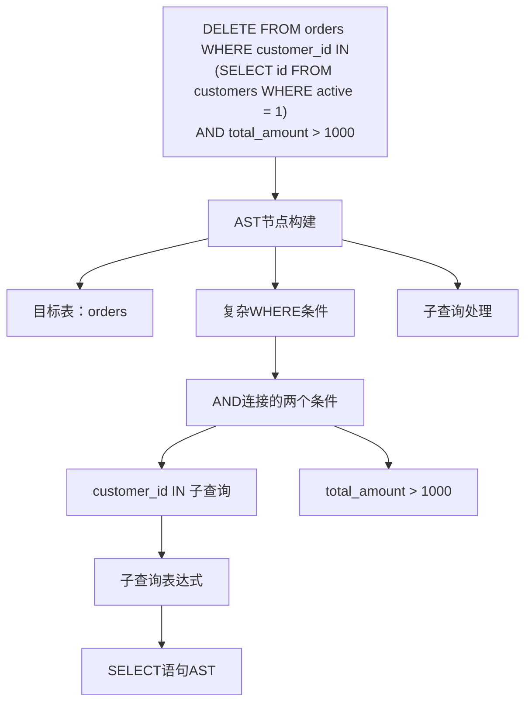

**段落来源**
- [src/delete.c](file://src/delete.c#L287-L692)

## DELETE语句与其他DML语句的AST结构对比

### INSERT语句AST结构

INSERT语句的AST结构与DELETE有显著差异，主要体现在目标元素的不同：

| 特征 | DELETE语句 | INSERT语句 | UPDATE语句 |
|------|-----------|-----------|-----------|
| 目标元素 | 单一表 | 表或视图 | 表或视图 |
| 条件类型 | WHERE过滤 | VALUES或SELECT | SET子句+WHERE |
| 结果输出 | 删除计数 | 插入计数 | 更新计数 |
| 索引维护 | 删除记录 | 插入新记录 | 更新索引条目 |
| 触发器 | BEFORE/AFTER DELETE | BEFORE/AFTER INSERT | BEFORE/AFTER UPDATE |

### UPDATE语句AST结构

UPDATE语句的AST结构包含了更多的修改信息：

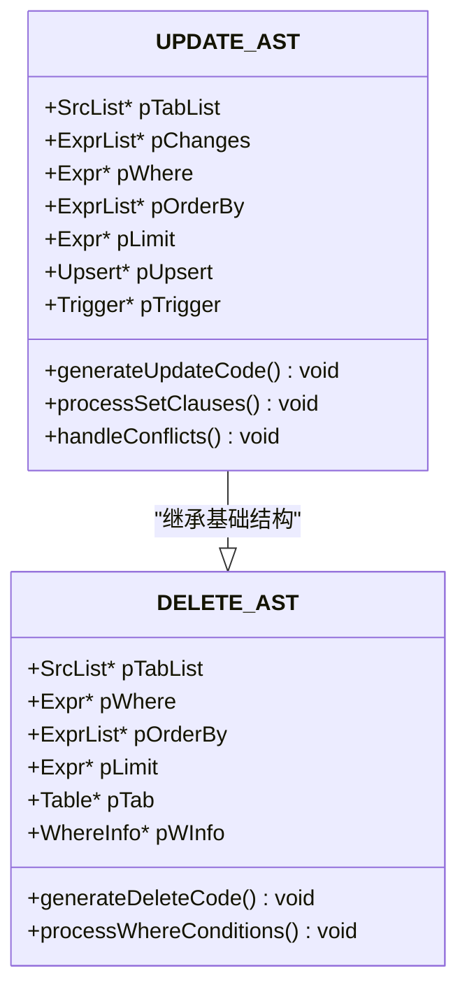

**图表来源**
- [src/update.c](file://src/update.c#L1-L200)
- [src/insert.c](file://src/insert.c#L1-L200)

**段落来源**
- [src/update.c](file://src/update.c#L1-L200)
- [src/insert.c](file://src/insert.c#L1-L200)

## 性能考虑与优化策略

### 查询优化策略

DELETE语句的性能优化涉及多个层面的考虑：

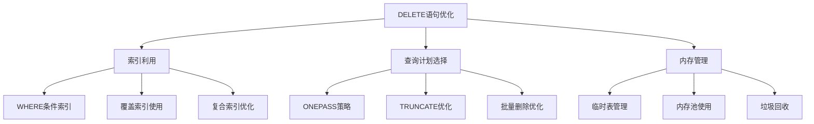

### 执行策略选择

SQLite会根据不同的条件自动选择最优的执行策略：

| 策略类型 | 触发条件 | 性能特点 | 适用场景 |
|---------|----------|----------|----------|
| TRUNCATE | 无WHERE条件且非虚拟表 | O(1)时间复杂度 | 清空整个表 |
| ONEPASS_OFF | 多次扫描需求 | 使用临时存储 | 复杂WHERE条件 |
| ONEPASS_SINGLE | 最多删除一行 | 直接定位删除 | 精确匹配条件 |
| ONEPASS_MULTI | 批量删除 | 流水线处理 | 大量记录删除 |

**段落来源**
- [src/delete.c](file://src/delete.c#L400-L600)

## 故障排除指南

### 常见问题诊断

在DELETE语句的AST构建过程中，可能会遇到以下常见问题：

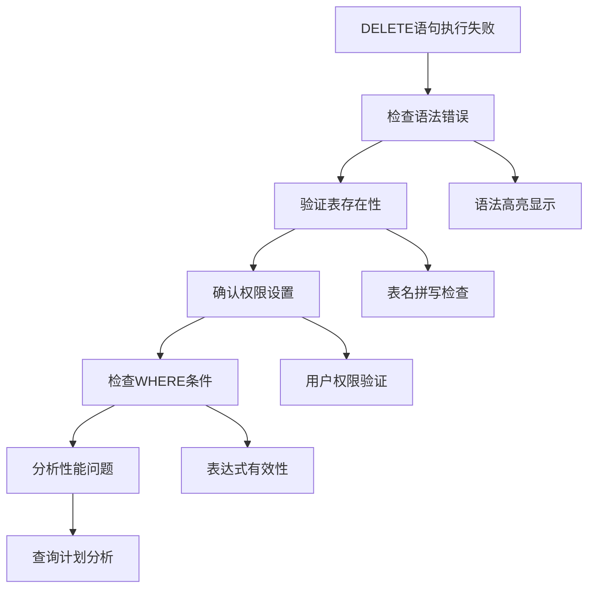

### 调试工具与技巧

SQLite提供了多种调试工具来帮助分析DELETE语句的AST构建过程：

| 工具名称 | 功能描述 | 使用方法 | 输出格式 |
|---------|----------|----------|----------|
| TREETRACE | AST可视化 | 设置sqlite3TreeTrace标志 | 文本树形结构 |
| EXPLAIN QUERY PLAN | 查询计划分析 | 在DELETE前添加EXPLAIN | 步骤序列 |
| 性能计数器 | 执行统计 | 启用计时功能 | 时间和次数统计 |
| 内存跟踪 | 内存使用分析 | 启用内存调试 | 内存分配日志 |

**段落来源**
- [src/treeview.c](file://src/treeview.c#L1029-L1083)

## 总结

DELETE语句的AST构建是SQLite编译器架构中的一个重要组成部分，它体现了SQL解析器的复杂性和灵活性。通过深入分析parse.y中的语法规则和delete.c中的实现细节，我们可以看到：

1. **模块化设计**：SQLite采用清晰的模块化设计，parse.y负责语法分析，delete.c负责语义处理，expr.c负责表达式解析。

2. **灵活的AST结构**：DELETE语句的AST结构能够适应从简单到复杂的各种查询需求，支持WHERE条件、ORDER BY和LIMIT子句。

3. **智能优化策略**：系统能够根据不同的查询模式自动选择最优的执行策略，包括TRUNCATE优化、ONEPASS策略等。

4. **强大的表达式处理**：表达式解析器能够处理复杂的WHERE条件，支持嵌套表达式、子查询和函数调用。

5. **完善的错误处理**：系统提供了完整的错误检测和报告机制，确保查询的正确性和安全性。

这种设计不仅保证了SQLite的高性能和可靠性，也为开发者提供了强大而灵活的数据操作能力。理解DELETE语句AST构建的原理，对于深入掌握SQLite的工作机制具有重要意义。