# INSERT语句AST构建

<cite>
**本文档引用的文件**
- [parse.y](file://src/parse.y)
- [insert.c](file://src/insert.c)
- [sqliteInt.h](file://src/sqliteInt.h)
- [select.c](file://src/select.c)
- [upsert.c](file://src/upsert.c)
</cite>

## 目录
1. [简介](#简介)
2. [INSERT语法规则概述](#insert语法规则概述)
3. [AST结构体详解](#ast结构体详解)
4. [parse.y中的INSERT语法规则](#parsey中的insert语法规则)
5. [sqlite3Insert函数实现](#sqlite3insert函数实现)
6. [不同INSERT类型的AST构建](#不同insert类型的ast构建)
7. [ON CONFLICT子句处理](#on-conflict子句处理)
8. [表达式树在值计算中的作用](#表达式树在值计算中的作用)
9. [SELECT子查询的AST嵌套关系](#select子查询的ast嵌套关系)
10. [性能优化考虑](#性能优化考虑)

## 简介

SQLite的INSERT语句AST构建是一个复杂的过程，涉及词法分析、语法分析和语义分析等多个阶段。本文档详细分析了从SQL语法到抽象语法树（AST）的转换过程，重点说明了parse.y中的INSERT语法规则如何调用insert.c中的sqlite3Insert()函数生成相应的AST结构。

## INSERT语法规则概述

SQLite的INSERT语句支持多种格式，每种格式都有对应的语法规则：

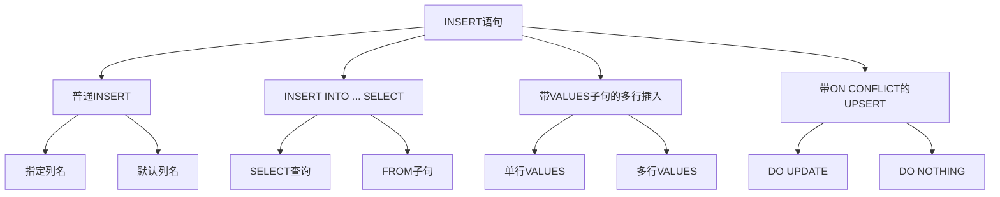

**图表来源**
- [parse.y](file://src/parse.y#L1045-L1080)

## AST结构体详解

### Insert结构体

虽然SQLite内部没有直接名为Insert的结构体，但INSERT语句的AST主要由以下核心组件构成：

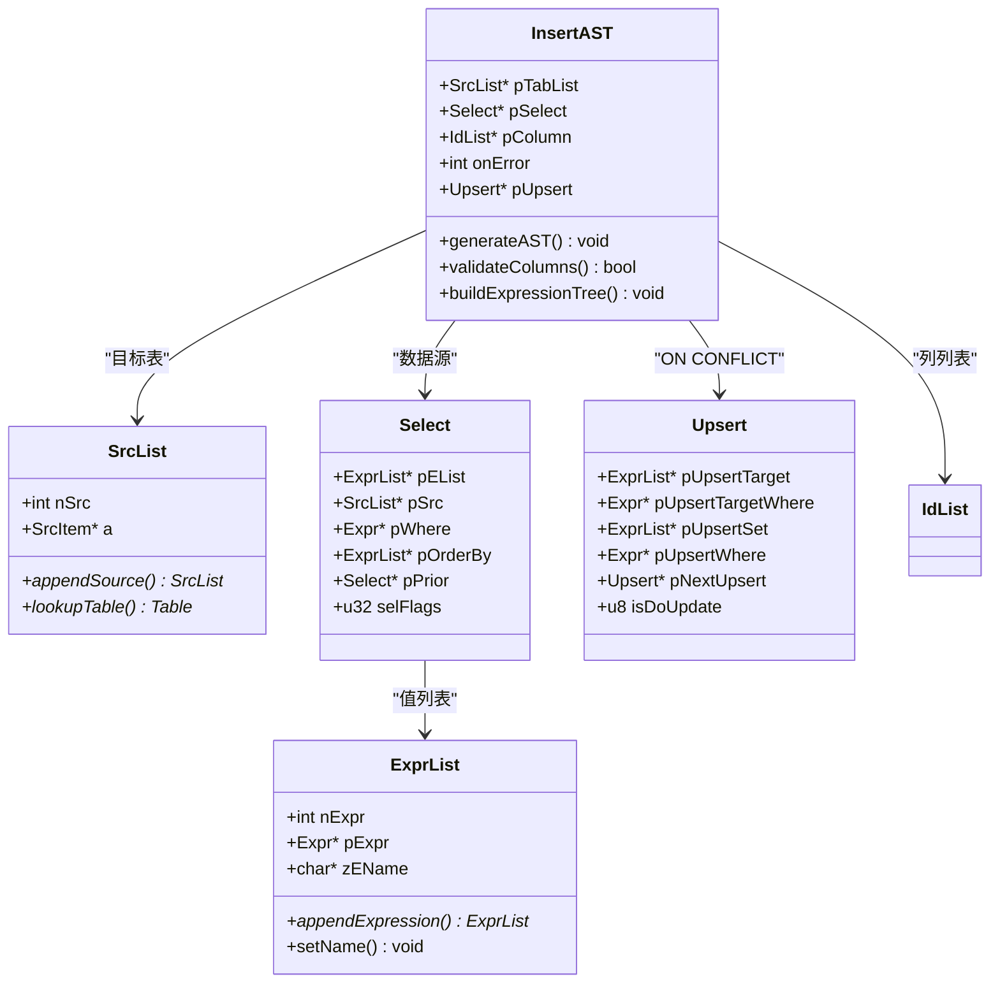

**图表来源**
- [sqliteInt.h](file://src/sqliteInt.h#L3601-L3622)
- [sqliteInt.h](file://src/sqliteInt.h#L3230-L3257)

**章节来源**
- [sqliteInt.h](file://src/sqliteInt.h#L3601-L3622)
- [sqliteInt.h](file://src/sqliteInt.h#L3230-L3257)

### 关键字段说明

1. **目标表（pTabList）**：包含要插入的目标表信息
2. **列列表（pColumn）**：指定要插入的列名列表
3. **值列表（pSelect或pList）**：包含要插入的数据
4. **ON CONFLICT子句（pUpsert）**：处理冲突解决策略

## parse.y中的INSERT语法规则

### 基本INSERT语法规则

parse.y文件中定义了INSERT语句的核心语法规则：

```mermaid
grammar LR1
input ::= cmdlist.
cmdlist ::= cmdlist ecmd.
ecmd ::= cmdx SEMI.
cmdx ::= cmd.
cmd ::= with insert_cmd(R) INTO xfullname(X) idlist_opt(F) select(S) upsert(U).
cmd ::= with insert_cmd(R) INTO xfullname(X) idlist_opt(F) DEFAULT VALUES returning.
insert_cmd(A) ::= INSERT orconf(R). {A = R;}
insert_cmd(A) ::= REPLACE. {A = OE_Replace;}
idlist_opt(A) ::= . {A = 0;}
idlist_opt(A) ::= LP idlist(X) RP. {A = X;}
upsert(A) ::= . { A = 0; }
upsert(A) ::= RETURNING selcollist(X). { A = 0; sqlite3AddReturning(pParse,X); }
upsert(A) ::= ON CONFLICT LP sortlist(T) RP where_opt(TW) DO UPDATE SET setlist(Z) where_opt(W) upsert(N).
upsert(A) ::= ON CONFLICT LP sortlist(T) RP where_opt(TW) DO NOTHING upsert(N).
```

**图表来源**
- [parse.y](file://src/parse.y#L1045-L1080)

**章节来源**
- [parse.y](file://src/parse.y#L1045-L1080)

### VALUES子句语法规则

VALUES子句有两种形式：单行和多行：

```mermaid
grammar LR1
oneselect(A) ::= values(A).
values(A) ::= VALUES LP nexprlist(X) RP. {
A = sqlite3SelectNew(pParse,X,0,0,0,0,0,SF_Values,0);
}
oneselect(A) ::= mvalues(A).
mvalues(A) ::= values(A) COMMA LP nexprlist(Y) RP. {
A = sqlite3MultiValues(pParse, A, Y);
}
mvalues(A) ::= mvalues(A) COMMA LP nexprlist(Y) RP. {
A = sqlite3MultiValues(pParse, A, Y);
}
```

**图表来源**
- [parse.y](file://src/parse.y#L655-L675)

**章节来源**
- [parse.y](file://src/parse.y#L655-L675)

## sqlite3Insert函数实现

### 函数签名和参数

sqlite3Insert函数是INSERT语句AST构建的核心入口点：

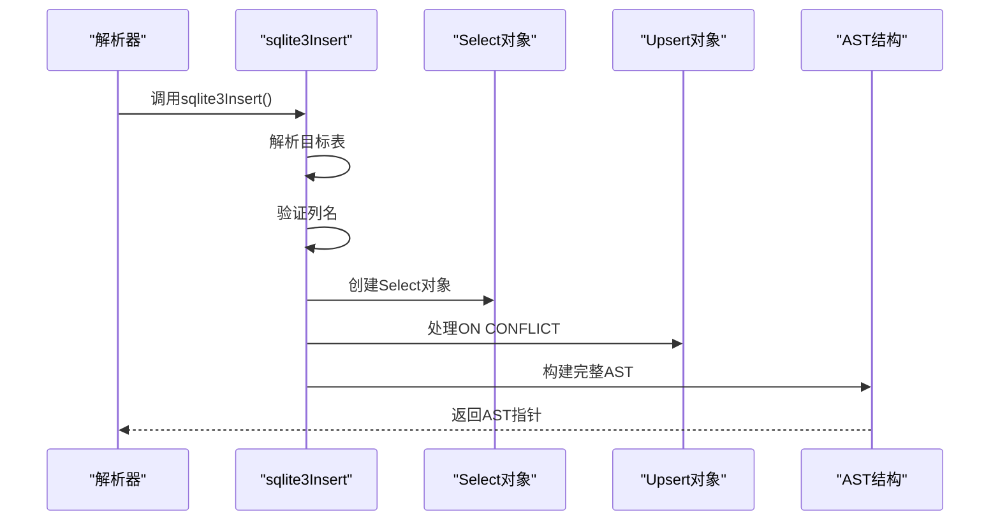

**图表来源**
- [insert.c](file://src/insert.c#L893-L914)

### 主要处理流程

sqlite3Insert函数的主要处理步骤包括：

1. **目标表解析**：确定要插入的目标表
2. **列验证**：验证指定的列名是否有效
3. **数据源处理**：处理VALUES或SELECT数据源
4. **ON CONFLICT处理**：处理冲突解决策略
5. **AST构建**：构建完整的抽象语法树

**章节来源**
- [insert.c](file://src/insert.c#L893-L1661)

## 不同INSERT类型的AST构建

### 普通INSERT

普通INSERT语句的AST构建相对简单：

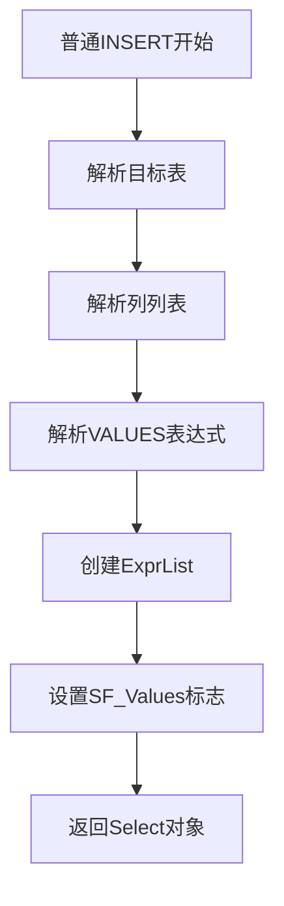

**图表来源**
- [insert.c](file://src/insert.c#L959-L1010)

### INSERT INTO ... SELECT

这种类型的INSERT需要处理SELECT查询：

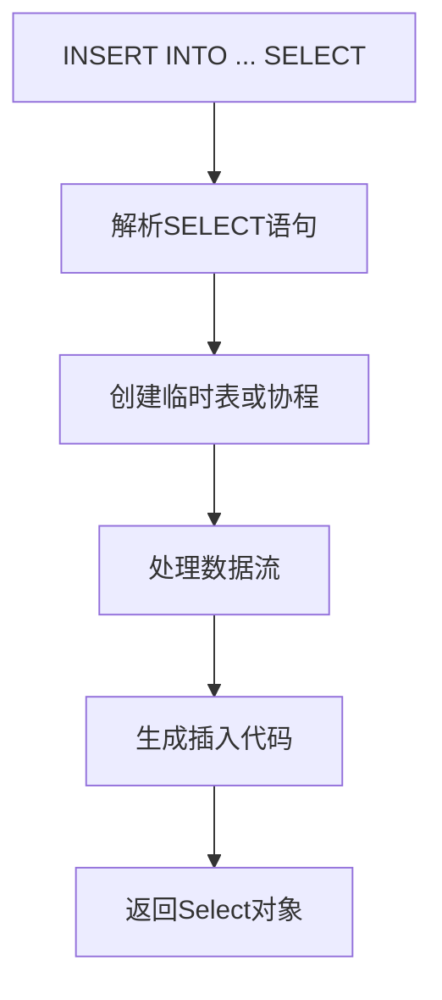

**图表来源**
- [insert.c](file://src/insert.c#L1080-L1117)

### 带VALUES子句的多行插入

多行VALUES的AST构建涉及协程优化：

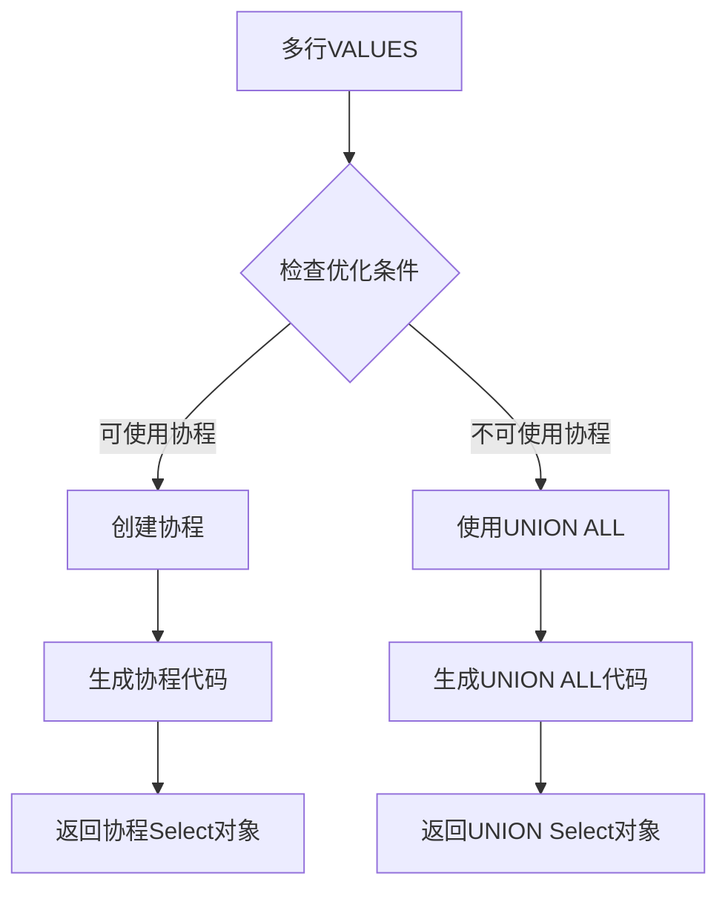

**图表来源**
- [insert.c](file://src/insert.c#L600-L700)

**章节来源**
- [insert.c](file://src/insert.c#L600-L700)

## ON CONFLICT子句处理

### Upsert结构体

ON CONFLICT子句通过Upsert结构体表示：

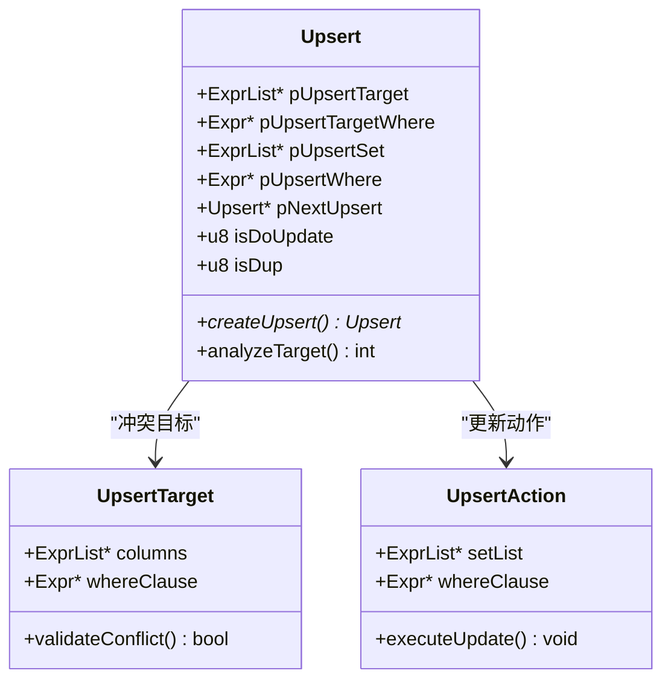

**图表来源**
- [sqliteInt.h](file://src/sqliteInt.h#L3547-L3572)

### ON CONFLICT语法规则

```mermaid
grammar LR1
upsert(A) ::= ON CONFLICT LP sortlist(T) RP where_opt(TW) DO UPDATE SET setlist(Z) where_opt(W) upsert(N).
upsert(A) ::= ON CONFLICT LP sortlist(T) RP where_opt(TW) DO NOTHING upsert(N).
upsert(A) ::= ON CONFLICT DO NOTHING returning.
upsert(A) ::= ON CONFLICT DO UPDATE SET setlist(Z) where_opt(W) returning.
```

**图表来源**
- [parse.y](file://src/parse.y#L1060-L1070)

**章节来源**
- [parse.y](file://src/parse.y#L1060-L1070)

## 表达式树在值计算中的作用

### ExprList结构

表达式树在INSERT语句中用于表示要插入的值：

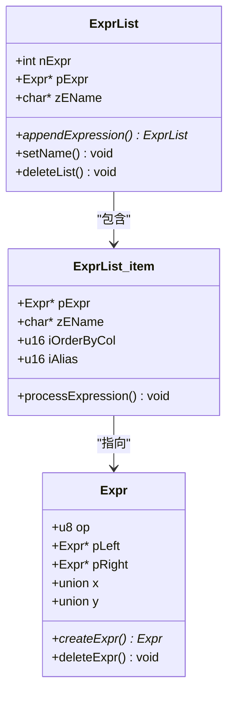

**图表来源**
- [sqliteInt.h](file://src/sqliteInt.h#L3230-L3257)

### 值计算流程

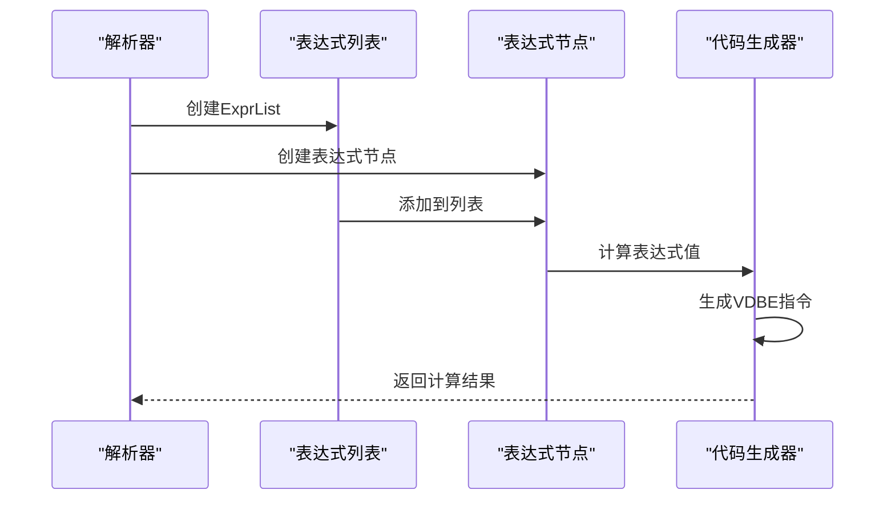

**图表来源**
- [insert.c](file://src/insert.c#L1200-L1300)

**章节来源**
- [insert.c](file://src/insert.c#L1200-L1300)

## SELECT子查询的AST嵌套关系

### 协程机制

对于复杂的SELECT子查询，SQLite使用协程机制来优化内存使用：

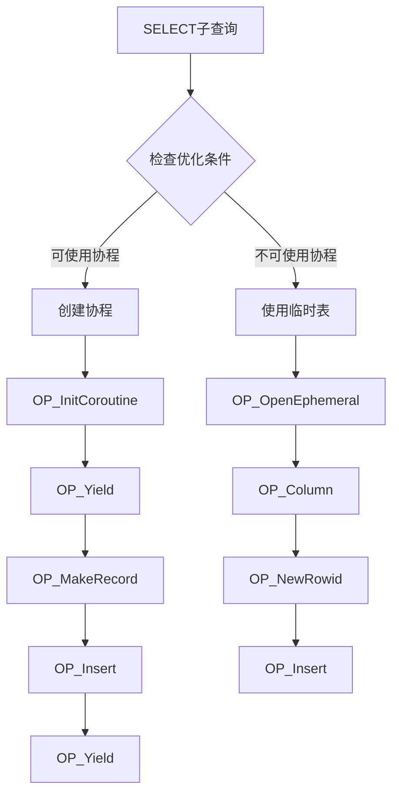

**图表来源**
- [insert.c](file://src/insert.c#L1150-L1250)

### 嵌套Select结构

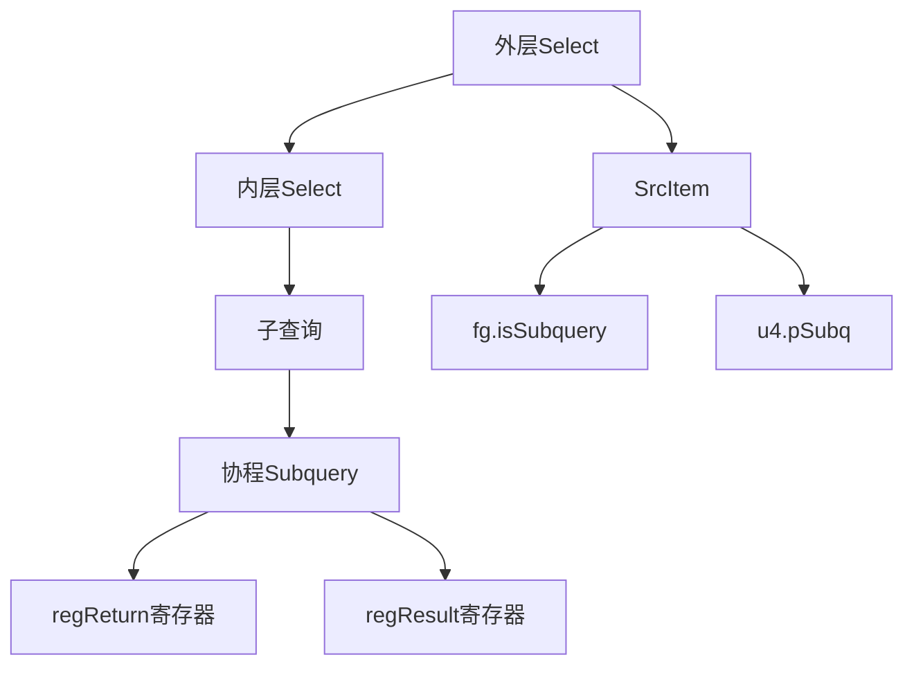

**图表来源**
- [insert.c](file://src/insert.c#L1150-L1250)

**章节来源**
- [insert.c](file://src/insert.c#L1150-L1250)

## 性能优化考虑

### 内存管理

INSERT语句的AST构建涉及大量的内存分配和释放：

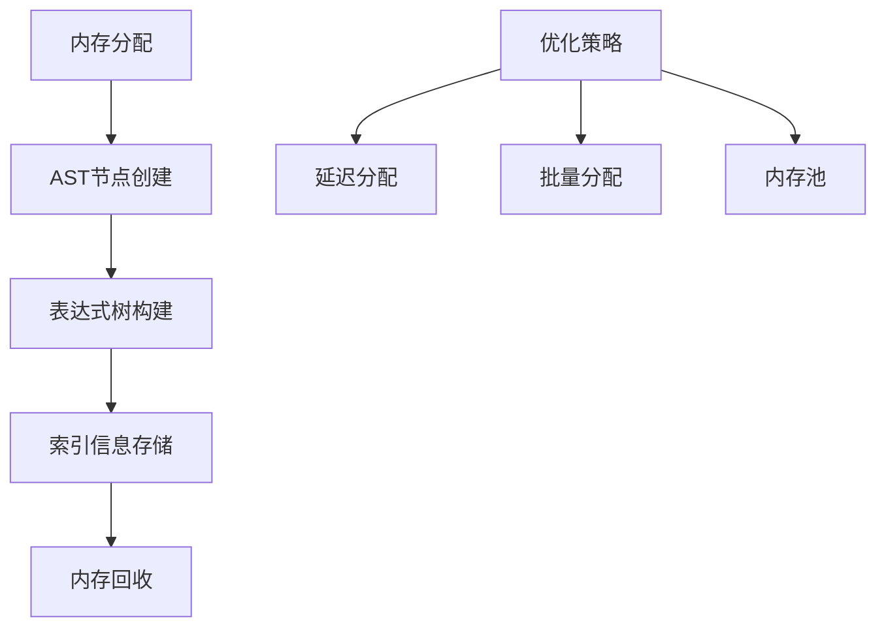

### 执行计划优化

不同的INSERT类型采用不同的执行策略：

| INSERT类型 | 优化策略 | 性能特点 |
|------------|----------|----------|
| 单行VALUES | 直接插入 | 最快，无额外开销 |
| 多行VALUES | 协程优化 | 中等，减少内存使用 |
| SELECT子查询 | 临时表/协程 | 取决于数据量 |
| UPSERT | 索引查找 | 取决于冲突频率 |

### 并发处理

INSERT语句的并发处理考虑：

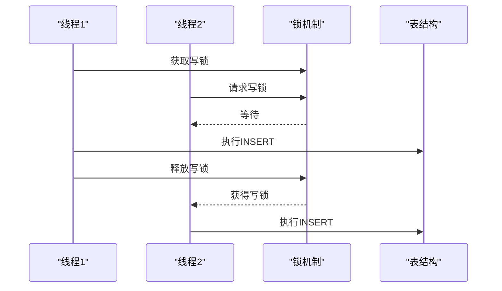

**图表来源**
- [insert.c](file://src/insert.c#L1400-L1500)

**章节来源**
- [insert.c](file://src/insert.c#L1400-L1500)

## 结论

SQLite的INSERT语句AST构建是一个精心设计的系统，它将复杂的SQL语法转换为高效的内部表示。通过parse.y中的语法规则定义和insert.c中的具体实现，SQLite能够处理各种INSERT场景，从简单的单行插入到复杂的UPSERT操作。

关键的设计原则包括：
- **模块化设计**：清晰分离语法分析和语义分析
- **性能优化**：针对不同场景采用最优的执行策略
- **内存效率**：通过协程和临时表优化内存使用
- **扩展性**：支持新的INSERT特性而不影响现有功能

这种设计使得SQLite能够在保持简洁性的同时，提供强大而灵活的INSERT功能。