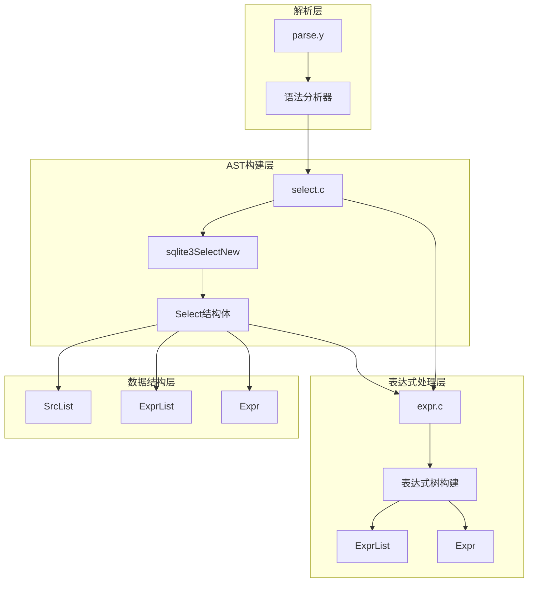
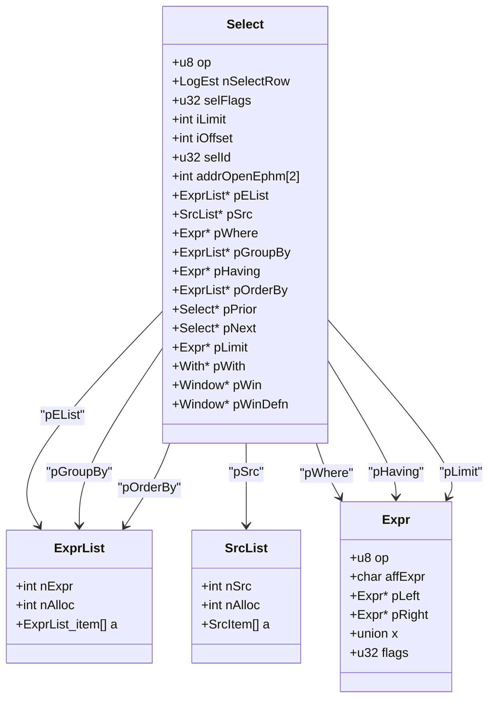
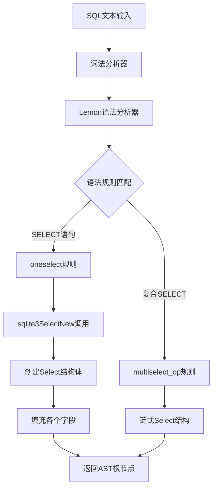
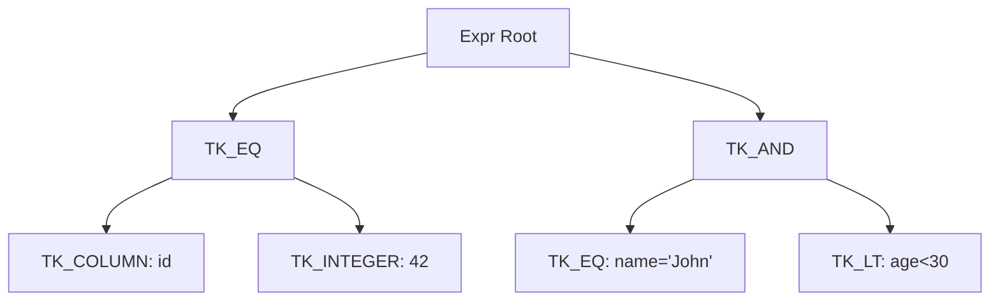
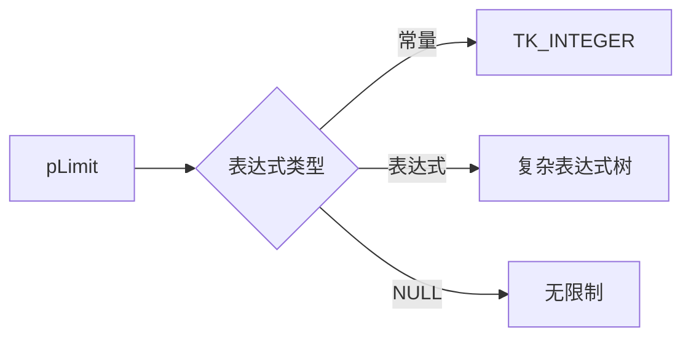
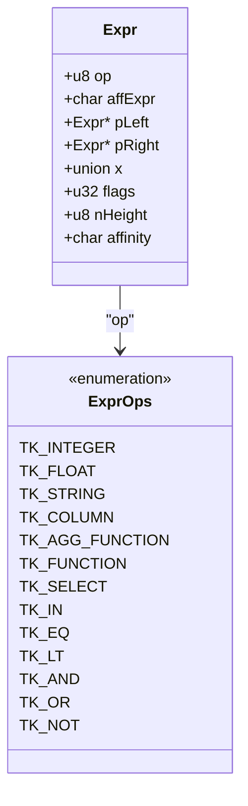
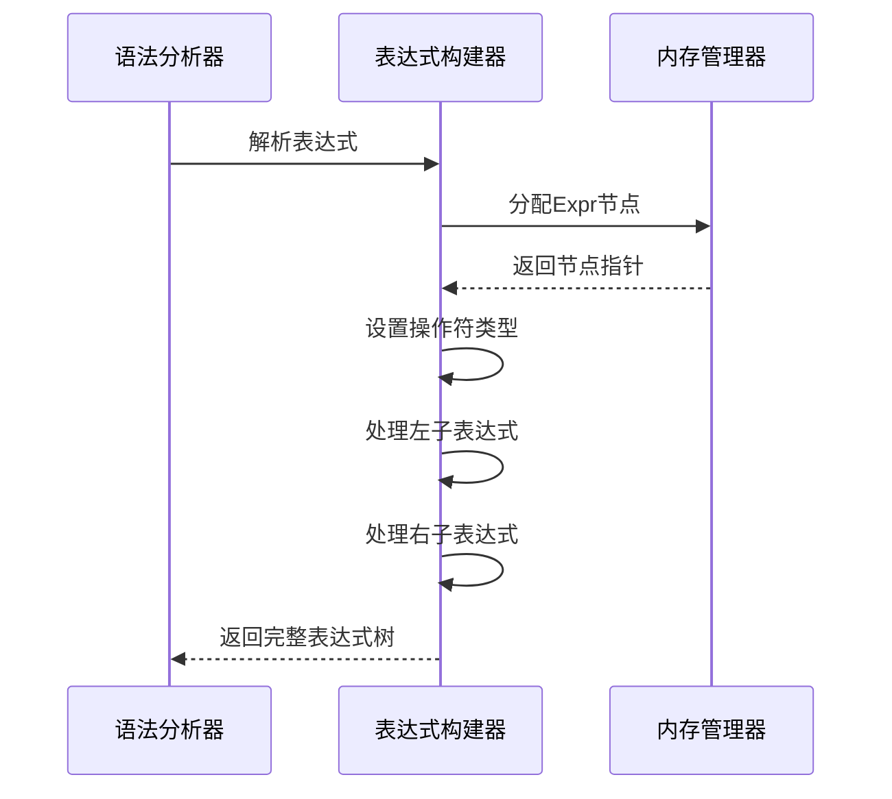
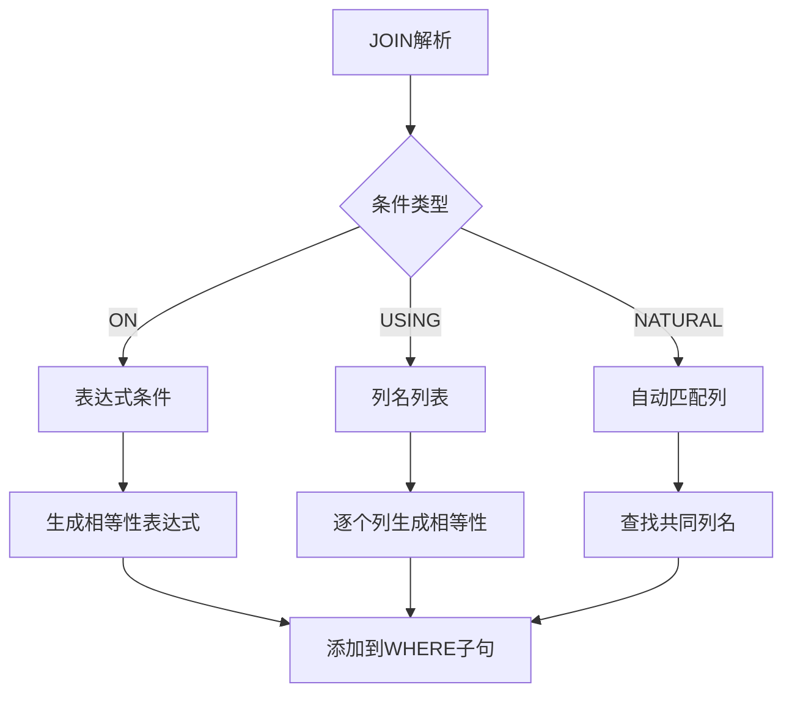
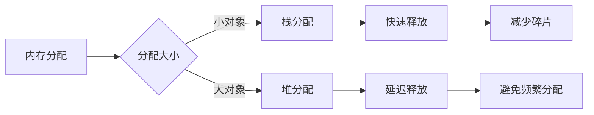

# SELECT语句抽象语法树（AST）构建

<cite>
**本文档引用的文件**
- [parse.y](file://src/parse.y)
- [select.c](file://src/select.c)
- [expr.c](file://src/expr.c)
- [sqliteInt.h](file://src/sqliteInt.h)
</cite>

## 目录
1. [简介](#简介)
2. [项目结构概览](#项目结构概览)
3. [核心组件分析](#核心组件分析)
4. [AST构建架构](#ast构建架构)
5. [详细组件分析](#详细组件分析)
6. [表达式树构建机制](#表达式树构建机制)
7. [JOIN操作处理](#join操作处理)
8. [子查询集成](#子查询集成)
9. [性能考虑](#性能考虑)
10. [故障排除指南](#故障排除指南)
11. [结论](#结论)

## 简介

SQLite的SELECT语句AST构建是一个复杂而精密的过程，涉及词法分析、语法分析和语义分析等多个阶段。本文档深入探讨了从parse.y中的语法规则如何触发调用select.c中的sqlite3SelectNew()函数来构建Select结构体实例，并详细说明了Select结构体中各个字段的含义及其在SQL查询执行过程中的作用。

## 项目结构概览

SQLite的SELECT语句处理主要涉及以下关键文件：



**图表来源**
- [parse.y](file://src/parse.y#L1-L50)
- [select.c](file://src/select.c#L1-L50)
- [expr.c](file://src/expr.c#L1-L50)

**章节来源**
- [parse.y](file://src/parse.y#L1-L100)
- [select.c](file://src/select.c#L1-L100)

## 核心组件分析

### Select结构体定义

Select结构体是SQLite中表示SELECT语句的核心数据结构，包含了查询的所有关键组成部分：



**图表来源**
- [sqliteInt.h](file://src/sqliteInt.h#L3601-L3622)
- [sqliteInt.h](file://src/sqliteInt.h#L3208-L3239)
- [sqliteInt.h](file://src/sqliteInt.h#L3046-L3061)

**章节来源**
- [sqliteInt.h](file://src/sqliteInt.h#L3601-L3622)

## AST构建架构

### 语法规则触发机制

SQLite使用Lemon语法分析器生成的解析器来处理SELECT语句。语法规则定义了如何从SQL文本转换为AST节点：



**图表来源**
- [parse.y](file://src/parse.y#L600-L650)
- [select.c](file://src/select.c#L125-L177)

**章节来源**
- [parse.y](file://src/parse.y#L600-L700)

## 详细组件分析

### 结果列列表（pEList）

结果列列表包含了SELECT语句中要返回的所有列表达式：

| 字段 | 类型 | 描述 | 示例 |
|------|------|------|------|
| nExpr | int | 列表达式的数量 | 3 |
| nAlloc | int | 分配的内存槽位数 | 4 |
| a[] | ExprList_item[] | 实际的表达式项数组 | 包含Expr指针和名称 |

### 源表列表（pSrc）

源表列表描述了FROM子句中引用的所有表和子查询：

| 字段 | 类型 | 描述 | 用途 |
|------|------|------|------|
| nSrc | int | 表的数量 | 1-多表查询 |
| nAlloc | int | 分配的内存槽位数 | 动态扩展支持 |
| a[] | SrcItem[] | 表项数组 | 每个表的详细信息 |

### WHERE条件表达式（pWhere）

WHERE子句的条件表达式以表达式树的形式存储：



**图表来源**
- [expr.c](file://src/expr.c#L989-L1027)

### 分组（pGroupBy）和排序（pOrderBy）

这两个字段都使用ExprList结构来存储：

| 子句 | 数据结构 | 主要字段 | 说明 |
|------|----------|----------|------|
| GROUP BY | ExprList | pExpr, sortFlags | 分组表达式列表 |
| ORDER BY | ExprList | pExpr, sortFlags, bNulls | 排序表达式列表 |

### 限制（pLimit）

LIMIT子句的表达式可以是常量或复杂的表达式：



**图表来源**
- [select.c](file://src/select.c#L125-L177)

**章节来源**
- [select.c](file://src/select.c#L125-L200)

## 表达式树构建机制

### 表达式节点类型

SQLite使用统一的Expr结构来表示所有类型的表达式：



**图表来源**
- [sqliteInt.h](file://src/sqliteInt.h#L3046-L3061)

### 表达式树构建流程

表达式树的构建遵循递归下降的原则：



**图表来源**
- [expr.c](file://src/expr.c#L989-L1027)

**章节来源**
- [expr.c](file://src/expr.c#L100-L300)

## JOIN操作处理

### JOIN类型识别

SQLite支持多种JOIN类型，通过sqlite3JoinType函数进行识别：

| JOIN类型 | 标志位 | 描述 | 示例 |
|----------|--------|------|------|
| INNER JOIN | JT_INNER | 内连接 | `FROM A INNER JOIN B` |
| LEFT JOIN | JT_LEFT \| JT_OUTER | 左外连接 | `FROM A LEFT JOIN B` |
| RIGHT JOIN | JT_RIGHT \| JT_OUTER | 右外连接 | `FROM A RIGHT JOIN B` |
| FULL JOIN | JT_LEFT \| JT_RIGHT \| JT_OUTER | 完全外连接 | `FROM A FULL JOIN B` |
| NATURAL JOIN | JT_NATURAL | 自然连接 | `FROM A NATURAL JOIN B` |

### JOIN条件处理

JOIN条件通过ON或USING子句指定：



**图表来源**
- [select.c](file://src/select.c#L496-L600)

**章节来源**
- [select.c](file://src/select.c#L496-L650)

## 子查询集成

### 子查询嵌套结构

子查询可以出现在多个位置，形成复杂的嵌套结构：

```mermaid
graph TD
A[外部SELECT] --> B[pSrc: 主表]
A --> C[pEList: 外部列]
A --> D[pWhere: 外部条件]
B --> E[子查询SrcItem]
E --> F[pSTab: NULL]
E --> u4.pSubq: 子查询Select
u4.pSubq --> G[内部SELECT]
G --> H[pEList: 子查询列]
G --> I[pSrc: 子查询表]
G --> J[pWhere: 子查询条件]
```

**图表来源**
- [parse.y](file://src/parse.y#L750-L780)

### 子查询优化

SQLite对子查询进行多种优化：

| 优化类型 | 描述 | 实现位置 |
|----------|------|----------|
| 子查询展开 | 将子查询转换为JOIN | sqlite3SelectNew |
| 常量传播 | 将外部常量传递给子查询 | 表达式优化 |
| 相关子查询消除 | 将相关子查询转换为标量子查询 | 查询重写 |

**章节来源**
- [parse.y](file://src/parse.y#L750-L800)

## 性能考虑

### 内存管理策略

SQLite采用多种策略来优化AST构建过程中的内存使用：



### AST节点复用

为了提高性能，SQLite在某些情况下会复用AST节点：

| 复用场景 | 复用策略 | 性能收益 |
|----------|----------|----------|
| 常量表达式 | 缓存计算结果 | 避免重复计算 |
| 列引用 | 共享列元数据 | 减少内存占用 |
| 函数调用 | 缓存函数信息 | 加速类型检查 |

## 故障排除指南

### 常见错误类型

| 错误类型 | 原因 | 解决方案 |
|----------|------|----------|
| 内存不足 | AST过大 | 增加内存限制 |
| 语法错误 | SQL语法不正确 | 检查SQL语法 |
| 循环引用 | 子查询循环依赖 | 重构查询逻辑 |
| 类型不匹配 | 表达式类型冲突 | 添加类型转换 |

### 调试技巧

1. **启用调试模式**：编译时启用DEBUG宏
2. **内存跟踪**：监控内存分配和释放
3. **AST可视化**：输出AST结构用于分析
4. **性能分析**：测量各阶段耗时

**章节来源**
- [select.c](file://src/select.c#L125-L200)

## 结论

SQLite的SELECT语句AST构建是一个精心设计的系统，它将复杂的SQL语法转换为易于处理的内部表示。通过深入理解这个过程，开发者可以更好地优化查询性能，诊断问题，并扩展SQLite的功能。

关键要点包括：
- Select结构体是核心数据结构，包含查询的所有组成部分
- 表达式树提供了灵活的表达式处理能力
- JOIN操作通过标准化的处理流程支持多种JOIN类型
- 子查询集成实现了复杂的嵌套查询功能
- 性能优化策略确保了大规模查询的可扩展性

这个AST构建系统展示了SQLite在数据库引擎设计方面的深度思考和工程实践，为其他数据库系统的开发提供了宝贵的参考。