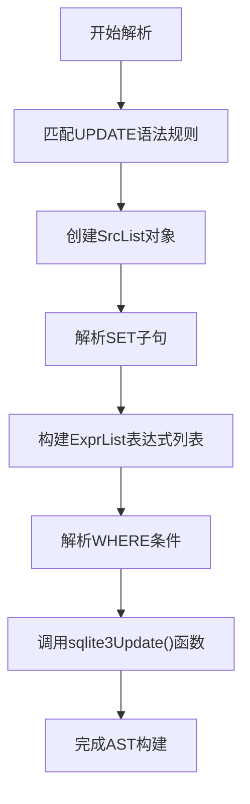
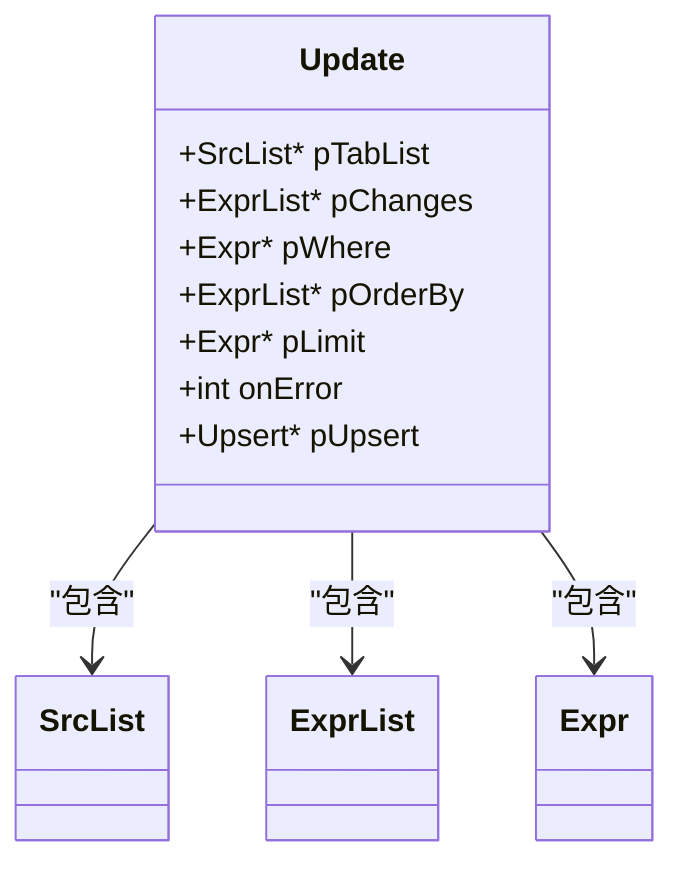
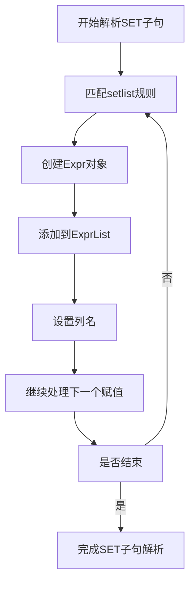
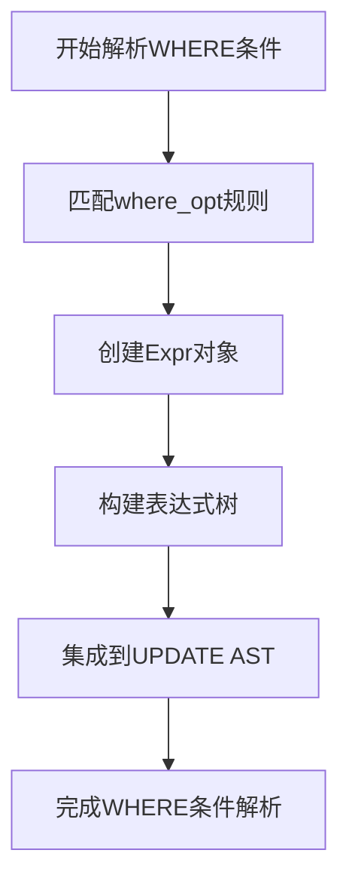
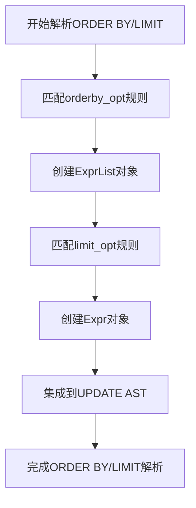
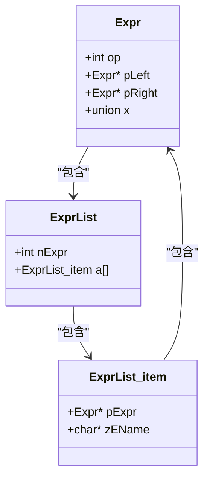

# UPDATE语句AST构建

<cite>
**本文档引用的文件**   
- [parse.y](file://src/parse.y)
- [update.c](file://src/update.c)
- [sqliteInt.h](file://src/sqliteInt.h)
- [expr.c](file://src/expr.c)
</cite>

## 目录
1. [引言](#引言)
2. [UPDATE语法规则与AST构建流程](#update语法规则与ast构建流程)
3. [Update结构体与AST表示](#update结构体与ast表示)
4. [SET子句表达式树构建](#set子句表达式树构建)
5. [WHERE条件AST集成](#where条件ast集成)
6. [ORDER BY与LIMIT子句处理](#order-by与limit子句处理)
7. [UPDATE与SELECT表达式处理对比](#update与select表达式处理对比)
8. [结论](#结论)

## 引言
本文档详细描述SQLite中UPDATE语句抽象语法树（AST）的构建过程。重点分析`parse.y`文件中UPDATE语法规则如何触发`update.c`模块的`sqlite3Update()`函数，解释`Update`结构体中各组件的AST表示方式，并通过代码示例说明SET子句和WHERE条件的表达式树构建机制。

## UPDATE语法规则与AST构建流程
在SQLite的语法解析器`parse.y`中，UPDATE语句的语法规则定义了其结构和解析流程。当解析器遇到UPDATE语句时，会按照预定义的规则进行匹配和动作执行。

**Diagram sources**
- [parse.y](file://src/parse.y#L976-L1023)

**Section sources**
- [parse.y](file://src/parse.y#L976-L1023)

## Update结构体与AST表示
`Update`结构体是UPDATE语句AST的核心数据结构，它包含了目标表、更新列映射、WHERE条件等关键信息。

**Diagram sources**
- [update.c](file://src/update.c#L275-L302)
- [sqliteInt.h](file://src/sqliteInt.h#L3416-L3420)
- [sqliteInt.h](file://src/sqliteInt.h#L3230-L3257)
- [sqliteInt.h](file://src/sqliteInt.h#L3030-L3092)

**Section sources**
- [update.c](file://src/update.c#L275-L302)

### 目标表表示
目标表通过`SrcList`结构体表示，其中包含要更新的表信息。`pTabList`字段指向一个`SrcList`对象，该对象包含了表名、数据库名等信息。

### 更新列与表达式映射
更新列与表达式的映射通过`ExprList`结构体实现。`pChanges`字段指向一个`ExprList`对象，该对象的每个元素包含一个表达式（`pExpr`）和列名（`zEName`）。

### WHERE条件表示
WHERE条件通过`Expr`结构体表示。`pWhere`字段指向一个`Expr`对象，该对象构成了WHERE子句的表达式树。

### ORDER BY和LIMIT子句
ORDER BY和LIMIT子句分别通过`ExprList`和`Expr`结构体表示。`pOrderBy`字段指向一个`ExprList`对象，而`pLimit`字段指向一个`Expr`对象。

## SET子句表达式树构建
SET子句中的多个列赋值通过`exprList`非终结符进行解析和构建。

**Diagram sources**
- [parse.y](file://src/parse.y#L1027-L1056)
- [expr.c](file://src/expr.c#L2075-L2099)

**Section sources**
- [parse.y](file://src/parse.y#L1027-L1056)

### 多列赋值表达式树
当SET子句包含多个列赋值时，每个赋值都会创建一个`Expr`对象，并添加到`ExprList`中。例如，对于`SET a=b, c=d`，会创建两个`Expr`对象，分别表示`a=b`和`c=d`。

## WHERE条件AST集成
WHERE条件作为独立的表达式树被集成到UPDATE的AST中。

**Diagram sources**
- [parse.y](file://src/parse.y#L940-L974)

**Section sources**
- [parse.y](file://src/parse.y#L940-L974)

### 表达式树构建
WHERE条件的表达式树通过递归解析构建。例如，对于`WHERE e<5 AND f NOT NULL`，会创建一个二叉树，根节点为`AND`操作，左子树为`e<5`，右子树为`f NOT NULL`。

## ORDER BY与LIMIT子句处理
ORDER BY和LIMIT子句的处理在`parse.y`中有专门的语法规则。

**Diagram sources**
- [parse.y](file://src/parse.y#L901-L938)

**Section sources**
- [parse.y](file://src/parse.y#L901-L938)

### ORDER BY处理
ORDER BY子句通过`sortlist`非终结符进行解析，生成一个`ExprList`对象，其中每个元素包含排序表达式和排序顺序。

### LIMIT处理
LIMIT子句通过`limit_opt`非终结符进行解析，生成一个`Expr`对象，表示限制行数的表达式。

## UPDATE与SELECT表达式处理对比
UPDATE和SELECT语句在表达式处理上有许多共性和差异。

**Diagram sources**
- [sqliteInt.h](file://src/sqliteInt.h#L3030-L3092)
- [sqliteInt.h](file://src/sqliteInt.h#L3230-L3257)

**Section sources**
- [sqliteInt.h](file://src/sqliteInt.h#L3030-L3092)

### 共性
- 都使用`Expr`结构体表示表达式
- 都使用`ExprList`结构体表示表达式列表
- 都通过递归下降解析器进行语法分析

### 差异
- UPDATE的`pChanges`字段专门用于存储SET子句的表达式
- SELECT的`pEList`字段用于存储SELECT子句的表达式
- UPDATE需要处理目标表的更新，而SELECT需要处理结果集的生成

## 结论
本文档详细描述了SQLite中UPDATE语句AST的构建过程。通过分析`parse.y`和`update.c`模块，我们了解了UPDATE语句从语法解析到AST构建的完整流程。`Update`结构体作为核心数据结构，包含了目标表、更新列映射、WHERE条件等关键信息。SET子句和WHERE条件的表达式树构建机制展示了SQLite如何将SQL语句转换为内部数据结构。与SELECT语句的对比分析揭示了两种语句在表达式处理上的共性和差异。这些知识对于理解SQLite的内部工作原理和优化SQL语句具有重要意义。