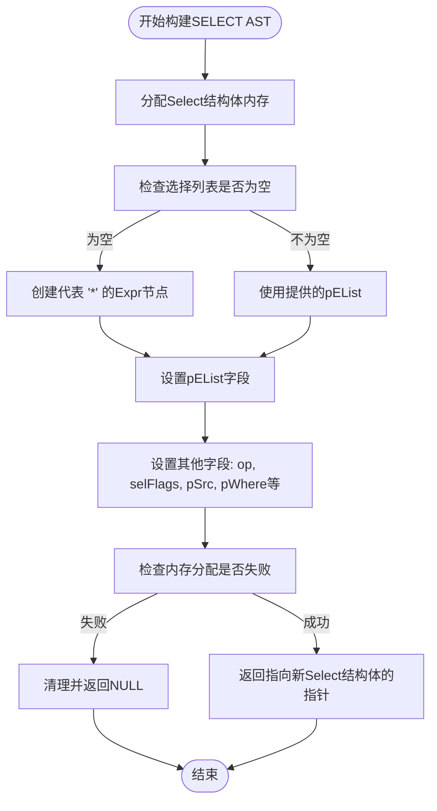
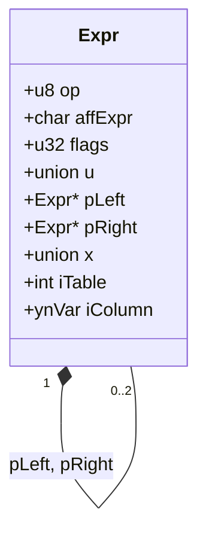
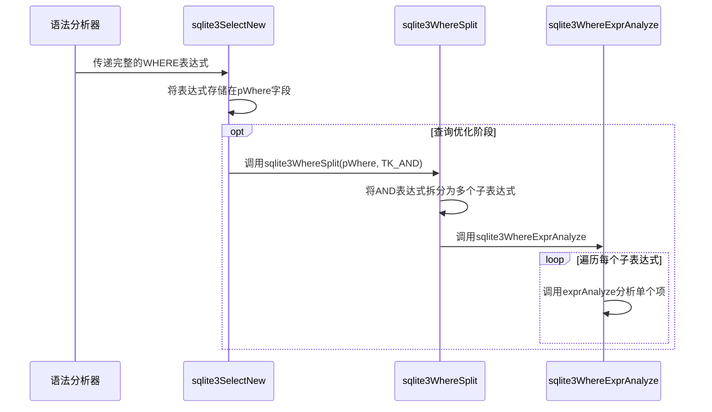

# 抽象语法树构建

<cite>
**本文档引用的文件**
- [parse.y](file://src/parse.y)
- [expr.c](file://src/expr.c)
- [select.c](file://src/select.c)
- [where.c](file://src/where.c)
- [insert.c](file://src/insert.c)
- [update.c](file://src/update.c)
- [delete.c](file://src/delete.c)
- [sqliteInt.h](file://src/sqliteInt.h)
- [whereInt.h](file://src/whereInt.h)
</cite>

## 目录
1. [引言](#引言)
2. [AST核心数据结构](#ast核心数据结构)
3. [SELECT语句的AST构建](#select语句的ast构建)
4. [INSERT、UPDATE、DELETE语句的AST构建](#insertupdatedelete语句的ast构建)
5. [表达式树与WHERE条件的构建](#表达式树与where条件的构建)
6. [AST的遍历、修改与验证](#ast的遍历修改与验证)
7. [查询优化中的AST作用](#查询优化中的ast作用)
8. [结论](#结论)

## 引言
本文档全面阐述了SQLite数据库系统中抽象语法树（AST）的构建机制。核心内容聚焦于SQL语句的语法分析过程，详细说明了如何从`parse.y`文件中的语法规则触发，调用`expr.c`、`where.c`、`select.c`等模块来构建具体的AST节点。文档深入解析了各种SQL语句对应的内部数据结构设计，如`Select`、`Expr`、`WhereClause`等结构体的字段含义与组织关系。通过代码流程分析，展示了SELECT查询从解析到AST生成的完整过程，包括表达式树、WHERE条件、JOIN结构的构建方式，并阐述了INSERT、UPDATE、DELETE语句在AST构造上的差异与共性。最后，文档还讨论了AST的编程接口及其在查询优化阶段的关键作用。

## AST核心数据结构
SQLite的AST由一系列核心C语言结构体构成，这些结构体定义在`sqliteInt.h`和`whereInt.h`头文件中，它们共同描述了SQL语句的语法结构。

### Select结构体
`Select`结构体是表示SELECT语句的核心数据结构，它包含了查询的所有组成部分。该结构体是一个递归定义，能够表示复杂的复合查询（如UNION）。

**Section sources**
- [sqliteInt.h](file://src/sqliteInt.h#L3601-L3622)

### Expr结构体
`Expr`结构体是AST中最基础的节点，代表了表达式树中的一个节点。它可以表示字面量、列引用、运算符、函数调用等多种SQL表达式。

**Section sources**
- [sqliteInt.h](file://src/sqliteInt.h#L3030-L3092)

### WhereClause结构体
`WhereClause`结构体用于管理和分析WHERE子句。它将一个复杂的WHERE表达式（通常由AND或OR连接）分解为一个`WhereTerm`项的列表，便于后续的查询优化和代码生成。

**Section sources**
- [whereInt.h](file://src/whereInt.h#L340-L383)

## SELECT语句的AST构建
SELECT语句的AST构建始于`parse.y`文件中的语法规则，并通过调用`select.c`中的函数来完成。

### 语法分析与AST节点创建
在`parse.y`中，SELECT语句的语法规则如下：
```yacc
oneselect(A) ::= SELECT distinct(D) selcollist(W) from(X) where_opt(Y)
                 groupby_opt(P) having_opt(Q) 
                 orderby_opt(Z) limit_opt(L). {
  A = sqlite3SelectNew(pParse,W,X,Y,P,Q,Z,D,L);
}
```
当语法分析器（由Lemon生成）识别到一个SELECT语句时，它会执行上述动作。该动作的核心是调用`sqlite3SelectNew`函数，并将解析出的各个部分（如选择列表`W`、FROM子句`X`、WHERE子句`Y`等）作为参数传递。

### sqlite3SelectNew函数
`sqlite3SelectNew`函数是构建`Select`结构体实例的工厂函数。它负责分配内存并初始化结构体的各个字段。



**Diagram sources**
- [select.c](file://src/select.c#L121-L160)

**Section sources**
- [parse.y](file://src/parse.y#L515-L532)
- [select.c](file://src/select.c#L121-L160)

## INSERT、UPDATE、DELETE语句的AST构建
与SELECT语句类似，INSERT、UPDATE和DELETE语句的AST构建也遵循从语法分析到函数调用的模式，但它们最终构建的不是`Select`结构体，而是直接生成VDBE（虚拟数据库引擎）代码。

### 共性：语法分析与入口函数
这三种语句的构建过程在`parse.y`中都有明确的语法规则，这些规则最终都会调用相应的C函数。

**INSERT语句:**
```yacc
cmd ::= with insert_cmd(R) INTO xfullname(X) idlist_opt(F) select(S) upsert(U). {
  sqlite3Insert(pParse, X, S, F, R, U);
}
```
此规则调用`sqlite3Insert`函数，参数包括目标表`X`、数据源`S`（可以是SELECT语句或VALUES）、列列表`F`等。

**UPDATE语句:**
```yacc
cmd ::= UPDATE orconf(ON_CONFLICT) xfullname(T) SET setlist(C) from(F) where_opt(W) upsert(U). {
  sqlite3Update(pParse,T,C,W,ON_CONFLICT,0,0,U);
}
```
此规则调用`sqlite3Update`函数，参数包括目标表`T`、要修改的列和值`C`、WHERE条件`W`等。

**DELETE语句:**
```yacc
cmd ::= DELETE FROM xfullname(T) where_opt(W) orderby_opt(O) limit_opt(L). {
  sqlite3DeleteFrom(pParse,T,W,O,L);
}
```
此规则调用`sqlite3DeleteFrom`函数，参数包括目标表`T`和WHERE条件`W`。

### 差异性：AST的最终形态
*   **SELECT**: 构建一个完整的`Select`结构体，该结构体在后续阶段（如`sqlite3Select`函数中）被用来生成VDBE代码。
*   **INSERT/UPDATE/DELETE**: 它们的“AST构建”过程更侧重于**解析和验证**。函数如`sqlite3Insert`、`sqlite3Update`、`sqlite3DeleteFrom`在执行时，会直接调用底层的代码生成函数（如`sqlite3WhereBegin`、`sqlite3GenerateRowDelete`等），将SQL语句转换为VDBE指令。它们没有一个像`Select`那样独立、完整的中间AST表示，其解析结果直接服务于代码生成。

**Section sources**
- [parse.y](file://src/parse.y#L1027-L1056)
- [insert.c](file://src/insert.c#L121-L130)
- [update.c](file://src/update.c#L121-L130)
- [delete.c](file://src/delete.c#L121-L130)

## 表达式树与WHERE条件的构建
表达式和WHERE条件的构建是AST生成的关键环节，主要由`expr.c`和`where.c`模块处理。

### 表达式树的构建
表达式树的构建通过`expr.c`中的函数递归完成。
*   **原子表达式**: 对于字面量（如`5`、`'hello'`）或标识符（如列名`id`），`parse.y`中的`tokenExpr`函数会创建一个`Expr`节点，将操作码（`op`）设置为`TK_INTEGER`、`TK_STRING`或`TK_COLUMN`，并将文本内容存储在`u.zToken`中。
*   **复合表达式**: 对于二元运算（如`a + b`），`parse.y`中的`expr`规则会调用`sqlite3PExpr`函数。该函数创建一个新的`Expr`节点作为父节点，并将两个子表达式分别设置为`pLeft`和`pRight`。



**Diagram sources**
- [expr.c](file://src/expr.c#L1029-L1070)
- [sqliteInt.h](file://src/sqliteInt.h#L3030-L3092)

### WHERE条件的构建与分析
WHERE子句的构建和分析是一个两阶段过程。
1.  **构建**: `parse.y`中的`where_opt`规则会将WHERE表达式作为一个整体传递给`sqlite3SelectNew`或`sqlite3Update`等函数，存储在`Select`或`Parse`结构体的`pWhere`字段中。
2.  **分析**: 在查询优化阶段，`where.c`模块会介入。`sqlite3WhereSplit`函数会将顶层的AND表达式拆分成一个`WhereClause`结构体中的多个`WhereTerm`项。随后，`sqlite3WhereExprAnalyze`函数会遍历每个`WhereTerm`，调用`exprAnalyze`进行深入分析，识别出可用于索引查找的项（如`column = value`）。



**Diagram sources**
- [where.c](file://src/where.c#L545-L558)
- [whereexpr.c](file://src/whereexpr.c#L1552-L1585)

**Section sources**
- [expr.c](file://src/expr.c#L909-L938)
- [where.c](file://src/where.c#L545-L558)
- [whereexpr.c](file://src/whereexpr.c#L1552-L1585)

## AST的遍历、修改与验证
SQLite提供了多种机制来遍历、修改和验证其内部的AST。

### 遍历机制
SQLite使用`Walker`结构体来实现对AST的遍历。`Walker`包含一个回调函数指针和一个用户数据指针。通过调用`sqlite3WalkExpr`、`sqlite3WalkExprList`等函数，可以对表达式树进行深度优先遍历，并在每个节点上执行回调函数。

### 修改与验证
*   **修改**: 在解析过程中，某些规则会修改已构建的AST。例如，在处理`INSERT ... ON CONFLICT`时，会构建一个`Upsert`结构体并将其附加到INSERT语句上。
*   **验证**: `sqlite3ExprCheckHeight`函数用于检查表达式树的高度，防止栈溢出。`sqlite3WhereFindTerm`函数用于在`WhereClause`中搜索特定模式的项，这本身也是一种对AST内容的查询和验证。

**Section sources**
- [expr.c](file://src/expr.c#L7103-L7131)
- [where.c](file://src/where.c#L545-L558)

## 查询优化中的AST作用
在查询优化阶段，AST是生成高效VDBE代码的基础。
*   **索引选择**: `where.c`模块通过分析`WhereClause`中的`WhereTerm`，判断哪些条件可以利用索引，从而决定最优的表扫描路径。
*   **表达式简化**: 在生成代码前，会对表达式进行常量折叠、等价类合并等优化，这些操作都直接作用于`Expr`树。
*   **代码生成**: 最终，`sqlite3Select`、`sqlite3Insert`等函数会遍历整个AST，将其转换为一系列VDBE操作码，这些操作码构成了执行SQL语句的指令序列。

**Section sources**
- [where.c](file://src/where.c#L545-L558)
- [select.c](file://src/select.c#L121-L160)

## 结论
SQLite通过一个精巧的分层设计实现了SQL语句到可执行代码的转换。`parse.y`文件定义了语法规则，作为构建AST的蓝图。`expr.c`、`select.c`、`where.c`等模块提供了构建和操作AST节点的具体函数。`Select`、`Expr`、`WhereClause`等核心数据结构清晰地映射了SQL语法的各个部分。虽然SELECT语句拥有一个完整的中间AST表示，而INSERT、UPDATE、DELETE语句的构建过程更直接地导向代码生成，但它们都依赖于相同的底层表达式和条件分析机制。AST不仅是语法分析的产物，更是查询优化和代码生成的基石，贯穿了SQLite查询处理的整个生命周期。