# 表达式树构建

<cite>
**本文档引用的文件**
- [parse.y](file://src/parse.y)
- [expr.c](file://src/expr.c)
- [sqliteInt.h](file://src/sqliteInt.h)
- [select.c](file://src/select.c)
- [delete.c](file://src/delete.c)
- [resolve.c](file://src/resolve.c)
- [vdbe.c](file://src/vdbe.c)
</cite>

## 目录
1. [简介](#简介)
2. [项目结构概览](#项目结构概览)
3. [核心组件分析](#核心组件分析)
4. [架构概览](#架构概览)
5. [详细组件分析](#详细组件分析)
6. [依赖关系分析](#依赖关系分析)
7. [性能考虑](#性能考虑)
8. [故障排除指南](#故障排除指南)
9. [结论](#结论)

## 简介

SQLite的表达式树（Expr Tree）构建是SQL解析和执行的核心机制之一。本文档深入分析了SQLite如何通过parse.y中的语法规则驱动expr.c模块中的函数来构建表达式树，详细说明了Expr结构体的字段含义及其在各种SQL语句中的应用。

表达式树是SQLite内部表示SQL表达式的一种数据结构，它以树形结构组织SQL表达式的各个组成部分，支持算术运算、逻辑运算、函数调用、子查询等多种复杂的表达式形式。这种设计使得SQLite能够高效地解析、优化和执行各种SQL查询。

## 项目结构概览

SQLite的表达式树构建涉及多个关键文件的协作：

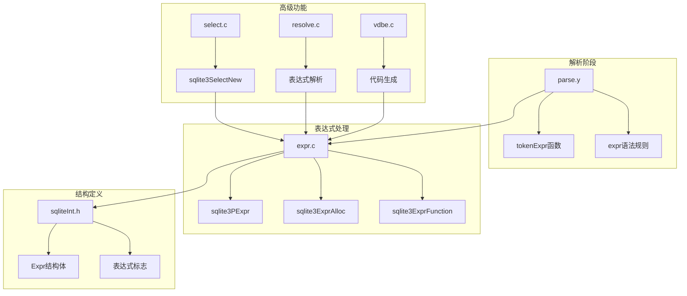

**图表来源**
- [parse.y](file://src/parse.y#L1087-L1138)
- [expr.c](file://src/expr.c#L1029-L1070)
- [sqliteInt.h](file://src/sqliteInt.h#L2967-L3093)

**章节来源**
- [parse.y](file://src/parse.y#L1-L50)
- [expr.c](file://src/expr.c#L1-L50)
- [sqliteInt.h](file://src/sqliteInt.h#L2900-L3100)

## 核心组件分析

### Expr结构体详解

Expr结构体是表达式树的核心数据结构，包含了表达式的所有必要信息：

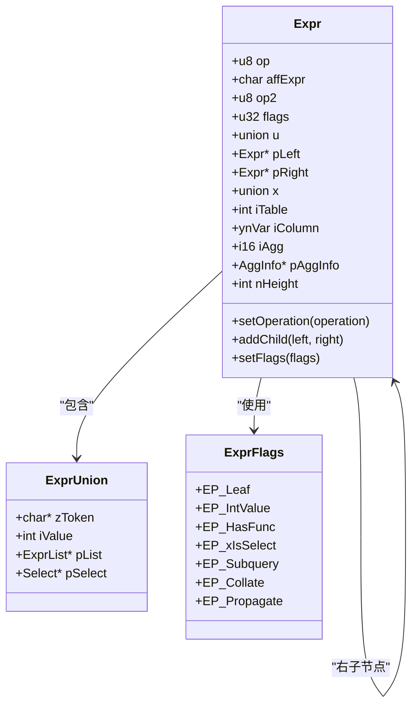

**图表来源**
- [sqliteInt.h](file://src/sqliteInt.h#L3016-L3093)

### 操作符类型系统

SQLite使用整数常量来表示不同的操作符类型：

| 操作符类型 | 数值 | 描述 |
|-----------|------|------|
| TK_INTEGER | 1 | 整数字面量 |
| TK_FLOAT | 2 | 浮点数字面量 |
| TK_STRING | 3 | 字符串字面量 |
| TK_BLOB | 4 | 二进制大对象 |
| TK_VARIABLE | 5 | 变量占位符 |
| TK_NULL | 6 | NULL值 |
| TK_COLUMN | 7 | 列引用 |
| TK_FUNCTION | 8 | 函数调用 |
| TK_AGG_FUNCTION | 9 | 聚合函数 |
| TK_AND | 10 | 逻辑与 |
| TK_OR | 11 | 逻辑或 |
| TK_NOT | 12 | 逻辑非 |
| TK_LT | 13 | 小于 |
| TK_LE | 14 | 小于等于 |
| TK_GT | 15 | 大于 |
| TK_GE | 16 | 大于等于 |
| TK_EQ | 17 | 等于 |
| TK_NE | 18 | 不等于 |
| TK_PLUS | 19 | 加法 |
| TK_MINUS | 20 | 减法 |
| TK_STAR | 21 | 乘法 |
| TK_SLASH | 22 | 除法 |
| TK_REM | 23 | 取模 |
| TK_BITAND | 24 | 位与 |
| TK_BITOR | 25 | 位或 |
| TK_LSHIFT | 26 | 左移 |
| TK_RSHIFT | 27 | 右移 |
| TK_CONCAT | 28 | 字符串连接 |
| TK_COLLATE | 29 | 排序规则 |
| TK_BETWEEN | 30 | 范围检查 |
| TK_IN | 31 | 成员测试 |
| TK_ISNULL | 32 | NULL检查 |
| TK_NOTNULL | 33 | 非NULL检查 |
| TK_CASE | 34 | CASE表达式 |
| TK_SELECT | 35 | 子查询 |
| TK_EXISTS | 36 | 存在检查 |
| TK_CAST | 37 | 类型转换 |

**章节来源**
- [sqliteInt.h](file://src/sqliteInt.h#L2967-L3093)

## 架构概览

SQLite表达式树构建的整体架构遵循解析器-抽象语法树-中间表示-虚拟机代码的流程：

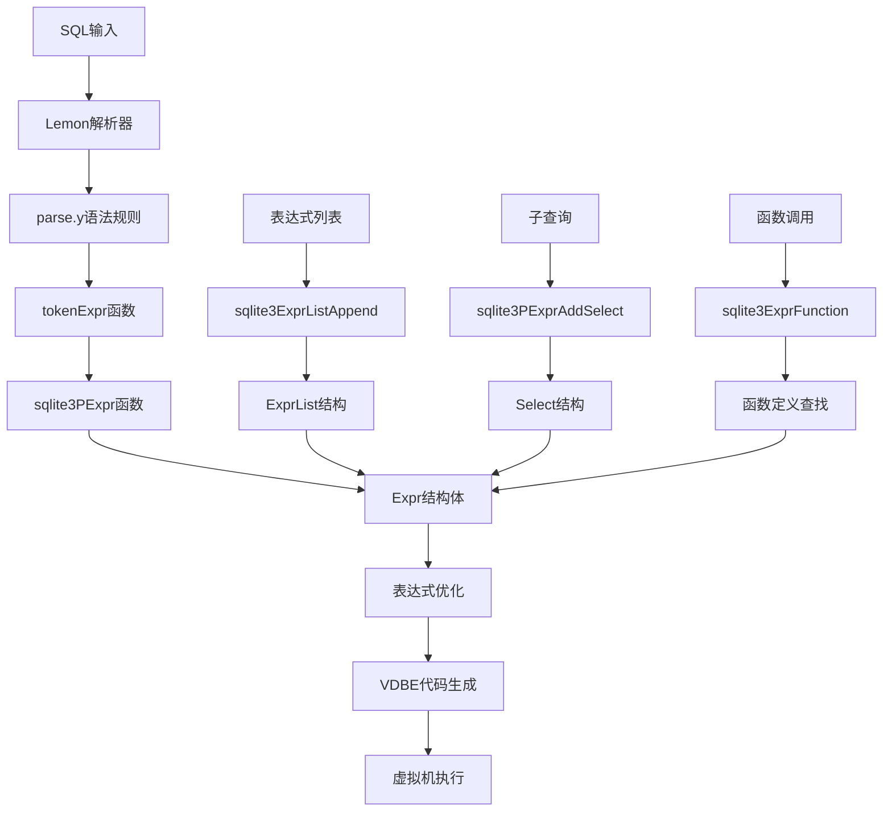

**图表来源**
- [parse.y](file://src/parse.y#L1087-L1138)
- [expr.c](file://src/expr.c#L1029-L1070)

## 详细组件分析

### 词法表达式构建（tokenExpr）

tokenExpr函数负责从单个令牌构建基本的表达式节点：

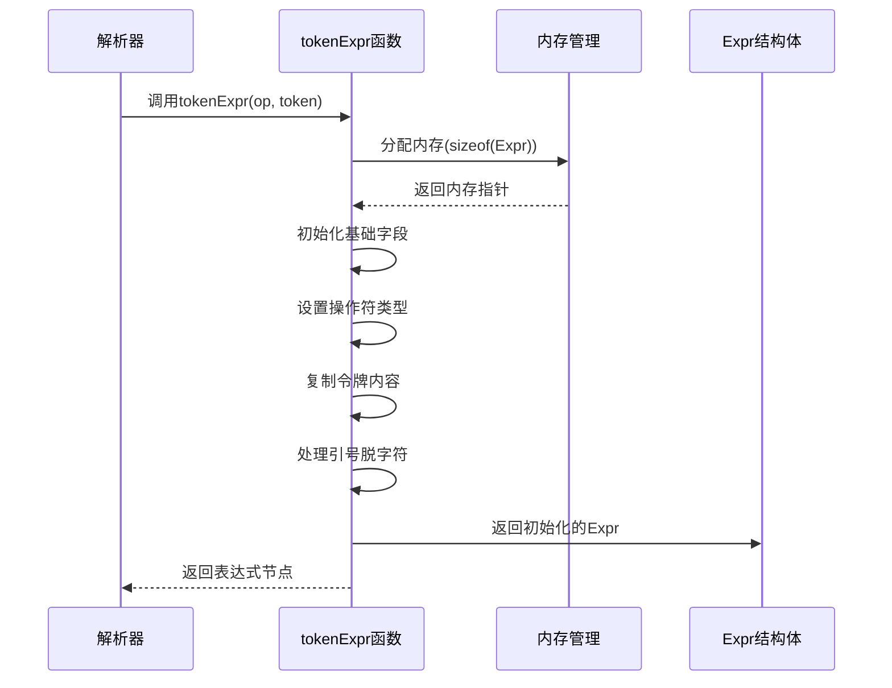

**图表来源**
- [parse.y](file://src/parse.y#L1087-L1138)

### 表达式节点构建（sqlite3PExpr）

sqlite3PExpr函数用于构建包含两个子节点的表达式：

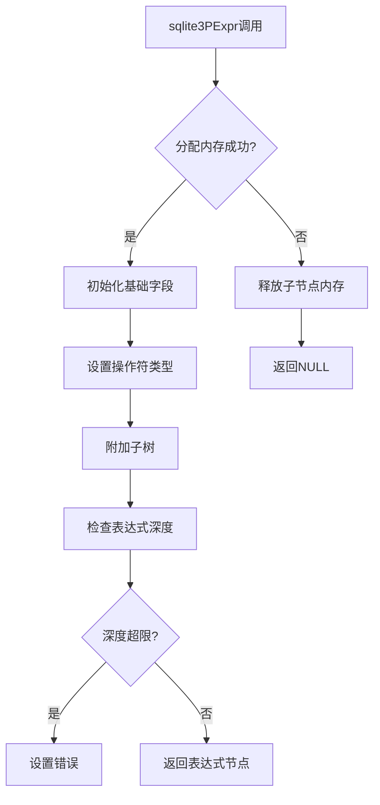

**图表来源**
- [expr.c](file://src/expr.c#L1029-L1070)

### 函数表达式构建（sqlite3ExprFunction）

函数表达式的构建涉及参数列表和函数名的处理：

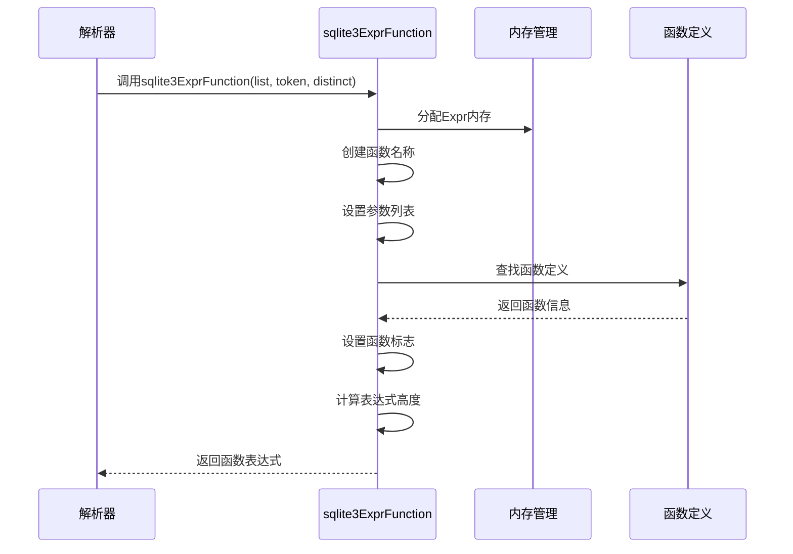

**图表来源**
- [expr.c](file://src/expr.c#L1158-L1200)

### 表达式列表管理

表达式列表用于存储函数参数、CASE语句的条件分支等：

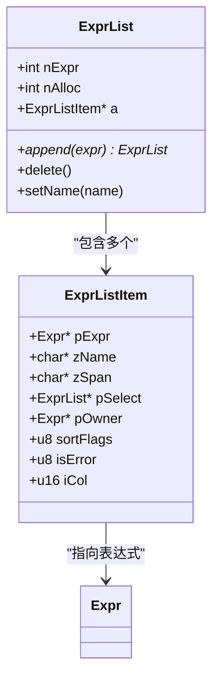

**图表来源**
- [expr.c](file://src/expr.c#L2005-L2073)

### 复杂表达式类型

#### 算术表达式

算术表达式支持基本的数学运算：

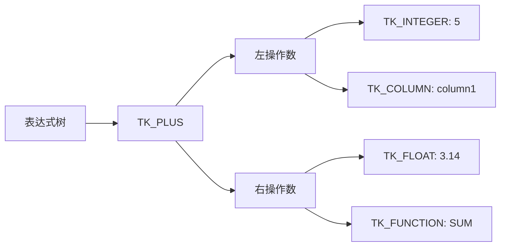

#### 函数调用表达式

函数调用表达式包含函数名和参数列表：

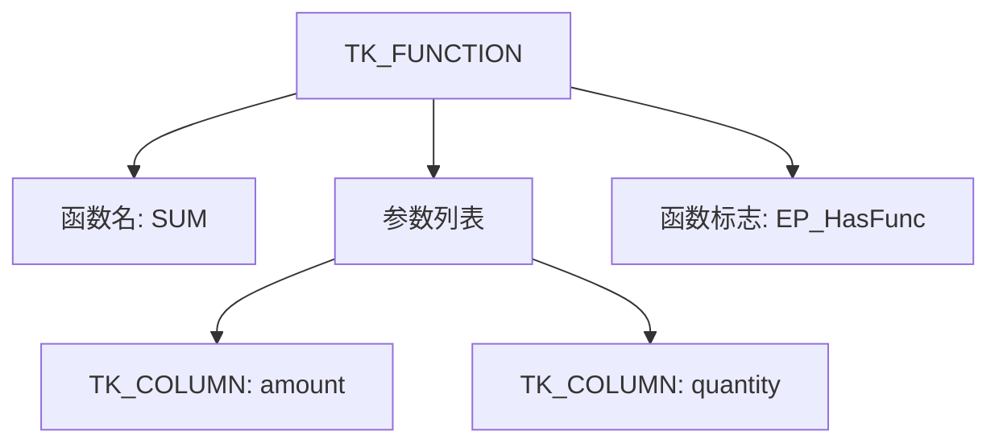

#### 子查询表达式

子查询表达式可以作为IN操作符的右操作数：

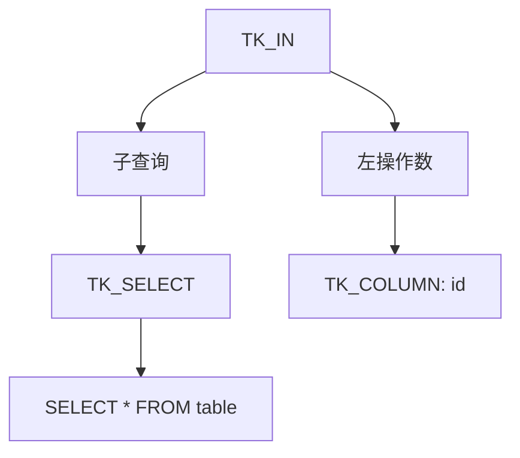

#### CASE表达式

CASE表达式支持条件分支逻辑：

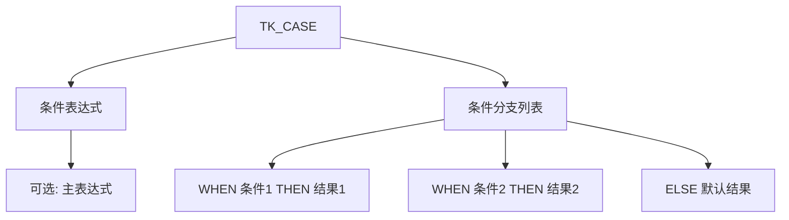

**章节来源**
- [parse.y](file://src/parse.y#L1501-L1534)
- [expr.c](file://src/expr.c#L5610-L5642)

### 表达式树在SQL语句中的应用

#### SELECT语句中的表达式树

在SELECT语句中，表达式树用于表示查询的各个部分：

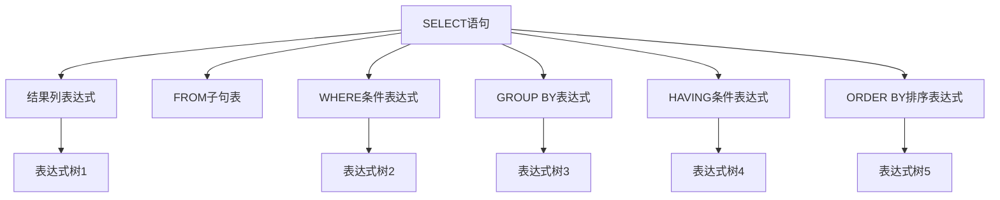

**图表来源**
- [select.c](file://src/select.c#L121-L160)

#### UPDATE语句中的表达式树

UPDATE语句中的表达式树用于更新条件和赋值表达式：

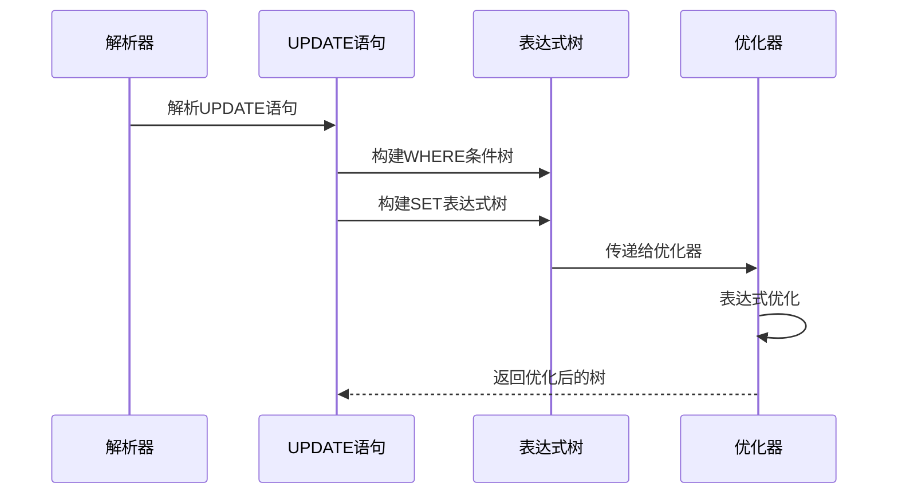

#### DELETE语句中的表达式树

DELETE语句主要使用WHERE条件表达式：

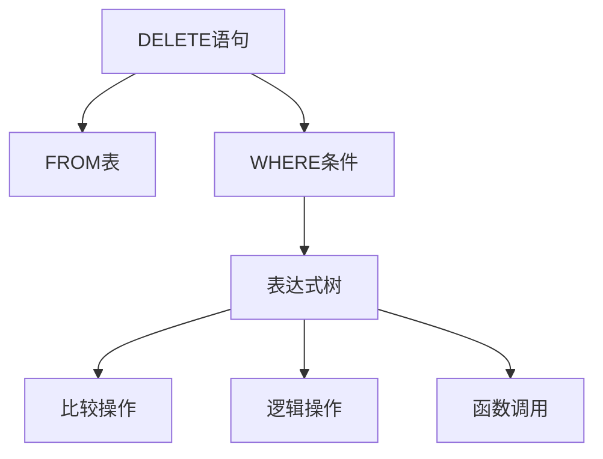

**图表来源**
- [delete.c](file://src/delete.c#L172-L195)

## 依赖关系分析

SQLite表达式树构建系统的依赖关系如下：

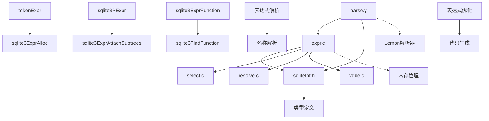

**图表来源**
- [parse.y](file://src/parse.y#L1-L100)
- [expr.c](file://src/expr.c#L1-L100)

**章节来源**
- [parse.y](file://src/parse.y#L1-L200)
- [expr.c](file://src/expr.c#L1-L200)

## 性能考虑

### 内存管理优化

SQLite在表达式树构建过程中采用了多种内存优化策略：

1. **内存池分配**：使用sqlite3DbMalloc系列函数进行内存分配
2. **表达式截断**：对于简单的表达式，使用EP_Reduced标志减少内存占用
3. **共享字符串**：相同字面量的表达式共享zToken字符串

### 表达式深度限制

为了防止栈溢出，SQLite实现了表达式深度限制：

```c
// 在expr.c中实现的深度检查
int sqlite3ExprCheckHeight(Parse *pParse, int nHeight){
  int rc = SQLITE_OK;
  int mxHeight = pParse->db->aLimit[SQLITE_LIMIT_EXPR_DEPTH];
  if( nHeight>mxHeight ){
    sqlite3ErrorMsg(pParse,
       "Expression tree is too large (maximum depth %d)", mxHeight
    );
    rc = SQLITE_ERROR;
  }
  return rc;
}
```

### 表达式优化

SQLite在表达式树构建过程中会进行多种优化：

1. **常量折叠**：在编译时计算常量表达式
2. **死代码消除**：移除永远不会被执行的表达式分支
3. **布尔表达式简化**：简化复杂的布尔逻辑表达式

## 故障排除指南

### 常见表达式树构建错误

#### 表达式深度超限

当表达式树过于复杂时，可能会触发深度限制错误：

```
Error: Expression tree is too large (maximum depth 1000)
```

**解决方案**：
- 简化复杂的嵌套表达式
- 使用临时表或视图分解复杂查询
- 增加SQLITE_LIMIT_EXPR_DEPTH限制（谨慎使用）

#### 内存分配失败

表达式树构建过程中的内存分配失败：

```
Error: out of memory
```

**解决方案**：
- 检查可用内存
- 优化查询以减少表达式复杂度
- 增加数据库连接的内存限制

#### 函数未定义

引用了不存在的函数：

```
Error: unknown function: MYFUNC()
```

**解决方案**：
- 确认函数已正确定义
- 检查函数名称拼写
- 确认函数权限设置正确

**章节来源**
- [expr.c](file://src/expr.c#L799-L850)

## 结论

SQLite的表达式树构建系统是一个精心设计的多层次架构，它通过parse.y中的语法规则驱动expr.c中的函数来构建高效的表达式树。这个系统具有以下特点：

1. **模块化设计**：清晰分离了解析、构建、优化和执行各个阶段
2. **类型安全**：使用强类型系统确保表达式的一致性
3. **性能优化**：通过多种优化技术提高表达式处理效率
4. **扩展性强**：支持新的操作符和表达式类型
5. **内存高效**：采用多种技术减少内存占用

表达式树构建是SQLite核心功能的基础，它不仅支持基本的SQL操作，还为复杂的查询优化和执行提供了坚实的基础。理解这个系统的工作原理对于深入掌握SQLite的内部机制具有重要意义。