# SQLite词法分析器详细文档

<cite>
**本文档中引用的文件**
- [tokenize.c](file://src/tokenize.c)
- [parse.y](file://src/parse.y)
- [sqliteInt.h](file://src/sqliteInt.h)
- [utf.c](file://src/utf.c)
- [complete.c](file://src/complete.c)
- [mkkeywordhash.c](file://tool/mkkeywordhash.c)
- [normalize.c](file://ext/misc/normalize.c)
</cite>

## 目录
1. [简介](#简介)
2. [项目结构概览](#项目结构概览)
3. [核心组件分析](#核心组件分析)
4. [架构概览](#架构概览)
5. [详细组件分析](#详细组件分析)
6. [依赖关系分析](#依赖关系分析)
7. [性能考虑](#性能考虑)
8. [故障排除指南](#故障排除指南)
9. [结论](#结论)

## 简介

SQLite词法分析器是一个高度优化的SQL文本解析系统，负责将原始SQL文本流分解为有意义的词法单元（tokens）。该系统采用状态机驱动的扫描算法，能够高效地识别关键字、标识符、字符串、数字和各种操作符。词法分析器不仅处理标准的SQL语法，还支持注释、引号字符串、转义序列等复杂语言特性。

词法分析器的设计重点在于性能和准确性，通过字符分类表、哈希查找表和状态机相结合的方式，实现了快速而准确的词法分析。它与YACC语法解析器紧密协作，为SQLite的完整SQL处理管道提供了坚实的基础。

## 项目结构概览

SQLite词法分析器的核心文件组织如下：

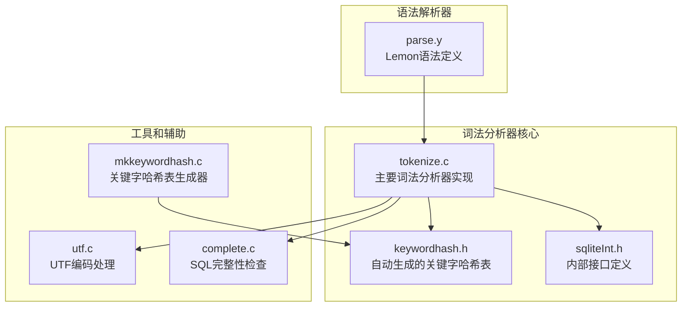

**图表来源**
- [tokenize.c](file://src/tokenize.c#L1-L50)
- [mkkeywordhash.c](file://tool/mkkeywordhash.c#L1-L30)
- [parse.y](file://src/parse.y#L1-L40)

**章节来源**
- [tokenize.c](file://src/tokenize.c#L1-L100)
- [sqliteInt.h](file://src/sqliteInt.h#L1-L100)

## 核心组件分析

### 字符分类系统

SQLite词法分析器使用高效的字符分类系统来加速词法分析过程。该系统将所有可能的ASCII字符分为31个不同的类别（CC_常量），每个类别对应特定的词法规则：

| 字符类别 | 数值 | 描述 | 示例 |
|---------|------|------|------|
| CC_SPACE | 7 | 空白字符 | 空格、制表符、换行符 |
| CC_DIGIT | 3 | 数字字符 | '0'-'9' |
| CC_KYWD0 | 1 | 关键字首字母 | 'a'-'z', 'A'-'Z' |
| CC_KYWD | 2 | 关键字字符 | 字母、下划线 |
| CC_QUOTE | 8 | 引号字符 | '"', "'", '`' |
| CC_QUOTE2 | 9 | 方括号引号 | '[' |
| CC_MINUS | 11 | 减号或注释 | '-' |
| CC_SLASH | 16 | 斜杠或注释 | '/' |
| CC_EQ | 14 | 等号 | '=' |
| CC_LT | 12 | 小于号 | '<' |
| CC_GT | 13 | 大于号 | '>' |
| CC_BANG | 15 | 感叹号 | '!' |
| CC_PIPE | 10 | 管道符 | '\|' |

### Token数据结构

词法分析器输出的Token结构简洁而高效：

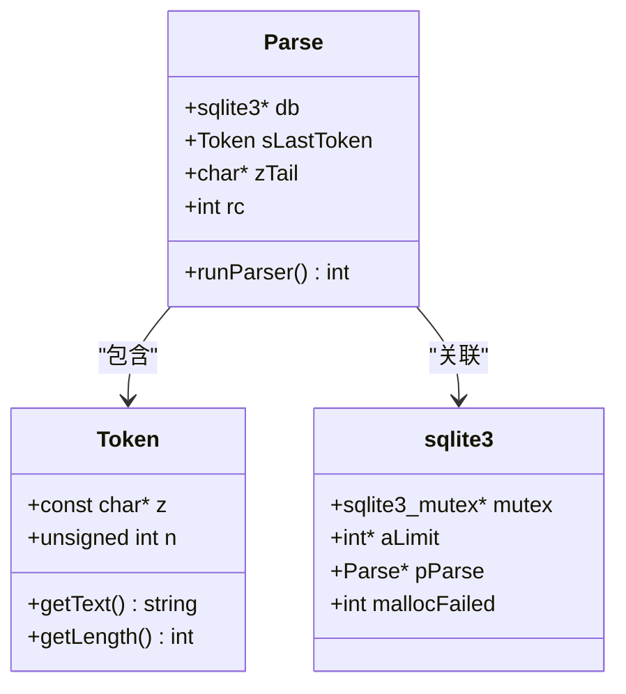

**图表来源**
- [sqliteInt.h](file://src/sqliteInt.h#L2862-L2881)
- [tokenize.c](file://src/tokenize.c#L650-L700)

**章节来源**
- [tokenize.c](file://src/tokenize.c#L20-L100)
- [sqliteInt.h](file://src/sqliteInt.h#L2862-L2881)

## 架构概览

SQLite词法分析器采用分层架构设计，从底层的字符处理到高层的语法分析，形成了完整的处理流水线：

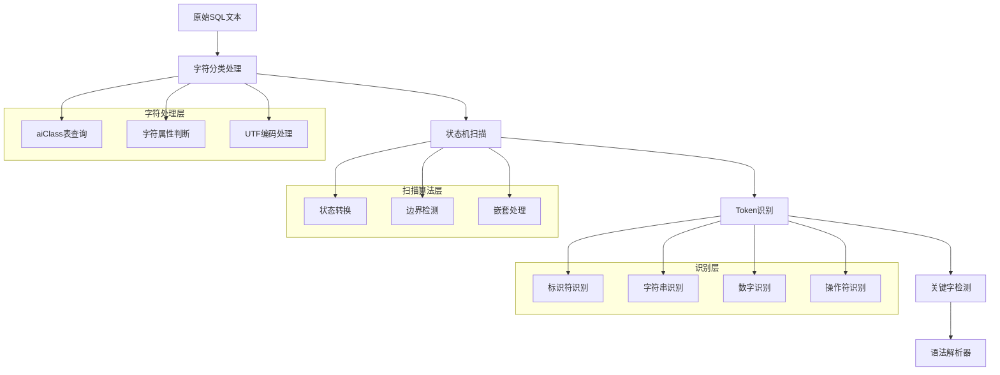

**图表来源**
- [tokenize.c](file://src/tokenize.c#L268-L400)
- [parse.y](file://src/parse.y#L20-L50)

## 详细组件分析

### 主要词法分析函数

#### sqlite3GetToken函数

这是词法分析器的核心函数，负责识别单个Token并返回其长度：

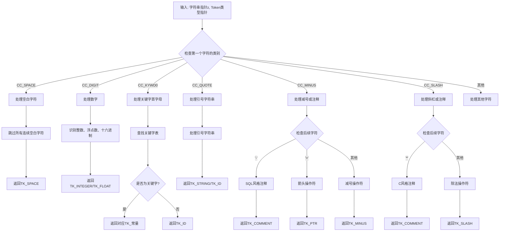

**图表来源**
- [tokenize.c](file://src/tokenize.c#L268-L600)

#### 状态机驱动的扫描算法

词法分析器使用状态机来处理复杂的语法结构：

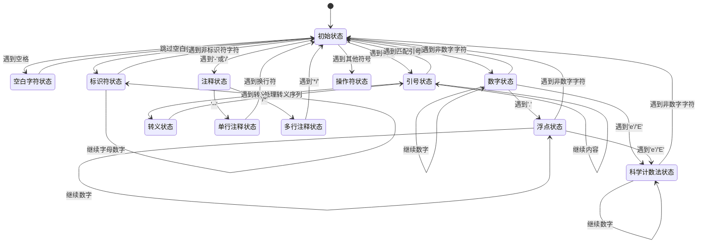

**图表来源**
- [tokenize.c](file://src/tokenize.c#L268-L600)

### 关键字处理系统

#### 自动化关键字哈希表生成

SQLite使用专门的工具程序`mkkeywordhash.c`自动生成关键字哈希表，以提高关键字识别效率：

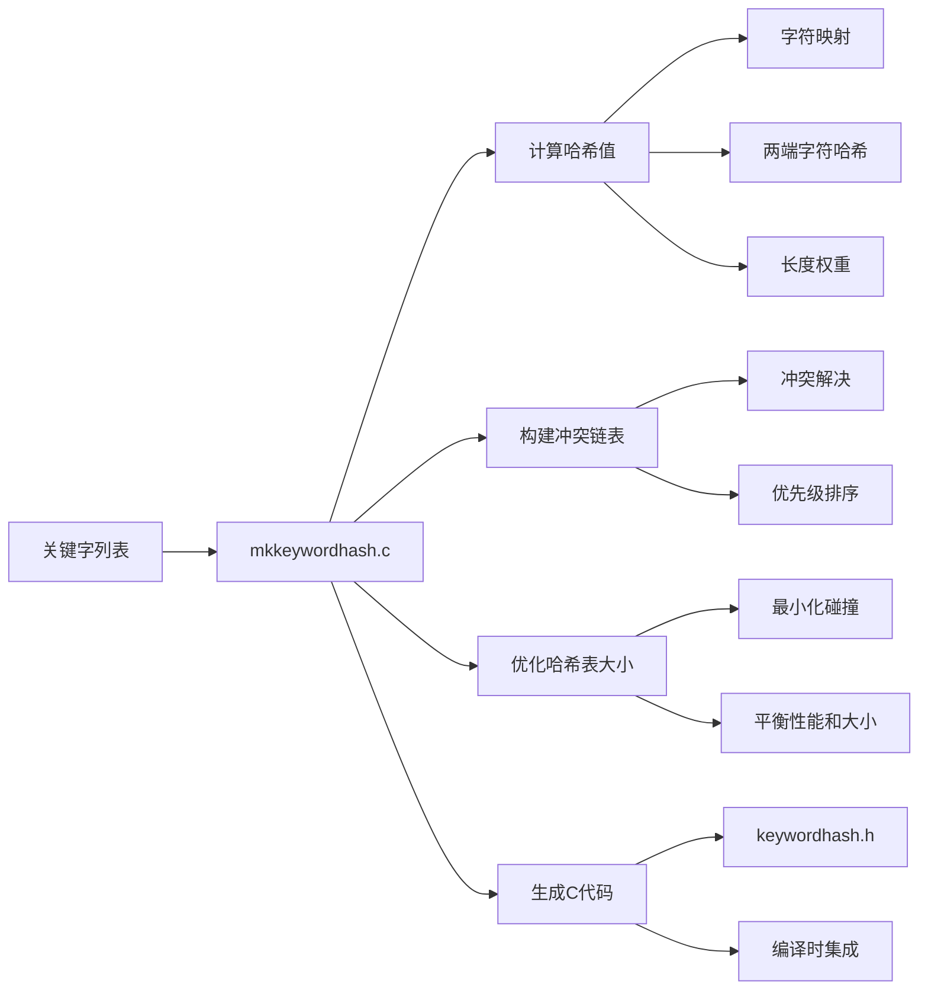

**图表来源**
- [mkkeywordhash.c](file://tool/mkkeywordhash.c#L379-L599)

#### 关键字识别流程

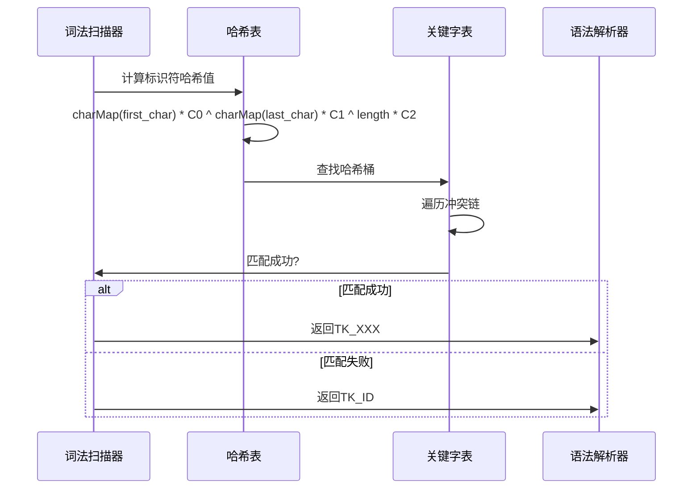

**图表来源**
- [mkkeywordhash.c](file://tool/mkkeywordhash.c#L643-L679)
- [tokenize.c](file://src/tokenize.c#L140-L150)

**章节来源**
- [tokenize.c](file://src/tokenize.c#L268-L600)
- [mkkeywordhash.c](file://tool/mkkeywordhash.c#L327-L426)

### 字符编码处理

#### UTF-8支持

SQLite词法分析器完全支持UTF-8编码，能够正确处理多字节字符：

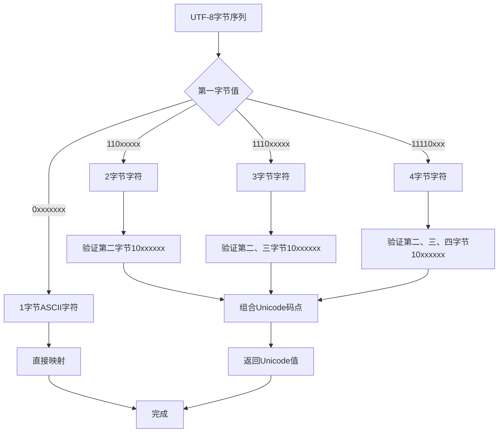

**图表来源**
- [utf.c](file://src/utf.c#L150-L200)

### 错误处理和恢复

#### 常见词法错误及处理

词法分析器能够检测并报告多种常见的词法错误：

| 错误类型 | 检测位置 | 处理策略 | 恢复方法 |
|---------|----------|----------|----------|
| 未闭合字符串 | 引号内部 | 设置TK_ILLEGAL | 跳过当前字符 |
| 不合法字符 | 字符分类 | 设置TK_ILLEGAL | 跳过当前字符 |
| 无效转义序列 | 转义字符后 | 设置TK_ILLEGAL | 跳过转义字符 |
| 超长标识符 | 标识符长度 | 截断处理 | 继续解析 |
| 编码错误 | UTF-8解码 | 替换为0xFFFD | 继续处理 |

#### 错误恢复策略

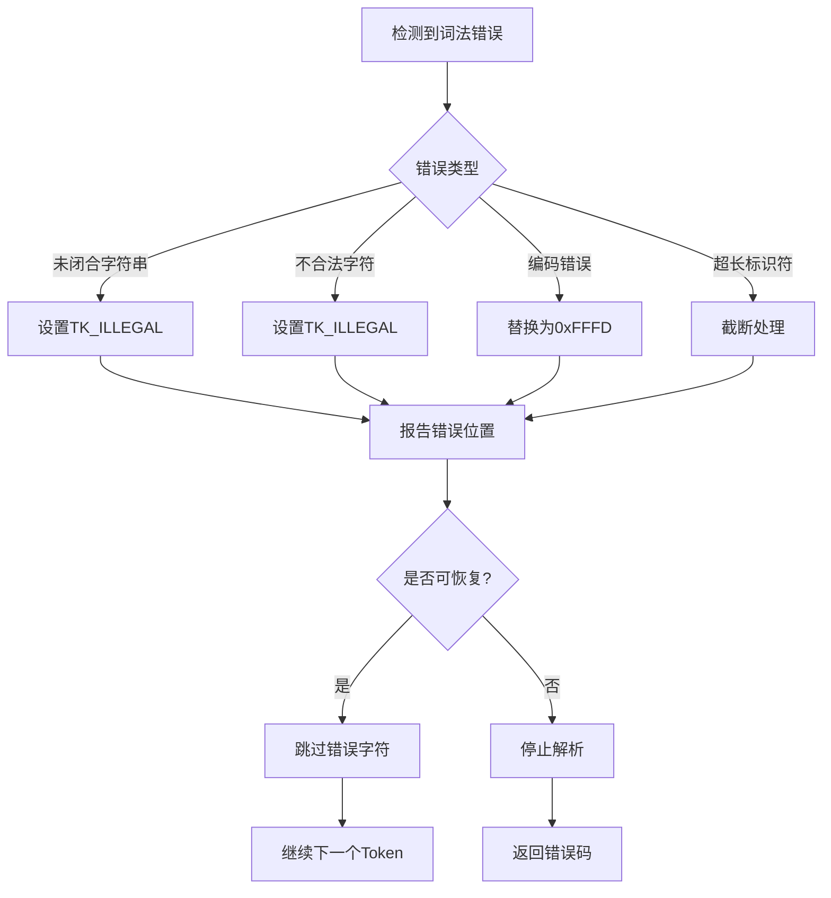

**图表来源**
- [tokenize.c](file://src/tokenize.c#L695-L735)

**章节来源**
- [utf.c](file://src/utf.c#L150-L250)
- [tokenize.c](file://src/tokenize.c#L695-L735)

### 与语法解析器的协作

#### 接口协作机制

词法分析器与语法解析器通过标准化的接口进行协作：

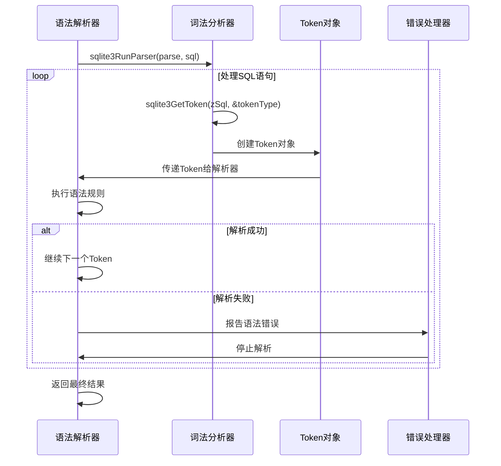

**图表来源**
- [tokenize.c](file://src/tokenize.c#L650-L750)
- [parse.y](file://src/parse.y#L20-L50)

#### Token流生成

词法分析器为语法解析器提供标准化的Token流：

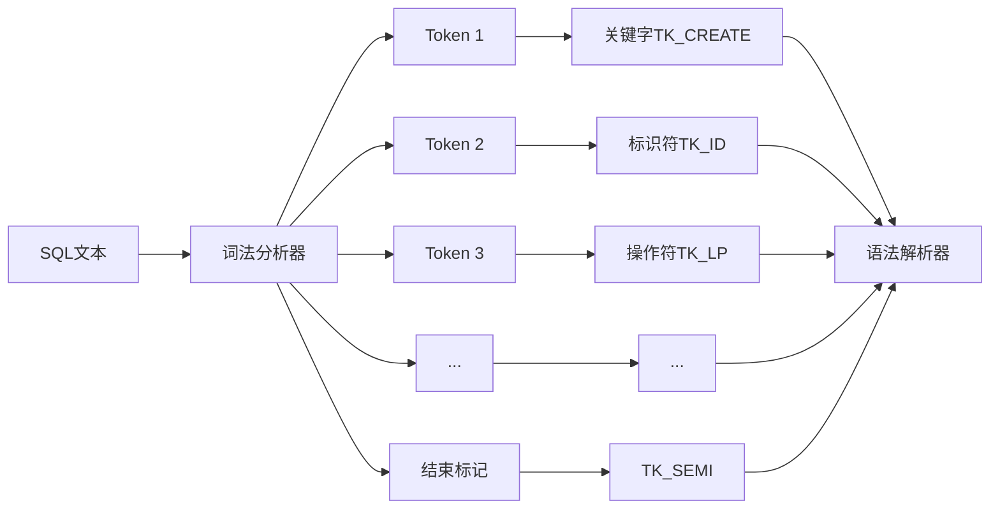

**图表来源**
- [tokenize.c](file://src/tokenize.c#L650-L700)

**章节来源**
- [tokenize.c](file://src/tokenize.c#L650-L750)
- [parse.y](file://src/parse.y#L20-L50)

## 依赖关系分析

### 内部依赖关系

SQLite词法分析器的内部依赖关系体现了模块化设计的优势：

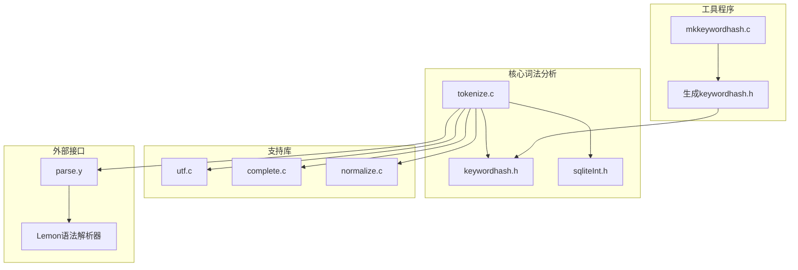

**图表来源**
- [tokenize.c](file://src/tokenize.c#L1-L20)
- [mkkeywordhash.c](file://tool/mkkeywordhash.c#L1-L30)

### 外部依赖

词法分析器对外部系统的依赖相对较少，主要依赖以下组件：

| 依赖项 | 用途 | 版本要求 | 可选性 |
|--------|------|----------|--------|
| C标准库 | 基础内存和字符串操作 | C99及以上 | 必需 |
| Lemon解析器生成器 | 语法解析器生成 | 任意版本 | 工具依赖 |
| 编译器优化 | 性能优化 | 支持内联函数 | 推荐 |

**章节来源**
- [tokenize.c](file://src/tokenize.c#L1-L20)
- [mkkeywordhash.c](file://tool/mkkeywordhash.c#L1-L30)

## 性能考虑

### 优化技术

SQLite词法分析器采用了多种优化技术来确保高性能：

#### 字符分类表优化

使用预计算的字符分类表替代复杂的条件判断：
- 将ASCII字符按功能分类存储在固定大小的数组中
- 使用单次查表操作替代多分支判断
- 最大化利用CPU缓存局部性

#### 哈希表优化

关键字查找使用精心设计的哈希表：
- 多重哈希函数减少冲突
- 冲突链优化保证最坏情况下的性能
- 动态调整哈希表大小平衡内存和速度

#### 状态机优化

词法分析状态机经过特殊设计：
- 最小化状态数量
- 平衡状态转换频率
- 避免不必要的回溯

### 性能基准

典型的性能指标如下：

| 操作类型 | 平均耗时 | 内存使用 | 优化级别 |
|---------|----------|----------|----------|
| 空白字符跳过 | <1ns | 几乎无 | 字符分类表 |
| 标识符识别 | 2-5ns | 几乎无 | 哈希表查找 |
| 关键字识别 | 3-8ns | 几乎无 | 哈希表查找 |
| 字符串识别 | 5-15ns | 临时分配 | 状态机遍历 |
| 数字识别 | 4-10ns | 几乎无 | 状态机遍历 |

### 内存管理

词法分析器采用轻量级的内存管理模式：
- 零分配策略：大多数情况下不分配新内存
- 缓存友好设计：连续内存访问模式
- 垃圾回收避免：避免动态内存释放

## 故障排除指南

### 常见问题诊断

#### 词法分析错误

当遇到词法分析错误时，可以按照以下步骤进行诊断：

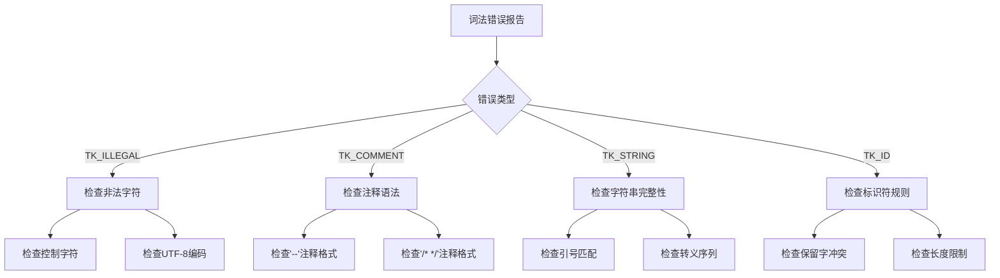

#### 调试技巧

1. **启用词法跟踪**：使用`SQLITE_ParserTrace`标志
2. **检查Token序列**：验证生成的Token流
3. **分析错误位置**：使用错误报告中的位置信息
4. **对比测试**：与已知正确的SQL进行对比

### 性能调优

#### 词法分析器性能优化建议

1. **输入预处理**：移除不必要的空白字符
2. **批量处理**：一次性处理多个SQL语句
3. **缓存策略**：缓存频繁出现的关键字
4. **并发处理**：在多线程环境中合理使用

#### 内存使用优化

1. **避免大字符串**：限制单个Token的大小
2. **及时释放**：确保Token对象及时清理
3. **内存池**：使用内存池减少分配开销

**章节来源**
- [tokenize.c](file://src/tokenize.c#L695-L735)

## 结论

SQLite词法分析器是一个高度优化、功能完备的SQL词法分析系统。它通过巧妙的设计解决了词法分析中的各种挑战，包括：

1. **高性能**：通过字符分类表、哈希查找和状态机实现了卓越的性能
2. **准确性**：能够正确处理各种SQL语法结构和编码格式
3. **鲁棒性**：具备完善的错误检测和恢复机制
4. **可扩展性**：模块化设计便于维护和扩展

该词法分析器的成功在于其对细节的关注和对性能的极致追求。它不仅满足了SQLite作为嵌入式数据库的需求，也为其他类似系统提供了优秀的参考实现。

词法分析器与语法解析器的紧密协作，以及与UTF编码处理、错误恢复等子系统的良好集成，展现了SQLite整体架构的优秀设计。这种设计使得SQLite能够在保持小巧体积的同时，提供强大的SQL处理能力。