# SQLite语法分析器深度技术文档

<cite>
**本文档引用的文件**
- [parse.y](file://src/parse.y)
- [lemon.c](file://tool/lemon.c)
- [lempar.c](file://tool/lempar.c)
- [lemon.html](file://doc/lemon.html)
- [tokenize.c](file://src/tokenize.c)
- [sqliteInt.h](file://src/sqliteInt.h)
- [expr.c](file://src/expr.c)
- [resolve.c](file://src/resolve.c)
</cite>

## 目录
1. [引言](#引言)
2. [项目架构概览](#项目架构概览)
3. [LALR(1)语法分析器设计](#lalr1语法分析器设计)
4. [核心语法产生式规则](#核心语法产生式规则)
5. [语法树构建过程](#语法树构建过程)
6. [语法冲突处理与优先级](#语法冲突处理与优先级)
7. [错误恢复机制](#错误恢复机制)
8. [内存使用与性能特征](#内存使用与性能特征)
9. [自定义SQL语法扩展](#自定义sql语法扩展)
10. [故障排除指南](#故障排除指南)
11. [总结](#总结)

## 引言

SQLite语法分析器是一个基于LALR(1)算法的高性能SQL解析系统，采用YACC/Bison风格的语法描述语言（通过Lemon工具生成）。该分析器负责将SQL文本转换为抽象语法树（AST），为后续的语义分析和代码生成奠定基础。

本文档深入分析SQLite语法分析器的核心设计原理，包括LALR(1)语法规则的设计、语法树节点的构造过程、语法冲突的解决策略以及性能优化技术。

## 项目架构概览

SQLite语法分析器的整体架构如下：

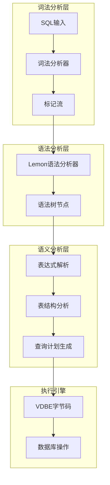

**图表来源**
- [parse.y](file://src/parse.y#L1-L50)
- [lemon.c](file://tool/lemon.c#L1-L100)

**章节来源**
- [parse.y](file://src/parse.y#L1-L100)
- [lempar.c](file://tool/lempar.c#L1-L50)

## LALR(1)语法分析器设计

### Lemon语法生成器

SQLite使用Lemon作为语法分析器生成器，它是一个改进版的YACC/Bison工具。Lemon的主要特点包括：

1. **符号命名机制**：避免了传统YACC中位置计数的错误
2. **更好的错误报告**：提供更精确的语法错误定位
3. **可重用性**：支持在多个上下文中重用相同的语法定义

### 核心语法定义

语法分析器的核心配置包括：

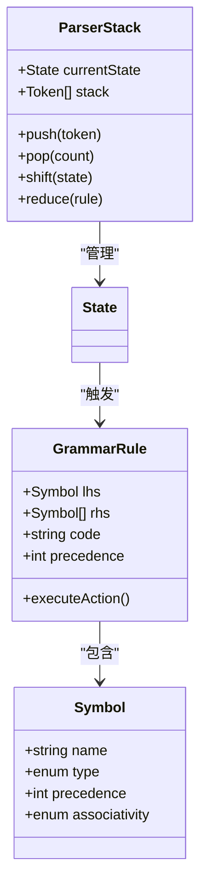

**图表来源**
- [lemon.c](file://tool/lemon.c#L316-L345)
- [lempar.c](file://tool/lempar.c#L291-L339)

**章节来源**
- [lemon.c](file://tool/lemon.c#L316-L402)
- [lempar.c](file://tool/lempar.c#L341-L381)

## 核心语法产生式规则

### SELECT语句文法规则

SELECT语句是最复杂的SQL语句之一，其语法产生式规则体现了SQLite语法分析器的强大功能：

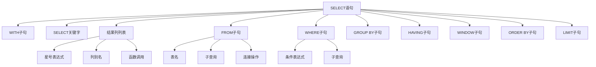

**图表来源**
- [parse.y](file://src/parse.y#L600-L700)

### INSERT语句文法规则

INSERT语句的语法规则展示了SQLite对不同插入方式的支持：

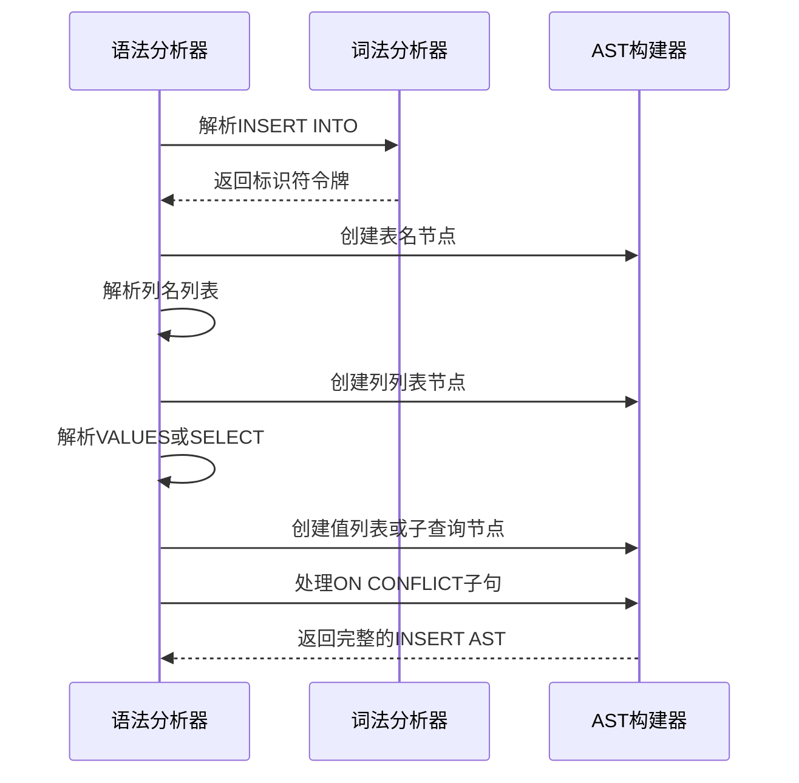

**图表来源**
- [parse.y](file://src/parse.y#L1200-L1300)

### 表达式处理规则

表达式的解析是语法分析器的核心功能，涉及运算符优先级和结合性：

| 运算符类别 | 优先级 | 结合性 | 示例 |
|------------|--------|--------|------|
| 一元运算符 | 最高 | 右结合 | `NOT`, `+`, `-` |
| 乘除模运算 | 中高 | 左结合 | `*`, `/`, `%` |
| 加减运算 | 中低 | 左结合 | `+`, `-` |
| 比较运算 | 中等 | 左结合 | `=`, `<`, `>`, `<>` |
| 逻辑运算 | 最低 | 左结合 | `AND`, `OR` |

**章节来源**
- [parse.y](file://src/parse.y#L295-L337)
- [parse.y](file://src/parse.y#L1087-L1138)

## 语法树构建过程

### 表达式节点构造

语法树中的每个表达式节点都遵循统一的结构模式：

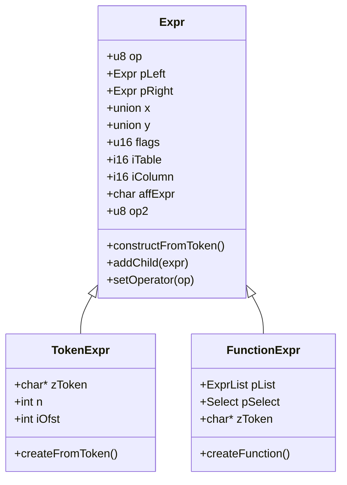

**图表来源**
- [sqliteInt.h](file://src/sqliteInt.h#L2967-L2993)
- [parse.y](file://src/parse.y#L1100-L1150)

### 语法树节点生命周期

语法树节点的创建和销毁遵循严格的生命周期管理：

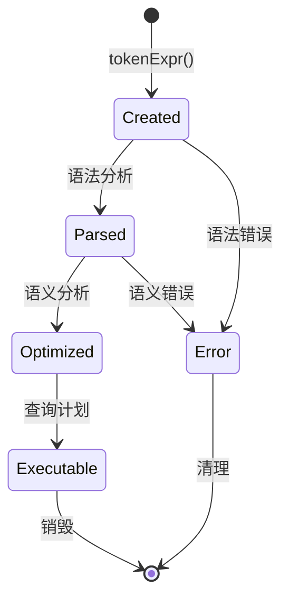

**章节来源**
- [parse.y](file://src/parse.y#L1100-L1150)
- [expr.c](file://src/expr.c#L2838-L2862)

## 语法冲突处理与优先级

### 冲突类型与解决方案

Lemon语法分析器能够自动检测和解决多种类型的语法冲突：

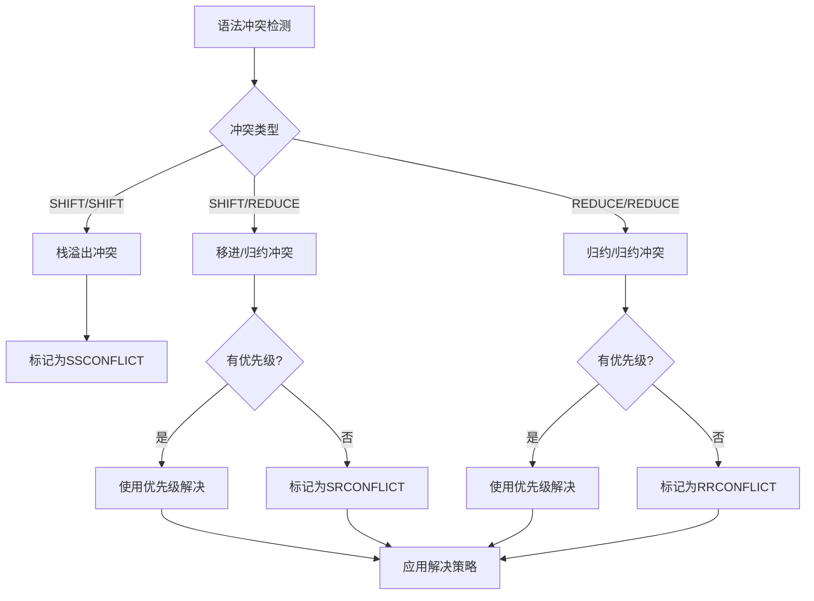

**图表来源**
- [lemon.c](file://tool/lemon.c#L1304-L1382)

### 优先级定义机制

SQLite语法分析器通过显式的优先级声明来解决运算符优先级问题：

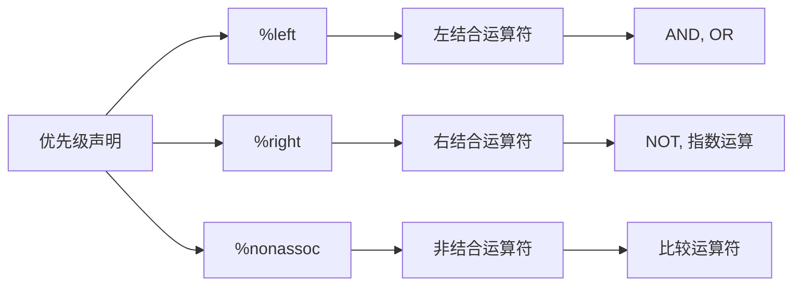

**图表来源**
- [parse.y](file://src/parse.y#L295-L337)

**章节来源**
- [lemon.c](file://tool/lemon.c#L1304-L1382)
- [parse.y](file://src/parse.y#L252-L263)

## 错误恢复机制

### 错误处理策略

SQLite语法分析器实现了多层次的错误恢复机制：

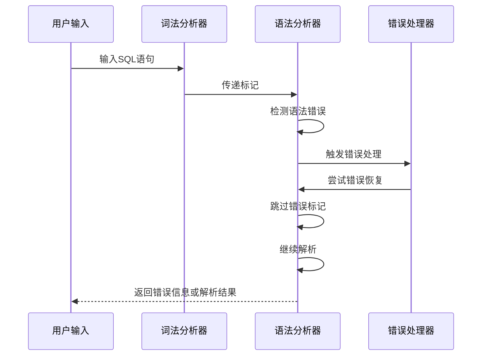

**图表来源**
- [lempar.c](file://tool/lempar.c#L1000-L1033)

### 错误恢复配置

语法分析器提供了多种错误恢复配置选项：

| 配置项 | 默认值 | 描述 |
|--------|--------|------|
| `YYNOERRORRECOVERY` | 未定义 | 禁用错误恢复 |
| `YYERRORSYMBOL` | 定义 | 使用错误符号 |
| `YYFALLBACK` | 启用 | 启用标记回退 |
| `YYSTACKDEPTH` | 100 | 初始栈大小 |

**章节来源**
- [lempar.c](file://tool/lempar.c#L1000-L1033)
- [parse.y](file://src/parse.y#L40-L50)

## 内存使用与性能特征

### 内存分配策略

SQLite语法分析器采用了高效的内存管理策略：

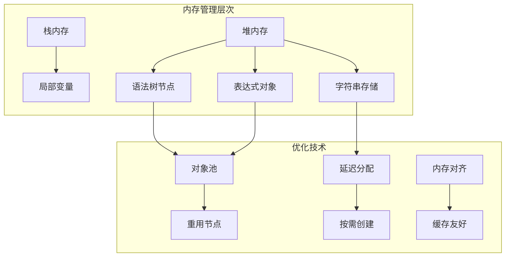

**图表来源**
- [lempar.c](file://tool/lempar.c#L291-L339)

### 性能优化特征

语法分析器的性能特征体现在以下几个方面：

| 优化技术 | 效果 | 实现方式 |
|----------|------|----------|
| 符号预分配 | 减少运行时开销 | 编译时确定符号数量 |
| 栈增长控制 | 防止栈溢出 | 动态调整栈大小 |
| 优先级缓存 | 提升解析速度 | 预计算运算符优先级 |
| 错误快速失败 | 减少无效尝试 | 及时终止错误路径 |

**章节来源**
- [lempar.c](file://tool/lempar.c#L291-L339)
- [parse.y](file://src/parse.y#L1-L50)

## 自定义SQL语法扩展

### 扩展语法的基本原则

要向SQLite添加自定义SQL语法，需要遵循以下步骤：

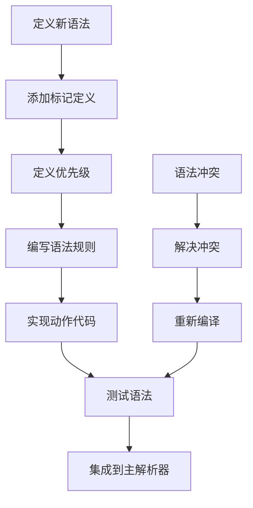

### 扩展示例：自定义聚合函数

以下是如何扩展SQLite以支持自定义聚合函数的示例：

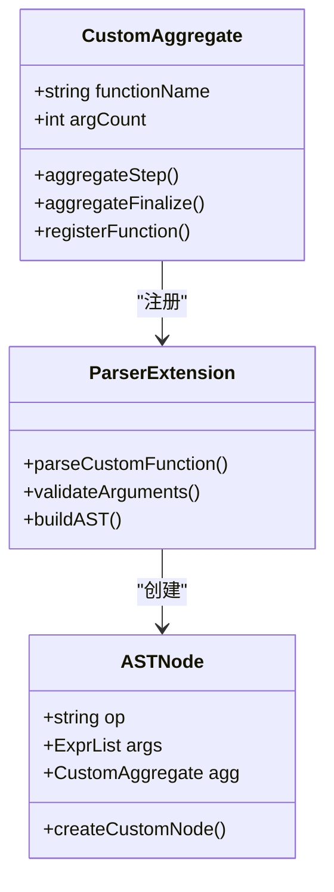

**章节来源**
- [lemon.html](file://doc/lemon.html#L460-L495)
- [parse.y](file://src/parse.y#L1-L100)

## 故障排除指南

### 常见语法错误

以下是SQLite语法分析器常见的错误类型及其解决方案：

| 错误类型 | 症状 | 解决方案 |
|----------|------|----------|
| 语法错误 | near "关键词": syntax error | 检查SQL语法正确性 |
| 标记冲突 | unexpected token | 检查关键字使用 |
| 优先级错误 | shift/reduce conflict | 调整运算符优先级 |
| 栈溢出 | stack overflow | 检查递归深度 |

### 调试技巧

1. **启用详细错误报告**：使用`YYDEBUG`宏获取详细的解析过程信息
2. **分步调试**：将复杂SQL分解为简单片段逐一测试
3. **语法可视化**：使用Lemon工具生成语法图进行分析
4. **内存检查**：监控内存泄漏和越界访问

**章节来源**
- [lempar.c](file://tool/lempar.c#L1000-L1033)
- [lemon.c](file://tool/lemon.c#L1304-L1382)

## 总结

SQLite语法分析器是一个高度优化的LALR(1)语法分析系统，具有以下关键特征：

1. **强大的语法表达能力**：支持复杂的SQL语法结构
2. **高效的解析性能**：通过符号预分配和优先级缓存优化
3. **健壮的错误处理**：多层次的错误恢复机制
4. **灵活的扩展性**：支持自定义语法扩展

该语法分析器的设计充分体现了理论与实践的结合，既保持了算法的严谨性，又满足了实际应用的性能要求。对于希望深入了解SQL解析机制的开发者来说，这是一个优秀的学习案例。

通过本文档的分析，我们可以看到SQLite语法分析器在设计上的精妙之处，以及它如何通过精心设计的语法规则和高效的实现策略，为整个数据库系统的稳定运行奠定了坚实的基础。