# B-Tree 存储结构

<cite>
**本文档引用的文件**
- [btree.c](file://src/btree.c)
- [btree.h](file://src/btree.h)
- [btreeInt.h](file://src/btreeInt.h)
- [dbstat.c](file://src/dbstat.c)
- [test_btree.c](file://src/test_btree.c)
- [showdb.c](file://tool/showdb.c)
- [showwal.c](file://tool/showwal.c)
</cite>

## 目录
1. [简介](#简介)
2. [B-Tree 核心架构](#b-tree-核心架构)
3. [页面布局与结构](#页面布局与结构)
4. [游标操作与查找](#游标操作与查找)
5. [页面分裂与合并机制](#页面分裂与合并机制)
6. [键值对存储格式](#键值对存储格式)
7. [性能优化与调优](#性能优化与调优)
8. [调试与监控工具](#调试与监控工具)
9. [最佳实践指南](#最佳实践指南)
10. [总结](#总结)

## 简介

SQLite 的 B-Tree 实现是其核心数据结构，负责管理数据库表和索引的物理存储。B-Tree 提供了高效的有序数据访问、范围查询和唯一性约束支持。本文档深入探讨了 SQLite 中 B-Tree 的实现细节，包括页面结构、游标操作、平衡算法以及性能优化策略。

## B-Tree 核心架构

### 整体架构设计

SQLite 的 B-Tree 架构采用分层设计，主要包含以下核心组件：

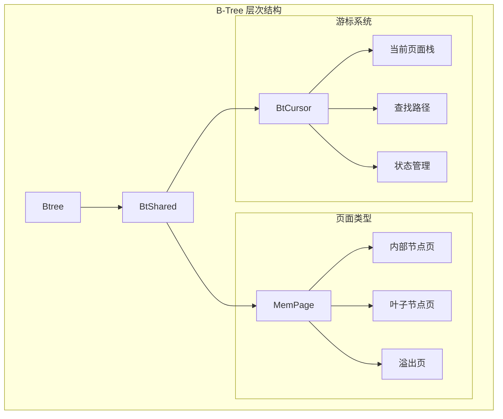

**图表来源**
- [btreeInt.h](file://src/btreeInt.h#L285-L303)
- [btree.h](file://src/btree.h#L100-L150)

### 核心数据结构

B-Tree 的核心数据结构定义了完整的存储层次：

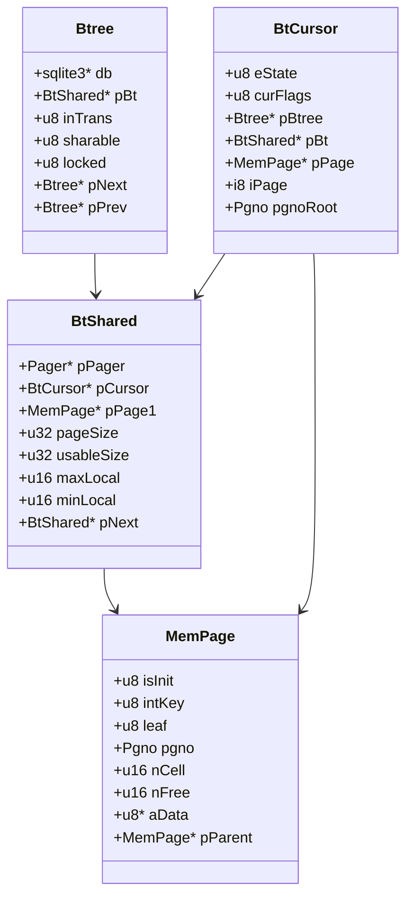

**图表来源**
- [btreeInt.h](file://src/btreeInt.h#L285-L303)
- [btreeInt.h](file://src/btreeInt.h#L304-L350)

**章节来源**
- [btreeInt.h](file://src/btreeInt.h#L285-L400)
- [btree.h](file://src/btree.h#L100-L200)

## 页面布局与结构

### 页面头部结构

每个 B-Tree 页面都有标准化的头部结构，包含关键的元数据信息：

| 偏移量 | 大小 | 字段名 | 描述 |
|--------|------|--------|------|
| 0 | 1 | flags | 页面标志位：intkey、zerodata、leafdata、leaf |
| 1 | 2 | first_freeblock | 第一个空闲块的偏移量 |
| 3 | 2 | nCell | 页面上的单元格数量 |
| 5 | 2 | cell_content_area | 单元格内容区域的起始字节 |
| 7 | 1 | fragmented_bytes | 总碎片字节数 |
| 8 | 4 | right_child | 右子页面指针（非叶子节点） |

### 内部节点与叶子节点差异

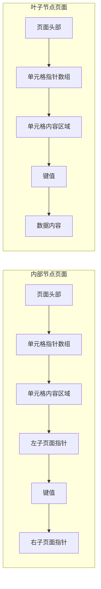

**图表来源**
- [btreeInt.h](file://src/btreeInt.h#L106-L136)

### 单元格（Cell）格式

单元格是 B-Tree 中存储实际数据的基本单位，其格式根据页面类型有所不同：

#### 表叶子节点单元格格式
```
+---------+---------+---------+---------+
| 左子页面| 键长度  | 键值    | 数据内容|
| 指针(4B)| Varint  |         |         |
+---------+---------+---------+---------+
```

#### 索引内部节点单元格格式
```
+---------+---------+---------+
| 左子页面| 键长度  | 键值    |
| 指针(4B)| Varint  |         |
+---------+---------+---------+
```

**章节来源**
- [btreeInt.h](file://src/btreeInt.h#L106-L187)
- [btree.c](file://src/btree.c#L1393-L1419)

## 游标操作与查找

### 游标状态管理

B-Tree 游标维护复杂的状态信息以支持高效的定位和遍历操作：

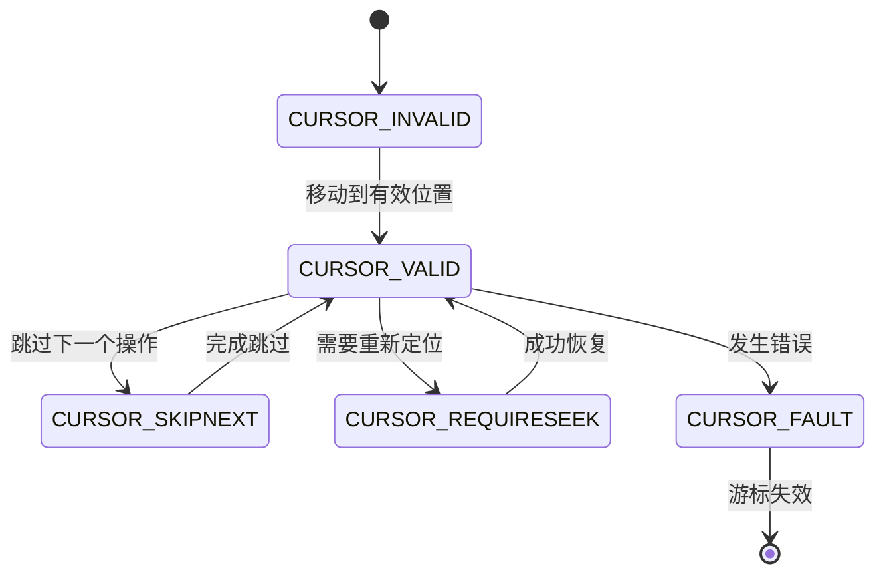

**图表来源**
- [btreeInt.h](file://src/btreeInt.h#L580-L600)

### 查找路径算法

B-Tree 的查找操作通过二分搜索算法实现，支持精确匹配和范围查询：

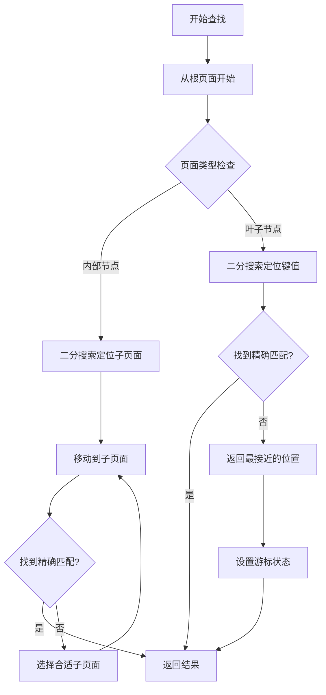

**图表来源**
- [btree.c](file://src/btree.c#L5745-L5780)
- [btree.c](file://src/btree.c#L6070-L6096)

### 移动操作实现

游标支持多种移动操作，每种操作都有特定的优化策略：

| 操作类型 | 时间复杂度 | 用途 | 优化策略 |
|----------|------------|------|----------|
| Next | O(1) | 向前遍历 | 利用页面内顺序 |
| Previous | O(1) | 向后遍历 | 反向页面遍历 |
| First | O(log n) | 移动到首条记录 | 左侧最深路径 |
| Last | O(log n) | 移动到最后一条记录 | 右侧最深路径 |
| Moveto | O(log n) | 精确定位 | 二分搜索 |

**章节来源**
- [btree.c](file://src/btree.c#L5596-L5631)
- [btree.c](file://src/btree.c#L5745-L5780)

## 页面分裂与合并机制

### 平衡算法原理

B-Tree 维护平衡性的核心算法确保树的高度保持对数级别：

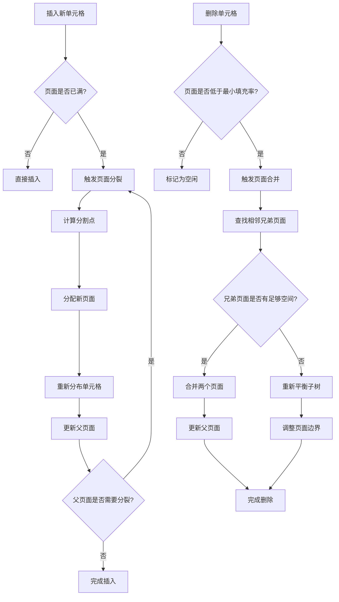

**图表来源**
- [btree.c](file://src/btree.c#L8165-L8213)
- [btree.c](file://src/btree.c#L8885-L8915)

### 分裂策略详解

页面分裂采用保守策略，优先考虑空间利用率：

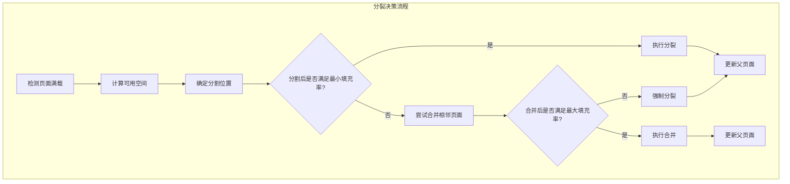

**图表来源**
- [btree.c](file://src/btree.c#L8260-L8308)

**章节来源**
- [btree.c](file://src/btree.c#L8165-L8403)
- [btree.c](file://src/btree.c#L8608-L8716)

## 键值对存储格式

### 可变长度整数编码

SQLite 使用可变长度整数（Varint）编码来节省存储空间：

| 数值范围 | 编码长度 | 编码格式 | 示例 |
|----------|----------|----------|------|
| 0-127 | 1字节 | 最高位为0 | 0x05 |
| 128-16383 | 2字节 | 第一字节最高位为1 | 0x85 0x01 |
| 16384-2097151 | 3字节 | 第一字节最高位为1 | 0x85 0x81 0x01 |

### 键值存储优化

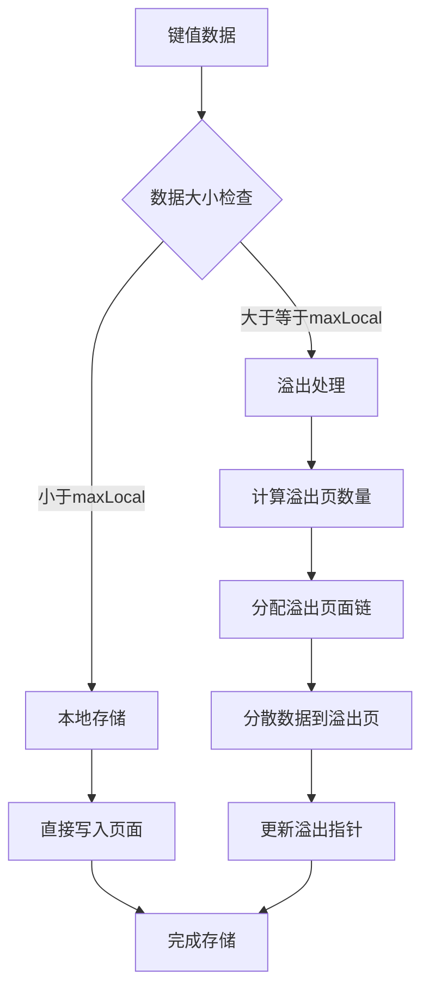

**图表来源**
- [btree.c](file://src/btree.c#L1195-L1225)
- [btree.c](file://src/btree.c#L1328-L1352)

### 填充因子控制

SQLite 通过填充因子参数控制页面的使用效率：

| 参数 | 默认值 | 范围 | 影响 |
|------|--------|------|------|
| maxLocal | 64% 页面大小 | 1-255字节 | 最大本地存储大小 |
| minLocal | 32% 页面大小 | 1-255字节 | 最小本地存储大小 |
| minLeaf | 32% 页面大小 | 1-255字节 | 叶子节点最小填充率 |

**章节来源**
- [btree.c](file://src/btree.c#L1000-L1500)
- [btreeInt.h](file://src/btreeInt.h#L158-L187)

## 性能优化与调优

### 页面大小优化

页面大小是影响 B-Tree 性能的关键参数：

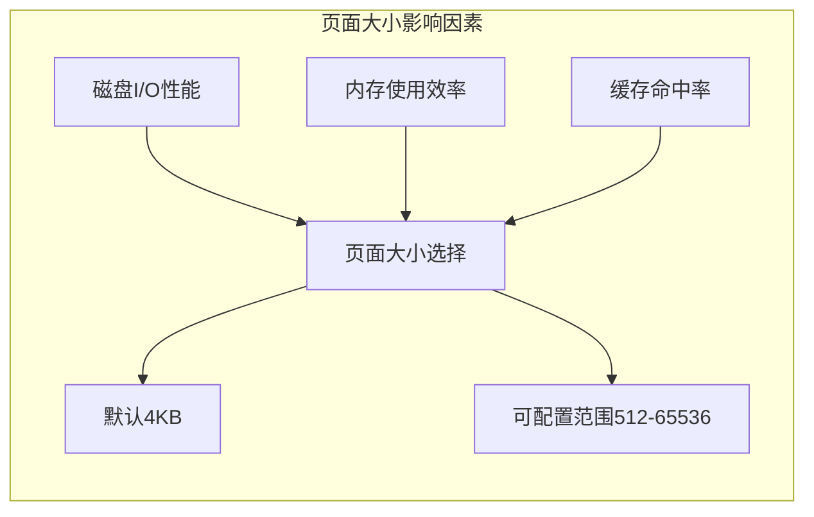

### 填充因子调优策略

不同工作负载下的最优填充因子：

| 工作负载类型 | 推荐填充因子 | 原因 |
|-------------|-------------|------|
| 读密集型 | 80-90% | 减少页面分裂频率 |
| 写密集型 | 60-70% | 平衡插入性能和空间利用率 |
| 混合型 | 70-80% | 在性能和空间之间取得平衡 |

### 缓存优化


**章节来源**
- [pcache.c](file://src/pcache.c#L354-L376)
- [pcache.c](file://src/pcache.c#L869-L921)

## 调试与监控工具

### dbstat 虚拟表

SQLite 提供了强大的 dbstat 虚拟表用于分析 B-Tree 结构：

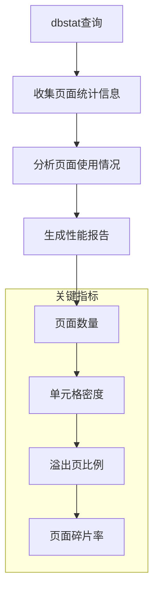

**图表来源**
- [dbstat.c](file://src/dbstat.c#L1-L100)

### 调试工具函数

SQLite 提供了多个调试工具函数帮助开发者分析 B-Tree 状态：

| 函数名 | 功能 | 返回值 |
|--------|------|--------|
| sqlite3BtreeSeekCount() | 获取查找次数 | u64 |
| sqlite3BtreeCursorList() | 显示所有游标信息 | void |
| sqlite3BtreeSharedCacheReport() | 共享缓存状态报告 | Tcl列表 |

### 性能监控指标

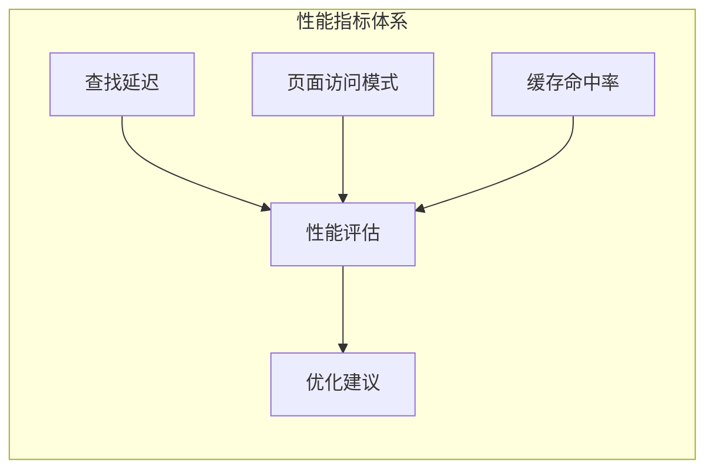

**章节来源**
- [dbstat.c](file://src/dbstat.c#L1-L200)
- [test_btree.c](file://src/test_btree.c#L1-L62)

## 最佳实践指南

### 设计原则

1. **合理选择页面大小**：根据数据特征选择合适的页面大小
2. **优化索引设计**：避免过多的索引，优先考虑复合索引
3. **控制键值长度**：尽量使用较短的键值以提高存储效率
4. **定期维护**：执行 VACUUM 操作清理碎片

### 性能调优建议

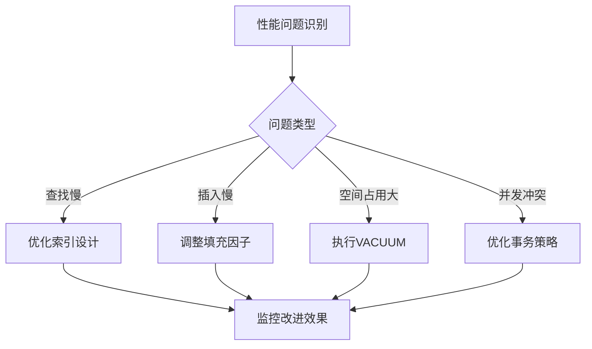

### 常见陷阱避免

| 问题类型 | 症状 | 解决方案 |
|----------|------|----------|
| 过度索引 | 插入性能差 | 合并或删除冗余索引 |
| 大键值 | 页面频繁分裂 | 使用哈希函数生成短键 |
| 频繁更新 | 页面碎片化严重 | 定期执行VACUUM |
| 并发冲突 | 死锁或超时 | 优化事务粒度 |

## 总结

SQLite 的 B-Tree 实现是一个高度优化的数据结构，通过精心设计的页面布局、智能的平衡算法和丰富的性能调优选项，为数据库应用提供了高效可靠的存储基础。理解这些底层机制有助于开发者更好地设计数据库架构，优化查询性能，并有效地进行故障诊断和性能调优。

掌握 B-Tree 的内部工作原理不仅能够提升数据库应用的性能，还能帮助开发者在面对复杂数据存储需求时做出更明智的设计决策。随着数据规模的增长和查询复杂度的提升，深入理解这些核心概念将变得越来越重要。