# SQLite存储引擎详细文档

<cite>
**本文档中引用的文件**
- [btree.c](file://src/btree.c)
- [btree.h](file://src/btree.h)
- [btreeInt.h](file://src/btreeInt.h)
- [pager.c](file://src/pager.c)
- [pager.h](file://src/pager.h)
- [wal.c](file://src/wal.c)
- [wal.h](file://src/wal.h)
- [pcache.c](file://src/pcache.c)
- [pcache.h](file://src/pcache.h)
- [vacuum.c](file://src/vacuum.c)
</cite>

## 目录
1. [简介](#简介)
2. [系统架构概览](#系统架构概览)
3. [B-Tree结构详解](#b-tree结构详解)
4. [页面缓存系统](#页面缓存系统)
5. [写前日志(WAL)机制](#写前日志wal机制)
6. [检查点与恢复机制](#检查点与恢复机制)
7. [性能调优指南](#性能调优指南)
8. [故障排除指南](#故障排除指南)
9. [总结](#总结)

## 简介

SQLite存储引擎是一个高度优化的嵌入式数据库系统，采用B-Tree作为主要的数据组织结构，结合页面缓存和写前日志(WAL)技术，提供了高性能、高可靠性的数据存储解决方案。本文档深入解析SQLite存储引擎的核心组件，包括B-Tree结构、页面缓存(Pager)系统、WAL机制以及相关的性能调优策略。

## 系统架构概览

SQLite存储引擎采用分层架构设计，从上到下主要包括以下层次：

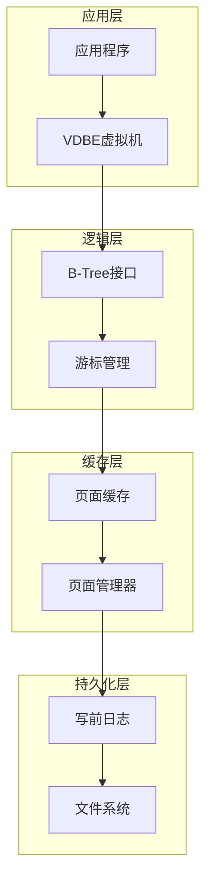

**图表来源**
- [btree.c](file://src/btree.c#L1-L50)
- [pager.c](file://src/pager.c#L1-L50)
- [wal.c](file://src/wal.c#L1-L50)

### 核心组件关系

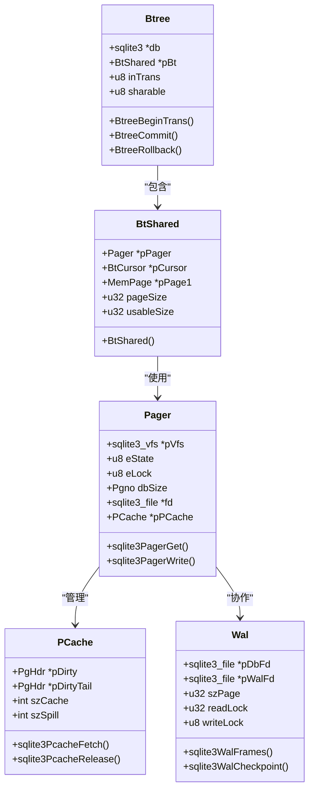

**图表来源**
- [btree.h](file://src/btree.h#L100-L200)
- [btreeInt.h](file://src/btreeInt.h#L400-L500)
- [pager.h](file://src/pager.h#L50-L150)
- [wal.h](file://src/wal.h#L50-L100)

**章节来源**
- [btree.c](file://src/btree.c#L1-L100)
- [pager.c](file://src/pager.c#L1-L100)
- [wal.c](file://src/wal.c#L1-L100)

## B-Tree结构详解

### 页面格式与布局

SQLite的B-Tree采用固定大小的页面来存储数据，页面大小可配置，范围从512字节到65536字节。每个页面包含三个主要区域：

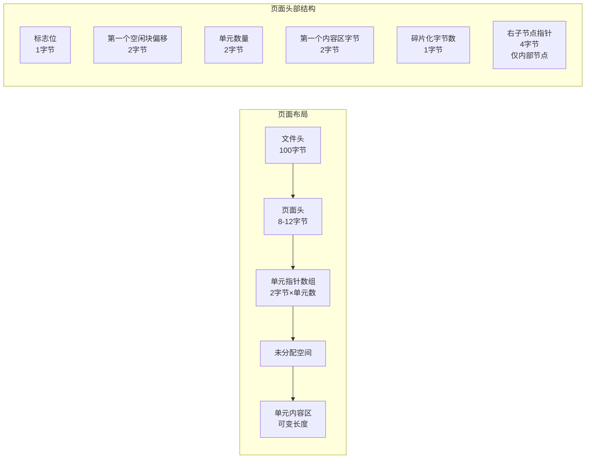

**图表来源**
- [btreeInt.h](file://src/btreeInt.h#L100-L150)

### 单元(Cell)结构

每个单元包含指向子页面的指针和键值对，具体结构如下：

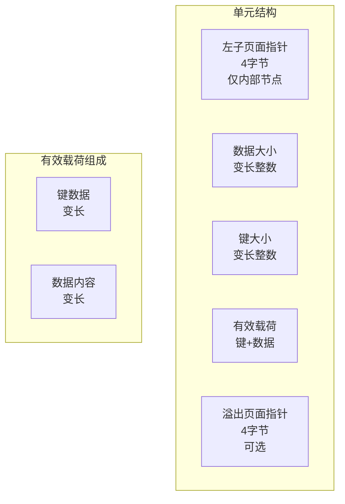

**图表来源**
- [btreeInt.h](file://src/btreeInt.h#L200-L250)

### 键值存储机制

SQLite支持两种主要的键值存储方式：

1. **INTKEY表**: 使用64位整数作为键，直接存储在单元头部
2. **BLOBKEY索引**: 使用任意二进制数据作为键，存储在有效载荷中

### 平衡算法

B-Tree采用动态平衡策略，确保树的高度保持在合理范围内：

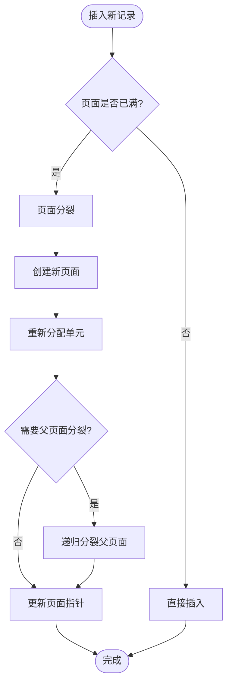

**图表来源**
- [btree.c](file://src/btree.c#L7000-L7500)

**章节来源**
- [btreeInt.h](file://src/btreeInt.h#L1-L200)
- [btree.c](file://src/btree.c#L1-L500)

## 页面缓存系统

### 缓存架构

页面缓存系统负责管理内存中的数据库页面，提供高效的读写操作：

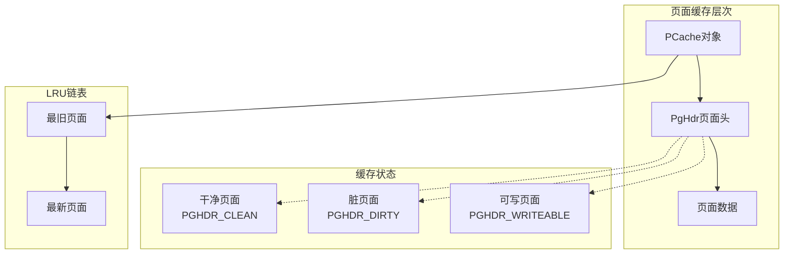

**图表来源**
- [pcache.h](file://src/pcache.h#L20-L60)
- [pcache.c](file://src/pcache.c#L1-L50)

### 内存管理策略

页面缓存采用LRU(最近最少使用)算法进行页面替换：

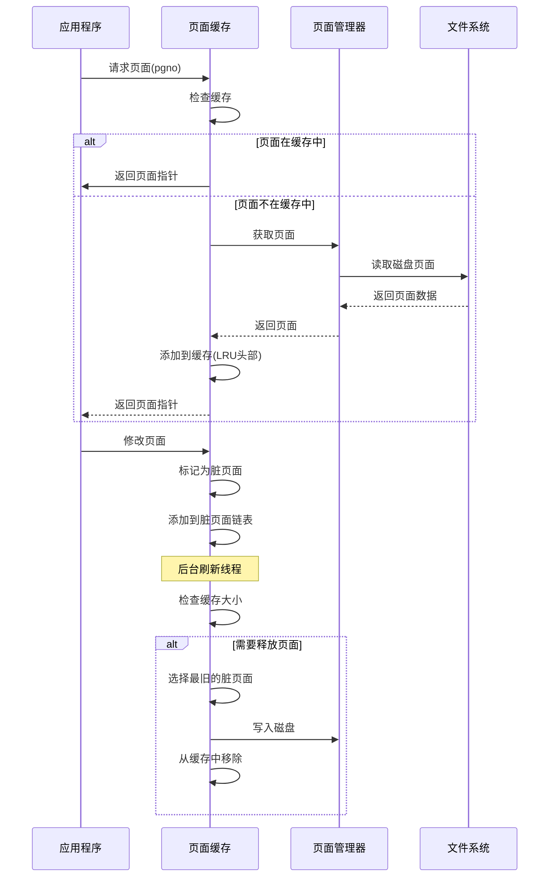

**图表来源**
- [pcache.c](file://src/pcache.c#L200-L300)

### 缓存配置参数

| 参数 | 描述 | 默认值 | 调优建议 |
|------|------|--------|----------|
| 缓存大小 | 最大缓存页面数 | 2000 | 根据可用内存调整，通常设置为系统内存的10-20% |
| 溢出大小 | 触发页面溢出的阈值 | 缓存大小的50% | 设置为缓存大小的30-40%以避免频繁溢出 |
| 页面大小 | 数据库页面大小 | 4096字节 | 根据工作负载选择：小页面适合随机访问，大页面适合顺序扫描 |
| 溢出策略 | 内存压力时的处理方式 | 自动溢出 | 可配置为保守模式避免数据丢失 |

**章节来源**
- [pcache.c](file://src/pcache.c#L1-L200)
- [pcache.h](file://src/pcache.h#L1-L100)

## 写前日志(WAL)机制

### WAL文件格式

WAL(Write-Ahead Logging)是一种高性能的日志记录机制，替代传统的回滚日志：

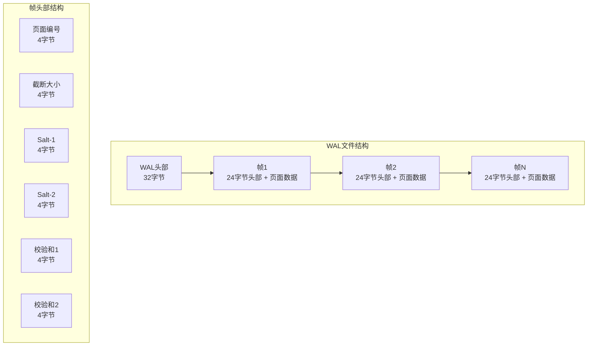

**图表来源**
- [wal.c](file://src/wal.c#L30-L80)

### WAL事务流程

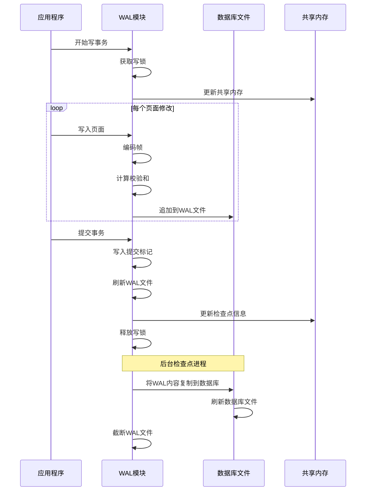

**图表来源**
- [wal.c](file://src/wal.c#L3900-L4000)

### 帧编码与校验

WAL使用强大的校验和机制确保数据完整性：

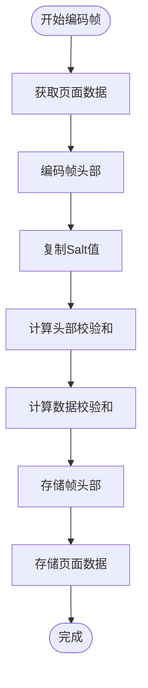

**图表来源**
- [wal.c](file://src/wal.c#L955-L1000)

### WAL模式优势

1. **并发性**: 多个读取者可以同时访问数据库，无需等待写入完成
2. **性能**: 写入操作只追加到WAL文件，避免随机I/O
3. **可靠性**: WAL文件提供更强的崩溃恢复保证
4. **原子性**: 事务提交时只需同步WAL文件，提高性能

**章节来源**
- [wal.c](file://src/wal.c#L1-L200)
- [wal.h](file://src/wal.h#L1-L100)

## 检查点与恢复机制

### 检查点类型

SQLite提供多种检查点模式以适应不同的性能需求：

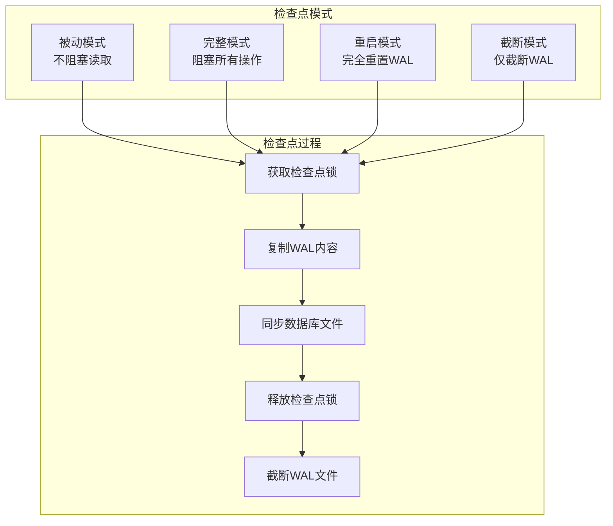

**图表来源**
- [wal.c](file://src/wal.c#L2300-L2400)

### 恢复算法

当数据库崩溃后重新启动时，SQLite执行以下恢复步骤：

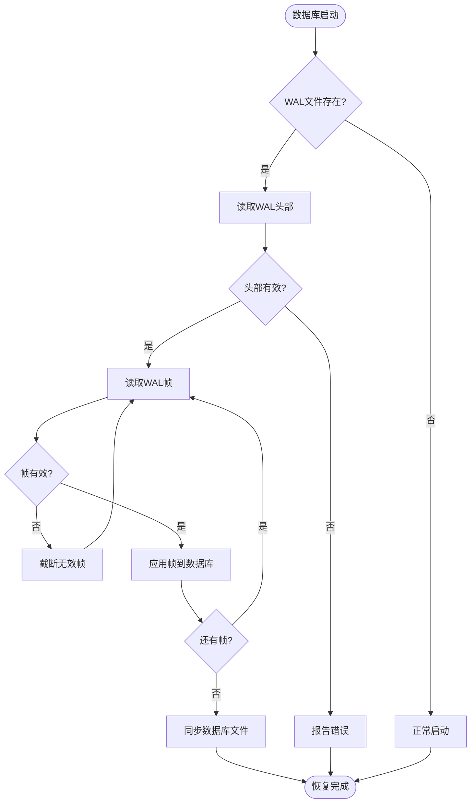

**图表来源**
- [wal.c](file://src/wal.c#L3250-L3320)

### 自动清理机制

SQLite实现了智能的自动清理机制来维护数据库文件的整洁：

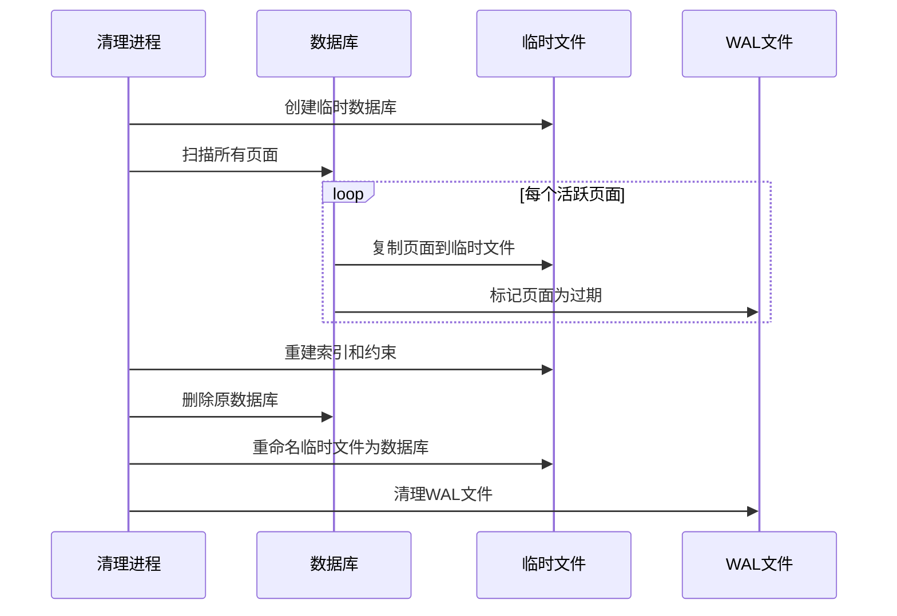

**图表来源**
- [vacuum.c](file://src/vacuum.c#L100-L200)

**章节来源**
- [wal.c](file://src/wal.c#L2000-L2500)
- [vacuum.c](file://src/vacuum.c#L1-L100)

## 性能调优指南

### 页面大小优化

页面大小的选择直接影响数据库性能：

| 页面大小 | 适用场景 | 性能特点 | 内存占用 |
|----------|----------|----------|----------|
| 512字节 | 小型设备，频繁随机访问 | 页面切换频繁，开销大 | 最小 |
| 1024字节 | 移动设备，中等负载 | 平衡性能和内存 | 较小 |
| 4096字节 | 桌面应用，标准工作负载 | 默认设置，通用平衡 | 中等 |
| 8192字节 | 服务器应用，顺序扫描 | 顺序I/O效率高 | 较大 |
| 65536字节 | 大数据量，批量处理 | 减少页面数量 | 最大 |

### 缓存大小配置

根据系统资源和工作负载特征调整缓存大小：

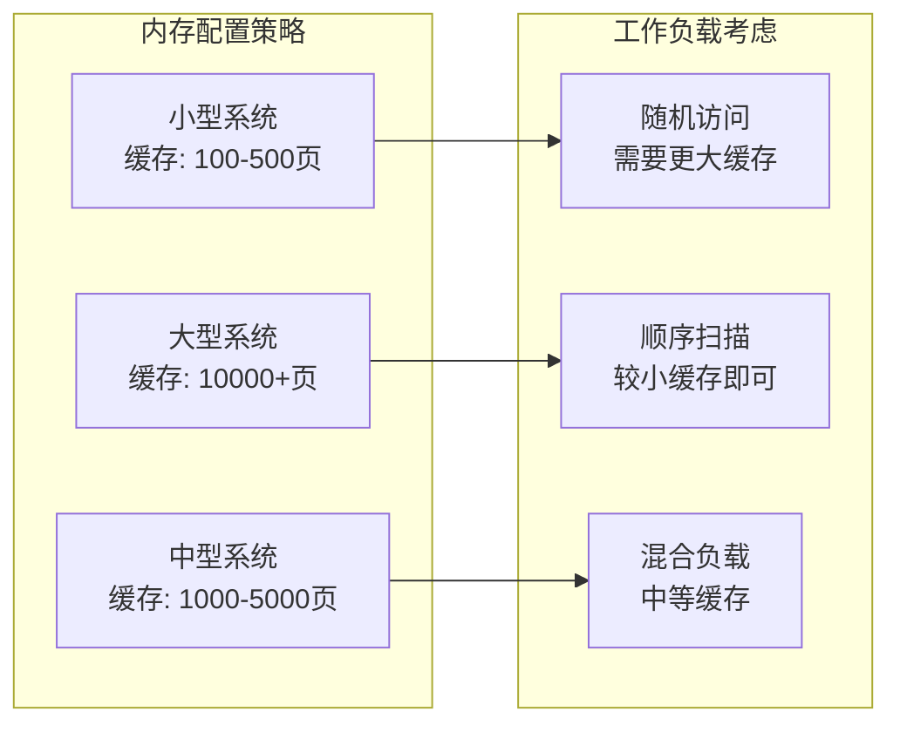

### WAL模式调优

针对不同应用场景优化WAL配置：

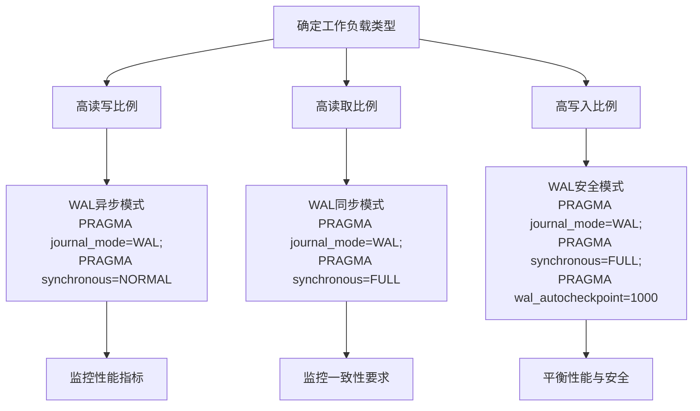

### 性能监控指标

关键性能指标及其优化目标：

| 指标 | 目标值 | 监控方法 | 优化策略 |
|------|--------|----------|----------|
| 缓存命中率 | >95% | sqlite3_db_status(CACHE_HIT) | 增加缓存大小 |
| WAL文件大小 | <10%数据库大小 | 监控WAL文件增长 | 调整检查点频率 |
| 页面溢出次数 | <1% | sqlite3_db_status(CACHE_SPILL) | 增加缓存大小 |
| 事务提交时间 | <1ms | 应用程序计时 | 优化WAL同步设置 |

**章节来源**
- [pcache.c](file://src/pcache.c#L350-L400)
- [wal.c](file://src/wal.c#L1500-L1600)

## 故障排除指南

### 常见问题诊断

#### 缓存相关问题

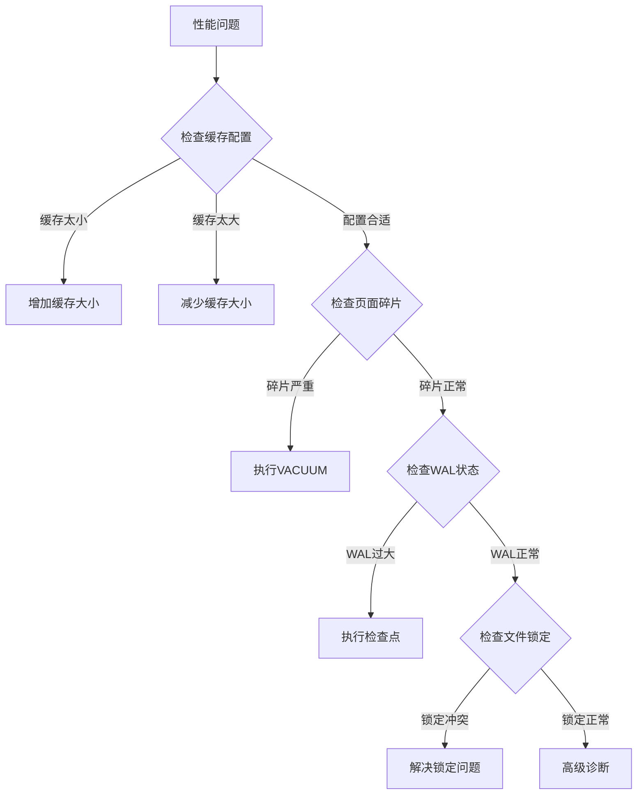

#### WAL相关问题

常见的WAL相关错误及解决方案：

| 错误类型 | 症状 | 原因 | 解决方案 |
|----------|------|------|----------|
| WAL损坏 | 数据库无法打开 | 突然断电或文件系统错误 | 删除WAL文件，使用备份恢复 |
| WAL过大 | 磁盘空间不足 | 检查点不及时 | 调整自动检查点参数 |
| 锁定超时 | 事务长时间挂起 | 多进程竞争 | 优化事务粒度，使用超时设置 |
| 性能下降 | 查询响应缓慢 | WAL文件碎片化 | 执行VACUUM或调整WAL配置 |

### 调试工具和技术

SQLite提供了丰富的调试和诊断工具：

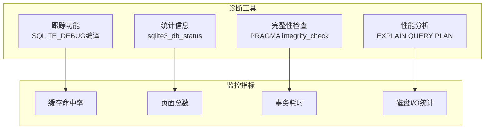

**章节来源**
- [btree.c](file://src/btree.c#L100-L200)
- [wal.c](file://src/wal.c#L3000-L3100)

## 总结

SQLite存储引擎通过精心设计的B-Tree结构、高效的页面缓存系统和可靠的WAL机制，为各种应用场景提供了高性能、高可靠性的数据存储解决方案。理解这些核心组件的工作原理和调优策略，对于开发高质量的SQLite应用程序至关重要。

关键要点：
1. **B-Tree优化**: 合理配置页面大小和缓存参数，平衡内存使用和I/O性能
2. **WAL机制**: 根据应用特点选择合适的WAL模式和同步策略
3. **监控调优**: 定期监控性能指标，及时发现和解决潜在问题
4. **故障预防**: 建立完善的备份和恢复机制，确保数据安全

通过遵循本文档提供的指导原则和最佳实践，开发者可以充分发挥SQLite存储引擎的潜力，构建高效稳定的应用系统。