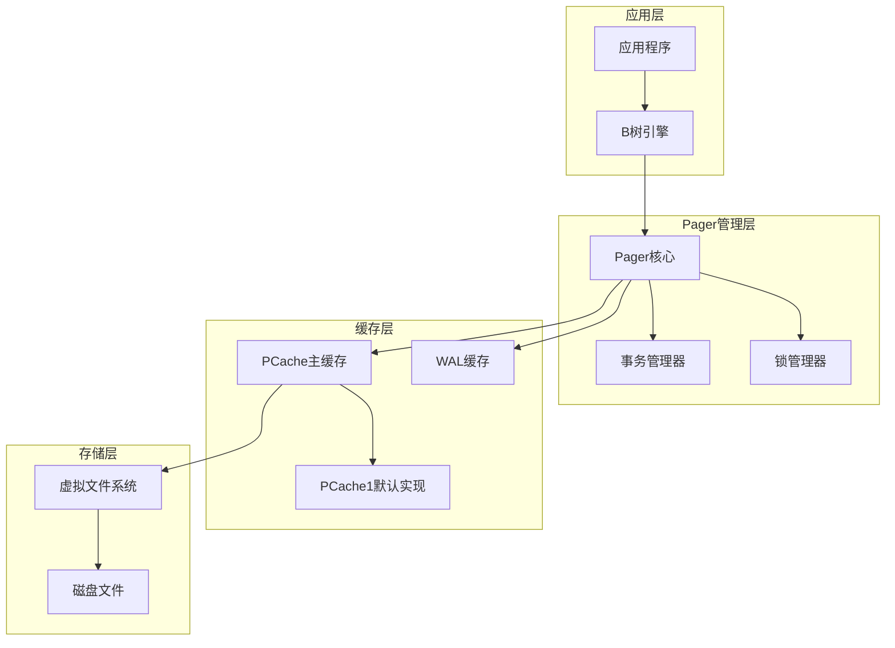
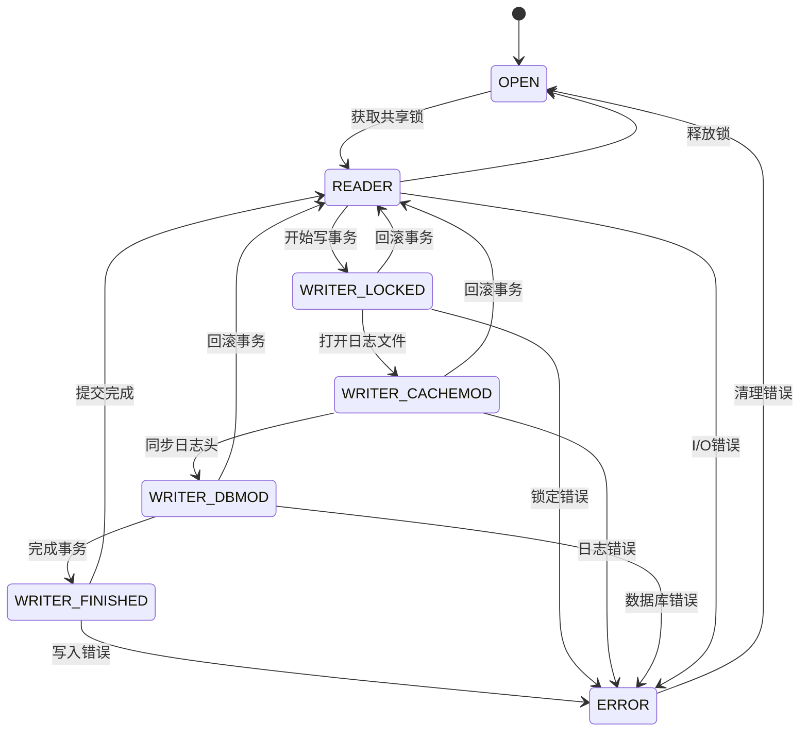
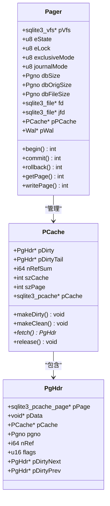
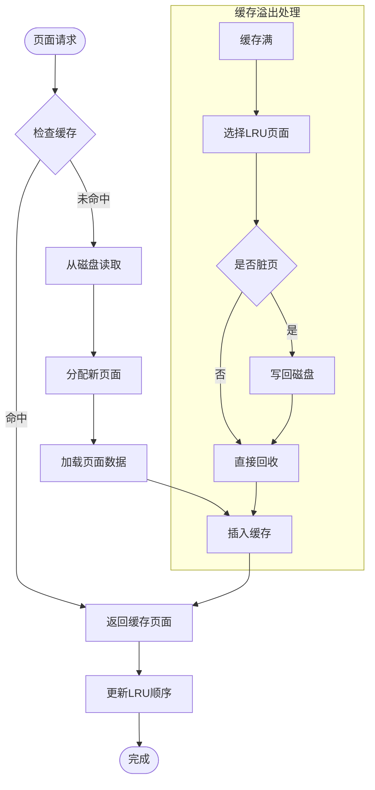
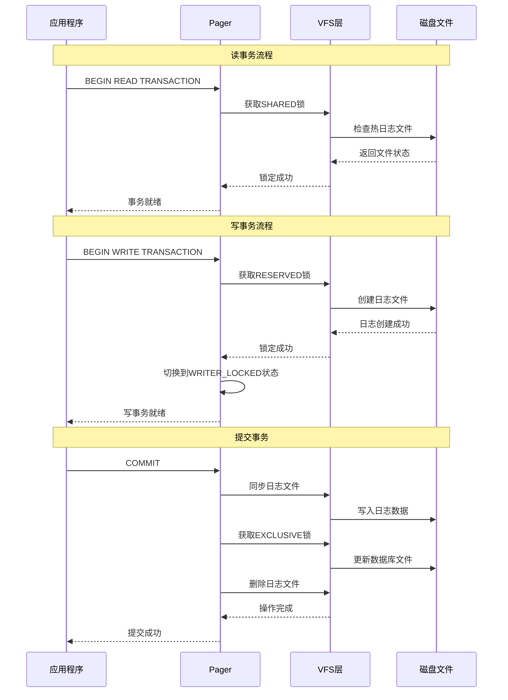
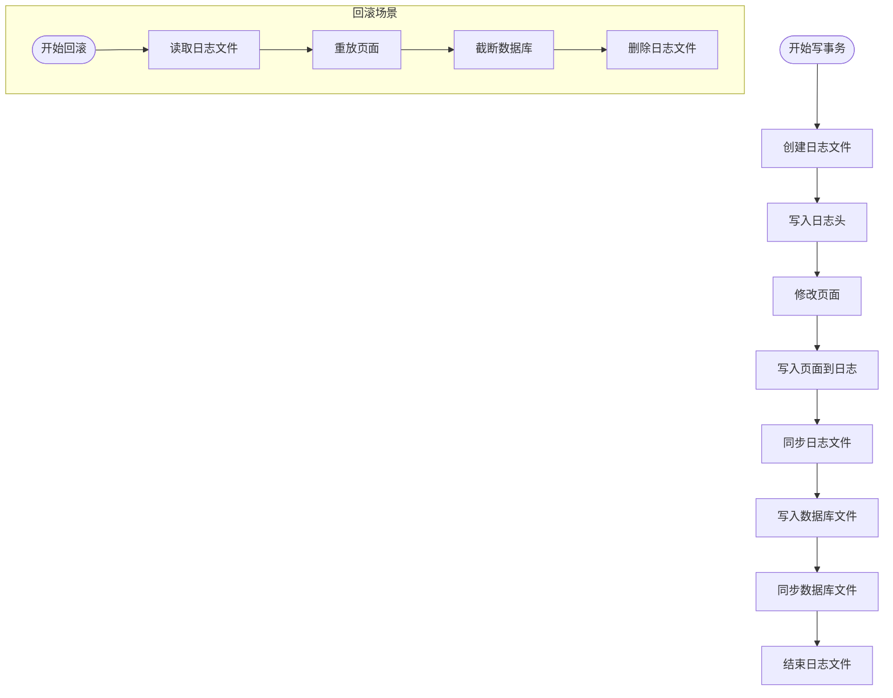
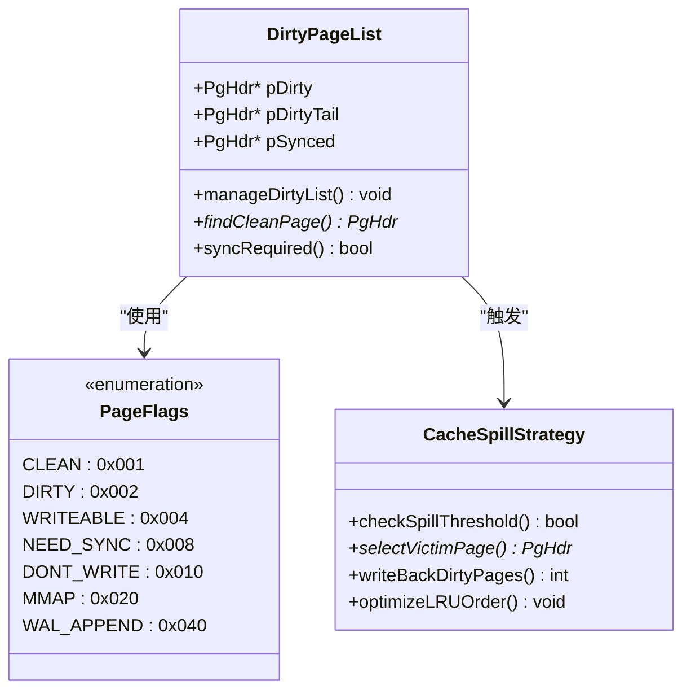
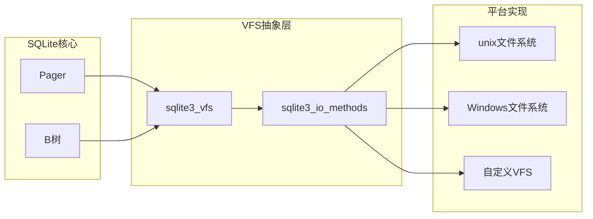
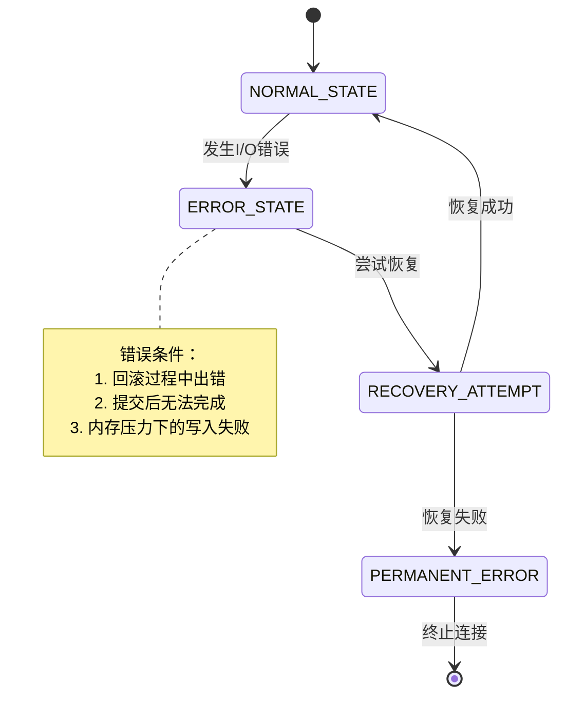
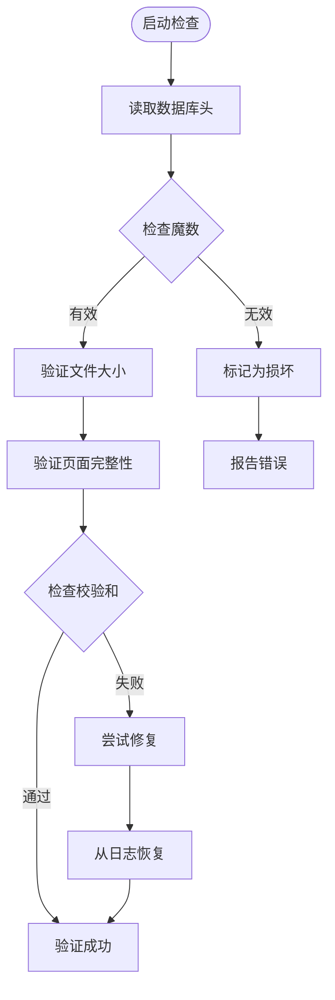

# 页缓存管理器

<cite>
**本文档引用的文件**
- [pager.c](file://src/pager.c)
- [pager.h](file://src/pager.h)
- [pcache.c](file://src/pcache.c)
- [pcache.h](file://src/pcache.h)
- [pcache1.c](file://src/pcache1.c)
- [wal.c](file://src/wal.c)
- [os_unix.c](file://src/os_unix.c)
</cite>

## 目录
1. [简介](#简介)
2. [系统架构概览](#系统架构概览)
3. [核心组件分析](#核心组件分析)
4. [事务生命周期管理](#事务生命周期管理)
5. [缓存策略与内存管理](#缓存策略与内存管理)
6. [I/O操作与VFS集成](#io操作与vfs集成)
7. [错误处理与恢复机制](#错误处理与恢复机制)
8. [性能优化与调优](#性能优化与调优)
9. [故障排除指南](#故障排除指南)
10. [总结](#总结)

## 简介

SQLite的页缓存管理器（Pager）是数据库引擎的核心组件之一，负责抽象底层文件I/O操作，管理数据库文件的页面读写、缓存策略以及内存页面的脏页标记与刷新机制。Pager子系统实现了完整的事务支持，包括原子提交、回滚功能，并提供了多种持久化模式（回滚日志、WAL等）。

Pager的主要职责包括：
- 抽象文件系统操作，提供统一的页面访问接口
- 实现页面级别的缓存管理，优化I/O性能
- 管理事务生命周期，确保数据一致性
- 处理并发访问控制和文件锁定
- 提供错误恢复和数据完整性保障

## 系统架构概览

SQLite的页缓存管理系统采用分层架构设计，主要包含以下层次：



**图表来源**
- [pager.c](file://src/pager.c#L1-L50)
- [pcache.c](file://src/pcache.c#L1-L50)

### 核心状态机

Pager使用状态机模型管理其生命周期，状态转换遵循严格的规则：



**图表来源**
- [pager.c](file://src/pager.c#L150-L250)

**章节来源**
- [pager.c](file://src/pager.c#L1-L300)
- [pager.h](file://src/pager.h#L1-L100)

## 核心组件分析

### Pager结构体详解

Pager结构体是整个子系统的核心数据结构，包含了所有必要的状态信息：



**图表来源**
- [pager.c](file://src/pager.c#L400-L600)
- [pcache.h](file://src/pcache.h#L20-L80)

### 页面缓存机制

页面缓存系统采用LRU（最近最少使用）算法管理内存中的页面：



**图表来源**
- [pcache.c](file://src/pcache.c#L400-L600)
- [pcache1.c](file://src/pcache1.c#L200-L400)

**章节来源**
- [pager.c](file://src/pager.c#L400-L800)
- [pcache.c](file://src/pcache.c#L1-L400)
- [pcache1.c](file://src/pcache1.c#L1-L400)

## 事务生命周期管理

### 读事务与写事务的隔离

SQLite通过不同的锁定级别实现读写事务的隔离：



**图表来源**
- [pager.c](file://src/pager.c#L5200-L5400)
- [pager.c](file://src/pager.c#L5900-L6100)

### 回滚日志机制

回滚日志是SQLite保证事务原子性的关键机制：



**图表来源**
- [pager.c](file://src/pager.c#L5950-L6050)
- [pager.c](file://src/pager.c#L3350-L3400)

**章节来源**
- [pager.c](file://src/pager.c#L5200-L5800)
- [pager.c](file://src/pager.c#L5900-L6200)

## 缓存策略与内存管理

### 脏页管理机制

SQLite使用复杂的脏页管理策略确保数据一致性：



**图表来源**
- [pcache.c](file://src/pcache.c#L150-L250)
- [pcache.h](file://src/pcache.h#L40-L60)

### 内存占用控制

Pager提供了多层次的内存控制机制：

| 控制参数 | 默认值 | 描述 | 影响范围 |
|---------|--------|------|----------|
| cache_size | 2000 | 缓存页面数量限制 | 整个数据库连接 |
| page_size | 1024-65536 | 页面大小（字节） | 单个数据库文件 |
| journal_size_limit | -1 | 日志文件大小限制 | 当前连接 |
| mmap_size | 0 | 内存映射最大值 | 当前连接 |
| cache_spill | OFF | 是否允许缓存溢出 | 全局设置 |

**章节来源**
- [pcache.c](file://src/pcache.c#L300-L500)
- [pcache1.c](file://src/pcache1.c#L300-L600)

## I/O操作与VFS集成

### VFS层抽象

SQLite通过虚拟文件系统（VFS）层实现跨平台的文件操作：



**图表来源**
- [os_unix.c](file://src/os_unix.c#L1-L100)

### 文件锁定策略

不同平台采用不同的文件锁定策略：

| 锁定类型 | Unix平台 | Windows平台 | 适用场景 |
|---------|----------|-------------|----------|
| POSIX锁 | 推荐 | 不支持 | 大多数Unix系统 |
| flock() | 支持 | 不支持 | BSD系统 |
| 命名信号量 | VxWorks专用 | 不支持 | 实时系统 |
| 代理锁 | macOS专用 | 不支持 | 高级macOS特性 |
| 无锁 | unix-none | 不支持 | 测试或特殊环境 |

**章节来源**
- [os_unix.c](file://src/os_unix.c#L50-L200)
- [pager.c](file://src/pager.c#L1-L100)

## 错误处理与恢复机制

### 错误状态管理

Pager使用专门的错误状态处理复杂的I/O错误和数据损坏情况：



**图表来源**
- [pager.c](file://src/pager.c#L290-L330)

### 数据损坏检测与恢复

SQLite提供了多层数据完整性保护机制：



**图表来源**
- [pager.c](file://src/pager.c#L5200-L5300)

**章节来源**
- [pager.c](file://src/pager.c#L290-L350)
- [pager.c](file://src/pager.c#L5200-L5400)

## 性能优化与调优

### 缓存性能优化

SQLite采用了多种缓存优化技术：

1. **预分配策略**：预先分配一定数量的页面以减少动态分配开销
2. **批量操作**：在可能的情况下批量处理页面操作
3. **内存映射**：对于大文件使用内存映射提高访问速度
4. **延迟写入**：将多个小写入合并为大块写入

### I/O优化策略

| 优化技术 | 实现方式 | 性能提升 | 适用场景 |
|---------|----------|----------|----------|
| 批量同步 | 合并多个fsync调用 | 20-30% | 写密集型工作负载 |
| 预读取 | 提前读取相邻页面 | 15-25% | 顺序扫描 |
| 写缓冲 | 延迟写入直到必要 | 10-20% | 随机写入 |
| 异步I/O | 使用异步文件操作 | 30-50% | 高并发场景 |

**章节来源**
- [pcache1.c](file://src/pcache1.c#L400-L700)
- [pager.c](file://src/pager.c#L1-L200)

## 故障排除指南

### 常见问题诊断

#### 1. 锁竞争问题

**症状**：长时间等待锁或死锁
**原因**：多个进程同时访问数据库
**解决方案**：
- 检查是否有长时间运行的查询
- 考虑使用WAL模式提高并发性
- 优化事务粒度

#### 2. 内存不足错误

**症状**：SQLITE_FULL或SQLITE_NOMEM错误
**原因**：缓存大小超出可用内存
**解决方案**：
```sql
-- 减少缓存大小
PRAGMA cache_size = 1000;

-- 启用缓存溢出
PRAGMA cache_spill = ON;

-- 设置内存限制
PRAGMA mmap_size = 67108864; -- 64MB
```

#### 3. 日志文件过大

**症状**：磁盘空间不足或性能下降
**原因**：事务频繁或日志清理不及时
**解决方案**：
```sql
-- 限制日志大小
PRAGMA journal_size_limit = 1048576; -- 1MB

-- 启用自动检查点
PRAGMA wal_autocheckpoint = 1000;

-- 手动执行检查点
PRAGMA wal_checkpoint(TRUNCATE);
```

### 性能监控指标

| 指标名称 | 查询语句 | 正常范围 | 异常阈值 |
|---------|----------|----------|----------|
| 缓存命中率 | PRAGMA cache_size; | >90% | <80% |
| 缓存溢出次数 | PRAGMA cache_spill; | 0 | >1000 |
| 日志文件大小 | PRAGMA journal_size_limit; | <1GB | >10GB |
| WAL文件大小 | PRAGMA wal_checkpoint; | <100MB | >1GB |

**章节来源**
- [pager.c](file://src/pager.c#L290-L350)
- [pcache.c](file://src/pcache.c#L700-L800)

## 总结

SQLite的页缓存管理器是一个高度优化的系统，通过精心设计的状态机、高效的缓存算法和完善的错误处理机制，为上层应用提供了可靠的数据存储服务。其主要特点包括：

1. **模块化设计**：清晰的分层架构便于维护和扩展
2. **高性能**：多种优化策略确保最佳性能表现
3. **可靠性**：完善的错误处理和数据恢复机制
4. **灵活性**：支持多种持久化模式和配置选项

理解Pager子系统的工作原理对于优化SQLite数据库性能、解决复杂问题以及进行定制开发都具有重要意义。通过合理配置缓存参数、选择合适的持久化模式以及监控关键性能指标，可以充分发挥SQLite的潜力。