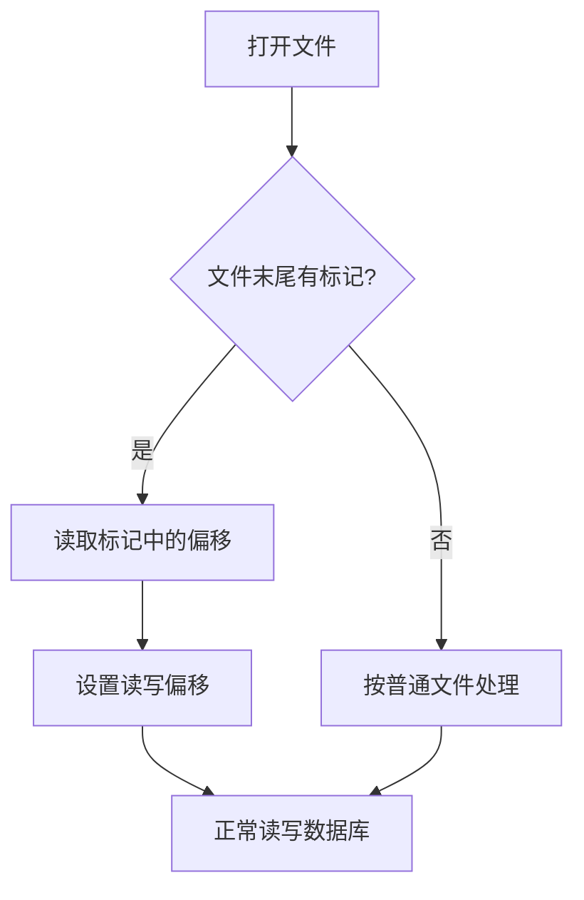
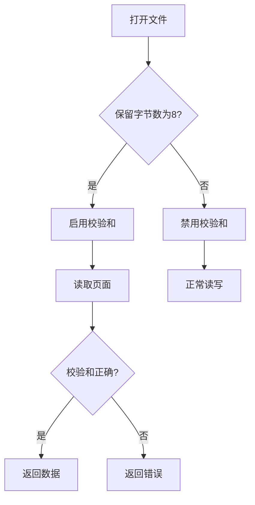
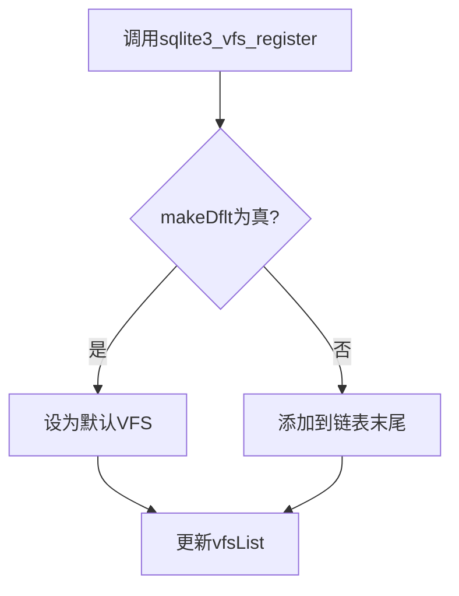

# VFS实现与扩展

<cite>
**本文档引用的文件**   
- [appendvfs.c](file://ext/misc/appendvfs.c)
- [cksumvfs.c](file://ext/misc/cksumvfs.c)
- [os.h](file://src/os.h)
- [os_unix.c](file://src/os_unix.c)
- [os_win.c](file://src/os_win.c)
- [main.c](file://src/main.c)
</cite>

## 目录
1. [引言](#引言)
2. [VFS架构设计](#vfs架构设计)
3. [sqlite3_vfs结构体成员函数详解](#sqlite3_vfs结构体成员函数详解)
4. [VFS扩展实例分析](#vfs扩展实例分析)
5. [VFS注册机制与优先级管理](#vfs注册机制与优先级管理)
6. [跨平台兼容性考虑](#跨平台兼容性考虑)
7. [开发新型VFS的完整步骤](#开发新型vfs的完整步骤)
8. [调试技巧](#调试技巧)
9. [结论](#结论)

## 引言
虚拟文件系统（VFS）是SQLite数据库引擎与底层操作系统文件系统之间的抽象层。它提供了一组标准化的接口，使得SQLite可以在不同的操作系统和文件系统上运行，而无需修改核心代码。通过VFS，开发者可以实现自定义的文件操作行为，如追加-only存储、校验和验证等功能。本文将全面介绍VFS的架构设计、扩展方法以及相关实例，帮助开发者理解和创建自定义VFS。

## VFS架构设计
VFS架构设计的核心是`sqlite3_vfs`结构体，它定义了所有文件操作的接口。每个VFS实现都必须提供一个`sqlite3_vfs`结构体的实例，该实例包含了各种文件操作函数的指针。这些函数包括打开、删除、访问、读取、写入等基本操作。VFS的设计允许开发者通过继承和重写这些函数来实现特定的功能。

VFS的另一个重要特性是其可扩展性。SQLite支持多个VFS实例，并且可以通过注册机制将新的VFS添加到系统中。这使得开发者可以轻松地为不同的应用场景创建和使用不同的VFS实现。此外，VFS还支持优先级管理，确保在多个VFS实例存在时，正确的VFS被选中用于文件操作。

**Section sources**
- [os.h](file://src/os.h#L199-L224)
- [main.c](file://src/main.c#L382-L446)

## sqlite3_vfs结构体成员函数详解
`sqlite3_vfs`结构体包含了一系列成员函数，每个函数对应一个特定的文件操作。以下是这些成员函数的详细说明：

- **xOpen**: 打开一个文件。此函数负责初始化文件句柄并设置必要的参数。
- **xDelete**: 删除一个文件。此函数用于移除指定路径的文件。
- **xAccess**: 检查文件是否存在或是否具有特定的访问权限。
- **xFullPathname**: 获取文件的完整路径名。
- **xDlOpen**: 打开一个动态链接库。
- **xDlError**: 获取最近一次动态链接库操作的错误信息。
- **xDlSym**: 获取动态链接库中的符号地址。
- **xDlClose**: 关闭一个动态链接库。
- **xRandomness**: 生成随机数据。
- **xSleep**: 使当前线程休眠指定的时间。
- **xCurrentTime**: 获取当前时间。
- **xGetLastError**: 获取最近一次文件操作的错误代码。
- **xCurrentTimeInt64**: 获取当前时间的64位整数表示。
- **xSetSystemCall**: 设置系统调用的替代函数。
- **xGetSystemCall**: 获取系统调用的替代函数。
- **xNextSystemCall**: 获取下一个系统调用的名称。

这些函数共同构成了VFS的基础，确保了SQLite能够在不同平台上一致地进行文件操作。

**Section sources**
- [os.h](file://src/os.h#L199-L224)
- [os_unix.c](file://src/os_unix.c#L8183-L8211)
- [os_win.c](file://src/os_win.c#L6619-L6653)

## VFS扩展实例分析
### appendvfs.c实例
`appendvfs.c`是一个VFS扩展实例，它允许将SQLite数据库追加到其他文件的末尾。这个扩展通过在文件末尾添加一个特殊的标记来标识数据库的起始位置。当打开文件时，VFS会检查这个标记，并根据标记的位置调整文件的读写偏移。

**Diagram sources**
- [appendvfs.c](file://ext/misc/appendvfs.c#L0-L672)

### cksumvfs.c实例
`cksumvfs.c`是另一个VFS扩展实例，它在每个数据库页面上写入校验和，并在读取时验证校验和。如果校验和不匹配，VFS会返回一个错误。这个扩展通过在页面的保留字节中存储校验和来实现这一功能。

**Diagram sources**
- [cksumvfs.c](file://ext/misc/cksumvfs.c#L0-L799)

## VFS注册机制与优先级管理
VFS的注册机制通过`sqlite3_vfs_register`函数实现。该函数接受一个`sqlite3_vfs`结构体指针和一个布尔值，用于指定是否将新注册的VFS设为默认VFS。当多个VFS实例存在时，SQLite会按照注册顺序查找合适的VFS。

优先级管理通过`makeDflt`参数实现。如果`makeDflt`为真，新注册的VFS将成为默认VFS；否则，它将被添加到VFS链表的末尾。这种机制确保了开发者可以灵活地控制VFS的优先级。

**Diagram sources**
- [main.c](file://src/main.c#L382-L446)

## 跨平台兼容性考虑
VFS的设计考虑了跨平台兼容性。SQLite提供了针对不同操作系统的VFS实现，如`os_unix.c`和`os_win.c`。这些实现分别针对Unix-like系统和Windows系统进行了优化。开发者在创建自定义VFS时，应确保其代码能够在目标平台上正确运行。

为了提高兼容性，建议使用标准的C库函数和POSIX API。此外，避免使用特定于某个操作系统的特性，除非确实需要。通过这种方式，可以确保VFS在不同平台上的一致性和可靠性。

**Section sources**
- [os_unix.c](file://src/os_unix.c#L0-L32)
- [os_win.c](file://src/os_win.c#L0-L32)

## 开发新型VFS的完整步骤
1. **定义VFS结构体**: 创建一个新的`sqlite3_vfs`结构体实例，填充所有必要的成员函数。
2. **实现成员函数**: 根据需求实现各个成员函数，确保它们符合VFS接口规范。
3. **注册VFS**: 使用`sqlite3_vfs_register`函数将新的VFS注册到系统中。
4. **测试VFS**: 在不同的平台上测试VFS，确保其功能正确且性能良好。
5. **文档化**: 编写详细的文档，说明VFS的功能、用法和限制。

通过遵循这些步骤，开发者可以成功创建和部署自定义VFS，满足特定的应用需求。

**Section sources**
- [appendvfs.c](file://ext/misc/appendvfs.c#L0-L672)
- [cksumvfs.c](file://ext/misc/cksumvfs.c#L0-L799)

## 调试技巧
在开发和调试VFS时，以下技巧可以帮助快速定位和解决问题：
- **日志记录**: 在关键函数中添加日志记录，跟踪文件操作的流程。
- **单元测试**: 编写单元测试，验证每个成员函数的正确性。
- **内存检查**: 使用工具如Valgrind检查内存泄漏和越界访问。
- **性能分析**: 使用性能分析工具，评估VFS的性能表现。
- **跨平台测试**: 在多个平台上进行测试，确保兼容性。

通过这些技巧，可以有效地提高VFS的稳定性和可靠性。

**Section sources**
- [test_osinst.c](file://src/test_osinst.c#L71-L116)

## 结论
VFS是SQLite数据库引擎的重要组成部分，它提供了强大的文件操作抽象和扩展能力。通过理解VFS的架构设计、成员函数和注册机制，开发者可以创建自定义的VFS实现，满足特定的应用需求。同时，注意跨平台兼容性和调试技巧，可以确保VFS的高质量和稳定性。