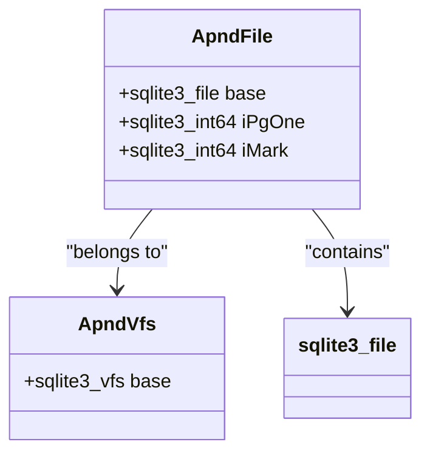
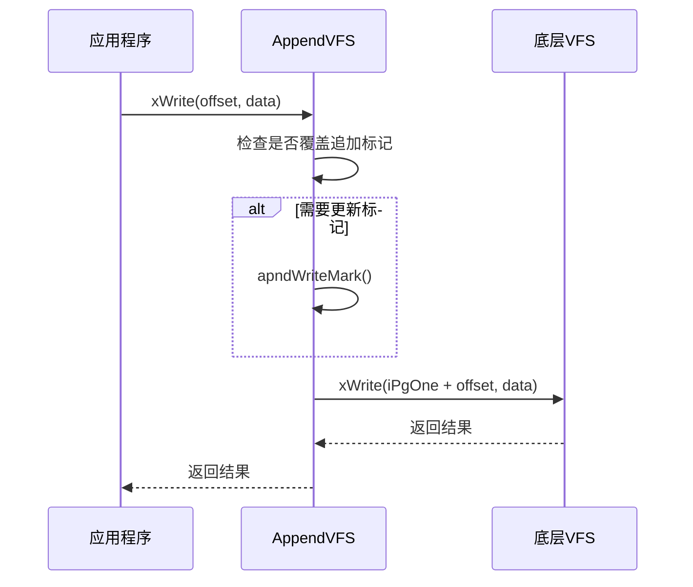
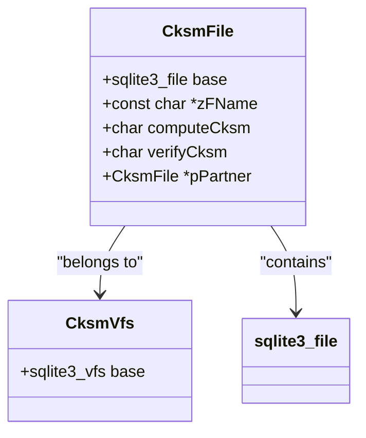
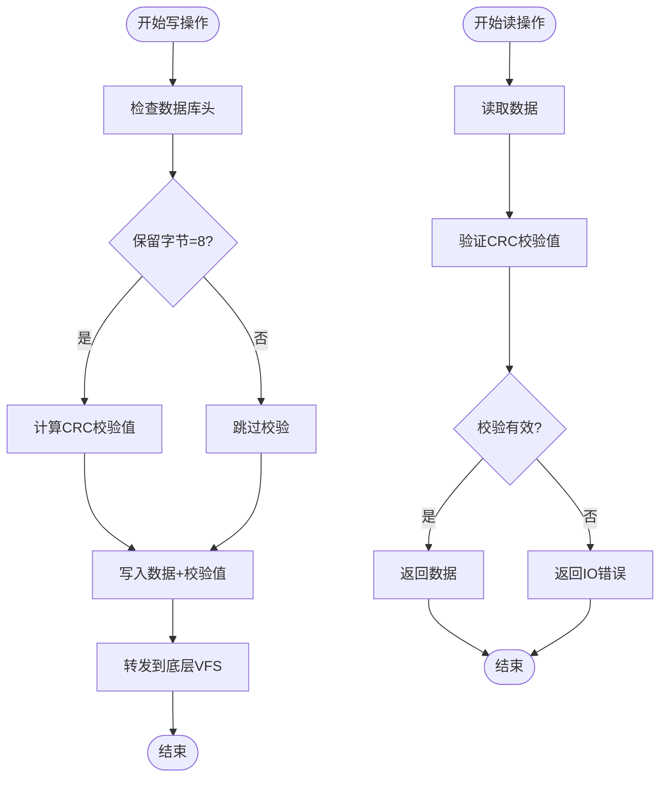

# VFS实现示例分析

<cite>
**本文档中引用的文件**  
- [appendvfs.c](file://ext/misc/appendvfs.c)
- [cksumvfs.c](file://ext/misc/cksumvfs.c)
</cite>

## 目录
1. [引言](#引言)
2. [VFS扩展机制概述](#vfs扩展机制概述)
3. [appendvfs实现分析](#appendvfs实现分析)
4. [cksumvfs实现分析](#cksumvfs实现分析)
5. [设计模式比较与总结](#设计模式比较与总结)
6. [生产环境适用性与风险](#生产环境适用性与风险)
7. [结论](#结论)

## 引言

SQLite的虚拟文件系统（VFS）扩展机制为数据库提供了强大的可扩展性。本文通过对`appendvfs.c`和`cksumvfs.c`两个实际扩展模块的代码级分析，深入探讨VFS扩展的具体实现模式。我们将解析`appendvfs`如何通过重写`xWrite`方法强制数据追加写入，以及`cksumvfs`如何在`xRead`/`xWrite`过程中集成CRC校验。通过比较不同VFS扩展的设计思路和技术选型，总结可复用的开发模式，并讨论这些扩展在生产环境中的适用场景和潜在风险。

## VFS扩展机制概述

SQLite的VFS（Virtual File System）层为数据库提供了与底层文件系统交互的抽象接口。VFS扩展通常以"shim"（垫片）的形式实现，位于默认VFS之上，通过拦截和修改文件操作来实现特定功能。这种设计模式允许开发者在不修改核心数据库引擎的情况下，添加新的文件系统功能。

VFS扩展的核心是`sqlite3_vfs`结构体，它包含了一系列文件操作函数指针，如`xOpen`、`xRead`、`xWrite`等。扩展模块通过注册自定义的VFS实例，将这些函数指针指向自己的实现，从而拦截和处理文件操作。当上层调用文件操作时，请求会首先到达扩展的VFS层，经过处理后再传递给底层的原始VFS。

**Section sources**
- [appendvfs.c](file://ext/misc/appendvfs.c#L84)
- [cksumvfs.c](file://ext/misc/cksumvfs.c#L175)

## appendvfs实现分析

### 核心设计与数据结构

`appendvfs`模块实现了将SQLite数据库追加到其他文件末尾的功能。其核心设计基于一个特殊的标记字符串"Start-Of-SQLite3-NNNNNNNN"，其中NNNNNNNN表示数据库内容的起始偏移量。该模块通过重写VFS的`xWrite`方法，确保所有写操作都发生在数据库区域，并在必要时更新追加标记。

**Diagram sources**
- [appendvfs.c](file://ext/misc/appendvfs.c#L100)
- [appendvfs.c](file://ext/misc/appendvfs.c#L84)

### 写操作重写机制

`appendvfs`通过`apndWrite`函数重写了`xWrite`方法。该函数首先检查写操作是否会覆盖或破坏追加标记，如果会，则先调用`apndWriteMark`更新标记位置。然后，将写偏移量加上`iPgOne`（数据库起始偏移），将操作转发给底层VFS。这种设计确保了所有写操作都正确地映射到数据库区域。

**Diagram sources**
- [appendvfs.c](file://ext/misc/appendvfs.c#L350)
- [appendvfs.c](file://ext/misc/appendvfs.c#L300)

### 文件识别与打开逻辑

`appendvfs`在打开文件时通过一系列规则判断文件类型：
1. 空文件被视为普通数据库
2. 以"Start-Of-SQLite3-"结尾的文件被视为追加数据库
3. 以"SQLite format 3"开头的文件被视为普通数据库
4. 其他情况且带有`SQLITE_OPEN_CREATE`标志时，创建新的追加数据库

这种智能识别机制使得`appendvfs`能够无缝处理不同类型的文件，为用户提供一致的接口。

**Section sources**
- [appendvfs.c](file://ext/misc/appendvfs.c#L450)
- [appendvfs.c](file://ext/misc/appendvfs.c#L550)

## cksumvfs实现分析

### 核心设计与数据结构

`cksumvfs`模块实现了数据库页的CRC校验功能。其核心设计利用了SQLite数据库页的保留字节（reserve-bytes）特性，将8字节的CRC校验值存储在每页的末尾。该模块通过在`xRead`和`xWrite`操作中集成校验逻辑，确保数据的完整性。

**Diagram sources**
- [cksumvfs.c](file://ext/misc/cksumvfs.c#L190)
- [cksumvfs.c](file://ext/misc/cksumvfs.c#L175)

### 读写过程中的校验集成

`cksumvfs`通过`cksmRead`和`cksmWrite`函数在读写过程中集成校验。写操作时，计算数据的CRC值并写入保留字节；读操作时，验证CRC值的正确性。校验功能仅在数据库的保留字节数恰好为8时激活，这确保了与现有数据库格式的兼容性。

**Diagram sources**
- [cksumvfs.c](file://ext/misc/cksumvfs.c#L600)
- [cksumvfs.c](file://ext/misc/cksumvfs.c#L500)

### 动态配置与控制

`cksumvfs`提供了灵活的配置选项，包括通过`PRAGMA checksum_verification`命令动态启用或禁用校验验证。这种设计允许在需要时进行数据库的故障分析，而不会因校验错误而中断操作。此外，模块还实现了`verify_checksum()` SQL函数，用于手动验证数据库页的完整性。

**Section sources**
- [cksumvfs.c](file://ext/misc/cksumvfs.c#L700)
- [cksumvfs.c](file://ext/misc/cksumvfs.c#L250)

## 设计模式比较与总结

### 设计思路对比

| 特性 | appendvfs | cksumvfs |
|------|---------|---------|
| **主要目标** | 实现数据库追加功能 | 确保数据完整性 |
| **核心机制** | 偏移量映射与标记管理 | CRC校验与验证 |
| **配置方式** | 自动识别文件类型 | 通过保留字节数激活 |
| **性能影响** | 轻微（额外的标记检查） | 中等（每页的CRC计算） |
| **兼容性** | 与普通数据库兼容 | 依赖特定的保留字节设置 |

### 可复用的开发模式

1. **分层拦截模式**：两个模块都采用了VFS shim的分层拦截模式，通过继承和扩展原始VFS功能来实现新特性。这种模式确保了与现有系统的兼容性，同时提供了清晰的职责分离。

2. **条件激活机制**：`cksumvfs`通过检查数据库头的保留字节数来决定是否激活校验功能。这种基于文件特征的条件激活机制避免了对不兼容文件的误操作，提高了模块的健壮性。

3. **透明代理模式**：对于不适用的文件类型或操作，两个模块都采用透明代理模式，将请求直接转发给底层VFS。这种设计保证了模块的通用性，不会影响正常数据库操作。

4. **元数据管理**：`appendvfs`通过在文件末尾添加特殊标记来管理元数据，而`cksumvfs`利用现有的保留字节空间。这两种不同的元数据管理策略展示了在有限空间内存储额外信息的创新方法。

**Section sources**
- [appendvfs.c](file://ext/misc/appendvfs.c#L450)
- [cksumvfs.c](file://ext/misc/cksumvfs.c#L550)

## 生产环境适用性与风险

### 适用场景

1. **appendvfs**：适用于需要将数据库嵌入到可执行文件或其他二进制文件中的场景，如分发包含预加载数据的应用程序。这种模式可以简化部署流程，提高数据的安全性。

2. **cksumvfs**：适用于对数据完整性要求极高的场景，如金融交易系统、医疗记录系统等。通过实时校验，可以及时发现和报告数据损坏，防止错误数据的传播。

### 潜在风险

1. **appendvfs风险**：
   - 文件大小限制：模块限制文件大小为1GiB，可能不适用于大型数据库
   - 性能影响：频繁的标记更新可能影响写性能
   - 兼容性问题：某些文件系统或存储设备可能不支持大文件的追加操作

2. **cksumvfs风险**：
   - 性能开销：每页的CRC计算会增加CPU负载，影响读写性能
   - 配置复杂性：需要手动设置保留字节数，增加了使用难度
   - 兼容性限制：与其他使用保留字节的扩展不兼容

### 最佳实践建议

1. 在使用`appendvfs`时，应预先规划好文件结构，避免频繁的结构调整
2. 对于`cksumvfs`，建议在非高峰时段进行完整的数据库校验，以减少对生产系统的影响
3. 两个模块都应配合定期的备份策略使用，不能替代传统的数据保护措施
4. 在部署前应进行充分的性能测试，评估对应用响应时间的影响

**Section sources**
- [appendvfs.c](file://ext/misc/appendvfs.c#L50)
- [cksumvfs.c](file://ext/misc/cksumvfs.c#L100)

## 结论

通过对`appendvfs.c`和`cksumvfs.c`的深入分析，我们看到了SQLite VFS扩展机制的强大灵活性和可扩展性。`appendvfs`通过巧妙的偏移量管理和标记机制，实现了数据库的追加功能，而`cksumvfs`则利用保留字节空间，为数据库提供了数据完整性保护。

这两种扩展展示了不同的设计思路：`appendvfs`侧重于文件结构的创新，而`cksumvfs`则关注数据安全。它们共同体现了VFS扩展的核心价值——在不修改数据库引擎的情况下，为特定应用场景提供定制化的功能。

在生产环境中使用这些扩展时，需要权衡其带来的功能优势与潜在的性能开销和配置复杂性。通过遵循最佳实践，合理选择适用场景，这些VFS扩展可以为应用程序提供重要的增值功能。