# VFS扩展开发指南

<cite>
**本文档引用的文件**  
- [appendvfs.c](file://ext/misc/appendvfs.c)
- [cksumvfs.c](file://ext/misc/cksumvfs.c)
- [os.h](file://src/os.h)
- [os.c](file://src/os.c)
- [sqlite3ext.h](file://src/sqlite3ext.h)
</cite>

## 目录
1. [引言](#引言)
2. [VFS扩展基础](#vfs扩展基础)
3. [追加模式VFS实现](#追加模式vfs实现)
4. [校验和VFS实现](#校验和vfs实现)
5. [VFS注册与加载](#vfs注册与加载)
6. [开发最佳实践](#开发最佳实践)
7. [调试与测试](#调试与测试)
8. [结论](#结论)

## 引言

SQLite的虚拟文件系统（VFS）扩展机制允许开发者拦截和增强底层I/O操作，以实现特定存储需求。本指南系统性地指导开发者如何创建自定义VFS扩展，通过分析`appendvfs.c`中追加模式的实现逻辑和`cksumvfs.c`中校验和计算机制，展示完整的开发流程。

**重要说明**：所有VFS扩展开发必须遵循SQLite的接口规范，确保与现有系统兼容。VFS扩展可以实现追加-only文件系统、数据校验、加密存储等高级功能。

## VFS扩展基础

### VFS结构体定义

SQLite的VFS扩展基于`sqlite3_vfs`结构体，该结构体定义了文件系统的所有操作接口。开发者需要实现这个结构体中的各个方法来创建自定义VFS。

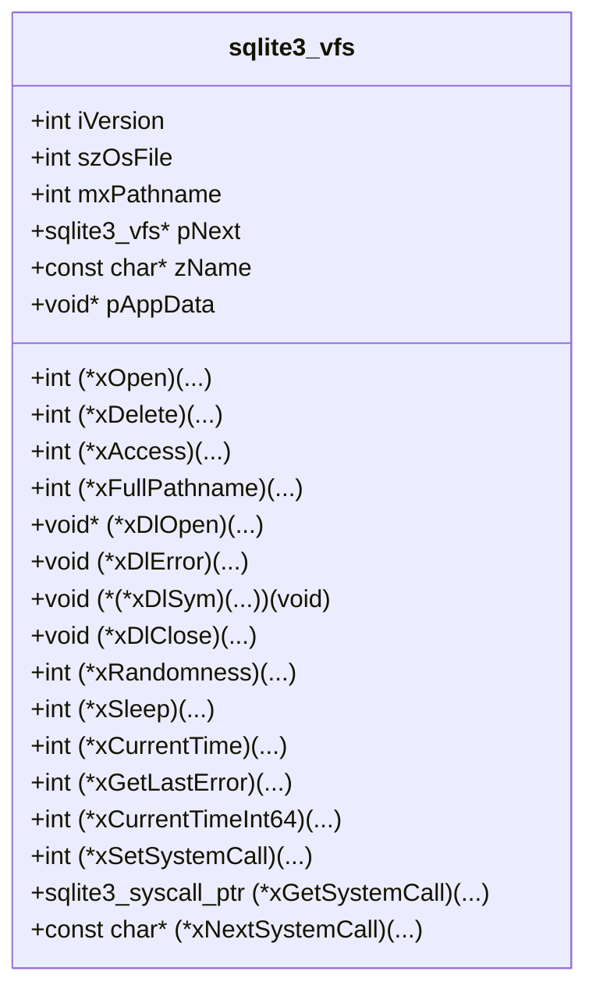

**Diagram sources**
- [os.h](file://src/os.h#L199-L224)
- [sqlite3ext.h](file://src/sqlite3ext.h#L1017-L1045)

### VFS方法实现

VFS扩展的核心是实现`sqlite3_vfs`结构体中定义的各种方法。这些方法可以分为文件操作、动态加载、随机数生成等类别。

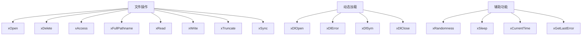

**Diagram sources**
- [os.h](file://src/os.h#L199-L224)

**Section sources**
- [os.h](file://src/os.h#L199-L224)
- [os.c](file://src/os.c#L382-L446)

## 追加模式VFS实现

### 追加VFS架构

追加模式VFS允许将SQLite数据库追加到其他文件（如可执行文件）的末尾。这种设计使得数据库可以作为文件的一部分存在，同时保持其完整性。

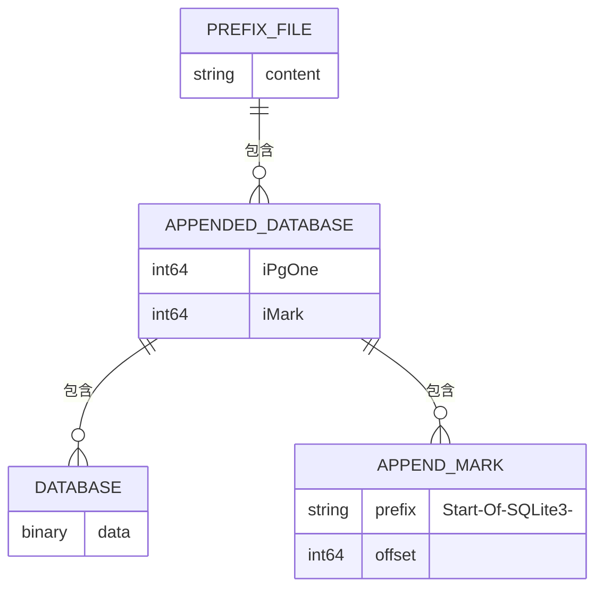

**Diagram sources**
- [appendvfs.c](file://ext/misc/appendvfs.c#L100-L150)

### 追加VFS数据结构

追加VFS使用特定的数据结构来管理文件布局和元数据。

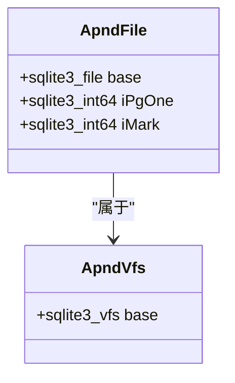

**Diagram sources**
- [appendvfs.c](file://ext/misc/appendvfs.c#L150-L180)

### 追加VFS工作流程

追加VFS的读写操作需要特殊处理，以确保正确地定位和访问数据库内容。

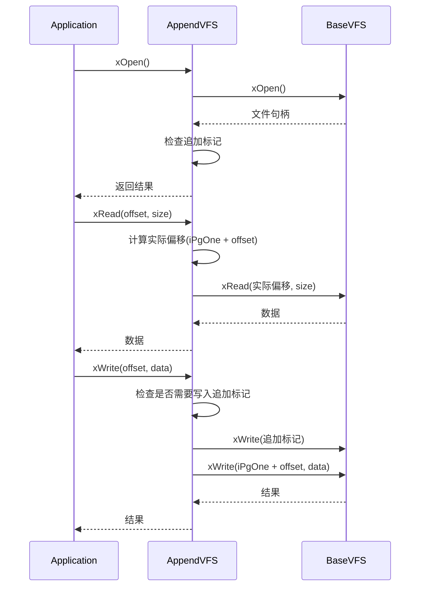

**Diagram sources**
- [appendvfs.c](file://ext/misc/appendvfs.c#L400-L600)

**Section sources**
- [appendvfs.c](file://ext/misc/appendvfs.c#L1-L672)

## 校验和VFS实现

### 校验和VFS架构

校验和VFS在每个数据库页面的末尾存储校验和，用于验证数据完整性。当读取页面时，会验证校验和，如果校验失败则返回错误。

```mermaid
erDiagram
DATABASE_PAGE ||--o{ CHECKSUM : "包含"
DATABASE_PAGE {
binary data
int size
}
CHECKSUM {
binary value
int size 8
}
```

**Diagram sources**
- [cksumvfs.c](file://ext/misc/cksumvfs.c#L200-L250)

### 校验和VFS数据结构

校验和VFS使用特定的数据结构来管理校验和计算和验证状态。

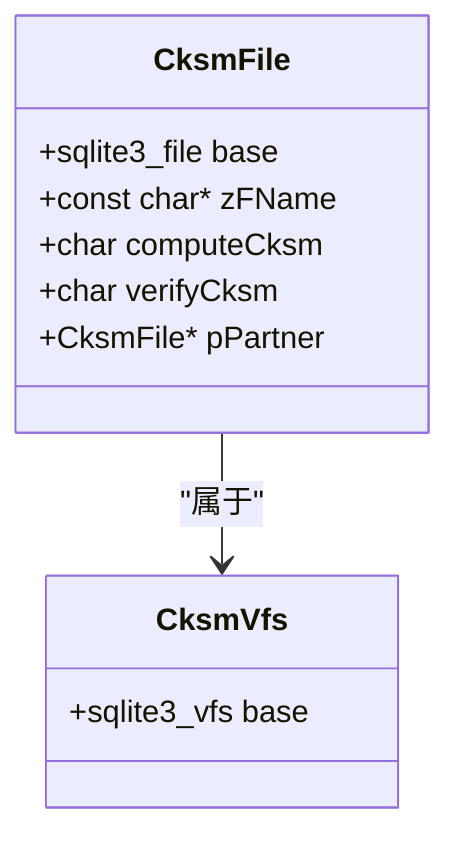

**Diagram sources**
- [cksumvfs.c](file://ext/misc/cksumvfs.c#L150-L180)

### 校验和计算算法

校验和VFS使用特定的算法来计算和验证数据完整性。

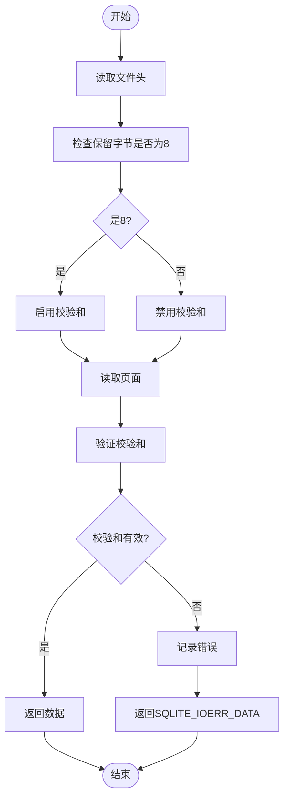

**Diagram sources**
- [cksumvfs.c](file://ext/misc/cksumvfs.c#L300-L400)

**Section sources**
- [cksumvfs.c](file://ext/misc/cksumvfs.c#L1-L848)

## VFS注册与加载

### VFS注册机制

SQLite提供了注册和管理VFS的API，允许开发者将自定义VFS集成到系统中。

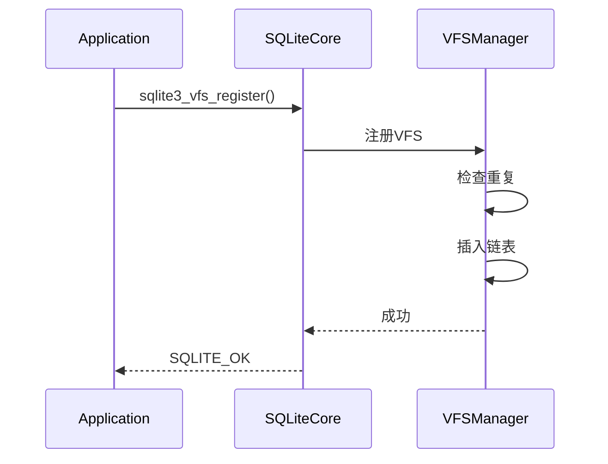

**Diagram sources**
- [os.c](file://src/os.c#L382-L446)

### VFS查找流程

当SQLite需要访问文件时，会通过VFS查找机制选择合适的文件系统实现。

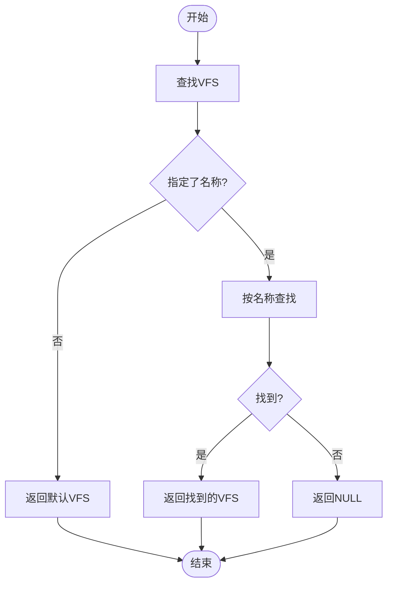

**Diagram sources**
- [os.c](file://src/os.c#L338-L380)

**Section sources**
- [os.c](file://src/os.c#L338-L446)

## 开发最佳实践

### 内存管理

VFS扩展需要特别注意内存管理，避免内存泄漏和越界访问。

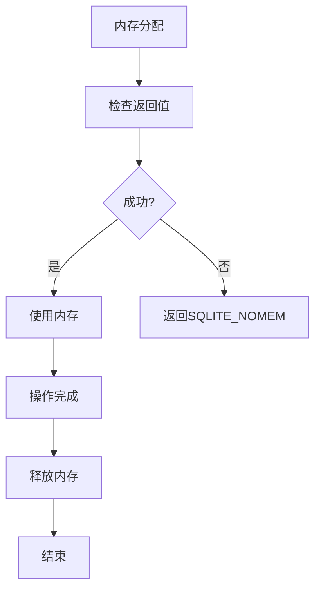

### 错误处理

完善的错误处理机制是VFS扩展稳定性的关键。

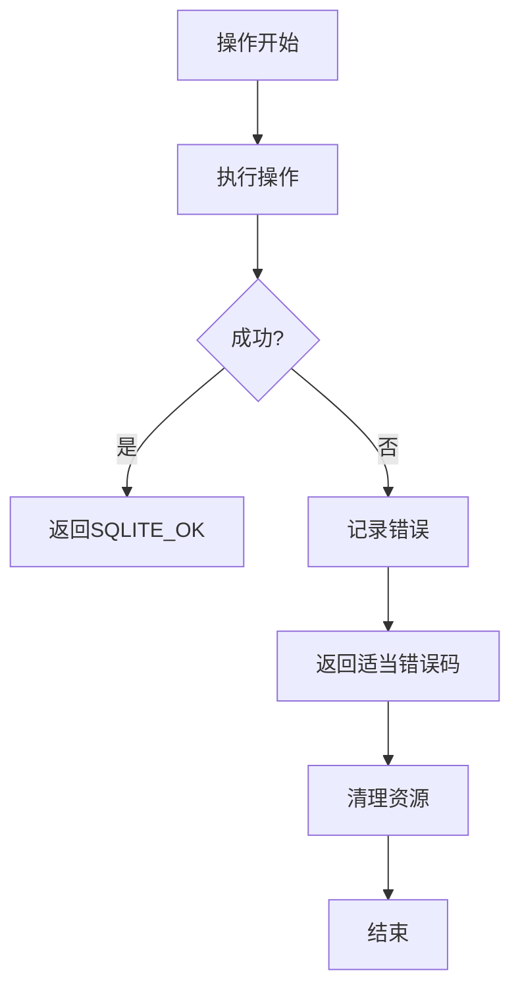

### 性能优化

VFS扩展可能成为性能瓶颈，需要进行优化。

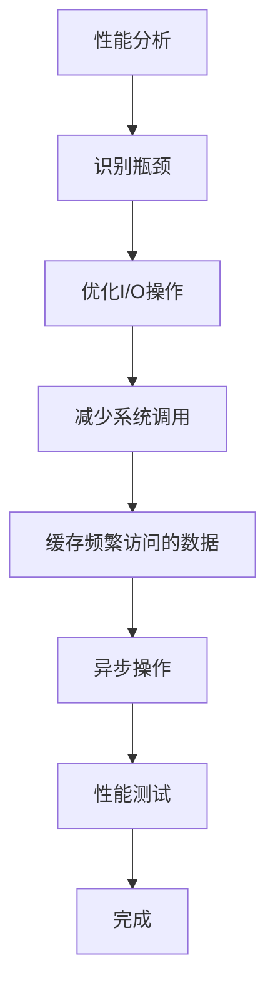

**Section sources**
- [appendvfs.c](file://ext/misc/appendvfs.c#L1-L672)
- [cksumvfs.c](file://ext/misc/cksumvfs.c#L1-L848)

## 调试与测试

### 调试技巧

有效的调试方法可以帮助快速定位和解决问题。

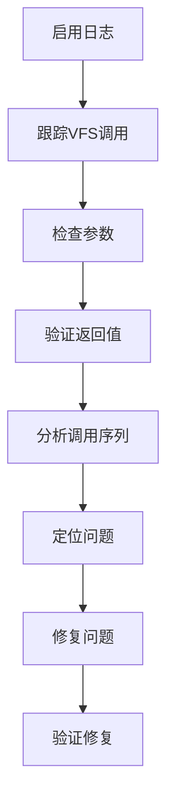

### 测试策略

全面的测试确保VFS扩展的可靠性和稳定性。

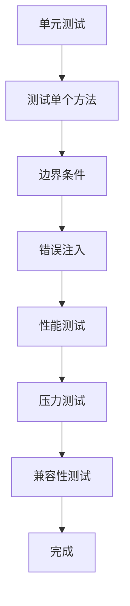

**Section sources**
- [appendvfs.c](file://ext/misc/appendvfs.c#L1-L672)
- [cksumvfs.c](file://ext/misc/cksumvfs.c#L1-L848)

## 结论

通过本指南，开发者可以系统地创建自定义VFS扩展，实现特定的存储需求。关键要点包括：

1. 理解`sqlite3_vfs`结构体的各个成员和方法
2. 正确实现文件操作的拦截和增强
3. 遵循SQLite的注册和加载机制
4. 注意内存管理和错误处理
5. 进行充分的测试和性能优化

VFS扩展为SQLite提供了强大的扩展能力，可以实现追加-only文件系统、数据校验、加密存储等高级功能，满足各种特殊需求。