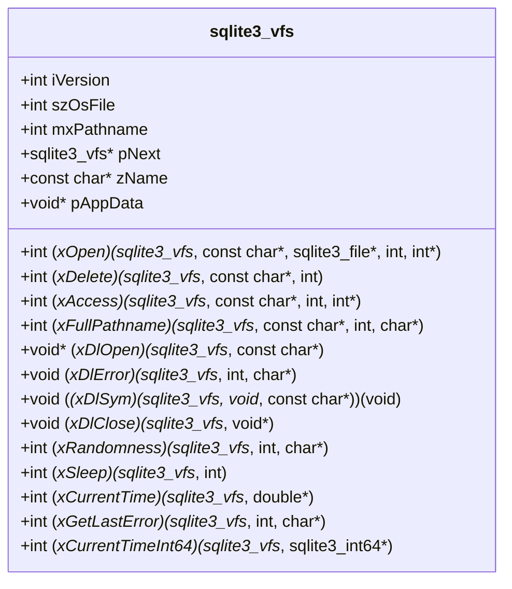
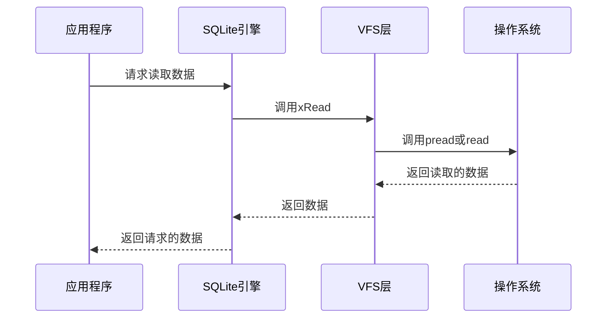
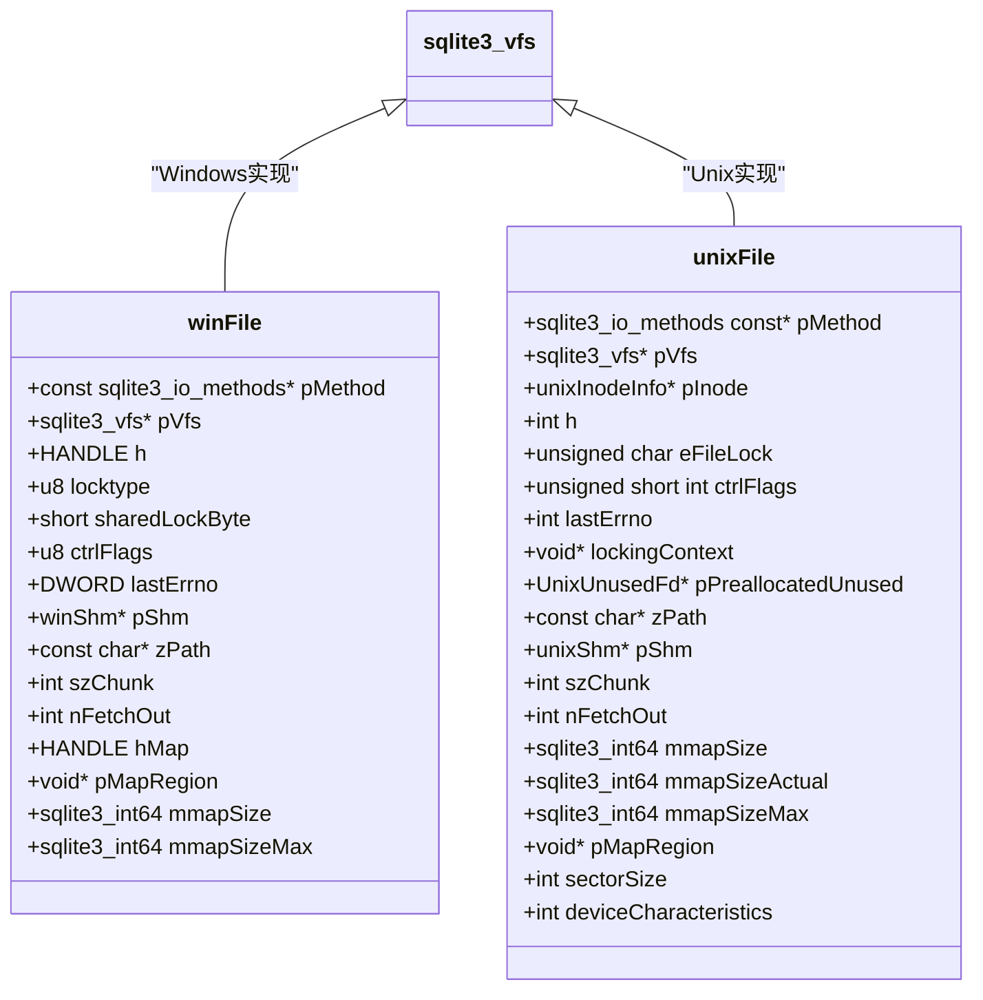
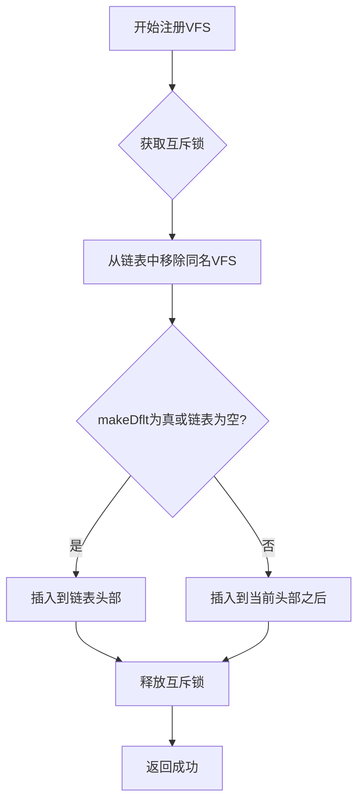
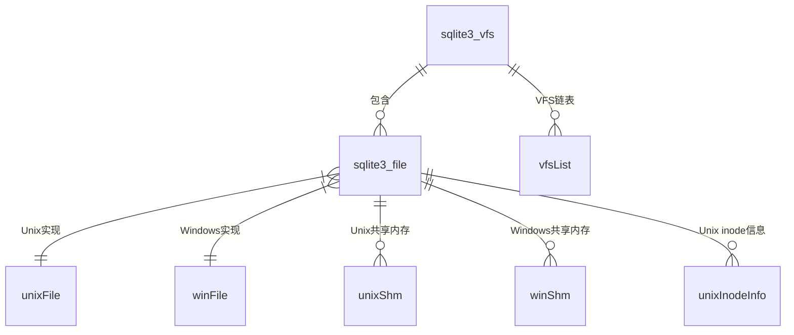

# VFS架构设计

<cite>
**本文档中引用的文件**  
- [os.c](file://src/os.c)
- [os.h](file://src/os.h)
- [os_unix.c](file://src/os_unix.c)
- [os_win.c](file://src/os_win.c)
- [sqliteInt.h](file://src/sqliteInt.h)
</cite>

## 目录
1. [VFS架构概述](#vfs架构概述)
2. [sqlite3_vfs结构体详解](#sqlite3_vfs结构体详解)
3. [核心成员函数技术实现](#核心成员函数技术实现)
4. [跨平台兼容性机制](#跨平台兼容性机制)
5. [VFS注册与优先级控制](#vfs注册与优先级控制)
6. [错误处理与内存管理](#错误处理与内存管理)
7. [线程安全实现](#线程安全实现)
8. [关键数据结构关系](#关键数据结构关系)

## VFS架构概述

虚拟文件系统(VFS)是SQLite的核心组件，为数据库引擎提供了一个抽象的文件I/O层。VFS架构设计实现了操作系统无关的文件操作接口，使得SQLite能够在不同平台上无缝运行。该架构通过定义标准化的函数指针接口，将底层操作系统的文件系统调用与上层数据库逻辑解耦。

VFS层的主要职责包括文件打开、读写、锁定、删除等基本操作，以及提供跨平台的时间、随机数生成和动态库加载功能。这种分层设计不仅提高了代码的可移植性，还允许开发者根据特定需求实现自定义的VFS。

**Section sources**
- [os.h](file://src/os.h#L199-L224)
- [os.c](file://src/os.c#L0-L447)

## sqlite3_vfs结构体详解

`sqlite3_vfs`结构体是VFS架构的核心数据结构，定义了虚拟文件系统的所有接口。该结构体包含了一系列函数指针，每个指针对应一个特定的文件系统操作。通过这种函数指针表的设计，SQLite实现了运行时的多态性，可以在不修改上层代码的情况下切换不同的文件系统实现。

结构体中的主要成员包括版本号(iVersion)、文件句柄大小(szOsFile)、最大路径名长度(mxPathname)、链表指针(pNext)、VFS名称(zName)以及各种操作函数指针。这种设计允许SQLite同时注册多个VFS实现，并根据需要选择合适的实现。

**Diagram sources**
- [os.h](file://src/os.h#L199-L224)
- [ext/wasm/api/sqlite3-wasm.c](file://ext/wasm/api/sqlite3-wasm.c#L1017-L1045)

## 核心成员函数技术实现

### xOpen函数实现

`xOpen`函数负责打开数据库文件，是VFS中最关键的函数之一。该函数的实现需要处理各种文件打开标志，如只读、创建、独占等。在Unix系统中，该函数通常调用`open()`系统调用，而在Windows系统中则调用`CreateFileW()`或`CreateFileA()`。

函数实现中包含了对文件描述符的验证，确保不会使用标准输入、输出或错误的文件描述符。同时，还实现了对文件创建模式的处理，确保新创建的WAL、journal和shm文件具有与主数据库文件相同的权限。

**Section sources**
- [os.c](file://src/os.c#L350-L370)
- [os_unix.c](file://src/os_unix.c#L1000-L1200)

### xClose函数实现

`xClose`函数负责关闭已打开的文件。该函数的实现需要确保文件句柄的正确释放，并处理可能的错误状态。在关闭文件之前，会先调用`xUnlock`函数释放所有文件锁，确保不会留下任何锁定状态。

对于内存映射文件，还需要在关闭前执行相应的清理工作，如解除内存映射等。该函数的实现还考虑了异常情况的处理，如文件句柄为空或已经关闭的情况。

**Section sources**
- [os.c](file://src/os.c#L80-L85)
- [os_unix.c](file://src/os_unix.c#L2000-L2100)

### xRead和xWrite函数实现

`xRead`和`xWrite`函数分别负责文件的读取和写入操作。这两个函数的实现充分利用了现代操作系统的高级I/O特性，如`pread()`和`pwrite()`系统调用，这些调用允许在指定偏移量进行读写而无需改变文件指针。

在Unix系统中，当`pread()`和`pwrite()`可用时，会优先使用这些函数以提高性能。对于不支持这些函数的系统，则回退到传统的`lseek()`+`read()`/`write()`组合。这种设计确保了在不同系统上的最佳性能表现。

**Diagram sources**
- [os.c](file://src/os.c#L90-L110)
- [os_unix.c](file://src/os_unix.c#L3000-L3200)

## 跨平台兼容性机制

### Unix系统适配

SQLite的Unix VFS实现通过条件编译和运行时检测来适应不同的Unix-like系统。代码中包含了对Linux、macOS、BSD、QNX、VxWorks、AIX、HPUX等多种系统的支持。通过定义不同的宏，可以启用或禁用特定系统的特性。

例如，对于文件锁定，提供了多种实现方式：POSIX建议锁（默认）、无锁、点文件锁、flock()锁、命名信号量锁（仅VxWorks）和AFP文件系统锁（仅macOS）。这种灵活性使得SQLite可以在各种文件系统上正常工作。

**Section sources**
- [os_unix.c](file://src/os_unix.c#L50-L100)
- [os.h](file://src/os.h#L150-L180)

### Windows系统适配

Windows VFS实现针对Windows操作系统的特性进行了优化。代码中包含了对Windows CE、Windows NT、Windows RT等不同Windows子平台的支持。通过条件编译，可以启用或禁用特定Windows版本的API。

Windows VFS特别处理了Unicode路径名的支持，提供了ANSI和Wide字符版本的API。对于WAL模式和内存映射文件，要求系统基于NT内核，这在编译时通过断言进行检查。此外，还实现了Windows特有的文件锁定机制，确保在多进程环境下的数据一致性。

**Diagram sources**
- [os_win.c](file://src/os_win.c#L500-L600)
- [os_unix.c](file://src/os_unix.c#L800-L900)

## VFS注册与优先级控制

### 注册机制

VFS的注册通过`sqlite3_vfs_register()`函数实现。该函数接受一个`sqlite3_vfs`结构体指针和一个布尔值，用于指示是否将该VFS设置为默认VFS。注册过程是线程安全的，使用互斥锁保护全局VFS链表。

当注册一个新的VFS时，首先会从链表中移除任何具有相同名称的现有VFS，然后根据`makeDflt`参数的值决定插入位置。如果`makeDflt`为真或链表为空，则新VFS成为链表的头部，即默认VFS；否则，插入到当前默认VFS之后。

**Section sources**
- [os.c](file://src/os.c#L400-L430)
- [os.h](file://src/os.h#L220-L224)

### 优先级控制

VFS的优先级由其在链表中的位置决定，链表头部的VFS具有最高优先级。当SQLite需要选择一个VFS时，会从链表头部开始搜索，直到找到匹配的VFS或到达链表末尾。

这种设计允许应用程序根据特定需求动态调整VFS的优先级。例如，可以注册一个自定义的VFS并将其设置为默认，以实现特定的文件访问策略或性能优化。同时，保留了回退到系统默认VFS的能力，确保了兼容性。

**Diagram sources**
- [os.c](file://src/os.c#L400-L430)

## 错误处理与内存管理

### 错误处理机制

VFS层的错误处理采用统一的错误码系统，所有函数返回SQLite定义的错误码，如`SQLITE_OK`、`SQLITE_ERROR`、`SQLITE_IOERR`等。对于系统特定的错误，通过`xGetLastError`函数获取详细信息。

在Unix系统中，错误处理会检查`errno`变量，并将其转换为相应的SQLite错误码。在Windows系统中，则调用`GetLastError()`函数获取错误信息。这种抽象层确保了上层代码无需关心底层操作系统的错误处理机制。

**Section sources**
- [os.c](file://src/os.c#L380-L390)
- [os_win.c](file://src/os_win.c#L100-L150)

### 内存管理

VFS层的内存管理通过`sqlite3_malloc()`和`sqlite3_free()`函数进行，这些函数提供了内存分配的钩子，允许应用程序监控或替换默认的内存分配器。对于文件句柄的分配，提供了`sqlite3OsOpenMalloc()`和`sqlite3OsCloseFree()`便利函数。

在Windows平台上，还提供了基于Win32堆的内存分配器选项，允许创建隔离的堆来管理SQLite的内存使用。这种设计不仅提高了内存使用的可预测性，还便于内存泄漏检测和性能分析。

**Section sources**
- [os.c](file://src/os.c#L375-L385)
- [os_win.c](file://src/os_win.c#L200-L250)

## 线程安全实现

VFS层的线程安全通过互斥锁实现。全局VFS链表的访问受一个静态互斥锁保护，确保VFS注册、查找和注销操作的原子性。在Unix系统中，使用`sqlite3_mutex`抽象层，可以适配不同的线程库如pthread。

对于文件级别的操作，SQLite实现了细粒度的锁定机制。文件锁分为共享锁、保留锁、待定锁和排他锁四种类型，通过这些锁的组合使用，实现了多进程环境下的并发控制。这种设计既保证了数据一致性，又最大限度地提高了并发性能。

**Section sources**
- [os.c](file://src/os.c#L250-L280)
- [os_unix.c](file://src/os_unix.c#L1500-L1600)

## 关键数据结构关系

VFS架构中的关键数据结构形成了一个层次化的对象体系。`sqlite3_vfs`作为顶层抽象，定义了所有VFS实现的接口。具体的Unix和Windows实现分别通过`unixFile`和`winFile`结构体扩展了这个接口。

文件操作通过`sqlite3_file`结构体进行，该结构体包含指向具体实现方法的指针。这种设计实现了运行时的多态性，使得上层代码可以透明地使用不同的文件系统后端。共享内存、内存映射等高级功能通过相应的子结构体实现，保持了核心结构的简洁性。

**Diagram sources**
- [os.c](file://src/os.c#L240-L245)
- [os_unix.c](file://src/os_unix.c#L800-L900)
- [os_win.c](file://src/os_win.c#L500-L600)