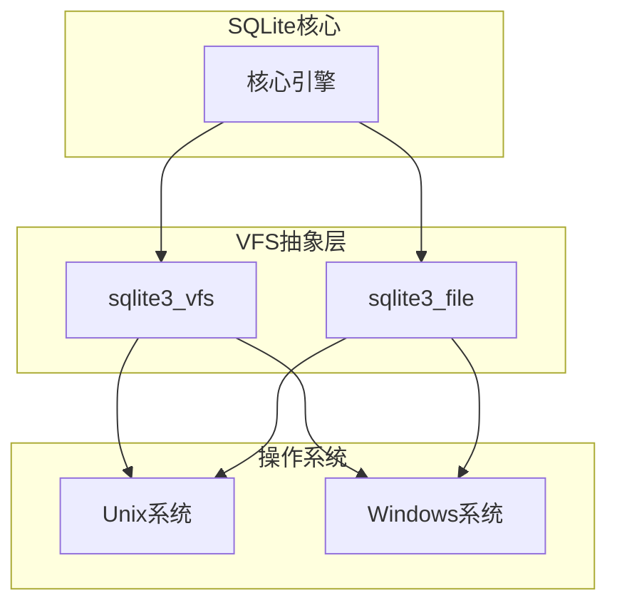
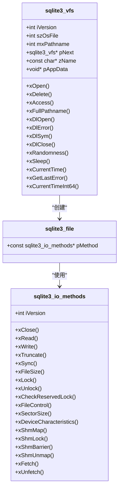
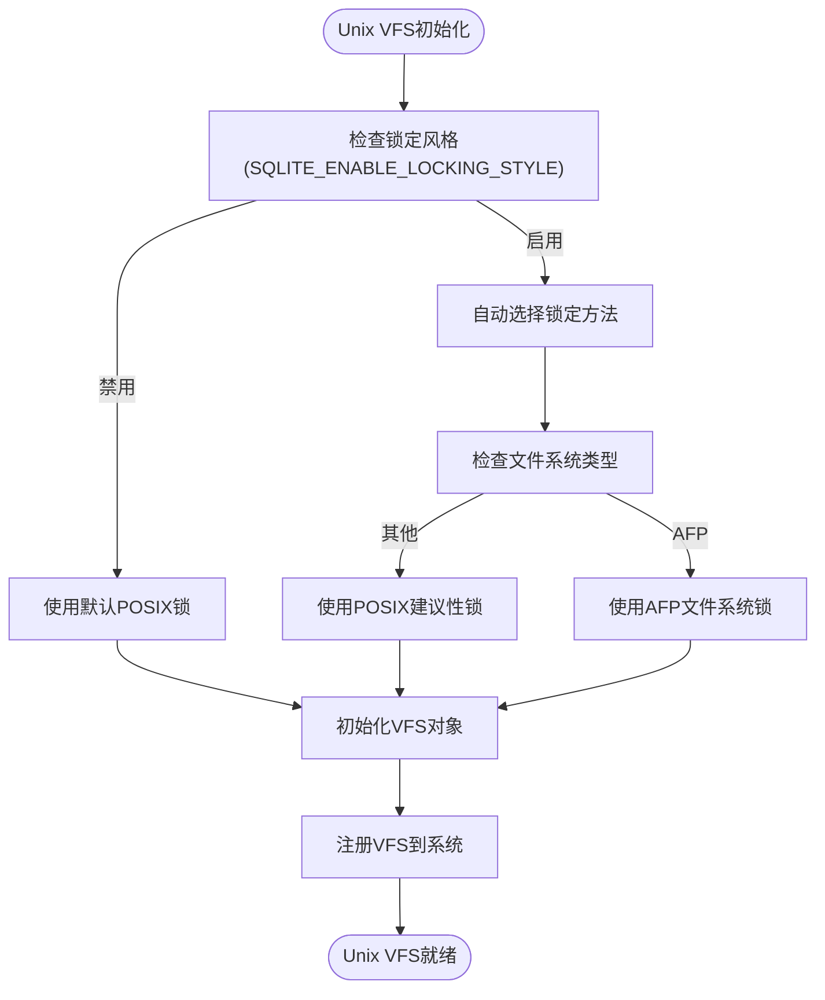
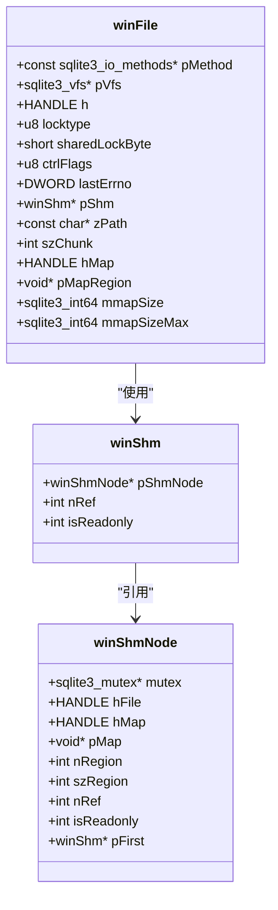
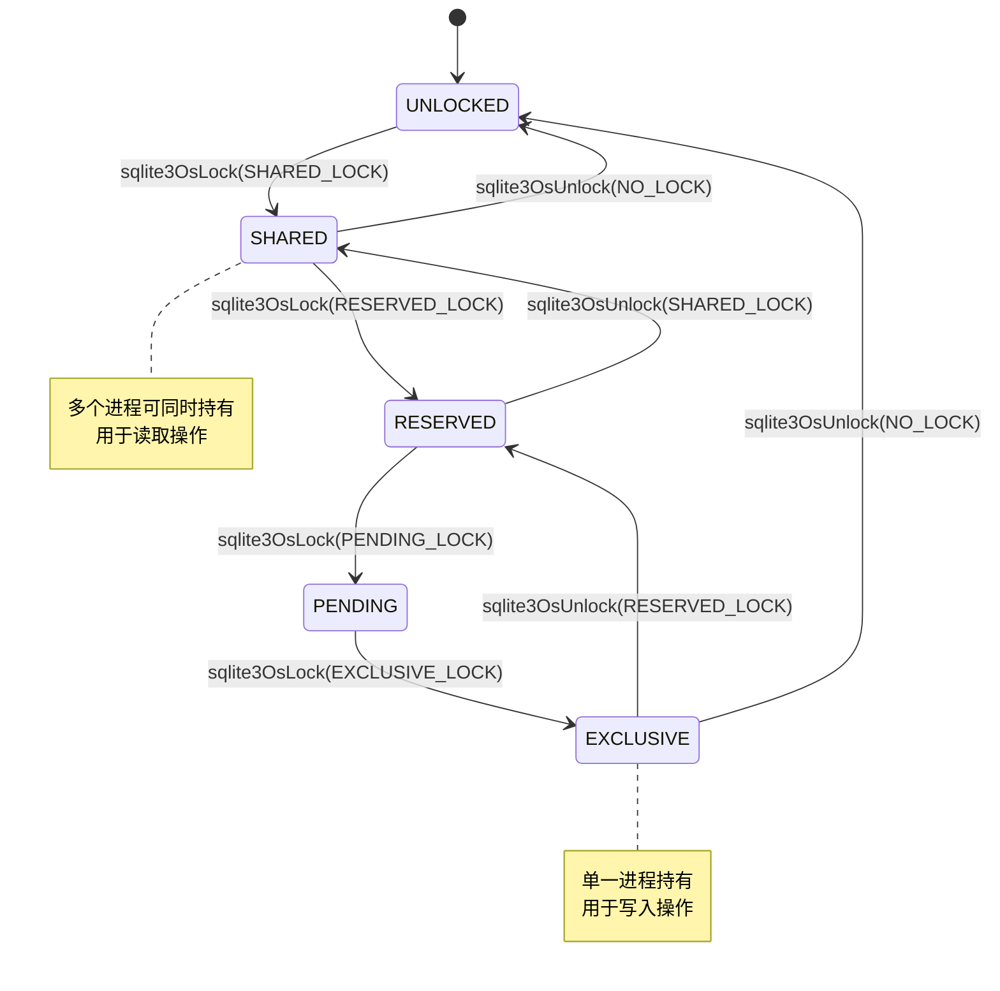
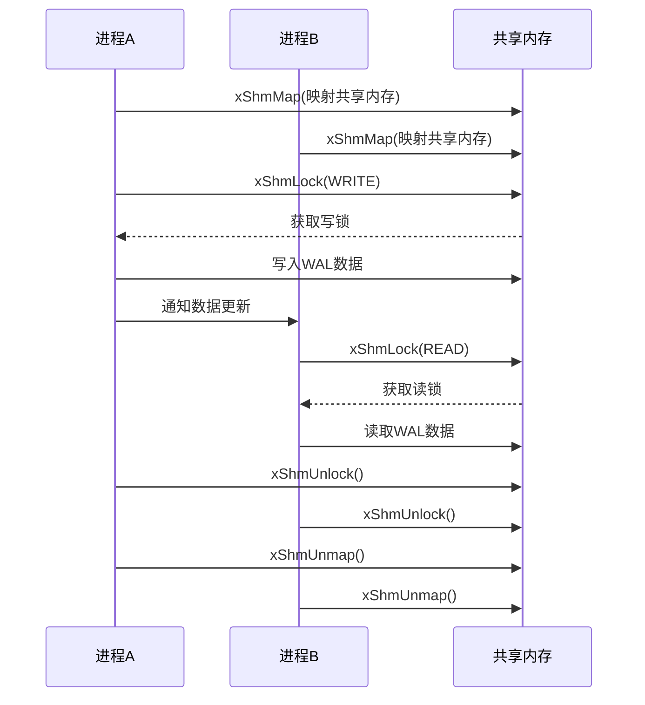
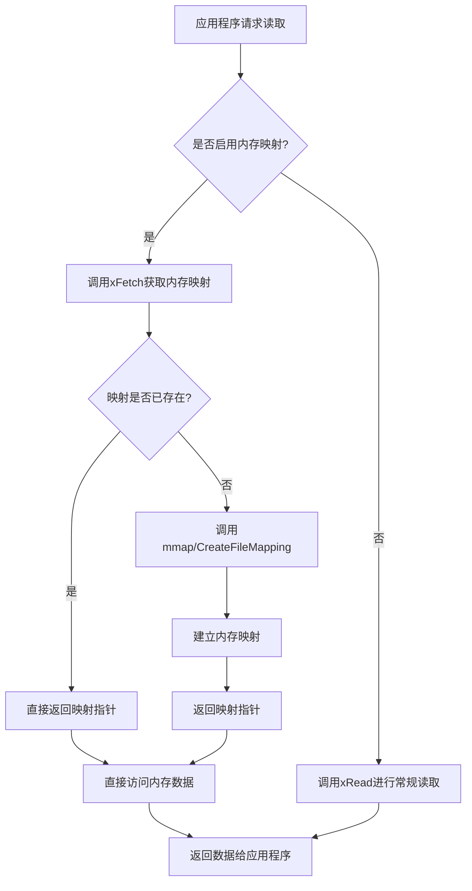
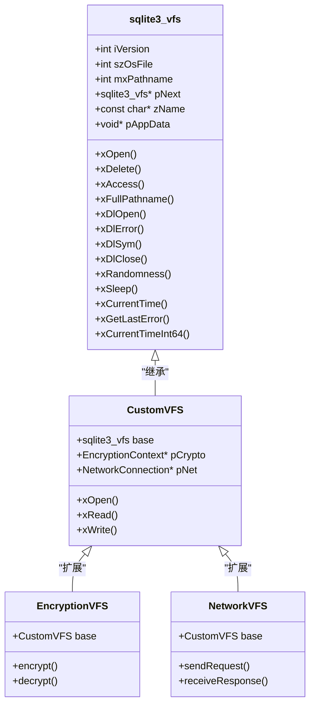

# 操作系统接口

<cite>
**本文档中引用的文件**  
- [os.h](file://src/os.h)
- [os.c](file://src/os.c)
- [os_unix.c](file://src/os_unix.c)
- [os_win.c](file://src/os_win.c)
- [os_win.h](file://src/os_win.h)
- [os_setup.h](file://src/os_setup.h)
- [os_common.h](file://src/os_common.h)
- [vfs-shm.txt](file://doc/vfs-shm.txt)
- [cksumvfs.c](file://ext/misc/cksumvfs.c)
</cite>

## 目录
1. [引言](#引言)
2. [VFS抽象层架构](#vfs抽象层架构)
3. [核心组件分析](#核心组件分析)
4. [Unix平台实现](#unix平台实现)
5. [Windows平台实现](#windows平台实现)
6. [跨平台文件锁机制](#跨平台文件锁机制)
7. [共享内存管理](#共享内存管理)
8. [内存映射I/O](#内存映射io)
9. [自定义VFS实现](#自定义vfs实现)
10. [跨平台开发指导](#跨平台开发指导)
11. [结论](#结论)

## 引言

SQLite的操作系统接口（OS Interface）通过虚拟文件系统（VFS）抽象层实现了跨平台兼容性，统一了不同操作系统的文件I/O、锁机制和时间功能。VFS层作为SQLite核心与底层操作系统之间的桥梁，屏蔽了平台差异，使得SQLite能够在Unix、Windows等多种操作系统上无缝运行。本文档详细分析VFS的架构设计、核心组件以及在不同平台上的具体实现差异，为开发者提供深入的技术指导和跨平台开发建议。

**Section sources**
- [os.h](file://src/os.h#L1-L50)
- [os.c](file://src/os.c#L1-L50)

## VFS抽象层架构

SQLite的VFS抽象层采用分层架构设计，将操作系统特定的功能封装在独立的模块中。核心架构由`sqlite3_vfs`和`sqlite3_file`两个关键结构体组成，通过函数指针实现多态性。`sqlite3_vfs`结构体定义了文件系统级别的操作，如文件打开、删除、访问权限检查等，而`sqlite3_file`结构体则封装了文件级别的I/O操作，包括读写、同步、文件大小获取等。

VFS层的设计遵循了面向对象的封装原则，将平台相关的实现细节隐藏在抽象接口之后。这种设计模式使得SQLite核心代码完全独立于底层操作系统，只需通过VFS接口进行交互。当SQLite需要执行文件操作时，会通过`sqlite3OsXXX`系列的包装函数调用相应的VFS方法，这些包装函数提供了统一的调用接口，简化了核心代码的复杂性。

**Diagram sources**
- [os.h](file://src/os.h#L199-L224)
- [os.c](file://src/os.c#L210-L257)

**Section sources**
- [os.h](file://src/os.h#L1-L225)
- [os.c](file://src/os.c#L1-L448)

## 核心组件分析

VFS抽象层的核心组件包括虚拟文件系统对象（`sqlite3_vfs`）、文件对象（`sqlite3_file`）和I/O方法对象（`sqlite3_io_methods`）。`sqlite3_vfs`结构体作为VFS的入口点，包含了版本号、文件句柄大小、最大路径长度等基本信息，以及一系列函数指针，用于实现文件系统级别的操作。每个VFS实现都必须提供这些方法的具体实现，以满足SQLite核心的需求。

`sqlite3_file`结构体是文件操作的核心，它不仅包含了指向`sqlite3_io_methods`的指针，还保存了平台特定的文件句柄和状态信息。在Unix系统中，`unixFile`结构体继承了`sqlite3_file`，并添加了文件描述符、锁状态等Unix特有的字段；在Windows系统中，`winFile`结构体则包含了文件句柄、锁类型等Windows特有的信息。这种继承机制使得VFS能够在保持接口统一的同时，灵活地处理平台差异。

**Diagram sources**
- [os.h](file://src/os.h#L199-L224)
- [os_unix.c](file://src/os_unix.c#L76-L150)
- [os_win.c](file://src/os_win.c#L257-L284)

**Section sources**
- [os.h](file://src/os.h#L1-L225)
- [os_unix.c](file://src/os_unix.c#L1-L8339)
- [os_win.c](file://src/os_win.c#L1-L6774)

## Unix平台实现

Unix平台的VFS实现位于`os_unix.c`文件中，针对不同的Unix变体提供了多种文件锁定策略。默认实现使用POSIX建议性锁（Posix Advisory Locks），通过`fcntl()`系统调用来实现文件锁的获取和释放。此外，SQLite还提供了多种替代锁定方法，包括无锁模式（no-op locks）、点文件锁（dot-file locks）、flock()锁定等，以适应不同Unix系统的特性。

Unix VFS实现的一个重要特点是其对文件描述符的管理。`unixFile`结构体中的`h`字段保存了文件描述符，而`pInode`字段则指向`unixInodeInfo`结构体，用于管理inode级别的锁信息。这种设计避免了多个文件描述符之间的锁竞争，提高了并发性能。同时，Unix VFS还实现了预读（pread）和预写（pwrite）优化，通过`USE_PREAD`宏控制是否使用这些高效的系统调用。

**Diagram sources**
- [os_unix.c](file://src/os_unix.c#L1-L8339)
- [os.h](file://src/os.h#L1-L225)

**Section sources**
- [os_unix.c](file://src/os_unix.c#L1-L8339)
- [os.h](file://src/os.h#L1-L225)

## Windows平台实现

Windows平台的VFS实现位于`os_win.c`文件中，针对Windows操作系统的特性进行了专门优化。与Unix系统不同，Windows的文件锁是强制性的，这意味着锁操作会阻止其他进程的读写访问。Windows VFS通过`winFile`结构体管理文件句柄和锁状态，其中`h`字段保存了Windows文件句柄，`locktype`字段记录了当前的锁类型。

Windows VFS实现了多种文件操作API的支持，包括ANSI和Unicode版本。通过`SQLITE_WIN32_HAS_ANSI`和`SQLITE_WIN32_HAS_WIDE`宏定义，VFS能够根据目标平台选择合适的API。对于Windows CE和Windows RT等特殊子平台，VFS还提供了相应的适配代码，确保在这些受限环境中也能正常工作。内存映射I/O在Windows平台上通过`CreateFileMapping`和`MapViewOfFile`等API实现，为大文件操作提供了高效的支持。

**Diagram sources**
- [os_win.c](file://src/os_win.c#L257-L284)
- [os_win.h](file://src/os_win.h#L1-L91)

**Section sources**
- [os_win.c](file://src/os_win.c#L1-L6774)
- [os_win.h](file://src/os_win.h#L1-L91)

## 跨平台文件锁机制

SQLite的跨平台文件锁机制设计精巧，通过统一的锁状态模型实现了在不同操作系统上的兼容性。核心锁状态包括`NO_LOCK`、`SHARED_LOCK`、`RESERVED_LOCK`、`PENDING_LOCK`和`EXCLUSIVE_LOCK`五种，这些状态在Unix和Windows平台上有着不同的实现方式，但对外提供一致的语义。

在Unix系统上，文件锁通过在特定字节范围内的字节级锁定实现。`PENDING_BYTE`定义了锁区域的起始位置，默认设置在1GB边界之后，以避免占用数据库文件的有效数据区域。共享锁通过锁定`SHARED_FIRST`到`SHARED_FIRST+SHARED_SIZE`范围内的一个随机字节实现，允许多个读取者同时访问。排他锁则需要锁定整个锁区域，确保写入操作的独占性。

**Diagram sources**
- [os.h](file://src/os.h#L150-L180)
- [os_unix.c](file://src/os_unix.c#L1164-L1182)
- [os_win.c](file://src/os_win.c#L257-L284)

**Section sources**
- [os.h](file://src/os.h#L150-L180)
- [os_unix.c](file://src/os_unix.c#L1-L8339)
- [os_win.c](file://src/os_win.c#L1-L6774)

## 共享内存管理

共享内存管理是SQLite WAL（Write-Ahead Logging）模式的核心组件，通过`xShmMap`、`xShmLock`、`xShmBarrier`和`xShmUnmap`四个接口实现。在Unix系统上，共享内存通过`mmap()`系统调用映射到进程地址空间，多个进程可以共享同一块内存区域。`unixShmNode`结构体管理共享内存节点，通过引用计数确保内存的正确释放。

在Windows系统上，共享内存通过`CreateFileMapping`和`MapViewOfFile`API实现。`winShmNode`结构体封装了Windows共享内存对象的句柄和映射信息，提供了与Unix系统类似的接口。WAL模式下的共享内存锁有七种状态：`UNLOCKED`、`READ`、`READ_FULL`、`WRITE`、`PENDING`、`CHECKPOINT`和`RECOVER`，这些状态通过`xShmLock`方法进行转换，确保了WAL文件的并发访问安全。

**Diagram sources**
- [vfs-shm.txt](file://doc/vfs-shm.txt#L1-L130)
- [os_unix.c](file://src/os_unix.c#L1164-L1182)
- [os_win.c](file://src/os_win.c#L257-L284)

**Section sources**
- [vfs-shm.txt](file://doc/vfs-shm.txt#L1-L130)
- [os_unix.c](file://src/os_unix.c#L1-L8339)
- [os_win.c](file://src/os_win.c#L1-L6774)

## 内存映射I/O

内存映射I/O是SQLite提高文件访问性能的重要机制，通过`xFetch`和`xUnfetch`接口实现。当`SQLITE_MAX_MMAP_SIZE`编译选项大于0时，SQLite会尝试将数据库文件映射到进程的虚拟地址空间，直接通过内存访问代替系统调用进行文件读写。这种技术显著减少了系统调用的开销，特别适合大文件的随机访问场景。

在Unix系统上，内存映射通过`mmap()`系统调用实现，支持`MAP_SHARED`和`MAP_PRIVATE`两种模式。SQLite使用`MAP_SHARED`模式确保多个进程对同一数据库文件的修改能够及时同步。在Windows系统上，通过`CreateFileMapping`和`MapViewOfFile`系列API实现等效功能。`winFile`结构体中的`hMap`字段保存了文件映射对象的句柄，`pMapRegion`字段指向映射的内存区域。

**Diagram sources**
- [os.h](file://src/os.h#L199-L224)
- [os_unix.c](file://src/os_unix.c#L1-L8339)
- [os_win.c](file://src/os_win.c#L1-L6774)

**Section sources**
- [os.h](file://src/os.h#L199-L224)
- [os_unix.c](file://src/os_unix.c#L1-L8339)
- [os_win.c](file://src/os_win.c#L1-L6774)

## 自定义VFS实现

SQLite提供了强大的自定义VFS机制，允许开发者实现特殊存储需求，如加密文件系统或网络存储。通过实现`sqlite3_vfs`结构体中的函数指针，可以创建全新的VFS实现。例如，`cksumvfs.c`文件中的校验和VFS在标准VFS之上添加了数据完整性检查功能，每次读取页面时都会验证校验和，确保数据的正确性。

创建自定义VFS的基本步骤包括：定义`sqlite3_io_methods`对象实现文件操作，定义`sqlite3_vfs`对象实现文件系统操作，实现`xOpen`等方法将文件操作路由到自定义逻辑，最后通过`sqlite3_vfs_register()`注册新的VFS。这种插件式架构使得SQLite能够轻松扩展到各种特殊应用场景，如内存数据库、网络文件系统或加密存储。

**Diagram sources**
- [cksumvfs.c](file://ext/misc/cksumvfs.c#L1-L199)
- [os.h](file://src/os.h#L199-L224)

**Section sources**
- [cksumvfs.c](file://ext/misc/cksumvfs.c#L1-L199)
- [os.h](file://src/os.h#L199-L224)

## 跨平台开发指导

在进行跨平台SQLite开发时，需要特别注意不同操作系统的特性和限制。首先，文件路径处理需要考虑路径分隔符的差异，Windows使用反斜杠`\`而Unix系统使用正斜杠`/`。SQLite的VFS层已经处理了这一差异，但在应用程序层面仍需注意。其次，文件锁行为在不同平台上有显著差异，Windows的强制锁会阻止其他进程的访问，而Unix的建议性锁则依赖于所有进程的协作。

性能优化方面，内存映射I/O在支持的平台上能显著提升性能，但需要考虑系统内存限制。在嵌入式系统或内存受限环境中，可能需要禁用内存映射。此外，WAL模式的并发性能在不同文件系统上表现不同，NTFS和ext4等现代文件系统通常能提供更好的并发性能。开发者应根据目标平台的特点进行针对性优化，充分利用VFS抽象层提供的灵活性。

**Section sources**
- [os.h](file://src/os.h#L1-L225)
- [os_unix.c](file://src/os_unix.c#L1-L8339)
- [os_win.c](file://src/os_win.c#L1-L6774)

## 结论

SQLite的VFS抽象层通过精心设计的架构实现了卓越的跨平台兼容性，统一了不同操作系统的文件I/O、锁机制和时间功能。通过对Unix和Windows平台的具体实现分析，我们可以看到VFS层如何在保持接口统一的同时，灵活地处理平台差异。自定义VFS机制为特殊存储需求提供了强大的扩展能力，使得SQLite能够适应各种复杂的应用场景。对于跨平台开发者而言，深入理解VFS的工作原理有助于更好地利用SQLite的性能优势，实现高效可靠的数据存储解决方案。