# 文件I/O操作

<cite>
**本文档引用的文件**
- [src/os.c](file://src/os.c)
- [src/os.h](file://src/os.h)
- [src/os_unix.c](file://src/os_unix.c)
- [src/os_win.c](file://src/os_win.c)
- [src/os_win.h](file://src/os_win.h)
- [src/os_common.h](file://src/os_common.h)
- [src/pager.c](file://src/pager.c)
- [test/speedtest1.c](file://test/speedtest1.c)
</cite>

## 目录
1. [简介](#简介)
2. [VFS架构概述](#vfs架构概述)
3. [核心I/O操作接口](#核心io操作接口)
4. [Unix平台实现](#unix平台实现)
5. [Windows平台实现](#windows平台实现)
6. [文件句柄管理和缓冲策略](#文件句柄管理和缓冲策略)
7. [错误处理机制](#错误处理机制)
8. [内存映射文件I/O](#内存映射文件io)
9. [性能优化最佳实践](#性能优化最佳实践)
10. [故障诊断指南](#故障诊断指南)
11. [总结](#总结)

## 简介

SQLite采用虚拟文件系统（VFS）架构来实现跨平台的文件I/O操作。这种设计使得SQLite能够在不同的操作系统上提供统一的文件访问接口，同时针对每个平台的特性进行优化。本文档详细分析了SQLite在Unix和Windows平台上的文件I/O实现机制，包括核心操作的抽象接口设计、平台特定的实现差异、以及性能优化策略。

## VFS架构概述

SQLite的VFS架构通过三层抽象实现了跨平台的文件I/O功能：

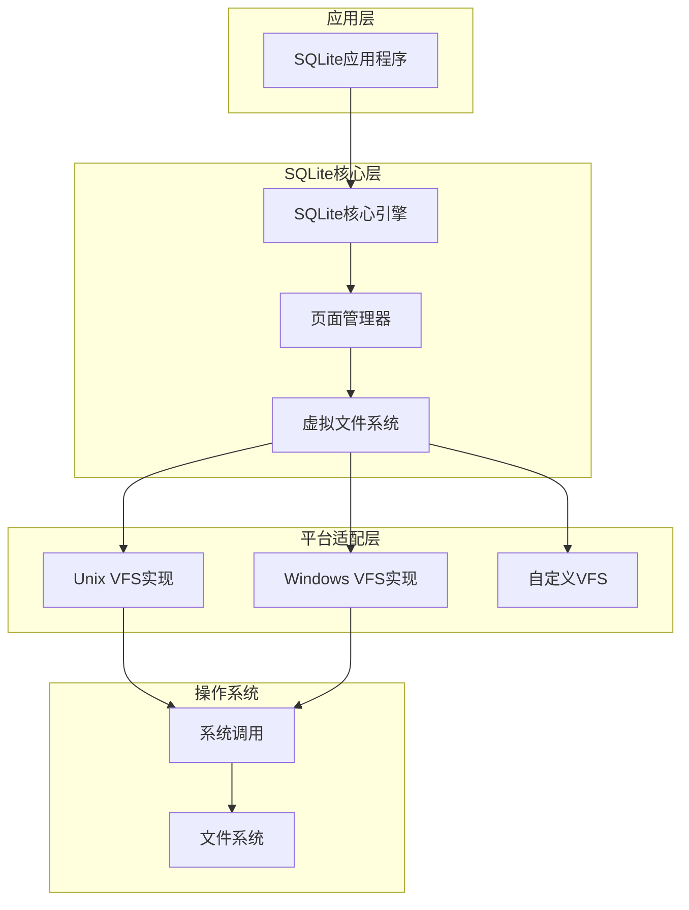

**图表来源**
- [src/os.c](file://src/os.c#L1-L50)
- [src/os.h](file://src/os.h#L1-L50)

### 核心组件说明

1. **sqlite3_vfs**: 虚拟文件系统接口，定义了所有平台无关的操作
2. **sqlite3_file**: 文件对象，封装了具体的文件操作
3. **sqlite3_io_methods**: I/O方法集合，包含具体的操作实现

**章节来源**
- [src/os.c](file://src/os.c#L1-L448)
- [src/os.h](file://src/os.h#L1-L226)

## 核心I/O操作接口

SQLite定义了一套完整的文件I/O操作接口，这些接口在不同平台上具有统一的语义但实现细节各异。

### 基本I/O操作

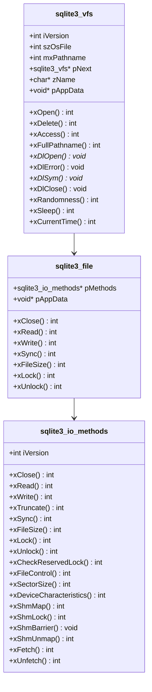

**图表来源**
- [src/os.h](file://src/os.h#L173-L208)
- [src/os.h](file://src/os.h#L200-L226)

### 关键I/O函数

SQLite提供了以下核心I/O操作函数：

| 函数名 | 功能描述 | 参数说明 |
|--------|----------|----------|
| `sqlite3OsRead` | 从文件读取数据 | 文件指针、缓冲区、字节数、偏移量 |
| `sqlite3OsWrite` | 向文件写入数据 | 文件指针、数据缓冲区、字节数、偏移量 |
| `sqlite3OsSync` | 刷新文件缓存到磁盘 | 文件指针、同步标志 |
| `sqlite3OsClose` | 关闭文件 | 文件指针 |
| `sqlite3OsFileSize` | 获取文件大小 | 文件指针、输出大小指针 |

**章节来源**
- [src/os.c](file://src/os.c#L75-L118)

## Unix平台实现

Unix平台的文件I/O实现主要集中在`src/os_unix.c`文件中，支持多种锁定策略和优化技术。

### Unix VFS结构

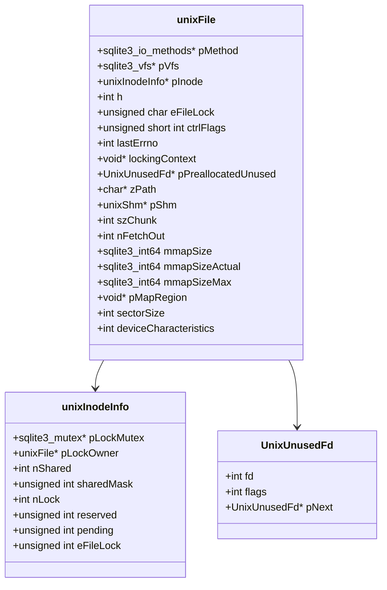

**图表来源**
- [src/os_unix.c](file://src/os_unix.c#L280-L350)

### Unix系统调用封装

Unix平台使用系统调用数组来封装底层操作，支持运行时替换：

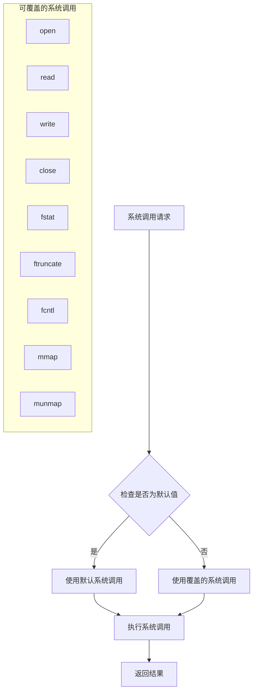

**图表来源**
- [src/os_unix.c](file://src/os_unix.c#L400-L600)

### Unix锁定机制

Unix平台支持多种锁定策略：

1. **POSIX Advisory Locks**: 标准的POSIX文件锁
2. **flock() Locks**: BSD风格的文件锁
3. **Dot-File Locks**: 使用临时文件进行锁定
4. **No-Op Locks**: 禁用锁定（仅用于特殊场景）

**章节来源**
- [src/os_unix.c](file://src/os_unix.c#L1-L8339)

## Windows平台实现

Windows平台的文件I/O实现主要在`src/os_win.c`中，针对Windows特有的API进行了优化。

### Windows VFS结构

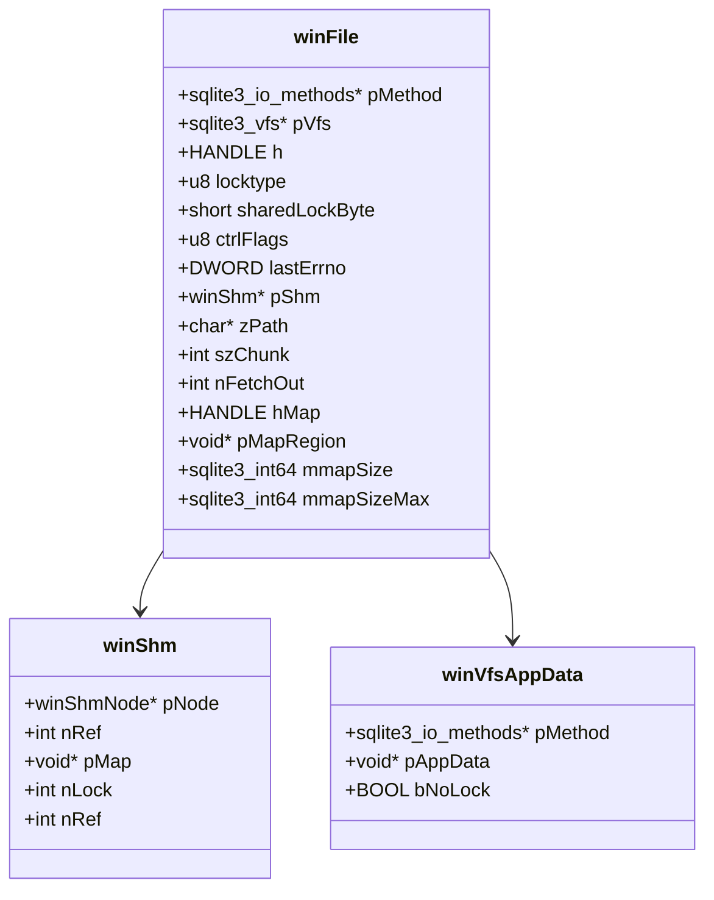

**图表来源**
- [src/os_win.c](file://src/os_win.c#L250-L350)

### Windows系统调用封装

Windows平台同样使用系统调用数组来封装API调用：

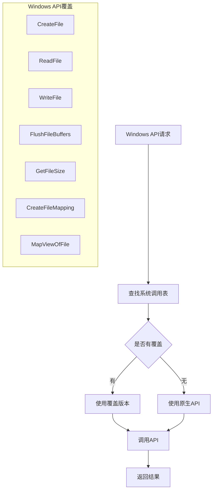

**图表来源**
- [src/os_win.c](file://src/os_win.c#L400-L600)

### Windows锁定机制

Windows平台的锁定机制与Unix有显著差异：

1. **LockFileEx/UnlockFileEx**: 支持读写锁的高级锁定
2. **LockFile/UnlockFile**: 基础锁定（Win95/98/ME）
3. **互斥量锁定**: 在WinCE中使用互斥量进行锁定

**章节来源**
- [src/os_win.c](file://src/os_win.c#L1-L6774)

## 文件句柄管理和缓冲策略

### Unix文件句柄管理

Unix平台采用延迟关闭策略来提高性能：

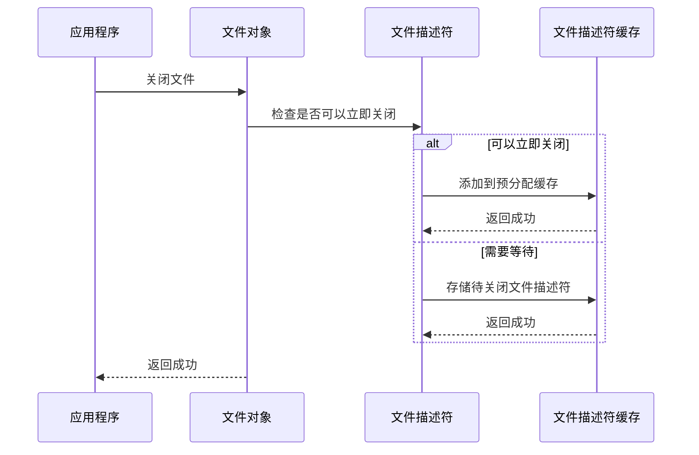

**图表来源**
- [src/os_unix.c](file://src/os_unix.c#L200-L250)

### Windows文件句柄管理

Windows平台使用异步关闭机制：

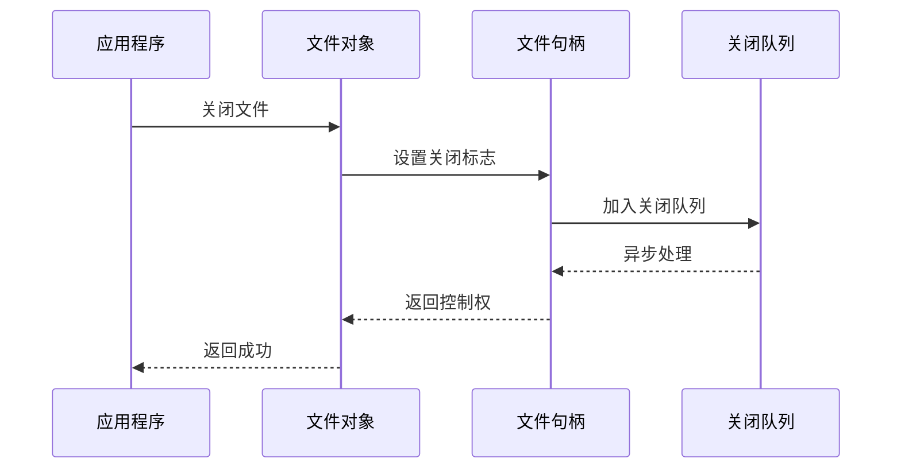

**图表来源**
- [src/os_win.c](file://src/os_win.c#L200-L300)

### 缓冲策略对比

| 特性 | Unix | Windows |
|------|------|---------|
| 文件描述符复用 | 是 | 否 |
| 异步关闭 | 是 | 是 |
| 内存映射支持 | 是 | 是 |
| 批量原子写入 | 是 | 否 |
| 文件锁定粒度 | 字节级 | 字节级 |

## 错误处理机制

### 统一错误处理框架

SQLite使用统一的错误处理框架来处理I/O错误：

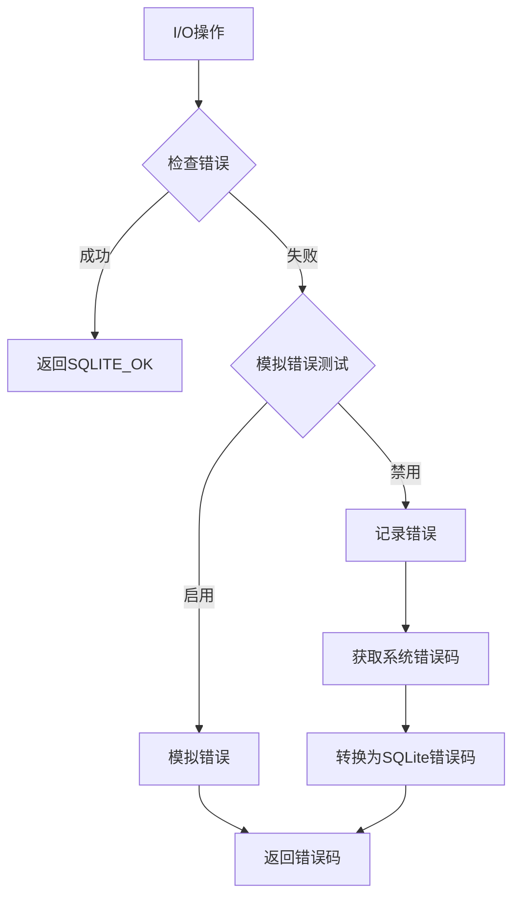

**图表来源**
- [src/os_common.h](file://src/os_common.h#L30-L70)

### 平台特定错误处理

#### Unix平台错误处理
- 使用`errno`变量获取系统错误
- 支持信号中断的重试机制
- 提供详细的错误日志

#### Windows平台错误处理
- 使用`GetLastError()`获取系统错误
- 支持Unicode错误消息
- 提供格式化错误信息的功能

**章节来源**
- [src/os_common.h](file://src/os_common.h#L1-L100)

## 内存映射文件I/O

### 内存映射架构

SQLite支持内存映射文件I/O来提高大文件的访问性能：

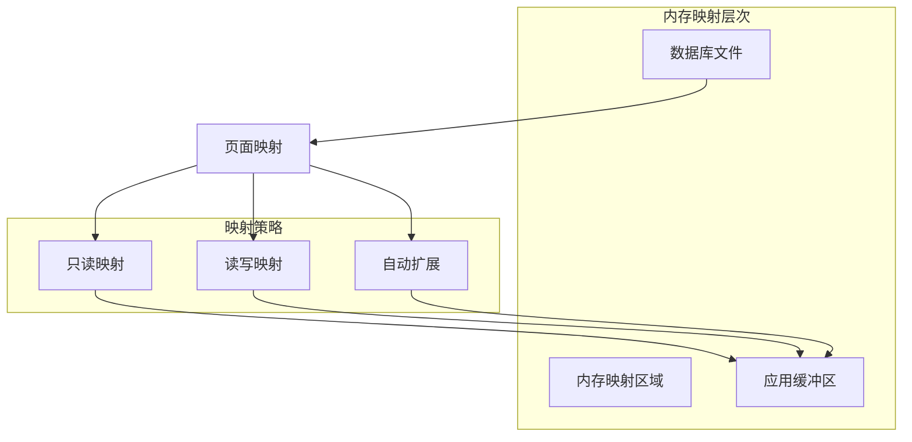

**图表来源**
- [src/os_unix.c](file://src/os_unix.c#L5318-L5448)
- [src/os_win.c](file://src/os_win.c#L4923-L5001)

### 平台差异

#### Unix平台内存映射
- 使用`mmap()`系统调用
- 支持`mremap()`动态扩展
- 支持读写和只读映射

#### Windows平台内存映射
- 使用`CreateFileMapping()`和`MapViewOfFile()`
- 支持WinRT和传统Win32 API
- 自动处理页面大小对齐

**章节来源**
- [src/os_unix.c](file://src/os_unix.c#L5318-L5448)
- [src/os_win.c](file://src/os_win.c#L4923-L5001)

## 性能优化最佳实践

### 自定义VFS实现指南

为了实现高效的文件I/O，建议遵循以下最佳实践：

#### 1. 实现高效的读写操作
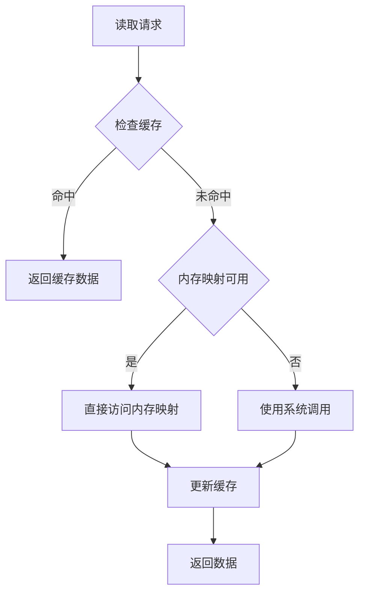

#### 2. 优化锁定策略
- 选择合适的锁定粒度
- 最小化锁定时间
- 避免死锁情况

#### 3. 内存管理优化
- 合理设置缓存大小
- 使用预分配策略
- 及时释放不用的资源

### 性能监控指标

| 指标类型 | Unix | Windows |
|----------|------|---------|
| 文件打开时间 | 系统调用开销 | API调用开销 |
| 读写速度 | 磁盘I/O性能 | 文件系统性能 |
| 锁定延迟 | 锁定算法效率 | 锁定机制开销 |
| 内存映射效率 | 页面管理性能 | 虚拟内存管理 |

## 故障诊断指南

### 常见I/O性能瓶颈

#### 1. 文件锁定问题
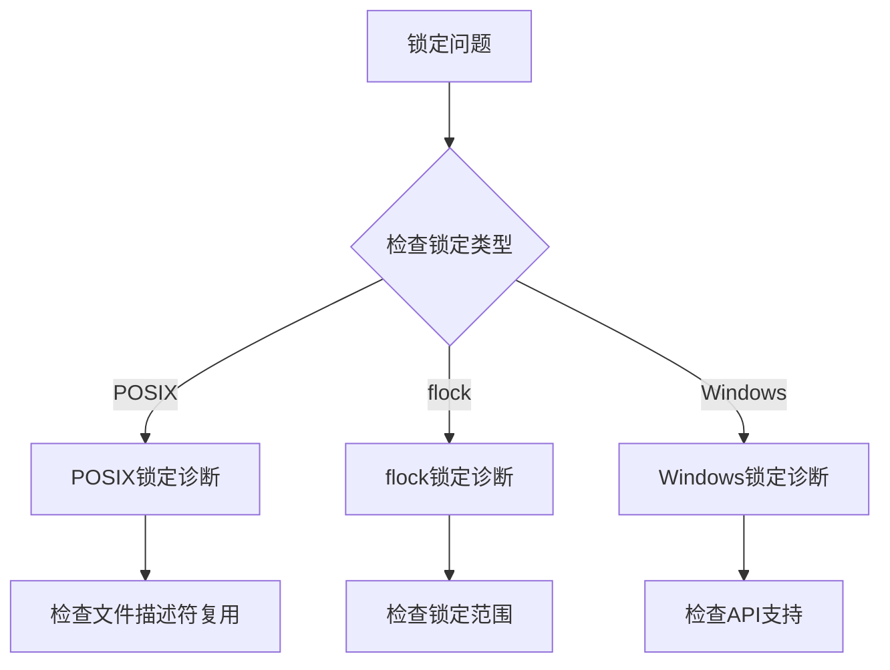

#### 2. 内存映射问题
- 检查可用内存
- 验证文件大小限制
- 确认平台支持情况

#### 3. 缓存失效问题
- 监控缓存命中率
- 分析访问模式
- 调整缓存参数

### 性能测试工具

SQLite提供了专门的性能测试工具：

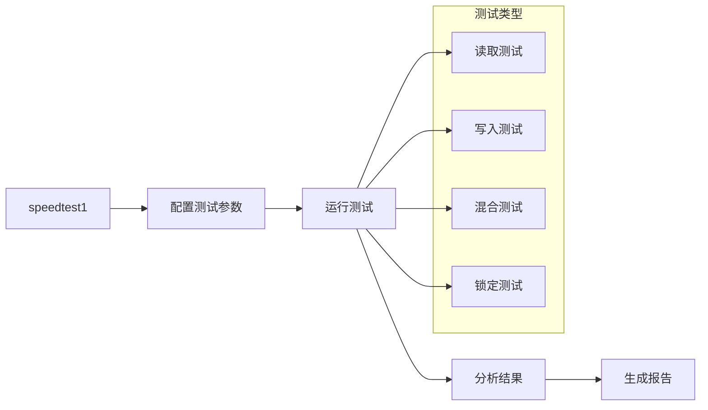

**图表来源**
- [test/speedtest1.c](file://test/speedtest1.c#L1-L200)

**章节来源**
- [test/speedtest1.c](file://test/speedtest1.c#L1-L3488)

## 总结

SQLite的文件I/O实现展现了优秀的跨平台设计思想。通过VFS架构，SQLite成功地抽象了不同操作系统的文件系统差异，同时针对每个平台的特性进行了深度优化。

### 主要特点

1. **统一的抽象接口**: 通过VFS提供一致的文件操作接口
2. **平台特定优化**: 针对Unix和Windows平台的特殊优化
3. **灵活的锁定机制**: 支持多种锁定策略适应不同需求
4. **高效的内存映射**: 提供高性能的大文件访问能力
5. **完善的错误处理**: 统一的错误处理和诊断机制

### 设计优势

- **可移植性**: 一套代码支持多个平台
- **可扩展性**: 易于添加新的平台支持
- **可维护性**: 清晰的模块化设计
- **可测试性**: 完善的测试框架和模拟机制

这种设计不仅保证了SQLite的跨平台兼容性，也为用户提供了高性能、可靠的文件I/O服务。对于需要在不同操作系统上部署SQLite的应用开发者来说，理解这些实现细节有助于更好地利用SQLite的性能优势。