# 文件关闭操作

<cite>
**本文档中引用的文件**
- [src/os.c](file://src/os.c)
- [src/os.h](file://src/os.h)
- [src/os_unix.c](file://src/os_unix.c)
- [src/os_win.c](file://src/os_win.c)
- [src/os_common.h](file://src/os_common.h)
- [src/pager.c](file://src/pager.c)
- [src/wal.c](file://src/wal.c)
</cite>

## 目录
1. [概述](#概述)
2. [核心架构](#核心架构)
3. [sqlite3OsClose函数详解](#sqlite3osclose函数详解)
4. [平台特定实现](#平台特定实现)
5. [资源释放流程](#资源释放流程)
6. [内存映射处理](#内存映射处理)
7. [错误处理与中断机制](#错误处理与中断机制)
8. [异常终止保护](#异常终止保护)
9. [最佳实践](#最佳实践)
10. [故障排除指南](#故障排除指南)

## 概述

SQLite的文件关闭操作是一个复杂而精密的资源管理系统，负责安全地释放数据库文件的各种资源，包括文件描述符、内存映射区域和共享内存段。该系统需要处理多种平台差异、并发访问控制以及异常情况下的资源清理。

文件关闭操作的核心目标是：
- 安全地释放所有打开的文件资源
- 确保内存映射区域的正确解除映射
- 处理EINTR等系统调用中断
- 在异常情况下保证数据完整性
- 防止资源泄漏

## 核心架构

SQLite采用虚拟文件系统（VFS）架构来抽象不同平台的文件操作。文件关闭操作通过以下层次结构实现：

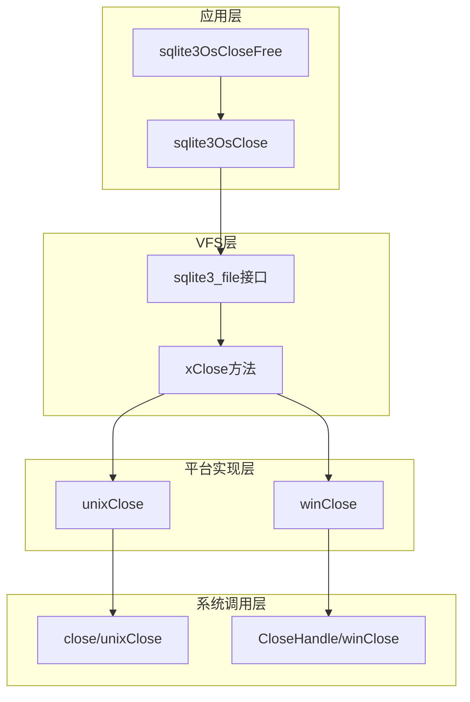

**图表来源**
- [src/os.c](file://src/os.c#L81-L86)
- [src/os_unix.c](file://src/os_unix.c#L2212-L2215)
- [src/os_win.c](file://src/os_win.c#L2883-L2885)

## sqlite3OsClose函数详解

`sqlite3OsClose`是文件关闭操作的核心入口点，它提供了统一的接口来关闭各种类型的文件对象。

### 函数签名与基本流程

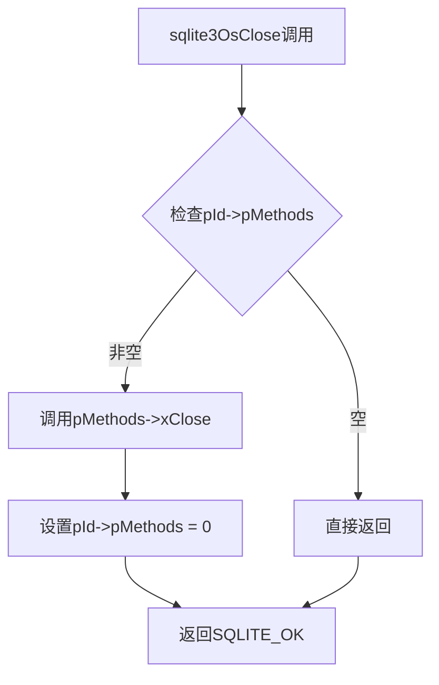

**图表来源**
- [src/os.c](file://src/os.c#L81-L86)

### 关键特性

1. **空指针检查**：确保传入的文件对象有效
2. **条件执行**：只有当存在方法表时才执行关闭操作
3. **状态清理**：关闭后清除方法表指针，防止重复关闭
4. **原子性**：整个操作是原子的，避免竞态条件

**章节来源**
- [src/os.c](file://src/os.c#L81-L86)

## 平台特定实现

### Unix平台实现

Unix平台的文件关闭实现考虑了POSIX兼容性和锁管理的复杂性。

#### 关键特点

1. **锁管理**：需要先解锁再关闭文件
2. **延迟关闭**：如果文件有未释放的锁，则延迟关闭
3. **内存映射**：处理内存映射文件的特殊需求
4. **错误恢复**：robust_close函数处理EINTR中断

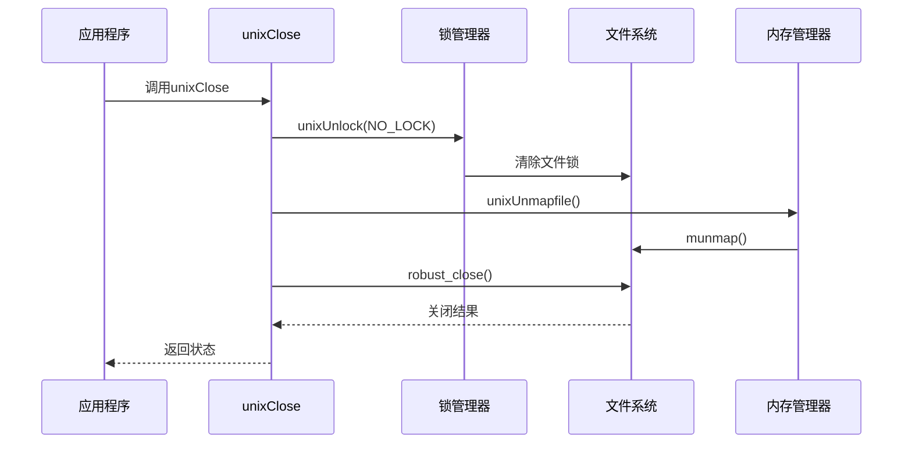

**图表来源**
- [src/os_unix.c](file://src/os_unix.c#L2212-L2215)
- [src/os_unix.c](file://src/os_unix.c#L2162-L2215)

#### EINTR处理机制

Unix平台使用robust_close函数来处理系统调用中断：

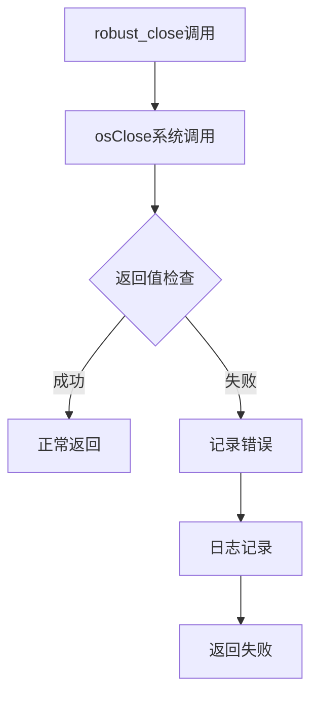

**图表来源**
- [src/os_unix.c](file://src/os_unix.c#L1309-L1352)

**章节来源**
- [src/os_unix.c](file://src/os_unix.c#L2212-L2215)
- [src/os_unix.c](file://src/os_unix.c#L1309-L1352)

### Windows平台实现

Windows平台的文件关闭实现包含特殊的重试逻辑和错误处理机制。

#### 关键特点

1. **重试机制**：MX_CLOSE_ATTEMPT次重试机会
2. **句柄管理**：正确处理文件句柄和映射句柄
3. **错误码转换**：将Windows错误码转换为SQLite错误码
4. **特殊处理**：WinCE平台的额外清理逻辑

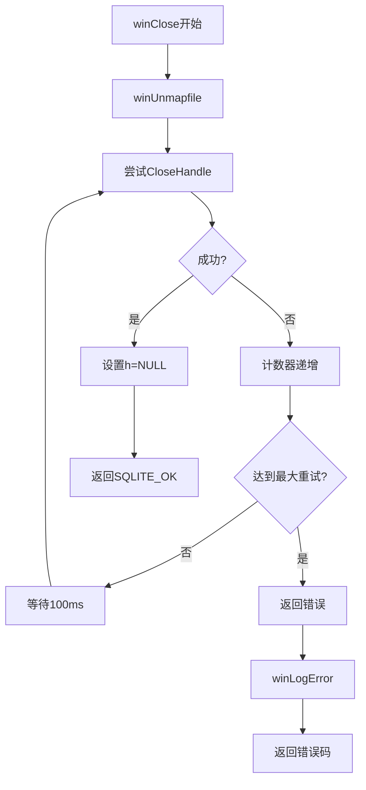

**图表来源**
- [src/os_win.c](file://src/os_win.c#L2883-L2897)

#### Windows重试逻辑

Windows平台定义了MX_CLOSE_ATTEMPT常量，默认为3次重试：

```c
#define MX_CLOSE_ATTEMPT 3
```

这种设计考虑了Windows系统的不稳定性，特别是在网络文件系统或防病毒软件干扰的情况下。

**章节来源**
- [src/os_win.c](file://src/os_win.c#L2883-L2897)

## 资源释放流程

文件关闭操作涉及多个层次的资源清理，必须按照正确的顺序执行以确保系统稳定性。

### 关闭序列图

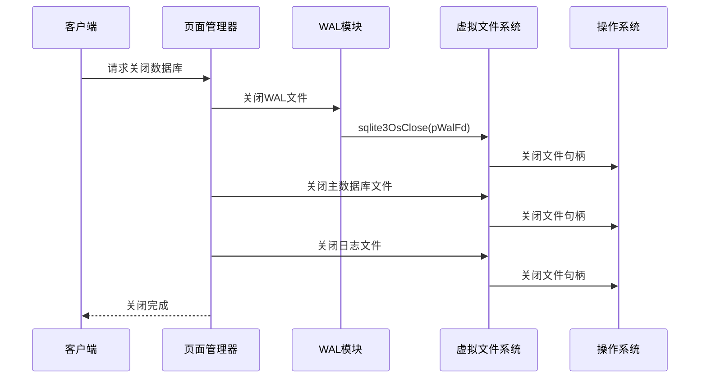

**图表来源**
- [src/pager.c](file://src/pager.c#L1838-L1923)
- [src/wal.c](file://src/wal.c#L2486-L2550)

### 资源清理优先级

1. **WAL文件**：首先关闭写前日志文件
2. **主数据库**：关闭主要的数据库文件
3. **日志文件**：关闭事务日志文件
4. **保存点**：释放保存点资源
5. **内存映射**：解除内存映射

**章节来源**
- [src/pager.c](file://src/pager.c#L1838-L1923)
- [src/wal.c](file://src/wal.c#L2486-L2550)

## 内存映射处理

SQLite支持内存映射文件访问，这要求特殊的关闭处理逻辑。

### Unix内存映射清理

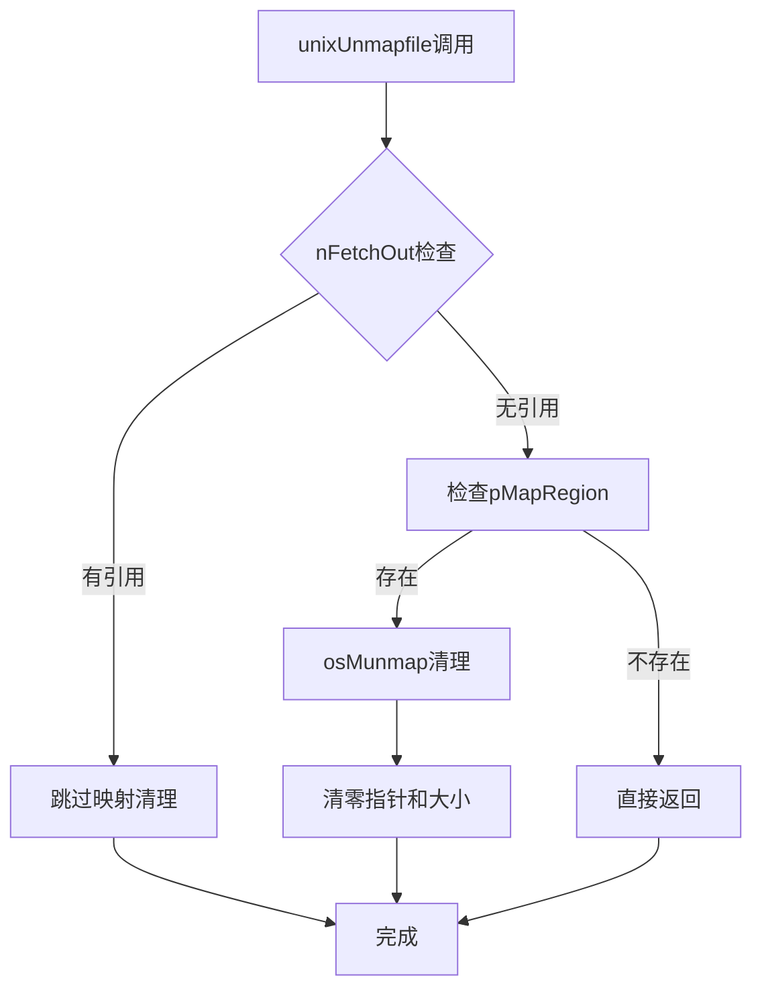

**图表来源**
- [src/os_unix.c](file://src/os_unix.c#L5318-L5330)

### Windows内存映射清理

Windows平台的内存映射清理更加复杂，需要处理两个句柄：

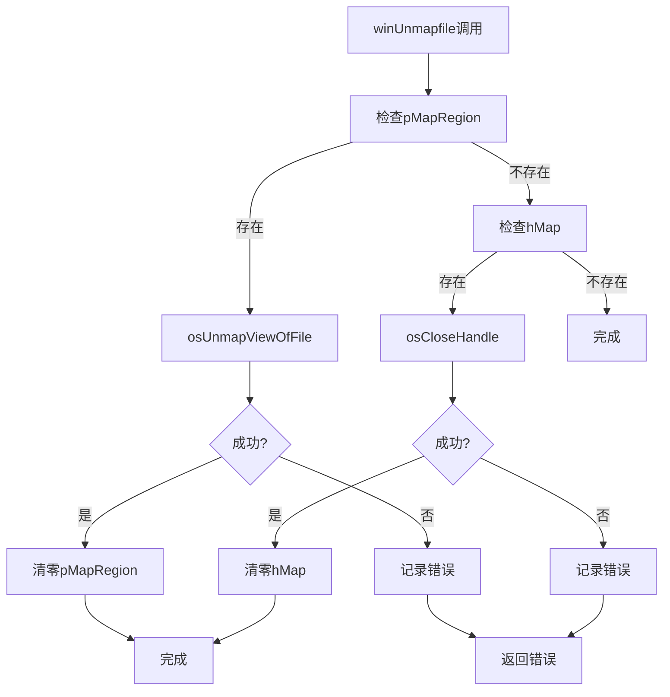

**图表来源**
- [src/os_win.c](file://src/os_win.c#L4886-L4921)

### 内存映射生命周期管理

内存映射的生命周期与文件访问紧密相关：

1. **引用计数**：跟踪有多少地方正在使用映射
2. **延迟清理**：只有当所有引用都释放后才清理映射
3. **错误恢复**：映射清理失败时的降级处理

**章节来源**
- [src/os_unix.c](file://src/os_unix.c#L5318-L5330)
- [src/os_win.c](file://src/os_win.c#L4886-L4921)

## 错误处理与中断机制

### EINTR中断处理

在Unix系统中，系统调用可能会因为信号而被中断，SQLite使用robust_close函数来处理这种情况。

#### 中断处理策略

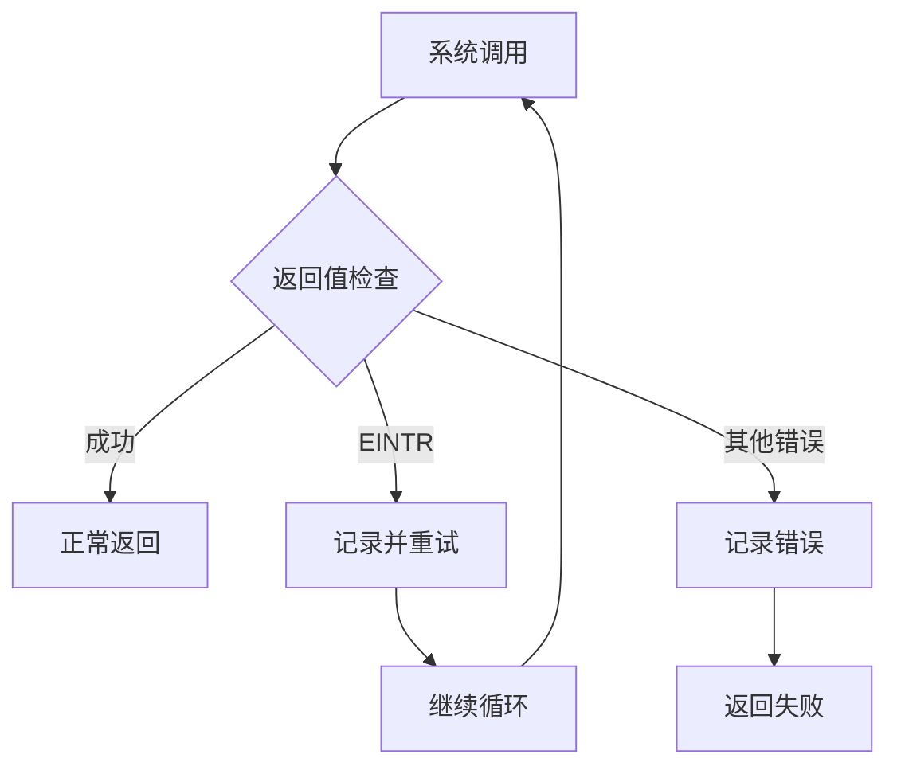

**图表来源**
- [src/os_unix.c](file://src/os_unix.c#L1309-L1352)

### Windows错误处理

Windows平台使用不同的错误处理策略：

1. **错误码转换**：将Windows错误码映射到SQLite错误码
2. **重试机制**：最多3次重试机会
3. **详细日志**：记录详细的错误信息用于调试

**章节来源**
- [src/os_unix.c](file://src/os_unix.c#L1309-L1352)
- [src/os_win.c](file://src/os_win.c#L2883-L2897)

## 异常终止保护

### 数据完整性保障

SQLite在异常终止情况下采取多种措施来保护数据完整性：

#### WAL模式下的异常处理

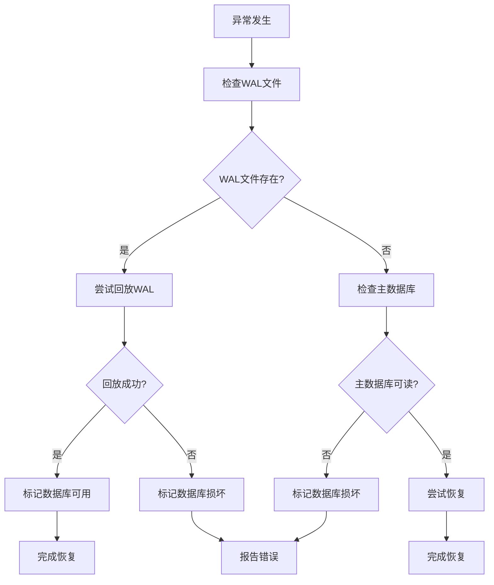

**图表来源**
- [src/pager.c](file://src/pager.c#L5249-L5456)

#### 保存点清理

在异常情况下，SQLite会自动清理保存点以防止资源泄漏：

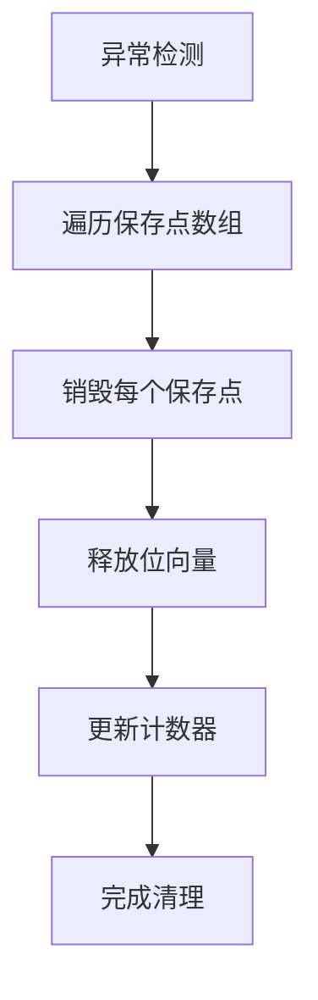

**图表来源**
- [src/pager.c](file://src/pager.c#L1787-L1799)

**章节来源**
- [src/pager.c](file://src/pager.c#L5249-L5456)
- [src/pager.c](file://src/pager.c#L1787-L1799)

## 最佳实践

### 正确关闭文件的指导原则

1. **始终检查返回值**：验证文件关闭是否成功
2. **按正确顺序关闭**：先关闭WAL，再关闭主数据库
3. **处理异常情况**：准备应对文件系统错误
4. **监控资源使用**：定期检查文件描述符使用情况

### 防止资源泄漏的策略


### 性能优化建议

1. **批量关闭**：对于大量文件，考虑批量处理
2. **异步关闭**：在可能的情况下使用异步关闭
3. **缓存友好**：优化关闭操作的内存访问模式

## 故障排除指南

### 常见问题诊断

#### 文件关闭失败

**症状**：sqlite3OsClose返回非零错误码

**可能原因**：
1. 文件系统权限问题
2. 网络文件系统不稳定
3. 防病毒软件干扰
4. 系统资源不足

**解决方案**：
1. 检查文件权限
2. 增加重试次数
3. 暂时禁用防病毒软件
4. 增加系统资源

#### 内存映射问题

**症状**：munmap或UnmapViewOfFile失败

**可能原因**：
1. 映射区域已被其他进程修改
2. 内存不足
3. 系统限制

**解决方案**：
1. 检查映射区域状态
2. 增加可用内存
3. 调整系统限制

### 调试技巧

1. **启用详细日志**：使用OSTRACE宏记录详细信息
2. **监控系统调用**：使用strace或Process Monitor
3. **内存检查**：使用Valgrind等工具检测内存问题

**章节来源**
- [src/os_common.h](file://src/os_common.h#L30-L50)

## 结论

SQLite的文件关闭操作是一个精心设计的资源管理系统，它成功地处理了跨平台差异、并发访问控制和异常情况。通过理解其内部机制，开发者可以更好地利用SQLite的文件操作功能，并在遇到问题时进行有效的故障排除。

关键要点：
- 统一的VFS接口简化了平台差异
- 分层的资源管理确保了正确的清理顺序
- 强大的错误处理机制提高了系统可靠性
- 特殊的内存映射处理保证了高性能访问

这个系统的设计体现了SQLite对稳定性和性能的双重追求，为嵌入式数据库应用提供了可靠的文件操作基础。