# 文件同步操作

<cite>
**本文档引用的文件**
- [os.c](file://src/os.c)
- [os.h](file://src/os.h)
- [os_unix.c](file://src/os_unix.c)
- [os_win.c](file://src/os_win.c)
- [wal.c](file://src/wal.c)
- [wal.h](file://src/wal.h)
- [pager.c](file://src/pager.c)
- [pager.h](file://src/pager.h)
- [pragma.c](file://src/pragma.c)
- [os_common.h](file://src/os_common.h)
- [os.h](file://src/os.h)
</cite>

## 目录
1. [简介](#简介)
2. [核心同步函数架构](#核心同步函数架构)
3. [平台特定实现](#平台特定实现)
4. [同步模式详解](#同步模式详解)
5. [WAL模式下的特殊处理](#wal模式下的特殊处理)
6. [存储设备特性优化](#存储设备特性优化)
7. [错误处理与恢复策略](#错误处理与恢复策略)
8. [性能优化建议](#性能优化建议)
9. [总结](#总结)

## 简介

SQLite的文件同步操作是确保数据持久性和一致性的关键机制。本文档深入分析了sqlite3OsSync函数在事务提交过程中的核心作用，探讨了不同平台下fsync()、fdatasync()和FlushFileBuffers()系统调用的使用场景，并详细说明了各种sync_mode设置对数据安全性和性能的影响。

文件同步操作主要涉及两个层面：
- **事务级同步**：确保单个事务的数据完整性
- **检查点同步**：在WAL模式下进行批量数据刷新

## 核心同步函数架构

### sqlite3OsSync函数设计

SQLite通过抽象层实现了跨平台的文件同步功能，核心接口定义如下：

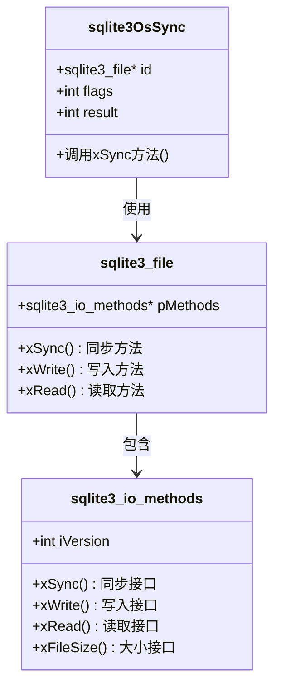

**图表来源**
- [os.c](file://src/os.c#L98-L101)
- [os.h](file://src/os.h#L179-L179)

### 同步标志位定义

SQLite定义了多种同步标志位来控制不同的同步行为：

| 标志位 | 值 | 描述 |
|--------|-----|------|
| SQLITE_SYNC_NORMAL | 0x01 | 标准同步级别 |
| SQLITE_SYNC_FULL | 0x02 | 完整同步级别 |
| SQLITE_SYNC_DATAONLY | 0x04 | 仅数据同步 |

**节来源**
- [os.c](file://src/os.c#L98-L101)
- [os.h](file://src/os.h#L179-L179)

## 平台特定实现

### Unix/Linux平台实现

Unix/Linux平台使用多层次的同步策略来确保数据持久性：

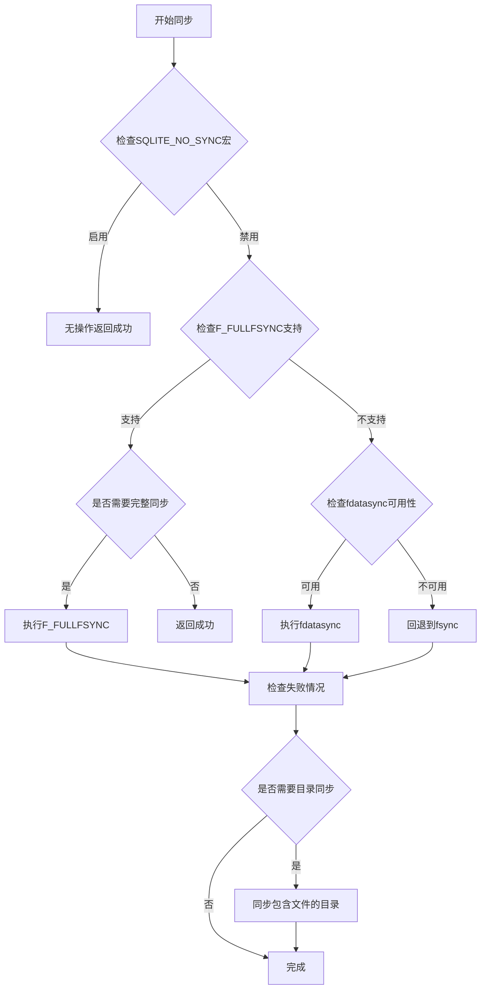

**图表来源**
- [os_unix.c](file://src/os_unix.c#L3625-L3720)

#### 关键实现细节

1. **fsync() vs fdatasync()选择**
   - 当前默认使用fdatasync()以提高性能
   - 仅在必要时回退到fsync()

2. **macOS特殊处理**
   - HFS+文件系统中fdatasync()存在已知问题
   - 默认重定义为fsync()

3. **测试支持**
   - 提供了完整的I/O错误模拟机制
   - 支持同步计数器跟踪

**节来源**
- [os_unix.c](file://src/os_unix.c#L3625-L3720)

### Windows平台实现

Windows平台使用FlushFileBuffers()系统调用来确保数据写入磁盘：

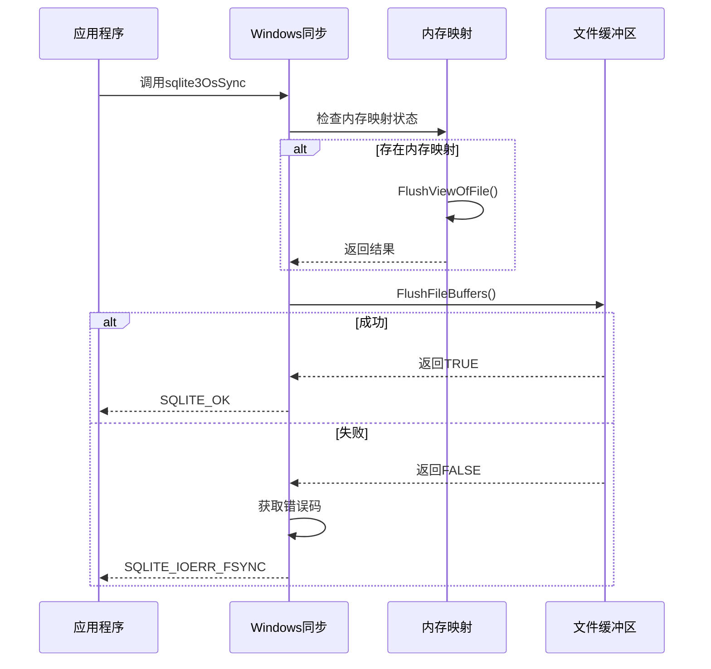

**图表来源**
- [os_win.c](file://src/os_win.c#L3313-L3351)

**节来源**
- [os_win.c](file://src/os_win.c#L3313-L3351)

## 同步模式详解

### PRAGMA synchronous参数

SQLite提供了三种同步模式来平衡数据安全性和性能：

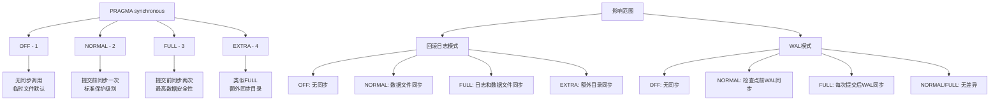

**图表来源**
- [pager.c](file://src/pager.c#L3558-L3609)

### 同步标志位映射

不同同步模式对应不同的内部同步标志：

| 同步模式 | Pager标志 | WAL同步标志 | 描述 |
|----------|-----------|-------------|------|
| OFF | PAGER_SYNCHRONOUS_OFF | 0 | 无同步操作 |
| NORMAL | PAGER_SYNCHRONOUS_NORMAL | SQLITE_SYNC_NORMAL | 标准同步 |
| FULL | PAGER_SYNCHRONOUS_FULL | SQLITE_SYNC_FULL \| SQLITE_SYNC_NORMAL | 完整同步 |
| EXTRA | PAGER_SYNCHRONOUS_EXTRA | SQLITE_SYNC_FULL \| SQLITE_SYNC_NORMAL | 额外同步 |

**节来源**
- [pager.c](file://src/pager.c#L3558-L3664)

## WAL模式下的特殊处理

### WAL写入器结构

WAL模式使用专门的写入器结构来管理日志文件的同步：

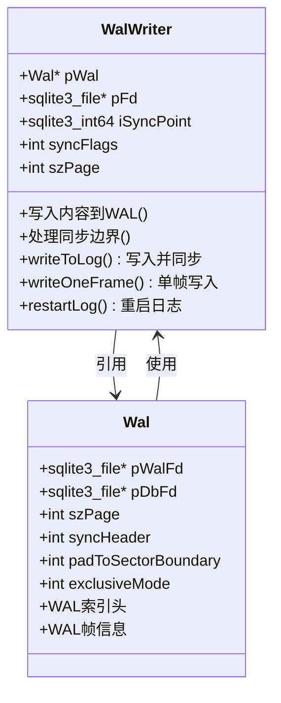

**图表来源**
- [wal.c](file://src/wal.c#L3893-L3934)

### WAL同步策略

WAL模式下的同步遵循以下原则：

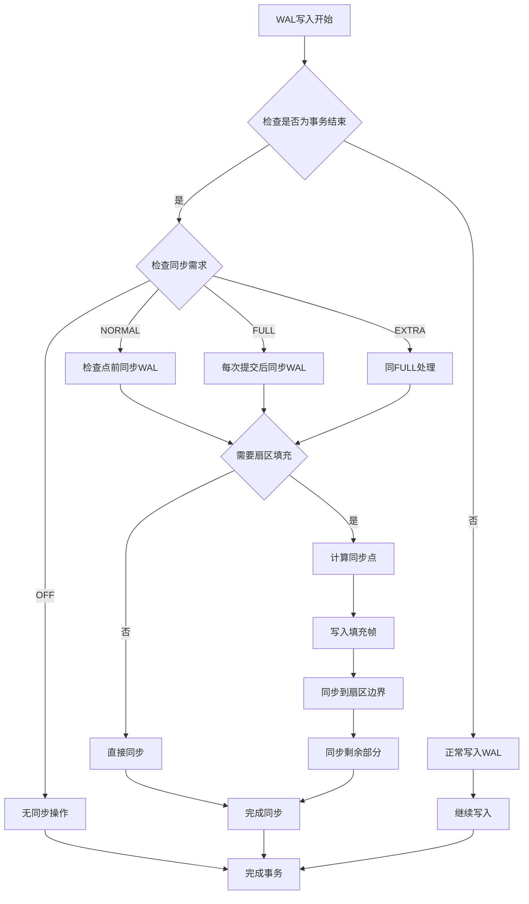

**图表来源**
- [wal.c](file://src/wal.c#L4157-L4190)

### WAL同步标志宏

SQLite定义了专门的宏来提取WAL和检查点操作的同步标志：

| 宏名 | 定义 | 用途 |
|------|------|------|
| WAL_SYNC_FLAGS(X) | ((X)&0x03) | WAL提交同步标志 |
| CKPT_SYNC_FLAGS(X) | (((X)>>2)&0x03) | 检查点同步标志 |

**节来源**
- [wal.h](file://src/wal.h#L20-L25)
- [wal.c](file://src/wal.c#L4157-L4190)

## 存储设备特性优化

### 设备特性检测

SQLite能够自动检测存储设备的特性，从而优化同步策略：

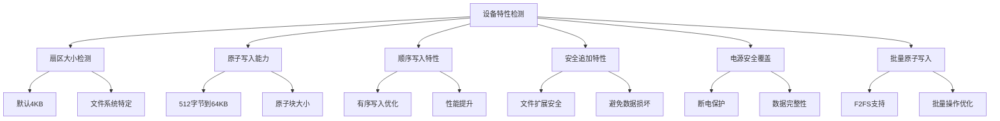

**图表来源**
- [os_unix.c](file://src/os_unix.c#L4150-L4256)

### 存储设备类型识别

不同类型的存储设备具有不同的特性：

| 设备类型 | 特性组合 | 推荐配置 |
|----------|----------|----------|
| 机械硬盘 | 原子写入512B, 安全追加 | NORMAL同步 |
| 固态硬盘 | 原子写入4KB+, 安全追加 | FULL同步 |
| 内存文件系统 | 原子写入, 顺序写入 | OFF同步 |
| 闪存设备 | 原子写入, 电源安全覆盖 | FULL同步 |

### 扇区对齐优化

SQLite会根据设备扇区大小进行优化：

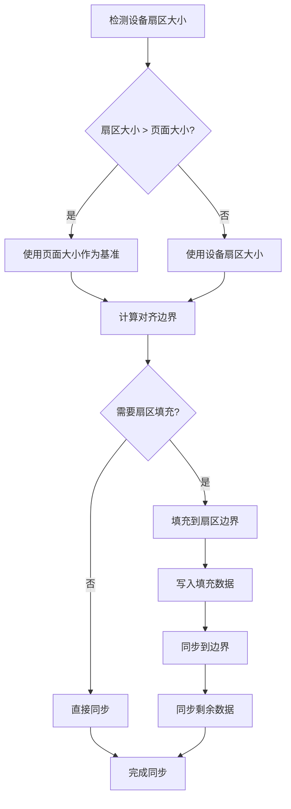

**图表来源**
- [wal.c](file://src/wal.c#L4157-L4190)

**节来源**
- [os_unix.c](file://src/os_unix.c#L4150-L4256)

## 错误处理与恢复策略

### I/O错误模拟机制

SQLite提供了完整的I/O错误模拟框架用于测试：

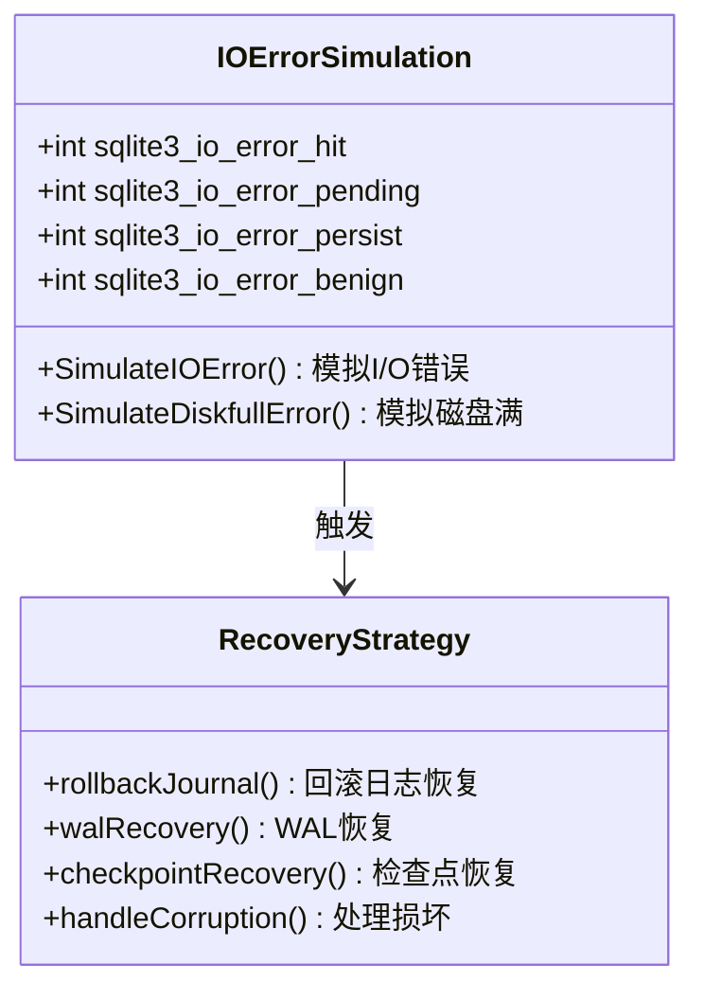

**图表来源**
- [os_common.h](file://src/os_common.h#L48-L98)

### 数据库损坏恢复流程

当同步失败或发生其他错误时，SQLite采用多层恢复策略：

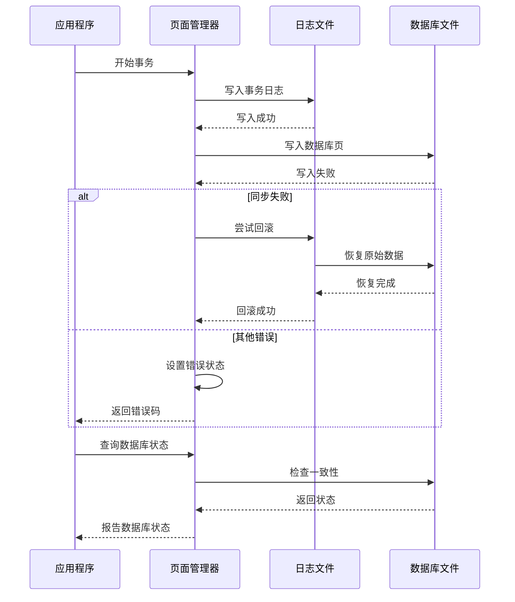

**图表来源**
- [pager.c](file://src/pager.c#L6300-L6500)

### WAL恢复机制

WAL模式下的恢复策略更加复杂：

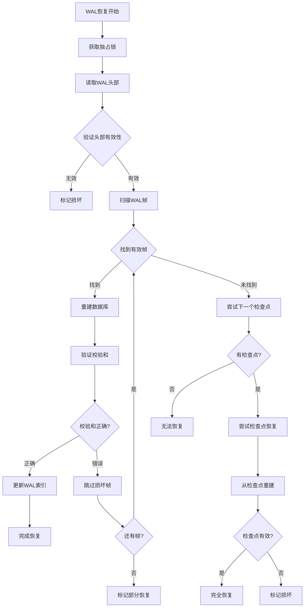

**图表来源**
- [wal.c](file://src/wal.c#L1369-L1407)

**节来源**
- [os_common.h](file://src/os_common.h#L48-L98)
- [pager.c](file://src/pager.c#L6300-L6500)
- [wal.c](file://src/wal.c#L1369-L1407)

## 性能优化建议

### 不同存储介质的优化策略

#### 机械硬盘优化

对于机械硬盘，推荐以下配置：

1. **同步模式**：使用NORMAL或FULL
2. **检查点频率**：适当降低，减少随机访问
3. **WAL文件大小**：限制在合理范围内
4. **预分配空间**：避免碎片化

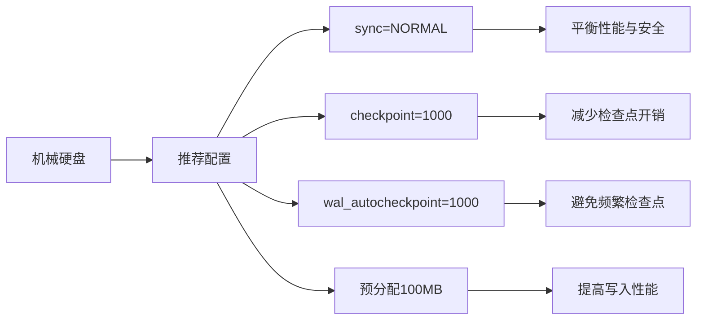

#### 固态硬盘优化

固态硬盘需要不同的优化策略：

1. **同步模式**：使用FULL以获得最佳数据安全性
2. **检查点频率**：可以更频繁，利用SSD的随机写入优势
3. **WAL文件大小**：保持较小，便于快速检查点
4. **TRIM支持**：启用垃圾回收

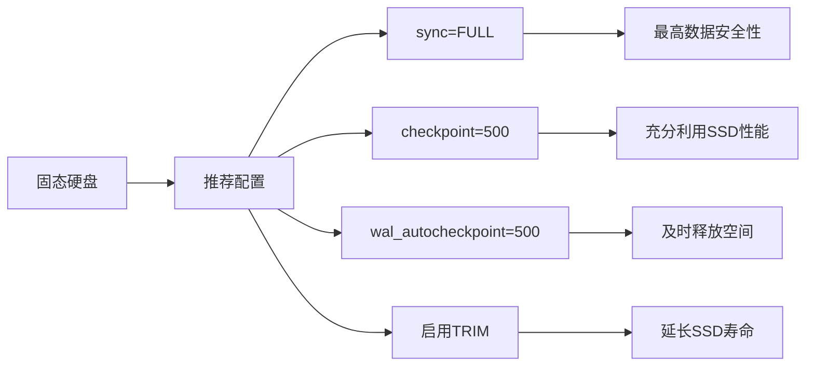

### 动态优化策略

SQLite可以根据运行时条件动态调整同步策略：

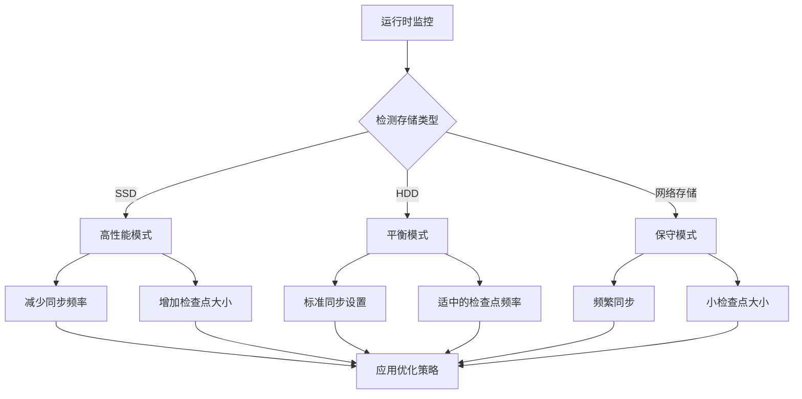

### 系统调用优化

不同平台的系统调用优化策略：

| 平台 | 优化技术 | 性能提升 |
|------|----------|----------|
| Linux | fdatasync()替代fsync() | 10-20% |
| macOS | 条件性F_FULLFSYNC | 5-15% |
| Windows | FlushFileBuffers() | 5-10% |
| FreeBSD | fcntl(F_FULLFSYNC) | 8-12% |

**节来源**
- [os_unix.c](file://src/os_unix.c#L3625-L3720)
- [os_win.c](file://src/os_win.c#L3313-L3351)

## 总结

SQLite的文件同步操作是一个精心设计的多层次系统，它在保证数据安全性的前提下，通过平台特定的优化策略实现了优异的性能表现。

### 关键要点

1. **抽象层设计**：通过sqlite3OsSync抽象层实现了跨平台的一致性
2. **多级同步策略**：从简单的fsync()到复杂的WAL检查点，提供了灵活的选择
3. **智能优化**：根据存储设备特性自动调整同步策略
4. **容错机制**：完善的错误检测和恢复机制确保数据完整性
5. **性能平衡**：在数据安全性和系统性能之间找到了最佳平衡点

### 最佳实践建议

1. **生产环境**：使用FULL同步模式确保数据安全
2. **开发测试**：使用NORMAL模式获得更好的性能
3. **特殊场景**：根据具体硬件特性调整同步策略
4. **监控告警**：建立同步失败的监控和告警机制
5. **定期备份**：即使使用最高安全级别的同步，也应定期备份重要数据

通过深入理解这些同步机制，开发者可以更好地配置SQLite以适应不同的应用场景，同时确保数据的安全性和系统的稳定性。