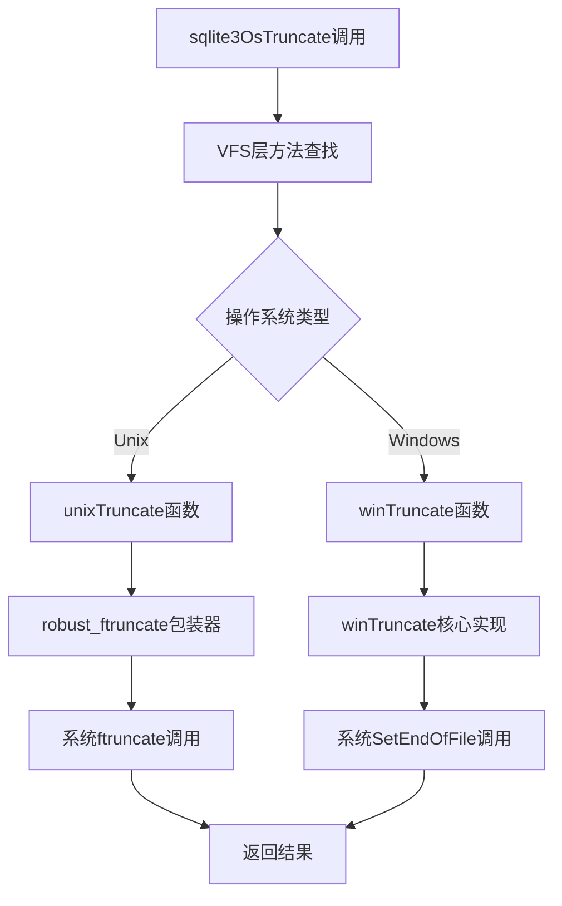
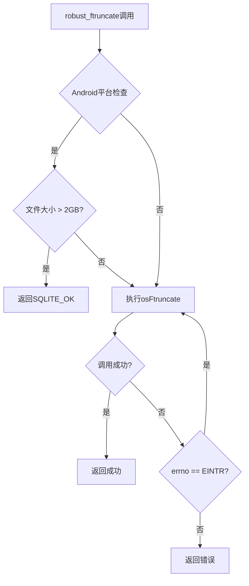
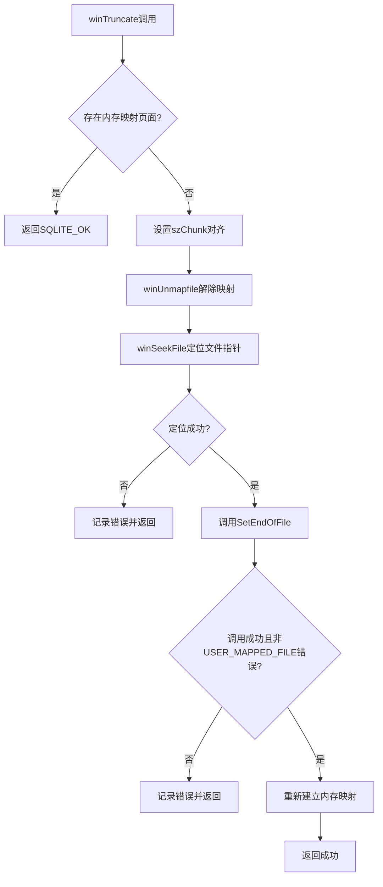
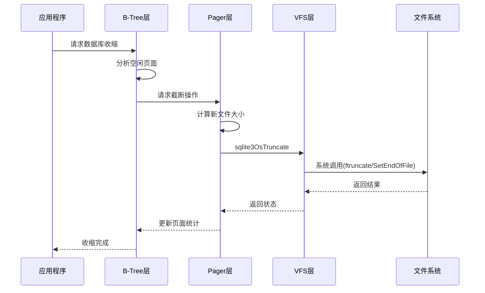
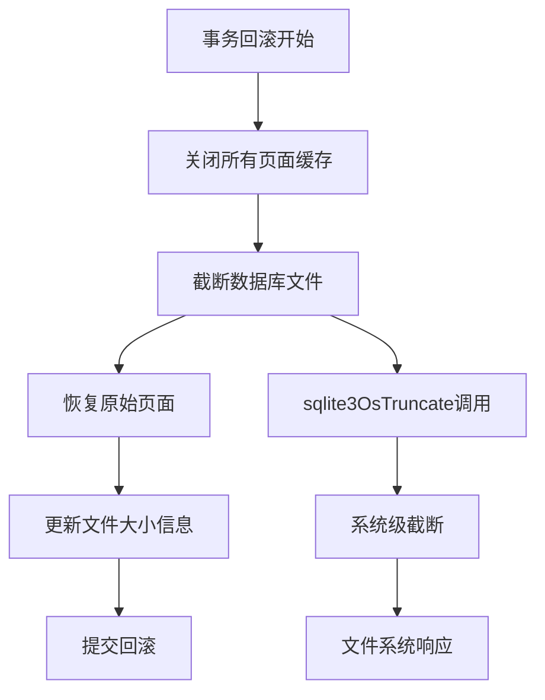

# 文件截断操作

<cite>
**本文档中引用的文件**
- [os.c](file://src/os.c)
- [os.h](file://src/os.h)
- [os_unix.c](file://src/os_unix.c)
- [os_win.c](file://src/os_win.c)
- [pager.c](file://src/pager.c)
- [btree.c](file://src/btree.c)
- [vacuum.c](file://src/vacuum.c)
- [backup.c](file://src/backup.c)
- [dbpage.c](file://src/dbpage.c)
</cite>

## 目录
1. [简介](#简介)
2. [sqlite3OsTruncate函数概述](#sqlite3ostruncate函数概述)
3. [Unix系统调用实现](#unix系统调用实现)
4. [Windows系统调用实现](#windows系统调用实现)
5. [截断操作与B-Tree页分配](#截断操作与b-tree页分配)
6. [Pager模块协同工作](#pager模块协同工作)
7. [只读文件系统处理](#只读文件系统处理)
8. [安全执行检查清单](#安全执行检查清单)
9. [故障排除指南](#故障排除指南)
10. [总结](#总结)

## 简介

文件截断操作是SQLite数据库管理系统中的关键功能，主要用于数据库收缩、回滚操作和空间回收。当数据库文件不再需要某些页面时，截断操作可以将文件大小缩减到实际使用的大小，从而释放磁盘空间并提高性能。

SQLite通过`sqlite3OsTruncate`函数提供了跨平台的文件截断接口，该函数在不同的操作系统上使用相应的系统调用来实现具体功能。对于Unix系统，使用`ftruncate`系统调用；对于Windows系统，则使用`SetEndOfFile`系统调用。

## sqlite3OsTruncate函数概述

`sqlite3OsTruncate`是SQLite的虚拟文件系统(VFS)层提供的核心接口函数，用于将打开的文件截断到指定的大小。

**图表来源**
- [os.c](file://src/os.c#L95-L97)
- [os_unix.c](file://src/os_unix.c#L3829-L3863)
- [os_win.c](file://src/os_win.c#L3179-L3208)

**节来源**
- [os.c](file://src/os.c#L95-L97)
- [os.h](file://src/os.h#L178-L178)

## Unix系统调用实现

在Unix系统上，SQLite使用`ftruncate`系统调用来实现文件截断功能。这个实现包含多个层次的安全性和兼容性考虑。

### robust_ftruncate包装器

Unix实现的核心是一个名为`robust_ftruncate`的包装函数，它提供了以下关键特性：

1. **Android平台特殊处理**：在Android平台上，`ftruncate`总是使用32位偏移量，即使定义了`_FILE_OFFSET_BITS=64`。对于大于2GB的文件截断请求，会静默忽略这些请求。

2. **EINTR信号处理**：自动重试因中断信号(EINTR)导致的失败调用，确保系统调用的可靠性。

3. **错误处理**：提供统一的错误处理机制，将POSIX错误码转换为SQLite特定的错误代码。

**图表来源**
- [os_unix.c](file://src/os_unix.c#L885-L895)

### Unix Truncate函数

`unixTruncate`函数是VFS层直接调用的入口点，它实现了以下功能：

1. **块大小对齐**：如果配置了块大小(chunk-size)，则将文件大小调整为块大小的整数倍。

2. **错误模拟支持**：在测试模式下支持模拟I/O错误。

3. **调试信息记录**：在调试模式下记录事务计数器的变化。

**节来源**
- [os_unix.c](file://src/os_unix.c#L3829-L3863)
- [os_unix.c](file://src/os_unix.c#L885-L895)

## Windows系统调用实现

Windows平台上的文件截断实现更加复杂，需要考虑内存映射文件和文件锁定等额外因素。

### winTruncate核心实现

Windows版本的`winTruncate`函数具有以下特点：

1. **内存映射文件处理**：在存在未释放的内存映射页面时，截断操作会被忽略，以避免破坏现有游标。

2. **文件定位**：使用`winSeekFile`函数将文件指针定位到目标位置。

3. **错误处理**：专门处理`ERROR_USER_MAPPED_FILE`错误，这是Windows特有的内存映射文件相关错误。

**图表来源**
- [os_win.c](file://src/os_win.c#L3179-L3208)

### Windows特定错误处理

Windows实现包含了针对不同错误情况的专门处理：

- **ERROR_USER_MAPPED_FILE**：表示文件被其他进程映射，这种情况下不进行截断操作
- **文件定位失败**：记录具体的错误代码并返回相应的SQLite错误
- **SetEndOfFile失败**：获取详细的Windows错误码并转换为SQLite错误

**节来源**
- [os_win.c](file://src/os_win.c#L3179-L3208)

## 截断操作与B-Tree页分配

文件截断操作与SQLite的B-Tree页面分配机制紧密相关，特别是在数据库收缩和增量真空操作中。

### B-Tree页面管理流程

**图表来源**
- [btree.c](file://src/btree.c#L6452-L6487)
- [pager.c](file://src/pager.c#L1394-L1413)

### 空闲列表处理

当数据库页面被删除时，它们不会立即从文件中移除，而是被添加到空闲列表中。只有在数据库收缩操作中，这些页面才会真正从文件中移除。

**节来源**
- [btree.c](file://src/btree.c#L6452-L6734)

## Pager模块协同工作

Pager模块负责管理数据库文件的物理布局，包括页面的读取、写入和截断操作。截断操作在Pager模块中有多个应用场景。

### 回滚操作中的截断

在事务回滚过程中，SQLite需要将数据库文件截断到事务开始前的状态：

**图表来源**
- [pager.c](file://src/pager.c#L1394-L1413)

### 日志文件管理

在事务提交过程中，日志文件可能需要被截断以释放空间：

- **零长度截断**：在某些情况下，日志文件会被截断为零长度
- **大小限制截断**：根据配置的日志文件大小限制进行截断
- **同步保证**：确保截断操作完成后数据已正确写入磁盘

**节来源**
- [pager.c](file://src/pager.c#L1394-L1413)

## 只读文件系统处理

在只读文件系统或网络存储环境中，文件截断操作可能会失败。SQLite提供了相应的错误处理机制。

### 错误检测和报告

不同操作系统下的截断失败会有不同的表现：

| 操作系统 | 常见错误 | SQLite错误代码 | 处理方式 |
|---------|---------|---------------|---------|
| Unix | EROFS, EPERM | SQLITE_PERM | 静默忽略或报告权限错误 |
| Windows | ERROR_ACCESS_DENIED | SQLITE_PERM | 明确的权限错误报告 |
| 网络存储 | 各种网络错误 | SQLITE_IOERR | 根据具体错误类型处理 |

### 安全降级策略

当截断操作失败时，SQLite采用以下策略：

1. **忽略操作**：在某些情况下，截断失败不会影响数据库完整性
2. **记录警告**：在调试模式下记录详细的错误信息
3. **继续运行**：允许数据库在截断失败的情况下继续正常操作

**节来源**
- [os_unix.c](file://src/os_unix.c#L895-L932)

## 安全执行检查清单

为了确保文件截断操作的安全执行，需要遵循以下检查清单：

### 事前检查

- [ ] **文件锁定状态**：确保文件没有被其他进程锁定
- [ ] **权限验证**：确认当前进程有写入权限
- [ ] **可用空间检查**：确保有足够的磁盘空间进行临时操作
- [ ] **内存映射状态**：检查是否存在未释放的内存映射页面

### 执行过程监控

- [ ] **系统调用监控**：跟踪底层系统调用的执行状态
- [ ] **错误码捕获**：捕获并记录所有可能的错误情况
- [ ] **资源清理**：确保在失败情况下正确清理资源

### 事后验证

- [ ] **文件大小验证**：确认文件大小已正确调整
- [ ] **页面完整性检查**：验证数据库页面的完整性
- [ ] **缓存一致性**：确保页面缓存与文件系统一致

## 故障排除指南

### 常见问题及解决方案

#### 1. 截断操作失败

**症状**：数据库收缩操作无法完成，文件大小保持不变

**可能原因**：
- 文件被其他进程锁定
- 权限不足
- 磁盘空间不足
- 文件系统不支持截断操作

**解决步骤**：
1. 检查文件锁定状态
2. 验证进程权限
3. 检查磁盘空间
4. 尝试手动截断文件

#### 2. 内存映射冲突

**症状**：在Windows系统上，截断操作被忽略但没有报错

**原因**：存在未释放的内存映射页面

**解决方案**：
- 确保所有数据库连接都已关闭
- 等待内存映射页面自动释放
- 调整应用程序的页面访问模式

#### 3. 大文件截断问题

**症状**：大文件（>2GB）截断操作无效

**原因**：平台特定的限制

**解决方案**：
- 分批进行截断操作
- 使用替代的文件压缩工具
- 考虑文件分割策略

**节来源**
- [os_unix.c](file://src/os_unix.c#L885-L895)
- [os_win.c](file://src/os_win.c#L3179-L3208)

## 总结

SQLite的文件截断操作是一个多层次、跨平台的复杂功能，涉及VFS层、Pager层和B-Tree层的协同工作。通过`sqlite3OsTruncate`函数，SQLite提供了统一的接口来处理不同操作系统下的文件截断需求。

### 关键特性总结

1. **跨平台兼容性**：统一的API接口，底层使用平台特定的系统调用
2. **安全性保障**：多层错误处理和恢复机制
3. **性能优化**：智能的块对齐和批量操作
4. **容错能力**：在网络存储和只读文件系统中的优雅降级

### 最佳实践建议

- 在执行数据库收缩操作前，确保没有活跃的数据库连接
- 对于大型数据库文件，考虑分批进行截断操作
- 在生产环境中监控截断操作的成功率和性能
- 建立适当的备份策略，以防截断操作失败导致数据丢失

通过深入理解文件截断操作的工作原理和最佳实践，开发者可以更好地利用SQLite的数据库收缩功能，优化应用程序的存储效率和性能表现。